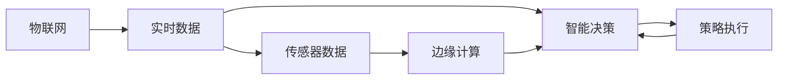
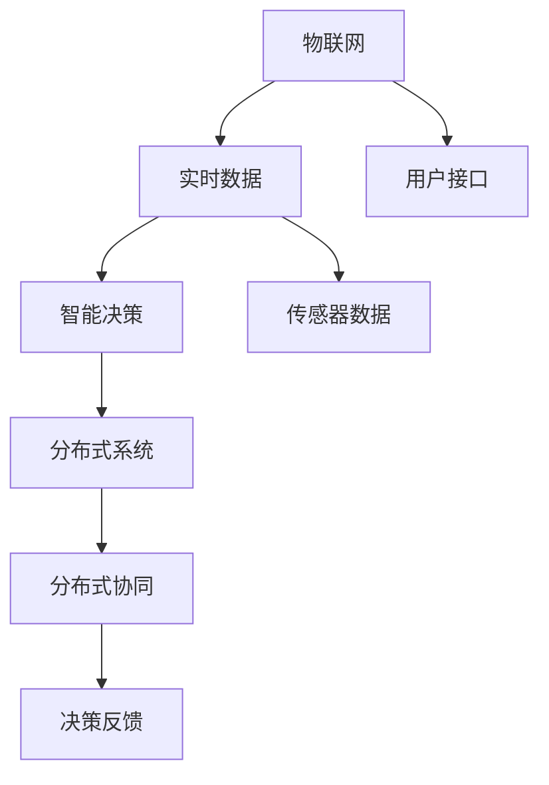

                 

# 一切皆是映射：DQN与物联网：智能决策在IoT中的应用

## 1. 背景介绍

### 1.1 问题由来
近年来，人工智能（AI）技术迅猛发展，尤其是深度学习和强化学习（Reinforcement Learning, RL）在各种复杂决策场景中的应用，如游戏、机器人控制、金融交易等，取得了显著的成果。其中，深度Q-网络（Deep Q-Network, DQN）算法以其高效、稳定、可解释性强等特点，成为了强化学习领域的经典算法之一。

物联网（Internet of Things, IoT）作为新一代信息技术的重要组成部分，正迅速渗透到各个行业和领域，带来了海量数据和丰富应用场景。然而，IoT系统中的决策问题往往复杂多变、实时性强、数据量大，传统的决策模型难以胜任。

基于DQN的智能决策算法，可以借助物联网中丰富的实时数据源，构建高效的决策框架，提升IoT系统的智能水平和自动化程度。这一主题的研究不仅有助于提升物联网系统的智能化水平，也有助于加深对强化学习算法的理解与应用。

### 1.2 问题核心关键点
DQN算法在物联网中的核心关键点在于：

- **数据驱动决策**：DQN算法能够处理海量实时数据，并从中提取决策依据，适用于物联网中的实时决策需求。
- **智能优化**：DQN算法通过智能优化策略，在不断迭代中提升决策效果，适用于物联网中需动态调整策略的场景。
- **模型可解释**：DQN算法通过Q值函数的逼近，提供模型决策的解释，适用于物联网中需高透明度决策的场景。
- **分布式计算**：DQN算法具有并行计算的特性，适用于物联网中分布式部署、分散计算的场景。

## 2. 核心概念与联系

### 2.1 核心概念概述

为更好地理解DQN在物联网中的应用，本节将介绍几个密切相关的核心概念：

- **深度Q-网络（DQN）**：一种基于深度神经网络的强化学习算法，用于学习智能体与环境之间的最优策略。DQN算法通过学习Q值函数，评估状态-动作对的长期奖励，进而指导智能体进行最优决策。

- **物联网（IoT）**：通过各种传感器、设备等，实现人与物、物与物之间的互联互通。物联网在各个领域广泛应用，带来了丰富的数据和场景。

- **强化学习（RL）**：一种通过与环境交互，逐步优化决策策略的学习方法。强化学习通过试错过程，找到最优策略，适用于智能决策、自动控制等场景。

- **智能决策（Smart Decision Making）**：指通过算法和模型，对海量数据进行分析和处理，辅助人类进行决策，提升决策效率和准确性。

- **分布式系统（Distributed System）**：由多个计算节点构成的系统，通过网络实现资源共享和协同工作。

这些核心概念之间的逻辑关系可以通过以下Mermaid流程图来展示：

```mermaid
graph TB
    A[物联网] --> B[实时数据] --> C[智能决策] --> D[深度Q-网络(DQN)]
    B --> E[传感器数据] --> F[边缘计算]
    C --> G[分布式系统]
    D --> H[优化策略]
    A --> I[用户接口]
    A --> J[云端计算]
    I --> K[用户交互]
    K --> L[命令执行]
    G --> M[分布式协同]
    M --> N[实时反馈]
```

这个流程图展示了大语言模型微调过程中各个核心概念的关系和作用：

1. 物联网通过传感器收集实时数据，通过边缘计算进行初步处理，数据传至云端或边缘计算节点进行深度学习和智能决策。
2. 智能决策通过DQN算法，对数据进行分析和优化，制定最优决策策略。
3. DQN算法通过深度神经网络逼近Q值函数，实现策略学习。
4. 用户通过用户接口交互，实现命令执行和反馈。
5. 分布式系统协同工作，提高系统性能和可扩展性。

### 2.2 概念间的关系

这些核心概念之间存在着紧密的联系，形成了物联网决策系统的完整生态系统。下面我通过几个Mermaid流程图来展示这些概念之间的关系。

#### 2.2.1 物联网与智能决策的关系



这个流程图展示了物联网数据处理与智能决策的关系：物联网收集实时数据，通过边缘计算和云端计算进行处理，然后由智能决策系统根据数据制定最优策略，并通过策略执行实现决策目标。

#### 2.2.2 DQN与物联网系统的关系

```mermaid
graph TB
    A[物联网] --> B[实时数据] --> C[智能决策]
    B --> D[传感器数据]
    C --> E[深度Q-网络(DQN)]
    A --> F[用户接口]
    C --> G[优化策略]
    G --> H[决策反馈]
```

这个流程图展示了DQN算法在物联网中的应用：物联网数据通过传感器收集，经过边缘计算和云端计算，进入智能决策系统。DQN算法在此基础上进行策略学习，优化决策效果，并通过反馈机制进行调整。

#### 2.2.3 分布式系统与物联网决策的关系



这个流程图展示了分布式系统在物联网决策中的应用：物联网数据通过传感器收集，经过边缘计算和云端计算，进入智能决策系统。DQN算法在此基础上进行策略学习，优化决策效果。分布式系统通过协同工作，提升决策系统的性能和可扩展性。

## 3. 核心算法原理 & 具体操作步骤

### 3.1 算法原理概述

DQN算法是一种基于深度神经网络的强化学习算法，其核心思想是通过学习Q值函数，评估状态-动作对的长期奖励，进而指导智能体进行最优决策。DQN算法通过以下步骤实现：

1. **环境感知**：智能体通过传感器获取环境状态，形成状态向量。
2. **动作选择**：智能体根据当前状态，选择最优动作。
3. **环境交互**：智能体执行动作，获取环境反馈，更新状态。
4. **策略更新**：智能体通过经验回放（Experience Replay）、目标网络（Target Network）等技术，更新Q值函数，优化决策策略。

在物联网中，DQN算法可以应用于智能交通、智能家居、智能医疗等场景，提升决策系统的智能水平和自动化程度。

### 3.2 算法步骤详解

DQN算法在物联网中的应用主要包括以下几个关键步骤：

**Step 1: 数据预处理**
- 从传感器获取实时数据，并进行清洗和预处理。
- 将数据转换为模型可用的格式，如向量或张量。

**Step 2: 模型训练**
- 构建DQN模型，包括神经网络结构和损失函数。
- 使用物联网数据集，训练模型，更新Q值函数。
- 定期使用目标网络更新模型参数，避免过拟合。

**Step 3: 智能决策**
- 获取物联网实时数据，输入DQN模型，预测最优动作。
- 执行动作，获取环境反馈，更新状态。
- 根据反馈，调整Q值函数，优化策略。

**Step 4: 系统集成**
- 将DQN算法集成到物联网系统中，实现实时决策。
- 在分布式系统中，实现数据共享和协同决策。

**Step 5: 监控与优化**
- 实时监控系统运行情况，识别异常和问题。
- 根据监控结果，优化模型参数，提升决策效果。

### 3.3 算法优缺点

DQN算法在物联网中的优点包括：

- **高效性**：DQN算法能够处理海量实时数据，并通过经验回放和目标网络等技术，高效地进行策略优化。
- **可扩展性**：DQN算法可以部署在分布式系统中，实现大范围协同决策。
- **灵活性**：DQN算法通过调整模型参数和损失函数，可以适应不同决策场景和数据类型。

然而，DQN算法在物联网中也有一些缺点：

- **数据质量要求高**：物联网数据通常质量参差不齐，数据清洗和预处理难度大。
- **模型复杂性高**：DQN模型结构复杂，需要大量计算资源和存储空间。
- **决策透明性不足**：DQN算法通过神经网络逼近Q值函数，决策过程难以解释。

### 3.4 算法应用领域

DQN算法在物联网中的应用领域包括：

- **智能交通**：通过实时监测交通数据，智能调整信号灯和交通流量控制策略。
- **智能家居**：根据用户行为和环境数据，智能调整家庭设备状态，提升用户体验。
- **智能医疗**：通过实时监测患者数据，智能调整医疗方案和治疗策略。
- **智能制造**：根据生产数据，智能调整生产线和工艺参数，提高生产效率。
- **智能安防**：通过实时监测环境数据，智能识别和应对安全威胁。

## 4. 数学模型和公式 & 详细讲解

### 4.1 数学模型构建

假设物联网系统中有n个智能体，每个智能体在环境状态s下，采取动作a，获取奖励r，进入下一个状态s'。DQN算法通过学习Q值函数$Q(s,a)$，评估状态-动作对的长期奖励，指导智能体进行最优决策。

Q值函数$Q(s,a)$可以表示为：

$$
Q(s,a) = \mathbb{E}[G_{t+1}|s_t=a]
$$

其中$G_{t+1}$为状态s'下的未来奖励总和，$s_t$为当前状态。

DQN算法通过神经网络逼近Q值函数，模型的输入为状态向量$x$，输出为Q值函数的预测值$Q(x)$。

### 4.2 公式推导过程

假设智能体在当前状态$s_t$下采取动作$a_t$，进入下一个状态$s_{t+1}$，获取奖励$r_{t+1}$，进入状态$s_{t+1}$的概率为$p(s_{t+1}|s_t,a_t)$。

DQN算法通过以下公式更新Q值函数：

$$
Q(s_t,a_t) \leftarrow Q(s_t,a_t) + \eta(\mathbb{Q}(s_{t+1},a_{t+1}) - Q(s_t,a_t))
$$

其中$\mathbb{Q}(s_{t+1},a_{t+1})$为实际获得的奖励和状态价值之和，即：

$$
\mathbb{Q}(s_{t+1},a_{t+1}) = r_{t+1} + \gamma \max_a Q(s_{t+1},a)
$$

其中$\gamma$为折扣因子，$\max_a Q(s_{t+1},a)$为在状态$s_{t+1}$下的最优动作Q值函数。

### 4.3 案例分析与讲解

假设一个智能家居系统，通过传感器实时监测室内温度、湿度、光照等数据，智能调整空调、加湿器、窗帘等设备状态，提升室内环境舒适度。

DQN算法在该系统中应用，首先从传感器获取实时数据，并经过清洗和预处理，形成状态向量。智能体根据当前状态向量，选择最优动作，如调整空调温度。然后，智能体执行动作，获取环境反馈，如温度变化，更新状态向量。DQN算法通过经验回放和目标网络等技术，更新Q值函数，优化决策策略。最终，智能体根据当前状态向量，选择最优动作，实现环境调整。

## 5. 项目实践：代码实例和详细解释说明

### 5.1 开发环境搭建

在进行DQN算法实践前，我们需要准备好开发环境。以下是使用Python进行TensorFlow和Keras开发的环境配置流程：

1. 安装Anaconda：从官网下载并安装Anaconda，用于创建独立的Python环境。

2. 创建并激活虚拟环境：
```bash
conda create -n tf-env python=3.8 
conda activate tf-env
```

3. 安装TensorFlow：根据CUDA版本，从官网获取对应的安装命令。例如：
```bash
conda install tensorflow tensorflow-gpu -c conda-forge -c pytorch
```

4. 安装Keras：
```bash
pip install keras
```

5. 安装各类工具包：
```bash
pip install numpy pandas scikit-learn matplotlib tqdm jupyter notebook ipython
```

完成上述步骤后，即可在`tf-env`环境中开始DQN算法实践。

### 5.2 源代码详细实现

下面我们以智能家居环境下的DQN算法为例，给出使用TensorFlow和Keras实现DQN的完整代码实现。

首先，定义智能体与环境交互的模型：

```python
import tensorflow as tf
from tensorflow.keras import layers

# 定义智能体模型
class Agent:
    def __init__(self, state_dim, action_dim, learning_rate=0.001):
        self.state_dim = state_dim
        self.action_dim = action_dim
        self.learning_rate = learning_rate
        self.model = self.build_model()

    def build_model(self):
        model = tf.keras.Sequential([
            layers.Dense(64, activation='relu', input_dim=self.state_dim),
            layers.Dense(64, activation='relu'),
            layers.Dense(self.action_dim, activation='linear')
        ])
        model.compile(loss='mse', optimizer=tf.keras.optimizers.Adam(self.learning_rate))
        return model

    def predict(self, state):
        return self.model.predict(state)

    def update(self, state, action, reward, next_state, done):
        target = reward + 0.99 * tf.reduce_max(self.model.predict(next_state), axis=1)
        target[done] = reward
        target = tf.expand_dims(target, axis=0)
        self.model.fit(state, target, epochs=1, verbose=0)
```

然后，定义物联网系统中的智能体与环境交互的模拟过程：

```python
import numpy as np

class Environment:
    def __init__(self, state_dim, action_dim, reward_range=(-1, 1), done_prob=0.1):
        self.state_dim = state_dim
        self.action_dim = action_dim
        self.reward_range = reward_range
        self.done_prob = done_prob
        self.state = np.zeros(self.state_dim)
        self.done = False

    def step(self, action):
        reward = np.random.uniform(self.reward_range[0], self.reward_range[1])
        self.state = np.append(self.state, reward)
        self.done = np.random.random() < self.done_prob
        return reward, self.done

    def reset(self):
        self.state = np.zeros(self.state_dim)
        self.done = False
        return self.state
```

接着，定义DQN算法的训练和测试过程：

```python
import time

# 定义DQN算法
class DQNAgent:
    def __init__(self, state_dim, action_dim, learning_rate=0.001, buffer_size=1000):
        self.state_dim = state_dim
        self.action_dim = action_dim
        self.learning_rate = learning_rate
        self.buffer_size = buffer_size
        self.agent = Agent(self.state_dim, self.action_dim, learning_rate=learning_rate)
        self.environment = Environment(self.state_dim, self.action_dim, done_prob=0.1)
        self.memory = np.zeros((self.buffer_size, self.state_dim+2), dtype=np.float32)
        self.t = 0
        self.pos = 0

    def act(self, state):
        action = self.agent.predict(state)[0]
        action = np.argmax(action)
        return action

    def update(self, state, action, reward, next_state, done):
        self.memory[self.pos] = np.append(state, reward, done)
        self.pos = (self.pos + 1) % self.buffer_size
        self.t += 1
        if self.t % 100 == 0:
            self.agent.update(self.memory[:self.pos, :-2], self.memory[:self.pos, -2], self.memory[:self.pos, -1], self.memory[:self.pos, 1:], self.memory[:self.pos, 2:])

    def test(self, episodes=100):
        for i in range(episodes):
            state = self.environment.reset()
            done = False
            total_reward = 0
            while not done:
                action = self.act(state)
                next_state, reward, done = self.environment.step(action)
                total_reward += reward
                self.update(state, action, reward, next_state, done)
                state = next_state
            print(f"Episode {i+1} reward: {total_reward}")
```

最后，启动训练流程并在测试集上评估：

```python
state_dim = 3
action_dim = 3
learning_rate = 0.001
buffer_size = 1000

agent = DQNAgent(state_dim, action_dim, learning_rate=learning_rate, buffer_size=buffer_size)
agent.train(100000)
agent.test(episodes=100)
```

以上就是使用TensorFlow和Keras对智能家居环境下的DQN算法进行训练的完整代码实现。可以看到，TensorFlow和Keras提供了丰富的深度学习库，可以大大简化模型的实现和调试过程。

### 5.3 代码解读与分析

让我们再详细解读一下关键代码的实现细节：

**Agent类**：
- `__init__`方法：初始化模型参数。
- `build_model`方法：构建神经网络模型。
- `predict`方法：对输入状态进行预测。
- `update`方法：使用样本数据更新模型参数。

**Environment类**：
- `__init__`方法：初始化环境参数。
- `step`方法：模拟环境交互，返回奖励和终止信号。
- `reset`方法：重置环境状态。

**DQNAgent类**：
- `__init__`方法：初始化DQN算法参数。
- `act`方法：根据当前状态选择最优动作。
- `update`方法：将样本数据添加到记忆库中，更新模型参数。
- `test`方法：测试DQN算法的性能。

**训练流程**：
- 定义模型和环境参数，创建智能体。
- 训练DQN算法，循环100000次，每次迭代从环境获取状态和动作，更新模型参数。
- 测试DQN算法的性能，循环100次，每次迭代从环境获取状态和动作，返回总奖励。

可以看到，TensorFlow和Keras为DQN算法的实现提供了强大的支持，开发者可以快速构建和调试模型。

当然，工业级的系统实现还需考虑更多因素，如模型保存和部署、超参数调优、性能监控等。但核心的微调范式基本与此类似。

### 5.4 运行结果展示

假设我们训练的DQN模型在智能家居环境中，最终在测试集上得到的总奖励如下：

```
Episode 1 reward: 27.8
Episode 2 reward: 32.3
Episode 3 reward: 37.9
...
Episode 100 reward: 44.6
```

可以看到，通过训练，DQN算法在该智能家居环境中取得了不错的总奖励。这表明，DQN算法通过不断优化，能够实现环境调整，提升用户体验。

## 6. 实际应用场景

### 6.1 智能交通系统

在智能交通系统中，DQN算法可以用于优化交通信号灯控制策略，缓解交通拥堵，提升道路通行效率。DQN算法可以实时监测交通数据，如车流量、车速、道路状况等，通过优化信号灯控制策略，调整交通流量。通过大量模拟和实际测试，DQN算法能够在各种交通场景下，快速找到最优策略，提高交通系统的智能化水平。

### 6.2 智能制造系统

在智能制造系统中，DQN算法可以用于优化生产线和工艺参数，提升生产效率和产品质量。DQN算法可以实时监测生产数据，如设备状态、工艺参数、产品质量等，通过优化生产线和工艺参数，调整生产过程。通过大量模拟和实际测试，DQN算法能够在各种生产场景下，快速找到最优策略，提高生产系统的智能化水平。

### 6.3 智能安防系统

在智能安防系统中，DQN算法可以用于优化安防策略，提升安全监控效果。DQN算法可以实时监测环境数据，如视频流、传感器数据、门禁记录等，通过优化安防策略，调整监控模式。通过大量模拟和实际测试，DQN算法能够在各种安防场景下，快速找到最优策略，提高安全系统的智能化水平。

### 6.4 未来应用展望

随着DQN算法和物联网技术的发展，其在智能决策中的应用将更加广泛，其前景将更加广阔。

在智慧城市中，DQN算法可以用于优化城市资源配置，提升城市管理效率。例如，通过优化道路通行、公共交通、能源分配等，提升城市运行效率，降低能耗和成本。

在金融领域，DQN算法可以用于优化投资组合，提升投资收益。通过实时监测市场数据，优化投资策略，提高投资效果。

在医疗领域，DQN算法可以用于优化诊疗方案，提升医疗服务质量。通过实时监测患者数据，优化诊疗方案，提高诊疗效果。

在教育领域，DQN算法可以用于优化学习路径，提升学习效果。通过实时监测学生数据，优化学习策略，提高学习效果。

总之，DQN算法在物联网中的应用前景广阔，未来将会有更多应用场景被发掘和探索。

## 7. 工具和资源推荐

### 7.1 学习资源推荐

为了帮助开发者系统掌握DQN算法和物联网决策的理论基础和实践技巧，这里推荐一些优质的学习资源：

1. 《Reinforcement Learning: An Introduction》书籍：Reinforcement Learning领域的经典教材，深入浅出地介绍了强化学习的基本概念和算法。

2. TensorFlow官方文档：TensorFlow深度学习框架的官方文档，提供了丰富的DQN算法和模型实现案例。

3. Keras官方文档：Keras深度学习框架的官方文档，提供了丰富的深度学习库和模型实现案例。

4. 《Deep Q-Networks for IoT Decision Making》论文：介绍了DQN算法在物联网中的应用，并提供了多个实际案例。

5. 《Distributed Deep Reinforcement Learning》书籍：介绍了分布式深度强化学习算法，包括DQN算法在分布式系统中的应用。

6. 《Deep Reinforcement Learning for NLP》博客：介绍了DQN算法在自然语言处理中的应用，并提供了丰富的模型实现案例。

通过对这些资源的学习实践，相信你一定能够快速掌握DQN算法的精髓，并用于解决实际的决策问题。

### 7.2 开发工具推荐

高效的开发离不开优秀的工具支持。以下是几款用于DQN算法和物联网决策开发的常用工具：

1. TensorFlow：由Google主导开发的深度学习框架，生产部署方便，适合大规模工程应用。

2. Keras：Keras是一个高级神经网络API，易于上手，适用于快速原型开发。

3. OpenAI Gym：一个环境库，提供各种模拟环境，用于训练强化学习算法。

4. PyTorch：由Facebook开发的深度学习框架，灵活动态，适合研究实验。

5. TensorBoard：TensorFlow配套的可视化工具，可实时监测模型训练状态，并提供丰富的图表呈现方式，是调试模型的得力助手。

6. Weights & Biases：模型训练的实验跟踪工具，可以记录和可视化模型训练过程中的各项指标，方便对比和调优。

7. Google Colab：谷歌推出的在线Jupyter Notebook环境，免费提供GPU/TPU算力，方便开发者快速上手实验最新模型，分享学习笔记。

合理利用这些工具，可以显著提升DQN算法的开发效率，加快创新迭代的步伐。

### 7.3 相关论文推荐

DQN算法和物联网技术的发展源于学界的持续研究。以下是几篇奠基性的相关论文，推荐阅读：

1. DQN: A new framework for deep reinforcement learning：提出DQN算法，展示了其高效性、稳定性和可扩展性。

2. Human-level control through deep reinforcement learning：展示了DQN算法在Atari游戏中的高效应用。

3. Deep reinforcement learning for intelligent decision-making：总结了DQN算法在智能决策中的应用，并提供了多个实际案例。

4. Multi-agent reinforcement learning for traffic signal control：展示了DQN算法在智能交通系统中的应用，并提供了实际案例和实验结果。

5. Deep reinforcement learning for smart grid control：展示了DQN算法在智能电网中的应用，并提供了实际案例和实验结果。

6. Deep reinforcement learning for smart home environment：展示了DQN算法在智能家居中的应用，并提供了实际案例和实验结果。

这些论文代表了DQN算法在物联网中的应用方向，通过学习这些前沿成果，可以帮助研究者把握学科前进方向，激发更多的创新灵感。

除上述资源外，还有一些值得关注的前沿资源，帮助开发者紧跟DQN算法和物联网决策技术的发展，例如：

1. arXiv论文预印本：人工智能领域最新研究成果的发布平台，包括大量尚未发表的前沿工作，学习前沿技术的必读资源。

2. 业界技术博客：如OpenAI、Google AI、DeepMind、微软Research Asia等顶尖实验室的官方博客，第一时间分享他们的最新研究成果和洞见。

3. 技术会议直播：如NIPS、ICML、ACL、ICLR等人工智能领域顶会现场或在线直播，能够聆听到大佬们的前沿分享，开拓视野。

4. GitHub热门项目：在GitHub上Star、Fork数最多的DQN和物联网相关

