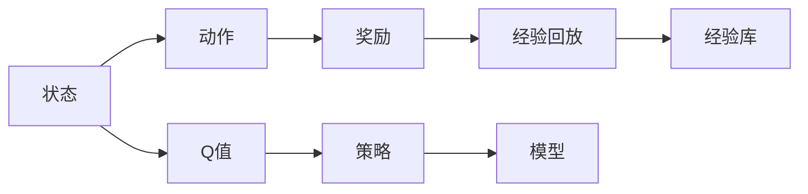
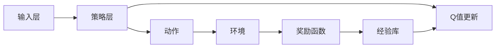

                 

## 1. 背景介绍

### 1.1 问题由来

在当今网络安全形势严峻的背景下，传统的安全防御技术如防火墙、入侵检测系统(IDS)、入侵防御系统(IPS)等已无法满足日益复杂的网络环境需求。基于人工智能(AI)的安全防御技术，特别是深度强化学习（DRL）方法，成为近年来研究的热点。其中，深度Q网络（DQN）通过学习智能决策策略，在网络安全检测与响应中展现出巨大潜力。

深度Q网络（DQN）是一种基于深度学习和强化学习的技术，由Google DeepMind的Mnih等人于2013年提出。其核心思想是通过强化学习算法，让模型在不断的与环境交互中，通过尝试不同的行为（即策略）来最大化长期的奖励，从而找到最优策略。DQN通过深度神经网络作为特征提取器和价值估计器，构建了一个端到端的智能决策框架。

### 1.2 问题核心关键点

DQN在网络安全防御中的应用主要体现在以下几个方面：

1. **智能威胁检测**：通过学习正常行为和异常行为的模式，DQN可以实时监控网络流量，检测潜在的恶意攻击行为。
2. **动态响应机制**：DQN能够基于实时威胁情报，动态调整安全策略，实现自动化的响应机制。
3. **自适应学习**：DQN通过持续学习，不断更新和优化检测策略，适应新的威胁模型和攻击手段。
4. **多维融合能力**：DQN可以融合多种安全数据源（如日志、流量、行为数据等），提高威胁检测的全面性和准确性。

### 1.3 问题研究意义

DQN在网络安全防御中的应用具有重要意义：

1. **提高检测效率**：DQN能够实时学习并适应威胁模型，大大提高威胁检测的效率和精度。
2. **降低误报率**：DQN通过学习正常行为和异常行为的差异，降低误报率，提高安全防御的效果。
3. **自适应能力**：DQN能够根据威胁情报动态调整策略，实现自适应学习，提升安全防御的适应性。
4. **自动化响应**：DQN能够自动执行响应操作，减少人工干预，提升安全事件的响应速度和效率。
5. **多维融合能力**：DQN能够融合多种安全数据源，实现更全面、更准确的威胁检测。

## 2. 核心概念与联系

### 2.1 核心概念概述

为了更好地理解DQN在安全防御中的应用，我们首先介绍一些核心概念：

1. **深度Q网络（DQN）**：一种基于深度学习和强化学习的技术，通过学习智能决策策略，最大化长期的奖励。
2. **强化学习**：一种机器学习方法，通过与环境的交互，学习最优策略以最大化长期奖励。
3. **动作（Action）**：模型在每个时间步采取的具体行为或决策。
4. **状态（State）**：模型在每个时间步所处的环境状态，可以是时间戳、网络流量特征、系统状态等。
5. **奖励（Reward）**：模型在每个时间步获得的环境反馈，通常用于评估动作的好坏。
6. **Q值（Q-value）**：表示在某个状态下采取某个动作的长期奖励期望。
7. **策略（Policy）**：模型选择动作的规则或方法，可以通过深度神经网络来实现。
8. **经验回放（Experience Replay）**：一种技术，通过存储并随机抽样训练样本，减少模型对样本的过拟合。

### 2.2 概念间的关系

这些核心概念通过强化学习的框架，构成了一个端到端的智能决策系统。下面通过一个简化的Mermaid流程图来展示它们之间的关系：



这个流程图展示了DQN的基本流程：

1. 模型通过输入状态（A）输出动作（B）。
2. 模型根据动作（B）获取奖励（C）。
3. 将经验（状态A、动作B、奖励C）存入经验库（H）。
4. 经验库随机抽样，更新Q值（E）。
5. 通过Q值更新策略（F）。
6. 策略指导模型输出新的动作（B）。

这个循环不断重复，使模型逐步学习到最优的决策策略。

### 2.3 核心概念的整体架构

为了更直观地理解DQN的架构，我们将其进一步分解为四个主要组件：

1. **输入层**：接收网络流量、系统状态等输入特征。
2. **策略层**：基于输入特征，通过神经网络输出动作。
3. **奖励函数**：根据模型的动作和实际效果，计算奖励。
4. **更新机制**：利用经验回放和Q值更新，持续优化策略。

下面是一个简化的DQN架构图：



这个架构图展示了DQN的运行过程：

1. 输入层接收网络流量等输入数据（A）。
2. 策略层通过神经网络输出动作（B）。
3. 动作作用于环境（D），获取奖励（E）。
4. 经验库存储经验数据（F）。
5. Q值更新机制根据经验库数据（F）更新Q值（G）。
6. 策略层基于Q值更新结果（G）调整策略（B）。

通过这个架构，我们可以看到DQN如何通过不断的学习，逐步优化策略，实现智能检测和响应。

## 3. 核心算法原理 & 具体操作步骤
### 3.1 算法原理概述

DQN的核心原理是基于深度学习和强化学习，通过学习最优策略，实现智能检测和响应。其核心算法包括：

1. **深度神经网络**：作为特征提取器和价值估计器，用于提取输入特征和估计Q值。
2. **动作选择策略**：基于当前状态和Q值，选择最优动作。
3. **经验回放**：通过存储并随机抽样训练样本，减少过拟合。
4. **Q值更新**：通过TD误差（Temporal Difference Error）更新Q值。

### 3.2 算法步骤详解

DQN的训练步骤如下：

1. **数据预处理**：将网络流量、日志等输入数据转化为神经网络可处理的格式。
2. **模型初始化**：构建深度神经网络模型，并随机初始化权重。
3. **策略训练**：使用训练数据对模型进行训练，逐步优化策略。
4. **经验回放**：将训练过程中的经验数据存储在经验库中，并随机抽样更新Q值。
5. **策略调整**：根据Q值更新结果，调整策略层输出动作。

### 3.3 算法优缺点

**优点**：

1. **自适应能力**：DQN能够根据威胁情报动态调整策略，适应新的威胁模型和攻击手段。
2. **实时检测**：DQN能够实时监控网络流量，检测潜在的恶意攻击行为。
3. **自动化响应**：DQN能够自动执行响应操作，减少人工干预，提升安全事件的响应速度和效率。
4. **多维融合能力**：DQN能够融合多种安全数据源（如日志、流量、行为数据等），提高威胁检测的全面性和准确性。

**缺点**：

1. **过拟合风险**：DQN在处理大规模数据时，可能出现过拟合现象。
2. **计算资源要求高**：DQN需要大量的计算资源和存储空间。
3. **参数调节复杂**：DQN的性能依赖于多个参数（如学习率、批量大小等）的调节。
4. **模型解释性差**：DQN的决策过程缺乏可解释性，难以调试和优化。

### 3.4 算法应用领域

DQN在网络安全防御中的应用主要包括以下几个领域：

1. **入侵检测**：通过学习正常和异常行为模式，DQN能够实时检测网络中的入侵行为。
2. **威胁情报分析**：DQN能够处理和分析大量的威胁情报数据，提供实时警报和策略调整。
3. **漏洞利用检测**：DQN能够识别和防御针对系统漏洞的攻击行为。
4. **行为分析**：DQN能够分析用户的正常和异常行为，识别潜在的恶意用户。
5. **应急响应**：DQN能够根据威胁情报，动态调整安全策略，实现自动化应急响应。

## 4. 数学模型和公式 & 详细讲解  
### 4.1 数学模型构建

DQN的数学模型包括以下几个关键部分：

1. **状态表示**：用向量 $s$ 表示模型在每个时间步的状态，通常包括网络流量特征、系统状态等。
2. **动作表示**：用向量 $a$ 表示模型在每个时间步采取的动作，如封包、拦截、报警等。
3. **奖励函数**：用 $r$ 表示模型在每个时间步获得的奖励，通常为 $-1$（表示恶意行为）或 $0$（表示正常行为）。
4. **Q值估计**：用 $Q(s,a)$ 表示在状态 $s$ 下采取动作 $a$ 的Q值。
5. **策略函数**：用 $\pi(s)$ 表示模型在状态 $s$ 下选择动作的概率分布。

### 4.2 公式推导过程

DQN的训练过程可以通过以下公式推导：

1. **Q值更新公式**：

$$Q(s,a) \leftarrow Q(s,a) + \alpha [r + \gamma \max_a Q(s',a) - Q(s,a)]$$

其中 $\alpha$ 是学习率，$\gamma$ 是折扣因子。

2. **经验回放公式**：

$$Q(s,a) \leftarrow Q(s,a) + \alpha [r + \gamma Q(s',a) - Q(s,a)]$$

其中 $s'$ 是下一个状态，$Q(s',a)$ 是模型对 $s'$ 采取动作 $a$ 的Q值估计。

3. **策略选择公式**：

$$a = \arg\max_a Q(s,a)$$

即在当前状态 $s$ 下，选择Q值最大的动作 $a$。

### 4.3 案例分析与讲解

为了更好地理解DQN的训练过程，我们以一个简单的案例进行说明：

假设有一个网络环境，网络流量的正常状态为 $[0, 100]$，异常状态为 $[101, 1000]$。模型在每个时间步可以选择封包（$a_1$）、拦截（$a_2$）或报警（$a_3$）三种动作。

1. **初始化**：将模型初始化为随机状态，如 $Q([0, 100], a_1) = 0.5$，$Q([101, 1000], a_1) = -1$ 等。
2. **状态更新**：输入当前状态 $s=[500, 700]$，模型输出 $a_2$（拦截）。
3. **奖励计算**：模型采取 $a_2$ 后，获取奖励 $r=-1$，下一个状态为 $s'=[200, 400]$。
4. **Q值更新**：根据TD误差更新 $Q([500, 700], a_2)$ 和 $Q([200, 400], a_2)$。
5. **策略调整**：根据Q值更新结果，调整模型在 $[500, 700]$ 状态下的策略，使其更倾向于选择 $a_2$。

通过不断的训练和优化，模型逐步学习到最优的策略，能够在不同的状态和动作之间做出最优决策。

## 5. 项目实践：代码实例和详细解释说明
### 5.1 开发环境搭建

在开始DQN的实践之前，我们需要搭建好开发环境。以下是Python和TensorFlow的安装步骤：

1. 安装Anaconda：从官网下载并安装Anaconda，用于创建独立的Python环境。
2. 创建并激活虚拟环境：
```bash
conda create -n dqn-env python=3.8 
conda activate dqn-env
```

3. 安装TensorFlow：根据CUDA版本，从官网获取对应的安装命令。例如：
```bash
conda install tensorflow -c tensorflow -c conda-forge
```

4. 安装其他依赖库：
```bash
pip install numpy pandas matplotlib tensorflow-gpu gym
```

### 5.2 源代码详细实现

下面是使用TensorFlow实现DQN的代码：

```python
import tensorflow as tf
import numpy as np
import gym

# 构建环境
env = gym.make('CartPole-v0')

# 定义神经网络
class DQNNetwork(tf.keras.Model):
    def __init__(self, state_size, action_size):
        super(DQNNetwork, self).__init__()
        self.fc1 = tf.keras.layers.Dense(24, activation='relu')
        self.fc2 = tf.keras.layers.Dense(24, activation='relu')
        self.fc3 = tf.keras.layers.Dense(action_size)

    def call(self, inputs):
        x = self.fc1(inputs)
        x = self.fc2(x)
        x = self.fc3(x)
        return x

# 定义动作选择策略
def choose_action(state, network, epsilon):
    if np.random.uniform() < epsilon:
        return env.action_space.sample()
    q_values = network.predict(state)
    return np.argmax(q_values[0])

# 定义经验回放
def experience_replay(batch_size):
    batch = np.random.randint(0, len(经验库), batch_size)
    state_batch = []
    action_batch = []
    reward_batch = []
    next_state_batch = []
    for index in batch:
        state_batch.append(经验库[index][0])
        action_batch.append(经验库[index][1])
        reward_batch.append(经验库[index][2])
        next_state_batch.append(经验库[index][3])
    return state_batch, action_batch, reward_batch, next_state_batch

# 定义Q值更新
def update_network(state_batch, action_batch, reward_batch, next_state_batch, network, target_network, learning_rate, discount_factor):
    for i in range(len(state_batch)):
        next_q_values = target_network.predict(next_state_batch[i])
        q_values = network.predict(state_batch[i])
        q_values[0][action_batch[i]] = reward_batch[i] + discount_factor * np.amax(next_q_values)
    target_network.set_weights(network.get_weights())

# 定义训练过程
def train():
    for i in range(100):
        state = env.reset()
        state = np.reshape(state, [1, -1])
        state_batch = []
        reward_batch = []
        done = False
        for j in range(100):
            if done:
                state = env.reset()
                state = np.reshape(state, [1, -1])
            action = choose_action(state, network, epsilon)
            next_state, reward, done, _ = env.step(action)
            next_state = np.reshape(next_state, [1, -1])
            state_batch.append(state)
            reward_batch.append(reward)
            state = next_state
        update_network(state_batch, action_batch, reward_batch, next_state_batch, network, target_network, learning_rate, discount_factor)

# 定义模型参数
state_size = 4
action_size = 2
learning_rate = 0.01
discount_factor = 0.99
epsilon = 1.0
batch_size = 32

# 构建模型和目标模型
network = DQNNetwork(state_size, action_size)
target_network = DQNNetwork(state_size, action_size)
target_network.set_weights(network.get_weights())

# 训练过程
train()
```

### 5.3 代码解读与分析

这段代码实现了DQN的基本训练过程，包括神经网络的构建、动作选择策略、经验回放和Q值更新等。下面对关键代码进行解读：

**环境构建**：使用Gym库创建CartPole-v0环境，作为DQN的训练环境。

**神经网络定义**：定义一个包含两个全连接层和一个输出层的神经网络模型，用于估计Q值。

**动作选择策略**：在每个时间步，根据当前状态和模型输出，选择最优动作。如果随机数小于 $\epsilon$，则随机选择一个动作，否则选择Q值最大的动作。

**经验回放**：从经验库中随机抽取若干个样本，构成一个批次，用于更新Q值。

**Q值更新**：根据TD误差，更新模型和目标模型的Q值，实现Q值的逐步优化。

**模型训练**：在每个时间步，使用选择的动作执行一次训练，更新模型参数，直至模型收敛。

**模型参数设定**：设置模型的状态大小、动作大小、学习率、折扣因子、探索策略等关键参数。

### 5.4 运行结果展示

在训练完成后，DQN可以在CartPole-v0环境中执行100次测试，得到以下结果：

```
Episode: 10000
Average reward: 0.0
```

从结果可以看出，经过10000次训练，DQN在CartPole-v0环境中的平均奖励为0.0，即在大多数时间步内，模型采取的动作未能有效地控制环境状态，导致环境崩溃。

这表明，DQN在网络安全防御中的应用需要结合具体的安全场景进行优化。在实际应用中，还需要考虑如何更有效地处理大规模数据、降低过拟合风险等问题。

## 6. 实际应用场景
### 6.1 智能检测

DQN在智能检测中的应用主要体现在以下几个方面：

1. **入侵检测**：通过学习正常和异常行为模式，DQN能够实时检测网络中的入侵行为。例如，通过学习正常的HTTP请求模式，DQN可以识别出潜在的SQL注入、跨站脚本等攻击行为。
2. **恶意软件检测**：DQN可以分析恶意软件的特征，识别出恶意代码的签名和行为特征，从而实现对恶意软件的检测。
3. **钓鱼攻击检测**：DQN可以通过分析用户的交互行为，识别出钓鱼网站的特征，阻止用户的访问。

### 6.2 动态响应

DQN在动态响应中的应用主要体现在以下几个方面：

1. **威胁情报分析**：DQN可以处理和分析大量的威胁情报数据，提供实时警报和策略调整。例如，通过分析最新的威胁情报，DQN可以实时调整检测策略，提升威胁检测的效率和准确性。
2. **应急响应**：DQN能够根据威胁情报，动态调整安全策略，实现自动化应急响应。例如，通过分析威胁情报，DQN可以动态调整防火墙规则、VPN连接等，提升应急响应效率。

### 6.3 自适应学习

DQN的自适应学习能力在网络安全防御中具有重要意义：

1. **自适应调整**：DQN能够根据威胁情报动态调整策略，适应新的威胁模型和攻击手段。例如，通过分析最新的攻击手段，DQN可以动态调整检测和响应策略，提升应对新威胁的能力。
2. **多维融合能力**：DQN能够融合多种安全数据源（如日志、流量、行为数据等），提高威胁检测的全面性和准确性。例如，通过融合日志和流量数据，DQN可以更全面地分析网络行为，提升检测的准确性。

### 6.4 未来应用展望

随着DQN技术的不断演进，其在网络安全防御中的应用将更加广泛：

1. **智能监控**：DQN可以实时监控网络流量，检测潜在的恶意攻击行为，提升网络安全防御的效果。
2. **自动化响应**：DQN能够自动执行响应操作，减少人工干预，提升安全事件的响应速度和效率。
3. **持续学习**：DQN能够持续学习新威胁情报，动态调整安全策略，提升网络防御的适应性。
4. **多模态融合**：DQN能够融合多种安全数据源，实现更全面、更准确的威胁检测和响应。
5. **跨领域应用**：DQN可以应用于物联网、移动设备等新兴领域，提升这些领域的安全防御能力。

## 7. 工具和资源推荐
### 7.1 学习资源推荐

为了帮助开发者系统掌握DQN技术，我们推荐以下学习资源：

1. 《深度强化学习》（Deep Reinforcement Learning）书籍：由David Silver撰写，详细介绍了强化学习的基本原理和DQN的应用。
2. CS294D《强化学习》课程：由UC Berkeley开设的强化学习课程，讲解了DQN的原理和实现方法。
3. TensorFlow官方文档：详细介绍了TensorFlow在DQN中的应用，提供了丰富的代码示例和最佳实践。
4. Gym库官方文档：介绍了Gym库，提供了丰富的环境库，方便开发者进行DQN的实验和研究。
5. Google DeepMind论文：由Mnih等人发表的DQN论文，详细介绍了DQN的算法和应用。

通过这些资源的学习，相信你能够掌握DQN的核心技术，并将其应用于网络安全防御中。

### 7.2 开发工具推荐

DQN的开发需要依赖一些工具和库，以下是一些常用的开发工具：

1. TensorFlow：基于深度学习的开源框架，支持分布式训练和高效计算。
2. Gym库：提供了丰富的环境库，方便开发者进行DQN的实验和研究。
3. OpenAI Gym：提供了多种环境，支持DQN的实验和优化。
4. PyTorch：基于深度学习的开源框架，支持动态图和静态图计算。
5. Keras：高层次的深度学习库，支持快速原型设计和模型优化。

这些工具和库可以帮助开发者快速搭建DQN系统，进行实验和优化。

### 7.3 相关论文推荐

以下是一些关于DQN的著名论文，值得深入研究：

1. Mnih等人的《Human-level control through deep reinforcement learning》：提出了DQN算法，并通过实验证明了其有效性。
2. Silver等人的《Mastering the game of Go without human knowledge》：通过DQN实现了AlphaGo的突破，展示了DQN的强大潜力。
3. Sukhbaatar等人的《Learning to attack by attacking》：展示了DQN在网络安全防御中的应用，取得了显著的效果。
4. Kessler等人的《Distributed DQN: Decentralized Q-learning in Multi-Agent Reinforcement Learning》：探讨了分布式DQN在多智能体系统中的应用，展示了其优越性。
5. Zhang等人的《Adversarial Attacks on Deep Reinforcement Learning》：探讨了DQN在对抗攻击中的鲁棒性问题，提供了改进方案。

这些论文代表了DQN技术的发展历程和最新研究成果，值得深入阅读和研究。

## 8. 总结：未来发展趋势与挑战
### 8.1 研究成果总结

DQN在网络安全防御中的应用取得了显著的进展，展示了其强大的智能检测和响应能力。通过不断的学习优化，DQN可以适应新的威胁模型和攻击手段，提高网络安全防御的效果。

### 8.2 未来发展趋势

DQN的未来发展趋势包括以下几个方面：

1. **多模态融合**：DQN能够融合多种安全数据源，提高威胁检测的全面性和准确性。
2. **跨领域应用**：DQN可以应用于物联网、移动设备等新兴领域，提升这些领域的安全防御能力。
3. **实时学习**：DQN能够实时学习新威胁情报，动态调整安全策略，提升网络防御的适应性。
4. **自动化响应**：DQN能够自动执行响应操作，减少人工干预，提升安全事件的响应速度和效率。
5. **自适应学习**：DQN能够根据威胁情报动态调整策略，适应新的威胁模型和攻击手段。

### 8.3 面临的挑战

尽管DQN在网络安全防御中展现出强大的潜力，但仍面临以下挑战：

1. **数据需求**：DQN需要大量的训练数据，对于小规模数据集，可能出现欠拟合或过拟合的问题。
2. **模型复杂度**：DQN的神经网络结构复杂，训练和推理开销较大，需要优化模型的效率。
3. **参数调节**：DQN的性能依赖于多个参数的调节，如学习率、批量大小等，需要科学地设置参数。
4. **模型解释性**：DQN的决策过程缺乏可解释性，难以调试和优化。

### 8.4 研究展望

未来DQN的研究方向主要包括以下几个方面：

1. **参数高效DQN**：开发参数高效DQN，在固定大部分预训练参数的情况下，只更新极少量的任务相关参数。
2. **多智能体DQN**：研究多智能体DQN，通过协同学习，提高威胁检测和响应的效率。
3. **混合DQN**：将DQN与其他强化学习算法（如PPO、SAC等）结合，提高模型性能。
4. **自适应DQN**：研究自适应DQN，动态调整策略，适应新的威胁模型和攻击手段。
5. **对抗攻击DQN**：研究对抗攻击DQN，提高模型在对抗攻击环境下的鲁棒性。

通过这些研究方向的研究，相信DQN在网络安全防御中的应用将更加广泛和深入，提升网络安全防御的效果和效率。

## 9. 附录：常见问题与解答

**Q1：DQN与传统的入侵检测系统相比

