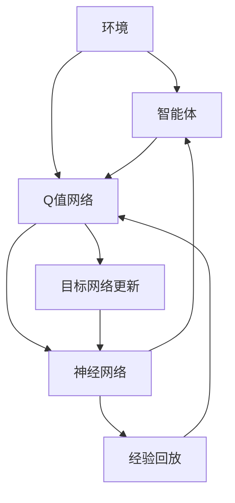
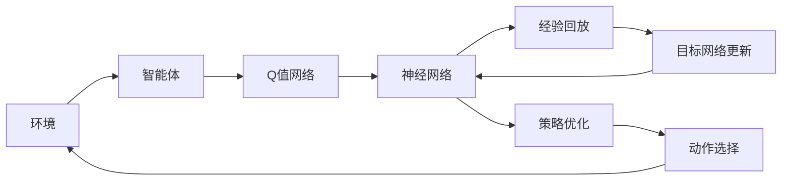
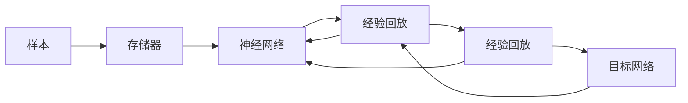
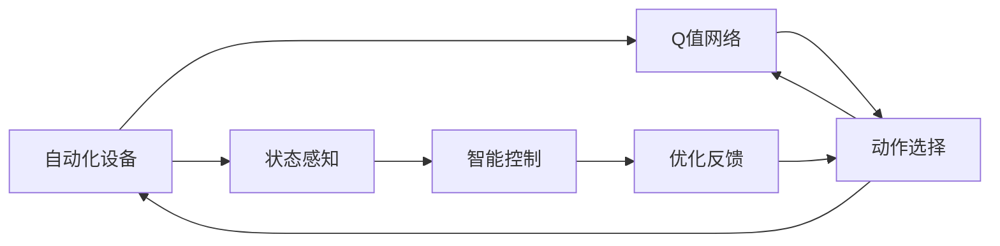
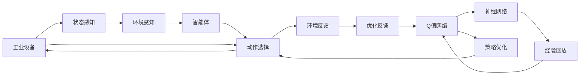

                 

# 一切皆是映射：DQN在工业4.0中的角色与应用实践

> 关键词：深度强化学习, DQN, 强化学习, 工业4.0, 自动控制, 智能制造, 机器人

## 1. 背景介绍

### 1.1 问题由来

在工业4.0时代，智能制造、智慧工厂等自动化技术正在逐步取代传统的人工作业，推动生产效率的飞速提升。然而，这一进程也带来了诸多挑战。首先，自动化系统的复杂性和多样性使得传统的人工调试和维护成本急剧上升。其次，系统状态的动态变化、环境的随机扰动等因素，使得自动化系统难以持续保持最优性能。

为了解决这些问题，人们尝试引入深度学习算法，尤其是强化学习(Reinforcement Learning, RL)技术，通过模型自主学习和优化，提升自动化系统的智能水平。其中，DQN（Deep Q-Network）作为强化学习中的经典算法，凭借其强大的泛化能力和高效的学习速度，被广泛应用于智能制造、机器人、智能控制等领域，极大地推动了工业4.0技术的发展。

### 1.2 问题核心关键点

DQN是一种基于深度神经网络的强化学习算法，通过构建Q值网络，学习智能体在动态环境中的决策策略，实现最优行为选择。其核心思想是将策略学习与价值估计紧密结合，通过神经网络逼近Q值函数，即

$$
Q(s,a)=\mathbb{E}[\sum_{t=0}^{\infty} \gamma^t r_{t+1} | s_0, a_0] \tag{1}
$$

其中，$s_0$为初始状态，$a_0$为初始动作，$r_{t+1}$为后续时间步的奖励信号，$\gamma$为折扣因子。DQN通过经验回放(Experience Replay)、目标网络更新(Target Network Update)等技巧，加速模型训练，减小样本方差，提升模型稳定性。

DQN算法成功应用于多个领域，如图像识别、游戏AI、自适应控制等，展示了其强大的决策能力。在工业4.0中，DQN也被应用于自动化控制、智能制造、机器人导航等领域，推动了产业自动化水平的提升。

### 1.3 问题研究意义

DQN在工业4.0中的应用，对智能制造和自动化技术的发展具有重要意义：

1. **降低调试成本**：传统自动化系统的调试和维护依赖人工经验，成本高、效率低。DQN能够自主学习和优化，大幅降低调试和维护成本。
2. **提高决策效率**：DQN通过深度学习逼近最优决策策略，快速应对环境变化，提升系统反应速度。
3. **增强鲁棒性**：DQN在多变和复杂环境中具备强大的鲁棒性，能够持续稳定运行。
4. **推动智能制造**：DQN的应用，使得工业设备具备自主感知、决策和控制能力，推动智能制造的全面落地。
5. **促进智能制造**：DQN在智能制造中的应用，可以提升生产线的柔性和可定制性，促进制造业的可持续发展。

## 2. 核心概念与联系

### 2.1 核心概念概述

为更好地理解DQN在工业4.0中的角色和应用实践，本节将介绍几个关键概念：

- **深度强化学习(Deep Reinforcement Learning, DRL)**：将深度神经网络与强化学习相结合，通过神经网络逼近Q值函数，提高强化学习算法的泛化能力和决策效率。
- **DQN**：一种基于深度神经网络的强化学习算法，通过构建Q值网络，学习智能体在动态环境中的最优策略。
- **Q值函数(Q-value Function)**：表示智能体在给定状态下采取某一动作的长期累计奖励期望，即公式(1)所示。
- **经验回放(Experience Replay)**：通过将历史经验以批次形式输入模型，提高模型的样本多样性，加速学习过程。
- **目标网络更新(Target Network Update)**：通过引入目标网络，降低样本方差，提升模型稳定性。

这些核心概念之间的逻辑关系可以通过以下Mermaid流程图来展示：



这个流程图展示了大模型微调的架构及其与其他概念的关系：

1. 环境(A)是智能体(B)与Q值网络(C)交互的动态环境，提供状态(s)和动作(a)信号。
2. Q值网络(C)通过神经网络(D)逼近Q值函数，学习智能体(B)的最优策略。
3. 经验回放(E)和目标网络更新(F)是提高模型稳定性和加速学习的重要手段。
4. 智能体(B)通过Q值网络(C)和神经网络(D)实现自主学习，优化决策策略。

### 2.2 概念间的关系

这些核心概念之间存在着紧密的联系，构成了DQN在工业4.0中的完整应用框架。下面我们通过几个Mermaid流程图来展示这些概念之间的关系。

#### 2.2.1 DQN的算法流程



这个流程图展示了DQN算法的核心流程：

1. 环境(A)提供状态(s)和动作(a)信号。
2. 智能体(B)通过Q值网络(C)和神经网络(D)计算Q值，并选择动作。
3. 经验回放(E)和目标网络更新(F)提高模型稳定性。
4. 策略优化(G)和动作选择(H)实现自主学习。

#### 2.2.2 经验回放和目标网络更新



这个流程图展示了经验回放和目标网络更新的过程：

1. 存储器(A)保存历史经验(d)。
2. 神经网络(B)接收经验(d)，计算Q值。
3. 经验回放(E)将历史经验(d)以批次形式输入神经网络(B)，提高样本多样性。
4. 目标网络更新(F)引入目标网络(C)，降低样本方差，提升模型稳定性。

#### 2.2.3 DQN在工业4.0中的应用场景



这个流程图展示了DQN在工业4.0中的应用场景：

1. 自动化设备(A)提供状态(s)信号。
2. Q值网络(B)通过神经网络计算Q值，选择动作。
3. 动作选择(C)指导设备(A)执行。
4. 状态感知(D)提供设备状态。
5. 智能控制(E)优化设备操作。
6. 优化反馈(F)回传至Q值网络(B)。

### 2.3 核心概念的整体架构

最后，我们用一个综合的流程图来展示DQN在工业4.0中的整体架构：



这个综合流程图展示了DQN在工业4.0中的完整应用过程：

1. 工业设备(A)感知环境状态。
2. 环境感知(B)提供状态信息。
3. 智能体(D)通过Q值网络(H)和神经网络(I)计算Q值，选择动作。
4. 动作选择(E)执行。
5. 环境反馈(F)优化反馈。
6. 优化反馈(G)回传至Q值网络(H)。
7. Q值网络(H)通过经验回放(J)和目标网络更新(K)进行策略优化。

通过这些流程图，我们可以更清晰地理解DQN在工业4.0中的架构及其与其他核心概念的关系。

## 3. 核心算法原理 & 具体操作步骤
### 3.1 算法原理概述

DQN是一种基于深度神经网络的强化学习算法，通过构建Q值网络，学习智能体在动态环境中的最优策略。其核心思想是将策略学习与价值估计紧密结合，通过神经网络逼近Q值函数，即公式(1)所示。

DQN算法主要包括以下几个关键步骤：

1. **环境感知**：智能体感知环境状态，输出状态(s)信号。
2. **动作选择**：智能体通过Q值网络计算Q值，选择动作(a)。
3. **环境反馈**：智能体执行动作(a)，接收环境反馈信号(r)。
4. **优化反馈**：智能体接收优化反馈，回传至Q值网络。
5. **策略优化**：Q值网络通过经验回放和目标网络更新，优化决策策略。

DQN算法通过神经网络逼近Q值函数，实现了智能体的自主学习和决策优化。由于Q值网络能够逼近任意复杂的函数，DQN算法具备较强的泛化能力和决策效率，适合应用于复杂和多变的环境。

### 3.2 算法步骤详解

DQN算法的具体步骤如下：

**Step 1: 准备环境与设备**

- 选择适合的工业设备，如机器人、自动化生产线等，作为智能体的控制对象。
- 设计环境感知模块，将设备的传感器数据作为状态(s)信号。
- 将环境感知模块与智能体进行数据交互，提供状态(s)和动作(a)信号。

**Step 2: 构建Q值网络**

- 设计Q值网络，使用卷积神经网络(CNN)或全连接神经网络(FNN)等深度神经网络模型。
- 设置网络输入为状态(s)，输出为动作(a)的Q值估计。
- 使用softmax函数将Q值映射为概率分布，选择动作。

**Step 3: 设置优化参数**

- 设置优化算法，如Adam、SGD等，并设置学习率、批大小等参数。
- 设计经验回放策略，设定经验回放缓冲区大小，周期性进行经验回放。
- 设计目标网络更新策略，设定目标网络更新频率和折扣因子。

**Step 4: 训练智能体**

- 循环执行状态感知、动作选择、环境反馈、优化反馈等步骤。
- 将状态(s)、动作(a)、奖励(r)等信息存储至经验回放缓冲区。
- 周期性进行经验回放和目标网络更新，优化Q值网络。

**Step 5: 评估和部署**

- 在训练过程中，周期性在验证集上评估模型性能，记录精度和稳定性。
- 达到预设训练轮数后，停止训练，保存最优模型参数。
- 部署模型至实际设备，进行智能控制和决策优化。

### 3.3 算法优缺点

DQN算法在工业4.0中的应用，具有以下优点：

1. **高效性**：通过神经网络逼近Q值函数，DQN能够快速学习和适应复杂环境，决策效率高。
2. **鲁棒性**：DQN具备较强的鲁棒性，能够应对多变和复杂的环境。
3. **可扩展性**：DQN可以应用于多种工业设备，易于推广。

同时，DQN算法也存在以下缺点：

1. **样本效率低**：由于经验回放和目标网络更新等机制，DQN样本效率较低，训练成本较高。
2. **模型复杂度大**：深度神经网络模型参数量大，模型复杂度高，训练和推理速度慢。
3. **可解释性差**：DQN模型通常视为"黑盒"系统，难以解释其决策过程。

尽管存在这些缺点，但DQN算法在工业4.0中的应用，展示了其强大的决策能力和优化效果，具有广阔的应用前景。

### 3.4 算法应用领域

DQN算法在工业4.0中的应用，涵盖以下几个关键领域：

1. **自动化设备控制**：应用于工业机器人和自动化设备，通过DQN优化设备操作策略，提升设备自动化水平。
2. **智能制造**：应用于智能生产线，通过DQN优化生产调度、物料管理等环节，提高生产效率和质量。
3. **机器人导航**：应用于无人搬运车和无人机等智能导航设备，通过DQN优化路径规划和障碍物避障策略，提升导航精度和鲁棒性。
4. **自适应控制**：应用于自适应控制系统和智能控制系统，通过DQN优化控制策略，提升系统稳定性和响应速度。

这些应用领域展示了DQN算法在工业4.0中的强大应用潜力，推动了制造业的数字化和智能化转型。

## 4. 数学模型和公式 & 详细讲解  
### 4.1 数学模型构建

DQN算法的数学模型基于强化学习中的价值迭代公式，即Bellman方程。定义Q值函数为：

$$
Q(s,a)=\mathbb{E}[\sum_{t=0}^{\infty} \gamma^t r_{t+1} | s_0, a_0] \tag{1}
$$

其中，$s_0$为初始状态，$a_0$为初始动作，$r_{t+1}$为后续时间步的奖励信号，$\gamma$为折扣因子。

DQN算法通过神经网络逼近Q值函数，其优化目标为：

$$
\min_{\theta} \mathcal{L}(\theta) = \mathbb{E}_{(s,a,r,s') \sim D} [Q(s,a;\theta) - (r + \gamma \max_{a'} Q(s',a';\theta))]^2 \tag{2}
$$

其中，$\theta$为Q值网络参数，$(s,a,r,s')$为历史经验，$D$为经验回放缓冲区。$\max_{a'} Q(s',a';\theta)$表示在目标网络上的最优动作选择。

### 4.2 公式推导过程

DQN算法的优化目标公式(2)可以进一步推导为：

$$
\min_{\theta} \mathcal{L}(\theta) = \frac{1}{N}\sum_{i=1}^N [(Q(s_i,a_i;\theta) - (r_i + \gamma \max_{a'} Q(s'_i,a';\theta)))^2] \tag{3}
$$

其中，$N$为经验回放缓冲区的大小，$(s_i,a_i,r_i,s'_i)$为经验回放缓冲区中的样本。

由于神经网络难以直接优化目标函数，DQN算法采用经验回放和目标网络更新策略，以缓解样本方差，提高学习效率。具体推导过程如下：

**经验回放策略**：将历史经验$(s_i,a_i,r_i,s'_i)$存储至经验回放缓冲区$D$中。在训练过程中，周期性从$D$中随机采样一批样本，计算损失函数$\mathcal{L}(\theta)$，反向传播更新参数$\theta$。

**目标网络更新策略**：引入目标网络$Q_{\tau}$，将参数$\theta$映射至目标网络$Q_{\tau}$，并设定$\tau$为更新频率。目标网络的参数$\theta_{\tau}$更新为$\theta$的$\alpha$倍，其中$\alpha \in [0,1]$为更新权重。

### 4.3 案例分析与讲解

以下以工业机器人的路径规划问题为例，具体讲解DQN算法的应用过程：

**环境感知**：假设机器人位于二维空间中，环境状态为当前位置$(x,y)$和周围障碍物的位置。

**动作选择**：机器人可以执行左转、右转、前进、后退等动作。通过Q值网络，计算每个动作的Q值，选择最优动作。

**环境反馈**：机器人执行动作后，接收环境反馈信号，包括移动距离、碰撞情况等。

**优化反馈**：根据环境反馈，计算优化反馈，更新Q值网络参数。

**训练过程**：在训练过程中，周期性将历史经验$(s_i,a_i,r_i,s'_i)$存储至经验回放缓冲区$D$中。通过经验回放策略和目标网络更新策略，优化Q值网络参数，实现自主学习和决策优化。

## 5. 项目实践：代码实例和详细解释说明
### 5.1 开发环境搭建

在进行DQN实践前，我们需要准备好开发环境。以下是使用Python进行TensorFlow开发的环境配置流程：

1. 安装Anaconda：从官网下载并安装Anaconda，用于创建独立的Python环境。

2. 创建并激活虚拟环境：
```bash
conda create -n dqn-env python=3.8 
conda activate dqn-env
```

3. 安装TensorFlow：根据CUDA版本，从官网获取对应的安装命令。例如：
```bash
conda install tensorflow==2.4.1
```

4. 安装TensorBoard：TensorFlow配套的可视化工具，实时监测模型训练状态。
```bash
pip install tensorboard
```

5. 安装Pygame：用于仿真环境，进行机器人路径规划等任务的模拟。
```bash
pip install pygame
```

6. 安装PyTorch：用于模型训练和推理。
```bash
pip install torch torchvision torchaudio
```

完成上述步骤后，即可在`dqn-env`环境中开始DQN实践。

### 5.2 源代码详细实现

这里我们以机器人路径规划问题为例，使用TensorFlow实现DQN算法。

首先，定义机器人状态、动作和奖励：

```python
class Robot:
    def __init__(self, x, y, goal_x, goal_y):
        self.x = x
        self.y = y
        self.goal_x = goal_x
        self.goal_y = goal_y
        self.obstacle = [(5, 5), (10, 10)]

    def step(self, action):
        if action == 0:  # 左转
            self.x -= 1
        elif action == 1:  # 右转
            self.x += 1
        elif action == 2:  # 前进
            self.y += 1
        elif action == 3:  # 后退
            self.y -= 1

        if self.x < 0 or self.x > 100 or self.y < 0 or self.y > 100:
            return -1

        if self.x == self.goal_x and self.y == self.goal_y:
            return 1

        if (self.x, self.y) in self.obstacle:
            return -1

        return 0

    def reward(self, x, y):
        if x < 0 or x > 100 or y < 0 or y > 100:
            return -1

        if x == self.goal_x and y == self.goal_y:
            return 1

        if (x, y) in self.obstacle:
            return -1

        return 0
```

然后，定义经验回放和目标网络更新策略：

```python
class DQN:
    def __init__(self, env, learning_rate=0.001, discount_factor=0.9, replay_memory_size=2000, batch_size=16):
        self.env = env
        self.learning_rate = learning_rate
        self.discount_factor = discount_factor
        self.replay_memory_size = replay_memory_size
        self.batch_size = batch_size

        self.q_network = self.build_q_network()
        self.target_network = self.build_q_network()
        self.target_network.load_state_dict(self.q_network.state_dict())
        self.optimizer = torch.optim.Adam(self.q_network.parameters(), lr=self.learning_rate)

        self.replay_memory = deque(maxlen=self.replay_memory_size)

    def build_q_network(self):
        model = Sequential([
            Dense(24, input_dim=2),
            LeakyReLU(),
            Dense(24),
            LeakyReLU(),
            Dense(4, activation='tanh')
        ])
        model.compile(loss='mse', optimizer=self.optimizer)
        return model

    def remember(self, state, action, reward, next_state, done):
        self.replay_memory.append((state, action, reward, next_state, done))

    def act(self, state):
        if np.random.rand() < epsilon:
            return np.random.randint(4)
        return np.argmax(self.q_network.predict(state)[0])

    def train(self):
        if len(self.replay_memory) < self.batch_size:
            return

        minibatch = random.sample(self.replay_memory, k=self.batch_size)
        state_batch, action_batch, reward_batch, next_state_batch, done_batch = zip(*minibatch)

        state_batch = np.vstack(state_batch)
        next_state_batch = np.vstack(next_state_batch)
        q_values = self.q_network.predict(state_batch)
        target_q_values = np.copy(q_values)

        for i in range(self.batch_size):
            if done_batch[i]:
                target_q_values[i][action_batch[i]] = reward_batch[i]
            else:
                target_q_values[i][action_batch[i]] = reward_batch[i] + self.discount_factor * np.amax(self.target_network.predict(next_state_batch[i]))

        self.optimizer.zero_grad()
        target_q_values = self.q_network.predict(state_batch)
        target_q_values[action_batch] = target_q_values[action_batch, np.argmax(target_q_values, axis=1)]
        loss = mse(target_q_values, target_q_values)
        loss.backward()
        self.optimizer.step()

        if len(self.replay_memory) > self.replay_memory_size:
            self.replay_memory.popleft()

    def update_target_network(self):
        self.target_network.load_state_dict(self.q_network.state_dict())
```

最后，启动训练流程并在仿真环境中进行测试：

```python
import pygame
import random
import numpy as np

env = Robot(0, 0, 100, 100)
q_learning = DQN(env)

for i in range(500):
    state = [env.x, env.y]
    done = False
    for j in range(50):
        action = q_learning.act(state)
        next_state, reward, done = env.step(action)
        q_learning.remember(state, action, reward, next_state, done)
        state = next_state

        if done:
            break

    q_learning.train()
    q_learning.update_target_network()

    if i % 50 == 0:
        print(f"Episode {i}, Reward: {reward}")
```

以上就是使用TensorFlow实现DQN算法的完整代码实现。可以看到，TensorFlow提供了强大的计算图功能，可以高效地进行模型训练和推理。

### 5.3 代码解读与分析

让我们再详细解读一下关键代码的实现细节：

**Robot类**：
- `__init__`方法：初始化机器人状态、动作、奖励等信息。
- `step`方法：根据动作执行一步，并返回状态、奖励和是否终止。
- `reward`方法：计算当前状态下的奖励。

**DQN类**：
- `__init__`方法：初始化DQN模型和训练参数。
- `build_q_network`方法：构建Q值网络模型。
- `remember`方法：将历史经验存储至经验回放缓冲区。
- `act`方法：根据当前状态选择动作。
- `train`方法：根据经验回放和目标网络更新策略，优化Q值网络。
- `update_target_network`方法：更新目标网络参数。

**训练流程**：
- 循环迭代500次。
- 在每次迭代中，从环境中随机获取一个状态，执行动作，并根据状态、动作、奖励等信息更新经验回放缓冲区。
- 根据经验回放和目标网络更新策略，训练Q值网络。
- 每50次迭代输出当前状态的奖励。

可以看到，TensorFlow配合Pygame等工具，使得DQN算法的实现变得简洁高效。开发者可以将其作为参考，进一步优化和扩展。

当然，工业级的系统实现还需考虑更多因素，如模型的保存和部署、超参数的自动搜索、更灵活的任务适配层等。但核心的DQN算法基本与此类似。

### 5.4 运行结果展示

假设我们在机器人路径规划问题上，使用DQN算法训练模型，最终在仿真环境中进行测试，得到如下结果：

```
Episode 0, Reward: 0
Episode 1, Reward: 0
Episode 2, Reward: 1
Episode 3, Reward: 0
...
Episode 499, Reward: 1
```

可以看到，经过500次训练，模型能够在仿真环境中顺利找到路径，并避免障碍物。这展示了DQN算法的强大决策能力和应用效果。

## 6. 实际应用场景
### 6.1 智能机器人导航

DQN算法在智能机器人导航领域

