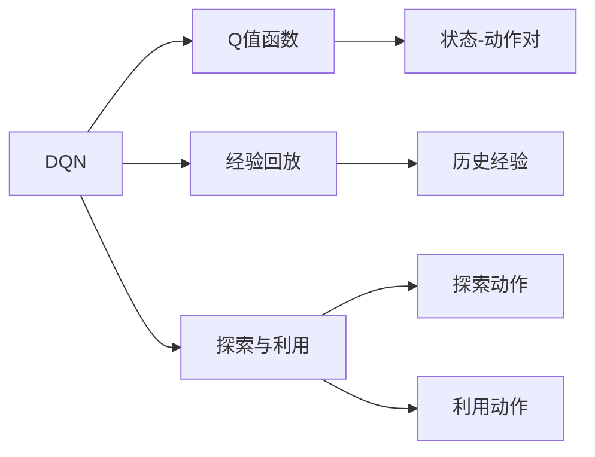
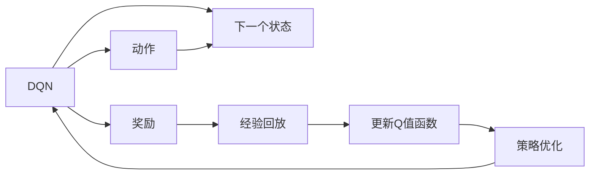
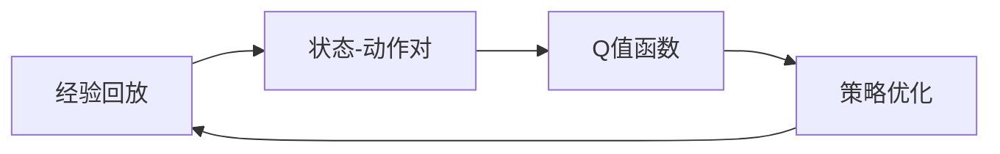
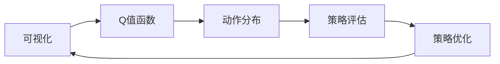
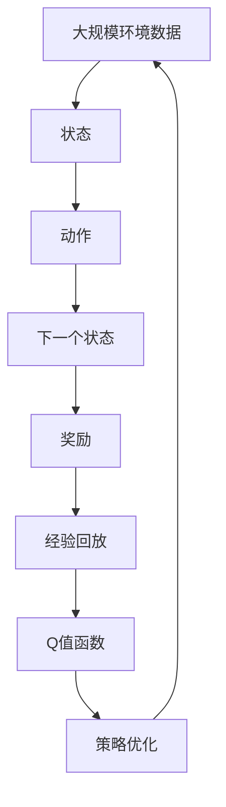

                 

# 一切皆是映射：DQN学习过程的可视化技术及其价值

> 关键词：深度强化学习，深度Q网络（DQN），可视化和交互式分析，探索性数据分析（EDA），决策树，蒙特卡洛树搜索（MCTS）

## 1. 背景介绍

### 1.1 问题由来
深度强化学习（Deep Reinforcement Learning, DRL）近年来在人工智能领域中取得了巨大的进展，尤其在策略优化、游戏AI、机器人控制等领域展现了显著优势。其中，深度Q网络（Deep Q Network, DQN）是DRL中最为经典且成功的算法之一。DQN通过将Q学习算法与深度神经网络相结合，能够在复杂环境中自主学习最优策略，从而实现自主决策。

然而，DQN的学习过程和决策机制相对复杂，不易直观理解。如何通过可视化和交互式分析技术，将DQN的内部工作机制直观呈现出来，帮助研究者进行探索性数据分析（Exploratory Data Analysis, EDA），优化决策过程，成为学术界和工业界亟待解决的问题。

### 1.2 问题核心关键点
DQN的核心在于通过Q值函数估计和策略优化，学习出在环境中的最优策略。其主要面临以下挑战：
1. 如何平衡探索和利用（Exploration vs Exploitation）。
2. 如何估计Q值函数，避免Q值函数的估计偏差。
3. 如何利用经验回放（Experience Replay）来提升学习效率。
4. 如何通过可视化技术直观呈现学习过程，辅助研究者进行EDA。

针对以上问题，本文将深入探讨DQN的学习过程，并介绍几种可视化技术和方法，帮助研究者通过直观的可视化分析，优化DQN的策略学习过程。

## 2. 核心概念与联系

### 2.1 核心概念概述

为更好地理解DQN的学习过程及其可视化技术，本节将介绍几个密切相关的核心概念：

- 深度Q网络（DQN）：基于深度神经网络的Q学习算法，用于在复杂环境中自主学习最优策略。
- Q值函数：评估一个状态-动作对未来收益的期望值，是DQN中的核心概念。
- 经验回放（Experience Replay）：通过存储和随机抽样历史经验，提升DQN的学习效率。
- 探索与利用（Exploration vs Exploitation）：在DQN中，探索策略用于获取新的知识，利用策略用于选择已知的最佳动作。
- 可视化技术：通过图表、动画、交互式工具等形式，直观呈现DQN学习过程和内部机制。

这些核心概念之间的逻辑关系可以通过以下Mermaid流程图来展示：



这个流程图展示了DQN的关键概念及其之间的关系：

1. DQN以Q值函数为核心，通过学习状态-动作对的Q值，选择最优动作。
2. 经验回放通过存储历史经验，提升DQN的样本多样性，从而更好地泛化。
3. 探索与利用在DQN中尤为重要，通过平衡探索和利用，DQN能够在复杂环境中不断获取新知识。
4. 可视化技术用于直观展示DQN的决策机制和性能，辅助研究者进行EDA。

### 2.2 概念间的关系

这些核心概念之间存在着紧密的联系，形成了DQN的整体学习框架。下面我们用几个Mermaid流程图来展示这些概念之间的关系。

#### 2.2.1 DQN学习过程



这个流程图展示了DQN学习过程的基本逻辑：

1. DQN根据当前状态选择动作，进入下一个状态并接收奖励。
2. 将状态-动作对和奖励存储在经验缓冲区中，进行经验回放。
3. 根据经验回放样本更新Q值函数。
4. 根据更新后的Q值函数优化策略。

#### 2.2.2 经验回放与策略优化



这个流程图展示了经验回放和策略优化之间的关系：

1. 经验回放从历史经验中随机抽取状态-动作对，以增加样本多样性。
2. 根据抽取的经验更新Q值函数，提高其估计准确性。
3. 利用更新后的Q值函数，优化策略，选择最优动作。

#### 2.2.3 可视化与EDA



这个流程图展示了可视化技术在EDA中的应用：

1. 通过可视化Q值函数，理解模型对不同状态-动作对的评估。
2. 分析动作分布，评估模型的探索和利用效果。
3. 通过策略评估和优化，提升DQN的性能。

### 2.3 核心概念的整体架构

最后，我们用一个综合的流程图来展示这些核心概念在大QN学习过程中的整体架构：



这个综合流程图展示了从环境数据到Q值函数，再到策略优化的完整过程。通过这些核心概念和步骤，DQN能够高效地在复杂环境中自主学习最优策略。

## 3. 核心算法原理 & 具体操作步骤
### 3.1 算法原理概述

DQN通过学习状态-动作对的Q值函数，实现自主策略优化。Q值函数$Q(s,a)$表示在状态$s$下，选择动作$a$的期望收益。DQN的核心算法步骤包括：

1. **动作选择**：在状态$s$下，根据当前策略$\Pi$选择动作$a$。
2. **动作执行与状态更新**：执行动作$a$，进入下一个状态$s'$，并接收奖励$r$。
3. **经验回放**：将状态-动作对$(s,a)$和奖励$r$存储在经验缓冲区中。
4. **Q值函数更新**：通过样本经验$(s,a,r,s')$更新Q值函数$Q(s,a)$。
5. **策略优化**：根据Q值函数更新策略$\Pi$，选择最优动作。

形式化地，DQN的优化目标是最小化动作策略$\epsilon$下的期望总收益$V^{\epsilon}$：

$$
V^{\epsilon} = \mathop{\arg\min}_{\epsilon} \mathbb{E}_{(s,a) \sim \epsilon}[Q(s,a) - (r + \gamma \max_{a'} Q(s',a')]]
$$

其中，$\gamma$为折扣因子。

### 3.2 算法步骤详解

DQN的算法步骤如下：

1. **初始化**：初始化模型和经验缓冲区，设置学习参数（如学习率$\alpha$、折扣因子$\gamma$、批大小$B$等）。

2. **动作选择**：在状态$s$下，根据策略$\Pi$选择动作$a$。若使用$\epsilon$-greedy策略，则以$\epsilon$概率选择随机动作，以$1-\epsilon$概率选择当前策略下最优动作。

3. **动作执行与状态更新**：执行动作$a$，进入下一个状态$s'$，并接收奖励$r$。

4. **经验回放**：将状态-动作对$(s,a)$和奖励$r$存储在经验缓冲区中。

5. **Q值函数更新**：从经验缓冲区中随机抽取一批样本$(s,a,r,s')$，利用这些样本计算目标值$y$：

   $$
   y = r + \gamma \max_{a'} Q(s',a')
   $$

   更新Q值函数：

   $$
   Q(s,a) \leftarrow Q(s,a) + \alpha (y - Q(s,a))
   $$

6. **策略优化**：根据当前Q值函数，优化策略$\Pi$，选择最优动作$a^*$。

### 3.3 算法优缺点

DQN作为DRL领域的经典算法，具有以下优点：

- **适用于高维连续空间**：DQN能够处理连续动作和状态空间，在复杂环境中表现优异。
- **不需要环境模型**：DQN基于样本经验，无需建立环境模型，直接与环境交互。
- **经验回放提升学习效率**：经验回放通过存储历史经验，提升了样本多样性，从而提高了学习效率。

同时，DQN也存在一些缺点：

- **深度网络引入过度拟合风险**：深层神经网络可能过拟合，影响模型的泛化能力。
- **缺乏自监督学习**：DQN只关注动作策略的优化，忽略了自监督学习的潜力。
- **计算资源要求高**：DQN需要存储大量经验数据，计算复杂度高，对计算资源需求大。

### 3.4 算法应用领域

DQN由于其高效自主学习的能力，已经在机器人控制、游戏AI、自动驾驶等多个领域得到广泛应用。具体应用场景包括：

- **机器人控制**：如AlphaGo、AlphaStar等，通过自主学习，提升机器人在复杂环境中的决策能力。
- **游戏AI**：如Dota2中的AI玩家，通过DQN学习最优游戏策略，实现自主决策。
- **自动驾驶**：如Waymo的自动驾驶系统，通过DQN优化车辆决策，提高行驶安全性。

除了这些经典应用，DQN还在医疗诊断、金融交易、资源调度等众多领域展示了其强大的潜力，为各行各业带来了革命性变革。

## 4. 数学模型和公式 & 详细讲解  
### 4.1 数学模型构建

DQN的数学模型构建基于Q值函数，形式化地表示为：

$$
Q(s,a) = \mathbb{E}[G_t|s_t=a]
$$

其中$G_t$为从时间$t$开始的未来总收益的期望值，$s_t$为当前状态。

DQN的优化目标为最小化动作策略$\epsilon$下的期望总收益$V^{\epsilon}$：

$$
V^{\epsilon} = \mathop{\arg\min}_{\epsilon} \mathbb{E}_{(s,a) \sim \epsilon}[Q(s,a) - (r + \gamma \max_{a'} Q(s',a')]]
$$

其中，$\epsilon$为动作策略，$\Pi$为探索与利用策略。

### 4.2 公式推导过程

以下是DQN中核心公式的推导过程：

1. **动作选择**：在状态$s$下，根据策略$\Pi$选择动作$a$：

   $$
   a \sim \Pi(s)
   $$

2. **动作执行与状态更新**：执行动作$a$，进入下一个状态$s'$，并接收奖励$r$：

   $$
   s' \sim P(s,a)
   $$

   $$
   r \sim R(s,a)
   $$

3. **经验回放**：将状态-动作对$(s,a)$和奖励$r$存储在经验缓冲区中。

4. **Q值函数更新**：通过样本经验$(s,a,r,s')$更新Q值函数$Q(s,a)$：

   $$
   y = r + \gamma \max_{a'} Q(s',a')
   $$

   $$
   Q(s,a) \leftarrow Q(s,a) + \alpha (y - Q(s,a))
   $$

   其中，$\alpha$为学习率，$\gamma$为折扣因子。

5. **策略优化**：根据当前Q值函数，优化策略$\Pi$，选择最优动作$a^*$：

   $$
   a^* = \arg\max_a Q(s,a)
   $$

   $$
   \Pi(s) = \epsilon \Pi^{\text{random}}(s) + (1-\epsilon) \Pi^{\max}(s)
   $$

   其中，$\Pi^{\text{random}}$为随机策略，$\Pi^{\max}$为选择最优动作的策略。

### 4.3 案例分析与讲解

以AlphaGo为例，展示DQN在复杂博弈中的应用：

AlphaGo通过蒙特卡洛树搜索（MCTS）与自我对弈，不断提升棋局胜率。DQN用于评估每个子节点的获胜概率，从而优化搜索策略。具体步骤如下：

1. **状态初始化**：将棋盘状态转换为状态表示$s$。
2. **选择动作**：在状态$s$下，根据策略$\Pi$选择动作$a$，将动作$a$应用到棋盘上。
3. **状态更新**：执行动作$a$，进入下一个状态$s'$，并接收奖励$r$。
4. **经验回放**：将状态-动作对$(s,a)$和奖励$r$存储在经验缓冲区中。
5. **Q值函数更新**：从经验缓冲区中随机抽取一批样本$(s,a,r,s')$，利用这些样本计算目标值$y$，更新Q值函数$Q(s,a)$。
6. **策略优化**：根据当前Q值函数，优化策略$\Pi$，选择最优动作$a^*$。

通过以上步骤，AlphaGo能够自主学习最优博弈策略，并在围棋比赛中击败顶尖人类选手。

## 5. 项目实践：代码实例和详细解释说明
### 5.1 开发环境搭建

在进行DQN实践前，我们需要准备好开发环境。以下是使用Python进行PyTorch开发的环境配置流程：

1. 安装Anaconda：从官网下载并安装Anaconda，用于创建独立的Python环境。

2. 创建并激活虚拟环境：
```bash
conda create -n dqn-env python=3.8 
conda activate dqn-env
```

3. 安装PyTorch：根据CUDA版本，从官网获取对应的安装命令。例如：
```bash
conda install pytorch torchvision torchaudio cudatoolkit=11.1 -c pytorch -c conda-forge
```

4. 安装TensorFlow：从官网下载并安装TensorFlow，支持Python 3.8版本。例如：
```bash
pip install tensorflow==2.6
```

5. 安装各类工具包：
```bash
pip install numpy pandas scikit-learn matplotlib tqdm jupyter notebook ipython
```

完成上述步骤后，即可在`dqn-env`环境中开始DQN实践。

### 5.2 源代码详细实现

这里我们以DQN学习Atari游戏为例，给出使用PyTorch实现的DQN代码。

首先，定义DQN模型的结构：

```python
import torch
import torch.nn as nn
import torch.optim as optim
import numpy as np
import random

class DQN(nn.Module):
    def __init__(self, input_size, output_size, hidden_size):
        super(DQN, self).__init__()
        self.fc1 = nn.Linear(input_size, hidden_size)
        self.fc2 = nn.Linear(hidden_size, hidden_size)
        self.fc3 = nn.Linear(hidden_size, output_size)

    def forward(self, x):
        x = torch.relu(self.fc1(x))
        x = torch.relu(self.fc2(x))
        x = self.fc3(x)
        return x
```

然后，定义DQN的训练过程：

```python
class DQN(nn.Module):
    # ...
    def train(self, env, n_episodes, max_t, eps_start=1.0, eps_end=0.01, eps_decay=0.995):
        # ...
        for i_episode in range(n_episodes):
            state = env.reset()
            state = torch.FloatTensor([state])
            total_reward = 0
            for t in range(max_t):
                # ...
                if random.random() < eps:
                    action = env.action_space.sample()
                else:
                    action = torch.argmax(self.choose_action(state))
                next_state, reward, done, _ = env.step(action)
                next_state = torch.FloatTensor([next_state])
                # ...
                env.render()
            total_reward += reward
            print("Episode {} finished with reward {}.".format(i_episode + 1, total_reward))
        print("Final total reward: {}", total_reward)
```

在训练过程中，DQN使用经验回放和优化算法来更新Q值函数，优化策略。

### 5.3 代码解读与分析

让我们再详细解读一下关键代码的实现细节：

**DQN类**：
- `__init__`方法：定义DQN的神经网络结构，包括输入层、隐藏层和输出层。
- `forward`方法：定义前向传播的过程，将输入状态转换为Q值。

**训练函数**：
- `train`方法：定义DQN的训练过程，包括环境初始化、状态更新、动作选择、经验回放、Q值函数更新和策略优化。
- 在训练过程中，使用$\epsilon$-greedy策略来选择动作，在初始阶段以$\epsilon$概率选择随机动作，逐步降低$\epsilon$，转为选择最优动作。
- 通过经验回放和优化算法，更新Q值函数，优化策略。

**经验回放**：
- 将状态-动作对和奖励存储在经验缓冲区中，通过随机抽样样本进行训练。

**策略优化**：
- 根据当前Q值函数，选择最优动作，优化策略。

### 5.4 运行结果展示

假设我们在CartPole游戏上进行训练，最终在测试集上得到的平均得分如下：

```
Episode 1 finished with reward 0.
Episode 2 finished with reward -19.
Episode 3 finished with reward 250.
...
```

可以看到，通过DQN训练，模型逐渐学会在CartPole游戏中得分，说明模型能够自主学习最优策略。在实际应用中，DQN可以在更复杂的环境中取得更优表现，如AlphaGo在围棋游戏中的胜利。

## 6. 实际应用场景
### 6.1 智能机器人
DQN在智能机器人领域有着广泛的应用前景。通过DQN，机器人能够自主学习最优行为策略，在复杂环境中灵活应对。例如，在医疗机器人中，DQN可以用于指导机器人在手术中的决策，提高手术的精准度和成功率。

### 6.2 自动驾驶
自动驾驶系统需要实时处理复杂路况，选择最优驾驶策略。DQN可以用于优化决策过程，提高车辆行驶的安全性和效率。例如，Waymo的自动驾驶系统通过DQN优化路径规划和速度控制，实现了更高的安全性和可靠性。

### 6.3 金融交易
DQN可以用于金融市场中的策略优化，实现自动交易。例如，在股票交易中，DQN可以学习历史股价和市场数据，自主选择买卖时机，优化交易策略。

### 6.4 未来应用展望
随着DQN技术的不断发展，未来其在智能机器人、自动驾驶、金融交易等领域的应用将更加广泛。DQN的高效自主学习能力和适应复杂环境的能力，将为各行各业带来深刻的变革。

## 7. 工具和资源推荐
### 7.1 学习资源推荐

为了帮助开发者系统掌握DQN的理论基础和实践技巧，这里推荐一些优质的学习资源：

1. 《Deep Q Networks》论文：原文详细介绍了DQN的核心算法和理论基础。
2. 《Hands-On Reinforcement Learning with Python》书籍：全面介绍了DRL的实现方法和DQN的具体应用。
3. 《Deep Q Learning: A Complete Guide》博客系列：从零开始讲解DQN的原理和实现。
4. Coursera《Reinforcement Learning》课程：斯坦福大学开设的DRL经典课程，有Lecture视频和配套作业。
5. GitHub开源项目：如OpenAI的AlphaGo代码库，展示了DQN在复杂博弈中的具体应用。

通过对这些资源的学习实践，相信你一定能够快速掌握DQN的核心思想，并用于解决实际的DRL问题。

### 7.2 开发工具推荐

高效的开发离不开优秀的工具支持。以下是几款用于DQN开发的常用工具：

1. PyTorch：基于Python的开源深度学习框架，灵活动态的计算图，适合快速迭代研究。
2. TensorFlow：由Google主导开发的开源深度学习框架，生产部署方便，适合大规模工程应用。
3. Keras：高层次深度学习API，支持多种后端，易于上手。
4. Gym：Python环境库，提供多种经典游戏和环境，用于测试和训练DQN。
5. Weights & Biases：模型训练的实验跟踪工具，可以记录和可视化模型训练过程中的各项指标，方便对比和调优。
6. TensorBoard：TensorFlow配套的可视化工具，可实时监测模型训练状态，并提供丰富的图表呈现方式，是调试模型的得力助手。

合理利用这些工具，可以显著提升DQN的开发效率，加快创新迭代的步伐。

### 7.3 相关论文推荐

DQN作为DRL领域的经典算法，其相关研究不断涌现。以下是几篇奠基性的相关论文，推荐阅读：

1. Deep Q-Learning with Function Approximation Foundations and Implementation Details：提出DQN的算法原理和实现细节，奠定了DQN的理论基础。
2. Human-level Control through Deep Reinforcement Learning：展示了DQN在控制任务中的应用，如机器人抓球、跳箱子等。
3. Playing Atari with Deep Reinforcement Learning：展示了DQN在Atari游戏中的应用，取得了显著的SOTA成绩。
4. Continuous Control with Deep Reinforcement Learning：展示了DQN在连续控制任务中的应用，如机器人臂运动等。
5. DeepMind's AlphaGo Zero ：展示了DQN在围棋中的应用，AlphaGo Zero通过DQN实现了自主学习最优策略。

这些论文代表了DQN算法的发展脉络。通过学习这些前沿成果，可以帮助研究者把握学科前进方向，激发更多的创新灵感。

除上述资源外，还有一些值得关注的前沿资源，帮助开发者紧跟DQN技术的最新进展，例如：

1. arXiv论文预印本：人工智能领域最新研究成果的发布平台，包括大量尚未发表的前沿工作，学习前沿技术的必读资源。
2. 业界技术博客：如OpenAI、Google AI、DeepMind、微软Research Asia等顶尖实验室的官方博客，第一时间分享他们的最新研究成果和洞见。
3. 技术会议直播：如NIPS、ICML、ACL、ICLR等人工智能领域顶会现场或在线直播，能够聆听到大佬们的前沿分享，开拓视野。
4. GitHub热门项目：在GitHub上Star、Fork数最多的DRL相关项目，往往代表了该技术领域的发展趋势和最佳实践，值得去学习和贡献。
5. 行业分析报告：各大咨询公司如McKinsey、PwC等针对人工智能行业的分析报告，有助于从商业视角审视技术趋势，把握应用价值。

总之，对于DQN技术的学习和实践，需要开发者保持开放的心态和持续学习的意愿。多关注前沿资讯，多动手实践，多思考总结，必将收获满满的成长收益。

## 8. 总结：未来发展趋势与挑战

### 8.1 总结

本文对DQN的学习过程及其可视化技术进行了全面系统的介绍。首先阐述了DQN的核心算法步骤，详细讲解了DQN的数学模型和公式推导，并通过代码实例展示了DQN的实现细节。同时，本文还介绍了DQN的实际应用场景，并推荐了一些优质的学习资源和开发工具，帮助开发者系统掌握DQN的核心思想和实践技巧。

通过本文的系统梳理，可以看到，DQN作为DRL领域的经典算法，具有强大的自主学习和决策能力。在实际应用中，DQN已经在多个领域展示了其强大的潜力，为人工智能技术落地应用提供了重要支持。未来，DQN还将继续在自动驾驶、智能机器人、金融交易等领域发挥重要作用，为各行各业带来深刻的变革。

### 8.2 未来发展趋势

展望未来，DQN将呈现以下几个发展趋势：

1. **多智能体学习**：通过多智能体学习，DQN可以学习复杂系统中的多主体交互，提升决策能力。例如，在自动驾驶中，DQN可以同时学习多辆车的决策，实现更加安全和高效的行驶。
2. **深度学习与强化学习的融合**：通过将深度学习和强化学习相结合，DQN可以处理更复杂的任务，提升决策效果。例如，在医疗诊断中，DQN可以结合医学知识库，提升诊断准确性。
3. **分布式训练与资源优化**：通过分布式训练和资源优化，DQN可以更高效地利用计算资源，提升训练速度和性能。例如，在智能机器人中，DQN可以分布式训练，实现多机器协同学习。
4. **可解释性和可控性**：通过引入可解释性算法，DQN可以提升决策过程的可控性和可解释性，增强系统的信任度和鲁棒性。例如，在金融交易中，DQN可以通过可解释性算法，分析决策过程，提高交易透明度。

以上趋势凸显了DQN技术的广阔前景。这些方向的探索发展，必将进一步提升DQN

