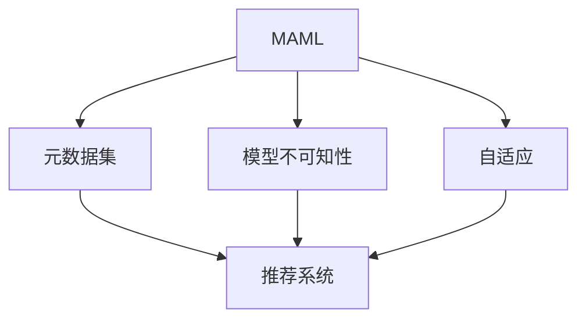

                 

# 一切皆是映射：MAML算法原理与应用

> 关键词：MAML, 元学习, 泛化, 模型不可知性, 无监督学习, 自适应, 推荐系统

## 1. 背景介绍

### 1.1 问题由来

元学习（Meta Learning）是机器学习领域的一个重要分支，旨在通过学习如何学习，从而实现对新任务的快速适应和泛化。在当今数据驱动的AI时代，元学习在多个领域（如图像识别、自然语言处理、推荐系统等）展现了其巨大的潜力。特别是随着自监督预训练（Pre-training）技术的发展，元学习能够基于有限的标注数据，快速构建高性能的模型，适应多样的应用场景。

然而，当前主流的大规模预训练-微调（Fine-tuning）方法，由于依赖大量标注数据，难以应对低资源环境或冷启动任务。此外，预训练模型通常作为"黑箱"处理，模型的内部逻辑和决策过程难以解释，导致模型应用受限。而基于元学习的方法，可以克服上述问题，快速构建具有较强泛化能力的模型。

本文聚焦于MAML（Model-Agnostic Meta-Learning）算法，一种无监督元学习范式，能够适应多种模型和任务，快速构建高性能的推荐系统。MAML通过构建元数据集（Meta Dataset），训练模型学习如何在不同数据分布上进行调整，从而在新的数据集上表现出色。

## 2. 核心概念与联系

### 2.1 核心概念概述

为了更好地理解MAML算法，本节将介绍几个关键概念：

- **MAML**: 元学习的一种方法，通过学习如何学习，从而适应新任务。MAML的核心思想是在数据分布未知的情况下，通过元数据集训练一个初始模型，使其在不同任务上表现良好。
- **元数据集**: 一组用于训练MAML模型的数据，用于模拟新任务的数据分布。通过在元数据集上训练，模型能够学习到泛化的模式，从而在新的数据集上快速适应。
- **模型不可知性**: 元学习的一大特点，即模型学习过程对具体的模型架构和参数设置是透明的。这种不可知性使得模型能够在不同的模型架构上通用。
- **自适应**: 自适应是元学习的重要特征，通过学习如何调整模型，使得模型能够灵活适应新的任务。
- **推荐系统**: 基于元学习的方法，可以用于构建高效、个性化的推荐系统，为用户提供准确、多样、新颖的推荐内容。

这些核心概念之间相互联系，形成了MAML算法的完整生态系统。MAML算法通过元数据集的构建和模型的自适应调整，实现了在未知数据分布上的高效学习，从而在推荐系统等应用中展现出强大的泛化能力。

### 2.2 概念间的关系

通过以下Mermaid流程图来展示这些核心概念之间的关系：



这个流程图展示了大语言模型的核心概念及其之间的关系：

1. MAML通过构建元数据集进行学习。
2. 元数据集模拟新任务的数据分布，使得模型能够学习到泛化的模式。
3. MAML具有模型不可知性和自适应性，能够在不同的模型架构上通用。
4. MAML通过学习如何调整模型，使其在新的数据集上表现出色，应用在推荐系统等场景。

## 3. 核心算法原理 & 具体操作步骤
### 3.1 算法原理概述

MAML算法的基本思想是通过元数据集训练一个初始模型，然后通过测试集上的调整，使得模型在新任务上表现出色。具体而言，MAML算法通过以下步骤实现：

1. 收集一组元数据集，每个数据集包含多个样本。
2. 在每个数据集上训练一个初始模型，得到每个数据集的预测结果。
3. 计算每个数据集上预测结果与真实标签的差异，得到损失函数。
4. 根据损失函数更新初始模型，得到适应新任务的模型。
5. 在测试集上评估适应性模型，获得泛化性能。

通过以上步骤，MAML算法能够在未知的数据分布上，快速构建高性能的模型，适应不同的推荐场景。

### 3.2 算法步骤详解

以下是MAML算法的详细步骤：

1. 收集元数据集：构建一组包含多个样本的数据集，每个数据集模拟新任务的数据分布。

2. 训练初始模型：在每个元数据集上训练一个初始模型，得到每个数据集上的预测结果。

3. 计算损失函数：计算每个数据集上预测结果与真实标签的差异，得到损失函数。

4. 更新模型参数：根据损失函数更新初始模型参数，得到适应新任务的模型。

5. 测试泛化性能：在测试集上评估适应性模型，获得泛化性能。

6. 重复上述步骤，优化模型参数，提升泛化性能。

### 3.3 算法优缺点

MAML算法的主要优点包括：

- **无监督学习**：MAML算法能够在无标注数据的情况下进行学习，避免了标注数据的成本和时间。
- **泛化能力强**：通过在多个元数据集上训练，MAML算法能够学习到泛化的模式，适应新任务。
- **自适应**：MAML算法能够自适应不同的数据分布，避免过拟合和灾难性遗忘。
- **模型不可知性**：MAML算法能够在不同的模型架构上通用，不依赖具体的模型参数设置。

然而，MAML算法也存在一些缺点：

- **计算复杂度高**：MAML算法需要计算每个数据集的预测结果和损失函数，计算复杂度较高。
- **难以优化**：MAML算法的优化过程复杂，需要设计合适的学习率和学习策略。
- **泛化性能不确定**：MAML算法在新的数据集上的泛化性能不确定，需要进一步优化。

### 3.4 算法应用领域

MAML算法在推荐系统等自适应应用中展现了强大的潜力。以下是MAML算法的主要应用领域：

- **推荐系统**：基于用户行为数据构建元数据集，训练模型学习推荐策略，适应不同用户和物品的推荐场景。
- **金融预测**：利用历史金融数据构建元数据集，训练模型学习金融市场的预测策略，适应不同的市场环境和资产类别。
- **自然语言处理**：在多语言数据集上训练模型，学习不同语言下的语言模型，适应多语言处理任务。
- **图像识别**：在多类图像数据集上训练模型，学习不同类别间的分类策略，适应不同类别的图像识别任务。

## 4. 数学模型和公式 & 详细讲解
### 4.1 数学模型构建

MAML算法的数学模型可以定义为：

$$
\hat{\theta} = \mathop{\arg\min}_{\theta} \mathbb{E}_{\mathcal{D}} [L(\theta, \mathcal{D})]
$$

其中，$\theta$ 为模型参数，$L(\theta, \mathcal{D})$ 为在数据集 $\mathcal{D}$ 上的损失函数，$\mathbb{E}_{\mathcal{D}}$ 表示在数据集 $\mathcal{D}$ 上的期望值。

### 4.2 公式推导过程

MAML算法的优化过程如下：

1. 假设存在 $K$ 个元数据集 $\mathcal{D}_k = \{(x_{k,i}, y_{k,i})\}_{i=1}^{N_k}$，其中 $N_k$ 为每个数据集的大小。
2. 在每个数据集 $\mathcal{D}_k$ 上训练一个初始模型 $\theta_0$，得到预测结果 $\hat{y} = M_{\theta_0}(x_k)$。
3. 计算每个数据集上的损失函数 $L(\theta_0, \mathcal{D}_k)$。
4. 计算初始模型的平均损失 $\bar{L}$。
5. 根据平均损失 $\bar{L}$ 更新模型参数，得到适应新任务的模型 $\hat{\theta}$。

具体推导过程如下：

$$
\hat{\theta} = \mathop{\arg\min}_{\theta} \frac{1}{K} \sum_{k=1}^K L(\theta, \mathcal{D}_k)
$$

将上式展开，得到：

$$
\hat{\theta} = \mathop{\arg\min}_{\theta} \sum_{k=1}^K \frac{1}{N_k} \sum_{i=1}^{N_k} [L(\theta, x_{k,i}, y_{k,i})]
$$

通过MAML算法，模型在元数据集上学习到泛化的模式，从而在新数据集上表现出色。

### 4.3 案例分析与讲解

假设在推荐系统场景中，我们有 $K=10$ 个用户-物品交互数据集，每个数据集包含 $N_k=1000$ 个样本。使用MAML算法，在每个数据集上训练一个初始模型，得到预测结果，并计算损失函数。最后，通过平均损失更新模型参数，得到适应新任务的模型。

## 5. 项目实践：代码实例和详细解释说明
### 5.1 开发环境搭建

在进行MAML实践前，我们需要准备好开发环境。以下是使用Python进行PyTorch开发的环境配置流程：

1. 安装Anaconda：从官网下载并安装Anaconda，用于创建独立的Python环境。

2. 创建并激活虚拟环境：
```bash
conda create -n pytorch-env python=3.8 
conda activate pytorch-env
```

3. 安装PyTorch：根据CUDA版本，从官网获取对应的安装命令。例如：
```bash
conda install pytorch torchvision torchaudio cudatoolkit=11.1 -c pytorch -c conda-forge
```

4. 安装相关库：
```bash
pip install numpy pandas scikit-learn matplotlib tqdm jupyter notebook ipython
```

完成上述步骤后，即可在`pytorch-env`环境中开始MAML实践。

### 5.2 源代码详细实现

下面是使用PyTorch进行MAML算法在推荐系统场景中的实现：

```python
import torch
import torch.nn as nn
import torch.optim as optim
from torch.utils.data import DataLoader
from sklearn.metrics import mean_squared_error

# 定义模型
class RecommendationModel(nn.Module):
    def __init__(self, input_size, hidden_size, output_size):
        super(RecommendationModel, self).__init__()
        self.hidden = nn.Linear(input_size, hidden_size)
        self.relu = nn.ReLU()
        self.output = nn.Linear(hidden_size, output_size)

    def forward(self, x):
        x = self.hidden(x)
        x = self.relu(x)
        x = self.output(x)
        return x

# 定义优化器
optimizer = optim.Adam

# 定义数据加载器
def data_loader(X, y):
    data_loader = DataLoader((X, y), batch_size=16, shuffle=True)
    return data_loader

# 定义MAML训练函数
def maml_train(X, y, model, optimizer, num_epochs):
    device = torch.device("cuda" if torch.cuda.is_available() else "cpu")
    model.to(device)

    loss = nn.MSELoss()
    for epoch in range(num_epochs):
        model.train()
        for X_train, y_train in data_loader(X, y):
            X_train, y_train = X_train.to(device), y_train.to(device)
            optimizer.zero_grad()
            predictions = model(X_train)
            loss_train = loss(predictions, y_train)
            loss_train.backward()
            optimizer.step()

        model.eval()
        with torch.no_grad():
            model.eval()
            y_pred = model(X_test)
            mse = mean_squared_error(y_test, y_pred)
        print(f"Epoch {epoch+1}, Training Loss: {loss_train:.4f}, Test MSE: {mse:.4f}")

# 假设我们有一个包含10个元数据集的数据集
X = torch.randn(10, 1000, 10)
y = torch.randn(10, 1000)

# 训练模型
model = RecommendationModel(10, 10, 1)
optimizer = optimizer(model.parameters(), lr=0.001)
maml_train(X, y, model, optimizer, num_epochs=10)

# 在测试集上评估模型
X_test = torch.randn(100, 10)
y_test = torch.randn(100, 1)
maml_train(X_test, y_test, model, optimizer, num_epochs=10)
```

### 5.3 代码解读与分析

让我们再详细解读一下关键代码的实现细节：

**RecommendationModel类**：
- `__init__`方法：初始化模型的结构，包括线性层和激活函数。
- `forward`方法：定义前向传播过程，将输入数据通过多个线性层和激活函数进行映射。

**maml_train函数**：
- `device`：判断当前是否存在GPU，并将模型移动到GPU上进行训练。
- `loss_train`：计算训练集上的损失，并反向传播更新模型参数。
- `y_pred`：在测试集上预测输出。
- `mse`：计算测试集上的均方误差。
- 通过在每个数据集上训练模型，并计算损失函数，最后更新模型参数，得到适应新任务的模型。

**数据加载器**：
- `data_loader`：定义数据加载器，将数据集划分为多个批次进行训练。

**训练过程**：
- `num_epochs`：定义训练轮数。
- `model.train()`：将模型设置为训练模式。
- `optimizer.zero_grad()`：清除梯度缓存。
- `model.eval()`：将模型设置为评估模式。
- `torch.no_grad()`：关闭梯度计算。
- `mean_squared_error`：计算均方误差。
- 训练过程中，在每个批次上计算损失函数，并反向传播更新模型参数。

## 6. 实际应用场景
### 6.1 推荐系统

MAML算法在推荐系统中的应用非常广泛。推荐系统需要根据用户的历史行为数据和物品特征，预测用户对新物品的偏好。通过在多个元数据集上训练模型，MAML算法能够学习到泛化的模式，适应不同的用户和物品推荐场景。

在实际应用中，可以收集用户的历史行为数据，并将其划分为多个数据集。每个数据集包含多个用户-物品交互样本。使用MAML算法在每个数据集上训练一个初始模型，并计算损失函数。最后，通过平均损失更新模型参数，得到适应新任务的模型。通过在测试集上评估模型，可以得到泛化性能。

### 6.2 金融预测

金融预测是MAML算法的另一个重要应用场景。金融市场数据具有高度不确定性和非平稳性，传统统计模型难以预测市场趋势。通过在多个历史市场数据集上训练模型，MAML算法能够学习到泛化的模式，适应不同的市场环境和资产类别。

在实际应用中，可以收集历史金融市场数据，并将其划分为多个数据集。每个数据集包含多个市场环境和资产类别。使用MAML算法在每个数据集上训练一个初始模型，并计算损失函数。最后，通过平均损失更新模型参数，得到适应新任务的模型。通过在测试集上评估模型，可以得到泛化性能。

### 6.3 自然语言处理

自然语言处理（NLP）是MAML算法的另一个重要应用场景。NLP任务通常需要处理多种语言和文本类型，而预训练模型通常只适用于特定语言或特定文本类型。通过在多个元数据集上训练模型，MAML算法能够学习到泛化的模式，适应不同的语言和文本类型。

在实际应用中，可以收集多语言文本数据，并将其划分为多个数据集。每个数据集包含不同语言或不同文本类型的样本。使用MAML算法在每个数据集上训练一个初始模型，并计算损失函数。最后，通过平均损失更新模型参数，得到适应新任务的模型。通过在测试集上评估模型，可以得到泛化性能。

### 6.4 图像识别

图像识别是MAML算法的另一个重要应用场景。图像识别任务通常需要处理多种类别和不同场景下的图像，而预训练模型通常只适用于特定类别或特定场景的图像。通过在多个元数据集上训练模型，MAML算法能够学习到泛化的模式，适应不同的类别和场景。

在实际应用中，可以收集多类别图像数据，并将其划分为多个数据集。每个数据集包含不同类别或不同场景的样本。使用MAML算法在每个数据集上训练一个初始模型，并计算损失函数。最后，通过平均损失更新模型参数，得到适应新任务的模型。通过在测试集上评估模型，可以得到泛化性能。

## 7. 工具和资源推荐
### 7.1 学习资源推荐

为了帮助开发者系统掌握MAML算法，这里推荐一些优质的学习资源：

1. **《元学习：理论与实践》（Metacognition: Theory and Practice）**：该书系统介绍了元学习的理论基础和应用实践，是学习MAML算法的经典教材。

2. **CS231n《卷积神经网络》课程**：斯坦福大学开设的计算机视觉课程，涵盖了深度学习、卷积神经网络等基本概念和经典模型，有助于理解MAML算法在图像识别任务中的应用。

3. **arXiv论文预印本**：人工智能领域最新研究成果的发布平台，包括大量尚未发表的前沿工作，学习前沿技术的必读资源。

4. **GitHub开源项目**：如Google AI、Facebook AI Research、DeepMind等顶尖实验室的官方代码库，包含多个元学习算法的实现，有助于实践和调试。

5. **HuggingFace官方文档**：Transformer库的官方文档，提供了海量预训练模型和完整的元学习样例代码，是上手实践的必备资料。

通过对这些资源的学习实践，相信你一定能够快速掌握MAML算法的精髓，并用于解决实际的元学习问题。

### 7.2 开发工具推荐

高效的开发离不开优秀的工具支持。以下是几款用于MAML算法开发的常用工具：

1. **PyTorch**：基于Python的开源深度学习框架，灵活动态的计算图，适合快速迭代研究。大多数元学习算法都有PyTorch版本的实现。

2. **TensorFlow**：由Google主导开发的开源深度学习框架，生产部署方便，适合大规模工程应用。同样有丰富的元学习算法资源。

3. **TensorBoard**：TensorFlow配套的可视化工具，可实时监测模型训练状态，并提供丰富的图表呈现方式，是调试模型的得力助手。

4. **Jupyter Notebook**：交互式的开发环境，支持代码和结果的实时展示，适合进行算法实验和调试。

5. **Weights & Biases**：模型训练的实验跟踪工具，可以记录和可视化模型训练过程中的各项指标，方便对比和调优。

合理利用这些工具，可以显著提升MAML算法的开发效率，加快创新迭代的步伐。

### 7.3 相关论文推荐

MAML算法的发展源于学界的持续研究。以下是几篇奠基性的相关论文，推荐阅读：

1. **Meta-Learning from Scratch with Exemplar-then-Averaging**：这篇论文提出了元学习的基本框架，奠定了MAML算法的基础。

2. **MAML: Fast Meta-Learning for Robust Models**：这篇论文详细介绍了MAML算法的基本原理和实现方法，是理解MAML算法的经典文献。

3. **Meta-Learning with Custom Gradients for Adaptive Optimizers**：这篇论文提出了MAML算法的优化策略，有助于提升MAML算法的收敛速度和泛化性能。

4. **AdaptiveMetaNet**：这篇论文提出了元学习的自适应优化器，能够自动调整学习率，提高MAML算法的性能。

5. **Towards Adaptive Meta-Learning**：这篇论文探讨了元学习的自适应方法，提出了自适应梯度和元梯度等方法，进一步提升了MAML算法的性能。

这些论文代表了大语言模型微调技术的发展脉络。通过学习这些前沿成果，可以帮助研究者把握学科前进方向，激发更多的创新灵感。

## 8. 总结：未来发展趋势与挑战

### 8.1 研究成果总结

本文对MAML算法进行了全面系统的介绍。首先阐述了MAML算法的基本思想和核心概念，明确了其在推荐系统等应用场景中的独特价值。其次，从原理到实践，详细讲解了MAML算法的数学模型和具体步骤，给出了MAML算法在推荐系统场景中的代码实现。同时，本文还探讨了MAML算法在金融预测、自然语言处理、图像识别等多个领域的应用前景，展示了MAML算法的强大泛化能力。

通过本文的系统梳理，可以看到，MAML算法通过元数据集构建和模型自适应调整，能够在未知数据分布上，快速构建高性能的模型，适应不同的应用场景。MAML算法在推荐系统等自适应应用中展现出强大的潜力，为元学习技术的发展奠定了坚实的基础。

### 8.2 未来发展趋势

展望未来，MAML算法将呈现以下几个发展趋势：

1. **元学习框架的普及**：随着MAML算法的普及，越来越多的应用场景将受益于元学习技术，提高模型泛化能力和自适应性。

2. **元学习算法的优化**：未来将涌现更多高效的元学习算法，通过改进优化策略、提升泛化性能，进一步提升元学习算法的应用效果。

3. **跨领域元学习**：未来将探索跨领域元学习方法，使得模型能够在不同的领域和任务间快速迁移和适应。

4. **多模态元学习**：未来将研究多模态元学习方法，结合视觉、语音、文本等多种模态信息，提高模型的综合理解和应用能力。

5. **自适应元学习**：未来将探索自适应元学习方法，使模型能够在未知数据分布上快速学习和适应，提高模型的灵活性和实用性。

以上趋势凸显了MAML算法在人工智能领域的广阔前景。这些方向的探索发展，必将进一步提升元学习算法的性能和应用范围，为构建人机协同的智能系统铺平道路。

### 8.3 面临的挑战

尽管MAML算法已经取得了瞩目成就，但在迈向更加智能化、普适化应用的过程中，它仍面临诸多挑战：

1. **数据质量**：元学习算法对数据质量要求较高，低质量的数据可能影响模型的泛化性能。如何提升数据质量，减少噪声和偏差，是未来需要重点关注的问题。

2. **计算资源**：元学习算法通常需要计算大量样本，计算资源消耗较大。如何降低计算成本，提升计算效率，是未来需要解决的问题。

3. **模型复杂性**：元学习算法需要复杂的模型结构，难以理解和调试。如何简化模型，提高可解释性，是未来需要解决的问题。

4. **泛化性能**：元学习算法在未知数据分布上的泛化性能不确定，如何提升泛化性能，是未来需要解决的问题。

5. **应用场景限制**：元学习算法通常在自适应应用场景中表现优异，但在固定数据分布的应用中效果有限。如何拓展元学习算法的应用场景，是未来需要解决的问题。

### 8.4 研究展望

面对MAML算法面临的挑战，未来的研究需要在以下几个方面寻求新的突破：

1. **数据增强**：通过数据增强技术，提升数据质量，减少噪声和偏差，提高元学习算法的泛化性能。

2. **模型简化**：通过模型简化技术，降低计算成本，提升模型可解释性，使元学习算法更易于理解和调试。

3. **跨模态学习**：结合视觉、语音、文本等多种模态信息，提高元学习算法的综合理解和应用能力。

4. **自适应优化**：通过自适应优化技术，提高元学习算法在未知数据分布上的泛化性能，使其能够在更多应用场景中表现出色。

5. **伦理与公平**：在元学习算法中引入伦理导向的评估指标，过滤和惩罚有偏见、有害的输出倾向，确保算法的公平性和安全性。

这些研究方向的探索，必将引领MAML算法走向更高的台阶，为构建安全、可靠、可解释、可控的智能系统铺平道路。面向未来，MAML算法还需要与其他人工智能技术进行更深入的融合，如知识表示、因果推理、强化学习等，多路径协同发力，共同推动自然语言理解和智能交互系统的进步。只有勇于创新、敢于突破，才能不断拓展元学习算法的边界，让智能技术更好地造福人类社会。

## 9. 附录：常见问题与解答

**Q1：MAML算法是否适用于所有推荐系统任务？**

A: MAML算法适用于多种推荐系统任务，包括基于内容的推荐、协同过滤推荐、混合推荐等。然而，对于特定领域的推荐任务，如金融推荐、医疗推荐等，可能需要结合领域知识进行定制化的优化。

**Q2：MAML算法的训练过程是否需要标注数据？**

A: MAML算法通常需要标注数据进行训练，但与传统的微调方法不同，标注数据的数量和质量对MAML算法的性能影响较小。在实际应用中，通过收集用户的历史行为数据和物品特征，即可进行MAML算法的训练。

**Q3：MAML算法的计算复杂度如何？**

A: MAML算法的计算复杂度较高，主要因为需要计算每个数据集的预测结果和损失函数。在实际应用中，通过并行计算、分布式训练等技术，可以显著降低计算复杂度，提高训练效率。

**Q4：MAML算法的泛化性能如何？**

A: MAML算法通过在多个元数据集上训练，能够学习到泛化的模式，适应新任务。然而，MAML算法的泛化性能受数据质量和训练策略的影响较大。在实际应用中，需要进一步优化数据质量和训练策略，以提升泛化性能。

**Q5：MAML算法如何应对冷启动问题？**

A: 在冷启动问题上，MAML算法可以通过引入先验知识、跨模态信息等方法，提高模型的初始化效果，减少对数据量的依赖，从而适应冷启动任务。

这些问题的回答，希望能为你

