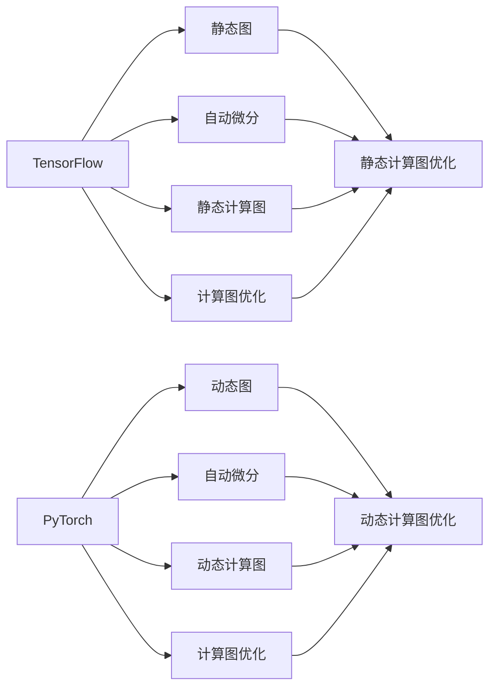
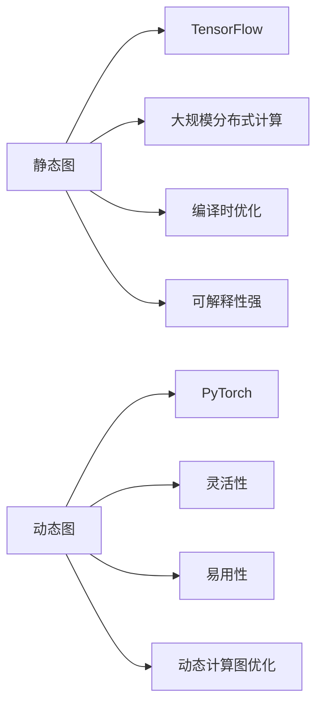
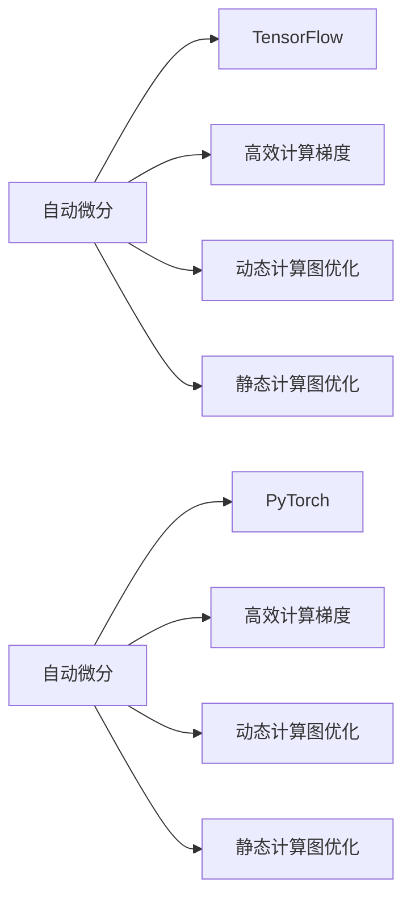
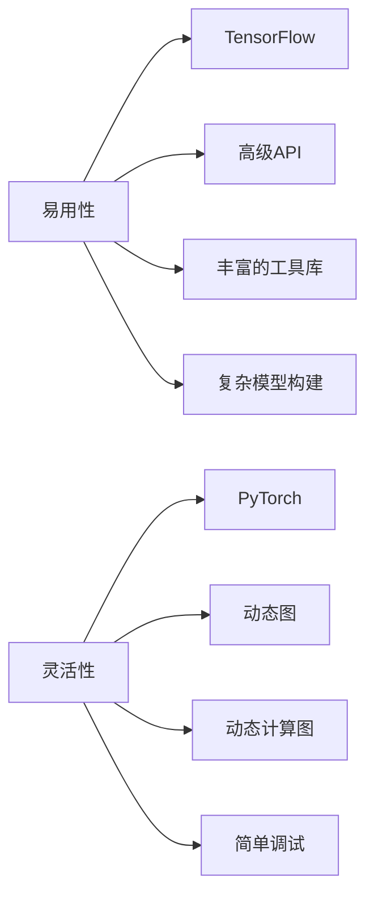
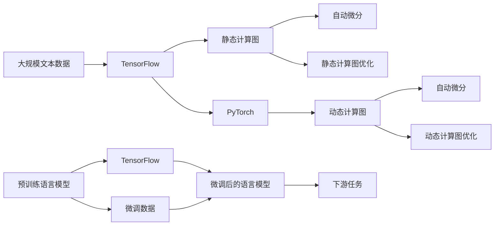

                 

# 一切皆是映射：TensorFlow 和 PyTorch 实战对比

> 关键词：TensorFlow, PyTorch, 深度学习, 动态图, 静态图, 自动微分, 静态计算图, 动态计算图, 计算图优化

## 1. 背景介绍

深度学习技术自21世纪初问世以来，已成为人工智能领域的重要组成部分。而深度学习框架作为支撑深度学习模型的核心工具，极大地推动了深度学习技术的发展与应用。其中，TensorFlow和PyTorch是最具影响力的两大深度学习框架。本文将对TensorFlow和PyTorch在深度学习领域的实战应用进行对比，帮助读者更好地选择和使用这两个框架。

### 1.1 问题由来

深度学习模型通常需要大量的数据和计算资源进行训练，而构建高效、灵活的计算图是实现这一目标的关键。TensorFlow和PyTorch正是在这一背景下应运而生的两个主流框架。TensorFlow是由Google开发的一个开源的深度学习框架，它的计算图是静态的，可以支持大规模分布式计算，适用于需要高性能计算的生产环境。而PyTorch则是由Facebook开发的开源深度学习框架，其计算图是动态的，提供了更灵活、更易用的API，适用于研究和实验场景。

### 1.2 问题核心关键点

TensorFlow和PyTorch作为深度学习领域的两个重要框架，各自具有其独特的优势和适用场景。本文将重点探讨以下几个关键点：

- 计算图的差异：静态图与动态图
- 自动微分机制
- 计算图优化与性能优化
- 易用性与灵活性
- 应用场景选择

通过对比，希望读者能够清晰地认识到TensorFlow和PyTorch各自的优缺点，并在实际项目中做出明智的框架选择。

### 1.3 问题研究意义

深入对比TensorFlow和PyTorch，不仅有助于理解这两个框架的内在机制和设计理念，更能够帮助开发者在具体项目中做出更为合适的选择。这对于提升深度学习模型的训练和推理效率，推动深度学习技术的发展具有重要意义。

## 2. 核心概念与联系

### 2.1 核心概念概述

为了更好地理解TensorFlow和PyTorch，本节将介绍几个关键概念：

- **静态图**：TensorFlow的计算图是静态的，在程序运行前就确定了计算图结构。这使得TensorFlow能够高效地进行分布式计算，适用于需要高性能、高并发的场景。

- **动态图**：PyTorch的计算图是动态的，计算图在运行过程中逐步构建。这使得PyTorch提供了更灵活、更易用的API，适用于研究和实验。

- **自动微分**：TensorFlow和PyTorch都提供了自动微分机制，用于高效地计算模型梯度。TensorFlow使用`tf.GradientTape`，而PyTorch使用`torch.autograd`。

- **静态计算图**：TensorFlow的计算图是静态的，能够在编译时进行优化，从而提高计算效率。

- **动态计算图**：PyTorch的计算图是动态的，支持更灵活的操作和更简单的调试。

- **计算图优化**：TensorFlow和PyTorch都提供了多种计算图优化技术，如剪枝、量化、混合精度训练等，以提升模型性能。

- **易用性与灵活性**：TensorFlow提供了更高级别的API和丰富的工具库，适用于大规模生产环境；而PyTorch提供了更灵活、更易用的API，适用于研究与实验。

这些核心概念之间的联系和区别可以通过以下Mermaid流程图来展示：



这个流程图展示了TensorFlow和PyTorch的核心概念及其联系：

1. TensorFlow使用静态图，支持大规模分布式计算，适用于高性能场景。
2. PyTorch使用动态图，提供更灵活、更易用的API，适用于研究和实验。
3. 两者都提供了自动微分机制和计算图优化，以提升模型性能。
4. TensorFlow的静态图可以编译时优化，而PyTorch的动态图更加灵活和易用。

### 2.2 概念间的关系

这些核心概念之间存在着紧密的联系，形成了TensorFlow和PyTorch的完整框架体系。下面通过几个Mermaid流程图来展示这些概念之间的关系。

#### 2.2.1 静态图与动态图的关系



这个流程图展示了静态图和动态图的区别与联系：

1. TensorFlow的静态图适用于大规模分布式计算，支持编译时优化，但灵活性较低。
2. PyTorch的动态图提供更灵活和易用的API，支持动态计算图优化，但可解释性较弱。

#### 2.2.2 自动微分与计算图优化的关系



这个流程图展示了自动微分与计算图优化之间的关系：

1. TensorFlow和PyTorch都提供了自动微分机制，用于高效计算梯度。
2. TensorFlow的静态图支持静态计算图优化，而PyTorch的动态图支持动态计算图优化。

#### 2.2.3 易用性与灵活性的关系



这个流程图展示了易用性与灵活性之间的关系：

1. TensorFlow提供了更高级别的API和丰富的工具库，适用于大规模生产环境。
2. PyTorch提供了更灵活、更易用的API，适用于研究和实验。

### 2.3 核心概念的整体架构

最后，我们用一个综合的流程图来展示TensorFlow和PyTorch的核心概念在大模型微调过程中的整体架构：



这个综合流程图展示了从预训练到微调，再到下游任务的完整过程：

1. 大语言模型通过静态计算图进行预训练。
2. TensorFlow和PyTorch分别提供了静态计算图和动态计算图，用于模型构建和优化。
3. 微调过程使用自动微分机制，高效计算梯度。
4. 微调后的模型适用于下游任务，并结合动态计算图优化，提升模型性能。

通过这些流程图，我们可以更清晰地理解TensorFlow和PyTorch的工作原理和优化方向，为后续深入讨论具体的框架特点奠定基础。

## 3. 核心算法原理 & 具体操作步骤
### 3.1 算法原理概述

TensorFlow和PyTorch的深度学习模型构建和训练过程具有一些共同点，但也有显著的差异。下面从这些差异入手，详细阐述它们的算法原理。

### 3.2 算法步骤详解

#### 3.2.1 TensorFlow

TensorFlow的计算图是静态的，即在程序运行前就确定了计算图结构。这种设计使得TensorFlow能够高效地进行分布式计算，适用于需要高性能计算的生产环境。

1. **计算图构建**：使用`tf.Graph`来定义计算图结构，通过`tf.layers`和`tf.nn`等模块构建模型。
2. **数据输入**：使用`tf.data` API来定义数据输入管道，对数据进行预处理和增强。
3. **模型训练**：使用`tf.Session`来运行计算图，通过`tf.train.Optimizer`进行模型优化。
4. **性能优化**：通过`tf.function`和`tf.autograph`进行计算图优化，提升模型性能。

#### 3.2.2 PyTorch

PyTorch的计算图是动态的，即在程序运行过程中逐步构建计算图。这种设计使得PyTorch提供了更灵活、更易用的API，适用于研究和实验场景。

1. **计算图构建**：使用`torch.nn`模块定义计算图结构，通过`torch.tensor`来创建张量。
2. **数据输入**：使用`torch.utils.data.DataLoader`来定义数据输入管道，对数据进行预处理和增强。
3. **模型训练**：使用`torch.optim`进行模型优化，通过`torch.tensor`来构建动态计算图。
4. **性能优化**：通过`torch.no_grad`和`torch.jit`进行计算图优化，提升模型性能。

### 3.3 算法优缺点

#### TensorFlow

- **优点**：
  - **高性能计算**：静态计算图支持大规模分布式计算，适用于需要高性能计算的生产环境。
  - **灵活性**：支持静态图优化，提升模型性能。
  - **丰富的工具库**：提供大量的工具库和高级API，适用于大规模生产环境。

- **缺点**：
  - **灵活性**：静态图设计使得模型构建和调试相对复杂。
  - **学习曲线陡峭**：API相对复杂，需要一定的学习成本。

#### PyTorch

- **优点**：
  - **易用性**：动态计算图设计使得模型构建和调试更加灵活和易用。
  - **简洁性**：API简洁，易于上手。
  - **动态图优化**：支持动态计算图优化，提升模型性能。

- **缺点**：
  - **性能**：动态图设计虽然灵活，但在高性能计算方面相对TensorFlow有所劣势。
  - **可解释性**：动态图设计使得模型的可解释性相对较差。

### 3.4 算法应用领域

TensorFlow和PyTorch在深度学习领域都有广泛的应用。

#### TensorFlow

- **大规模生产环境**：适用于需要高性能计算的生产环境，如自然语言处理、计算机视觉、语音识别等。
- **分布式计算**：支持大规模分布式计算，适用于大规模生产环境。

#### PyTorch

- **研究和实验**：适用于研究和实验场景，如自然语言处理、计算机视觉、深度学习框架开发等。
- **模型调试和优化**：提供更灵活、更易用的API，便于模型调试和优化。

## 4. 数学模型和公式 & 详细讲解 & 举例说明

### 4.1 数学模型构建

本节将使用数学语言对TensorFlow和PyTorch的深度学习模型构建过程进行更加严格的刻画。

设深度学习模型为$f(x; \theta)$，其中$x$为输入数据，$\theta$为模型参数。模型训练的目的是通过优化损失函数$L(f(x; \theta))$，使得模型输出$f(x; \theta)$逼近真实标签$y$。

#### 4.1.1 TensorFlow

TensorFlow的计算图构建过程如下：

1. **定义计算图结构**：使用`tf.Graph`来定义计算图结构，通过`tf.layers`和`tf.nn`等模块构建模型。
2. **定义损失函数**：使用`tf.losses`模块定义损失函数。
3. **优化模型参数**：使用`tf.train.Optimizer`进行模型优化，通过反向传播算法更新模型参数。
4. **训练模型**：使用`tf.Session`来运行计算图，通过`tf.Session.run`方法执行模型训练。

#### 4.1.2 PyTorch

PyTorch的计算图构建过程如下：

1. **定义计算图结构**：使用`torch.nn`模块定义计算图结构，通过`torch.tensor`来创建张量。
2. **定义损失函数**：使用`torch.nn`模块定义损失函数。
3. **优化模型参数**：使用`torch.optim`进行模型优化，通过反向传播算法更新模型参数。
4. **训练模型**：使用`torch.no_grad`和`torch.jit`进行计算图优化，提升模型性能。

### 4.2 公式推导过程

以下我们以二分类任务为例，推导交叉熵损失函数及其梯度的计算公式。

设模型$f(x; \theta)$在输入$x$上的输出为$\hat{y}=f(x; \theta)$，表示样本属于正类的概率。真实标签$y \in \{0,1\}$。则二分类交叉熵损失函数定义为：

$$
L(y, \hat{y}) = -y \log \hat{y} - (1-y) \log (1-\hat{y})
$$

将其代入经验风险公式，得：

$$
\mathcal{L}(\theta) = -\frac{1}{N}\sum_{i=1}^N [y_i \log \hat{y}_i + (1-y_i) \log (1-\hat{y}_i)]
$$

根据链式法则，损失函数对参数$\theta_k$的梯度为：

$$
\frac{\partial \mathcal{L}(\theta)}{\partial \theta_k} = -\frac{1}{N}\sum_{i=1}^N [\frac{y_i}{\hat{y}_i}-\frac{1-y_i}{1-\hat{y}_i}] \frac{\partial f(x; \theta)}{\partial \theta_k}
$$

其中$\frac{\partial f(x; \theta)}{\partial \theta_k}$可进一步递归展开，利用自动微分技术完成计算。

### 4.3 案例分析与讲解

以下是一个简单的二分类模型在TensorFlow和PyTorch中的构建和训练过程。

#### 4.3.1 TensorFlow

```python
import tensorflow as tf
from tensorflow.keras.datasets import mnist

# 加载数据集
(x_train, y_train), (x_test, y_test) = mnist.load_data()

# 数据预处理
x_train = x_train / 255.0
x_test = x_test / 255.0
y_train = tf.keras.utils.to_categorical(y_train, 10)
y_test = tf.keras.utils.to_categorical(y_test, 10)

# 构建计算图结构
model = tf.keras.Sequential([
    tf.keras.layers.Flatten(input_shape=(28, 28)),
    tf.keras.layers.Dense(128, activation='relu'),
    tf.keras.layers.Dense(10, activation='softmax')
])

# 定义损失函数
loss_fn = tf.keras.losses.categorical_crossentropy

# 定义优化器
optimizer = tf.keras.optimizers.Adam(learning_rate=0.001)

# 定义评估指标
metrics = [tf.keras.metrics.categorical_accuracy]

# 编译模型
model.compile(optimizer=optimizer, loss=loss_fn, metrics=metrics)

# 训练模型
model.fit(x_train, y_train, epochs=10, batch_size=64, validation_data=(x_test, y_test))

# 评估模型
model.evaluate(x_test, y_test)
```

#### 4.3.2 PyTorch

```python
import torch
import torch.nn as nn
import torch.optim as optim
from torch.utils.data import DataLoader
from torchvision.datasets import MNIST
from torchvision.transforms import ToTensor, Normalize

# 加载数据集
train_dataset = MNIST(root='./data', train=True, transform=ToTensor(), download=True)
test_dataset = MNIST(root='./data', train=False, transform=ToTensor(), download=True)

# 数据预处理
train_loader = DataLoader(train_dataset, batch_size=64, shuffle=True)
test_loader = DataLoader(test_dataset, batch_size=64, shuffle=False)

# 定义计算图结构
model = nn.Sequential(
    nn.Flatten(),
    nn.Linear(28 * 28, 128),
    nn.ReLU(),
    nn.Linear(128, 10),
    nn.Softmax(dim=1)
)

# 定义损失函数
loss_fn = nn.CrossEntropyLoss()

# 定义优化器
optimizer = optim.Adam(model.parameters(), lr=0.001)

# 定义评估指标
metrics = nn.CrossEntropyLoss()

# 训练模型
for epoch in range(10):
    running_loss = 0.0
    for inputs, labels in train_loader:
        optimizer.zero_grad()
        outputs = model(inputs)
        loss = loss_fn(outputs, labels)
        loss.backward()
        optimizer.step()
        running_loss += loss.item()
    print(f'Epoch {epoch+1}, Loss: {running_loss/len(train_loader)}')

# 评估模型
with torch.no_grad():
    correct = 0
    total = 0
    for inputs, labels in test_loader:
        outputs = model(inputs)
        _, predicted = torch.max(outputs.data, 1)
        total += labels.size(0)
        correct += (predicted == labels).sum().item()
    print(f'Test Accuracy: {100 * correct / total}%')
```

可以看到，尽管TensorFlow和PyTorch的API略有不同，但深度学习模型的构建和训练过程基本一致。

### 4.4 案例分析与讲解

通过上述案例分析，我们可以看到，尽管TensorFlow和PyTorch在API设计和实现细节上有一些差异，但它们都提供了简单易用的API和强大的计算图优化功能。这些特性使得深度学习模型在构建和训练过程中变得更加灵活和高效。

## 5. 项目实践：代码实例和详细解释说明
### 5.1 开发环境搭建

在进行深度学习模型构建和训练前，我们需要准备好开发环境。以下是使用Python进行TensorFlow和PyTorch开发的环境配置流程：

1. 安装Anaconda：从官网下载并安装Anaconda，用于创建独立的Python环境。

2. 创建并激活虚拟环境：
```bash
conda create -n pytorch-env python=3.8 
conda activate pytorch-env
```

3. 安装TensorFlow：根据CUDA版本，从官网获取对应的安装命令。例如：
```bash
conda install tensorflow -c conda-forge -c pytorch -c defaults
```

4. 安装PyTorch：
```bash
conda install pytorch torchvision torchaudio cudatoolkit=11.1 -c pytorch -c conda-forge
```

5. 安装各类工具包：
```bash
pip install numpy pandas scikit-learn matplotlib tqdm jupyter notebook ipython
```

完成上述步骤后，即可在`pytorch-env`环境中开始深度学习模型的开发和训练。

### 5.2 源代码详细实现

这里我们以手写数字识别任务为例，给出使用TensorFlow和PyTorch进行模型构建和训练的代码实现。

#### 5.2.1 TensorFlow

```python
import tensorflow as tf
from tensorflow.keras.datasets import mnist

# 加载数据集
(x_train, y_train), (x_test, y_test) = mnist.load_data()

# 数据预处理
x_train = x_train / 255.0
x_test = x_test / 255.0
y_train = tf.keras.utils.to_categorical(y_train, 10)
y_test = tf.keras.utils.to_categorical(y_test, 10)

# 构建计算图结构
model = tf.keras.Sequential([
    tf.keras.layers.Flatten(input_shape=(28, 28)),
    tf.keras.layers.Dense(128, activation='relu'),
    tf.keras.layers.Dense(10, activation='softmax')
])

# 定义损失函数
loss_fn = tf.keras.losses.categorical_crossentropy

# 定义优化器
optimizer = tf.keras.optimizers.Adam(learning_rate=0.001)

# 定义评估指标
metrics = [tf.keras.metrics.categorical_accuracy]

# 编译模型
model.compile(optimizer=optimizer, loss=loss_fn, metrics=metrics)

# 训练模型
model.fit(x_train, y_train, epochs=10, batch_size=64, validation_data=(x_test, y_test))

# 评估模型
model.evaluate(x_test, y_test)
```

#### 5.2.2 PyTorch

```python
import torch
import torch.nn as nn
import torch.optim as optim
from torch.utils.data import DataLoader
from torchvision.datasets import MNIST
from torchvision.transforms import ToTensor, Normalize

# 加载数据集
train_dataset = MNIST(root='./data', train=True, transform=ToTensor(), download=True)
test_dataset = MNIST(root='./data', train=False, transform=ToTensor(), download=True)

# 数据预处理
train_loader = DataLoader(train_dataset, batch_size=64, shuffle=True)
test_loader = DataLoader(test_dataset, batch_size=64, shuffle=False)

# 定义计算图结构
model = nn.Sequential(
    nn.Flatten(),
    nn.Linear(28 * 28, 128),
    nn.ReLU(),
    nn.Linear(128, 10),
    nn.Softmax(dim=1)
)

# 定义损失函数
loss_fn = nn.CrossEntropyLoss()

# 定义优化器
optimizer = optim.Adam(model.parameters(), lr=0.001)

# 定义评估指标
metrics = nn.CrossEntropyLoss()

# 训练模型
for epoch in range(10):
    running_loss = 0.0
    for inputs, labels in train_loader:
        optimizer.zero_grad()
        outputs = model(inputs)
        loss = loss_fn(outputs, labels)
        loss.backward()
        optimizer.step()
        running_loss += loss.item()
    print(f'Epoch {epoch+1}, Loss: {running_loss/len(train_loader)}')

# 评估模型
with torch.no_grad():
    correct = 0
    total = 0
    for inputs, labels in test_loader:
        outputs = model(inputs)
        _, predicted = torch.max(outputs.data, 1)
        total += labels.size(0)
        correct += (predicted == labels).sum().item()
    print(f'Test Accuracy: {100 * correct / total}%')
```

可以看到，尽管TensorFlow和PyTorch在API设计和实现细节上有一些差异，但深度学习模型的构建和训练过程基本一致。

### 5.3 代码解读与分析

让我们再详细解读一下关键代码的实现细节：

#### 5.3.1 TensorFlow

**加载数据集**：使用`tf.keras.datasets.mnist.load_data()`加载MNIST数据集，返回训练集和测试集。

**数据预处理**：将数据归一化到[0,1]区间，并对标签进行one-hot编码。

**构建计算图结构**：使用`tf.keras.Sequential()`定义计算图结构，包含输入层、隐藏层和输出层。

**定义损失函数**：使用`tf.keras.losses.categorical_crossentropy`定义交叉熵损失函数。

**定义优化器**：使用`tf.keras.optimizers.Adam()`定义Adam优化器，学习率为0.001。

**定义评估指标**：使用`tf.keras.metrics.categorical_accuracy`定义准确率评估指标。

**编译模型**：使用`model.compile()`编译模型，指定优化器、损失函数和评估指标。

**训练模型**：使用`model.fit()`训练模型，指定训练集、测试集、批量大小和迭代轮数。

**评估模型**：使用`model.evaluate()`评估模型，返回测试集上的损失和准确率。

#### 5.3.2 PyTorch

**加载数据集**：使用`torchvision.datasets.MNIST()`加载MNIST数据集，返回训练集和测试集。

**数据预处理**：将数据归一化到[0,1]区间，并对标签进行one-hot编码。

**构建计算图结构**：使用`torch.nn.Sequential()`定义计算图结构，包含输入层、隐藏层和输出层。

**定义损失函数**：使用`nn.CrossEntropyLoss()`定义交叉熵损失函数。

**定义优化器**：使用`optim.Adam()`定义Adam优化器，学习率为0.001。

**定义评估指标**：使用`nn.CrossEntropyLoss()`定义交叉熵损失函数，用于评估模型。

**训练模型**：使用`for`循环和`DataLoader`遍历训练集，使用`optimizer.zero_grad()`清除梯度，使用`model(inputs)`前向传播计算输出，使用`loss(outputs, labels)`计算损失，使用`loss.backward()`反向传播计算梯度，使用`optimizer.step()`更新模型参数。

**评估模型**：使用`with torch.no_grad()`关闭梯度计算，使用`torch.max(outputs.data, 1)`计算预测结果，使用`(predicted == labels).sum().item()`计算正确率。

通过上述代码实现，我们可以看到，尽管TensorFlow和PyTorch在API设计和实现细节上有一些差异，但深度学习模型的构建和训练过程基本

