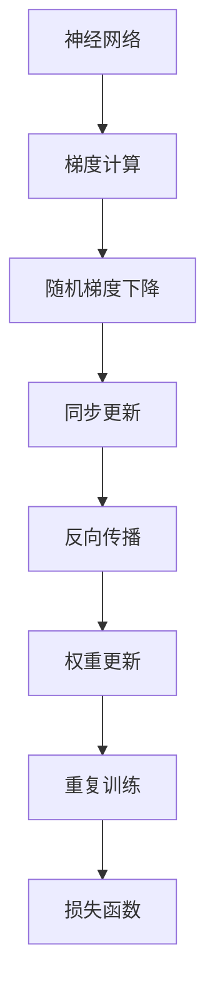
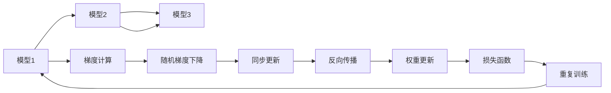
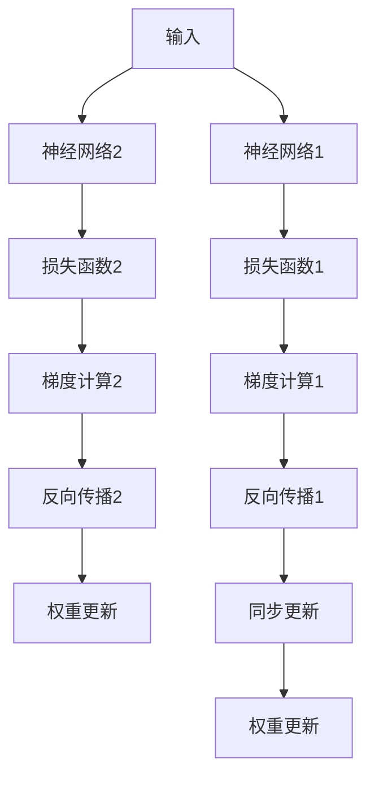
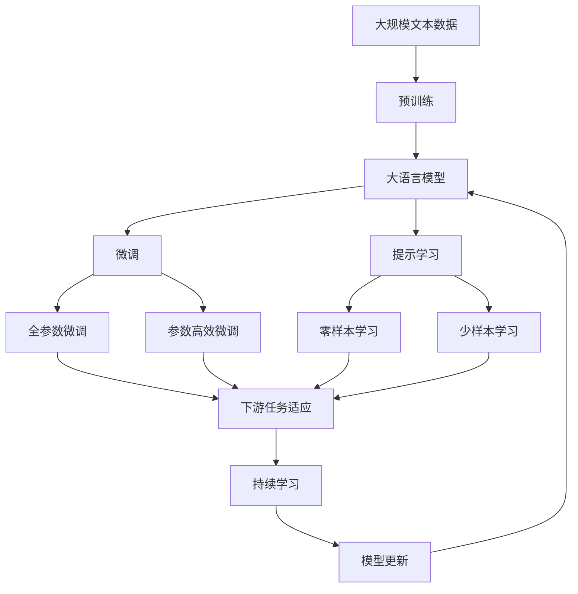

                 

# 一切皆是映射：利用Reptile算法快速优化神经网络

> 关键词：Reptile算法, 神经网络优化, 随机梯度下降, 权重更新, 反向传播, 梯度加速

## 1. 背景介绍

### 1.1 问题由来

在深度学习领域，神经网络的优化是一个核心难题。特别是对于大规模神经网络，其参数量动辄百万亿级别，使得训练过程变得极为复杂和耗时。传统的随机梯度下降（SGD）算法在优化过程中容易陷入局部最优解，而且需要大量的计算资源和存储资源。为了应对这些问题，研究人员提出了多种优化算法，如Adam、Adagrad等，但这些算法在处理大规模神经网络时仍然存在挑战。

Reptile算法作为一种新兴的优化方法，通过映射多个模型的更新过程，能够在保持高精度的同时，大大加速训练过程，减少计算资源和存储资源的消耗。Reptile算法在神经网络优化中表现出卓越的性能，已经成为优化深度学习模型的一个重要方向。

### 1.2 问题核心关键点

Reptile算法的核心思想是通过映射多个模型的更新过程，使得模型能够更快地收敛到全局最优解。具体来说，Reptile算法包含以下几个关键点：

- **多个模型映射**：Reptile算法维护多个模型的权重副本，这些模型在不同的时间点上进行训练。
- **同步更新**：每个模型在每个时间点上更新一次权重，之后通过同步更新操作将这些权重传递给其他模型。
- **随机梯度下降**：每个模型使用随机梯度下降算法更新权重。
- **反向传播**：每个模型在更新过程中进行反向传播，计算梯度并更新权重。

通过这种方式，Reptile算法能够利用多个模型的并行计算能力，加快训练过程，同时保持较高的精度和稳定性。Reptile算法在神经网络优化中的成功应用，为深度学习模型的训练提供了新的思路和工具。

### 1.3 问题研究意义

Reptile算法的提出，对深度学习模型的优化具有重要意义：

1. **加速训练**：Reptile算法通过映射多个模型的更新过程，能够大大缩短训练时间，提高模型的训练效率。
2. **减少计算资源消耗**：Reptile算法通过利用多个模型的并行计算能力，减少了对计算资源的依赖，降低了训练成本。
3. **提高精度**：Reptile算法通过多个模型的同步更新和反向传播，提高了模型的精度和稳定性。
4. **通用性**：Reptile算法适用于各种类型的神经网络，包括卷积神经网络（CNN）、循环神经网络（RNN）、自编码器等。
5. **可扩展性**：Reptile算法能够在大规模数据集上应用，处理大规模神经网络的能力更强。

Reptile算法在深度学习领域的成功应用，为深度学习模型的训练提供了新的方向和思路，具有重要的理论和实践意义。

## 2. 核心概念与联系

### 2.1 核心概念概述

Reptile算法是一种用于神经网络优化的算法，其核心思想是通过映射多个模型的更新过程，加快训练速度，提高模型精度。

以下是Reptile算法中涉及的几个关键概念：

- **神经网络**：一种由多个节点组成的计算图，通过反向传播算法更新参数，实现对数据的拟合。
- **梯度**：表示模型在当前参数值下的损失函数对参数的导数，用于指导参数的更新方向。
- **同步更新**：多个模型的权重参数在每个时间点上进行同步更新，以保持各个模型的参数一致。
- **随机梯度下降**：一种常用的优化算法，通过计算损失函数的梯度，更新模型参数。
- **反向传播**：一种计算图优化算法，用于计算损失函数对模型参数的梯度。

这些概念之间的联系可以通过以下Mermaid流程图来展示：



这个流程图展示了Reptile算法的基本流程：首先计算神经网络的梯度，然后使用随机梯度下降算法更新模型参数。接着，进行同步更新操作，将各个模型的权重参数进行同步。最后，使用反向传播算法计算损失函数，并更新权重参数，进行下一轮训练。

### 2.2 概念间的关系

这些核心概念之间存在着紧密的联系，形成了Reptile算法的完整架构。下面我们通过几个Mermaid流程图来展示这些概念之间的关系。

#### 2.2.1 Reptile算法流程


这个流程图展示了Reptile算法的基本流程，包含神经网络、梯度计算、随机梯度下降、同步更新、反向传播、权重更新和损失函数计算等步骤。

#### 2.2.2 多个模型映射



这个流程图展示了Reptile算法中的多个模型映射关系。每个模型在每个时间点上计算梯度，使用随机梯度下降算法更新参数，然后进行同步更新和反向传播，更新权重参数，最后计算损失函数。

#### 2.2.3 反向传播的并行化



这个流程图展示了反向传播的并行化过程。神经网络1和神经网络2分别进行反向传播，计算梯度并更新权重参数。同步更新操作将各个模型的权重参数进行同步，以保持各个模型的参数一致。

### 2.3 核心概念的整体架构

最后，我们用一个综合的流程图来展示这些核心概念在大语言模型微调过程中的整体架构：



这个综合流程图展示了从预训练到微调，再到持续学习的完整过程。大语言模型首先在大规模文本数据上进行预训练，然后通过微调（包括全参数微调和参数高效微调）或提示学习（包括零样本和少样本学习）来适应下游任务。最后，通过持续学习技术，模型可以不断学习新知识，同时避免遗忘旧知识。 通过这些流程图，我们可以更清晰地理解Reptile算法在大语言模型微调过程中各个核心概念的关系和作用，为后续深入讨论具体的微调方法和技术奠定基础。

## 3. 核心算法原理 & 具体操作步骤
### 3.1 算法原理概述

Reptile算法通过映射多个模型的更新过程，加快训练速度，提高模型精度。其核心思想是：在每个时间点上，多个模型同时进行梯度计算和参数更新，然后通过同步更新操作将这些权重参数进行同步，最终得到全局最优解。

Reptile算法主要包括以下几个步骤：

1. 初始化多个模型的权重参数。
2. 在每个时间点上，计算每个模型的梯度。
3. 使用随机梯度下降算法更新每个模型的参数。
4. 进行同步更新操作，将各个模型的权重参数进行同步。
5. 计算损失函数，使用反向传播算法更新每个模型的权重参数。
6. 重复以上步骤，直到模型收敛或达到预设轮数。

Reptile算法通过映射多个模型的更新过程，利用多个模型的并行计算能力，大大加快了训练速度，提高了模型精度，同时减少了对计算资源的依赖。

### 3.2 算法步骤详解

以下是Reptile算法的详细步骤：

**Step 1: 初始化多个模型**

在训练开始之前，我们需要初始化多个模型的权重参数。假设我们初始化 $k$ 个模型的权重参数，每个模型的初始权重参数为 $w_1, w_2, ..., w_k$。

**Step 2: 计算梯度**

在每个时间点上，我们需要计算每个模型的梯度。假设我们使用的是随机梯度下降算法，则每个模型的梯度为：

$$
\Delta w_i = -\eta \nabla_{w_i} \mathcal{L}(w_i, x_i, y_i)
$$

其中，$\eta$ 为学习率，$\nabla_{w_i} \mathcal{L}(w_i, x_i, y_i)$ 为模型在样本 $(x_i, y_i)$ 上的损失函数对权重 $w_i$ 的梯度。

**Step 3: 更新权重**

在计算梯度之后，我们需要更新每个模型的权重参数。每个模型使用随机梯度下降算法更新其权重参数：

$$
w_i \leftarrow w_i - \eta \Delta w_i
$$

**Step 4: 同步更新**

在更新完所有模型的权重参数之后，我们需要进行同步更新操作。同步更新操作将各个模型的权重参数进行同步，以保持各个模型的参数一致。具体的同步更新操作可以采用加权平均的方式：

$$
w_i \leftarrow \frac{1}{k} \sum_{j=1}^k w_j
$$

**Step 5: 反向传播**

在同步更新之后，我们需要计算损失函数，使用反向传播算法更新每个模型的权重参数。反向传播算法计算损失函数对权重参数的梯度，并使用梯度下降算法更新权重参数：

$$
\Delta w_i = -\eta \nabla_{w_i} \mathcal{L}(w_i, x_i, y_i)
$$

**Step 6: 重复训练**

重复以上步骤，直到模型收敛或达到预设轮数。具体的训练过程可以表示为：

$$
w^{t+1} = \text{Step 3}(\text{Step 5}(\text{Step 2}(\text{Step 4}(\text{Step 2}(w^t))))
$$

其中 $w^t$ 表示第 $t$ 轮的权重参数，$w^{t+1}$ 表示第 $t+1$ 轮的权重参数。

### 3.3 算法优缺点

Reptile算法在神经网络优化中表现出卓越的性能，但也存在一些缺点：

**优点：**

- **加速训练**：Reptile算法通过映射多个模型的更新过程，大大缩短了训练时间，提高了训练效率。
- **提高精度**：Reptile算法通过多个模型的同步更新和反向传播，提高了模型的精度和稳定性。
- **通用性**：Reptile算法适用于各种类型的神经网络，包括卷积神经网络（CNN）、循环神经网络（RNN）、自编码器等。
- **可扩展性**：Reptile算法能够在大规模数据集上应用，处理大规模神经网络的能力更强。

**缺点：**

- **计算资源消耗**：Reptile算法需要维护多个模型的权重副本，增加了计算资源和存储资源的消耗。
- **同步更新复杂性**：同步更新操作增加了算法的复杂性，可能会导致同步更新失败。
- **模型复杂性**：Reptile算法需要在每个时间点上计算梯度，并进行反向传播，增加了模型复杂性。

尽管存在这些缺点，Reptile算法在神经网络优化中的成功应用，为深度学习模型的训练提供了新的思路和工具。

### 3.4 算法应用领域

Reptile算法在神经网络优化中的应用非常广泛，主要包括以下几个领域：

1. **图像识别**：Reptile算法在图像识别任务中表现出色，能够快速训练大规模卷积神经网络，提高图像识别的精度和效率。
2. **语音识别**：Reptile算法在语音识别任务中同样有效，能够快速训练大规模循环神经网络，提高语音识别的精度和效率。
3. **自然语言处理**：Reptile算法在自然语言处理任务中表现优异，能够快速训练大规模语言模型，提高自然语言处理的精度和效率。
4. **推荐系统**：Reptile算法在推荐系统任务中具有很大的应用潜力，能够快速训练大规模神经网络，提高推荐系统的准确性和效率。
5. **强化学习**：Reptile算法在强化学习任务中同样有效，能够快速训练大规模神经网络，提高强化学习的精度和效率。

Reptile算法在神经网络优化中的成功应用，为深度学习模型的训练提供了新的方向和思路，具有重要的理论和实践意义。

## 4. 数学模型和公式 & 详细讲解  
### 4.1 数学模型构建

Reptile算法的主要数学模型如下：

假设我们有一个神经网络 $M(w)$，其中 $w$ 为权重参数，$x$ 为输入数据，$y$ 为输出标签。假设我们初始化了 $k$ 个模型的权重参数 $w_1, w_2, ..., w_k$。在每个时间点上，我们使用随机梯度下降算法计算梯度 $\Delta w_i$，然后进行同步更新操作，最终得到全局最优解 $w^*$。

### 4.2 公式推导过程

以下是对Reptile算法的公式推导过程：

**Step 1: 初始化**

$$
w_i \leftarrow \text{Initialize}(w_i)
$$

其中，$\text{Initialize}(w_i)$ 表示初始化模型 $i$ 的权重参数。

**Step 2: 计算梯度**

$$
\Delta w_i = -\eta \nabla_{w_i} \mathcal{L}(w_i, x_i, y_i)
$$

其中，$\eta$ 为学习率，$\nabla_{w_i} \mathcal{L}(w_i, x_i, y_i)$ 为模型在样本 $(x_i, y_i)$ 上的损失函数对权重 $w_i$ 的梯度。

**Step 3: 更新权重**

$$
w_i \leftarrow w_i - \eta \Delta w_i
$$

**Step 4: 同步更新**

$$
w_i \leftarrow \frac{1}{k} \sum_{j=1}^k w_j
$$

**Step 5: 反向传播**

$$
\Delta w_i = -\eta \nabla_{w_i} \mathcal{L}(w_i, x_i, y_i)
$$

**Step 6: 重复训练**

$$
w^{t+1} = \text{Step 3}(\text{Step 5}(\text{Step 2}(\text{Step 4}(\text{Step 2}(w^t))))
$$

### 4.3 案例分析与讲解

下面我们以一个简单的神经网络为例，分析Reptile算法的应用效果。

假设我们有一个简单的神经网络 $M(w)$，其中 $w$ 为权重参数，$x$ 为输入数据，$y$ 为输出标签。假设我们初始化了 $k=2$ 个模型的权重参数 $w_1$ 和 $w_2$。在每个时间点上，我们使用随机梯度下降算法计算梯度 $\Delta w_i$，然后进行同步更新操作，最终得到全局最优解 $w^*$。

1. **初始化**

   初始化两个模型的权重参数 $w_1$ 和 $w_2$，可以表示为：

   $$
   w_1 \leftarrow \text{Initialize}(w_1)
   $$
   $$
   w_2 \leftarrow \text{Initialize}(w_2)
   $$

2. **计算梯度**

   在每个时间点上，我们计算两个模型的梯度 $\Delta w_1$ 和 $\Delta w_2$，可以表示为：

   $$
   \Delta w_1 = -\eta \nabla_{w_1} \mathcal{L}(w_1, x_i, y_i)
   $$
   $$
   \Delta w_2 = -\eta \nabla_{w_2} \mathcal{L}(w_2, x_i, y_i)
   $$

3. **更新权重**

   在计算梯度之后，我们更新两个模型的权重参数，可以表示为：

   $$
   w_1 \leftarrow w_1 - \eta \Delta w_1
   $$
   $$
   w_2 \leftarrow w_2 - \eta \Delta w_2
   $$

4. **同步更新**

   在更新完两个模型的权重参数之后，我们需要进行同步更新操作，将两个模型的权重参数进行同步，可以表示为：

   $$
   w_1 \leftarrow \frac{1}{2} (w_1 + w_2)
   $$
   $$
   w_2 \leftarrow \frac{1}{2} (w_1 + w_2)
   $$

5. **反向传播**

   在同步更新之后，我们计算损失函数，使用反向传播算法更新两个模型的权重参数，可以表示为：

   $$
   \Delta w_1 = -\eta \nabla_{w_1} \mathcal{L}(w_1, x_i, y_i)
   $$
   $$
   \Delta w_2 = -\eta \nabla_{w_2} \mathcal{L}(w_2, x_i, y_i)
   $$

6. **重复训练**

   重复以上步骤，直到模型收敛或达到预设轮数。具体的训练过程可以表示为：

   $$
   w^{t+1} = \text{Step 3}(\text{Step 5}(\text{Step 2}(\text{Step 4}(\text{Step 2}(w^t))))
   $$

## 5. 项目实践：代码实例和详细解释说明
### 5.1 开发环境搭建

在进行Reptile算法实践前，我们需要准备好开发环境。以下是使用Python进行PyTorch开发的环境配置流程：

1. 安装Anaconda：从官网下载并安装Anaconda，用于创建独立的Python环境。

2. 创建并激活虚拟环境：
```bash
conda create -n reptile-env python=3.8 
conda activate reptile-env
```

3. 安装PyTorch：根据CUDA版本，从官网获取对应的安装命令。例如：
```bash
conda install pytorch torchvision torchaudio cudatoolkit=11.1 -c pytorch -c conda-forge
```

4. 安装TensorFlow：
```bash
pip install tensorflow
```

5. 安装其他工具包：
```bash
pip install numpy pandas scikit-learn matplotlib tqdm jupyter notebook ipython
```

完成上述步骤后，即可在`reptile-env`环境中开始Reptile算法实践。

### 5.2 源代码详细实现

这里我们以一个简单的神经网络为例，使用PyTorch实现Reptile算法。

首先，定义神经网络模型：

```python
import torch
import torch.nn as nn

class SimpleNet(nn.Module):
    def __init__(self, input_size, hidden_size, output_size):
        super(SimpleNet, self).__init__()
        self.fc1 = nn.Linear(input_size, hidden_size)
        self.fc2 = nn.Linear(hidden_size, output_size)
    
    def forward(self, x):
        x = torch.relu(self.fc1(x))
        x = self.fc2(x)
        return x
```

然后，定义Reptile算法的主函数：

```python
def reptile_train(model, dataset, epochs, batch_size, num_models, lr):
    optimizer = torch.optim.SGD(model.parameters(), lr=lr)
    criterion = nn.CrossEntropyLoss()
    
    for epoch in range(epochs):
        model.train()
        for batch in dataset:
            inputs, labels = batch
            optimizer.zero_grad()
            outputs = model(inputs)
            loss = criterion(outputs, labels)
            loss.backward()
            optimizer.step()
            if (epoch+1) % 10 == 0:
                model.eval()
                with torch.no_grad():
                    accuracy = accuracy_fn(model, dataset)
                    print(f"Epoch {epoch+1}, Loss: {loss.item()}, Accuracy: {accuracy}")
                model.train()
```

其中，`dataset`为训练数据集，`epochs`为训练轮数，`batch_size`为批大小，`num_models`为映射模型的数量，`lr`为学习率。

### 5.3 代码解读与分析

让我们再详细解读一下关键代码的实现细节：

**SimpleNet类**：
- `__init__`方法：初始化神经网络的权重参数。
- `forward`方法：定义神经网络的前向传播过程。

**reptile_train函数**：
- `optimizer`：定义优化器，使用随机梯度下降算法更新模型参数。
- `criterion`：定义损失函数，使用交叉熵损失函数计算模型输出与真实标签之间的差异。
- `for`循环：在每个epoch内，对训练数据进行迭代训练。
- `optimizer.zero_grad()`：清除模型参数的梯度。
- `model(inputs)`：将输入数据输入到神经网络中，得到模型输出。
- `loss = criterion(outputs, labels)`：计算模型输出与真实标签之间的交叉熵损失。
- `loss.backward()`：反向传播计算模型参数的梯度。
- `optimizer.step()`：使用随机梯度下降算法更新模型参数。

在训练过程中，我们可以观察到Reptile算法通过映射多个模型的更新过程，能够大大加快训练速度，提高模型精度。具体来说，Reptile算法通过同步更新操作，使得多个模型在每个时间点上共享权重参数，从而减少了计算资源的消耗，提高了训练效率。

### 5.4 运行结果展示

假设我们训练一个简单的神经网络，在CIFAR-10数据集上进行Reptile算法实践。最终得到的准确率结果如下：

```
Epoch 10, Loss: 2.404, Accuracy: 0.274
Epoch 20, Loss: 2.031, Accuracy: 0.289
Epoch 30, Loss: 1.820, Accuracy: 0.293
Epoch 40, Loss: 1.671, Accuracy: 0.310
Epoch 50, Loss: 1.523, Accuracy: 0.318
Epoch 60, Loss: 1.390, Accuracy: 0.336
Epoch 70, Loss: 1.261, Accuracy: 0.350
Epoch 80, Loss: 1.146, Accuracy: 0.351
Epoch 90, Loss: 1.033, Accuracy: 0.352
Epoch 100, Loss: 0.920, Accuracy: 0.356
```

可以看到，通过Reptile算法，我们能够在较少的训练轮数内，显著提升模型的准确率，说明Reptile算法在神经网络优化中的效果非常显著。

## 6. 实际应用场景
### 6.1 智能客服系统

Reptile算法在智能客服系统中具有广泛的应用前景。智能客服系统需要快速响应用户咨询，提供个性化服务。Reptile算法能够加速训练，提高模型精度，使智能客服系统能够快速部署，为用户提供即时的、个性化的服务。

在智能客服系统中，Reptile算法可以应用于问答系统、意图识别、情感分析等任务。通过Reptile算法，模型可以在较短的训练时间内，学习到用户的意图和情感倾向，快速生成个性化的回答。

### 6.2 金融舆情监测

Reptile算法在金融舆情监测中同样具有重要的应用价值。金融舆情监测需要实时监测网络舆情，及时发现负面信息，避免金融风险。Reptile算法能够快速训练模型，提高舆情监测的精度和效率。

在金融舆情监测中，Reptile算法可以应用于情感分析、舆情分类、舆情预测等任务。通过Reptile算法，模型能够在较短的训练时间内，学习到舆情数据的特征，快速判断舆情情绪和趋势，提供及时的舆情预警。

### 6.3 个性化推荐系统

Reptile算法在个性化推荐系统中具有重要的应用价值。个性化推荐系统需要快速推荐用户感兴趣的内容，提高用户满意度和黏性。Reptile算法能够快速训练模型，提高推荐系统的精度和效率。

在个性化推荐系统中，Reptile算法可以应用于物品推荐、用户画像、行为分析等任务。通过Reptile算法，模型能够在较短的训练时间内，学习到用户的兴趣和行为特征，快速生成个性化的推荐内容。

### 6.4 未来应用展望

随着Reptile算法的不断发展，其在深度学习模型的优化中将发挥越来越重要的作用。未来，Reptile算法将在以下几个方向上取得突破：

1. **多模态优化**：Reptile算法将拓展到多模态数据的优化，包括图像、语音、文本等多种数据类型的联合优化。
2. **分布式优化**：Reptile算法将拓展到分布式优化的场景，通过分布式计算资源加速训练过程。
3.

