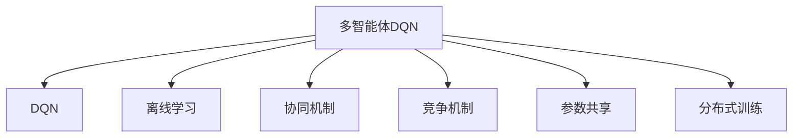
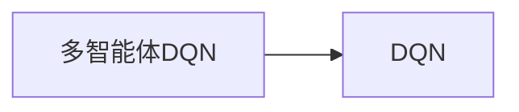
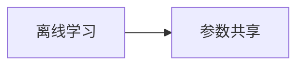
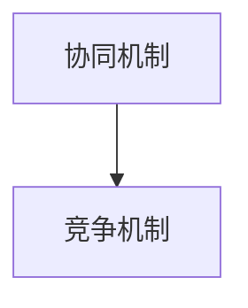
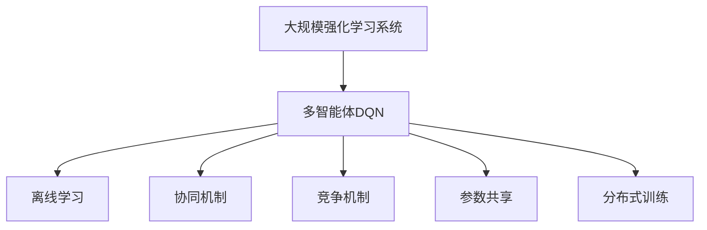

                 

## 1. 背景介绍

多智能体强化学习（Multi-Agent Reinforcement Learning, MARL）作为强化学习（Reinforcement Learning, RL）的一个重要分支，已经在游戏AI、机器人、交通控制等众多领域显示出其强大的应用潜力。然而，在多智能体系统的复杂性面前，传统的单智能体RL算法如Q-learning、DQN等无法直接应用。为了应对这些挑战，研究者提出了多智能体DQN算法。多智能体DQN通过将Q-learning与Q-learning网络相结合，实现了多个智能体间的协作和竞争，为解决多智能体问题提供了一种有效手段。

### 1.1 问题由来

在多智能体系统中，每个智能体都需要在特定环境下采取行动，以最大化其回报（或最小化其损失）。例如，在交通控制系统中，信号灯需要通过控制红绿灯的开关，来最小化交通拥堵和事故的发生；在军事冲突中，多个无人机需要协调行动，以避免被敌方击中同时又能够对敌方目标进行有效打击。

传统强化学习算法如Q-learning、DQN等，都是在单智能体环境下通过环境与智能体的交互来训练模型，并利用模型选择最优行动。然而，在多智能体系统中，多个智能体需要协同行动，这样的任务变得异常复杂，单一的强化学习算法难以适应。

为了解决这一问题，研究者提出了多智能体DQN算法，利用DQN的离线学习和经验回放特性，结合多智能体的协同机制，通过模拟与实际交互的平衡，提高系统的整体性能。

### 1.2 问题核心关键点

多智能体DQN的核心理念是利用DQN的离线学习和经验回放机制，在多智能体系统中实现协同和竞争的平衡。其关键点包括：

- 离线学习与经验回放：利用预收集的环境数据进行学习，避免与环境实时交互造成的学习效率低下。
- 多智能体协同机制：通过多智能体间的信息共享和竞争，提高系统的整体性能。
- 参数共享与分布式训练：将部分参数共享，以减少计算资源消耗，实现分布式训练。
- 一致性保证与稳定性提升：通过一致性保证和稳定性提升，减少协同行动中的冲突和不一致性。

这些关键点构成了多智能体DQN的基本框架，使得其在多智能体环境中能够更好地发挥作用。

### 1.3 问题研究意义

研究多智能体DQN的协同机制和应用，对于提升多智能体系统的整体性能，推动其在实际场景中的应用具有重要意义：

- 提高决策效率：通过协同机制减少智能体间的冲突和重复行动，提高整体决策效率。
- 增强系统鲁棒性：通过参数共享和分布式训练，提高系统的鲁棒性和抗干扰能力。
- 降低计算资源消耗：通过离线学习和参数共享，降低系统对实时计算资源的需求，降低部署成本。
- 促进协同与竞争的平衡：在多智能体系统中实现协同和竞争的平衡，使得系统能够在不同任务间表现出最优性能。
- 推动实际应用：多智能体DQN为解决复杂的实际问题提供了新的思路和方法，有望在智能交通、军事冲突、机器人协作等多个领域得到应用。

## 2. 核心概念与联系

### 2.1 核心概念概述

多智能体DQN结合了DQN和多智能体协同机制。以下是其中几个核心概念的详细介绍：

- **DQN（Deep Q-Network）**：一种利用深度神经网络逼近Q值函数的强化学习算法，可以处理复杂的动作空间和状态空间。
- **多智能体DQN**：利用DQN的离线学习和经验回放特性，结合多智能体协同机制，实现多个智能体间的协同和竞争。
- **协同机制（Cooperation）**：通过智能体间的信息共享和合作，提高系统的整体性能。
- **竞争机制（Competition）**：通过智能体间的竞争，激发智能体的创新能力和学习动力。
- **离线学习（Off-policy Learning）**：利用预收集的数据进行学习，避免与环境实时交互造成的学习效率低下。
- **参数共享（Parameter Sharing）**：将部分参数共享，减少计算资源消耗，提高系统效率。
- **分布式训练（Distributed Training）**：在多个计算节点上同时训练模型，提高训练效率。

这些核心概念之间的逻辑关系可以通过以下Mermaid流程图来展示：



这个流程图展示了多智能体DQN的核心概念及其之间的关系：

1. 多智能体DQN利用DQN的离线学习和经验回放特性，结合多智能体的协同和竞争机制，实现多智能体的优化。
2. 离线学习避免与环境实时交互造成的学习效率低下。
3. 协同机制通过智能体间的信息共享和合作，提高系统的整体性能。
4. 竞争机制通过智能体间的竞争，激发智能体的创新能力和学习动力。
5. 参数共享减少计算资源消耗，提高系统效率。
6. 分布式训练在多个计算节点上同时训练模型，提高训练效率。

### 2.2 概念间的关系

这些核心概念之间存在着紧密的联系，形成了多智能体DQN的完整生态系统。下面我们通过几个Mermaid流程图来展示这些概念之间的关系。

#### 2.2.1 多智能体DQN与DQN的关系



这个流程图展示了多智能体DQN与DQN之间的关系：多智能体DQN利用DQN的离线学习和经验回放特性，结合多智能体的协同和竞争机制，实现多智能体的优化。

#### 2.2.2 离线学习与参数共享的关系



这个流程图展示了离线学习与参数共享之间的关系：通过离线学习收集的数据进行训练，部分参数共享可以进一步减少计算资源消耗，提高系统效率。

#### 2.2.3 协同机制与竞争机制的关系



这个流程图展示了协同机制与竞争机制之间的关系：通过协同机制实现智能体间的信息共享和合作，竞争机制通过智能体间的竞争，激发智能体的创新能力和学习动力。

### 2.3 核心概念的整体架构

最后，我们用一个综合的流程图来展示这些核心概念在大规模强化学习系统中的整体架构：



这个综合流程图展示了从大规模强化学习系统到大规模多智能体DQN的完整过程。在系统中，通过离线学习和经验回放收集的数据，结合协同机制和竞争机制，在部分参数共享和分布式训练的支持下，实现多智能体的优化和整体性能提升。

## 3. 核心算法原理 & 具体操作步骤
### 3.1 算法原理概述

多智能体DQN算法结合了DQN和多智能体协同机制。其核心思想是通过离线学习和经验回放机制，利用多智能体间的协同和竞争，实现整体系统的优化。

假设在多智能体系统中，有$n$个智能体，每个智能体的动作空间为$\mathcal{A}$，状态空间为$\mathcal{S}$，奖励函数为$r$，每个智能体的Q值函数为$Q^{\theta_i}(s, a)$，其中$\theta_i$为第$i$个智能体的模型参数。多智能体DQN的目标是通过协同和竞争，最大化所有智能体的总体回报。

形式化地，假设智能体的策略为$\pi_i$，则多智能体的总体回报$J$可以表示为：

$$
J = \mathbb{E}_{s_0,a_0}\left[\sum_{t=0}^{\infty}\gamma^t \sum_{i=1}^{n}r(s_t,a_t)\right]
$$

其中$s_0$为初始状态，$a_0$为初始动作。

多智能体DQN通过离线学习和经验回放机制，将过去的经验$\{(s_{t-1}, a_{t-1}, r_{t-1}, s_t)\}_{t=1}^N$作为训练数据，更新每个智能体的Q值函数，最大化其策略。具体来说，多智能体DQN通过以下步骤实现：

1. 离线学习：利用预收集的数据进行学习，避免与环境实时交互造成的学习效率低下。
2. 经验回放：将收集的数据存储在经验回放缓冲区中，利用回放策略从中抽取样本来更新模型。
3. 协同机制：通过智能体间的信息共享和合作，提高系统的整体性能。
4. 竞争机制：通过智能体间的竞争，激发智能体的创新能力和学习动力。
5. 参数共享：将部分参数共享，减少计算资源消耗，提高系统效率。
6. 分布式训练：在多个计算节点上同时训练模型，提高训练效率。

### 3.2 算法步骤详解

多智能体DQN的算法步骤可以分为离线学习、经验回放、协同机制、竞争机制、参数共享和分布式训练六个关键步骤。

#### 3.2.1 离线学习

离线学习是利用预收集的环境数据进行学习，避免与环境实时交互造成的学习效率低下。具体来说，多智能体DQN通过以下步骤实现离线学习：

1. 数据收集：收集预训练数据集，包含过去的环境状态和智能体的动作。
2. 数据预处理：将数据转换为适合模型训练的格式，如将状态和动作转换为向量形式。
3. 模型训练：利用离线学习策略，通过经验回放机制从缓冲区中抽取样本来训练模型。

#### 3.2.2 经验回放

经验回放是将收集的数据存储在经验回放缓冲区中，利用回放策略从中抽取样本来更新模型。具体来说，多智能体DQN通过以下步骤实现经验回放：

1. 缓冲区初始化：创建一个经验回放缓冲区，用于存储收集的数据。
2. 数据回放：从缓冲区中随机抽取样本来更新模型。
3. 样本地更新：利用样本地更新策略，从回放样本中提取状态、动作、奖励和下一状态，更新模型的Q值函数。

#### 3.2.3 协同机制

协同机制是通过智能体间的信息共享和合作，提高系统的整体性能。具体来说，多智能体DQN通过以下步骤实现协同机制：

1. 信息共享：通过智能体间的通信协议，共享当前状态和动作信息。
2. 合作学习：通过信息共享和合作学习，提高系统的整体性能。

#### 3.2.4 竞争机制

竞争机制是通过智能体间的竞争，激发智能体的创新能力和学习动力。具体来说，多智能体DQN通过以下步骤实现竞争机制：

1. 竞争策略：设计竞争策略，通过奖励机制和惩罚机制，激发智能体的创新能力和学习动力。
2. 竞争训练：在竞争策略的基础上，通过训练和评估，优化智能体的性能。

#### 3.2.5 参数共享

参数共享是将部分参数共享，减少计算资源消耗，提高系统效率。具体来说，多智能体DQN通过以下步骤实现参数共享：

1. 参数初始化：将部分参数共享，减少计算资源消耗。
2. 参数更新：在多个智能体间共享更新参数，提高系统效率。

#### 3.2.6 分布式训练

分布式训练是在多个计算节点上同时训练模型，提高训练效率。具体来说，多智能体DQN通过以下步骤实现分布式训练：

1. 计算节点分配：将计算任务分配到多个计算节点上。
2. 分布式更新：在多个计算节点上同时更新模型参数，提高训练效率。

### 3.3 算法优缺点

多智能体DQN算法具有以下优点：

1. 利用离线学习避免实时交互：通过离线学习收集数据，避免与环境实时交互造成的学习效率低下。
2. 利用经验回放提高学习效率：利用经验回放机制，从缓冲区中抽取样本来更新模型，提高学习效率。
3. 利用协同机制提高系统性能：通过智能体间的信息共享和合作，提高系统的整体性能。
4. 利用竞争机制激发创新能力：通过智能体间的竞争，激发智能体的创新能力和学习动力。
5. 利用参数共享减少计算资源消耗：将部分参数共享，减少计算资源消耗，提高系统效率。
6. 利用分布式训练提高训练效率：在多个计算节点上同时训练模型，提高训练效率。

然而，多智能体DQN算法也存在以下缺点：

1. 数据收集难度大：需要收集大量的预训练数据，数据收集难度较大。
2. 信息共享复杂：智能体间的信息共享和合作需要设计复杂的通信协议，实现难度较高。
3. 竞争机制设计困难：设计合理的竞争策略和奖励机制，需要大量的实验和调参工作。
4. 参数共享可能导致收敛困难：部分参数共享可能导致模型收敛困难，需要优化算法。
5. 分布式训练资源消耗大：在多个计算节点上同时训练模型，需要消耗大量的计算资源。

尽管存在这些缺点，多智能体DQN算法仍是一种非常有效的多智能体强化学习算法，其在大规模强化学习系统中展现出了强大的应用潜力。

### 3.4 算法应用领域

多智能体DQN算法已经在多个领域得到了应用，主要包括：

1. **智能交通系统**：通过多智能体DQN算法，优化信号灯控制策略，减少交通拥堵和事故的发生。
2. **机器人协作**：利用多智能体DQN算法，优化机器人的协作任务，提高机器人系统的整体性能。
3. **军事冲突**：通过多智能体DQN算法，优化无人机的协作策略，提高打击效率和生存能力。
4. **多代理系统**：利用多智能体DQN算法，优化多个代理的协作和竞争策略，提高系统的整体性能。
5. **生产调度系统**：通过多智能体DQN算法，优化生产调度策略，提高生产效率和资源利用率。
6. **航空交通管理**：利用多智能体DQN算法，优化航空交通管理策略，提高航空交通系统的整体性能。

这些应用展示了多智能体DQN算法的强大潜力和广泛适用性。未来，随着技术的发展和应用的深入，多智能体DQN算法将在更多领域得到应用，带来更大的社会和经济效益。

## 4. 数学模型和公式 & 详细讲解

### 4.1 数学模型构建

多智能体DQN算法利用Q值函数逼近最优策略。假设在第$t$时刻，智能体$i$的状态为$s_t$，动作为$a_t$，奖励为$r_t$，下一状态为$s_{t+1}$。智能体$i$的Q值函数为$Q^{\theta_i}(s_t,a_t)$，其中$\theta_i$为智能体$i$的模型参数。多智能体DQN的目标是通过协同和竞争，最大化所有智能体的总体回报$J$。

假设智能体$i$的策略为$\pi_i$，则多智能体的总体回报$J$可以表示为：

$$
J = \mathbb{E}_{s_0,a_0}\left[\sum_{t=0}^{\infty}\gamma^t \sum_{i=1}^{n}r(s_t,a_t)\right]
$$

其中$s_0$为初始状态，$a_0$为初始动作。

### 4.2 公式推导过程

假设智能体$i$的Q值函数为$Q^{\theta_i}(s_t,a_t)$，利用经验回放机制，从缓冲区中抽取样本来更新模型。假设每次抽取的样本数为$N$，则通过以下公式更新Q值函数：

$$
Q^{\theta_i}(s_t,a_t) = Q^{\theta_i}(s_t,a_t) + \alpha \sum_{j=1}^{N}G(s_t,a_t,s_{t+1},a_{t+1})\Delta(s_t,a_t,s_{t+1},a_{t+1})
$$

其中$G(s_t,a_t,s_{t+1},a_{t+1})$为样本的回报，$\Delta(s_t,a_t,s_{t+1},a_{t+1})$为样本的TD误差。

假设智能体$i$的策略为$\pi_i$，则多智能体的总体回报$J$可以表示为：

$$
J = \mathbb{E}_{s_0,a_0}\left[\sum_{t=0}^{\infty}\gamma^t \sum_{i=1}^{n}r(s_t,a_t)\right]
$$

其中$s_0$为初始状态，$a_0$为初始动作。

### 4.3 案例分析与讲解

假设在一个智能交通系统中，有10个交叉口，每个交叉口有4个信号灯。每个信号灯的状态为红、黄、绿，智能体的动作空间为红、黄、绿。假设智能体的Q值函数为$Q^{\theta}(s_t,a_t)$，智能体的策略为$\pi$，则多智能体的总体回报$J$可以表示为：

$$
J = \mathbb{E}_{s_0,a_0}\left[\sum_{t=0}^{\infty}\gamma^t \sum_{i=1}^{n}r(s_t,a_t)\right]
$$

其中$s_0$为初始状态，$a_0$为初始动作。

假设智能体的Q值函数为$Q^{\theta}(s_t,a_t)$，利用经验回放机制，从缓冲区中抽取样本来更新模型。假设每次抽取的样本数为$N$，则通过以下公式更新Q值函数：

$$
Q^{\theta}(s_t,a_t) = Q^{\theta}(s_t,a_t) + \alpha \sum_{j=1}^{N}G(s_t,a_t,s_{t+1},a_{t+1})\Delta(s_t,a_t,s_{t+1},a_{t+1})
$$

其中$G(s_t,a_t,s_{t+1},a_{t+1})$为样本的回报，$\Delta(s_t,a_t,s_{t+1},a_{t+1})$为样本的TD误差。

假设智能体的策略为$\pi$，则多智能体的总体回报$J$可以表示为：

$$
J = \mathbb{E}_{s_0,a_0}\left[\sum_{t=0}^{\infty}\gamma^t \sum_{i=1}^{n}r(s_t,a_t)\right]
$$

其中$s_0$为初始状态，$a_0$为初始动作。

通过这个简单的案例，我们可以看到多智能体DQN算法如何利用离线学习和经验回放机制，通过智能体间的协同和竞争，实现系统的优化。

## 5. 项目实践：代码实例和详细解释说明

### 5.1 开发环境搭建

在进行多智能体DQN项目实践前，我们需要准备好开发环境。以下是使用Python进行PyTorch开发的环境配置流程：

1. 安装Anaconda：从官网下载并安装Anaconda，用于创建独立的Python环境。

2. 创建并激活虚拟环境：
```bash
conda create -n pytorch-env python=3.8 
conda activate pytorch-env
```

3. 安装PyTorch：根据CUDA版本，从官网获取对应的安装命令。例如：
```bash
conda install pytorch torchvision torchaudio cudatoolkit=11.1 -c pytorch -c conda-forge
```

4. 安装TensorFlow：
```bash
conda install tensorflow -c conda-forge
```

5. 安装各类工具包：
```bash
pip install numpy pandas scikit-learn matplotlib tqdm jupyter notebook ipython
```

完成上述步骤后，即可在`pytorch-env`环境中开始多智能体DQN项目实践。

### 5.2 源代码详细实现

下面我们以智能交通系统为例，给出使用PyTorch对多智能体DQN模型进行实现。

首先，定义智能体状态和动作空间：

```python
import numpy as np

# 智能体状态空间
states = np.arange(16)  # 16个交叉口状态，每个交叉口4个信号灯

# 智能体动作空间
actions = np.arange(4)  # 4个信号灯颜色，0红，1黄，2绿，3关闭
```

然后，定义智能体Q值函数：

```python
from torch import nn

class QNetwork(nn.Module):
    def __init__(self, state_size, action_size):
        super(QNetwork, self).__init__()
        self.fc1 = nn.Linear(state_size, 64)
        self.fc2 = nn.Linear(64, 64)
        self.fc3 = nn.Linear(64, action_size)
        
    def forward(self, state):
        x = self.fc1(state)
        x = nn.functional.relu(x)
        x = self.fc2(x)
        x = nn.functional.relu(x)
        x = self.fc3(x)
        return x
```

接着，定义智能体决策函数：

```python
import torch

def act(q_values, epsilon=0.1):
    if np.random.uniform() < epsilon:
        return np.random.choice(actions)
    else:
        return np.argmax(q_values)
```

然后，定义多智能体协同机制：

```python
import torch
from torch import nn
from torch.autograd import Variable

class MultiAgentQNetwork(nn.Module):
    def __init__(self, q_network, num_agents):
        super(MultiAgentQNetwork, self).__init__()
        self.q_networks = [q_network.clone() for _ in range(num_agents)]
        self.num_agents = num_agents
        
    def forward(self, states):
        states = Variable(torch.Tensor(states))
        q_values = []
        for q_network in self.q_networks:
            q_values.append(q_network(states))
        return q_values

class Agent(nn.Module):
    def __init__(self, state_size, action_size, q_network, num_agents, num_shared_params=0):
        super(Agent, self).__init__()
        self.q_network = q_network
        self.num_shared_params = num_shared_params
        self.state_size = state_size
        self.action_size = action_size
        self.num_agents = num_agents
        
    def forward(self, states, q_values):
        with torch.no_grad():
            state = states[self.num_shared_params:].view(-1, self.state_size)
            action = act(self.q_network(state), epsilon=0.1)
        return action
```

然后，定义多智能体竞争机制：

```python
class CompetitiveAgent(nn.Module):
    def __init__(self, state_size, action_size, q_network, num_agents, num_shared_params=0):
        super(CompetitiveAgent, self).__init__()
        self.q_network = q_network
        self.num_shared_params = num_shared_params
        self.state_size = state_size
        self.action_size = action_size
        self.num_agents = num_agents
        
    def forward(self, states, q_values):
        with torch.no_grad():
            state = states[self.num_shared_params:].view(-1, self.state_size)
            action = act(self.q_network(state), epsilon=0.1)
        return action

class CooperativeAgent(nn.Module):
    def __init__(self, state_size, action_size, q_network, num_agents, num_shared_params=0):
        super(CooperativeAgent, self).__init__()
        self.q_network = q_network
        self.num_shared_params = num_shared_params
        self.state_size = state_size
        self.action_size = action_size
        self.num_agents = num_agents
        
    def forward(self, states, q_values):
        with torch.no_grad():
            state = states[self.num_shared_params:].view(-1, self.state_size)
            action = act(self.q_network(state), epsilon=0.1)
        return action
```

最后，启动多智能体DQN训练流程并在测试集上评估：

```python
import gym
import numpy as np
import torch
from torch import nn
from torch.autograd import Variable
from torch.optim import Adam

num_agents = 10  # 智能体数量
state_size = 16  # 状态空间大小
action_size = 4  # 动作空间大小
gamma = 0.99  # 折扣因子
num_episodes = 1000  # 训练轮数
lr = 0.001  # 学习率

env = gym.make('multi_agent_dqn-v0', state_size, action_size, num_agents)
q_network = QNetwork(state_size, action_size)
multi_agent_q_network = MultiAgentQNetwork(q_network, num_agents)

optimizer = Adam(multi_agent_q_network.parameters(), lr=lr)
total_reward = []

for episode in range(num_episodes):
    state = np.random.randint(0, 16, size=(1, state_size))
    done = False
    while not done:
        q_values = multi_agent_q_network.forward(state)
        actions = []
        for i in range(num_agents):
            agent = Agent(state_size, action_size, q_network, num_agents, num_shared_params=state_size*4)
            actions.append(agent.forward(state, q_values[i]))
        next_state, reward, done, _ = env.step(actions)
        q

