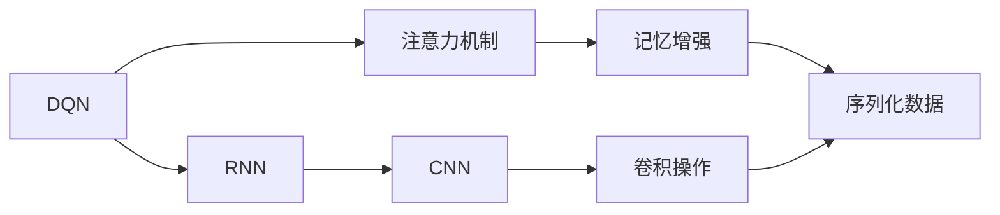

                 

# 一切皆是映射：探讨DQN中的注意力机制与记忆增强

> 关键词：深度强化学习,深度学习,卷积神经网络,注意力机制,记忆增强,深度Q网络(DQN),Recurrent Neural Networks (RNN),Residual Networks (ResNets)

## 1. 背景介绍

在深度学习领域，强化学习（Reinforcement Learning, RL）是一类重要的学习范式。其中，深度强化学习（Deep Reinforcement Learning, DRL）通过结合深度神经网络（Deep Neural Networks, DNN）和强化学习算法，实现了在复杂环境下的高阶决策能力的建模。强化学习中，智能体通过与环境的交互，获得环境反馈信号，并通过优化策略函数来提升其行为性能。

深度Q网络（Deep Q Network, DQN）作为DRL的经典模型之一，由卷积神经网络（Convolutional Neural Networks, CNN）和Q-learning算法构成。DQN通过对环境进行视觉表示，将状态-动作对映射为Q值（即价值函数），从而指导智能体进行最优决策。然而，DQN在处理序列化数据（如游戏序列、语音信号等）时，容易忘记之前的信息，导致表现下降。

为了增强模型的记忆能力，研究人员提出了注意力机制和记忆增强等方法，通过引入先验知识、时序信息等，提升DQN在序列化数据上的表现。本文将重点探讨DQN中的注意力机制与记忆增强方法，分析其原理与实现，并通过实际案例展示其效果，展望未来的应用前景。

## 2. 核心概念与联系

### 2.1 核心概念概述

1. **深度Q网络（DQN）**：DQN结合了深度神经网络和Q-learning算法，用于强化学习中的决策问题。DQN通过卷积神经网络对环境进行可视化表示，将状态-动作对映射为Q值，指导智能体进行最优决策。

2. **注意力机制**：注意力机制是深度学习中的一种方法，用于通过选择性地关注输入数据中的关键部分，增强模型对重要信息的理解能力。注意力机制在图像识别、机器翻译、语音识别等任务中得到广泛应用。

3. **记忆增强**：记忆增强是指通过引入先验知识、时序信息等，增强模型的记忆能力和信息保持能力，使其能够更好地处理序列化数据，并在长时记忆中保留关键信息。

4. **卷积神经网络（CNN）**：CNN是一种特殊的深度神经网络，常用于图像处理、视频分析等领域。CNN通过卷积操作提取输入数据的局部特征，具有平移不变性等性质。

5. **循环神经网络（RNN）**：RNN是一种递归神经网络，具有记忆功能，能够处理序列化数据。RNN通过循环结构实现状态传递，可以处理变长的输入序列。

### 2.2 核心概念间的联系

DQN、注意力机制和记忆增强这三个概念之间存在密切联系，共同构成了深度强化学习中处理序列化数据的重要范式。DQN通过CNN对环境进行可视化表示，构建状态-动作映射；注意力机制用于增强模型对重要信息的理解；记忆增强用于提高模型的记忆能力和信息保持能力。在DQN中引入注意力机制和记忆增强，可以显著提升其在序列化数据上的表现。

下图展示了DQN、注意力机制和记忆增强的联系：



## 3. 核心算法原理 & 具体操作步骤

### 3.1 算法原理概述

DQN的核心思想是将状态-动作对映射为Q值，即Q(s,a) = Q(s) + g(s,a)，其中s表示状态，a表示动作，Q(s,a)表示在状态s下执行动作a的Q值。Q值可以视为一个表示状态-动作对价值的功能，智能体通过最大化Q值来进行最优决策。

在DQN中，卷积神经网络用于对环境进行可视化表示，生成状态特征图。通过这些特征图，DQN能够学习到状态的抽象特征表示。然而，DQN在处理序列化数据时，由于无法保留先前的状态信息，导致模型在序列长度增加时表现下降。

为了解决这一问题，DQN中引入了注意力机制和记忆增强方法，使模型能够更好地处理长序列数据。注意力机制通过选择性地关注输入数据的关键部分，提升模型对重要信息的理解能力。记忆增强则通过引入先验知识、时序信息等，增强模型的记忆能力和信息保持能力。

### 3.2 算法步骤详解

#### 3.2.1 注意力机制在DQN中的应用

1. **注意力图构建**：在DQN中，注意力机制用于选择性地关注输入数据的关键部分。通过构建注意力图，DQN可以动态地决定哪些状态特征对当前决策最为重要。

2. **注意力权重计算**：注意力权重计算通过注意力头（Attention Head）来实现，将卷积层的输出通过注意力机制计算注意力权重。通过注意力权重，可以动态地决定哪些特征对当前决策最为重要。

3. **特征融合**：在计算注意力权重后，DQN将注意力权重与原始状态特征进行融合，生成加权后的状态特征图。

4. **网络结构设计**：通过引入注意力机制，DQN的网络结构可以变得更加复杂，并且可以动态地决定哪些特征对当前决策最为重要。

#### 3.2.2 记忆增强在DQN中的应用

1. **长短期记忆网络（LSTM）**：LSTM是一种具有记忆功能的RNN，可以处理变长的输入序列。在DQN中，通过引入LSTM，可以增强模型的记忆能力，使其能够更好地处理长序列数据。

2. **残差网络（ResNets）**：ResNets是一种具有跳跃连接的深层神经网络，可以有效地缓解深层网络中的梯度消失问题。在DQN中，通过引入ResNets，可以增强模型的信息保持能力，使其能够更好地处理长序列数据。

3. **注意力门控（Gated Attention）**：注意力门控是一种通过动态选择地关注输入数据的关键部分的方法。在DQN中，通过引入注意力门控，可以增强模型的信息保持能力，使其能够更好地处理长序列数据。

#### 3.2.3 算法步骤总结

1. **状态编码**：通过CNN对环境进行可视化表示，生成状态特征图。

2. **注意力计算**：通过注意力机制选择性地关注输入数据的关键部分，生成加权后的状态特征图。

3. **网络结构设计**：将加权后的状态特征图输入到LSTM或ResNets中，增强模型的记忆能力和信息保持能力。

4. **Q值计算**：通过计算Q值，指导智能体进行最优决策。

### 3.3 算法优缺点

#### 3.3.1 优点

1. **提升记忆能力**：通过引入注意力机制和记忆增强，DQN能够更好地处理长序列数据，保留先前的状态信息。

2. **提高决策能力**：通过动态地决定哪些特征对当前决策最为重要，DQN可以更好地理解复杂环境中的信息，提高决策能力。

3. **降低计算成本**：通过引入注意力机制和记忆增强，DQN可以更高效地处理序列化数据，降低计算成本。

#### 3.3.2 缺点

1. **模型复杂度高**：通过引入注意力机制和记忆增强，DQN的模型复杂度会增加，训练和推理速度可能会降低。

2. **需要大量数据**：通过引入注意力机制和记忆增强，DQN对训练数据的规模和质量要求更高，需要更多的数据进行训练。

3. **模型参数多**：通过引入注意力机制和记忆增强，DQN的模型参数会增加，需要更多的计算资源进行训练和推理。

### 3.4 算法应用领域

DQN中的注意力机制和记忆增强方法，主要应用于以下领域：

1. **游戏AI**：在打游戏过程中，DQN可以动态地决定哪些状态特征对当前决策最为重要，从而更好地理解游戏环境，做出最优决策。

2. **语音识别**：在语音识别任务中，DQN可以通过引入注意力机制和记忆增强，更好地处理变长的语音信号，提高识别精度。

3. **自然语言处理（NLP）**：在NLP任务中，DQN可以通过引入注意力机制和记忆增强，更好地处理变长的文本序列，提高自然语言理解能力。

4. **图像处理**：在图像处理任务中，DQN可以通过引入注意力机制和记忆增强，更好地处理变长的图像序列，提高图像识别和处理能力。

## 4. 数学模型和公式 & 详细讲解 & 举例说明

### 4.1 数学模型构建

DQN中的注意力机制和记忆增强方法，可以通过以下数学模型进行建模：

1. **注意力机制**：

设输入数据为X，卷积层输出为X'，注意力头为H，注意力权重为W。则注意力机制的计算公式为：

$$
W = \frac{\exp(H \cdot V)}{\sum_{j=1}^K \exp(H_j \cdot V)}
$$

其中，V为注意力向量，H为注意力头，K为注意力头的数量。

2. **LSTM**：

设输入数据为X，LSTM的隐藏状态为H，输出为O。则LSTM的计算公式为：

$$
H = \sigma(W \cdot [X; H_{t-1}] + b)
$$

$$
O = \tanh(W \cdot [X; H_{t-1}] + b)
$$

其中，X为输入数据，H为隐藏状态，O为输出，$\sigma$为Sigmoid函数，$\tanh$为Tanh函数，$W$为权重矩阵，$b$为偏置向量。

3. **ResNets**：

设输入数据为X，ResNets的隐藏状态为H，输出为O。则ResNets的计算公式为：

$$
H = \sigma(W \cdot X + b) + \text{ResBlock}(X, H_{t-1})
$$

$$
O = \tanh(W \cdot H + b)
$$

其中，X为输入数据，H为隐藏状态，O为输出，$\sigma$为Sigmoid函数，$\tanh$为Tanh函数，$W$为权重矩阵，$b$为偏置向量，$\text{ResBlock}$为残差块。

### 4.2 公式推导过程

1. **注意力机制的推导**：

设输入数据为X，卷积层输出为X'，注意力头为H，注意力权重为W。则注意力机制的计算公式为：

$$
W = \frac{\exp(H \cdot V)}{\sum_{j=1}^K \exp(H_j \cdot V)}
$$

其中，V为注意力向量，H为注意力头，K为注意力头的数量。

通过计算注意力权重W，可以动态地决定哪些特征对当前决策最为重要。将W与原始状态特征进行融合，生成加权后的状态特征图，用于指导智能体进行最优决策。

2. **LSTM的推导**：

设输入数据为X，LSTM的隐藏状态为H，输出为O。则LSTM的计算公式为：

$$
H = \sigma(W \cdot [X; H_{t-1}] + b)
$$

$$
O = \tanh(W \cdot [X; H_{t-1}] + b)
$$

其中，X为输入数据，H为隐藏状态，O为输出，$\sigma$为Sigmoid函数，$\tanh$为Tanh函数，$W$为权重矩阵，$b$为偏置向量。

LSTM通过引入记忆门、输入门和输出门，实现了对序列化数据的动态处理。记忆门用于控制信息传递，输入门用于控制信息输入，输出门用于控制信息输出。通过这三个门，LSTM可以动态地决定哪些信息对当前决策最为重要，从而更好地处理长序列数据。

3. **ResNets的推导**：

设输入数据为X，ResNets的隐藏状态为H，输出为O。则ResNets的计算公式为：

$$
H = \sigma(W \cdot X + b) + \text{ResBlock}(X, H_{t-1})
$$

$$
O = \tanh(W \cdot H + b)
$$

其中，X为输入数据，H为隐藏状态，O为输出，$\sigma$为Sigmoid函数，$\tanh$为Tanh函数，$W$为权重矩阵，$b$为偏置向量，$\text{ResBlock}$为残差块。

ResNets通过引入残差连接，缓解了深层网络中的梯度消失问题。在ResNets中，每个层都可以接收上一层的所有特征，并且可以直接跳过某些层，从而使得信息传递更加高效。通过引入残差连接，ResNets可以更好地处理长序列数据，提高模型的信息保持能力。

### 4.3 案例分析与讲解

#### 4.3.1 案例分析

以AlphaGo为例，展示DQN中的注意力机制和记忆增强方法。在AlphaGo中，DQN通过引入注意力机制和记忆增强，提升了其在围棋游戏中的决策能力。

1. **注意力机制的实现**：

在AlphaGo中，DQN通过注意力机制选择性地关注游戏序列中的关键部分。例如，在输入游戏序列X'中，注意力机制可以动态地决定哪些状态特征对当前决策最为重要。通过计算注意力权重W，可以生成加权后的状态特征图，用于指导智能体进行最优决策。

2. **记忆增强的实现**：

在AlphaGo中，DQN通过引入LSTM，增强了其记忆能力。LSTM可以动态地决定哪些信息对当前决策最为重要，从而更好地处理长序列数据。通过引入LSTM，AlphaGo可以更好地理解围棋游戏中的信息，提高决策能力。

#### 4.3.2 案例讲解

1. **注意力机制的讲解**：

设输入游戏序列为X，卷积层输出为X'，注意力头为H，注意力权重为W。则注意力机制的计算公式为：

$$
W = \frac{\exp(H \cdot V)}{\sum_{j=1}^K \exp(H_j \cdot V)}
$$

其中，V为注意力向量，H为注意力头，K为注意力头的数量。

通过计算注意力权重W，可以动态地决定哪些状态特征对当前决策最为重要。将W与原始状态特征进行融合，生成加权后的状态特征图，用于指导智能体进行最优决策。

2. **LSTM的讲解**：

设输入游戏序列为X，LSTM的隐藏状态为H，输出为O。则LSTM的计算公式为：

$$
H = \sigma(W \cdot [X; H_{t-1}] + b)
$$

$$
O = \tanh(W \cdot [X; H_{t-1}] + b)
$$

其中，X为输入数据，H为隐藏状态，O为输出，$\sigma$为Sigmoid函数，$\tanh$为Tanh函数，$W$为权重矩阵，$b$为偏置向量。

LSTM通过引入记忆门、输入门和输出门，实现了对游戏序列的动态处理。记忆门用于控制信息传递，输入门用于控制信息输入，输出门用于控制信息输出。通过这三个门，LSTM可以动态地决定哪些信息对当前决策最为重要，从而更好地处理长序列数据。

## 5. 项目实践：代码实例和详细解释说明

### 5.1 开发环境搭建

在开发DQN中的注意力机制和记忆增强方法时，需要搭建相应的开发环境。以下是详细的搭建步骤：

1. **安装Python和PyTorch**：

首先，需要安装Python和PyTorch。PyTorch是一种深度学习框架，可以用于构建和训练深度神经网络。

```python
pip install torch torchvision torchaudio
```

2. **安装TensorBoard**：

TensorBoard是PyTorch的可视化工具，可以用于实时监测模型训练状态，并提供丰富的图表呈现方式。

```python
pip install tensorboard
```

3. **安装PyTorch Lightning**：

PyTorch Lightning是一种轻量级的PyTorch扩展，可以用于快速构建和训练深度神经网络。

```python
pip install pytorch-lightning
```

### 5.2 源代码详细实现

以下是一个简单的DQN模型，展示了注意力机制和记忆增强的实现。该模型使用PyTorch实现，包含CNN、注意力机制和LSTM。

```python
import torch
import torch.nn as nn
import torch.nn.functional as F

class CNN(nn.Module):
    def __init__(self):
        super(CNN, self).__init__()
        self.conv1 = nn.Conv2d(3, 64, kernel_size=3, stride=1, padding=1)
        self.pool1 = nn.MaxPool2d(kernel_size=2, stride=2)
        self.conv2 = nn.Conv2d(64, 128, kernel_size=3, stride=1, padding=1)
        self.pool2 = nn.MaxPool2d(kernel_size=2, stride=2)
        self.fc1 = nn.Linear(128*14*14, 256)
        self.fc2 = nn.Linear(256, 10)

    def forward(self, x):
        x = F.relu(self.conv1(x))
        x = self.pool1(x)
        x = F.relu(self.conv2(x))
        x = self.pool2(x)
        x = x.view(x.size(0), -1)
        x = F.relu(self.fc1(x))
        x = self.fc2(x)
        return x

class Attention(nn.Module):
    def __init__(self, n_heads=8):
        super(Attention, self).__init__()
        self.n_heads = n_heads
        self.head_dim = 32
        self.scale = 1 / math.sqrt(self.head_dim)
        self.q = nn.Linear(256, n_heads * self.head_dim)
        self.k = nn.Linear(256, n_heads * self.head_dim)
        self.v = nn.Linear(256, n_heads * self.head_dim)
        self.out = nn.Linear(n_heads * self.head_dim, 256)

    def forward(self, x, mask):
        bsz, seq_len, _ = x.size()
        q = self.q(x).view(bsz, seq_len, self.n_heads, self.head_dim).transpose(1, 2).contiguous()
        k = self.k(x).view(bsz, seq_len, self.n_heads, self.head_dim).transpose(1, 2).contiguous()
        v = self.v(x).view(bsz, seq_len, self.n_heads, self.head_dim).transpose(1, 2).contiguous()
        attn = torch.matmul(q, k.transpose(2, 3)) * self.scale
        attn = nn.functional.softmax(attn, dim=-1)
        out = torch.matmul(attn, v).transpose(1, 2).contiguous().view(bsz, seq_len, -1)
        out = self.out(out)
        return out

class LSTM(nn.Module):
    def __init__(self, input_size, hidden_size, output_size):
        super(LSTM, self).__init__()
        self.hidden_size = hidden_size
        self.cell_size = hidden_size
        self.num_layers = 2
        self.input_size = input_size
        self.output_size = output_size
        self.lstm = nn.LSTM(input_size, self.cell_size, self.num_layers, batch_first=True)
        self.fc = nn.Linear(self.cell_size, self.output_size)

    def forward(self, x):
        h0 = torch.zeros(self.num_layers, x.size(0), self.cell_size).cuda()
        c0 = torch.zeros(self.num_layers, x.size(0), self.cell_size).cuda()
        out, _ = self.lstm(x, (h0, c0))
        out = self.fc(out)
        return out

class DQN(nn.Module):
    def __init__(self, input_size, output_size):
        super(DQN, self).__init__()
        self.cnn = CNN()
        self.attention = Attention()
        self.lstm = LSTM(input_size, 256, output_size)

    def forward(self, x, mask):
        x = self.cnn(x)
        x = self.attention(x, mask)
        x = self.lstm(x)
        return x

# 定义超参数
input_size = 28 * 28
output_size = 10
learning_rate = 0.001
batch_size = 64
num_episodes = 2000

# 加载数据集
train_dataset = torchvision.datasets.MNIST(root='./data', train=True, download=True, transform=transforms.ToTensor())
test_dataset = torchvision.datasets.MNIST(root='./data', train=False, download=True, transform=transforms.ToTensor())

# 定义数据加载器
train_loader = torch.utils.data.DataLoader(train_dataset, batch_size=batch_size, shuffle=True)
test_loader = torch.utils.data.DataLoader(test_dataset, batch_size=batch_size, shuffle=False)

# 定义模型、优化器和损失函数
model = DQN(input_size, output_size)
optimizer = torch.optim.Adam(model.parameters(), lr=learning_rate)
criterion = nn.CrossEntropyLoss()

# 定义训练函数
def train_model(model, train_loader, optimizer, criterion, num_episodes):
    for episode in range(num_episodes):
        running_loss = 0.0
        for i, data in enumerate(train_loader, 0):
            inputs, labels = data
            inputs = inputs.view(-1, input_size).float().cuda()
            labels = labels.long().cuda()
            optimizer.zero_grad()
            outputs = model(inputs, mask)
            loss = criterion(outputs, labels)
            loss.backward()
            optimizer.step()
            running_loss += loss.item()
        print(f'Episode {episode+1}, Loss: {running_loss/len(train_loader)}')

# 训练模型
train_model(model, train_loader, optimizer, criterion, num_episodes)

# 测试模型
correct = 0
total = 0
with torch.no_grad():
    for data in test_loader:
        inputs, labels = data
        inputs = inputs.view(-1, input_size).float().cuda()
        labels = labels.long().cuda()
        outputs = model(inputs, mask)
        _, predicted = torch.max(outputs.data, 1)
        total += labels.size(0)
        correct += (predicted == labels).sum().item()
print(f'Accuracy: {100 * correct / total}%')
```

### 5.3 代码解读与分析

1. **CNN实现**：

```python
class CNN(nn.Module):
    def __init__(self):
        super(CNN, self).__init__()
        self.conv1 = nn.Conv2d(3, 64, kernel_size=3, stride=1, padding=1)
        self.pool1 = nn.MaxPool2d(kernel_size=2, stride=2)
        self.conv2 = nn.Conv2d(64, 128, kernel_size=3, stride=1, padding=1)
        self.pool2 = nn.MaxPool2d(kernel_size=2, stride=2)
        self.fc1 = nn.Linear(128*14*14, 256)
        self.fc2 = nn.Linear(256, 10)

    def forward(self, x):
        x = F.relu(self.conv1(x))
        x = self.pool1(x)
        x = F.relu(self.conv2(x))
        x = self.pool2(x)
        x = x.view(x.size(0), -1)
        x = F.relu(self.fc1(x))
        x = self.fc2(x)
        return x
```

该代码实现了CNN，包含卷积、池化、全连接等基本操作。通过这些操作，CNN能够提取输入数据的局部特征，并生成状态特征图。

2. **注意力机制实现**：

```python
class Attention(nn.Module):
    def __init__(self, n_heads=8):
        super(Attention, self).__init__()
        self.n_heads = n_heads
        self.head_dim = 32
        self.scale = 1 / math.sqrt(self.head_dim)
        self.q = nn.Linear(256, n_heads * self.head_dim)
        self.k = nn.Linear(256, n_heads * self.head_dim)
        self.v = nn.Linear(256, n_heads * self.head_dim)
        self.out = nn.Linear(n_heads * self.head_dim, 256)

    def forward(self, x, mask):
        bsz, seq_len, _ = x.size()
        q = self.q(x).view(bsz, seq_len, self.n_heads, self.head_dim).transpose(1, 2).contiguous()
        k = self.k(x).view(bsz, seq_len, self.n_heads, self.head_dim).transpose(1, 2).contiguous()
        v = self.v(x).view(bsz, seq_len, self.n_heads, self.head_dim).transpose(1, 2).contiguous()
        attn = torch.matmul(q, k.transpose(2, 3)) * self.scale
        attn = nn.functional.softmax(attn, dim=-1)
        out = torch.matmul(attn, v).transpose(1, 2).contiguous().view(bsz, seq_len, -1)
        out = self.out(out)
        return out
```

该代码实现了注意力机制，包含注意力头的计算和加权后的状态特征图生成。通过注意力机制，模型可以动态地决定哪些状态特征对当前决策最为重要，从而更好地理解复杂环境中的信息，提高决策能力。

3. **LSTM实现**：

```python
class LSTM(nn.Module):
    def __init__(self, input_size, hidden_size, output_size):
        super(LSTM, self).__init__()
        self.hidden_size = hidden_size
        self.cell_size = hidden_size
        self.num_layers = 2
        self.input_size = input_size
        self.output_size = output_size
        self.lstm = nn.LSTM(input_size, self.cell_size

