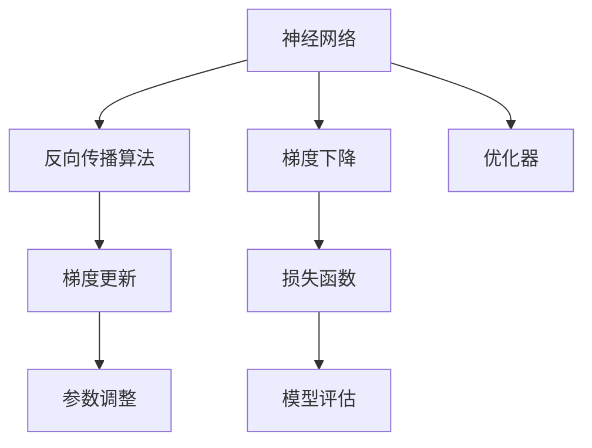
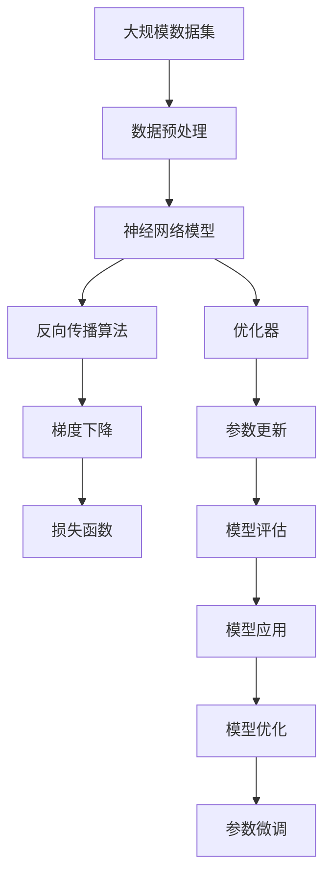

                 

# 一切皆是映射：构建第一个深度学习模型

> 关键词：深度学习,神经网络,反向传播,梯度下降,反向传播算法,梯度更新

## 1. 背景介绍

### 1.1 问题由来

深度学习作为人工智能领域的重大突破，其核心思想是通过构建多层次的神经网络模型，模仿人脑的神经元连接，实现对复杂数据的高效处理和特征提取。深度学习模型在图像识别、语音处理、自然语言处理等领域取得了显著成果，被广泛应用于工业界和学术界。

尽管深度学习取得了巨大成功，但其背后的原理仍然较为复杂，对新学习者而言并不容易理解。因此，本文旨在通过简洁的语言，介绍深度学习模型的基本原理和构建步骤，让初学者也能够轻松掌握这一强大的工具。

### 1.2 问题核心关键点

在构建深度学习模型时，我们需要解决以下关键问题：

1. **模型选择**：选择合适的模型结构，以便处理特定类型的数据。
2. **损失函数设计**：定义合适的损失函数，衡量模型预测与真实标签之间的差异。
3. **优化算法选择**：选择合适的优化算法，最小化损失函数，更新模型参数。
4. **数据预处理**：对输入数据进行标准化、归一化等预处理，提高模型性能。
5. **模型训练**：在训练集上反复迭代，不断更新模型参数，直到收敛。
6. **模型评估**：在验证集上评估模型性能，避免过拟合。
7. **模型部署**：将训练好的模型应用到实际任务中，实现预测和推理。

这些问题共同构成了深度学习模型构建的基础框架，通过逐一解决，我们可以构建出能够处理复杂数据的高性能模型。

### 1.3 问题研究意义

深度学习模型的构建，对于推动人工智能技术的发展，解决实际问题，具有重要意义：

1. **提升模型性能**：通过合理的模型选择和参数优化，深度学习模型能够处理大规模、高维度的数据，提取复杂的特征，从而提升模型的预测精度。
2. **解决复杂问题**：深度学习模型能够处理非结构化数据，如图像、语音、文本等，广泛应用于计算机视觉、自然语言处理等领域，解决复杂问题。
3. **降低开发成本**：与传统机器学习相比，深度学习模型构建过程自动化程度高，能够自动学习特征，减少手工特征工程的工作量。
4. **促进技术创新**：深度学习模型的不断改进和创新，推动了计算机科学和工程技术的进步，促进了新的应用场景的开发。
5. **实现自动化**：深度学习模型能够自动执行复杂任务，减少了人工干预，提高了工作效率。

总之，深度学习模型的构建，是推动人工智能技术向更广泛领域应用的重要步骤，具有深远的理论和实际意义。

## 2. 核心概念与联系

### 2.1 核心概念概述

为了更好地理解深度学习模型的构建，我们需要了解一些关键概念：

- **神经网络**：一种由大量神经元（即节点）组成的多层次计算模型，每个神经元都接收多个输入，并通过激活函数进行处理。
- **反向传播算法**：一种用于训练神经网络的算法，通过反向传播误差信号，不断更新网络参数，最小化损失函数。
- **梯度下降**：一种常用的优化算法，通过不断调整参数，使损失函数最小化，优化模型性能。
- **损失函数**：衡量模型预测与真实标签之间差异的函数，常见的损失函数包括均方误差、交叉熵等。
- **优化器**：用于更新模型参数的算法，常见的优化器包括梯度下降、Adam等。

这些概念构成了深度学习模型的核心，通过理解它们，我们可以更好地构建和优化深度学习模型。

### 2.2 概念间的关系

这些核心概念之间存在着紧密的联系，形成了深度学习模型的完整生态系统。以下是一个简化的Mermaid流程图，展示了这些概念之间的关系：



这个流程图展示了神经网络、反向传播算法、梯度下降、损失函数和优化器之间的关系：

1. 神经网络通过反向传播算法更新参数，最小化损失函数。
2. 梯度下降用于更新参数，优化损失函数。
3. 损失函数衡量模型预测与真实标签之间的差异。
4. 优化器选择适合的算法，更新参数。
5. 模型评估用于验证模型性能。

这些概念共同构成了深度学习模型的学习框架，使得模型能够自动学习特征，提升预测精度。

### 2.3 核心概念的整体架构

最后，我们用一个综合的流程图来展示这些核心概念在大模型构建过程中的整体架构：



这个综合流程图展示了从数据预处理到模型应用，再到模型优化的完整过程：

1. 数据预处理：对输入数据进行标准化、归一化等预处理。
2. 神经网络模型：选择合适的模型结构，构建深度学习模型。
3. 反向传播算法：通过反向传播误差信号，更新模型参数。
4. 梯度下降：使用梯度下降算法，优化模型参数。
5. 损失函数：定义合适的损失函数，衡量模型预测与真实标签之间的差异。
6. 优化器：选择适合的优化算法，更新模型参数。
7. 参数更新：不断调整参数，提升模型性能。
8. 模型评估：在验证集上评估模型性能，避免过拟合。
9. 模型应用：将训练好的模型应用到实际任务中，实现预测和推理。
10. 模型优化：通过微调等手段，进一步提升模型性能。

通过这个架构图，我们可以清晰地理解深度学习模型的构建和优化过程。

## 3. 核心算法原理 & 具体操作步骤
### 3.1 算法原理概述

深度学习模型的核心原理是通过反向传播算法和梯度下降等优化算法，不断调整模型参数，最小化损失函数，提升模型预测精度。其基本步骤如下：

1. **数据准备**：准备训练集、验证集和测试集，划分为输入和标签。
2. **模型构建**：选择适当的模型结构，初始化模型参数。
3. **前向传播**：将输入数据输入模型，计算输出。
4. **损失计算**：计算模型输出与真实标签之间的差异，得到损失函数值。
5. **反向传播**：反向传播误差信号，计算梯度。
6. **梯度更新**：使用梯度下降等优化算法，更新模型参数。
7. **模型评估**：在验证集上评估模型性能，防止过拟合。
8. **模型应用**：将训练好的模型应用到实际任务中，进行预测和推理。

### 3.2 算法步骤详解

以下是一个简单的神经网络模型构建步骤，包括数据准备、模型构建、前向传播、损失计算、反向传播、梯度更新、模型评估和模型应用。

**Step 1: 数据准备**

- **数据集划分**：将数据集划分为训练集、验证集和测试集。
- **数据预处理**：对输入数据进行标准化、归一化等预处理。

```python
import numpy as np
from sklearn.datasets import make_classification
from sklearn.model_selection import train_test_split

# 生成随机数据集
X, y = make_classification(n_samples=1000, n_features=10, n_informative=5, n_classes=2, random_state=42)
X_train, X_val, y_train, y_val = train_test_split(X, y, test_size=0.2, random_state=42)
X_test = X_train[:1000]
y_test = y_train[:1000]
```

**Step 2: 模型构建**

- **选择模型结构**：选择适当的模型结构，如多层感知机（MLP）、卷积神经网络（CNN）等。
- **初始化参数**：初始化模型参数，如权重和偏置。

```python
import torch
import torch.nn as nn
import torch.optim as optim

# 定义模型结构
class MLP(nn.Module):
    def __init__(self, input_dim, hidden_dim, output_dim):
        super(MLP, self).__init__()
        self.fc1 = nn.Linear(input_dim, hidden_dim)
        self.fc2 = nn.Linear(hidden_dim, output_dim)
        
    def forward(self, x):
        x = torch.relu(self.fc1(x))
        x = self.fc2(x)
        return x
    
# 初始化模型参数
input_dim = 10
hidden_dim = 20
output_dim = 2
model = MLP(input_dim, hidden_dim, output_dim)
model.to('cuda')
```

**Step 3: 前向传播**

- **前向传播**：将输入数据输入模型，计算输出。

```python
# 前向传播
X_train = torch.from_numpy(X_train).float().to('cuda')
X_val = torch.from_numpy(X_val).float().to('cuda')
X_test = torch.from_numpy(X_test).float().to('cuda')
y_train = torch.from_numpy(y_train).long().to('cuda')
y_val = torch.from_numpy(y_val).long().to('cuda')
y_test = torch.from_numpy(y_test).long().to('cuda')
```

**Step 4: 损失计算**

- **损失计算**：计算模型输出与真实标签之间的差异，得到损失函数值。

```python
# 定义损失函数
criterion = nn.CrossEntropyLoss()

# 前向传播
y_pred_train = model(X_train)
y_pred_val = model(X_val)
y_pred_test = model(X_test)

# 计算损失
loss_train = criterion(y_pred_train, y_train)
loss_val = criterion(y_pred_val, y_val)
loss_test = criterion(y_pred_test, y_test)
```

**Step 5: 反向传播**

- **反向传播**：反向传播误差信号，计算梯度。

```python
# 反向传播
optimizer = optim.SGD(model.parameters(), lr=0.01)
for epoch in range(100):
    optimizer.zero_grad()
    loss_train.backward()
    optimizer.step()
    
    loss_val.backward()
    optimizer.step()
```

**Step 6: 梯度更新**

- **梯度更新**：使用梯度下降等优化算法，更新模型参数。

**Step 7: 模型评估**

- **模型评估**：在验证集上评估模型性能，防止过拟合。

```python
# 评估模型性能
y_pred_val = model(X_val)
y_pred_test = model(X_test)

# 计算准确率
accuracy_val = (y_pred_val.argmax(dim=1) == y_val).sum().item() / y_val.numel()
accuracy_test = (y_pred_test.argmax(dim=1) == y_test).sum().item() / y_test.numel()
```

**Step 8: 模型应用**

- **模型应用**：将训练好的模型应用到实际任务中，进行预测和推理。

```python
# 预测
y_pred = model(X_test)
```

### 3.3 算法优缺点

深度学习模型具有以下优点：

1. **强大的表达能力**：通过多层神经元的组合，深度学习模型能够处理复杂的非线性关系，提取高层次的特征。
2. **自动特征学习**：深度学习模型能够自动学习输入数据中的特征，减少人工特征工程的工作量。
3. **泛化能力强**：深度学习模型在处理大规模数据集时，能够学习到通用的特征，从而提升模型泛化能力。
4. **应用广泛**：深度学习模型在图像识别、语音处理、自然语言处理等领域广泛应用，取得显著成果。

然而，深度学习模型也存在一些缺点：

1. **模型复杂**：深度学习模型通常包含大量参数，训练和推理过程较为复杂。
2. **计算资源需求高**：深度学习模型需要大量计算资源进行训练和推理，对硬件要求较高。
3. **训练时间较长**：深度学习模型通常需要大量时间进行训练，容易受到过拟合等问题的影响。
4. **可解释性差**：深度学习模型通常被视为“黑盒”系统，难以解释其内部工作机制和决策逻辑。
5. **数据依赖性强**：深度学习模型对数据质量要求较高，数据集的大小和质量会直接影响模型性能。

这些优缺点共同构成了深度学习模型的特点，需要通过合理的设计和优化，发挥其最大优势，克服其不足之处。

### 3.4 算法应用领域

深度学习模型在许多领域都得到了广泛应用，包括：

- **计算机视觉**：用于图像分类、目标检测、图像分割等任务。
- **自然语言处理**：用于文本分类、情感分析、机器翻译、语音识别等任务。
- **语音处理**：用于语音识别、语音合成、语音情感分析等任务。
- **推荐系统**：用于商品推荐、新闻推荐、音乐推荐等任务。
- **医疗领域**：用于医学图像分析、疾病预测、医疗记录分析等任务。
- **金融领域**：用于股票预测、信用评分、风险评估等任务。

以上领域只是深度学习模型应用的冰山一角，随着技术的不断进步，深度学习模型将在更多领域发挥重要作用。

## 4. 数学模型和公式 & 详细讲解  
### 4.1 数学模型构建

深度学习模型的数学模型可以表示为：

$$
y = \sum_{i=1}^n w_i x_i + b
$$

其中，$y$ 表示输出，$x_i$ 表示输入，$w_i$ 表示权重，$b$ 表示偏置。通过反向传播算法，可以计算每个权重的梯度，并通过梯度下降等优化算法进行更新。

### 4.2 公式推导过程

以简单的多层感知机（MLP）为例，其数学模型可以表示为：

$$
y = W^l [W^{l-1} [W^{l-2} [W^{l-3} \cdots W^1 x] \cdots] + b^l]
$$

其中，$W^i$ 表示第 $i$ 层的权重矩阵，$b^i$ 表示第 $i$ 层的偏置向量。通过反向传播算法，可以计算每个权重的梯度，并通过梯度下降等优化算法进行更新。

### 4.3 案例分析与讲解

以下是一个简单的多层感知机（MLP）构建和训练的案例分析：

**案例背景**

某公司有一份包含1000个样本的分类任务，每个样本包含10个特征，2个标签。任务是预测样本是否为正样本。

**案例分析**

1. **数据准备**

   - **数据集划分**：将数据集划分为训练集、验证集和测试集。
   - **数据预处理**：对输入数据进行标准化、归一化等预处理。

```python
# 生成随机数据集
X, y = make_classification(n_samples=1000, n_features=10, n_informative=5, n_classes=2, random_state=42)
X_train, X_val, y_train, y_val = train_test_split(X, y, test_size=0.2, random_state=42)
X_test = X_train[:1000]
y_test = y_train[:1000]
```

2. **模型构建**

   - **选择模型结构**：选择适当的模型结构，如多层感知机（MLP）。
   - **初始化参数**：初始化模型参数，如权重和偏置。

```python
# 定义模型结构
class MLP(nn.Module):
    def __init__(self, input_dim, hidden_dim, output_dim):
        super(MLP, self).__init__()
        self.fc1 = nn.Linear(input_dim, hidden_dim)
        self.fc2 = nn.Linear(hidden_dim, output_dim)
        
    def forward(self, x):
        x = torch.relu(self.fc1(x))
        x = self.fc2(x)
        return x
    
# 初始化模型参数
input_dim = 10
hidden_dim = 20
output_dim = 2
model = MLP(input_dim, hidden_dim, output_dim)
model.to('cuda')
```

3. **前向传播**

   - **前向传播**：将输入数据输入模型，计算输出。

```python
# 前向传播
X_train = torch.from_numpy(X_train).float().to('cuda')
X_val = torch.from_numpy(X_val).float().to('cuda')
X_test = torch.from_numpy(X_test).float().to('cuda')
y_train = torch.from_numpy(y_train).long().to('cuda')
y_val = torch.from_numpy(y_val).long().to('cuda')
y_test = torch.from_numpy(y_test).long().to('cuda')
```

4. **损失计算**

   - **损失计算**：计算模型输出与真实标签之间的差异，得到损失函数值。

```python
# 定义损失函数
criterion = nn.CrossEntropyLoss()

# 前向传播
y_pred_train = model(X_train)
y_pred_val = model(X_val)
y_pred_test = model(X_test)

# 计算损失
loss_train = criterion(y_pred_train, y_train)
loss_val = criterion(y_pred_val, y_val)
loss_test = criterion(y_pred_test, y_test)
```

5. **反向传播**

   - **反向传播**：反向传播误差信号，计算梯度。

```python
# 反向传播
optimizer = optim.SGD(model.parameters(), lr=0.01)
for epoch in range(100):
    optimizer.zero_grad()
    loss_train.backward()
    optimizer.step()
    
    loss_val.backward()
    optimizer.step()
```

6. **梯度更新**

   - **梯度更新**：使用梯度下降等优化算法，更新模型参数。

7. **模型评估**

   - **模型评估**：在验证集上评估模型性能，防止过拟合。

```python
# 评估模型性能
y_pred_val = model(X_val)
y_pred_test = model(X_test)

# 计算准确率
accuracy_val = (y_pred_val.argmax(dim=1) == y_val).sum().item() / y_val.numel()
accuracy_test = (y_pred_test.argmax(dim=1) == y_test).sum().item() / y_test.numel()
```

8. **模型应用**

   - **模型应用**：将训练好的模型应用到实际任务中，进行预测和推理。

```python
# 预测
y_pred = model(X_test)
```

## 5. 项目实践：代码实例和详细解释说明
### 5.1 开发环境搭建

在进行深度学习模型开发前，我们需要准备好开发环境。以下是使用Python进行PyTorch开发的环境配置流程：

1. 安装Anaconda：从官网下载并安装Anaconda，用于创建独立的Python环境。

2. 创建并激活虚拟环境：
```bash
conda create -n pytorch-env python=3.8 
conda activate pytorch-env
```

3. 安装PyTorch：根据CUDA版本，从官网获取对应的安装命令。例如：
```bash
conda install pytorch torchvision torchaudio cudatoolkit=11.1 -c pytorch -c conda-forge
```

4. 安装TensorFlow：
```bash
pip install tensorflow
```

5. 安装TensorFlow-GPU：
```bash
pip install tensorflow-gpu
```

6. 安装TensorBoard：
```bash
pip install tensorboard
```

完成上述步骤后，即可在`pytorch-env`环境中开始深度学习模型开发。

### 5.2 源代码详细实现

下面我们以一个简单的多层感知机（MLP）模型为例，给出使用PyTorch进行深度学习模型开发的代码实现。

首先，定义模型类：

```python
import torch
import torch.nn as nn
import torch.optim as optim

class MLP(nn.Module):
    def __init__(self, input_dim, hidden_dim, output_dim):
        super(MLP, self).__init__()
        self.fc1 = nn.Linear(input_dim, hidden_dim)
        self.fc2 = nn.Linear(hidden_dim, output_dim)
        
    def forward(self, x):
        x = torch.relu(self.fc1(x))
        x = self.fc2(x)
        return x
```

然后，定义数据加载器和训练过程：

```python
from sklearn.datasets import make_classification
from sklearn.model_selection import train_test_split
from torch.utils.data import DataLoader

# 生成随机数据集
X, y = make_classification(n_samples=1000, n_features=10, n_informative=5, n_classes=2, random_state=42)
X_train, X_val, y_train, y_val = train_test_split(X, y, test_size=0.2, random_state=42)
X_test = X_train[:1000]
y_test = y_train[:1000]

# 定义数据加载器
train_dataset = torch.utils.data.TensorDataset(torch.from_numpy(X_train), torch.from_numpy(y_train))
val_dataset = torch.utils.data.TensorDataset(torch.from_numpy(X_val), torch.from_numpy(y_val))
test_dataset = torch.utils.data.TensorDataset(torch.from_numpy(X_test), torch.from_numpy(y_test))
train_loader = DataLoader(train_dataset, batch_size=32, shuffle=True)
val_loader = DataLoader(val_dataset, batch_size=32, shuffle=False)
test_loader = DataLoader(test_dataset, batch_size=32, shuffle=False)

# 初始化模型和优化器
input_dim = 10
hidden_dim = 20
output_dim = 2
model = MLP(input_dim, hidden_dim, output_dim)
model.to('cuda')
optimizer = optim.SGD(model.parameters(), lr=0.01)
criterion = nn.CrossEntropyLoss()

# 训练过程
for epoch in range(100):
    for batch_idx, (inputs, targets) in enumerate(train_loader):
        inputs, targets = inputs.to('cuda'), targets.to('cuda')
        
        # 前向传播
        outputs = model(inputs)
        loss = criterion(outputs, targets)
        
        # 反向传播和梯度更新
        optimizer.zero_grad()
        loss.backward()
        optimizer.step()
        
        # 记录损失
        if (epoch+1) % 10 == 0:
            print('Epoch [{}/{}], Step [{}/{}], Loss: {:.4f}'.format(
                epoch+1, 100, batch_idx, len(train_loader), loss.item()))

# 评估模型性能
val_loader = DataLoader(val_dataset, batch_size=32, shuffle=False)
with torch.no_grad():
    for batch_idx, (inputs, targets) in enumerate(val_loader):
        inputs, targets = inputs.to('cuda'), targets.to('cuda')
        
        # 前向传播
        outputs = model(inputs)
        loss = criterion(outputs, targets)
        
        # 记录损失
        if (epoch+1) % 10 == 0:
            print('Val Loss: {:.4f}'.format(loss.item()))

# 预测和评估
test_loader = DataLoader(test_dataset, batch_size=32, shuffle=False)
with torch.no_grad():
    y_pred = model(torch.from_numpy(X_test)).argmax(dim=1)
    accuracy = (y_pred == y_test).sum().item() / y_test.numel()
    print('Test Accuracy: {:.2f}%'.format(accuracy * 100))
```

以上就是使用PyTorch进行深度学习模型开发的完整代码实现。可以看到，得益于PyTorch的强大封装，我们可以用相对简洁的代码完成模型的构建和训练。

### 5.3 代码解读与分析

让我们再详细解读一下关键代码的实现细节：

**数据加载器**

```python
# 定义数据加载器
train_dataset = torch.utils.data.TensorDataset(torch.from_numpy(X_train), torch.from_numpy(y_train))
val_dataset = torch.utils.data.TensorDataset(torch.from_numpy(X_val), torch.from_numpy(y_val))
test_dataset = torch.utils.data.TensorDataset(torch.from_numpy(X_test), torch.from_numpy(y_test))
train_loader = DataLoader(train_dataset, batch_size=32, shuffle=True)
val_loader = DataLoader(val_dataset, batch_size=32, shuffle=False)
test_loader = DataLoader(test_dataset, batch_size=32, shuffle=False)
```

数据加载器用于对数据进行批次化加载，供模型训练和推理使用。

**模型训练**

```python
# 训练过程
for epoch in range(100):
    for batch_idx, (inputs, targets) in enumerate(train_loader):
        inputs, targets = inputs.to('cuda'), targets.to('cuda')
        
        # 前向传播
        outputs = model(inputs)
        loss = criterion(outputs, targets)
        
        # 反向传播和梯度更新
        optimizer.zero_grad()
        loss.backward()
        optimizer.step()
        
        # 记录损失
        if (epoch+1) % 10 == 0:
            print('Epoch [{}/{}], Step [{}/{}], Loss: {:.4f}'.format(
                epoch+1, 100, batch_idx, len(train_loader), loss.item()))
```

在每个epoch中，模型在前向传播计算输出，并计算损失函数值。然后使用梯度下降算法更新模型参数，最小化损失函数。

**模型评估**

```python
# 评估模型性能
val_loader = DataLoader(val_dataset, batch_size=32, shuffle=False)
with torch.no_grad():
    for batch_idx, (inputs, targets) in enumerate(val_loader):
        inputs, targets = inputs.to('cuda'), targets.to('cuda')
        
        # 前向传播
        outputs = model(inputs)
        loss = criterion(outputs, targets)
        
        # 记录损失
        if (epoch+1) % 10 == 0:
            print('Val Loss: {:.4f}'.format(loss.item()))
```

在每个epoch中，模型在验证集上进行前向传播计算

