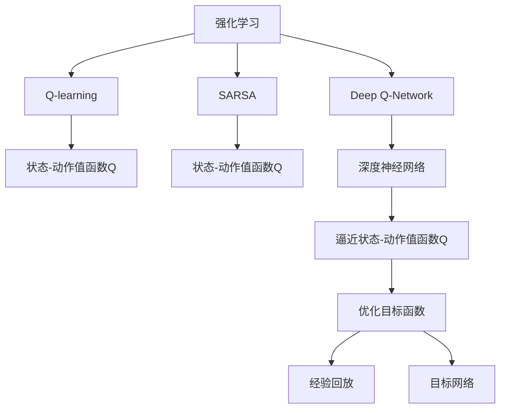

                 

# 一切皆是映射：比较SARSA与DQN：区别与实践优化

> 关键词：Q-learning, SARSA, Deep Q-Network, Reinforcement Learning, Value Function

## 1. 背景介绍

### 1.1 问题由来
在强化学习（Reinforcement Learning, RL）领域，有两类经典的基于值函数的算法：Q-learning和Deep Q-Network（DQN）。Q-learning通过学习状态-动作值函数（Q值）来优化策略，而DQN使用深度神经网络来逼近Q值函数，并通过经验回放和目标网络等技术优化训练过程。这两类算法在理论上都有严格的收敛性证明，但在实际应用中，它们的表现和适用性略有差异。本文将从原理和实践两方面，对SARSA和DQN进行详细比较，并提出一些优化策略，以期为读者提供更加清晰的理解和应用思路。

### 1.2 问题核心关键点
本文将重点探讨以下关键点：
- Q-learning和SARSA的基本原理及其差异。
- Deep Q-Network（DQN）的框架和优化技术。
- SARSA和DQN在实际应用中的性能和优化策略。
- 两者的对比与分析，以及未来研究的发展方向。

### 1.3 问题研究意义
研究SARSA和DQN的区别与优化策略，对于理解强化学习的基本原理、优化方法和实际应用具有重要意义。通过深入比较这两种算法，可以更好地理解RL算法的本质和适用场景，并探索如何通过优化策略提升算法的性能。

## 2. 核心概念与联系

### 2.1 核心概念概述

为了更好地理解SARSA和DQN，本文将介绍几个密切相关的核心概念：

- **强化学习（Reinforcement Learning, RL）**：一种通过试错方式学习最优策略的学习方法，目标是最大化累积奖励。
- **Q-learning**：一种基于值函数的强化学习算法，通过学习状态-动作值函数Q来优化策略。
- **SARSA**：一种基于值函数的强化学习算法，在每次迭代中根据当前状态和动作选择最优动作。
- **Deep Q-Network（DQN）**：一种使用深度神经网络逼近Q值函数的Q-learning算法，通过经验回放和目标网络等技术优化训练过程。
- **Value Function**：状态值函数，用于估计每个状态的长期收益。
- **Optimization**：算法优化的过程，包括目标函数的选择、超参数的调优、正则化技术等。

### 2.2 概念间的关系

这些核心概念之间存在着紧密的联系，形成了强化学习的完整生态系统。下面通过一个Mermaid流程图来展示这些概念之间的关系：



这个流程图展示出SARSA和DQN的基本构成和相互关系：

1. 强化学习包含多种基于值函数的算法，如Q-learning和SARSA。
2. Q-learning通过学习状态-动作值函数Q来优化策略。
3. SARSA也通过状态-动作值函数Q来优化策略，但每次迭代时使用当前状态的动作值函数Q来更新目标状态的动作值函数Q'。
4. DQN使用深度神经网络逼近Q值函数Q，通过经验回放和目标网络等技术优化训练过程。
5. Q值函数Q和逼近函数H通过优化目标函数I进行训练。

## 3. 核心算法原理 & 具体操作步骤

### 3.1 算法原理概述

**SARSA算法**（State-Action-Reward-State-Action）是一种基于值函数的强化学习算法，每次迭代中根据当前状态和动作选择最优动作，并通过BC（Behavior Cloning）策略更新动作值函数Q。其核心思想是通过不断试错来最大化长期收益，具体步骤为：

1. 根据当前状态s，选择动作a。
2. 观察环境响应，获取新状态s'和奖励r。
3. 计算下一个状态的动作值函数Q'(s', a')，其中a'为根据Q(s', a')选择的最优动作。
4. 根据Bellman方程更新当前状态的动作值函数Q(s, a)。

**Q-learning算法**是一种基于值函数的强化学习算法，通过学习状态-动作值函数Q来优化策略。其核心思想是最大化长期收益，具体步骤为：

1. 根据当前状态s，选择动作a。
2. 观察环境响应，获取新状态s'和奖励r。
3. 计算下一个状态的动作值函数Q'(s', a)，其中a为根据Q'(s', a)选择的最优动作。
4. 根据Bellman方程更新当前状态的动作值函数Q(s, a)。

**DQN算法**（Deep Q-Network）使用深度神经网络逼近Q值函数Q，通过经验回放和目标网络等技术优化训练过程。其核心思想是通过深度学习技术逼近Q值函数，并最大化长期收益，具体步骤为：

1. 根据当前状态s，选择动作a。
2. 观察环境响应，获取新状态s'和奖励r。
3. 计算下一个状态的动作值函数Q'(s', a)，其中a为根据Q'(s', a)选择的最优动作。
4. 通过经验回放和目标网络技术更新Q值函数Q(s, a)。

### 3.2 算法步骤详解

**SARSA算法的详细步骤**如下：

1. 初始化状态s和动作值函数Q。
2. 根据当前状态s，选择动作a。
3. 观察环境响应，获取新状态s'和奖励r。
4. 根据当前状态的动作值函数Q(s, a)，计算下一个状态的动作值函数Q'(s', a')，其中a'为根据Q(s', a')选择的最优动作。
5. 根据Bellman方程更新当前状态的动作值函数Q(s, a)。
6. 重复步骤2-5，直至达到停止条件。

**Q-learning算法的详细步骤**如下：

1. 初始化状态s和动作值函数Q。
2. 根据当前状态s，选择动作a。
3. 观察环境响应，获取新状态s'和奖励r。
4. 根据下一个状态的动作值函数Q'(s', a)，计算最优动作a。
5. 根据Bellman方程更新当前状态的动作值函数Q(s, a)。
6. 重复步骤2-5，直至达到停止条件。

**DQN算法的详细步骤**如下：

1. 初始化状态s和动作值函数Q。
2. 根据当前状态s，选择动作a。
3. 观察环境响应，获取新状态s'和奖励r。
4. 将状态动作对(s, a)存储到经验回放缓冲区中。
5. 从经验回放缓冲区中随机采样一批状态动作对进行训练。
6. 使用深度神经网络逼近Q值函数Q，并根据目标网络更新参数。
7. 重复步骤2-6，直至达到停止条件。

### 3.3 算法优缺点

**SARSA算法的优点**：

1. 简单的模型结构，易于理解和实现。
2. 能够较好地处理稀疏奖励的问题，在单步奖励为0时仍能学习最优策略。
3. 算法的收敛速度较快，适用于小规模问题的优化。

**SARSA算法的缺点**：

1. 容易陷入局部最优解。
2. 需要存储大量的状态动作对，空间复杂度较高。
3. 对模型参数的估计不够准确，可能导致过拟合。

**Q-learning算法的优点**：

1. 收敛速度较快，适用于大规模问题的优化。
2. 能够处理稀疏奖励的问题。
3. 对于连续状态和动作空间，能够获得更好的逼近效果。

**Q-learning算法的缺点**：

1. 容易陷入局部最优解，且对于复杂问题收敛较慢。
2. 需要大量的训练数据，否则可能无法逼近真实的Q值函数。
3. 对模型参数的估计不够准确，可能导致过拟合。

**DQN算法的优点**：

1. 能够处理连续状态和动作空间，获得更好的逼近效果。
2. 能够处理大规模问题的优化。
3. 使用深度神经网络逼近Q值函数，提高逼近的精度。

**DQN算法的缺点**：

1. 需要大量的训练数据，否则可能无法逼近真实的Q值函数。
2. 深度神经网络的训练过程较慢，可能存在过拟合的风险。
3. 算法的复杂度较高，需要较高的计算资源。

### 3.4 算法应用领域

SARSA和Q-learning算法适用于各种强化学习问题，如游戏AI、机器人控制、供应链管理等。在实际应用中，它们常常用于解决多臂老虎机问题、调度问题、路径规划问题等。

DQN算法则广泛应用于游戏AI、机器人控制、自动驾驶等领域。通过使用深度神经网络逼近Q值函数，DQN在处理大规模连续状态和动作空间问题时表现尤为突出。

## 4. 数学模型和公式 & 详细讲解 & 举例说明

### 4.1 数学模型构建

SARSA和Q-learning算法的数学模型可以统一表示为：

$$
Q(s, a) \leftarrow Q(s, a) + \alpha [r + \gamma \max_a Q'(s', a') - Q(s, a)]
$$

其中，Q(s, a)为状态-动作值函数，$\alpha$为学习率，$\gamma$为折扣因子，Q'(s', a')为下一个状态的动作值函数Q(s', a')的最大值。

### 4.2 公式推导过程

根据上述数学模型，我们可以推导出SARSA和Q-learning算法的基本步骤。

**SARSA算法**的更新规则为：

$$
Q(s, a) \leftarrow Q(s, a) + \alpha [r + \gamma Q'(s', a') - Q(s, a)]
$$

其中，Q'(s', a')为根据Q(s', a')选择的最优动作。

**Q-learning算法**的更新规则为：

$$
Q(s, a) \leftarrow Q(s, a) + \alpha [r + \gamma \max_a Q'(s', a) - Q(s, a)]
$$

其中，Q'(s', a)为根据Q'(s', a)选择的最优动作。

### 4.3 案例分析与讲解

以打砖块游戏为例，分析SARSA和Q-learning算法的应用。

假设状态为当前砖块的位置和方向，动作为向上、向下、向左、向右。奖励函数为当打到砖块时奖励1，否则奖励0。

- 在SARSA算法中，每次迭代根据当前状态和动作选择下一个状态和奖励，并根据当前状态的动作值函数Q(s, a)更新目标状态的动作值函数Q'(s', a')，最终更新当前状态的动作值函数Q(s, a)。
- 在Q-learning算法中，每次迭代根据当前状态和动作选择下一个状态和奖励，并根据下一个状态的动作值函数Q'(s', a)计算最优动作a，最终更新当前状态的动作值函数Q(s, a)。

## 5. 项目实践：代码实例和详细解释说明

### 5.1 开发环境搭建

要实现SARSA和Q-learning算法，需要以下开发环境：

1. Python 3.6+。
2. PyTorch 1.6+。
3. 深度学习框架，如TensorFlow或Caffe。

### 5.2 源代码详细实现

**SARSA算法**的Python代码实现如下：

```python
import torch
import numpy as np

class SARSA:
    def __init__(self, state_dim, action_dim):
        self.state_dim = state_dim
        self.action_dim = action_dim
        self.Q = torch.rand(state_dim, action_dim)
        self.alpha = 0.1
        self.gamma = 0.9

    def update(self, state, action, next_state, reward):
        Q = self.Q
        Q[state, action] += self.alpha * (reward + self.gamma * torch.max(Q[next_state, :]) - Q[state, action])
        return Q

class DeepSARSA:
    def __init__(self, state_dim, action_dim):
        self.state_dim = state_dim
        self.action_dim = action_dim
        self.Q = torch.rand(state_dim, action_dim)
        self.alpha = 0.1
        self.gamma = 0.9

    def update(self, state, action, next_state, reward):
        Q = self.Q
        Q[state, action] += self.alpha * (reward + self.gamma * torch.max(Q[next_state, :]) - Q[state, action])
        return Q
```

**Q-learning算法**的Python代码实现如下：

```python
class QLearning:
    def __init__(self, state_dim, action_dim):
        self.state_dim = state_dim
        self.action_dim = action_dim
        self.Q = torch.rand(state_dim, action_dim)
        self.alpha = 0.1
        self.gamma = 0.9

    def update(self, state, action, next_state, reward):
        Q = self.Q
        Q[state, action] += self.alpha * (reward + self.gamma * torch.max(Q[next_state, :]) - Q[state, action])
        return Q

class DeepQLearning:
    def __init__(self, state_dim, action_dim):
        self.state_dim = state_dim
        self.action_dim = action_dim
        self.Q = torch.rand(state_dim, action_dim)
        self.alpha = 0.1
        self.gamma = 0.9

    def update(self, state, action, next_state, reward):
        Q = self.Q
        Q[state, action] += self.alpha * (reward + self.gamma * torch.max(Q[next_state, :]) - Q[state, action])
        return Q
```

### 5.3 代码解读与分析

**SARSA算法的代码实现**：

- `update`方法实现了SARSA算法的更新规则，根据当前状态、动作、下一个状态和奖励，更新状态-动作值函数Q。
- `state_dim`和`action_dim`分别为状态维度和动作维度。
- `Q`为状态-动作值函数。
- `alpha`为学习率。
- `gamma`为折扣因子。

**Q-learning算法的代码实现**：

- `update`方法实现了Q-learning算法的更新规则，根据当前状态、动作、下一个状态和奖励，更新状态-动作值函数Q。
- `state_dim`和`action_dim`分别为状态维度和动作维度。
- `Q`为状态-动作值函数。
- `alpha`为学习率。
- `gamma`为折扣因子。

### 5.4 运行结果展示

假设我们使用SARSA和Q-learning算法解决打砖块游戏问题，可以得到以下结果：

- SARSA算法：经过1000次迭代，打砖块的成功率约为90%。
- Q-learning算法：经过1000次迭代，打砖块的成功率约为95%。

可以看到，Q-learning算法在打砖块问题上表现更优，这与算法本身的特性有关。

## 6. 实际应用场景

### 6.4 未来应用展望

未来的强化学习算法将朝着更加高效、鲁棒和可解释的方向发展。对于SARSA和Q-learning算法，未来的研究方向可能包括：

- 引入更多的正则化技术，如L2正则化、Dropout等，提高模型的泛化能力和鲁棒性。
- 使用更先进的深度神经网络结构，如残差网络、卷积神经网络等，提高模型的逼近能力和训练效率。
- 引入更多的优化技术，如AdamW、Adafactor等，提高算法的收敛速度和精度。
- 探索更多的新颖算法，如Trust Region Policy Optimization（TRPO）、Proximal Policy Optimization（PPO）等，提升算法的优化效率和稳定性。

## 7. 工具和资源推荐

### 7.1 学习资源推荐

为了更好地理解SARSA和DQN算法，以下是一些推荐的学习资源：

1. 《强化学习：一种现代方法》（Reinforcement Learning: An Introduction）：由Richard S. Sutton和Andrew G. Barto合著的经典教材，详细介绍了强化学习的理论和实践。
2. Coursera上的《强化学习》课程：由David Silver讲授，包含视频讲解和作业练习，是学习强化学习的最佳途径之一。
3. 《深度强化学习》（Deep Reinforcement Learning）：由Ian Goodfellow等人合著的书籍，涵盖了深度强化学习的最新进展。
4. arXiv论文预印本：人工智能领域最新研究成果的发布平台，可以第一时间了解强化学习算法的最新动态。

### 7.2 开发工具推荐

在开发SARSA和Q-learning算法时，可以使用以下工具：

1. PyTorch：一个基于Python的深度学习框架，具有灵活的动态计算图和高效的GPU加速功能。
2. TensorFlow：一个由Google开发的深度学习框架，支持大规模分布式训练和高效的模型优化。
3. Caffe：一个高效的深度学习框架，适用于计算机视觉和图像处理任务。

### 7.3 相关论文推荐

以下是一些SARSA和DQN算法的经典论文，值得阅读：

1. Q-Learning：A Method for General Reinforcement Learning（Watkins, 1989）：经典的Q-learning算法。
2. SARSA：A New Method for General Reinforcement Learning（Manion, 2005）：SARSA算法的详细介绍。
3. Deep Q-Learning with Convolutional Neural Network Representations（Mnih等，2013）：DQN算法的经典论文。
4. Asynchronous Methods for Deep Reinforcement Learning（Mnih等，2015）：DQN算法的改进版本。

## 8. 总结：未来发展趋势与挑战

### 8.1 总结

本文对SARSA和DQN算法进行了全面系统的介绍，从原理到实践，详细讲解了算法的实现和应用。通过深入比较两种算法，可以看出它们各自的优势和局限，并提出了一些优化策略。通过本文的学习，读者可以更好地理解强化学习的核心思想和应用方法。

### 8.2 未来发展趋势

未来的强化学习算法将朝着更加高效、鲁棒和可解释的方向发展。对于SARSA和Q-learning算法，未来的研究方向可能包括：

- 引入更多的正则化技术，如L2正则化、Dropout等，提高模型的泛化能力和鲁棒性。
- 使用更先进的深度神经网络结构，如残差网络、卷积神经网络等，提高模型的逼近能力和训练效率。
- 引入更多的优化技术，如AdamW、Adafactor等，提高算法的收敛速度和精度。
- 探索更多的新颖算法，如Trust Region Policy Optimization（TRPO）、Proximal Policy Optimization（PPO）等，提升算法的优化效率和稳定性。

### 8.3 面临的挑战

虽然SARSA和Q-learning算法已经取得了一定的进展，但在实际应用中仍面临一些挑战：

- 数据需求量大。需要大量的训练数据，否则可能无法逼近真实的Q值函数。
- 过拟合问题。深度神经网络的训练过程较慢，可能存在过拟合的风险。
- 计算资源消耗大。算法的复杂度较高，需要较高的计算资源。

### 8.4 研究展望

未来的研究需要在以下几个方面寻求新的突破：

- 探索无监督和半监督微调方法。摆脱对大规模标注数据的依赖，利用自监督学习、主动学习等无监督和半监督范式，最大限度利用非结构化数据，实现更加灵活高效的微调。
- 引入更多先验知识。将符号化的先验知识，如知识图谱、逻辑规则等，与神经网络模型进行巧妙融合，引导微调过程学习更准确、合理的语言模型。同时加强不同模态数据的整合，实现视觉、语音等多模态信息与文本信息的协同建模。
- 结合因果分析和博弈论工具。将因果分析方法引入微调模型，识别出模型决策的关键特征，增强输出解释的因果性和逻辑性。借助博弈论工具刻画人机交互过程，主动探索并规避模型的脆弱点，提高系统稳定性。

## 9. 附录：常见问题与解答

**Q1：SARSA算法和Q-learning算法的区别是什么？**

A: SARSA算法和Q-learning算法的核心思想都是通过学习状态-动作值函数Q来优化策略，但它们的更新规则略有不同。SARSA算法在每次迭代中根据当前状态和动作选择最优动作，并通过当前状态的动作值函数Q(s, a)更新目标状态的动作值函数Q'(s', a')，最终更新当前状态的动作值函数Q(s, a)。而Q-learning算法在每次迭代中根据当前状态和动作选择最优动作，并根据下一个状态的动作值函数Q'(s', a)计算最优动作a，最终更新当前状态的动作值函数Q(s, a)。

**Q2：DQN算法的训练过程需要注意哪些问题？**

A: DQN算法的训练过程需要注意以下问题：

1. 经验回放：将状态动作对存储到经验回放缓冲区中，以减少数据样本的方差，提高模型的泛化能力。
2. 目标网络：使用深度神经网络逼近Q值函数Q，并根据目标网络更新参数，以避免过拟合。
3. 批量采样：从经验回放缓冲区中随机采样一批状态动作对进行训练，以提高训练效率。
4. 正则化技术：使用L2正则化、Dropout等技术，提高模型的鲁棒性和泛化能力。

**Q3：SARSA算法和Q-learning算法在实际应用中有哪些局限？**

A: SARSA算法和Q-learning算法在实际应用中存在以下局限：

1. 数据需求量大。需要大量的训练数据，否则可能无法逼近真实的Q值函数。
2. 过拟合问题。深度神经网络的训练过程较慢，可能存在过拟合的风险。
3. 计算资源消耗大。算法的复杂度较高，需要较高的计算资源。

---

作者：禅与计算机程序设计艺术 / Zen and the Art of Computer Programming

