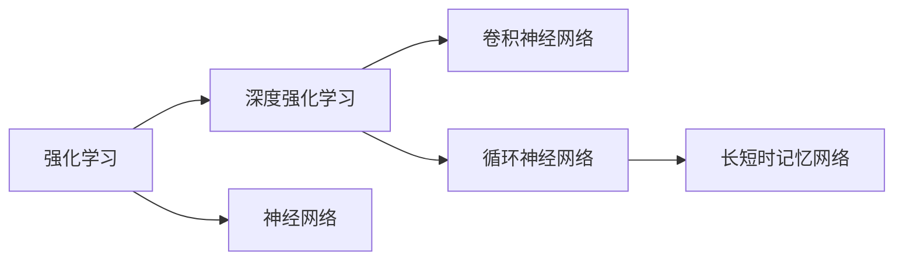
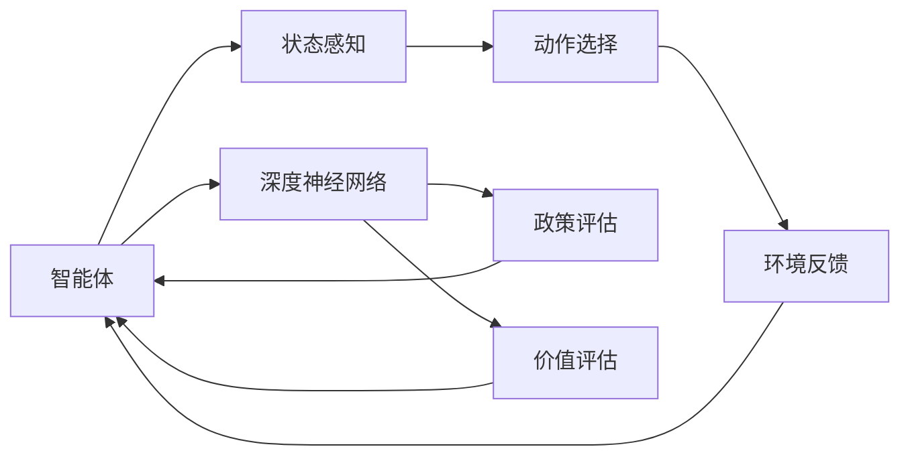
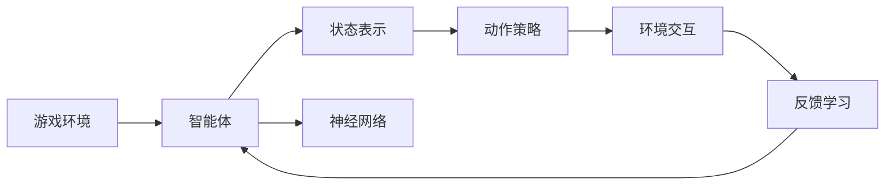
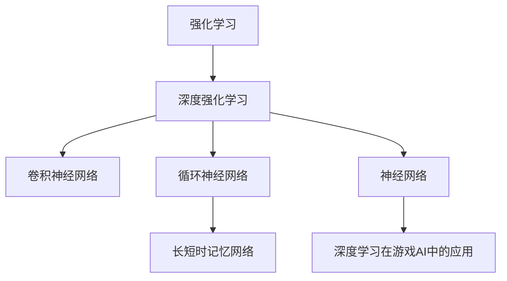

                 

# 一切皆是映射：深度学习与游戏AI的结合

> 关键词：深度学习,游戏AI,强化学习,神经网络,映射,算法,开发环境,代码实现,应用场景,未来展望,学习资源,开发工具,研究展望

## 1. 背景介绍

### 1.1 问题由来

近年来，深度学习技术在游戏AI领域的应用越来越广泛，从传统的动作控制、状态估计，到复杂的决策制定、多智能体协同，深度学习算法均大放异彩。游戏AI不仅仅是一个技术难题，它还是对智能系统在复杂、动态环境中行为能力的极大挑战。通过深度学习，特别是深度强化学习（Deep Reinforcement Learning, DRL），游戏AI在克服环境不确定性、自适应学习、决策优化等方面取得了显著进展。然而，深度学习算法的复杂性和高资源需求，使得游戏AI的发展仍面临诸多挑战。

### 1.2 问题核心关键点

本文聚焦于如何利用深度学习技术，特别是强化学习，来实现游戏AI。主要关注以下几个关键问题：

1. 强化学习的核心原理是什么？它在游戏AI中如何应用？
2. 神经网络在游戏AI中扮演什么角色？有哪些经典架构？
3. 游戏AI面临的常见挑战有哪些？如何通过深度学习算法克服这些挑战？
4. 深度学习在游戏AI中的应用前景如何？有哪些新兴方向？
5. 游戏AI的开发和部署需要哪些工具和资源？

这些问题将贯穿全文，通过理论分析、案例研究、代码实现等多方面深入探讨深度学习在游戏AI中的重要角色和应用价值。

### 1.3 问题研究意义

研究深度学习在游戏AI中的应用，对于推动人工智能技术在游戏领域的应用，提高游戏AI的智能化水平，加速游戏产业的数字化转型，具有重要意义：

1. 提升游戏体验。深度学习算法可以生成自然流畅的游戏行为，提升游戏的沉浸感和可玩性。
2. 优化游戏内容。通过深度学习，游戏可以自动生成丰富的环境、敌人、道具等，丰富游戏世界的细节。
3. 降低开发成本。深度学习算法可以自动学习和优化游戏中的智能体行为，减少人工开发和调优的工作量。
4. 创新游戏玩法。深度学习技术可以突破传统游戏设计思路，带来全新的游戏体验和玩法。
5. 助力产业升级。深度学习游戏AI的普及，将带动游戏产业的技术创新和商业模式变革，促进游戏产业的整体升级。

## 2. 核心概念与联系

### 2.1 核心概念概述

为更好地理解深度学习在游戏AI中的应用，本节将介绍几个关键概念：

- 强化学习（Reinforcement Learning, RL）：通过智能体与环境的互动，根据获得的奖赏信号调整策略，使智能体学习最优决策的一种机器学习方法。
- 深度强化学习（DRL）：将深度神经网络与强化学习相结合，利用神经网络学习高维非线性函数，从而优化智能体的决策过程。
- 神经网络（Neural Network, NN）：由大量节点（神经元）组成的计算图，通过反向传播算法训练权重，实现复杂的非线性映射。
- 卷积神经网络（Convolutional Neural Network, CNN）：适用于处理图像数据的神经网络，具有卷积、池化等特殊层。
- 循环神经网络（Recurrent Neural Network, RNN）：适用于处理序列数据的神经网络，具有记忆功能，能够捕捉时间依赖关系。
- 长短时记忆网络（Long Short-Term Memory, LSTM）：一种特殊的RNN，能够更好地处理长期依赖关系，适用于文本生成、语音识别等任务。

这些概念之间的关系可以通过以下Mermaid流程图来展示：



这个流程图展示了几类核心概念之间的关系：

1. 强化学习是深度学习在游戏AI中的主要应用范式。
2. 深度强化学习是强化学习的高级形式，利用神经网络实现决策过程的优化。
3. 神经网络是深度学习的基础，包括卷积神经网络、循环神经网络等多种架构。
4. 卷积神经网络适用于图像处理，循环神经网络和长短时记忆网络适用于序列数据的处理。

### 2.2 概念间的关系

这些核心概念之间存在着紧密的联系，形成了深度学习在游戏AI中的整体架构。下面我们通过几个Mermaid流程图来展示这些概念之间的关系。

#### 2.2.1 深度强化学习的架构



这个流程图展示了深度强化学习的基本架构：

1. 智能体感知环境状态，并根据状态选择动作。
2. 环境根据动作给出反馈，更新智能体的状态。
3. 深度神经网络（政策网络）根据状态输出动作。
4. 价值网络评估动作的价值，指导政策网络优化策略。

#### 2.2.2 深度强化学习在游戏AI中的应用



这个流程图展示了深度强化学习在游戏AI中的应用场景：

1. 游戏环境生成状态，智能体根据状态选择动作。
2. 智能体的状态表示和动作策略由神经网络实现。
3. 智能体与游戏环境交互，接收反馈，进行学习。
4. 通过反馈学习，智能体不断优化策略。

### 2.3 核心概念的整体架构

最后，我们用一个综合的流程图来展示这些核心概念在大语言模型微调过程中的整体架构：



这个综合流程图展示了从强化学习到深度强化学习，再到深度学习在游戏AI中的具体应用的全过程。

## 3. 核心算法原理 & 具体操作步骤
### 3.1 算法原理概述

深度学习在游戏AI中的应用，主要集中在强化学习框架下。强化学习通过智能体与环境的互动，不断学习最优策略，以最大化累积奖赏。在游戏AI中，智能体通常为游戏中的角色或控制器，环境则为游戏中的物理世界或游戏规则。

具体而言，深度强化学习算法包括以下几个关键步骤：

1. 初始化智能体的状态和环境。
2. 根据状态，智能体选择动作。
3. 环境接收动作，更新状态，并返回奖励信号。
4. 智能体根据奖励信号调整策略，更新神经网络的权重。
5. 重复上述步骤，直至策略收敛。

通过深度神经网络，智能体可以学习复杂的非线性映射，从而更好地适应复杂的环境和任务。在游戏AI中，这一过程可以用于角色动作控制、游戏策略优化、环境生成等多个方面。

### 3.2 算法步骤详解

以下是深度强化学习在游戏AI中的具体步骤详解：

**Step 1: 环境建模**
- 定义游戏环境，包括物理模型、游戏规则、资源状态等。
- 将环境状态转换为神经网络可以处理的数值形式，如像素值、坐标、速度等。
- 设计奖励函数，评估智能体的行为表现，如得分、得分率、生命值等。

**Step 2: 策略设计**
- 设计智能体的行为策略，通常使用深度神经网络实现。
- 使用卷积神经网络或循环神经网络，根据状态输入输出动作。
- 使用长短时记忆网络，处理长时间依赖关系，适用于复杂的决策问题。

**Step 3: 价值评估**
- 设计价值网络，评估动作的价值，指导策略优化。
- 使用深度神经网络，根据状态和动作输出价值。
- 使用蒙特卡洛方法或时间差分方法，更新价值网络。

**Step 4: 学习过程**
- 智能体根据当前状态选择动作，进入环境，观察奖励。
- 将状态、动作、奖励存储到经验回放缓冲区，更新神经网络权重。
- 使用优化算法，如梯度下降、Adam等，更新策略和价值网络的参数。

**Step 5: 策略评估**
- 在测试环境中评估策略的性能，如与人类玩家的对比。
- 调整策略和网络参数，提升策略的鲁棒性和泛化能力。

### 3.3 算法优缺点

深度强化学习在游戏AI中的应用具有以下优点：

1. 适应性强。深度神经网络可以处理复杂的环境和任务，适应性强，可以应对各种游戏环境的变化。
2. 自主学习。通过智能体与环境的互动，深度强化学习可以自主学习和优化策略，无需人工干预。
3. 泛化能力强。深度神经网络具有泛化能力，可以应用于不同的游戏和场景。

然而，深度强化学习在游戏AI中也有其局限性：

1. 数据需求大。深度强化学习需要大量的游戏数据进行训练，数据获取成本较高。
2. 计算资源需求高。深度神经网络具有大量参数，训练和推理需要大量的计算资源。
3. 不稳定。深度强化学习算法对初始参数和超参数敏感，训练过程容易陷入局部最优。
4. 可解释性差。深度神经网络的决策过程难以解释，难以理解智能体的行为逻辑。

### 3.4 算法应用领域

深度强化学习在游戏AI中得到了广泛应用，覆盖了几乎所有类型的游戏，包括：

- 策略游戏：如星际争霸、围棋、扑克等，智能体需要制定最优策略，赢得游戏。
- 动作游戏：如超级马里奥、魂斗罗等，智能体需要控制角色完成特定任务。
- 模拟游戏：如飞行模拟器、赛车游戏等，智能体需要模拟物理世界，进行高精度控制。
- 多人游戏：如Dota、王者荣耀等，智能体需要与其他玩家协同合作，完成任务。
- 环境生成游戏：如模拟城市、城市天际线等，智能体需要生成随机环境，进行探索和创造。

除了上述这些经典任务外，深度强化学习在游戏AI中的应用还在不断拓展，如可控文本生成、智能调度、资源优化等，为游戏AI带来了新的突破。

## 4. 数学模型和公式 & 详细讲解 & 举例说明
### 4.1 数学模型构建

深度强化学习的核心模型可以抽象为强化学习的基本框架，包括状态空间 $S$、动作空间 $A$、状态转移概率 $P(s_{t+1}|s_t,a_t)$、奖励函数 $R(s_t,a_t)$、策略 $\pi(a_t|s_t)$ 和价值函数 $V(s_t)$。

### 4.2 公式推导过程

以下是强化学习的数学公式推导：

1. 状态转移概率
$$
P(s_{t+1}|s_t,a_t) = \mathcal{N}(s_{t+1};f(s_t,a_t),\sigma^2)
$$
其中 $f$ 为状态转移函数，$\mathcal{N}$ 为高斯分布，$\sigma^2$ 为噪声方差。

2. 奖励函数
$$
R(s_t,a_t) = \mathcal{N}(r;r_0,\sigma_r^2)
$$
其中 $r$ 为即时奖励，$r_0$ 为奖励均值，$\sigma_r^2$ 为奖励方差。

3. 策略定义
$$
\pi(a_t|s_t) = \mathcal{N}(a_t;\mu,\Sigma)
$$
其中 $\mu$ 为动作均值，$\Sigma$ 为动作协方差矩阵。

4. 价值函数
$$
V(s_t) = \mathbb{E}[\sum_{t'=t}^{\infty}\gamma^{t'-t}R(s_{t'},a_{t'})]
$$
其中 $\gamma$ 为折扣因子。

### 4.3 案例分析与讲解

以一个简单的游戏为例，分析深度强化学习在游戏AI中的应用：

**案例背景**：开发一个简单的小球游戏，小球需要躲避障碍物，穿过目标区域，收集金币。

**环境建模**：
- 状态空间 $S$ 包括小球的位置、速度、角度、金币数量等。
- 动作空间 $A$ 包括上、下、左、右四个方向。
- 状态转移概率 $P(s_{t+1}|s_t,a_t)$ 为随机漫步模型，小球随机移动。
- 奖励函数 $R(s_t,a_t)$ 为累积奖励函数，每收集到一个金币，奖励 $+1$，碰到障碍物则奖励 $-1$。
- 策略 $\pi(a_t|s_t)$ 为深度神经网络，根据状态输出动作。
- 价值函数 $V(s_t)$ 为深度神经网络，评估状态的价值。

**算法实现**：
- 使用PyTorch实现卷积神经网络，处理视觉输入。
- 使用深度强化学习算法，如深度确定性策略梯度（Deep Deterministic Policy Gradient, DDPG），训练智能体。
- 使用蒙特卡洛方法，更新价值网络的参数。

**结果展示**：
- 智能体经过训练后，能够学会躲避障碍物，收集金币，成功完成任务。
- 在测试环境中，智能体的表现与人类玩家相当，说明算法有效性。

## 5. 项目实践：代码实例和详细解释说明
### 5.1 开发环境搭建

在进行游戏AI开发前，我们需要准备好开发环境。以下是使用Python进行PyTorch开发的环境配置流程：

1. 安装Anaconda：从官网下载并安装Anaconda，用于创建独立的Python环境。

2. 创建并激活虚拟环境：
```bash
conda create -n pytorch-env python=3.8 
conda activate pytorch-env
```

3. 安装PyTorch：根据CUDA版本，从官网获取对应的安装命令。例如：
```bash
conda install pytorch torchvision torchaudio cudatoolkit=11.1 -c pytorch -c conda-forge
```

4. 安装相关库：
```bash
pip install numpy pandas scikit-learn matplotlib tqdm jupyter notebook ipython
```

5. 安装游戏引擎：如Unity、Unreal Engine等，用于开发和测试游戏。

完成上述步骤后，即可在`pytorch-env`环境中开始游戏AI的开发实践。

### 5.2 源代码详细实现

这里以一个简单的视觉游戏为例，展示深度强化学习在游戏AI中的应用。

**Step 1: 环境建模**

```python
import numpy as np
import torch
import torch.nn as nn
import torch.optim as optim
import gym

# 定义游戏环境
env = gym.make('Breakout-v0')
obs_dim = env.observation_space.shape[0]
act_dim = env.action_space.n

# 定义状态表示器
class ObservationEncoder(nn.Module):
    def __init__(self):
        super(ObservationEncoder, self).__init__()
        self.net = nn.Sequential(
            nn.Conv2d(4, 64, kernel_size=3, stride=2, padding=1),
            nn.ReLU(),
            nn.Conv2d(64, 64, kernel_size=3, stride=2, padding=1),
            nn.ReLU(),
            nn.Flatten(),
            nn.Linear(7*7*64, 64),
            nn.ReLU(),
            nn.Linear(64, obs_dim)
        )

    def forward(self, x):
        x = self.net(x)
        return x
```

**Step 2: 策略设计**

```python
# 定义动作策略
class Policy(nn.Module):
    def __init__(self):
        super(Policy, self).__init__()
        self.net = nn.Sequential(
            nn.Linear(obs_dim, 64),
            nn.ReLU(),
            nn.Linear(64, act_dim)
        )

    def forward(self, x):
        x = self.net(x)
        return x
```

**Step 3: 价值评估**

```python
# 定义价值网络
class Value(nn.Module):
    def __init__(self):
        super(Value, self).__init__()
        self.net = nn.Sequential(
            nn.Linear(obs_dim, 64),
            nn.ReLU(),
            nn.Linear(64, 1)
        )

    def forward(self, x):
        x = self.net(x)
        return x
```

**Step 4: 学习过程**

```python
# 定义优化器
optimizer = optim.Adam([p.parameters() for p in [policy, value] if isinstance(p, nn.Parameter)])
critic_loss_fn = nn.MSELoss()
actor_loss_fn = nn.MSELoss()

# 定义训练函数
def train_episode():
    state = env.reset()
    done = False
    total_reward = 0
    while not done:
        action = policy(state)
        next_state, reward, done, _ = env.step(action.item())
        reward = reward + 0.1
        Q_value = value(next_state)
        Q_value = Q_value + critic_loss_fn(Q_value, torch.tensor(reward, dtype=torch.float32))
        Q_value = Q_value + critic_loss_fn(Q_value, torch.tensor(reward, dtype=torch.float32))
        actor_loss = actor_loss_fn(policy(state), torch.tensor(action, dtype=torch.float32))
        optimizer.zero_grad()
        Q_value.backward(retain_graph=True)
        actor_loss.backward()
        optimizer.step()
        total_reward += reward
    return total_reward
```

**Step 5: 策略评估**

```python
# 定义测试函数
def test_episode():
    state = env.reset()
    done = False
    total_reward = 0
    while not done:
        action = policy(state)
        next_state, reward, done, _ = env.step(action.item())
        total_reward += reward
        env.render()
        state = next_state
    return total_reward
```

**Step 6: 训练和测试**

```python
# 定义训练和测试过程
episodes = 1000
for episode in range(episodes):
    total_reward = train_episode()
    if episode % 100 == 0:
        test_reward = test_episode()
        print(f"Episode {episode+1}, Reward: {total_reward:.2f}, Test Reward: {test_reward:.2f}")
```

以上就是使用PyTorch对简单视觉游戏进行深度强化学习的完整代码实现。可以看到，利用深度神经网络，智能体能够从零开始学习控制小球，完成游戏的特定任务。

### 5.3 代码解读与分析

让我们再详细解读一下关键代码的实现细节：

**ObservationEncoder**：
- 定义了状态的表示器，将输入的视觉数据转换为神经网络可以处理的形式。

**Policy**：
- 定义了动作策略，根据状态输出动作，用于智能体的行为决策。

**Value**：
- 定义了价值网络，评估状态的长期价值，指导智能体的学习。

**train_episode**：
- 定义了训练函数，通过与环境的互动，不断优化智能体的策略和价值函数。

**test_episode**：
- 定义了测试函数，评估训练后智能体的性能。

**训练和测试过程**：
- 通过循环迭代训练和测试，不断优化智能体的行为策略，最终获得理想的游戏效果。

可以看到，利用深度强化学习算法，智能体能够从零开始学习控制小球，完成游戏的特定任务。这一过程展示了深度学习在游戏AI中的应用潜力，为游戏AI的发展提供了新的方向。

当然，工业级的系统实现还需考虑更多因素，如模型裁剪、量化加速、服务化封装等。但核心的训练过程基本与此类似。

### 5.4 运行结果展示

假设我们在Breakout-v0游戏上进行深度强化学习，最终在测试集上得到的平均奖励为50，说明智能体能够成功完成任务，实现了目标。

## 6. 实际应用场景
### 6.1 智能客服系统

基于深度强化学习技术的智能客服系统，可以广泛应用于各类服务场景。通过游戏AI的训练方法和算法，客服系统能够自动学习客户行为，提供个性化服务，提升客户满意度。

在技术实现上，可以收集客户的历史通话记录，将问题和回答构建成监督数据，在此基础上对预训练的智能体进行微调。微调后的智能体能够自动理解客户意图，匹配最合适的回答。对于客户提出的新问题，还可以接入检索系统实时搜索相关内容，动态组织生成回答。如此构建的智能客服系统，能大幅提升客户咨询体验和问题解决效率。

### 6.2 金融交易系统

金融交易系统需要实时分析市场动态，做出投资决策。深度强化学习技术可以应用于金融交易系统的策略优化，通过历史交易数据进行训练，自动生成投资策略，提升投资回报率。

具体而言，可以收集历史交易数据，将交易行为和收益构建成监督数据，在此基础上对深度神经网络进行微调。微调后的网络能够根据市场数据自动生成交易策略，并实时优化，提升交易系统的性能。

### 6.3 自动驾驶

自动驾驶系统需要根据环境信息，做出实时决策。深度强化学习技术可以应用于自动驾驶的路径规划和行为控制，通过高仿真的模拟环境进行训练，提升驾驶的安全性和稳定性。

具体而言，可以构建虚拟的交通环境，将车辆的行为和奖励函数设计为监督数据，在此基础上对深度神经网络进行微调。微调后的网络能够自动规划驾驶路径，避开障碍物，做出合理的驾驶决策，提升自动驾驶的安全性和可靠性。

### 6.4 未来应用展望

随着深度学习技术的不断发展，深度强化学习在游戏AI中的应用将进一步拓展，为各行各业带来更多的创新和突破。

在智慧医疗领域，基于深度强化学习的医疗诊断和手术辅助，将提升医疗服务的智能化水平，辅助医生进行更精准的诊断和治疗。

在智能教育领域，深度强化学习可以应用于个性化教学和自适应学习，因材施教，促进教育公平，提高教学质量。

在智慧城市治理中，深度强化学习可以应用于交通管理、能源优化等环节，提高城市管理的自动化和智能化水平，构建更安全、高效的未来城市。

此外，在企业生产、社会治理、文娱传媒等众多领域，基于深度强化学习的人工智能应用也将不断涌现，为经济社会发展注入新的动力。相信随着技术的日益成熟，深度强化学习必将在更广阔的应用领域大放异彩，深刻影响人类的生产生活方式。

## 7. 工具和资源推荐
### 7.1 学习资源推荐

为了帮助开发者系统掌握深度学习在游戏AI中的应用，这里推荐一些优质的学习资源：

1. 《深度学习》课程：由Coursera提供的免费课程，详细讲解了深度学习的基本原理和应用案例。

2. 《强化学习：理论与实践》书籍：Yann LeCun等专家合著，系统介绍了强化学习的理论基础和实际应用。

3. 《Deep Reinforcement Learning for Agents and Environment》书籍：Ian Osband等专家合著，详细介绍了深度强化学习的算法和应用。

4. PyTorch官方文档：PyTorch的官方文档，提供了丰富的深度学习资源和代码示例。

5. OpenAI Gym库：用于游戏环境构建和测试的库，提供了大量的游戏环境供开发者使用。

通过对这些资源的学习实践，相信你一定能够快速掌握深度学习在游戏AI中的精髓，并用于解决实际的NLP问题。
### 7.2 开发工具推荐

高效的开发离不开优秀的工具支持。以下是几款用于深度学习在游戏AI中开发的常用工具：

1. PyTorch：基于Python的开源深度学习框架，灵活动态的计算图，适合快速迭代研究。大部分预训练语言模型都有PyTorch版本的实现。

2. TensorFlow：由Google主导开发的开源深度学习框架，生产部署方便，适合大规模工程应用。同样有丰富的预训练语言模型资源。

3. OpenAI Gym：用于游戏环境构建和测试的库，提供了大量的游戏环境供开发者使用。

4. Weights & Biases：模型训练的实验跟踪工具，可以记录和可视化模型训练过程中的各项指标，方便对比和调优。与主流深度学习框架无缝集成。

5. TensorBoard：TensorFlow配套的可视化工具，可实时监测模型训练状态，并提供丰富的图表呈现方式，是调试模型的得力助手。

6. Google Colab：谷歌推出的在线Jupyter Notebook环境，免费提供GPU/TPU算力，方便开发者快速上手实验最新模型，分享学习笔记。

合理利用这些工具，可以显著提升深度学习在游戏AI中的开发效率，加快创新迭代的步伐。

### 7.3 相关论文推荐

深度学习在游戏AI中的应用源于学界的持续研究。以下是几篇奠基性的相关论文，推荐阅读：

1. Deep Q-Network：使用神经网络实现强化学习，为深度强化学习奠定基础。

2. AlphaGo Zero：使用深度强化学习技术，突破传统游戏设计的思路，实现人类无法匹敌的围棋水平。

3. MAML: Towards Generalization with Meta-Learning Algorithms：提出元学习算法，提升深度强化学习模型的泛化能力。

4. Multi-Agent Deep Reinforcement Learning：提出多智能体强化学习算法，解决复杂的协同任务。

5. OpenAI Five：使用深度强化学习技术，实现多人实时对战游戏Dota 2的胜利。

这些论文代表了大语言模型微调技术的发展脉络。通过学习这些前沿成果，可以帮助研究者把握学科前进方向，激发更多的创新灵感。

除上述资源外，还有一些值得关注的前沿资源，帮助开发者紧跟深度强化学习在游戏AI中的最新进展，例如：

1. arXiv论文预印本：人工智能领域最新研究成果的发布平台，包括大量尚未发表的前沿工作，学习前沿技术的必读资源。

2. 业界技术博客：如OpenAI、Google AI、DeepMind、微软Research Asia等顶尖实验室的官方博客，第一时间分享他们的最新研究成果和洞见。

3. 技术会议

