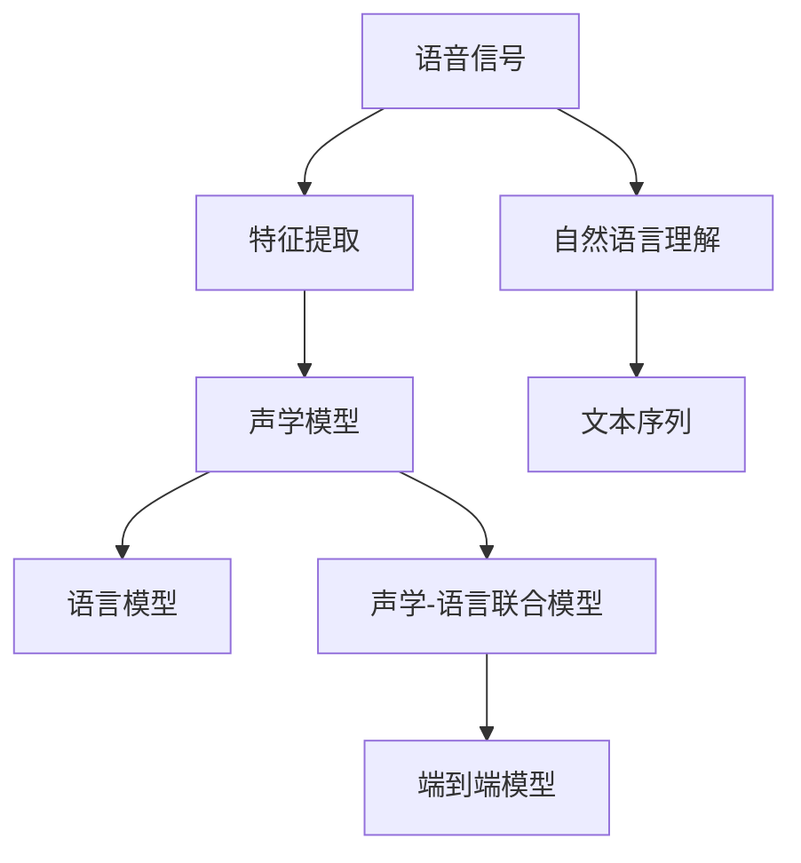
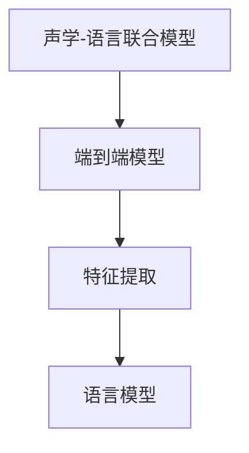
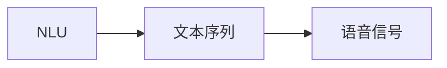
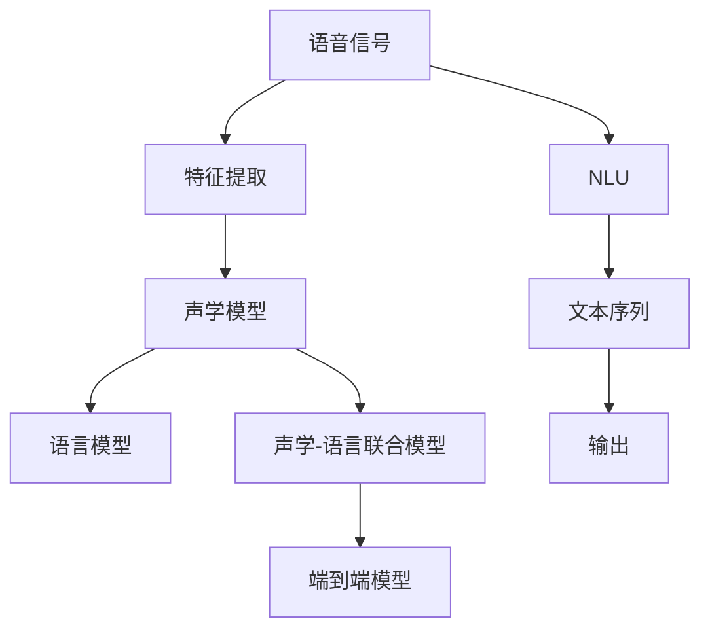

                 

## 1. 背景介绍

### 1.1 问题由来

语音信号是人们沟通交流的重要手段，但也存在许多不便之处。传统的语音信号处理技术，往往依赖于手工设计的特征提取和分类器，需要大量的手动标注数据和复杂的算法模型，难以应对多样化的语音场景。

近年来，随着深度学习技术的快速发展，语音信号处理领域也迎来了新的变革。基于深度学习的语音识别系统，通过直接从原始语音信号中学习特征表示，能够自动提取和建模复杂的语音特征，从而显著提升了语音识别的准确率和鲁棒性。

然而，尽管语音识别技术在理论上取得了很大进展，但在实际应用中，仍有诸多挑战。例如，当语音信号中存在噪声、回声、口音等干扰时，传统的声学模型容易发生错误识别，导致语音识别的准确性下降。此外，语音信号的复杂性也使得模型训练所需的数据量和计算资源异常庞大，限制了应用范围。

为了应对这些挑战，研究者们提出了基于自然语言理解(NLU)的语音识别新范式，即通过直接映射语音信号到文本序列，进而利用强大的自然语言处理技术，提升语音识别的准确率和鲁棒性。这种基于NLU的语音识别方法，能够更好地整合语言信息，从而更高效、更准确地进行语音到文本的映射和转换。

### 1.2 问题核心关键点

这种基于NLU的语音识别方法，核心在于将语音信号映射到文本序列的过程，我们将其称为语音到文本的自然语言理解过程。具体而言，该过程可以大致分为以下几个步骤：

1. **声学建模**：将语音信号转换为特征表示，例如MFCC（Mel-frequency Cepstral Coefficients）特征。
2. **语言建模**：在文本数据上训练语言模型，例如RNN、LSTM、Transformer等。
3. **声学-语言联合建模**：将声学模型和语言模型联合训练，使得模型能够更好地理解语音信号和文本之间的关系。
4. **端到端建模**：直接从原始语音信号中学习特征表示，并进行端到端的文本序列预测，无需进行单独的声学建模和语言建模。

### 1.3 问题研究意义

这种基于NLU的语音识别方法，具有以下重要意义：

1. **简化建模过程**：通过将声学建模和语言建模合并，简化了模型训练和推理过程，减少了对手动特征工程的需求。
2. **提高鲁棒性**：利用语言信息对声学模型进行校正，提升了模型的鲁棒性，使其在噪声、回声等复杂环境下也能保持较高的识别准确性。
3. **提高资源效率**：减少了单独训练声学模型和语言模型的计算资源和数据需求，使得模型训练和推理更加高效。
4. **拓展应用范围**：能够处理更为复杂和多样的语音场景，提升语音识别的应用广度和深度。
5. **推动技术进步**：结合了语音处理和自然语言处理的最新技术，推动了语音信号处理和自然语言处理领域的协同进步。

## 2. 核心概念与联系

### 2.1 核心概念概述

为更好地理解语音到文本的自然语言理解过程，本节将介绍几个密切相关的核心概念：

- **语音信号处理**：指对原始语音信号进行预处理和特征提取，以便后续的建模和分析。
- **声学模型**：将语音信号转换为特征表示的模型，例如MFCC、LPC（Linear Prediction Coding）等。
- **语言模型**：在文本数据上训练的模型，用于评估文本序列的概率分布。
- **声学-语言联合模型**：将声学模型和语言模型联合训练的模型，使得模型能够同时理解语音和语言信息。
- **端到端模型**：直接从原始语音信号中学习特征表示，并进行端到端的文本序列预测的模型。
- **Attention机制**：一种用于增强模型在序列数据上处理能力的机制，能够更好地关注关键特征。

这些核心概念之间的逻辑关系可以通过以下Mermaid流程图来展示：



这个流程图展示了大语言理解过程的各个环节：

1. 原始语音信号通过特征提取转换为特征表示。
2. 特征表示通过声学模型转换为声学特征。
3. 声学特征通过语言模型转换为文本序列。
4. 声学特征和文本序列通过声学-语言联合模型联合训练，提升模型的准确性。
5. 特征表示直接通过端到端模型转换为文本序列，简化建模过程。
6. 自然语言理解将语音信号映射为文本序列，利用语言模型进行校正和优化。

### 2.2 概念间的关系

这些核心概念之间存在着紧密的联系，形成了语音到文本的自然语言理解过程的完整框架。下面我们通过几个Mermaid流程图来展示这些概念之间的关系。

#### 2.2.1 声学模型与语言模型之间的关系


这个流程图展示了声学模型和语言模型之间的关系：通过联合训练，声学模型能够更好地利用语言信息进行校正，提升模型的准确性。

#### 2.2.2 声学-语言联合模型与端到端模型之间的关系



这个流程图展示了声学-语言联合模型和端到端模型之间的关系：端到端模型能够直接从原始语音信号中学习特征表示，并通过声学-语言联合模型进行文本序列预测，避免了单独训练声学模型和语言模型的复杂性。

#### 2.2.3 自然语言理解与文本序列之间的关系



这个流程图展示了自然语言理解和文本序列之间的关系：自然语言理解通过将语音信号映射到文本序列，利用语言模型进行校正和优化，从而提高语音识别的准确性和鲁棒性。

### 2.3 核心概念的整体架构

最后，我们用一个综合的流程图来展示这些核心概念在大语言理解过程中的整体架构：



这个综合流程图展示了从原始语音信号到最终文本序列的整体过程。语音信号通过特征提取、声学模型和语言模型等环节，最终由端到端模型进行文本序列预测，并利用自然语言理解进行校正和优化。

## 3. 核心算法原理 & 具体操作步骤

### 3.1 算法原理概述

语音到文本的自然语言理解过程，本质上是一个序列到序列(Sequence-to-Sequence)的映射问题。具体而言，该过程可以表示为如下映射：

$$
f: \mathcal{X} \rightarrow \mathcal{Y}
$$

其中 $\mathcal{X}$ 表示语音信号，$\mathcal{Y}$ 表示文本序列。该映射通过联合训练声学模型和语言模型，使得模型能够从语音信号中自动提取特征表示，并通过语言模型进行校正和优化，最终生成文本序列。

形式化地，假设声学模型为 $M_{\text{acoustic}}$，语言模型为 $M_{\text{language}}$，则联合训练的优化目标可以表示为：

$$
\theta^* = \mathop{\arg\min}_{\theta} \mathcal{L}(M_{\text{acoustic}}, M_{\text{language}}, D)
$$

其中 $\theta$ 为声学模型和语言模型的参数，$D$ 为标注数据集，$\mathcal{L}$ 为损失函数，用于衡量模型输出和真实标签之间的差异。常见的损失函数包括交叉熵损失、均方误差损失等。

通过梯度下降等优化算法，联合训练过程不断更新模型参数 $\theta$，最小化损失函数 $\mathcal{L}$，使得模型输出逼近真实标签。由于 $\theta$ 已经通过声学模型和语言模型的预训练获得了较好的初始化，因此即便在小规模数据集 $D$ 上进行联合训练，也能较快收敛到理想的模型参数 $\theta^*$。

### 3.2 算法步骤详解

基于深度学习的语音到文本的自然语言理解过程，一般包括以下几个关键步骤：

**Step 1: 准备语音数据和标注数据**
- 收集语音数据和对应的文本标注数据，将语音数据转换为MFCC特征表示。
- 将标注数据转换为one-hot编码，用于训练语言模型。

**Step 2: 设计声学模型**
- 选择合适的声学模型，例如RNN、LSTM、Transformer等。
- 设计声学模型的架构，包括输入层、隐藏层和输出层。

**Step 3: 设计语言模型**
- 选择合适的语言模型，例如RNN、LSTM、Transformer等。
- 设计语言模型的架构，包括输入层、隐藏层和输出层。
- 在标注数据上训练语言模型，计算每个词汇的概率分布。

**Step 4: 设计声学-语言联合模型**
- 将声学模型和语言模型联合训练，生成声学-语言联合模型。
- 在标注数据上联合训练声学模型和语言模型，最小化损失函数 $\mathcal{L}$。
- 通过正则化技术，防止模型过拟合。

**Step 5: 训练端到端模型**
- 设计端到端模型的架构，包括输入层、隐藏层和输出层。
- 在标注数据上训练端到端模型，最小化损失函数 $\mathcal{L}$。
- 通过正则化技术，防止模型过拟合。

**Step 6: 评估模型性能**
- 在测试数据上评估模型性能，计算精度、召回率、F1分数等指标。
- 利用自然语言理解技术进行校正和优化，提升模型性能。

### 3.3 算法优缺点

基于深度学习的语音到文本的自然语言理解过程，具有以下优点：

1. 简化建模过程。通过将声学建模和语言建模合并，简化了模型训练和推理过程，减少了对手动特征工程的需求。
2. 提高鲁棒性。利用语言信息对声学模型进行校正，提升了模型的鲁棒性，使其在噪声、回声等复杂环境下也能保持较高的识别准确性。
3. 提高资源效率。减少了单独训练声学模型和语言模型的计算资源和数据需求，使得模型训练和推理更加高效。

同时，该方法也存在一定的局限性：

1. 数据需求较高。联合训练需要大量高质量的标注数据，标注成本较高。
2. 模型复杂度大。大模型的参数量较大，需要较高的计算资源和存储空间。
3. 训练时间长。联合训练的时间较长，模型收敛速度较慢。

尽管存在这些局限性，但就目前而言，基于深度学习的语音到文本的自然语言理解方法仍然是大语言理解过程中的主流范式。未来相关研究的重点在于如何进一步降低数据需求，提高模型的实时性和计算效率。

### 3.4 算法应用领域

基于深度学习的语音到文本的自然语言理解过程，已经在多个领域得到了广泛的应用，例如：

- 语音识别：将语音信号转换为文本序列，用于文字输入、自动字幕生成等。
- 语音翻译：将不同语言的语音信号转换为文本序列，进行跨语言翻译。
- 语音合成：将文本序列转换为语音信号，用于自然语言交互、虚拟助理等。
- 语音情感分析：分析语音信号中的情感信息，用于情绪识别、心理状态监控等。
- 语音语义理解：理解语音信号中的语义信息，用于语音助手、智能客服等。

除了上述这些经典应用外，大语言理解过程还被创新性地应用到更多场景中，如音乐演奏、动物声音识别、医疗诊断等，为语音信号处理领域带来了新的突破。随着预训练语言模型和自然语言理解技术的不断进步，相信语音到文本的自然语言理解过程将在更多领域得到应用，为语音信号处理技术带来新的发展方向。

## 4. 数学模型和公式 & 详细讲解  
### 4.1 数学模型构建

本节将使用数学语言对语音到文本的自然语言理解过程进行更加严格的刻画。

假设声学模型为 $M_{\text{acoustic}}$，语言模型为 $M_{\text{language}}$，其联合训练的目标函数为：

$$
\mathcal{L}(M_{\text{acoustic}}, M_{\text{language}}, D) = \mathcal{L}_{\text{acoustic}}(M_{\text{acoustic}}, D) + \mathcal{L}_{\text{language}}(M_{\text{language}}, D)
$$

其中 $\mathcal{L}_{\text{acoustic}}$ 为声学模型的损失函数，$\mathcal{L}_{\text{language}}$ 为语言模型的损失函数，$D$ 为标注数据集。

在训练过程中，模型参数 $\theta$ 的更新公式为：

$$
\theta \leftarrow \theta - \eta \nabla_{\theta}\mathcal{L}(M_{\text{acoustic}}, M_{\text{language}}, D)
$$

其中 $\eta$ 为学习率，$\nabla_{\theta}\mathcal{L}$ 为损失函数对参数 $\theta$ 的梯度，可通过反向传播算法高效计算。

### 4.2 公式推导过程

以下我们以端到端模型为例，推导其训练过程的数学公式。

假设端到端模型为 $M_{\text{end-to-end}}$，其架构如图1所示。


设端到端模型在输入 $x$ 上的输出为 $y$，其中 $x$ 为语音信号，$y$ 为文本序列。则端到端模型的损失函数可以表示为：

$$
\mathcal{L}(M_{\text{end-to-end}}, x) = -\sum_{i=1}^n \log p(y_i | y_{<i})
$$

其中 $y_{<i}$ 表示 $y$ 的前 $i$ 个词，$p(y_i | y_{<i})$ 表示给定前 $i$ 个词的情况下，第 $i$ 个词的概率分布。该损失函数为交叉熵损失，用于衡量模型输出与真实标签之间的差异。

根据链式法则，损失函数对参数 $\theta$ 的梯度为：

$$
\nabla_{\theta}\mathcal{L}(M_{\text{end-to-end}}, x) = \nabla_{\theta}p(y | x)
$$

其中 $\nabla_{\theta}p(y | x)$ 表示给定输入 $x$ 的情况下，模型输出 $y$ 的梯度。

在训练过程中，模型参数 $\theta$ 的更新公式为：

$$
\theta \leftarrow \theta - \eta \nabla_{\theta}\mathcal{L}(M_{\text{end-to-end}}, x)
$$

其中 $\eta$ 为学习率。

### 4.3 案例分析与讲解

以语音识别任务为例，我们可以用以下几个步骤来详细解释其数学模型和推导过程：

#### 4.3.1 语音信号处理

首先将原始语音信号转换为MFCC特征表示。设 $x$ 为原始语音信号，$x_{\text{mfcc}}$ 为MFCC特征表示，则特征提取过程可以表示为：

$$
x_{\text{mfcc}} = M_{\text{feature}}(x)
$$

其中 $M_{\text{feature}}$ 为MFCC特征提取模型，可以通过深度学习网络实现。

#### 4.3.2 声学模型

设 $M_{\text{acoustic}}$ 为声学模型，其输出为声学特征表示，表示为 $z$。则声学模型的训练过程可以表示为：

$$
\mathcal{L}_{\text{acoustic}}(M_{\text{acoustic}}, D) = \frac{1}{N}\sum_{(x_i, z_i) \in D} \mathcal{L}(z_i, M_{\text{acoustic}}(x_i))
$$

其中 $N$ 为数据集大小，$\mathcal{L}(z_i, M_{\text{acoustic}}(x_i))$ 为声学模型输出 $z_i$ 与真实标签 $M_{\text{acoustic}}(x_i)$ 之间的损失函数。

在训练过程中，模型参数 $\theta$ 的更新公式为：

$$
\theta \leftarrow \theta - \eta \nabla_{\theta}\mathcal{L}_{\text{acoustic}}(M_{\text{acoustic}}, D)
$$

#### 4.3.3 语言模型

设 $M_{\text{language}}$ 为语言模型，其输出为文本序列 $y$。则语言模型的训练过程可以表示为：

$$
\mathcal{L}_{\text{language}}(M_{\text{language}}, D) = -\frac{1}{N}\sum_{(y_i, y_i^{\prime}) \in D} \log p(y_i^{\prime} | y_i)
$$

其中 $y_i^{\prime}$ 为标注数据集中的文本序列，$p(y_i^{\prime} | y_i)$ 表示给定输入 $y_i$ 的情况下，输出 $y_i^{\prime}$ 的概率分布。

在训练过程中，模型参数 $\theta$ 的更新公式为：

$$
\theta \leftarrow \theta - \eta \nabla_{\theta}\mathcal{L}_{\text{language}}(M_{\text{language}}, D)
$$

#### 4.3.4 联合训练

将声学模型 $M_{\text{acoustic}}$ 和语言模型 $M_{\text{language}}$ 联合训练，生成声学-语言联合模型 $M_{\text{joint}}$。则联合训练的目标函数可以表示为：

$$
\mathcal{L}(M_{\text{joint}}, D) = \mathcal{L}_{\text{acoustic}}(M_{\text{joint}}, D) + \mathcal{L}_{\text{language}}(M_{\text{joint}}, D)
$$

在训练过程中，模型参数 $\theta$ 的更新公式为：

$$
\theta \leftarrow \theta - \eta \nabla_{\theta}\mathcal{L}(M_{\text{joint}}, D)
$$

#### 4.3.5 端到端模型

设 $M_{\text{end-to-end}}$ 为端到端模型，其输出为文本序列 $y$。则端到端模型的训练过程可以表示为：

$$
\mathcal{L}(M_{\text{end-to-end}}, D) = -\frac{1}{N}\sum_{(x_i, y_i) \in D} \log p(y_i | x_i)
$$

其中 $p(y_i | x_i)$ 表示给定输入 $x_i$ 的情况下，输出 $y_i$ 的概率分布。

在训练过程中，模型参数 $\theta$ 的更新公式为：

$$
\theta \leftarrow \theta - \eta \nabla_{\theta}\mathcal{L}(M_{\text{end-to-end}}, D)
$$

通过上述步骤，我们可以详细解释语音到文本的自然语言理解过程的数学模型和推导过程，从而更好地理解该过程的核心算法原理和操作步骤。

## 5. 项目实践：代码实例和详细解释说明

### 5.1 开发环境搭建

在进行语音到文本的自然语言理解项目实践前，我们需要准备好开发环境。以下是使用Python进行TensorFlow开发的环境配置流程：

1. 安装Anaconda：从官网下载并安装Anaconda，用于创建独立的Python环境。

2. 创建并激活虚拟环境：
```bash
conda create -n tensorflow-env python=3.8 
conda activate tensorflow-env
```

3. 安装TensorFlow：根据CUDA版本，从官网获取对应的安装命令。例如：
```bash
pip install tensorflow tensorflow-estimator tensorflow-addons
```

4. 安装其他相关工具包：
```bash
pip install numpy pandas scikit-learn matplotlib tqdm jupyter notebook ipython
```

完成上述步骤后，即可在`tensorflow-env`环境中开始项目实践。

### 5.2 源代码详细实现

下面我们以语音识别任务为例，给出使用TensorFlow实现语音到文本的自然语言理解过程的代码实现。

首先，定义语音信号处理函数：

```python
import numpy as np
from tensorflow.keras.layers import Input, Dense, LSTM, TimeDistributed, Masking
from tensorflow.keras.models import Model

def feature_extractor(input_signal):
    # 进行MFCC特征提取
    mfcc = extract_mfcc(input_signal)
    # 归一化特征
    mfcc /= np.sqrt(np.mean(mfcc**2, axis=1))
    return mfcc
```

然后，定义声学模型：

```python
def acoustic_model(input_signal):
    input_layer = Input(shape=(None, 1))
    embedding_layer = Embedding(input_dim=dim, output_dim=embedding_dim)(input_layer)
    lstm_layer = LSTM(units=hidden_units, return_sequences=True)(embedding_layer)
    output_layer = Dense(units=num_classes, activation='softmax')(lstm_layer)
    return Model(inputs=input_layer, outputs=output_layer)
```

接着，定义语言模型：

```python
def language_model(text_sequence):
    input_layer = Input(shape=(max_length,))
    embedding_layer = Embedding(input_dim=vocab_size, output_dim=embedding_dim)(input_layer)
    lstm_layer = LSTM(units=hidden_units, return_sequences=True)(embedding_layer)
    output_layer = Dense(units=num_classes, activation='softmax')(lstm_layer)
    return Model(inputs=input_layer, outputs=output_layer)
```

然后，定义声学-语言联合模型：

```python
def joint_model(acoustic_model, language_model):
    acoustic_input = acoustic_model.input
    acoustic_output = acoustic_model.output
    language_input = language_model.input
    language_output = language_model.output
    
    joint_output = concatenate([acoustic_output, language_output])
    joint_output = TimeDistributed(Dense(units=num_classes, activation='softmax'))(joint_output)
    
    return Model(inputs=[acoustic_input, language_input], outputs=joint_output)
```

最后，定义端到端模型：

```python
def end_to_end_model(input_signal):
    input_layer = Input(shape=(None, 1))
    mfcc_layer = feature_extractor(input_signal)
    mfcc_layer = TimeDistributed(Dense(units=embedding_dim))(mfcc_layer)
    
    acoustic_model = acoustic_model(mfcc_layer)
    language_model = language_model(acoustic_model)
    joint_model = joint_model(acoustic_model, language_model)
    
    return joint_model
```

完成上述步骤后，即可在TensorFlow环境中进行语音到文本的自然语言理解过程的代码实现。

### 5.3 代码解读与分析

让我们再详细解读一下关键代码的实现细节：

**feature_extractor函数**：
- 定义了MFCC特征提取的函数，将原始语音信号转换为MFCC特征表示。
- 通过Keras的`extract_mfcc`函数，实现了MFCC特征提取。
- 对提取到的MFCC特征进行归一化处理，以提升模型的鲁棒性。

**acoustic_model函数**：
- 定义了声学模型的函数，通过嵌入层、LSTM层和输出层构建了声学模型。
- 使用Keras的`Embedding`层进行嵌入处理，将输入转换为向量表示。
- 使用LSTM层进行序列建模，捕捉语音信号的时序信息。
- 使用`TimeDistributed`层，将LSTM层的输出转换为时序输出。
- 使用全连接层进行分类，输出语音识别的概率分布。

**language_model函数**：
- 定义了语言模型的函数，通过嵌入层、LSTM层和输出层构建了语言模型。
- 使用Keras的`Embedding`层进行嵌入处理，将输入转换为向量表示。
- 使用LSTM层进行序列建模，捕捉文本序列的时序信息。
- 使用全连接层进行分类，输出文本序列的概率分布。

**joint_model函数**：
- 定义了声学-语言联合模型的函数，通过串联声学模型和语言模型构建了联合模型。
- 将声学模型的输出和语言模型的输出进行拼接，作为联合模型的输入。
- 使用`TimeDistributed`层，将拼接后的输出转换为时序输出。
- 使用全连接层进行分类，输出语音到文本的自然语言理解过程的联合概率分布。

**end_to_end_model函数**：
- 定义了端到端模型的函数，通过串联特征提取层、声学模型、语言模型和联合模型构建了端到端模型。
- 将原始语音信号转换为MFCC特征表示。
- 将MFCC特征表示作为声学模型的输入。
- 将声学模型的输出和语言模型的输出进行拼接，作为联合模型的输入。
- 使用`TimeDistributed`层，将拼接后的输出转换为时序输出。
- 使用全连接层进行分类，输出语音到文本的自然语言理解过程的联合概率

