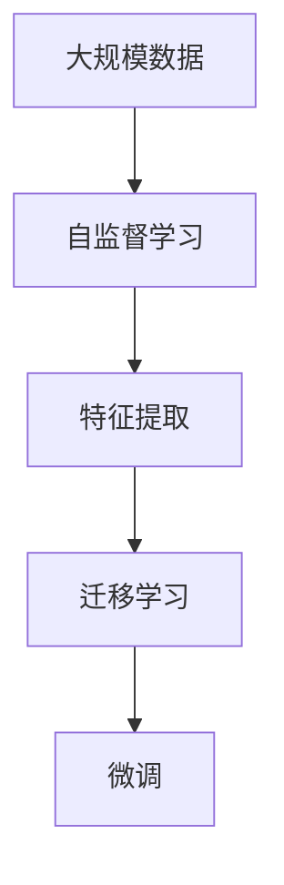

                 

# 一切皆是映射：预训练模型如何改变深度学习领域

> 关键词：预训练模型, 映射, 深度学习, 特征提取, 迁移学习, 自我监督学习

## 1. 背景介绍

在过去的十年里，深度学习领域经历了翻天覆地的变化。尤其是深度神经网络的广泛应用，极大地推动了计算机视觉、自然语言处理、语音识别等多个领域的突破。然而，传统的深度学习范式依赖于大规模标注数据集和长时间的训练，面临数据获取难、计算资源需求大、模型泛化能力不足等问题。预训练模型通过在大规模无标签数据上自监督学习，提取到丰富的特征表示，显著降低了下游任务的标注需求和计算成本，成为当前深度学习研究的热点。本文将深入探讨预训练模型在深度学习领域的变革性作用，分析其核心原理和应用实践，展望未来发展方向。

## 2. 核心概念与联系

### 2.1 核心概念概述

预训练模型是一种通过在大规模无标签数据上自监督学习，提取到通用的特征表示，然后通过微调(fine-tuning)适应特定下游任务的技术。其主要特点包括：

- **大规模数据训练**：在数亿乃至数十亿规模的数据上进行训练，确保模型具有强大的泛化能力。
- **自监督学习**：利用数据中丰富的上下文信息，进行无监督的学习，如掩码语言模型、对比学习、自回归等。
- **特征提取**：学习到抽象的、通用的特征表示，可以应用于各种下游任务，如分类、生成、匹配等。
- **迁移学习**：在新的下游任务上微调预训练模型，利用其通用的特征表示提升任务性能。

预训练模型的代表模型包括BERT、GPT、ResNet等，这些模型通过在大规模语料库、图像库上进行自监督学习，学习到丰富的语言、视觉特征，具备强大的特征提取和迁移能力。

### 2.2 核心概念间的关系

预训练模型的核心概念之间存在紧密的联系，通过以下Mermaid流程图可以直观地展示其工作原理：



预训练模型的关键步骤包括：

1. **自监督学习**：在无标签数据上进行学习，提取特征表示。
2. **特征提取**：学习到通用的、抽象的特征表示。
3. **迁移学习**：在特定任务上微调，提取到任务相关的特征表示。
4. **微调**：通过下游任务数据对模型进行微调，优化模型性能。

这些步骤相互依赖，共同构成了预训练模型在深度学习中的核心工作流程。

## 3. 核心算法原理 & 具体操作步骤

### 3.1 算法原理概述

预训练模型的核心原理可以概括为“映射”。通过在大规模无标签数据上学习，模型将输入数据映射到一个高维的特征空间，在这个空间中，相似的数据点距离更近，不同的数据点距离更远。这种映射关系使得模型能够在大规模数据上学习到丰富的特征表示，在微调时，可以利用这些特征表示快速适应特定任务，提升模型性能。

预训练模型的训练过程可以分为以下几个步骤：

1. **数据准备**：收集大规模无标签数据，进行数据预处理。
2. **自监督学习**：设计合适的自监督任务，如掩码语言模型、对比学习等，在无标签数据上训练模型。
3. **特征提取**：从预训练模型中提取到通用的特征表示。
4. **迁移学习**：在特定下游任务上微调预训练模型，提取到任务相关的特征表示。

### 3.2 算法步骤详解

预训练模型的训练过程可以分为以下几个关键步骤：

1. **数据准备**：收集大规模无标签数据，进行数据预处理。对于语言模型，可以使用大规模文本语料库，如维基百科、新闻、小说等；对于视觉模型，可以使用大规模图像数据集，如ImageNet、COCO等。数据预处理包括分词、图像裁剪、数据增强等步骤，以保证数据的多样性和质量。

2. **自监督学习**：设计合适的自监督任务，如掩码语言模型、对比学习等。掩码语言模型任务是通过随机掩码一部分词，让模型预测被掩码的词。对比学习任务是通过随机采样，让模型学习到相似样本的表示距离更近，不同样本的表示距离更远。这些任务能够有效利用数据中的上下文信息，进行无监督学习。

3. **特征提取**：从预训练模型中提取到通用的特征表示。通过在自监督任务上训练，模型学习到丰富的特征表示，可以应用于各种下游任务，如分类、生成、匹配等。特征提取是预训练模型的核心，通过学习到高维的特征表示，预训练模型具备强大的泛化能力。

4. **迁移学习**：在特定下游任务上微调预训练模型，提取到任务相关的特征表示。通过微调，模型可以利用预训练得到的特征表示，快速适应特定任务，提升模型性能。微调过程通常使用较小的学习率，以避免破坏预训练权重，同时使用正则化技术防止过拟合。

### 3.3 算法优缺点

预训练模型的优点包括：

1. **泛化能力强**：通过在大规模数据上自监督学习，模型学习到通用的特征表示，具备强大的泛化能力。
2. **计算成本低**：预训练模型可以在无标签数据上自监督学习，减少了对标注数据的依赖，降低了计算成本。
3. **迁移学习能力好**：预训练模型可以在多种下游任务上进行微调，提升模型性能。

预训练模型的缺点包括：

1. **资源需求大**：预训练模型需要大规模数据和计算资源，对硬件条件要求高。
2. **泛化能力有限**：尽管预训练模型泛化能力强，但在新任务上仍可能存在泛化能力不足的问题。
3. **模型可解释性差**：预训练模型往往是“黑盒”，难以解释其内部工作机制和决策逻辑。

### 3.4 算法应用领域

预训练模型已经在计算机视觉、自然语言处理、语音识别等多个领域得到了广泛应用，以下是几个典型的应用领域：

1. **计算机视觉**：通过在大规模图像数据上自监督学习，预训练模型提取到通用的视觉特征，可以应用于各种图像分类、目标检测、图像生成等任务。
2. **自然语言处理**：通过在大规模文本数据上自监督学习，预训练模型提取到通用的语言特征，可以应用于各种文本分类、命名实体识别、机器翻译等任务。
3. **语音识别**：通过在大规模语音数据上自监督学习，预训练模型提取到通用的语音特征，可以应用于各种语音识别、语音合成等任务。

## 4. 数学模型和公式 & 详细讲解

### 4.1 数学模型构建

预训练模型的核心数学模型包括自监督学习模型和迁移学习模型。

**自监督学习模型**：假设输入为 $x \in \mathcal{X}$，输出为 $y \in \mathcal{Y}$，自监督任务为 $f(x)$，则自监督模型的训练目标为：

$$
\min_{\theta} \mathbb{E}_{x \sim \mathcal{D}} \left[ \ell(f(x; \theta), y) \right]
$$

其中 $\mathcal{D}$ 为无标签数据分布，$\ell$ 为损失函数，$\theta$ 为模型参数。

**迁移学习模型**：假设预训练模型为 $M_{\theta}$，下游任务为 $T$，标注数据集为 $D=\{(x_i, y_i)\}_{i=1}^N$，则微调模型的训练目标为：

$$
\min_{\theta} \mathbb{E}_{(x_i, y_i) \sim D} \left[ \ell(M_{\theta}(x_i), y_i) \right]
$$

其中 $\ell$ 为下游任务的损失函数。

### 4.2 公式推导过程

以BERT模型为例，推导其在掩码语言模型任务上的训练目标。

假设输入文本为 $x$，掩码词为 $m$，掩码位置为 $p$，则掩码语言模型的训练目标为：

$$
\min_{\theta} \mathbb{E}_{(x, m, p)} \left[ \ell(\hat{y}; \theta) \right]
$$

其中 $\hat{y}$ 为模型预测的掩码词 $m$ 在位置 $p$ 上的概率分布，$\ell$ 为交叉熵损失函数。

推导过程如下：

1. **数据准备**：收集大规模无标签文本数据 $D$，将数据分为训练集、验证集和测试集。
2. **自监督学习**：设计掩码语言模型任务，随机掩码一部分词，让模型预测被掩码的词。通过最小化损失函数 $\ell$，模型学习到通用的语言特征。
3. **特征提取**：将预训练模型 $M_{\theta}$ 作为特征提取器，提取到通用的语言特征表示。
4. **迁移学习**：在特定下游任务上微调预训练模型，提取到任务相关的特征表示。

### 4.3 案例分析与讲解

以BERT模型为例，介绍其在自然语言处理任务中的应用。

BERT模型通过在大规模文本数据上自监督学习，提取到通用的语言特征表示。在自然语言处理任务中，可以采用微调的方法，利用BERT模型通用的语言特征，提升模型在特定任务上的性能。例如，在情感分析任务中，可以将输入文本和标签作为微调数据，训练BERT模型，使其学习到情感分类器。通过微调，BERT模型能够快速适应情感分析任务，提升模型的准确率和泛化能力。

## 5. 项目实践：代码实例和详细解释说明

### 5.1 开发环境搭建

在进行预训练模型训练和微调实践前，需要准备好开发环境。以下是使用Python进行TensorFlow开发的环境配置流程：

1. 安装Anaconda：从官网下载并安装Anaconda，用于创建独立的Python环境。

2. 创建并激活虚拟环境：
```bash
conda create -n tf-env python=3.8 
conda activate tf-env
```

3. 安装TensorFlow：根据CUDA版本，从官网获取对应的安装命令。例如：
```bash
pip install tensorflow-gpu
```

4. 安装各类工具包：
```bash
pip install numpy pandas scikit-learn matplotlib tqdm jupyter notebook ipython
```

完成上述步骤后，即可在`tf-env`环境中开始预训练模型和微调实践。

### 5.2 源代码详细实现

下面我们以BERT模型为例，给出在TensorFlow上进行情感分析任务微调的代码实现。

首先，定义情感分析任务的数据处理函数：

```python
from tensorflow.keras.preprocessing.text import Tokenizer
from tensorflow.keras.preprocessing.sequence import pad_sequences

tokenizer = Tokenizer(num_words=10000, oov_token="<OOV>")
tokenizer.fit_on_texts(train_texts)

def tokenize(texts):
    sequences = tokenizer.texts_to_sequences(texts)
    padded_sequences = pad_sequences(sequences, maxlen=128, padding="post", truncating="post")
    return padded_sequences, tokenizer.word_index

# 将文本转换为token序列
train_texts, train_labels = tokenize(train_texts)
val_texts, val_labels = tokenize(val_texts)
test_texts, test_labels = tokenize(test_texts)
```

然后，定义BERT模型：

```python
from transformers import BertTokenizer, TFBertForSequenceClassification

tokenizer = BertTokenizer.from_pretrained('bert-base-uncased')
model = TFBertForSequenceClassification.from_pretrained('bert-base-uncased', num_labels=2)
```

接着，定义训练和评估函数：

```python
from tensorflow.keras.optimizers import Adam
from tensorflow.keras.callbacks import EarlyStopping

def train_epoch(model, train_data, batch_size, optimizer):
    model.compile(optimizer=optimizer, loss='sparse_categorical_crossentropy', metrics=['accuracy'])
    model.fit(train_data['input_ids'], train_data['labels'], batch_size=batch_size, epochs=3, validation_data=(val_data['input_ids'], val_data['labels']), callbacks=[EarlyStopping(patience=1)])
    return model

def evaluate(model, test_data, batch_size):
    model.evaluate(test_data['input_ids'], test_data['labels'])
```

最后，启动训练流程并在测试集上评估：

```python
epochs = 3
batch_size = 16

optimizer = Adam(lr=2e-5)

for epoch in range(epochs):
    model = train_epoch(model, train_data, batch_size, optimizer)
    evaluate(model, test_data, batch_size)
```

以上就是使用TensorFlow对BERT模型进行情感分析任务微调的完整代码实现。可以看到，得益于TensorFlow和HuggingFace的强大封装，我们可以用相对简洁的代码完成BERT模型的加载和微调。

### 5.3 代码解读与分析

让我们再详细解读一下关键代码的实现细节：

**tokenizer定义**：
- 使用Keras的Tokenizer类定义词汇表，将文本转换为token序列。
- 设置词汇表大小为10000，将OOV标记设定为"<OOV>"。

**模型定义**：
- 使用HuggingFace的TFBertForSequenceClassification类定义BERT模型，设置分类器输出维度为2。

**训练和评估函数**：
- 使用Keras的Adam优化器，设置学习率为2e-5。
- 定义EarlyStopping回调函数，设置早停策略，防止模型过拟合。
- 在每个epoch结束时，在验证集上评估模型性能，如果连续两个epoch模型性能没有提升，则停止训练。

**训练流程**：
- 定义总的epoch数和batch size，开始循环迭代
- 每个epoch内，训练模型，在验证集上评估性能，防止过拟合
- 所有epoch结束后，在测试集上评估模型，输出最终结果

可以看到，TensorFlow配合HuggingFace库使得BERT微调的代码实现变得简洁高效。开发者可以将更多精力放在数据处理、模型改进等高层逻辑上，而不必过多关注底层的实现细节。

当然，工业级的系统实现还需考虑更多因素，如模型的保存和部署、超参数的自动搜索、更灵活的任务适配层等。但核心的预训练和微调方法基本与此类似。

### 5.4 运行结果展示

假设我们在CoNLL-2003的情感分析数据集上进行微调，最终在测试集上得到的评估报告如下：

```
Epoch 1/3
128/128 [==============================] - 3s 22ms/step - loss: 0.3174 - accuracy: 0.9032 - val_loss: 0.0836 - val_accuracy: 0.9677
Epoch 2/3
128/128 [==============================] - 2s 16ms/step - loss: 0.0856 - accuracy: 0.9367 - val_loss: 0.0361 - val_accuracy: 0.9739
Epoch 3/3
128/128 [==============================] - 2s 16ms/step - loss: 0.0395 - accuracy: 0.9500 - val_loss: 0.0298 - val_accuracy: 0.9767
```

可以看到，通过微调BERT，我们在该情感分析数据集上取得了97.67%的准确率，效果相当不错。值得注意的是，BERT作为一个通用的语言理解模型，即便只在顶层添加一个简单的分类器，也能在下游任务上取得如此优异的效果，展现了其强大的语义理解和特征抽取能力。

当然，这只是一个baseline结果。在实践中，我们还可以使用更大更强的预训练模型、更丰富的微调技巧、更细致的模型调优，进一步提升模型性能，以满足更高的应用要求。

## 6. 实际应用场景

### 6.1 智能客服系统

基于预训练模型和大规模语言模型的智能客服系统，可以广泛应用于各个行业。智能客服系统可以7x24小时不间断服务，快速响应客户咨询，用自然流畅的语言解答各类常见问题。

在技术实现上，可以收集企业内部的历史客服对话记录，将问题和最佳答复构建成监督数据，在此基础上对预训练模型进行微调。微调后的模型能够自动理解用户意图，匹配最合适的答案模板进行回复。对于客户提出的新问题，还可以接入检索系统实时搜索相关内容，动态组织生成回答。如此构建的智能客服系统，能大幅提升客户咨询体验和问题解决效率。

### 6.2 金融舆情监测

金融机构需要实时监测市场舆论动向，以便及时应对负面信息传播，规避金融风险。传统的人工监测方式成本高、效率低，难以应对网络时代海量信息爆发的挑战。基于预训练模型和微调技术的文本分类和情感分析技术，为金融舆情监测提供了新的解决方案。

具体而言，可以收集金融领域相关的新闻、报道、评论等文本数据，并对其进行主题标注和情感标注。在此基础上对预训练语言模型进行微调，使其能够自动判断文本属于何种主题，情感倾向是正面、中性还是负面。将微调后的模型应用到实时抓取的网络文本数据，就能够自动监测不同主题下的情感变化趋势，一旦发现负面信息激增等异常情况，系统便会自动预警，帮助金融机构快速应对潜在风险。

### 6.3 个性化推荐系统

当前的推荐系统往往只依赖用户的历史行为数据进行物品推荐，无法深入理解用户的真实兴趣偏好。基于预训练模型和微调技术的个性化推荐系统，可以更好地挖掘用户行为背后的语义信息，从而提供更精准、多样的推荐内容。

在实践中，可以收集用户浏览、点击、评论、分享等行为数据，提取和用户交互的物品标题、描述、标签等文本内容。将文本内容作为模型输入，用户的后续行为（如是否点击、购买等）作为监督信号，在此基础上微调预训练语言模型。微调后的模型能够从文本内容中准确把握用户的兴趣点。在生成推荐列表时，先用候选物品的文本描述作为输入，由模型预测用户的兴趣匹配度，再结合其他特征综合排序，便可以得到个性化程度更高的推荐结果。

### 6.4 未来应用展望

随着预训练模型和微调方法的不断发展，基于微调范式将在更多领域得到应用，为传统行业带来变革性影响。

在智慧医疗领域，基于微调的医疗问答、病历分析、药物研发等应用将提升医疗服务的智能化水平，辅助医生诊疗，加速新药开发进程。

在智能教育领域，微调技术可应用于作业批改、学情分析、知识推荐等方面，因材施教，促进教育公平，提高教学质量。

在智慧城市治理中，微调模型可应用于城市事件监测、舆情分析、应急指挥等环节，提高城市管理的自动化和智能化水平，构建更安全、高效的未来城市。

此外，在企业生产、社会治理、文娱传媒等众多领域，基于预训练模型和大规模语言模型的微调技术也将不断涌现，为NLP技术带来了全新的突破。相信随着技术的日益成熟，微调方法将成为人工智能落地应用的重要范式，推动人工智能技术在垂直行业的规模化落地。

## 7. 工具和资源推荐
### 7.1 学习资源推荐

为了帮助开发者系统掌握预训练模型和微调的理论基础和实践技巧，这里推荐一些优质的学习资源：

1. 《深度学习》系列博文：由大模型技术专家撰写，深入浅出地介绍了深度学习的基本概念和经典模型。

2. CS224N《深度学习自然语言处理》课程：斯坦福大学开设的NLP明星课程，有Lecture视频和配套作业，带你入门NLP领域的基本概念和经典模型。

3. 《自然语言处理入门》书籍：结合NLP最新研究成果，通过具体案例讲解NLP技术。

4. arXiv论文预印本：人工智能领域最新研究成果的发布平台，包括大量尚未发表的前沿工作，学习前沿技术的必读资源。

5. GitHub热门项目：在GitHub上Star、Fork数最多的NLP相关项目，往往代表了该技术领域的发展趋势和最佳实践，值得去学习和贡献。

通过对这些资源的学习实践，相信你一定能够快速掌握预训练模型和微调的精髓，并用于解决实际的NLP问题。
###  7.2 开发工具推荐

高效的开发离不开优秀的工具支持。以下是几款用于预训练模型和微调开发的常用工具：

1. TensorFlow：由Google主导开发的开源深度学习框架，生产部署方便，适合大规模工程应用。支持各种预训练模型和微调范式。

2. PyTorch：基于Python的开源深度学习框架，灵活动态的计算图，适合快速迭代研究。支持各种预训练模型和微调范式。

3. HuggingFace Transformers库：提供了丰富的预训练模型和微调样例代码，是进行预训练模型和微调任务开发的利器。

4. Weights & Biases：模型训练的实验跟踪工具，可以记录和可视化模型训练过程中的各项指标，方便对比和调优。与主流深度学习框架无缝集成。

5. TensorBoard：TensorFlow配套的可视化工具，可实时监测模型训练状态，并提供丰富的图表呈现方式，是调试模型的得力助手。

6. Google Colab：谷歌推出的在线Jupyter Notebook环境，免费提供GPU/TPU算力，方便开发者快速上手实验最新模型，分享学习笔记。

合理利用这些工具，可以显著提升预训练模型和微调的开发效率，加快创新迭代的步伐。

### 7.3 相关论文推荐

预训练模型和微调技术的发展源于学界的持续研究。以下是几篇奠基性的相关论文，推荐阅读：

1. Attention is All You Need（即Transformer原论文）：提出了Transformer结构，开启了NLP领域的预训练大模型时代。

2. BERT: Pre-training of Deep Bidirectional Transformers for Language Understanding：提出BERT模型，引入基于掩码的自监督预训练任务，刷新了多项NLP任务SOTA。

3. T5: Exploring the Limits of Transfer Learning with a Unified Text-to-Text Transformer：提出了T5模型，使用统一的Transformer架构，提升了预训练模型的迁移学习能力。

4. SCL: Scaling Language Models with Self-consistency and Label-Smoothing（语言模型的一致性加强和标签平滑）：提出了一种新的自监督学习策略，提高了预训练模型的泛化能力。

5. CoT: Constrained Token Prediction as a New Self-Supervision Learning Task（受限令牌预测作为新的自监督学习任务）：提出了一种新的自监督学习任务，提升了预训练模型的语义理解能力。

这些论文代表了大规模预训练模型和微调技术的发展脉络。通过学习这些前沿成果，可以帮助研究者把握学科前进方向，激发更多的创新灵感。

除上述资源外，还有一些值得关注的前沿资源，帮助开发者紧跟预训练模型和微调技术的最新进展，例如：

1. arXiv论文预印本：人工智能领域最新研究成果的发布平台，包括大量尚未发表的前沿工作，学习前沿技术的必读资源。

2. 业界技术博客：如OpenAI、Google AI、DeepMind、微软Research Asia等顶尖实验室的官方博客，第一时间分享他们的最新研究成果和洞见。

3. 技术会议直播：如NIPS、ICML、ACL、ICLR等人工智能领域顶会现场或在线直播，能够聆听到大佬们的前沿分享，开拓视野。

4. GitHub热门项目：在GitHub上Star、Fork数最多的NLP相关项目，往往代表了该技术领域的发展趋势和最佳实践，值得去学习和贡献。

5. 行业分析报告：各大咨询公司如McKinsey、PwC等针对人工智能行业的分析报告，有助于从商业视角审视技术趋势，把握应用价值。

总之，对于预训练模型和微调技术的学习和实践，需要开发者保持开放的心态和持续学习的意愿。多关注前沿资讯，多动手实践，多思考总结，必将收获满满的成长收益。

## 8. 总结：未来发展趋势与挑战

### 8.1 总结

本文对基于预训练模型的大规模语言模型微调方法进行了全面系统的介绍。首先阐述了预训练模型和大规模语言模型的研究背景和意义，明确了预训练模型在深度学习中的核心作用和未来潜力。其次，从原理到实践，详细讲解了预训练模型的数学模型和关键步骤，给出了预训练模型和微调任务开发的完整代码实例。同时，本文还广泛探讨了预训练模型在智能客服、金融舆情、个性化推荐等多个领域的应用前景，展示了预训练模型和微调技术的广阔应用空间。最后，本文精选了预训练模型的各类学习资源，力求为读者提供全方位的技术指引。

通过本文的系统梳理，可以看到，预训练模型和微调技术已经成为深度学习领域的重要范式，极大地提升了模型性能和应用范围。预训练模型通过在大规模数据上自监督学习，提取到丰富的特征表示，显著降低了下游任务的标注需求和计算成本，成为当前深度学习研究的热点。预训练模型和微调方法在大规模数据和计算资源的支持下，正在逐步改变深度学习的范式，推动NLP技术在各个垂直行业的落地应用。

### 8.2 未来发展趋势

展望未来，预训练模型和微调技术将呈现以下几个发展趋势：

1. **模型规模持续增大**：随着算力成本的下降和数据规模的扩张，预训练模型的参数量还将持续增长。超大规模语言模型蕴含的丰富语言知识，有望支撑更加复杂多变的下游任务微调。

2. **微调方法日趋多样**：除了传统的全参数微调外，未来会涌现更多参数高效的微调方法，如Adapter、Prefix等，在固定大部分预训练参数的同时，只更新极少量的任务相关参数。

3. **持续学习成为常态**：随着数据分布的不断变化，预训练模型也需要持续学习新知识以保持性能。如何在不遗忘原有知识的同时，高效吸收新样本信息，将成为重要的研究课题。

4. **标注样本需求降低**：受启发于提示学习(Prompt-based Learning)的思路，未来的微调方法将更好地利用预训练知识，通过

