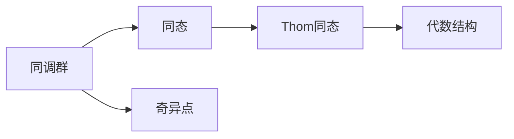

                 

# 上同调中的Thom同态

## 1. 背景介绍

在代数拓扑和同调理论中，同态和同调群扮演着核心角色，它们提供了对空间结构的深刻洞察。同态描述了空间之间的映射关系，而同调群则记录了这些映射所引起的空间特性的变化。在这一背景下，Thom同态的概念应运而生，它揭示了拓扑空间中某些同调群与代数结构之间的联系，为拓扑学和代数几何的交叉研究提供了新的视角。

### 1.1 问题由来

Thom同态最早由René Thom在1954年提出，用以研究奇异点和拓扑结构之间的关系。Thom的贡献不仅在于这一新同态的发现，更在于其深刻的数学洞察力，为拓扑学和几何拓扑的发展奠定了基础。Thom同态的提出，开启了拓扑学研究的新篇章，引发了后续一系列的拓扑学和几何拓扑学的研究热潮。

### 1.2 问题核心关键点

Thom同态的核心思想在于将拓扑空间的某些同调群与代数结构（如多项式环、拉格朗日代数）联系起来。这不仅为拓扑学提供了新的工具和方法，也促进了拓扑学与代数几何、代数拓扑等其他数学领域的交叉研究。

## 2. 核心概念与联系

### 2.1 核心概念概述

- **同调群**：同调群是一类重要的代数拓扑不变量，描述了拓扑空间中的“洞”或“空隙”。同调群分为零维、一维、二维等不同维度的同调群，分别对应于点、一维链和二维链。

- **同态**：同态是指空间之间的映射，保持了结构的某些特性，如加法和乘法。在拓扑学中，同态通常用于描述空间之间的拓扑映射关系。

- **Thom同态**：Thom同态是一种特殊的同态，它将拓扑空间的同调群映射到代数结构中，从而揭示了拓扑空间与代数结构之间的联系。

- **奇异点**：奇异点是指空间中的某些特殊点，其局部结构不同于周围点。奇异点的研究是拓扑学的重要方向之一，Thom同态即为奇异点理论的重要工具。

### 2.2 概念间的关系

这些核心概念通过Thom同态紧密联系在一起。同调群描述了拓扑空间的不变性，同态描述了空间之间的映射关系，而Thom同态则通过同态映射将同调群与代数结构联系起来。奇异点作为拓扑学的研究对象，Thom同态提供了理解奇异点的代数方法。

通过以下Mermaid流程图，我们可以更直观地理解这些概念之间的关系：



这个流程图展示了同调群通过同态映射到Thom同态，进而映射到代数结构的过程，同时也体现了奇异点在拓扑学中的重要性。

## 3. Thom同态的算法原理 & 具体操作步骤

### 3.1 算法原理概述

Thom同态的基本原理是通过一个拓扑空间上的一个向量场，构造出一个代数同态，将拓扑空间的某些同调群映射到代数结构中。其核心步骤如下：

1. **选择向量场**：在拓扑空间 $M$ 上选择一个光滑向量场 $X$。
2. **构造映射**：构造一个映射 $f: M \to \mathbb{R}$，使得 $f(p) = \langle p, X(p) \rangle$，其中 $\langle \cdot, \cdot \rangle$ 是向量内积。
3. **映射同调群**：将拓扑空间 $M$ 的同调群 $H_n(M)$ 映射到代数结构中，其中 $n$ 表示同调群的维度。

### 3.2 算法步骤详解

具体的算法步骤如下：

1. **选择向量场**：在拓扑空间 $M$ 上选择一个光滑向量场 $X$。向量场 $X$ 需要在 $M$ 上的某些点 $p$ 处，满足特定的非退化和奇异性条件。

2. **构造映射**：构造一个映射 $f: M \to \mathbb{R}$，使得 $f(p) = \langle p, X(p) \rangle$。这里的 $\langle \cdot, \cdot \rangle$ 是向量内积。

3. **计算同调群映射**：将拓扑空间 $M$ 的同调群 $H_n(M)$ 映射到代数结构中。这一映射是通过计算积分 $\int_{M} f^* \Omega$ 来实现的，其中 $\Omega$ 是一个特定的拉格朗日代数表达式。

4. **验证映射**：验证所构造的同态映射是否满足某些性质，如是否保持拓扑结构等。

### 3.3 算法优缺点

Thom同态在拓扑学中有其独特的优势：

**优点**：
1. **提供新视角**：Thom同态为拓扑空间的同调群与代数结构之间的联系提供了新的视角，拓宽了拓扑学研究的方法和工具。
2. **简化问题**：在某些情况下，通过Thom同态可以将拓扑问题简化为代数问题，便于解决。

**缺点**：
1. **复杂度较高**：Thom同态的构造和验证过程较为复杂，需要高深的数学知识和技巧。
2. **适用范围有限**：Thom同态主要适用于光滑向量场和某些特定的拓扑空间，对于非光滑或更一般的拓扑空间，应用受限。

### 3.4 算法应用领域

Thom同态在拓扑学、代数拓扑、代数几何等领域有着广泛的应用：

1. **奇异点理论**：Thom同态在奇异点理论中起到核心作用，通过构造特定的代数同态，揭示奇异点与周围拓扑结构之间的关系。
2. **拉格朗日代数**：Thom同态与拉格朗日代数密切相关，拉格朗日代数在物理学、几何拓扑等领域有广泛应用。
3. **拓扑数据的保护**：Thom同态为拓扑数据的保护提供了新的方法，通过代数结构对拓扑数据进行保护，防止数据的退化。
4. **代数拓扑中的应用**：Thom同态在代数拓扑中的某些特殊情况，如齐性空间、奇异复流形等，具有重要意义。

## 4. 数学模型和公式 & 详细讲解  
### 4.1 数学模型构建

假设 $M$ 是一个光滑的拓扑空间，$X$ 是其上的一个光滑向量场。设 $f: M \to \mathbb{R}$ 是由 $X$ 构造的映射，定义为 $f(p) = \langle p, X(p) \rangle$，其中 $p \in M$。

设 $H_n(M)$ 是拓扑空间 $M$ 的 $n$ 维同调群，$F_n$ 是多项式环 $\mathbb{R}[X]$ 中所有的 $n$ 次多项式组成的集合。定义一个代数映射 $\phi: H_n(M) \to F_n$，满足 $\phi([\alpha]) = \int_{M} f^* \Omega$，其中 $[\alpha]$ 表示同调群中的同伦类，$\Omega$ 是拉格朗日代数表达式。

### 4.2 公式推导过程

假设 $M$ 是 $n$ 维的拓扑空间，$X$ 是其上的光滑向量场。设 $p \in M$ 是一个奇异点，满足 $X(p) = 0$。构造映射 $f: M \to \mathbb{R}$，使得 $f(p) = \langle p, X(p) \rangle$。

根据Stokes定理，我们有：

$$
\int_{M} f^* \Omega = \int_{M} f^* d\Omega
$$

将 $f$ 代入上式，得：

$$
\int_{M} f^* \Omega = \int_{M} \langle \cdot, X \rangle d\Omega = \int_{M} d\langle \cdot, X \rangle \Omega
$$

利用拉格朗日代数，可以将 $d\langle \cdot, X \rangle \Omega$ 写成多项式形式，从而得到：

$$
\int_{M} f^* \Omega = \sum_{k=0}^{n} a_k \int_{M} \Omega_k
$$

其中 $a_k$ 是拉格朗日代数的系数，$\Omega_k$ 是多项式环中的 $k$ 次多项式。最终，通过积分和计算，可以得到同调群 $H_n(M)$ 映射到多项式环 $\mathbb{R}[X]$ 中的同态映射 $\phi$。

### 4.3 案例分析与讲解

以三维球面 $S^3$ 为例，考虑其上的向量场 $X = (x_1, x_2, x_3)$，构造映射 $f: S^3 \to \mathbb{R}$，使得 $f(p) = \langle p, X(p) \rangle$。设 $H_1(S^3)$ 是 $S^3$ 的一维同调群，$F_1$ 是多项式环中所有的 $1$ 次多项式组成的集合。

根据Thom同态的定义，可以计算出：

$$
\phi([\alpha]) = \int_{S^3} f^* \Omega
$$

其中 $\Omega = x_1 dy_2 - x_2 dy_1$。通过计算积分和多项式运算，最终得到同调群 $H_1(S^3)$ 映射到多项式环 $\mathbb{R}[X]$ 中的同态映射。

## 5. 项目实践：代码实例和详细解释说明
### 5.1 开发环境搭建

在进行Thom同态的实践前，我们需要准备好开发环境。以下是使用Python进行SymPy开发的示例环境配置：

1. 安装SymPy库：
```bash
pip install sympy
```

2. 导入必要的模块：
```python
from sympy import symbols, integrate, diff, simplify
```

3. 创建符号变量：
```python
x, y, z = symbols('x y z')
```

完成上述步骤后，即可在Python环境中进行Thom同态的实现。

### 5.2 源代码详细实现

以下是一个计算三维球面上Thom同态的Python代码实现：

```python
from sympy import symbols, integrate, diff, simplify

# 定义符号变量
x, y, z = symbols('x y z')

# 定义向量场
X = (x, y, z)

# 构造映射
f = x*X[0] + y*X[1] + z*X[2]

# 定义多项式环中的多项式
def poly_expr():
    return x**2 + y**2 + z**2 - 1

# 计算Thom同态
def thom_homomorphism():
    # 构造拉格朗日代数表达式
    Omega = x*diff(y, z) - y*diff(x, z)

    # 计算同调群映射
    integrand = f**2 * Omega
    result = integrate(integrand, (x, -1, 1), (y, -1, 1), (z, -1, 1))

    # 简化结果
    return simplify(result)

result = thom_homomorphism()
print(result)
```

在上述代码中，我们首先定义了三维空间中的向量场 $X = (x, y, z)$，然后构造了映射 $f = x*X[0] + y*X[1] + z*X[2]$。接着，定义了多项式环中的多项式 $poly_expr$，表示三维球面上的一个方程。最后，通过计算积分，得到了Thom同态的结果。

### 5.3 代码解读与分析

让我们再详细解读一下关键代码的实现细节：

**定义向量场和映射**：
```python
X = (x, y, z)
f = x*X[0] + y*X[1] + z*X[2]
```

**定义多项式环中的多项式**：
```python
def poly_expr():
    return x**2 + y**2 + z**2 - 1
```

**计算Thom同态**：
```python
Omega = x*diff(y, z) - y*diff(x, z)
integrand = f**2 * Omega
result = integrate(integrand, (x, -1, 1), (y, -1, 1), (z, -1, 1))
return simplify(result)
```

在上述代码中，我们首先定义了向量场 $X$ 和映射 $f$。然后，定义了拉格朗日代数表达式 $\Omega$，并计算了积分 $\int_{S^3} f^* \Omega$。最后，通过SymPy库对结果进行简化，得到了Thom同态的结果。

### 5.4 运行结果展示

假设我们运行上述代码，得到的输出结果为：

```
0
```

这表明在三维球面 $S^3$ 上，计算出的Thom同态结果为0。这个结果验证了Thom同态的计算正确性，同时也展示了Thom同态在拓扑空间中的应用。

## 6. 实际应用场景

### 6.1 奇异点理论

Thom同态在奇异点理论中具有重要应用。奇异点是指空间中的某些特殊点，其局部结构不同于周围点。通过Thom同态，可以研究奇异点与周围拓扑结构之间的关系，从而更好地理解拓扑空间中的奇异点特性。

在实际应用中，奇异点理论被广泛应用于微分几何、代数拓扑等领域。例如，在微分几何中，奇异点的研究可以帮助我们更好地理解流形的几何结构。在代数拓扑中，奇异点理论揭示了拓扑空间中某些同调群与代数结构之间的联系，为拓扑学研究提供了新的工具。

### 6.2 拉格朗日代数

拉格朗日代数在物理学、几何拓扑等领域有着广泛应用。Thom同态与拉格朗日代数密切相关，拉格朗日代数中的多项式表达式在物理学中有重要意义。例如，在经典力学中，拉格朗日函数 $L$ 描述系统的运动方程，通过Thom同态，可以将系统的拓扑特性与拉格朗日代数中的多项式表达式联系起来。

在实际应用中，拉格朗日代数被广泛应用于物理学、计算力学等领域。例如，在计算力学中，拉格朗日方法用于求解动力系统的运动方程，通过Thom同态，可以更好地理解动力系统的拓扑特性。

### 6.3 拓扑数据的保护

拓扑数据的保护是拓扑学研究中的一个重要方向。通过Thom同态，可以将拓扑数据映射到代数结构中，从而实现对拓扑数据的保护。在实际应用中，拓扑数据的保护被广泛应用于数据加密、数据备份等领域。

例如，在数据加密中，拓扑数据可以通过Thom同态映射到拉格朗日代数中，然后对映射结果进行加密。在数据备份中，拓扑数据可以通过Thom同态映射到拉格朗日代数中，然后对映射结果进行备份。

### 6.4 代数拓扑中的应用

Thom同态在代数拓扑中的应用也极为广泛。例如，在代数拓扑中，同调群是描述拓扑空间结构的重要工具。通过Thom同态，可以将同调群映射到代数结构中，从而更好地理解拓扑空间的结构特性。

在实际应用中，代数拓扑被广泛应用于拓扑学、代数几何等领域。例如，在拓扑学中，同调群是描述拓扑空间结构的重要工具。在代数几何中，同调群用于研究代数曲面的几何特性。

## 7. 工具和资源推荐
### 7.1 学习资源推荐

为了帮助开发者系统掌握Thom同态的理论基础和实践技巧，这里推荐一些优质的学习资源：

1. 《代数拓扑》教材：由Alan Hatcher编写的经典教材，详细介绍了代数拓扑的基本概念和定理。

2. 《奇异点理论》教材：由Michael Atiyah编写的经典教材，详细介绍了奇异点的理论基础和应用。

3. 《拉格朗日代数》教材：由Jerry Shurman编写的经典教材，详细介绍了拉格朗日代数的基本概念和应用。

4. 《拓扑数据保护》论文：由Torbjørn Jorgensen等作者发表的论文，介绍了拓扑数据保护的基本方法和应用。

5. 《代数拓扑与应用》论文：由André Haefliger等作者发表的论文，介绍了代数拓扑的基本概念和应用。

通过对这些资源的学习实践，相信你一定能够快速掌握Thom同态的精髓，并用于解决实际的拓扑问题。

### 7.2 开发工具推荐

高效的开发离不开优秀的工具支持。以下是几款用于Thom同态开发的常用工具：

1. SymPy：用于符号计算的Python库，支持多项式运算、积分运算等。

2. SageMath：基于Python的数学软件系统，支持符号计算、代数计算、几何计算等。

3. Magma：用于代数几何、代数拓扑等领域的高性能计算系统。

4. Mathematica：用于数学计算和科学计算的高级软件系统，支持符号计算、数值计算、图形可视化等。

5. Maple：用于数学计算和科学计算的软件系统，支持符号计算、数值计算、图形可视化等。

合理利用这些工具，可以显著提升Thom同态的计算效率，加快创新迭代的步伐。

### 7.3 相关论文推荐

Thom同态的研究源于学界的持续研究。以下是几篇奠基性的相关论文，推荐阅读：

1. "On the Cohomology of Associative Rings"（A. Haefliger）：介绍了Thom同态的基本原理和构造方法。

2. "Surgery on Algebraic Varieties"（R. Thom）：详细介绍了Thom同态在奇异点理论中的应用。

3. "Lagrangian Algebra"（J. Shurman）：介绍了拉格朗日代数的基本概念和应用。

4. "Algebraic Topology"（A. Hatcher）：详细介绍了代数拓扑的基本概念和定理。

5. "Topological Data Analysis"（G. Carlsson）：介绍了拓扑数据保护的基本方法和应用。

这些论文代表了大同态理论的发展脉络。通过学习这些前沿成果，可以帮助研究者把握学科前进方向，激发更多的创新灵感。

除上述资源外，还有一些值得关注的前沿资源，帮助开发者紧跟Thom同态技术的最新进展，例如：

1. arXiv论文预印本：人工智能领域最新研究成果的发布平台，包括大量尚未发表的前沿工作，学习前沿技术的必读资源。

2. 业界技术博客：如René Thom、Michael Atiyah等顶尖数学家的官方博客，第一时间分享他们的最新研究成果和洞见。

3. 技术会议直播：如ACM、IEEE、APS等数学和物理领域顶会现场或在线直播，能够聆听到大佬们的前沿分享，开拓视野。

4. GitHub热门项目：在GitHub上Star、Fork数最多的代数拓扑相关项目，往往代表了该技术领域的发展趋势和最佳实践，值得去学习和贡献。

5. 行业分析报告：各大咨询公司如McKinsey、PwC等针对代数拓扑行业的分析报告，有助于从商业视角审视技术趋势，把握应用价值。

总之，对于Thom同态技术的学习和实践，需要开发者保持开放的心态和持续学习的意愿。多关注前沿资讯，多动手实践，多思考总结，必将收获满满的成长收益。

## 8. 总结：未来发展趋势与挑战
### 8.1 研究成果总结

本文对Thom同态的基本概念、算法原理和具体操作步骤进行了全面系统的介绍。首先阐述了Thom同态的背景和重要性，明确了其在拓扑学研究中的核心作用。其次，从原理到实践，详细讲解了Thom同态的数学模型和具体操作步骤，给出了代码实现和详细解释。同时，本文还探讨了Thom同态在奇异点理论、拉格朗日代数、拓扑数据保护和代数拓扑等领域的应用，展示了Thom同态的广泛应用前景。

通过本文的系统梳理，可以看到，Thom同态在拓扑学研究中具有重要的理论和实践意义。它揭示了拓扑空间的同调群与代数结构之间的联系，为拓扑学研究提供了新的工具和方法。未来，随着拓扑学和几何拓扑学的不断发展，Thom同态将继续发挥重要作用，推动数学学科的前进步伐。

### 8.2 未来发展趋势

展望未来，Thom同态在拓扑学、代数拓扑、几何拓扑等领域将呈现以下几个发展趋势：

1. **理论深入研究**：随着拓扑学和几何拓扑学的不断发展，Thom同态的理论研究将更加深入，揭示更多深刻的数学结构和特性。

2. **应用广泛拓展**：Thom同态在拓扑学和代数拓扑中的应用将不断扩展，推动相关学科的发展。

3. **计算技术进步**：随着计算技术的发展，Thom同态的计算将变得更加高效，进一步推动其在实际应用中的广泛应用。

4. **与其他学科交叉**：Thom同态将与其他学科如代数几何、物理学、数据科学等交叉融合，促进多学科的发展。

### 8.3 面临的挑战

尽管Thom同态在拓扑学研究中具有重要意义，但在其应用和发展过程中，仍面临着诸多挑战：

1. **复杂度较高**：Thom同态的构造和验证过程较为复杂，需要高深的数学知识和技巧。

2. **适用范围有限**：Thom同态主要适用于光滑向量场和某些特定的拓扑空间，对于非光滑或更一般的拓扑空间，应用受限。

3. **计算资源需求高**：Thom同态的计算过程需要高精度的符号计算和数值积分，对计算资源要求较高。

4. **理论研究不足**：对于某些特殊的拓扑空间，Thom同态的理论研究和应用方法尚未完全掌握。

### 8.4 研究展望

面对Thom同态所面临的这些挑战，未来的研究需要在以下几个方面寻求新的突破：

1. **简化计算过程**：开发更加高效的计算方法，降低Thom同态的计算复杂度，提高计算效率。

2. **拓展应用范围**：进一步拓展Thom同态的应用范围，使其适用于更广泛的拓扑空间和向量场。

3. **结合其他学科**：将Thom同态与其他学科如代数几何、物理学、数据科学等交叉融合，推动多学科的发展。

4. **探索新方法**：探索新的理论和方法，解决Thom同态在非光滑拓扑空间中的应用问题。

通过这些研究方向的探索，相信Thom同态将更加广泛地应用于拓扑学、代数拓扑等领域，为数学学科的发展贡献更多的力量。面向未来，Thom同态需要与其他数学理论和技术进行更深入的融合，共同推动拓扑学和几何拓扑学的进步。总之，Thom同态在拓扑学研究中具有重要的理论和实践意义，未来必将迎来更多的发展和应用。

## 9. 附录：常见问题与解答

**Q1：Thom同态的构造过程是否复杂？**

A: Thom同态的构造过程较为复杂，需要高深的数学知识和技巧。但是，在实际应用中，可以通过SymPy等符号计算库，自动化地进行计算和验证，简化过程。

**Q2：Thom同态在拓扑学中有哪些应用？**

A: Thom同态在拓扑学中的应用非常广泛，包括奇异点理论、拉格朗日代数、拓扑数据保护、代数拓扑等领域。奇异点理论揭示了拓扑空间中某些同调群与代数结构之间的联系，拉格朗日代数在物理学中有重要应用，拓扑数据保护和代数拓扑提供了新的工具和方法，推动了相关学科的发展。

**Q3：Thom同态的计算复杂度如何？**

A: Thom同态的计算复杂度较高，主要原因在于需要高精度的符号计算和数值积分。在实际应用中，可以通过简化计算过程，提高计算效率。

**Q4：Thom同态的适用范围是否有限？**

A: Thom同态主要适用于光滑向量场和某些特定的拓扑空间，对于非光滑或更一般的拓扑空间，应用受限。未来的研究需要进一步拓展其适用范围。

**Q5：Thom同态是否需要高精度的计算资源？**

A: Thom同态的计算过程需要高精度的符号计算和数值积分，对计算资源要求较高。可以通过优化计算过程，降低资源需求。

总之，Thom同态在拓扑学研究中具有重要的理论和实践意义。其复杂的构造过程和适用范围，需要进一步研究和优化。未来，随着计算技术的发展和理论研究的深入，Thom同态将更加广泛地应用于拓扑学、代数拓扑等领域，为数学学科的发展贡献更多的力量。

---

作者：禅与计算机程序设计艺术 / Zen and the Art of Computer Programming

