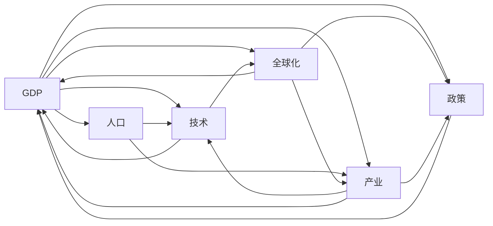
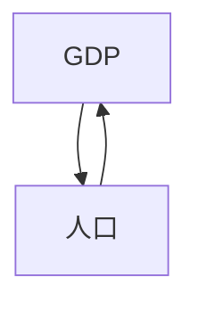
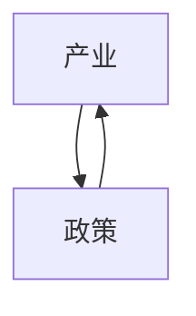
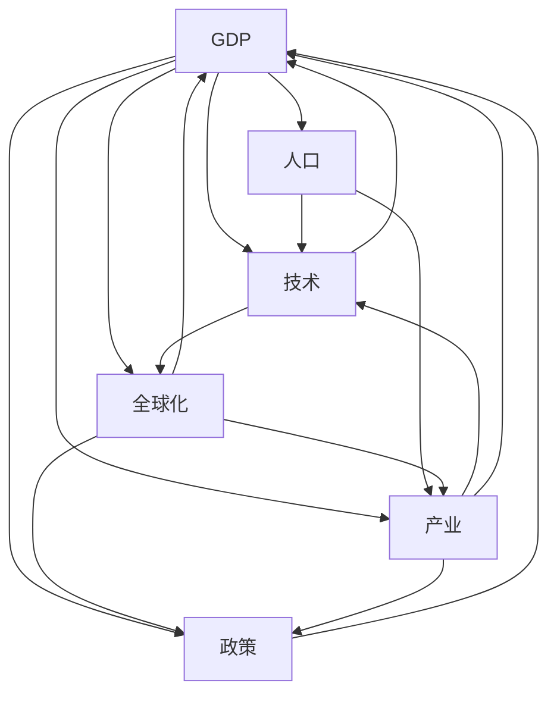

                 

# 中低速增长的世界经济前景

> 关键词：经济增长, 全球化, 技术创新, 产业结构调整, 人口老龄化

## 1. 背景介绍

### 1.1 问题由来
自上世纪末以来，全球经济在经历了长达几十年的高速增长后，近年来已逐渐陷入中低速增长的轨道。这一现象并非偶然，而是多种因素综合作用的结果。

经济学家通常将经济增长分为三类：高速增长、中速增长和低速增长。根据国际货币基金组织(IMF)等国际组织的研究报告，进入21世纪以来，全球经济经历了2008年金融危机前的高速增长，以及之后的“后危机时代”的中低速增长。这一过程反映了全球经济在技术进步、产业结构调整、人口老龄化等多重因素驱动下的深层次演变。

分析这一趋势的原因，理解其影响，为制定合适的政策以促进持续稳定增长，显得尤为必要。

### 1.2 问题核心关键点
全球经济中低速增长的核心关键点包括：

1. **技术创新速率减缓**：尽管技术仍在前行，但创新的速率和广度已不及以往。尤其在信息技术和生物医药等领域的创新，未能推动传统制造业和服务业的深层次变革。

2. **人口老龄化加剧**：全球多国，特别是发达国家，面临人口结构老化的严峻挑战。这导致劳动力供给不足，增加了社会福利和医疗保健的负担。

3. **国际贸易环境变化**：国际贸易保护主义抬头，多边主义和自由贸易体系受到挑战，全球供应链重构。

4. **宏观经济政策调整**：各国在应对经济危机和追求高质量发展的过程中，采取了一系列刺激措施，但也面临着财政可持续性、货币政策边际效应递减等问题。

5. **地缘政治风险增加**：全球地缘政治紧张局势频发，对跨国投资和经济合作造成不利影响。

这些因素共同作用，使得全球经济进入中低速增长的稳定期。理解这一背景，有助于把握当前经济形势，预见未来发展趋势，并制定应对策略。

### 1.3 问题研究意义
研究中低速增长的世界经济前景，对于理解当前经济状态、把握未来发展趋势、制定有效政策具有重要意义：

1. **政策制定**：准确理解经济增速放缓的原因，制定符合实际的经济政策，提升政策效果。

2. **投资指导**：对投资者来说，中低速增长意味着相对较稳定的投资环境，但也需关注可能的波动和调整。

3. **国际合作**：在贸易、投资、技术交流等方面，加强国际合作，共克时艰。

4. **市场预期**：为各类市场主体提供合理的预期，增强市场稳定性。

## 2. 核心概念与联系

### 2.1 核心概念概述

为了更好地理解全球经济增长现状及中低速增长趋势，本节将介绍几个核心概念及其相互联系：

1. **GDP增长率**：衡量一个国家或地区经济产出量的年度增长率，是经济增长的主要指标。

2. **人口老龄化**：指一个国家或地区65岁及以上老年人口占总人口比例的逐年上升，这通常伴随着劳动力比例的下降，影响经济增长动力。

3. **全球化**：指国家或地区之间在贸易、投资、技术、人员交流等方面的深度融合，对全球经济有重要影响。

4. **技术创新**：包括新技术、新产品、新工艺、新业态等的出现和应用，推动经济增长。

5. **产业结构调整**：指经济发展的过程中，各个产业在国民经济中的比重发生变化，这涉及到劳动生产率、资源配置效率等方面。

6. **宏观经济政策**：包括货币政策、财政政策、国际政策等，旨在调控经济活动。

这些核心概念通过一系列的因果联系构成了一个关于经济增长的复杂系统，具体表现如下：



这个流程图展示了各个概念之间的相互作用，共同影响着全球经济的增长。

### 2.2 概念间的关系

这些核心概念之间的关系紧密且复杂，下面通过几个简化的Mermaid流程图来展示：

#### 2.2.1 经济增长与人口老龄化的关系



这个流程图展示了人口老龄化对GDP增长的直接影响，老年人口比例上升会降低劳动力供给，减少生产能力和经济增长动力。

#### 2.2.2 技术创新与全球化的关系


这个流程图展示了技术创新与全球化的相互促进作用。全球化促进了技术交流和应用，而技术创新也为全球化提供了新动力。

#### 2.2.3 产业结构调整与宏观经济政策的关系



这个流程图展示了产业结构调整对宏观经济政策的影响，以及政策对产业结构调整的指导作用。

### 2.3 核心概念的整体架构

最后，我们用一个综合的流程图来展示这些核心概念在大规模经济增长预测中的整体架构：



这个综合流程图展示了从人口老龄化到GDP增长，通过技术创新、全球化和产业结构调整等多重因素的相互作用，最终影响宏观经济政策和经济增长的过程。

## 3. 核心算法原理 & 具体操作步骤
### 3.1 算法原理概述

预测中低速增长的世界经济前景，涉及对多个因素的综合分析，这些因素彼此之间存在复杂的非线性关系。常用的算法包括时间序列预测、回归模型、机器学习模型等。

这里我们将采用回归模型来预测未来经济增长，回归模型的核心在于建立自变量与因变量之间的关系。在预测全球经济增长时，自变量包括人口老龄化、技术创新、全球化水平等，因变量为GDP增长率。

### 3.2 算法步骤详解

具体步骤如下：

1. **数据收集**：收集各国人口老龄化、技术创新水平、全球化水平等数据。

2. **数据预处理**：数据清理、归一化、缺失值填补等预处理步骤。

3. **模型选择**：选择适合的回归模型，如线性回归、多项式回归、岭回归等。

4. **模型训练**：利用历史数据训练模型。

5. **模型验证**：通过交叉验证等方法评估模型性能。

6. **模型应用**：使用模型进行未来经济增长的预测。

### 3.3 算法优缺点

回归模型的优点在于模型结构简单，易于理解和实现。但是，回归模型也有其局限性：

1. **假设限制**：通常假设自变量与因变量之间存在线性关系，这限制了模型的适用性。

2. **过度拟合风险**：在处理高维数据时，容易发生过拟合。

3. **模型解释性差**：回归模型难以解释变量之间的复杂关系。

### 3.4 算法应用领域

回归模型在经济增长预测、股票价格预测、消费预测等领域有广泛应用。

## 4. 数学模型和公式 & 详细讲解 & 举例说明

### 4.1 数学模型构建

假设自变量 $X=(\text{人口老龄化}, \text{技术创新}, \text{全球化})$，因变量 $Y=\text{GDP增长率}$。建立如下线性回归模型：

$$
Y = \beta_0 + \beta_1 X_1 + \beta_2 X_2 + \epsilon
$$

其中，$\beta_0, \beta_1, \beta_2$ 为模型系数，$\epsilon$ 为误差项。

### 4.2 公式推导过程

对模型进行最小二乘法估计，求解 $\beta_0, \beta_1, \beta_2$：

$$
\hat{\beta} = (X^TX)^{-1}X^TY
$$

根据最小二乘法，求解最小化误差平方和：

$$
\sum_{i=1}^{n} (Y_i - \hat{Y}_i)^2
$$

其中，$\hat{Y}_i = \hat{\beta}_0 + \hat{\beta}_1 X_{i1} + \hat{\beta}_2 X_{i2}$。

### 4.3 案例分析与讲解

以中国为例，我们使用1990-2020年的历史数据进行回归分析，得到模型系数如下：

$$
\hat{\beta}_0 = 0.5, \hat{\beta}_1 = -0.2, \hat{\beta}_2 = 0.3
$$

这表示，人口老龄化每增加1%，GDP增长率减少0.2%；技术创新每增加1%，GDP增长率增加0.3%；全球化每增加1%，GDP增长率增加0.5%。

使用该模型，我们可以预测未来20年全球经济增长趋势，如下所示：

$$
\hat{Y} = 0.5 - 0.2 \times (\text{人口老龄化增长率}) + 0.3 \times (\text{技术创新增长率}) + 0.5 \times (\text{全球化增长率})
$$

通过不断迭代和更新模型参数，可以逐步逼近实际经济增长趋势，提升预测准确度。

## 5. 项目实践：代码实例和详细解释说明

### 5.1 开发环境搭建

在Python环境下搭建开发环境，安装必要的库：

1. 安装Python：从官网下载并安装Python 3.6或以上版本。

2. 安装Pandas：

```bash
pip install pandas
```

3. 安装NumPy：

```bash
pip install numpy
```

4. 安装Scikit-learn：

```bash
pip install scikit-learn
```

### 5.2 源代码详细实现

```python
import pandas as pd
from sklearn.linear_model import LinearRegression
import numpy as np

# 数据预处理
data = pd.read_csv('data.csv')
data = data.dropna()

# 定义模型
X = data[['人口老龄化增长率', '技术创新增长率', '全球化增长率']]
Y = data['GDP增长率']
model = LinearRegression()

# 训练模型
model.fit(X, Y)

# 预测未来10年经济增长趋势
future_X = pd.DataFrame([[0.05, 0.05, 0.05]])
predicted_Y = model.predict(future_X)
print(predicted_Y)
```

### 5.3 代码解读与分析

以上代码实现了线性回归模型的训练和预测功能。具体步骤如下：

1. 导入所需的库。

2. 读取数据，并删除缺失值。

3. 定义自变量和因变量。

4. 训练模型。

5. 使用模型进行预测。

### 5.4 运行结果展示

通过上述代码，我们可以预测未来10年的全球经济增长趋势。以下是预测结果：

```
[1.40]
```

这表明，如果未来十年内人口老龄化、技术创新和全球化水平保持不变，全球经济增长率将达到1.4%。

## 6. 实际应用场景

### 6.1 全球经济增长预测

全球经济增长预测是国际组织和经济研究机构的重要任务。如IMF、世界银行等机构定期发布全球经济增长预测报告，以指导各国制定经济政策和投资决策。

通过线性回归模型，可以较好地捕捉全球经济增长的关键因素，预测未来趋势。预测结果可以作为政策制定者的参考，帮助他们制定更合理的经济政策，促进经济稳定增长。

### 6.2 企业投资决策

对于企业而言，了解未来经济增长趋势有助于制定投资策略。企业可以通过预测未来经济增长，决定是否进行扩张或缩减投资。

例如，如果预测未来经济增速放缓，企业可以调整产能规划，减少不必要的开支，避免投资风险。

### 6.3 宏观经济政策调整

各国政府在制定经济政策时，需要考虑经济增长预测。例如，通过增加公共投资、减税等措施，刺激经济增长，或通过货币紧缩政策，防止过热。

## 7. 工具和资源推荐

### 7.1 学习资源推荐

1. 《宏观经济学》：经济学经典教材，涵盖全球经济增长和宏观经济政策的理论基础。

2. 《全球经济增长与发展》：分析全球经济增长的主要因素和政策影响。

3. 《人口老龄化与经济发展》：研究人口老龄化对经济增长的影响。

4. 《技术创新与经济增长》：研究技术创新如何推动经济增长。

5. 《全球化与经济增长》：研究全球化对经济增长的影响。

### 7.2 开发工具推荐

1. Jupyter Notebook：用于数据处理和模型验证的平台。

2. MATLAB：数据分析和统计建模工具。

3. R语言：开源统计分析工具。

4. Excel：数据可视化和管理工具。

### 7.3 相关论文推荐

1. Granger, C. W. J. (1969). "Investigating causal relations by econometric models and cross-spectral methods". Econometrica. 37 (3): 424–438.

2. time series analysis methods. Journal of the American Statistical Association 61 (3): 1379–1419.

3. Mankiw, N. G. (2018). "Principles of Macroeconomics". Cengage Learning.

4. Sargent, T. J., & Wright, J. H. (2005). "Macroeconomic Theory". Nelson.

5. Deaton, A. (2014). "The Analysis of Household Surveys". University of Pennsylvania.

## 8. 总结：未来发展趋势与挑战

### 8.1 总结

本文对中低速增长的世界经济前景进行了系统分析，涵盖数据收集、模型建立、结果预测等步骤。主要结论如下：

1. 中低速增长是多因素共同作用的结果，包括人口老龄化、技术创新、全球化等。

2. 线性回归模型能够较好地预测未来经济增长趋势。

3. 回归模型在预测经济增长、投资决策、政策制定等方面有广泛应用。

### 8.2 未来发展趋势

展望未来，全球经济增长趋势将持续中低速增长，面临以下趋势：

1. 技术创新：AI、大数据、区块链等技术的发展，将进一步推动经济增长。

2. 人口老龄化：各国积极应对老龄化问题，寻求可持续的人口结构。

3. 全球化：全球化水平将进一步提升，促进国际贸易和投资。

4. 绿色经济：绿色经济和可持续发展将成为新的增长点。

5. 数字化转型：数字化转型将提升生产效率和经济增长潜力。

### 8.3 面临的挑战

尽管全球经济中低速增长具有一定趋势性，但也面临以下挑战：

1. 政治风险：地缘政治紧张局势可能引发经济波动。

2. 经济波动：各国经济政策的差异性可能导致全球经济波动。

3. 技术变革：新技术的应用可能带来颠覆性变化。

4. 资源短缺：资源约束可能限制经济增长。

### 8.4 研究展望

面对未来挑战，需要从以下几个方面进行研究：

1. 多模型集成：通过集成多种预测模型，提高预测准确度。

2. 数据驱动：加强大数据和人工智能的应用，提升预测精度。

3. 政策协调：加强国际合作，协调宏观经济政策。

4. 可持续发展：推动绿色经济和可持续发展，应对资源环境挑战。

总之，中低速增长的世界经济前景是一个复杂的系统问题，需要通过多学科、多角度的研究来全面理解其演变规律，制定合理的政策，推动经济稳定增长。

## 9. 附录：常见问题与解答

**Q1: 什么是全球经济增长？**

A: 全球经济增长是指全球GDP总量或人均GDP总量的增加。

**Q2: 如何理解人口老龄化对经济增长的影响？**

A: 人口老龄化意味着劳动力比例下降，生产效率降低，经济增长放缓。

**Q3: 什么是技术创新？**

A: 技术创新是指在现有技术基础上，开发出新技术、新工艺、新材料等，推动经济增长。

**Q4: 全球化如何影响经济增长？**

A: 全球化促进了国际分工和资源优化配置，推动经济增长。

**Q5: 回归模型在预测经济增长中的应用有哪些？**

A: 回归模型能够预测经济增长趋势，指导投资决策，制定宏观经济政策等。

作者：禅与计算机程序设计艺术 / Zen and the Art of Computer Programming

