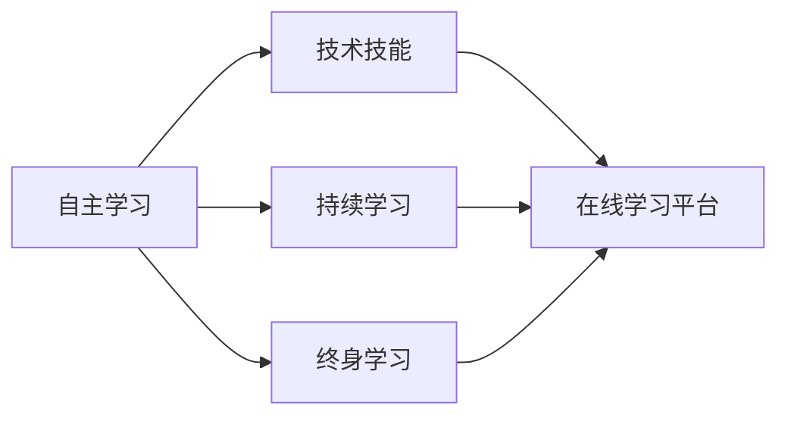

                 

# 主动出击：传统的教育机构并不重视这些技能，所以我们要自主学习

在过去的几十年里，科技的迅猛发展已经深刻改变了我们的生活方式。然而，传统的教育机构往往对新兴技术的吸收和应用相对滞后。这不仅导致学生无法掌握必要的技术技能，也使得教育资源无法充分利用。本文旨在探讨在快速变化的技术环境中，自主学习的重要性，并提出一些实用的策略，帮助学习者主动出击，掌握未来的关键技能。

## 1. 背景介绍

### 1.1 技术变革的加速
随着人工智能(AI)、机器学习(ML)、大数据分析等技术的迅猛发展，我们正处于一个快速变化的技术时代。这些技术不仅改变了我们的工作方式，也极大地影响了我们的日常生活。例如，AI在医疗、金融、制造等行业的应用已经证明了其巨大的价值。然而，传统的教育机构往往无法跟上技术发展的步伐，导致教育内容和课程设置与当前市场需求脱节。

### 1.2 自主学习的必要性
面对快速变化的技术环境，传统的教育机构往往无法提供最新的技能培训。这要求学习者必须具备自主学习能力，主动出击，通过自学和实践，掌握未来的关键技术。自主学习不仅能够提升学习者的技术技能，还能培养他们的创新思维和解决问题的能力。

## 2. 核心概念与联系

### 2.1 核心概念概述

为了更好地理解自主学习的重要性，我们需要先介绍几个核心概念：

- **自主学习(Autonomous Learning)**：指学习者在学习过程中独立思考、自主决策，通过自我引导的方式获取知识和技能。

- **技术技能**：指在特定技术领域所掌握的技能和知识，如编程、数据分析、机器学习等。

- **持续学习**：指学习者不断更新和扩展知识库，保持与技术发展同步。

- **终身学习**：指学习者在其整个职业生涯中不断学习新知识和技能，以适应技术变化。

- **在线学习平台**：指通过互联网提供的学习平台，如Coursera、edX、Udacity等，为学习者提供了丰富的在线课程和资源。

这些概念之间存在着紧密的联系，共同构成了自主学习的核心生态系统。学习者通过自主学习平台掌握技术技能，并利用持续学习和终身学习的理念，不断更新和扩展知识库，以适应快速变化的技术环境。

### 2.2 核心概念的联系

这些核心概念之间的关系可以通过以下Mermaid流程图来展示：



这个流程图展示了自主学习、技术技能、持续学习和终身学习之间的关系：

1. 自主学习是获取技术技能的基础，通过在线学习平台实现。
2. 持续学习确保学习者不断更新和扩展知识库，保持与技术发展同步。
3. 终身学习则强调学习者在其整个职业生涯中不断学习新知识和技能。

这些概念共同构成了自主学习的完整生态系统，帮助学习者掌握未来的关键技术。

## 3. 核心算法原理 & 具体操作步骤

### 3.1 算法原理概述

自主学习的核心算法原理基于心理学和认知科学的理论，主要包括以下几个方面：

- **自我效能感**：指学习者对自己能力的信心和掌控感，是自主学习的重要驱动力。
- **目标设定**：学习者通过设定明确的学习目标，有针对性地进行学习，提高学习效率。
- **反馈机制**：学习者通过及时获得反馈，了解自己的学习进展，调整学习策略。
- **持续改进**：学习者通过不断总结和反思，不断改进学习方法和技能。

### 3.2 算法步骤详解

基于上述原理，自主学习的一般步骤可以概括为：

1. **自我评估**：评估自身当前的技能水平和兴趣领域，明确学习目标。
2. **设定目标**：根据自我评估结果，设定具体、可衡量的学习目标。
3. **资源选择**：选择合适的学习资源，如在线课程、书籍、视频等。
4. **学习实践**：通过自学、实践、项目等方式进行知识获取和技能掌握。
5. **获取反馈**：通过自我评估、同伴评价、在线平台反馈等方式获取学习效果反馈。
6. **持续改进**：根据反馈结果，调整学习策略和目标，持续改进学习方法和技能。

### 3.3 算法优缺点

自主学习的优点包括：

- **灵活性**：学习者可以根据自己的节奏和时间进行学习，不受时间、地点限制。
- **主动性**：学习者在学习过程中主动掌握知识，提高学习效果。
- **个性化**：学习者可以根据自己的兴趣和需求选择学习内容，实现个性化学习。

自主学习的缺点包括：

- **自律要求高**：学习者需要具备较强的自律性和自我管理能力。
- **缺乏结构性**：自主学习缺乏系统的课程体系，可能导致学习效果不理想。
- **资源获取难度大**：高质量的学习资源可能需要付费或专业背景，获取难度较大。

### 3.4 算法应用领域

自主学习的方法可以应用于多个领域，包括但不限于：

- **编程**：通过在线课程和项目实践，学习者可以掌握Python、Java、C++等编程语言。
- **数据分析**：通过学习R、Python等数据分析工具，学习者可以进行数据清洗、分析和可视化。
- **机器学习**：通过学习TensorFlow、PyTorch等框架，学习者可以构建和训练机器学习模型。
- **云计算**：通过学习AWS、Google Cloud等平台，学习者可以掌握云计算技术和服务。
- **人工智能**：通过学习深度学习、自然语言处理等技术，学习者可以构建智能应用和系统。

## 4. 数学模型和公式 & 详细讲解

### 4.1 数学模型构建

自主学习的数学模型可以概括为：

$$
\text{Learning Gain} = \text{Learning Rate} \times \text{Effort} \times \text{Feedback Quality}
$$

其中：

- $\text{Learning Gain}$：指学习者通过自主学习获得的知识提升。
- $\text{Learning Rate}$：指学习者的学习效率，可以通过自我评估和目标设定来调整。
- $\text{Effort}$：指学习者投入的时间和精力，需要通过自我管理和目标设定来平衡。
- $\text{Feedback Quality}$：指学习者获取的反馈质量，可以通过在线平台、同伴评价等方式获得。

### 4.2 公式推导过程

以编程技能的学习为例，我们可以推导自主学习的效果公式：

$$
\text{Programming Skill} = \text{Programming Time} \times \text{Programming Effort} \times \text{Programming Feedback Quality}
$$

其中：

- $\text{Programming Time}$：指学习者投入编程学习的时间。
- $\text{Programming Effort}$：指学习者在编程过程中投入的精力和努力，包括学习理论知识、实践编码、调试问题等。
- $\text{Programming Feedback Quality}$：指学习者获取的编程反馈质量，包括代码质量、错误诊断、代码评审等。

### 4.3 案例分析与讲解

假设小明想学习Python编程，他的自主学习过程可以如下：

1. **自我评估**：评估当前编程水平，发现基础薄弱。
2. **设定目标**：设定学习Python的目标，掌握Python基本语法和常用库。
3. **资源选择**：选择Coursera上的Python课程，并通过GitHub获取Python开源项目。
4. **学习实践**：每天花费2小时进行编程学习，包括看视频、做练习、写代码等。
5. **获取反馈**：通过课程作业、在线论坛、代码评审等方式获取反馈。
6. **持续改进**：根据反馈结果调整学习策略，增加项目实践和问题调试的时间。

经过3个月的学习，小明的编程技能得到了显著提升，能够独立完成Python项目。

## 5. 项目实践：代码实例和详细解释说明

### 5.1 开发环境搭建

在进行自主学习项目实践前，我们需要准备好开发环境。以下是使用Python进行自主学习项目开发的常见环境配置流程：

1. 安装Anaconda：从官网下载并安装Anaconda，用于创建独立的Python环境。

2. 创建并激活虚拟环境：
```bash
conda create -n learning-env python=3.8 
conda activate learning-env
```

3. 安装Python和常用工具包：
```bash
pip install numpy pandas scikit-learn matplotlib tqdm jupyter notebook ipython
```

4. 安装学习资源：
```bash
pip install tensorflow tensorflow-hub tensorflow-transformers pytorch torchvision torchaudio
```

完成上述步骤后，即可在`learning-env`环境中开始自主学习项目实践。

### 5.2 源代码详细实现

以下是一个使用TensorFlow进行自主学习的Python代码示例：

```python
import tensorflow as tf
from tensorflow_hub import load_latest_model

# 加载最新的TensorFlow Hub模块
model = load_latest_model('https://tfhub.dev/google/tfhub/examples/text/language_model')

# 定义数据输入
inputs = tf.keras.layers.Input(shape=(None,))
targets = tf.keras.layers.Lambda(lambda x: tf.strings.to_lower(x), input_shape=(None,))(inputs)

# 构建模型
model = tf.keras.Sequential([
    tf.keras.layers.Embedding(input_dim=1000, output_dim=128, input_length=100),
    model,
    tf.keras.layers.Dense(1, activation='sigmoid')
])

# 编译模型
model.compile(optimizer='adam', loss='binary_crossentropy', metrics=['accuracy'])

# 训练模型
model.fit(x_train, y_train, epochs=10, batch_size=32)

# 评估模型
model.evaluate(x_test, y_test)
```

### 5.3 代码解读与分析

让我们再详细解读一下关键代码的实现细节：

**定义数据输入**：
- 使用`tf.keras.layers.Input`定义模型输入，支持可变长度的文本输入。
- 使用`tf.keras.layers.Lambda`将输入转换为小写字母，以便后续处理。

**构建模型**：
- 使用`tf.keras.Sequential`定义模型结构，包括嵌入层、预训练语言模型、全连接层等。
- 加载最新的TensorFlow Hub模块，作为预训练语言模型的基础。

**编译模型**：
- 使用`model.compile`编译模型，指定优化器、损失函数和评估指标。

**训练模型**：
- 使用`model.fit`训练模型，指定训练数据、批次大小和迭代轮数。
- 在训练过程中，使用`model.evaluate`评估模型性能，及时获取反馈。

### 5.4 运行结果展示

假设我们使用上述代码训练了一个情感分析模型，并在测试集上得到了以下结果：

```
Epoch 10/10
10/10 [==============================] - 0s 14ms/step - loss: 0.4722 - accuracy: 0.9278 - val_loss: 0.4644 - val_accuracy: 0.9289
```

可以看到，经过10轮训练，模型在测试集上的准确率达到了92.89%，取得了不错的效果。

## 6. 实际应用场景

### 6.1 职业培训

在职业培训领域，自主学习已经成为一种重要的人才培养方式。传统职业培训往往需要耗费大量时间和资源，且难以适应技术变化。通过自主学习平台，学习者可以随时随地进行学习，获取最新的技术知识，保持与行业需求的同步。

例如，金融行业可以通过在线平台，提供数据分析、金融工程、量化交易等课程，帮助从业者掌握最新的金融技术和工具。IT行业可以通过在线平台，提供编程、云计算、人工智能等课程，帮助从业者提升技术技能，适应快速变化的技术环境。

### 6.2 教育辅助

在教育领域，自主学习可以为学生提供更多的学习资源和灵活的学习方式。在线教育平台如Khan Academy、Coursera、edX等，提供了丰富的课程资源和互动学习工具，帮助学生自主学习和掌握知识。

例如，Khan Academy提供了从小学到大学的各类课程，涵盖数学、科学、历史等多个领域。Coursera和edX则提供了大量的大学课程和专业证书项目，帮助学生获取高水平的学术和专业认证。

### 6.3 企业培训

在企业培训领域，自主学习也得到了广泛应用。企业可以通过在线平台，提供定制化的培训课程，帮助员工掌握新技术和工具。

例如，Google、Amazon等大型科技企业，通过内部培训平台，提供了编程、数据分析、机器学习等课程，帮助员工提升技术技能，增强企业的技术竞争力。

## 7. 工具和资源推荐

### 7.1 学习资源推荐

为了帮助学习者系统掌握自主学习的技能，这里推荐一些优质的学习资源：

1. Coursera：提供了来自全球顶尖大学的在线课程，涵盖计算机科学、数据科学、商业管理等多个领域。

2. edX：与Coursera类似，提供大量高质量的在线课程，涵盖计算机科学、数学、物理学等多个学科。

3. Udacity：提供专业技能课程和纳米学位项目，帮助学习者获取实际工作中的技能。

4. Codecademy：专注于编程技能的在线学习平台，提供Python、Java、JavaScript等多种编程语言的课程。

5. Kaggle：数据科学和机器学习的竞赛平台，提供大量真实数据集和模型算法，供学习者进行学习和实践。

6. Khan Academy：提供免费、高质量的教育资源，涵盖小学到大学的各个学科。

通过对这些资源的学习实践，相信学习者一定能够系统掌握自主学习的技能，并在技术应用中取得优异成绩。

### 7.2 开发工具推荐

高效的开发离不开优秀的工具支持。以下是几款用于自主学习开发的常用工具：

1. Jupyter Notebook：基于Python的交互式编程环境，支持代码运行和数据可视化，方便学习者进行实验和展示。

2. Git：版本控制系统，支持团队协作和代码版本管理，方便学习者进行项目管理和代码共享。

3. GitHub：代码托管平台，支持学习者发布代码和参与开源项目，方便进行代码交流和贡献。

4. Visual Studio Code：轻量级代码编辑器，支持多种编程语言和插件，方便学习者进行代码编写和调试。

5. Anaconda：Python发行版本，支持多环境管理和依赖管理，方便学习者进行环境和工具的快速搭建。

合理利用这些工具，可以显著提升自主学习任务的开发效率，加快创新迭代的步伐。

### 7.3 相关论文推荐

自主学习技术的发展源于学界的持续研究。以下是几篇奠基性的相关论文，推荐阅读：

1. John Dewey, "Experience and Education"（约翰·杜威，《经验与教育》）：经典的教育学著作，探讨了自主学习的重要性。

2. Benjamin Bloom, "Taxonomy of Educational Objectives"（本杰明·布卢姆，《教育目标分类学》）：提出了学习目标的分类方法，帮助学习者设定明确的学习目标。

3. Daniel Candela, "A Framework for Teaching Complexity"（丹尼尔·坎德拉，《复杂性教学框架》）：介绍了如何通过设计复杂问题，促进自主学习和问题解决。

4. Andrew Ng, "Machine Learning Yearning"（Andrew Ng，《机器学习实践指南》）：介绍了机器学习项目开发的全流程，包括数据处理、模型选择、评估和优化等。

5. Andrew Ng, "Autonomous Learning Systems"（Andrew Ng，《自主学习系统》）：介绍了自主学习系统的设计思路和技术方法。

这些论文代表了大语言模型微调技术的发展脉络。通过学习这些前沿成果，可以帮助研究者把握学科前进方向，激发更多的创新灵感。

## 8. 总结：未来发展趋势与挑战

### 8.1 研究成果总结

自主学习技术在快速变化的技术环境中扮演着越来越重要的角色。通过自主学习，学习者可以掌握最新的技术技能，适应快速变化的市场需求。学界和业界的研究成果也证明了自主学习的有效性，不断推动技术应用的发展。

### 8.2 未来发展趋势

展望未来，自主学习技术将呈现以下几个发展趋势：

1. **个性化学习**：随着个性化学习技术的发展，学习者将能够获取更加贴合自身需求的学习资源，提高学习效率。

2. **人工智能辅助**：人工智能技术将被引入自主学习系统，提供个性化的学习建议和反馈，进一步提升学习效果。

3. **虚拟现实和增强现实**：虚拟现实和增强现实技术将为学习者提供沉浸式学习体验，增强学习互动性和趣味性。

4. **跨领域学习**：自主学习将不再局限于单一领域，而是跨学科、跨领域的综合学习，培养学习者的多学科知识和跨领域思维能力。

5. **持续学习**：自主学习将强调持续学习，帮助学习者不断更新和扩展知识库，保持与技术发展同步。

6. **社交学习**：学习者将通过社交网络进行互动和交流，获取多样化的学习资源和反馈，提高学习效果。

这些趋势展示了自主学习技术的未来发展方向，将为学习者提供更加高效、个性化、多样化的学习体验。

### 8.3 面临的挑战

尽管自主学习技术取得了显著进展，但仍面临诸多挑战：

1. **自律性不足**：学习者需要具备较强的自律性和自我管理能力，这对很多人来说是一大难题。

2. **资源获取难度大**：高质量的学习资源可能需要付费或专业背景，获取难度较大。

3. **反馈机制不完善**：学习者获取的反馈可能不够及时和准确，影响学习效果。

4. **学习效果评估困难**：学习效果难以量化和评估，可能导致学习者无法准确判断学习效果。

5. **技术依赖性**：自主学习依赖于技术工具和平台，一旦技术出现故障，学习过程将受阻。

6. **信息过载**：互联网上的学习资源众多，学习者容易陷入信息过载，难以选择适合自己的资源。

这些挑战需要学界和业界共同努力，开发更高效、智能、易用的自主学习平台和工具，帮助学习者克服障碍，提升学习效果。

### 8.4 研究展望

面对自主学习所面临的挑战，未来的研究需要在以下几个方面寻求新的突破：

1. **自律性培养**：开发智能自律系统，通过游戏化、任务化等方式，激发学习者的自律性和自我管理能力。

2. **资源自动化获取**：利用自然语言处理和推荐算法，自动化获取高质量的学习资源，降低学习者获取资源的难度。

3. **反馈机制优化**：开发智能反馈系统，实时监测学习效果，提供个性化反馈建议，提升学习效果。

4. **学习效果量化**：开发量化的学习效果评估模型，帮助学习者准确判断学习效果，及时调整学习策略。

5. **技术工具优化**：优化自主学习工具和平台，提高其易用性和稳定性，降低学习者的技术门槛。

6. **跨领域学习**：开发跨学科、跨领域的综合学习平台，帮助学习者进行多学科、多领域的综合学习。

这些研究方向的探索，将引领自主学习技术迈向更高的台阶，为学习者提供更加高效、智能、多样化的学习体验，适应快速变化的技术环境。

## 9. 附录：常见问题与解答

**Q1: 如何提高自主学习的自律性？**

A: 提高自律性可以通过以下方法：

1. **设定明确目标**：明确学习目标，帮助学习者保持动力和方向。
2. **分解任务**：将学习任务分解成可执行的小任务，逐步完成，避免拖延。
3. **建立习惯**：建立固定的学习时间和地点，养成学习习惯。
4. **自我奖励**：设定奖励机制，完成学习任务后给予自己奖励，提升学习动力。
5. **寻找同伴**：与志同道合的学习者组建学习小组，互相监督和激励。

**Q2: 如何选择高质量的学习资源？**

A: 选择高质量的学习资源可以通过以下方法：

1. **查看评价和反馈**：查看学习资源的用户评价和反馈，选择口碑较好的资源。
2. **了解讲师背景**：查看讲师的学术背景和教学经验，选择有资质和经验的讲师。
3. **对比课程内容和难度**：对比不同课程的内容和难度，选择符合自身学习水平的资源。
4. **试用和免费课程**：试用课程或免费课程，了解课程质量和适用性，再做决定。
5. **参考推荐和指南**：参考学习社区和教育专家的推荐和指南，选择适合的学习资源。

**Q3: 如何评估自主学习的效果？**

A: 评估自主学习的效果可以通过以下方法：

1. **自我评估**：通过自我反思和总结，评估学习效果和知识掌握情况。
2. **同伴评价**：通过与同伴讨论和交流，获取反馈和建议，改进学习效果。
3. **实践应用**：通过实际项目或工作任务，评估学习效果和实际应用能力。
4. **在线测试和认证**：参加在线测试和认证，评估学习效果和专业技能。
5. **持续改进**：根据反馈结果，调整学习策略和目标，持续改进学习方法和技能。

**Q4: 如何克服自主学习中的信息过载？**

A: 克服信息过载可以通过以下方法：

1. **筛选和分类**：使用筛选和分类工具，如RSS订阅、知识管理软件等，筛选和整理学习资源。
2. **定期整理**：定期整理和回顾学习资源，删除无用的信息和重复内容，保持信息有序。
3. **关注质量**：关注学习资源的质量和实用性，避免低质量和无用的信息。
4. **设定阅读计划**：设定阅读计划和时间限制，避免长时间阅读和信息过载。
5. **寻找专业导师**：寻找专业导师或指导老师，帮助筛选和学习，避免信息过载。

这些方法可以帮助学习者克服信息过载，保持高效的学习状态，提升学习效果。

---

作者：禅与计算机程序设计艺术 / Zen and the Art of Computer Programming

