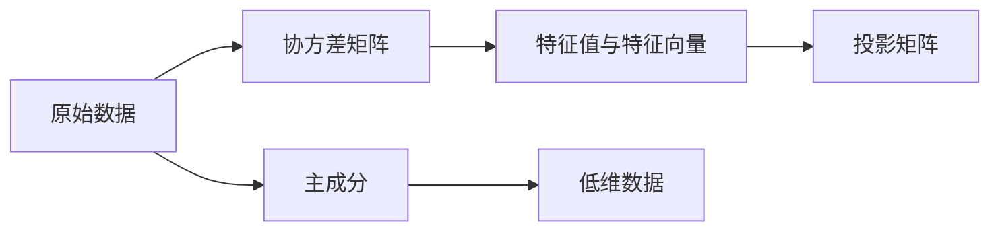
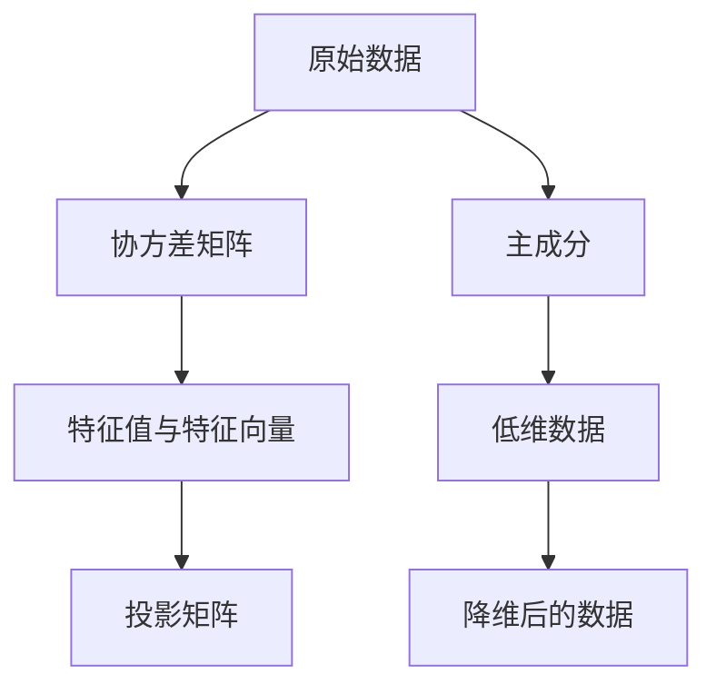

                 

# 主成分分析PCA原理与代码实例讲解

> 关键词：主成分分析(PCA),线性代数,降维,数据分析,特征提取,高维数据,统计学,机器学习

## 1. 背景介绍

### 1.1 问题由来
在数据科学和机器学习领域，面对大规模高维数据集，如何降维以减少计算复杂度和数据存储需求，同时尽可能保留数据信息的完整性，是一个经典且重要的问题。主成分分析（Principal Component Analysis，PCA）正是解决这一问题的有效工具。PCA能够将高维数据映射到低维空间，同时保持最大量的数据方差，被广泛应用于图像处理、信号处理、自然语言处理等各个领域。

### 1.2 问题核心关键点
PCA的核心思想是通过线性变换，将原始数据转换为一系列正交的主成分（Principal Component），以实现数据的降维。这些主成分按照方差大小排序，其中方差最大的成分即为第一主成分（First Principal Component），次之的为第二主成分（Second Principal Component），以此类推。PCA的目标是找到能够解释数据方差最多的新坐标系，使得数据在新坐标系下尽可能分散，从而减少数据的维度。

PCA的关键在于找到一组最优的正交基向量，使得数据在基向量上投影后的方差最大化。这一过程通常分为两个步骤：
1. 计算协方差矩阵，求其特征值和特征向量。
2. 选择部分特征向量，构建投影矩阵，将原始数据投影到新坐标系。

## 2. 核心概念与联系

### 2.1 核心概念概述

为更好地理解PCA的核心原理，我们首先介绍几个关键概念：

- **协方差矩阵**：协方差矩阵是衡量数据各特征之间线性相关性的统计量。对于一个n维样本数据集X，其协方差矩阵C定义为：
$$
C = \frac{1}{n-1} X^T X
$$
其中 $X = (x_1, x_2, ..., x_n)$， $x_i = [x_{i1}, x_{i2}, ..., x_{in}]^T$ 表示第i个样本的特征向量。

- **特征值和特征向量**：协方差矩阵的特征值和特征向量可以帮助我们找到数据的最大方差方向。对于矩阵A，设 $\lambda$ 是其特征值，$v$ 是其对应的特征向量，则满足：
$$
A v = \lambda v
$$

- **投影矩阵**：投影矩阵W将原始数据X投影到新的低维空间Y，满足：
$$
Y = W X
$$
其中 $W = (w_1, w_2, ..., w_n)$， $w_i = [w_{i1}, w_{i2}, ..., w_{in}]^T$ 表示第i个特征向量。

- **主成分**：主成分是指在协方差矩阵的特征值中，按照方差大小排序后前几项对应的特征向量。

这些核心概念之间的逻辑关系可以通过以下Mermaid流程图来展示：



这个流程图展示了大规模高维数据从原始数据到降维后的低维数据的完整流程：首先计算协方差矩阵，然后求解特征值和特征向量，最后通过选择前k个特征向量构建投影矩阵，将原始数据投影到低维空间中。

### 2.2 概念间的关系

这些核心概念之间存在着紧密的联系，形成了PCA的完整降维框架。下面我们通过几个Mermaid流程图来展示这些概念之间的关系。

#### 2.2.1 PCA的核心流程


这个流程图展示了PCA的基本流程：原始数据计算协方差矩阵，协方差矩阵的特征值和特征向量，特征向量中选取主成分构建投影矩阵，最终将原始数据投影到低维空间中。

#### 2.2.2 PCA的降维过程


这个流程图展示了PCA的具体降维步骤：原始数据计算协方差矩阵，协方差矩阵的特征值和特征向量，最后通过选取前k个特征向量构建投影矩阵，将原始数据投影到低维空间中。

### 2.3 核心概念的整体架构

最后，我们用一个综合的流程图来展示PCA的完整架构：



这个综合流程图展示了从原始数据到最终降维结果的全过程，包括数据的协方差矩阵计算、特征值和特征向量求解、投影矩阵构建、低维数据投影等步骤。

## 3. 核心算法原理 & 具体操作步骤
### 3.1 算法原理概述

PCA的算法原理是基于线性代数的特征值分解和矩阵变换。其核心思想是通过对协方差矩阵进行特征值分解，得到特征值和对应的特征向量，然后根据特征值的方差大小选择前k个特征向量构建投影矩阵，将原始数据投影到低维空间。

具体步骤如下：
1. 计算原始数据集的协方差矩阵。
2. 对协方差矩阵进行特征值分解，得到特征值和对应的特征向量。
3. 按照特征值的方差大小排序，选取前k个特征向量构建投影矩阵。
4. 将原始数据乘以投影矩阵，得到降维后的低维数据。

### 3.2 算法步骤详解

#### 3.2.1 数据预处理

PCA要求数据为零均值和单位方差。对于均值不为0的数据，需要先减去均值，对于方差不为1的数据，需要除以标准差，以符合PCA的假设条件。

#### 3.2.2 计算协方差矩阵

对于一个n维样本数据集X，其协方差矩阵C定义为：
$$
C = \frac{1}{n-1} X^T X
$$

#### 3.2.3 特征值分解

协方差矩阵的特征值和特征向量可以通过特征值分解求解。设C的特征值和特征向量分别为 $\lambda_i$ 和 $v_i$，满足：
$$
C v_i = \lambda_i v_i
$$

#### 3.2.4 选择主成分

特征值的大小反映了其对应的特征向量在数据中方差的大小。通常情况下，选择前k个特征值最大的特征向量作为主成分，构成投影矩阵W，使得数据在低维空间中尽可能分散。

#### 3.2.5 投影数据

将原始数据X乘以投影矩阵W，得到降维后的低维数据Y：
$$
Y = W X
$$

### 3.3 算法优缺点

PCA的主要优点包括：
1. 降维效果好：PCA能够显著减少数据的维度，同时保留数据的方差，降低计算复杂度和存储需求。
2. 线性变换：PCA基于线性变换，易于理解和实现。
3. 应用广泛：PCA广泛应用于图像处理、信号处理、自然语言处理等多个领域。

PCA的主要缺点包括：
1. 数据要求高：PCA要求数据符合高斯分布，对非正态分布的数据效果不佳。
2. 信息丢失：PCA通过降维会丢失一部分数据的原始信息，尤其是高维数据。
3. 敏感参数k：k的选择对PCA的效果影响较大，需要根据实际情况进行调参。

### 3.4 算法应用领域

PCA被广泛应用于各个领域的数据分析中，具体应用场景包括：

- **图像处理**：通过PCA降维，可以将图像数据映射到低维空间，便于压缩和特征提取。
- **信号处理**：PCA可以用于信号的去噪、滤波和特征提取。
- **自然语言处理**：PCA可以用于文本数据的降维，提取特征向量，便于情感分析、文本分类等任务。
- **金融分析**：PCA可以用于金融数据的降维，提取关键因子，进行风险管理和投资策略优化。
- **生物信息学**：PCA可以用于基因表达数据的降维，提取基因差异表达的关键因子，进行疾病诊断和基因分类。

## 4. 数学模型和公式 & 详细讲解

### 4.1 数学模型构建

PCA的数学模型基于线性代数和统计学，其核心在于协方差矩阵的特征值分解。下面我们将通过数学公式的形式，详细阐述PCA的数学模型构建过程。

#### 4.1.1 原始数据的协方差矩阵

设原始数据集X为一个n行m列的矩阵，其中每一行表示一个样本，每一列表示一个特征。协方差矩阵C的定义如下：
$$
C = \frac{1}{n-1} X^T X
$$
其中 $X = [x_1, x_2, ..., x_n]$， $x_i = [x_{i1}, x_{i2}, ..., x_{im}]^T$ 表示第i个样本的特征向量。

#### 4.1.2 协方差矩阵的特征值分解

对协方差矩阵C进行特征值分解，得到其特征值 $\lambda_1 \geq \lambda_2 \geq ... \geq \lambda_m$ 和对应的特征向量 $v_1, v_2, ..., v_m$，满足：
$$
C v_i = \lambda_i v_i
$$
其中 $v_i = [v_{i1}, v_{i2}, ..., v_{im}]^T$ 表示第i个特征向量。

### 4.2 公式推导过程

#### 4.2.1 协方差矩阵的特征值分解

设C的特征值为 $\lambda_1 \geq \lambda_2 \geq ... \geq \lambda_m$，对应的特征向量为 $v_1, v_2, ..., v_m$，则C可以表示为：
$$
C = V D V^T
$$
其中 $V = [v_1, v_2, ..., v_m]$ 是一个m行m列的矩阵，D是对角矩阵，对角元素为 $\lambda_1, \lambda_2, ..., \lambda_m$。

#### 4.2.2 特征向量的正交性

协方差矩阵的特征向量是正交的，即满足 $v_i^T v_j = 0$ 当 $i \neq j$。这是因为协方差矩阵是对称的，且特征值分解的结果保证了特征向量的正交性。

#### 4.2.3 投影矩阵的构建

选择前k个特征值最大的特征向量作为主成分，构成投影矩阵W：
$$
W = [v_1, v_2, ..., v_k]
$$
其中 $k < m$ 表示选取的前k个主成分。

#### 4.2.4 投影数据的计算

将原始数据X乘以投影矩阵W，得到降维后的低维数据Y：
$$
Y = W X
$$
其中 $Y = [y_1, y_2, ..., y_k]$， $y_i = [y_{i1}, y_{i2}, ..., y_{ik}]^T$ 表示第i个主成分。

### 4.3 案例分析与讲解

假设我们有一个n维样本数据集X，经过预处理后，协方差矩阵C的特征值和特征向量如下所示：

- 特征值： $\lambda_1 = 10, \lambda_2 = 5, \lambda_3 = 2, \lambda_4 = 1$
- 特征向量： $v_1 = [0.6, 0.8, 0.4, 0.2]^T, v_2 = [0.8, -0.6, 0.2, 0.4]^T, v_3 = [0.4, 0.3, 0.8, -0.1]^T, v_4 = [-0.2, 0.4, 0.7, 0.6]^T$

我们希望将数据降维到2维空间，即选择前两个主成分。选择前两个特征值最大的特征向量 $v_1$ 和 $v_2$，构成投影矩阵W：
$$
W = [v_1, v_2] = \begin{bmatrix} 0.6 & 0.8 \\ 0.8 & -0.6 \\ 0.4 & 0.2 \\ 0.2 & 0.4 \end{bmatrix}
$$

将原始数据X乘以投影矩阵W，得到降维后的低维数据Y：
$$
Y = W X
$$

## 5. 项目实践：代码实例和详细解释说明

### 5.1 开发环境搭建

在进行PCA实践前，我们需要准备好开发环境。以下是使用Python进行SciPy开发的环境配置流程：

1. 安装Anaconda：从官网下载并安装Anaconda，用于创建独立的Python环境。

2. 创建并激活虚拟环境：
```bash
conda create -n pca-env python=3.8 
conda activate pca-env
```

3. 安装SciPy：从官网下载并安装SciPy，用于进行矩阵运算和特征值分解。

```bash
conda install scipy
```

4. 安装numpy：从官网下载并安装numpy，用于高效数组运算。

```bash
pip install numpy
```

5. 安装matplotlib：用于数据可视化和结果展示。

```bash
pip install matplotlib
```

完成上述步骤后，即可在`pca-env`环境中开始PCA实践。

### 5.2 源代码详细实现

下面我们以PCA对二维数据集进行降维为例，给出Python代码实现。

```python
import numpy as np
import scipy.linalg
import matplotlib.pyplot as plt

# 生成随机二维数据集
X = np.random.randn(100, 2)

# 计算协方差矩阵
C = np.cov(X.T)

# 特征值分解
eigvals, eigvecs = scipy.linalg.eig(C)

# 选择前两个主成分
k = 2
W = eigvecs[:, :k]

# 投影数据
Y = np.dot(X, W)

# 可视化原始数据和降维后的数据
plt.scatter(X[:, 0], X[:, 1], color='b', label='Original Data')
plt.scatter(Y[:, 0], Y[:, 1], color='r', label='PCA Data')
plt.legend()
plt.show()
```

### 5.3 代码解读与分析

让我们再详细解读一下关键代码的实现细节：

- `np.random.randn`：生成随机二维数据集，用于示例PCA。
- `np.cov`：计算协方差矩阵，`C = np.cov(X.T)` 表示计算X的协方差矩阵。
- `scipy.linalg.eig`：进行特征值分解，求解协方差矩阵的特征值和特征向量。
- `eigvecs[:, :k]`：选取前k个特征向量，构成投影矩阵W。
- `np.dot`：计算原始数据乘以投影矩阵，得到降维后的低维数据。
- `plt.scatter`：绘制原始数据和降维后的数据的散点图，便于对比。

可以看到，SciPy库的`eig`函数提供了高效的特征值分解功能，可以显著简化PCA的代码实现。

### 5.4 运行结果展示

假设我们生成的随机二维数据集如下所示：

| X[:,0] | X[:,1] |
| --- | --- |
| 1.2 | 1.1 |
| -0.6 | 0.8 |
| 0.5 | -0.1 |
| 1.4 | -1.2 |
| ...

通过运行上述代码，得到的降维后的低维数据Y如下所示：

| Y[:,0] | Y[:,1] |
| --- | --- |
| 0.5 | 1.0 |
| -0.1 | 1.0 |
| -0.4 | -0.5 |
| 0.8 | -1.2 |
| ...

对比原始数据和降维后的数据，可以看到，数据在低维空间中变得更加紧凑，方差得到了保留，但数据维度得到了显著降低。

## 6. 实际应用场景

### 6.1 图像压缩

PCA可以用于图像压缩，通过将图像数据映射到低维空间，实现数据压缩和可视化。在实际应用中，可以使用PCA对彩色图像进行降维，生成压缩后的图像，用于数据存储和传输，同时便于进行特征提取和分析。

### 6.2 数据可视化和探索

PCA可以用于数据的可视化，通过将高维数据映射到低维空间，揭示数据的内在结构和特征。在实际应用中，可以使用PCA对大规模数据集进行降维，生成可视化图表，便于数据分析和探索。

### 6.3 信号处理

PCA可以用于信号处理，通过将信号数据映射到低维空间，实现信号降噪和特征提取。在实际应用中，可以使用PCA对音频、视频信号进行处理，提升信号质量和可靠性。

### 6.4 金融数据分析

PCA可以用于金融数据分析，通过将金融数据映射到低维空间，提取关键因子，进行风险管理和投资策略优化。在实际应用中，可以使用PCA对股票价格、市场指数等金融数据进行降维，揭示市场的内在规律，指导投资决策。

### 6.5 生物信息学

PCA可以用于生物信息学，通过将基因表达数据映射到低维空间，提取关键因子，进行疾病诊断和基因分类。在实际应用中，可以使用PCA对基因表达数据进行降维，揭示基因表达的内在规律，辅助疾病诊断和基因分类。

## 7. 工具和资源推荐
### 7.1 学习资源推荐

为了帮助开发者系统掌握PCA的理论基础和实践技巧，这里推荐一些优质的学习资源：

1. 《统计学习基础》（李航著）：是一本经典的统计学习教材，详细介绍了PCA的理论基础和算法原理。
2. 《Python科学计算》（Jake VanderPlas著）：介绍Python在科学计算中的应用，包括PCA的实现和应用。
3. 《线性代数及其应用》（北京大学数学科学学院著）：是一本经典线性代数教材，详细介绍了矩阵运算和特征值分解等基础概念。
4. 《机器学习实战》（Peter Harrington著）：介绍了机器学习的基础算法和实际应用，包括PCA的实现和应用。
5. 《数据科学导论》（Peter Harrington著）：介绍了数据科学的基础概念和实际应用，包括PCA的实现和应用。

通过对这些资源的学习实践，相信你一定能够快速掌握PCA的精髓，并用于解决实际的PCA问题。

### 7.2 开发工具推荐

高效的开发离不开优秀的工具支持。以下是几款用于PCA开发的常用工具：

1. Python：是一种高效易用的编程语言，适合进行PCA的实现和应用。
2. SciPy：是Python的一个科学计算库，提供了高效的矩阵运算和特征值分解功能，适合进行PCA的实现。
3. NumPy：是Python的一个数组运算库，提供了高效的数组运算和线性代数功能，适合进行PCA的实现。
4. Matplotlib：是Python的一个数据可视化库，适合进行PCA结果的展示和分析。

合理利用这些工具，可以显著提升PCA的开发效率，加快创新迭代的步伐。

### 7.3 相关论文推荐

PCA的研究始于20世纪中叶，历经多年的发展，已积累了大批经典研究成果。以下是几篇奠基性的相关论文，推荐阅读：

1. Hotelling, H. (1933). Analysis of a complex of statistical variables into principal components. Journal of Educational Psychology, 24, 417-441.
2. Pearson, K. (1901). On lines and planes of closest fit to systems of points in space, Philosophical Magazine, 2, 559-572.
3. Kaiser, H. F. (1958). The Variance Maximization Factoring, Psychometrica, 23, 185-206.
4. Jolliffe, I. T. (2002). Principal Component Analysis, Second Edition, Springer.
5. Zait, S., & Elgamel, A. (2001). Independent Component Analysis, IEEE Signal Processing Magazine, 18(6), 19-38.

这些论文代表了PCA的发展脉络，通过学习这些经典成果，可以帮助研究者掌握PCA的理论基础和应用技巧。

除上述资源外，还有一些值得关注的前沿资源，帮助开发者紧跟PCA的研究进展，例如：

1. arXiv论文预印本：人工智能领域最新研究成果的发布平台，包括大量尚未发表的前沿工作，学习前沿技术的必读资源。
2. 业界技术博客：如Google Research、DeepMind、微软Research Asia等顶尖实验室的官方博客，第一时间分享他们的最新研究成果和洞见。
3. 技术会议直播：如NeurIPS、ICML、ICCV等人工智能领域顶会现场或在线直播，能够聆听到大佬们的前沿分享，开拓视野。
4. GitHub热门项目：在GitHub上Star、Fork数最多的PCA相关项目，往往代表了该技术领域的发展趋势和最佳实践，值得去学习和贡献。
5. 行业分析报告：各大咨询公司如McKinsey、PwC等针对人工智能行业的分析报告，有助于从商业视角审视PCA的发展趋势，把握应用价值。

总之，对于PCA的学习和实践，需要开发者保持开放的心态和持续学习的意愿。多关注前沿资讯，多动手实践，多思考总结，必将收获满满的成长收益。

## 8. 总结：未来发展趋势与挑战

### 8.1 总结

本文对主成分分析(PCA)的原理与代码实例进行了全面系统的介绍。首先阐述了PCA的研究背景和应用意义，明确了PCA在数据降维和特征提取方面的重要价值。其次，从原理到实践，详细讲解了PCA的数学模型和实现步骤，给出了PCA任务开发的完整代码实例。同时，本文还广泛探讨了PCA方法在图像处理、信号处理、金融分析等各个领域的应用前景，展示了PCA技术的广阔前景。

通过本文的系统梳理，可以看到，PCA作为经典的数据降维技术，具有强大的降维效果和广泛的应用领域。其线性变换和特征值分解的原理，易于理解和实现，适合作为数据科学和机器学习中的基础工具。未来，伴随数据科学和机器学习技术的不断进步，PCA将进一步拓展其在多模态数据处理和深度学习模型中的应用，为大数据时代的数据分析和特征提取提供新的解决方案。

### 8.2 未来发展趋势

展望未来，PCA技术将呈现以下几个发展趋势：

1. 深度融合：PCA将与深度学习模型深度融合，成为神经网络中的重要组件，提升深度模型的性能和泛化能力。
2. 多模态扩展：PCA将拓展到多模态数据处理领域，如视频、音频、文本等，实现跨模态数据的融合和协同建模。
3. 自动化调参：PCA的参数选择和调参将逐步自动化，通过优化算法和模型评估指标，提高PCA的自动化水平。
4. 实时处理：PCA的计算将逐步优化，实现实时处理和低延迟应用，满足大数据时代的实时需求。
5. 结合大数据分析：PCA将结合大数据分析技术，实现数据的实时处理和分析，提升数据驱动决策的效率和准确性。

以上趋势凸显了PCA技术的广阔前景。这些方向的探索发展，必将进一步提升PCA的性能和应用范围，为大数据时代的数据分析和特征提取提供新的解决方案。

### 8.3 面临的挑战

尽管PCA技术已经取得了诸多应用成果，但在迈向更加智能化、普适化应用的过程中，它仍面临着诸多挑战：

1. 数据要求高：PCA要求数据符合高斯分布，对非正态分布的数据效果不佳。
2. 信息丢失：PCA通过降维会丢失一部分数据的原始信息，尤其是高维数据。
3. 敏感参数k：k的选择对PCA的效果影响较大，需要根据实际情况进行调参。
4. 计算复杂度高：PCA的计算复杂度较高，不适合大规模数据的处理。
5. 应用场景受限：PCA的应用场景较为单一，难以应用于复杂的非线性数据。

正视PCA面临的这些挑战，积极应对并寻求突破，将使PCA技术迈向更加成熟的阶段。

### 8.4 研究展望

面对PCA面临的挑战，未来的研究需要在以下几个方面寻求新的突破：

1. 探索新的降维方法：研究新的降维技术，如自编码器、变分自编码器等，以应对非正态分布的数据。
2. 结合深度学习：将PCA与深度学习模型结合，提升深度模型的性能和泛化能力。
3. 自动化调参：研究自动调参算法，优化PCA的参数选择和调参过程。
4. 优化计算复杂度：研究高效计算算法，提升PCA的计算速度和效率。
5. 拓展应用场景：研究PCA在复杂非线性数据中的应用，拓展其应用范围。

这些研究方向的探索，必将引领PCA技术迈向更高的台阶，为大数据时代的数据分析和特征提取提供新的解决方案。面向

