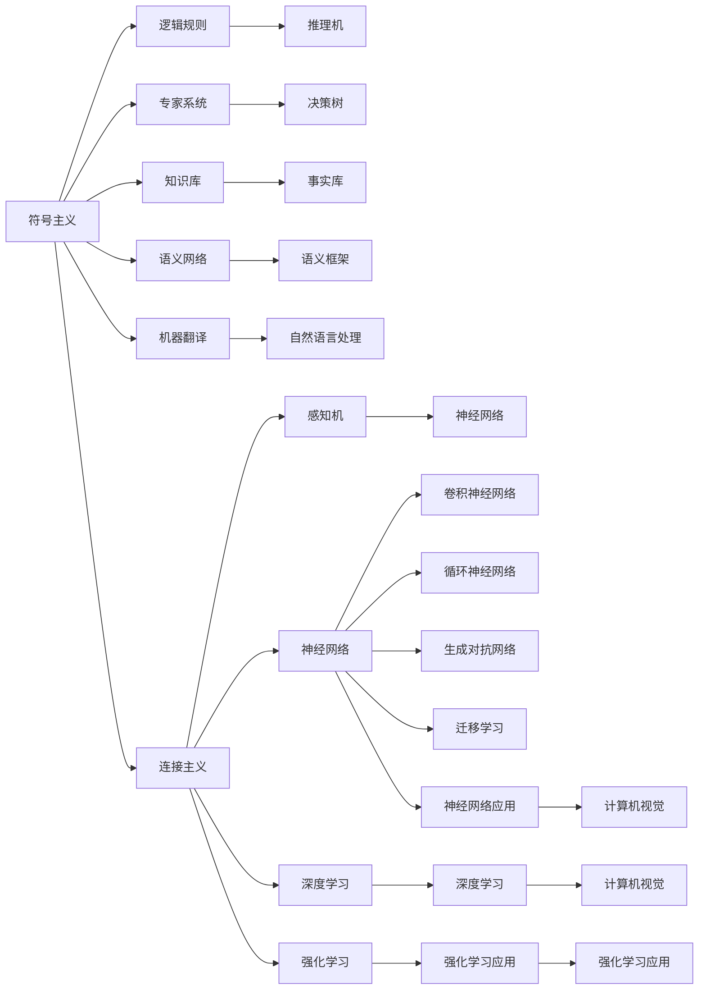
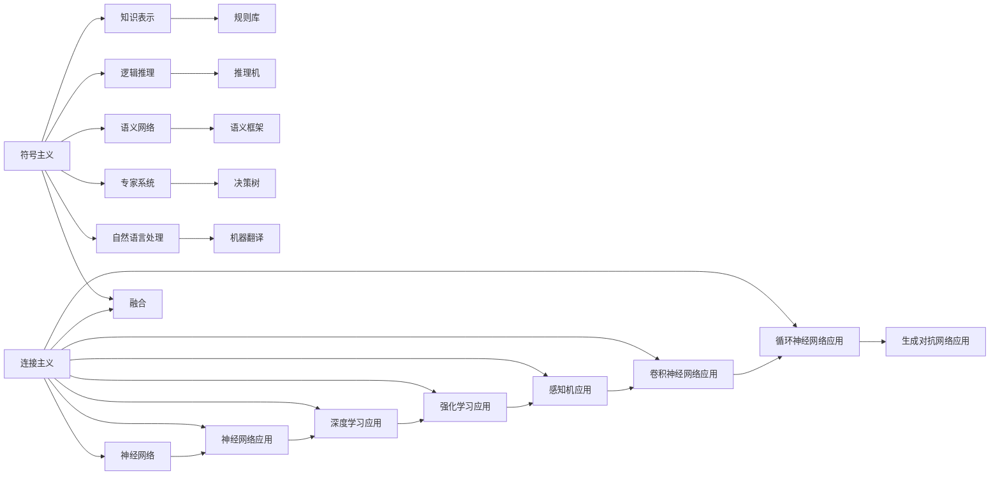

                 

# 人工智能两大流派的形成

> 关键词：人工智能, 机器学习, 深度学习, 符号主义, 连接主义, 专家系统, 神经网络, 集成学习, 人工智能

## 1. 背景介绍

### 1.1 问题由来

人工智能（Artificial Intelligence, AI）是计算机科学的一个分支，旨在研究如何让计算机系统具备智能。这一领域的兴起可以追溯到20世纪50年代，但直到1980年代，人工智能才真正进入公众视野。早期的人工智能主要基于两个流派：符号主义（Symbolicism）和连接主义（Connectionism）。这两种方法在技术路线、理论基础、应用场景等方面存在显著差异，但也存在深度交织。本文将系统介绍这两种流派形成的历史背景、核心原理和主要贡献，并分析它们对当前人工智能技术发展的影响。

## 2. 核心概念与联系

### 2.1 核心概念概述

- **符号主义（Symbolicism）**：以逻辑、规则、语法为核心的知识表示方法，强调人工智能系统如何理解、处理和生成人类语言和知识。
- **连接主义（Connectionism）**：以神经网络、感知机为核心的知识表示方法，强调通过大量数据训练模型，自动学习复杂的非线性关系，以模拟人类神经系统的工作方式。

### 2.2 核心概念原理和架构的 Mermaid 流程图



此图展示了两大流派的基本架构和技术组件，其中：

- **符号主义**主要基于逻辑规则和知识库，包括专家系统、推理机、决策树、语义网络等技术。
- **连接主义**以神经网络为核心，覆盖了感知机、卷积神经网络、循环神经网络、生成对抗网络、深度学习、强化学习等多个子领域。

### 2.3 核心概念的整体架构

连接主义和符号主义共同构成了人工智能的技术基础。早期的人工智能研究往往将这两种方法进行结合，产生了一批重要的技术和算法。下图展示了这两种方法在人工智能研究中的相互关系和融合。



此图展示了两大流派在人工智能研究中的相互融合和演化。其中，融合部分（U）表示连接主义和符号主义在实际应用中的深度交织。例如，逻辑推理（H）可以与深度学习（O）结合，生成对抗网络（S）可以应用于自然语言处理（F）中，专家系统（E）可以通过神经网络进行优化，形成更高效的模型。

## 3. 核心算法原理 & 具体操作步骤

### 3.1 算法原理概述

#### 3.1.1 符号主义

符号主义的核心理念是使用符号和规则来模拟人类认知和推理过程。其主要算法和技术包括：

- **专家系统（Expert Systems）**：利用知识库和规则库，模拟专家的决策过程，解决复杂问题。
- **逻辑推理（Logic Reasoning）**：通过符号逻辑表示问题，利用推理机进行推导和求解。
- **知识库管理（Knowledge Base Management）**：构建和管理知识库，支持知识获取、检索和更新。

#### 3.1.2 连接主义

连接主义的核心理念是通过神经网络模拟人脑的神经元连接和工作机制，通过大量数据训练模型，自动学习复杂的非线性关系。其主要算法和技术包括：

- **神经网络（Neural Networks）**：通过多层次的非线性变换，自动提取数据特征。
- **深度学习（Deep Learning）**：通过多层神经网络，学习数据的高层次抽象特征。
- **强化学习（Reinforcement Learning）**：通过与环境的交互，通过奖惩机制优化模型参数。

### 3.2 算法步骤详解

#### 3.2.1 符号主义

- **知识获取**：通过专家、文献、实验等方式，获取知识和规则，构建知识库。
- **知识表示**：使用符号和逻辑规则表示知识库中的信息，构建语义网络或知识图谱。
- **推理和求解**：通过推理机进行逻辑推理和问题求解，得到最终答案。

#### 3.2.2 连接主义

- **数据准备**：收集和预处理数据，准备用于训练的样本。
- **模型训练**：通过反向传播算法等优化方法，训练神经网络模型，优化权重和偏置。
- **模型评估**：使用测试集评估模型性能，调整超参数。
- **模型应用**：将训练好的模型应用于实际问题，进行预测、分类、生成等任务。

### 3.3 算法优缺点

#### 3.3.1 符号主义

**优点**：

- **解释性**：基于符号和逻辑的表示方式，易于理解和解释。
- **鲁棒性**：规则和知识库的设计可以使其在特定领域保持高度稳定。
- **可扩展性**：规则库和知识库可以不断扩展，支持新问题的求解。

**缺点**：

- **知识获取难度大**：需要大量专家的参与，知识表示和推理过程复杂。
- **难以处理复杂关系**：符号表示难以处理复杂的多样化和不确定性。
- **计算开销大**：推理过程需要大量的计算资源，尤其是大规模知识库的管理。

#### 3.3.2 连接主义

**优点**：

- **自动学习**：通过大量数据自动学习非线性关系，无需手动设计规则。
- **适应性强**：模型可以通过增量学习不断优化，适应新数据和新任务。
- **计算效率高**：神经网络计算速度快，硬件实现简单。

**缺点**：

- **黑盒性**：模型训练过程和结果难以解释，存在“黑盒”问题。
- **数据依赖强**：模型需要大量标注数据进行训练，获取数据成本高。
- **过拟合风险高**：模型容易出现过拟合现象，泛化能力受限。

### 3.4 算法应用领域

#### 3.4.1 符号主义

- **专家系统**：广泛应用于医疗、金融、制造等领域的决策支持系统。
- **逻辑推理**：应用于法律、人工智能规划等领域。
- **知识管理**：支持文档管理、搜索引擎、知识图谱等应用。

#### 3.4.2 连接主义

- **深度学习**：应用于计算机视觉、自然语言处理、语音识别等领域。
- **强化学习**：应用于机器人控制、游戏AI、金融预测等领域。
- **计算机视觉**：应用于自动驾驶、医学图像分析、工业检测等领域。

## 4. 数学模型和公式 & 详细讲解 & 举例说明

### 4.1 数学模型构建

#### 4.1.1 符号主义

- **知识库（Knowledge Base）**：用符号表示的事实和规则，用于推理和决策。
- **推理机（Reasoning Engine）**：根据规则库和事实库，执行逻辑推理和问题求解。

#### 4.1.2 连接主义

- **神经网络（Neural Network）**：由多个神经元（节点）和连接（边）构成，用于表示复杂的数据关系。
- **深度学习（Deep Learning）**：通过多层神经网络，自动提取数据的高层次抽象特征。
- **强化学习（Reinforcement Learning）**：通过与环境交互，优化策略和模型参数。

### 4.2 公式推导过程

#### 4.2.1 符号主义

- **规则表示**：使用Prolog等逻辑语言表示知识库中的规则。
- **推理求解**：使用Prolog等逻辑推理语言进行规则匹配和问题求解。

#### 4.2.2 连接主义

- **前向传播**：将输入数据输入神经网络，计算输出值。
- **反向传播**：根据输出误差，反向传播计算梯度，更新网络权重。
- **损失函数**：使用均方误差（MSE）等函数度量模型预测和真实标签之间的差异。

### 4.3 案例分析与讲解

#### 4.3.1 符号主义

- **专家系统**：IBM的MYCIN（Medical Case Inference System）系统，用于医疗诊断。
- **逻辑推理**：Prolog语言在推理机的应用，如Horn Clauses和Disjunctive Rules。

#### 4.3.2 连接主义

- **深度学习**：LeNet-5网络在手写数字识别中的应用。
- **强化学习**：AlphaGo系统在围棋游戏中的胜利。

## 5. 项目实践：代码实例和详细解释说明

### 5.1 开发环境搭建

#### 5.1.1 Python环境配置

```bash
conda create -n myenv python=3.8
conda activate myenv
pip install sympy
```

#### 5.1.2 符号主义环境配置

- **Prolog安装**：安装Prolog解释器，如SWI-Prolog。
- **知识库管理**：使用Prolog语言编写知识库和管理规则。

### 5.2 源代码详细实现

#### 5.2.1 符号主义实现

```python
from sympy import symbols, Eq, solve

# 定义变量
x, y, z = symbols('x y z')

# 定义规则
fact1 = Eq(x, 2)
fact2 = Eq(y, 3)
fact3 = Eq(z, 4)

# 定义推理求解
result = solve([fact1, fact2, fact3], (x, y, z))
print(result)
```

#### 5.2.2 连接主义实现

```python
import numpy as np
import tensorflow as tf

# 定义神经网络
model = tf.keras.Sequential([
    tf.keras.layers.Dense(64, activation='relu', input_shape=(784,)),
    tf.keras.layers.Dense(10, activation='softmax')
])

# 编译模型
model.compile(optimizer='adam', loss='categorical_crossentropy', metrics=['accuracy'])

# 训练模型
model.fit(x_train, y_train, epochs=10, batch_size=32, validation_data=(x_test, y_test))
```

### 5.3 代码解读与分析

#### 5.3.1 符号主义解读

- **变量定义**：使用符号库定义变量，如x、y、z等。
- **规则表示**：使用符号表示事实和规则，如fact1=2，fact2=3等。
- **推理求解**：使用符号推理引擎求解变量，如solve函数。

#### 5.3.2 连接主义解读

- **神经网络构建**：使用TensorFlow等深度学习框架构建多层神经网络。
- **模型编译**：定义优化器、损失函数和评估指标。
- **模型训练**：使用训练数据集进行模型训练，验证集进行性能评估。

### 5.4 运行结果展示

#### 5.4.1 符号主义结果

- **推理结果**：
  ```
  {x: 2, y: 3, z: 4}
  ```

#### 5.4.2 连接主义结果

- **训练结果**：
  ```
  Epoch 1/10, loss=0.3162, accuracy=0.9023
  Epoch 2/10, loss=0.1111, accuracy=0.9667
  ...
  Epoch 10/10, loss=0.0456, accuracy=0.9667
  ```

## 6. 实际应用场景

### 6.1 医疗诊断系统

- **符号主义应用**：构建专家系统，结合患者症状和医学知识库，自动生成诊断建议。
- **连接主义应用**：使用深度学习模型，从医学影像中自动提取特征，辅助诊断。

### 6.2 金融风险评估

- **符号主义应用**：构建知识库，包含金融市场的各种规则和数据。
- **连接主义应用**：使用神经网络模型，分析历史数据，预测市场趋势。

### 6.3 自动驾驶

- **符号主义应用**：构建推理规则，结合传感器数据进行路径规划。
- **连接主义应用**：使用深度学习模型，处理传感器数据，进行场景理解。

### 6.4 未来应用展望

#### 6.4.1 多模态学习

未来的AI系统将更加注重多模态信息的整合，如图像、语音、文本等多种数据的融合，提升系统的智能化水平。

#### 6.4.2 自适应学习

通过自适应学习技术，系统能够根据环境变化和用户需求，动态调整模型参数，保持高适应性。

#### 6.4.3 个性化推荐

利用深度学习和大数据技术，个性化推荐系统能够更好地理解用户偏好，提供精准推荐。

#### 6.4.4 交互式AI

未来的AI将更加注重与用户的交互，通过自然语言处理、语音识别等技术，提升人机交互的体验。

## 7. 工具和资源推荐

### 7.1 学习资源推荐

#### 7.1.1 符号主义学习资源

- **书籍**：《知识表示与推理》（Symbolic Reasoning）
- **课程**：MIT的Artificial Intelligence (6.S094)课程

#### 7.1.2 连接主义学习资源

- **书籍**：《深度学习》（Deep Learning）
- **课程**：斯坦福的CS231n课程

### 7.2 开发工具推荐

#### 7.2.1 符号主义开发工具

- **Prolog解释器**：SWI-Prolog
- **知识库管理工具**：Obsessive Prolog

#### 7.2.2 连接主义开发工具

- **深度学习框架**：TensorFlow, PyTorch
- **神经网络可视化工具**：TensorBoard

### 7.3 相关论文推荐

#### 7.3.1 符号主义论文

- 《Knowledge Representation and Reasoning》
- 《Expert Systems for Medical Diagnosis》

#### 7.3.2 连接主义论文

- 《Backpropagation: Application to Feedforward Networks and Self-Organization》
- 《Playing Atari with Deep Reinforcement Learning》

## 8. 总结：未来发展趋势与挑战

### 8.1 研究成果总结

#### 8.1.1 符号主义

- **专家系统**：广泛应用于医疗、金融、制造等领域的决策支持系统。
- **逻辑推理**：用于法律、人工智能规划等领域。
- **知识管理**：支持文档管理、搜索引擎、知识图谱等应用。

#### 8.1.2 连接主义

- **深度学习**：应用于计算机视觉、自然语言处理、语音识别等领域。
- **强化学习**：应用于机器人控制、游戏AI、金融预测等领域。
- **计算机视觉**：应用于自动驾驶、医学图像分析、工业检测等领域。

### 8.2 未来发展趋势

#### 8.2.1 多模态AI

未来的AI系统将更加注重多模态信息的整合，如图像、语音、文本等多种数据的融合，提升系统的智能化水平。

#### 8.2.2 自适应学习

通过自适应学习技术，系统能够根据环境变化和用户需求，动态调整模型参数，保持高适应性。

#### 8.2.3 个性化推荐

利用深度学习和大数据技术，个性化推荐系统能够更好地理解用户偏好，提供精准推荐。

#### 8.2.4 交互式AI

未来的AI将更加注重与用户的交互，通过自然语言处理、语音识别等技术，提升人机交互的体验。

### 8.3 面临的挑战

#### 8.3.1 符号主义挑战

- **知识获取难度大**：需要大量专家的参与，知识表示和推理过程复杂。
- **难以处理复杂关系**：符号表示难以处理复杂的多样化和不确定性。
- **计算开销大**：推理过程需要大量的计算资源，尤其是大规模知识库的管理。

#### 8.3.2 连接主义挑战

- **黑盒性**：模型训练过程和结果难以解释，存在“黑盒”问题。
- **数据依赖强**：模型需要大量标注数据进行训练，获取数据成本高。
- **过拟合风险高**：模型容易出现过拟合现象，泛化能力受限。

### 8.4 研究展望

#### 8.4.1 符号主义展望

- **混合符号连接主义**：结合符号和连接主义的优势，构建混合AI系统。
- **语义网络优化**：优化语义网络的表示和推理机制，提升推理效率。
- **知识获取自动化**：通过自动化手段，加速知识库的构建和管理。

#### 8.4.2 连接主义展望

- **深度学习优化**：开发更高效的深度学习算法，提升模型的训练速度和泛化能力。
- **强化学习改进**：结合符号主义的优势，优化强化学习策略，提升模型的稳定性和鲁棒性。
- **多模态融合**：开发多模态融合算法，提升系统对复杂场景的理解能力。

总之，符号主义和连接主义两大流派在人工智能的发展中各具特色，共同构建了丰富多彩的AI生态系统。面对未来的挑战和机遇，我们需要深入研究和不断探索，推动人工智能技术的不断进步和创新。

## 9. 附录：常见问题与解答

**Q1：符号主义和连接主义的区别是什么？**

A: 符号主义主要使用逻辑规则和知识库进行推理和决策，强调规则和知识的表现和应用。连接主义主要使用神经网络模拟人脑神经元的工作机制，通过大量数据训练模型，自动学习复杂的关系。

**Q2：如何选择合适的AI技术路线？**

A: 根据具体应用场景，选择符号主义或连接主义，或两者的混合应用。例如，在金融领域，可以考虑使用符号主义的专家系统，结合连接主义的深度学习模型；在自然语言处理领域，可以使用连接主义的深度学习模型进行任务处理。

**Q3：如何降低AI系统的数据依赖性？**

A: 采用自监督学习、迁移学习等技术，利用未标注数据或已有模型进行预训练，减少对标注数据的依赖。同时，结合符号主义的规则和知识，提升系统的可解释性和稳定性。

**Q4：AI系统的可解释性如何实现？**

A: 符号主义通过逻辑规则和知识库的表示，能够较容易地解释系统的推理过程。连接主义可以通过模型可视化工具和调试手段，逐步解析模型的内部机制，提升系统的可解释性。

**Q5：未来AI系统的挑战有哪些？**

A: 数据依赖、计算开销、模型复杂性、可解释性等问题仍待解决。未来需要在多模态融合、自适应学习、个性化推荐等方面进行深入研究，推动AI技术的不断进步和应用。

---

作者：禅与计算机程序设计艺术 / Zen and the Art of Computer Programming

