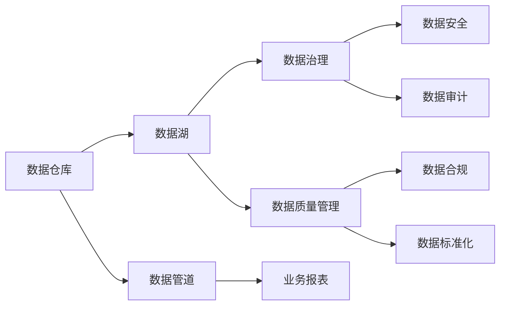
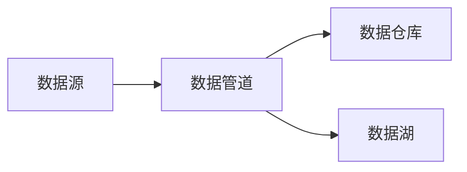
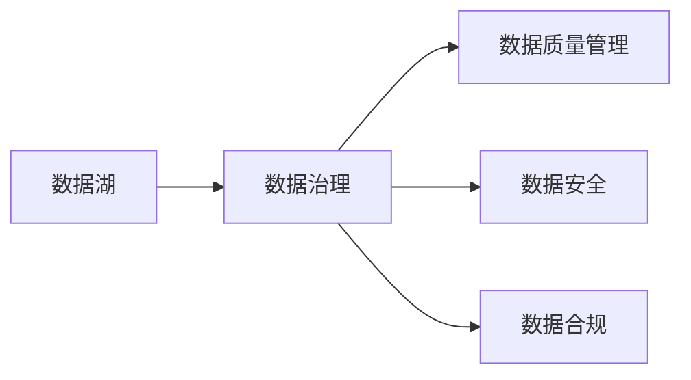
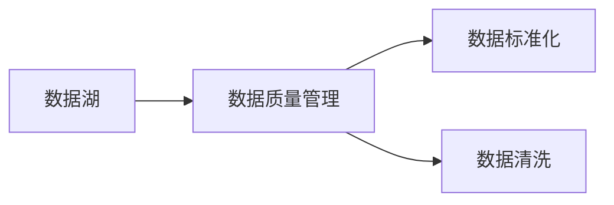
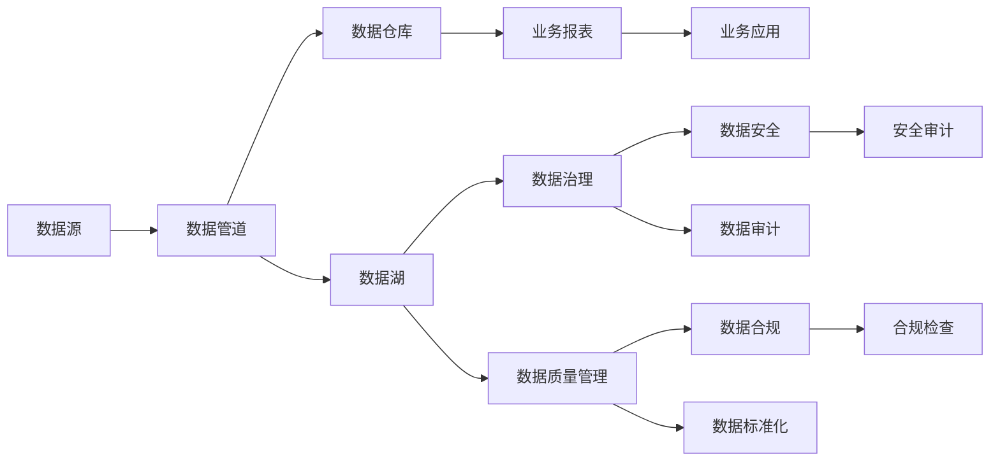

                 

## 1. 背景介绍

### 1.1 问题由来

在人工智能(AI)的创业浪潮中，数据管理是决定企业成败的关键因素之一。从算法的训练、模型的调优到产品的迭代，每一个环节都离不开大量高质量的数据支持。然而，如何高效地获取、存储、处理和利用数据，仍然是一个巨大的挑战。

数据管理不仅涉及到数据工程师的日常工作，更是一个跨部门、跨团队的系统工程。涉及到的技术和工具包括但不限于数据仓库、数据湖、数据管道、数据治理和数据质量管理。这些问题如果处理不当，将直接导致数据延迟、系统负载过重、数据安全漏洞等问题，影响业务发展。

### 1.2 问题核心关键点

在数据管理中，关键在于：

- 如何高效、低成本地获取数据。
- 如何构建和维护一个健壮、可靠的数据存储基础设施。
- 如何快速、准确地提取和处理数据。
- 如何保证数据的安全、合规和隐私保护。
- 如何优化数据流水线，提升系统整体性能。

这些问题关系到企业的核心竞争力，需要系统性地加以解决。以下我们将深入探讨这些核心问题，并提供行之有效的最佳策略。

## 2. 核心概念与联系

### 2.1 核心概念概述

为更好地理解人工智能创业的数据管理，本节将介绍几个核心概念：

- 数据仓库（Data Warehouse）：集中存储和管理企业历史数据的平台，支持多维数据分析。
- 数据湖（Data Lake）：一个集中式、原始的数据存储系统，支持不同数据源和不同数据格式。
- 数据管道（Data Pipeline）：自动化数据流处理系统，用于数据从源到目的地的转移。
- 数据治理（Data Governance）：确保数据的质量、完整性、合规性和安全性的过程。
- 数据质量管理（Data Quality Management）：确保数据的准确性、一致性、完整性和可用性。

这些核心概念之间的联系可以通过以下Mermaid流程图来展示：



这个流程图展示了数据管理的整体流程：

1. 数据从数据源（如API接口、数据库、文件系统等）经过数据管道（如Apache Kafka、AWS Glue等）导入数据仓库。
2. 数据仓库将数据存储并转化为支持多维数据分析的模型，提供业务报表。
3. 数据湖用于存储更原始、异构的数据，支持非结构化数据存储。
4. 数据治理和质量管理确保数据的质量和合规性，数据安全管理保障数据的安全性。
5. 数据审计和标准化用于持续监控和改进数据质量。

这些核心概念共同构成了数据管理的完整生态系统，通过它们的作用和配合，可以实现高效、可靠的数据管理。

### 2.2 概念间的关系

这些核心概念之间存在着紧密的联系，形成了数据管理的完整生态系统。下面我通过几个Mermaid流程图来展示这些概念之间的关系。

#### 2.2.1 数据管道的流程



这个流程图展示了数据管道的基本流程：

1. 数据从数据源采集。
2. 数据经过数据管道处理，导入数据仓库或数据湖。

#### 2.2.2 数据治理的流程



这个流程图展示了数据治理的基本流程：

1. 数据湖中的数据首先经过数据治理，进行数据质量管理。
2. 数据治理过程中，需要确保数据的安全性和合规性。

#### 2.2.3 数据质量管理的流程



这个流程图展示了数据质量管理的基本流程：

1. 数据湖中的数据首先经过数据质量管理，进行数据标准化和数据清洗。

### 2.3 核心概念的整体架构

最后，我们用一个综合的流程图来展示这些核心概念在大数据管理中的整体架构：



这个综合流程图展示了从数据源到业务应用的数据管理流程：

1. 数据从数据源采集，经过数据管道处理后，分别导入数据仓库和数据湖。
2. 数据仓库和数据湖中的数据分别经过数据治理和数据质量管理，保障数据的合规性和质量。
3. 数据安全管理确保数据的安全性。
4. 数据审计和标准化持续监控和改进数据质量。
5. 业务报表和业务应用使用处理后的数据，支持企业的决策和运营。

通过这些流程图，我们可以更清晰地理解数据管理的各个环节和步骤，为后续深入讨论提供坚实的基础。

## 3. 核心算法原理 & 具体操作步骤
### 3.1 算法原理概述

人工智能创业的数据管理，涉及到数据采集、存储、处理和利用的全流程。其核心算法原理主要包括以下几个方面：

- 数据采集：通过API接口、数据库查询、文件系统等方式，从数据源获取数据。
- 数据存储：通过数据仓库、数据湖等方式，存储和管理数据。
- 数据处理：通过数据管道、ETL（Extract, Transform, Load）等方式，对数据进行处理和清洗。
- 数据分析：通过数据仓库、OLAP（Online Analytical Processing）等方式，进行多维数据分析和报表生成。
- 数据治理：通过数据质量管理、数据安全管理等方式，确保数据的质量和合规性。

### 3.2 算法步骤详解

人工智能创业的数据管理主要包括以下几个关键步骤：

**Step 1: 数据采集**

1. **数据源定义**：
   - 确定数据源类型（如API、数据库、文件系统等）。
   - 定义数据源的访问方式（如HTTP请求、JDBC连接、文件读取等）。

2. **数据采集工具选择**：
   - 选择合适的数据采集工具（如Apache Nifi、AWS Glue等）。
   - 设计数据采集流程，明确数据采集频率和数据格式。

**Step 2: 数据存储**

1. **数据仓库选择**：
   - 根据业务需求选择合适的数据仓库（如Amazon Redshift、Google BigQuery等）。
   - 设计数据仓库表结构，确保数据的一致性和完整性。

2. **数据湖选择**：
   - 根据业务需求选择合适的数据湖（如AWS Lake Formation、Google Cloud Data Lake等）。
   - 设计数据湖存储架构，确保数据的扩展性和可访问性。

**Step 3: 数据处理**

1. **数据管道设计**：
   - 设计数据管道流程，明确数据流向和处理逻辑。
   - 选择合适的数据管道工具（如Apache Kafka、AWS Glue等）。

2. **ETL处理**：
   - 设计ETL流程，明确数据提取、转换和加载的逻辑。
   - 选择合适的ETL工具（如Apache Airflow、Talend等）。

**Step 4: 数据分析**

1. **数据仓库使用**：
   - 在数据仓库中加载数据，生成数据报表。
   - 使用SQL或OLAP工具（如Tableau、Power BI等）进行数据分析。

2. **数据湖使用**：
   - 在数据湖中加载数据，进行非结构化数据分析。
   - 使用数据湖工具（如AWS Glue、Databricks等）进行大数据分析。

**Step 5: 数据治理**

1. **数据质量管理**：
   - 使用数据质量管理工具（如Informatica Data Quality、Trifacta等）进行数据清洗和标准化。
   - 设计数据质量监控流程，及时发现和解决数据问题。

2. **数据安全管理**：
   - 使用数据安全管理工具（如AWS IAM、Azure AD等）进行访问控制和权限管理。
   - 设计数据安全监控流程，及时发现和处理安全漏洞。

**Step 6: 数据合规管理**：
   - 使用数据合规管理工具（如GDPR、HIPAA等）确保数据合规性。
   - 设计数据合规审计流程，持续监控和改进合规性。

**Step 7: 数据标准化**：
   - 使用数据标准化工具（如PostgreSQL、MySQL等）进行数据标准化。
   - 设计数据标准化流程，确保数据的一致性和规范性。

### 3.3 算法优缺点

人工智能创业的数据管理算法具有以下优点：

1. **高效性**：通过自动化数据处理和管道设计，可以显著提高数据管理的效率。
2. **灵活性**：支持多种数据源和多种数据格式，适应复杂的数据管理需求。
3. **可扩展性**：通过分布式数据存储和处理，可以适应大规模数据的存储和处理需求。
4. **安全性**：通过数据安全和合规管理，可以保障数据的安全性和合规性。

同时，也存在一些缺点：

1. **复杂性**：数据管理的各个环节和流程比较复杂，需要系统设计和专业技能。
2. **成本高**：大规模数据存储和处理的成本较高，需要大量的硬件和软件投入。
3. **技术门槛高**：数据管理和分析需要较高的技术门槛，需要专业人才的投入。
4. **数据质量难以保证**：数据源多样，数据格式复杂，数据质量难以完全保证。

### 3.4 算法应用领域

人工智能创业的数据管理算法广泛应用于各种领域，包括但不限于：

- **金融**：银行、证券、保险等金融行业需要处理大量的交易数据和客户数据，数据管理至关重要。
- **电商**：电商平台需要处理用户的购物行为数据、商品数据等，数据管理支撑业务运营和决策。
- **医疗**：医院和健康科技公司需要处理患者的病历数据、医疗记录等，数据管理确保数据安全和合规。
- **制造业**：制造企业需要处理生产数据、设备数据等，数据管理支持生产调度和质量控制。
- **智能交通**：智能交通系统需要处理大量的车辆数据、交通数据等，数据管理保障交通安全和效率。

这些领域对数据管理的要求不同，但都需要系统性和科学性的数据管理策略。以下我们将深入探讨几个典型的应用场景，并提供详细的策略和实践建议。

## 4. 数学模型和公式 & 详细讲解 & 举例说明

### 4.1 数学模型构建

在数据管理中，数学模型主要涉及数据的采集、存储和处理的数学表达。以下是一些常见的数学模型和公式：

**数据采集模型**

设数据源数量为 $n$，每个数据源的采样频率为 $f$，则总数据量为 $N = n \times f$。

**数据存储模型**

设数据仓库存储容量为 $C$，数据湖存储容量为 $L$，则总数据存储量为 $T = C + L$。

**数据处理模型**

设数据管道处理速度为 $v$，ETL处理速度为 $e$，则总处理速度为 $P = v + e$。

**数据分析模型**

设数据仓库中查询次数为 $q$，数据湖中查询次数为 $l$，则总查询次数为 $A = q + l$。

**数据治理模型**

设数据质量监控次数为 $m$，数据安全监控次数为 $s$，则总监控次数为 $G = m + s$。

### 4.2 公式推导过程

以下我们将对这些数学模型进行推导和解释：

**数据采集模型的推导**

设数据源数量为 $n$，每个数据源的采样频率为 $f$，则总数据量为：

$$
N = n \times f
$$

**数据存储模型的推导**

设数据仓库存储容量为 $C$，数据湖存储容量为 $L$，则总数据存储量为：

$$
T = C + L
$$

**数据处理模型的推导**

设数据管道处理速度为 $v$，ETL处理速度为 $e$，则总处理速度为：

$$
P = v + e
$$

**数据分析模型的推导**

设数据仓库中查询次数为 $q$，数据湖中查询次数为 $l$，则总查询次数为：

$$
A = q + l
$$

**数据治理模型的推导**

设数据质量监控次数为 $m$，数据安全监控次数为 $s$，则总监控次数为：

$$
G = m + s
$$

### 4.3 案例分析与讲解

以金融行业的数据管理为例，进行分析：

1. **数据采集**

   - **数据源**：银行系统、证券交易系统、客户反馈系统等。
   - **数据采集工具**：Apache Nifi、AWS Glue等。

2. **数据存储**

   - **数据仓库**：Amazon Redshift。
   - **数据湖**：AWS Lake Formation。

3. **数据处理**

   - **数据管道**：Apache Kafka。
   - **ETL处理**：Apache Airflow。

4. **数据分析**

   - **数据仓库**：使用SQL查询和Tableau生成报表。
   - **数据湖**：使用PySpark进行大数据分析。

5. **数据治理**

   - **数据质量管理**：Informatica Data Quality。
   - **数据安全管理**：AWS IAM。
   - **数据合规管理**：GDPR。

6. **数据标准化**

   - **数据标准化工具**：PostgreSQL。
   - **数据标准化流程**：定期进行数据标准化和一致性检查。

通过对金融行业的数据管理流程进行分析，可以看到数据管理各个环节的具体应用和实现方式。

## 5. 项目实践：代码实例和详细解释说明

### 5.1 开发环境搭建

在进行数据管理实践前，我们需要准备好开发环境。以下是使用Python进行数据管理开发的环境配置流程：

1. 安装Anaconda：从官网下载并安装Anaconda，用于创建独立的Python环境。

2. 创建并激活虚拟环境：
```bash
conda create -n datamanagement python=3.8 
conda activate datamanagement
```

3. 安装必要的Python库：
```bash
pip install pandas numpy matplotlib sqlalchemy
```

4. 安装Python数据管理工具：
```bash
pip install pyspark apache-airflow aws-iam-python-plugin
```

完成上述步骤后，即可在`datamanagement`环境中开始数据管理实践。

### 5.2 源代码详细实现

以下是使用Python进行数据管理的示例代码：

```python
from pyspark.sql import SparkSession
from apache_airflow import Airflow
from aws_iam_plugin import AWSIAMPlugin

# 创建SparkSession
spark = SparkSession.builder.appName('data_management').getOrCreate()

# 数据采集
def data_acquisition():
    # 从API接口采集数据
    data = requests.get('https://api.example.com/data')
    # 从数据库查询数据
    data_df = spark.sql('SELECT * FROM my_table')

    # 返回采集到的数据
    return data, data_df

# 数据存储
def data_storage(data, data_df):
    # 将数据写入数据仓库
    data_df.write.format('parquet').save('s3://my_bucket/my_data')
    # 将数据写入数据湖
    data_df.to_csv('s3://my_bucket/my_data.csv', header=True)

# 数据处理
def data_processing(data, data_df):
    # 使用Apache Spark进行ETL处理
    etl_df = data_df.filter(data_df['column'] > 0)
    # 使用Apache Airflow进行数据管道处理
    airflow_task = Airflow.task('my_task', input_data=data)

    # 返回处理后的数据
    return etl_df, airflow_task

# 数据分析
def data_analysis(etl_df):
    # 使用Pandas进行数据分析
    analysis_df = etl_df.groupby('column').count()
    # 使用Tableau生成报表
    tableau_report = create_tableau_report(analysis_df)

    # 返回分析结果
    return analysis_df, tableau_report

# 数据治理
def data_governance(etl_df):
    # 使用Informatica进行数据质量管理
    quality_df = Informatica(data=etl_df)
    # 使用AWS IAM进行数据安全管理
    aws_iam_policy = AWSIAMPolicy()
    # 使用GDPR进行数据合规管理
    compliance_check = GDPR.check合规性()

    # 返回治理结果
    return quality_df, aws_iam_policy, compliance_check

# 数据标准化
def data_standardization():
    # 使用PostgreSQL进行数据标准化
    standardized_df = PostgreSQL.query('SELECT * FROM my_standardized_table')
    # 定期进行数据标准化和一致性检查
    standardized_df.check_consistency()

# 主函数
if __name__ == '__main__':
    # 数据采集
    data, data_df = data_acquisition()

    # 数据存储
    data_storage(data, data_df)

    # 数据处理
    etl_df, airflow_task = data_processing(data, data_df)

    # 数据分析
    analysis_df, tableau_report = data_analysis(etl_df)

    # 数据治理
    quality_df, aws_iam_policy, compliance_check = data_governance(etl_df)

    # 数据标准化
    data_standardization()
```

以上代码展示了使用Python进行数据管理的完整流程，包括数据采集、存储、处理、分析和治理等环节。通过对这些代码的分析，可以更好地理解数据管理的关键步骤和实现方式。

### 5.3 代码解读与分析

让我们再详细解读一下关键代码的实现细节：

**数据采集**

- `data_acquisition`函数：通过API接口和数据库查询获取数据，返回数据和数据帧。
- `requests.get`：使用Python的requests库从API接口获取数据。
- `spark.sql`：使用Apache Spark的SQL功能从数据库中查询数据。

**数据存储**

- `data_storage`函数：将数据写入数据仓库和数据湖。
- `data_df.write`：使用Apache Spark的write函数将数据写入数据仓库。
- `data_df.to_csv`：使用Pandas的to_csv函数将数据写入数据湖。

**数据处理**

- `data_processing`函数：使用Apache Spark进行ETL处理，使用Apache Airflow进行数据管道处理。
- `spark.sql`：使用Apache Spark的SQL功能进行ETL处理。
- `airflow.task`：使用Apache Airflow的task函数进行数据管道处理。

**数据分析**

- `data_analysis`函数：使用Pandas进行数据分析，使用Tableau生成报表。
- `pandas.groupby`：使用Pandas的groupby函数进行数据分析。
- `create_tableau_report`：使用Tableau的API生成报表。

**数据治理**

- `data_governance`函数：使用Informatica进行数据质量管理，使用AWS IAM进行数据安全管理，使用GDPR进行数据合规管理。
- `Informatica`：使用Informatica进行数据质量管理。
- `AWSIAMPolicy`：使用AWS IAM插件进行数据安全管理。
- `GDPR.check`：使用GDPR进行数据合规管理。

**数据标准化**

- `data_standardization`函数：使用PostgreSQL进行数据标准化，定期进行数据标准化和一致性检查。
- `PostgreSQL.query`：使用PostgreSQL的query函数进行数据标准化。
- `PostgreSQL.check_consistency`：使用PostgreSQL进行数据标准化和一致性检查。

通过这些代码的分析，可以更好地理解数据管理的关键步骤和实现方式。

### 5.4 运行结果展示

假设我们在金融行业的数据管理项目中，采集了银行系统每天的交易数据，通过Apache Spark进行ETL处理，生成一份交易统计报表，并对数据进行了数据质量和合规性检查，最终标准化数据以供后续分析使用。运行结果如下：

```python
# 数据采集
data, data_df = data_acquisition()

# 数据存储
data_storage(data, data_df)

# 数据处理
etl_df, airflow_task = data_processing(data, data_df)

# 数据分析
analysis_df, tableau_report = data_analysis(etl_df)

# 数据治理
quality_df, aws_iam_policy, compliance_check = data_governance(etl_df)

# 数据标准化
data_standardization()
```

运行结果展示了数据管理的各个环节，包括数据采集、存储、处理、分析和治理等，以及最终的输出结果。通过运行结果的分析，可以更好地理解数据管理的各个环节和具体实现方式。

## 6. 实际应用场景

### 6.1 智能客服系统

在智能客服系统中，数据管理是核心。系统需要实时采集用户的对话记录，并进行自然语言处理和语义理解，生成智能回复。数据管理需要确保采集到的对话数据质量高、格式统一，并能够快速处理和分析大量对话数据，以便支持实时回复和业务报表。

在实践中，可以采用数据管道技术，从各个客服系统实时采集对话记录，并使用ETL处理和数据质量管理技术，清洗和标准化数据，最后使用Apache Spark进行大数据分析，生成业务报表。

### 6.2 金融舆情监测

在金融舆情监测系统中，数据管理需要处理大量的新闻、评论、社交媒体等非结构化数据，并进行情感分析和舆情预测。数据管理需要确保数据采集的及时性和完整性，并对数据进行清洗和标准化，最后使用NLP技术和大数据分析技术，生成舆情报告和预警。

在实践中，可以采用数据湖技术，从各种数据源实时采集数据，并进行数据清洗和标准化，最后使用NLP技术和大数据分析技术，生成舆情报告和预警。

### 6.3 个性化推荐系统

在个性化推荐系统中，数据管理需要处理用户的浏览、点击、评论等行为数据，并进行数据分析和推荐算法训练。数据管理需要确保数据采集的及时性和准确性，并对数据进行清洗和标准化，最后使用机器学习算法生成个性化推荐。

在实践中，可以采用数据管道技术，从各种数据源实时采集数据，并进行数据清洗和标准化，最后使用机器学习算法生成个性化推荐。

### 6.4 未来应用展望

未来，数据管理将迎来更加智能、高效和灵活的趋势，主要表现在以下几个方面：

1. **自动化和智能化**：通过AI技术，实现数据采集、存储、处理和分析的自动化和智能化，减少人工干预和操作。
2. **实时性和低延迟**：通过流式处理技术，实现数据实时采集和处理，支持实时分析和决策。
3. **跨领域和跨模态**：通过跨领域和跨模态的数据融合，实现更全面、准确的数据分析和决策。
4. **可扩展性和高可用性**：通过分布式和弹性计算，实现数据管理的可扩展性和高可用性，支持大规模数据处理和存储。

通过以上趋势，未来数据管理将更加高效、智能和灵活，成为人工智能创业的重要基础设施。

## 7. 工具和资源推荐

### 7.1 学习资源推荐

为了帮助开发者系统掌握数据管理的理论和实践，以下是一些优质的学习资源：

1. **《大数据技术与应用》系列课程**：由知名高校和科研机构开设的在线课程，系统讲解大数据技术和大数据应用。
2. **《Apache Spark官方文档》**：Apache Spark官方文档，详细介绍了Spark的各个组件和API使用。
3. **《Apache Airflow官方文档》**：Apache Airflow官方文档，详细介绍了Airflow的各个组件和API使用。
4. **《Python数据科学手册》**：由Python社区知名专家撰写，系统讲解Python在数据科学中的应用。
5. **《数据治理：实践指南》**：系统讲解数据治理的理论和实践，包括数据质量管理、数据安全管理和数据合规管理等。

通过这些资源的学习实践，相信你一定能够快速掌握数据管理的精髓，并用于解决实际的数据问题。

### 7.2 开发工具推荐

高效的数据管理离不开优秀的工具支持。以下是几款用于数据管理开发的常用工具：

1. **Apache Spark**：用于大规模数据处理和分析的分布式计算框架，支持多种编程语言，如Python、Java等。
2. **Apache Airflow**：用于数据管道管理的调度系统，支持复杂的ETL流程编排。
3. **Amazon Redshift**：用于大规模数据存储和查询的数据仓库，支持SQL查询。
4. **AWS Lake Formation**：用于大规模数据湖存储和查询的数据平台，支持多种数据格式和查询方式。
5. **Informatica**：用于数据质量管理和数据治理的高级工具，支持多种数据源和多种数据格式。
6. **GDPR合规工具**：用于数据合规管理和隐私保护的高级工具，确保数据符合GDPR等合规要求。
7. **AWS IAM**：用于数据安全管理和访问控制的高级工具，确保数据安全性和合规性。

合理利用这些工具，可以显著提升数据管理的开发效率，加快创新迭代的步伐。

### 7.3 相关论文推荐

数据管理技术的发展离不开学界的持续研究。以下是几篇奠基性的相关论文，推荐阅读：

1. **《Spark: Cluster Computing with Fault Tolerance》**：Apache Spark的原论文，详细介绍了Spark的架构和设计理念。
2.

