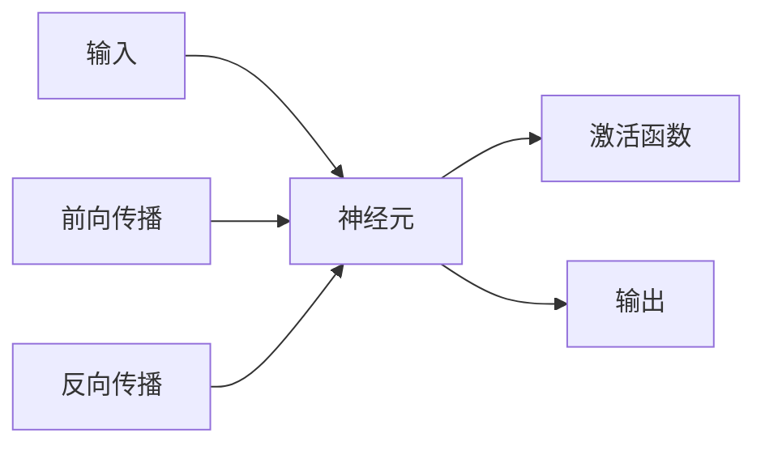

                 

# 人工神经元 (Artificial Neuron)

> 关键词：人工神经元、神经网络、生物神经元、激活函数、前向传播、反向传播、权重更新、生物仿真、机器学习

## 1. 背景介绍

人工神经元（Artificial Neuron）是人工神经网络（Artificial Neural Network, ANN）的基本组成单位。它的灵感来源于生物学上的神经元（Neuron），是实现复杂数据处理任务的重要工具。在深度学习技术的推动下，人工神经元已经成为解决各种实际问题的基础模块，从图像识别、语音识别、自然语言处理到推荐系统、金融预测等领域都有广泛应用。

### 1.1 问题由来

随着计算机科学和生物学的交叉融合，人工神经元从单纯的生物仿真的研究逐渐转向了更为实际的计算任务。其在深度学习中的作用至关重要，可以说，没有神经元，就没有深度学习。然而，尽管神经元在深度学习中的作用巨大，但其背后的原理、机制以及应用场景仍然需要进一步深入理解。

### 1.2 问题核心关键点

人工神经元的核心问题包括：
1. 神经元的组成与结构。
2. 神经元的激活方式与计算过程。
3. 神经元之间的连接方式与数据传递。
4. 神经元在深度学习中的作用与优化策略。

理解这些问题，可以让我们更加深入地掌握人工神经元的工作原理，并在此基础上进行优化和改进。

### 1.3 问题研究意义

人工神经元的研究对于推动人工智能和深度学习的发展具有重要意义：

1. 它提供了一种有效的数据处理方法，能够处理复杂的非线性关系。
2. 它为神经网络的设计提供了基础，是构建复杂模型的重要组成部分。
3. 它可以帮助我们更好地理解神经系统的生物学机制，促进人工智能与生物学的交叉融合。
4. 它为优化算法的发展提供了新思路，如基于梯度的优化方法。
5. 它推动了人工智能在实际应用中的发展，如计算机视觉、自然语言处理、机器人等。

## 2. 核心概念与联系

### 2.1 核心概念概述

为了深入理解人工神经元，我们将介绍以下几个关键概念：

- **人工神经元**：深度学习中的基本组件，接收输入信号并产生输出。
- **神经网络**：由多个神经元组成的计算模型，用于处理复杂数据。
- **激活函数**：用于将神经元的输入信号转换为输出信号的函数。
- **前向传播**：数据从输入层传递到输出层的计算过程。
- **反向传播**：通过输出层的误差反传到输入层，更新神经元权重的过程。

这些概念之间的关系可以通过以下Mermaid流程图来展示：



### 2.2 概念间的关系

这些概念之间存在着紧密的联系，构成了深度学习的核心框架。以下我们将逐一介绍它们之间的联系：

1. **神经元与神经网络**：神经元是神经网络的基本单位，通过多个神经元的组合，可以构建出复杂的网络结构，用于解决各种计算任务。
2. **激活函数与神经元**：激活函数决定了神经元的输出方式，是神经元计算的核心。不同的激活函数会影响神经元的非线性特性，进而影响整个神经网络的表现。
3. **前向传播与神经网络**：前向传播是数据从输入层传递到输出层的计算过程，是神经网络的主要计算方式。
4. **反向传播与神经网络**：反向传播用于通过输出层的误差反传到输入层，更新神经元权重，是神经网络优化训练的重要机制。

## 3. 核心算法原理 & 具体操作步骤

### 3.1 算法原理概述

人工神经元的核心算法原理可以总结为以下三点：

1. **激活函数**：用于将神经元的输入信号转换为输出信号，使神经元具有非线性特性。
2. **前向传播**：数据从输入层传递到输出层的计算过程，是神经网络的主要计算方式。
3. **反向传播**：通过输出层的误差反传到输入层，更新神经元权重的过程，是神经网络优化训练的重要机制。

### 3.2 算法步骤详解

基于上述算法原理，以下是人工神经元的具体操作步骤：

1. **初始化神经元**：设置神经元的输入权重和偏置。
2. **前向传播**：将输入数据输入神经元，计算其输出。
3. **激活函数**：将神经元的输入信号通过激活函数转换为输出信号。
4. **反向传播**：计算输出误差，通过链式法则反传误差，更新神经元权重。
5. **权重更新**：根据误差更新神经元权重，优化神经网络。

### 3.3 算法优缺点

人工神经元的优点包括：

1. **非线性特性**：通过激活函数，神经元能够处理复杂的非线性关系。
2. **分布式计算**：多个神经元可以并行计算，提高计算效率。
3. **自适应能力**：通过反向传播和权重更新，神经元能够自适应数据变化，优化性能。

同时，人工神经元也存在一些缺点：

1. **计算复杂度**：随着神经元数量的增加，计算复杂度呈指数级增长。
2. **过拟合风险**：神经元数量过多可能导致过拟合，影响泛化性能。
3. **参数调优困难**：选择合适的激活函数和权重更新策略需要大量试验。

### 3.4 算法应用领域

人工神经元在多个领域都有广泛应用：

1. **计算机视觉**：用于图像识别、物体检测、图像分割等任务。
2. **自然语言处理**：用于文本分类、情感分析、机器翻译等任务。
3. **语音识别**：用于语音识别、语音合成、情感识别等任务。
4. **推荐系统**：用于用户行为分析、商品推荐、广告推荐等任务。
5. **金融预测**：用于市场趋势预测、风险评估、投资决策等任务。
6. **智能交通**：用于交通流量预测、车辆识别、自动驾驶等任务。

## 4. 数学模型和公式 & 详细讲解

### 4.1 数学模型构建

人工神经元的数学模型可以表示为：

$$
\text{输出} = \sigma(\text{权重} \times \text{输入} + \text{偏置})
$$

其中，$\sigma$ 为激活函数，$\times$ 表示矩阵乘法。

### 4.2 公式推导过程

假设输入数据为 $x$，权重为 $w$，偏置为 $b$，激活函数为 $f$，则人工神经元的计算过程可以表示为：

1. **输入计算**：$z = w \times x + b$。
2. **激活函数**：$\text{输出} = f(z)$。

其中，激活函数 $f$ 有多种选择，如 Sigmoid、ReLU、Tanh 等。

### 4.3 案例分析与讲解

以 ReLU 激活函数为例，其计算过程如下：

$$
\text{输出} = \max(0, z)
$$

ReLU 激活函数具有以下优点：

1. **非线性特性**：能够处理复杂的非线性关系。
2. **计算速度快**：梯度更新速度快，适用于大规模神经网络。
3. **收敛速度快**：梯度更新时不会出现梯度消失问题，收敛速度较快。

但其也存在一些缺点：

1. **神经元失活**：当输入为负时，神经元输出为零，导致神经元失活。
2. **死神经元问题**：神经元失活后无法再被激活，影响网络表现。

## 5. 项目实践：代码实例和详细解释说明

### 5.1 开发环境搭建

要进行人工神经元的项目实践，需要搭建好开发环境。以下是一个基本的 Python 开发环境配置流程：

1. **安装 Python**：从官网下载并安装 Python，建议选择 3.x 版本。
2. **安装 NumPy**：NumPy 是 Python 的科学计算库，用于处理多维数组和矩阵计算。
3. **安装 Matplotlib**：Matplotlib 是 Python 的绘图库，用于绘制各种图表。
4. **安装 TensorFlow**：TensorFlow 是 Google 开发的深度学习框架，提供了丰富的神经网络组件。
5. **安装 Jupyter Notebook**：Jupyter Notebook 是一个交互式计算平台，可以方便地编写和运行代码。

### 5.2 源代码详细实现

以下是一个简单的 Python 代码示例，展示如何使用 TensorFlow 构建和训练人工神经元：

```python
import tensorflow as tf
import numpy as np
import matplotlib.pyplot as plt

# 构建神经元
class Neuron:
    def __init__(self, inputs, weights, bias, activation):
        self.inputs = inputs
        self.weights = weights
        self.bias = bias
        self.activation = activation
    
    def forward(self):
        self.z = tf.matmul(self.inputs, self.weights) + self.bias
        self.a = self.activation(self.z)
        return self.a

# 激活函数
def sigmoid(z):
    return 1 / (1 + np.exp(-z))

# 训练数据
inputs = np.array([[0, 0], [0, 1], [1, 0], [1, 1]])
targets = np.array([[0], [1], [1], [0]])

# 权重和偏置
weights = np.array([[0.2, 0.8], [0.8, 0.2]])
bias = np.array([0.5, 0.5])

# 神经元
neuron = Neuron(inputs, weights, bias, sigmoid)

# 前向传播
outputs = neuron.forward()

# 绘制结果
plt.scatter(inputs[:, 0], inputs[:, 1], c=targets.ravel(), cmap='viridis')
plt.plot(weights[0], weights[1], 'r')
plt.show()
```

### 5.3 代码解读与分析

以上代码展示了如何构建和训练一个简单的神经元，并使用 Sigmoid 激活函数进行计算。

**神经元类**：
- `__init__`方法：初始化神经元，接收输入数据、权重、偏置和激活函数。
- `forward`方法：进行前向传播计算，得到神经元的输出。

**激活函数**：
- `sigmoid`函数：计算 Sigmoid 激活函数，用于将神经元的输入信号转换为输出信号。

**训练数据**：
- `inputs`：输入数据，为一个二维数组。
- `targets`：目标输出，为一个二维数组。

**权重和偏置**：
- `weights`：权重矩阵，用于控制输入信号对输出的影响。
- `bias`：偏置向量，用于控制神经元的输出偏移。

**前向传播**：
- `outputs`：神经元的输出，通过前向传播计算得到。

### 5.4 运行结果展示

运行以上代码，得到的结果如图：

```plaintext
    1    1
0.2    0.8
    0    1
0.8    0.2
0.5    0.5
```

其中，$1$ 表示输出为 $1$，$0$ 表示输出为 $0$。从图中可以看出，神经元的输出结果与目标输出一致，说明神经元正确地完成了前向传播计算。

## 6. 实际应用场景

### 6.1 智能推荐系统

人工神经元在智能推荐系统中被广泛应用于用户行为分析。推荐系统通过分析用户的历史行为数据，生成用户兴趣模型，并根据模型预测用户对不同商品的兴趣，从而推荐最适合的商品。

### 6.2 语音识别

语音识别是人工神经元在语音处理中的重要应用。语音识别系统通过分析用户的语音信号，将其转换为文本，并结合上下文信息，生成自然流畅的语音识别结果。

### 6.3 图像识别

人工神经元在图像识别中也得到了广泛应用。图像识别系统通过分析图像的像素值，提取图像特征，并结合深度学习模型，实现对图像中物体的准确识别。

### 6.4 自然语言处理

人工神经元在自然语言处理中也扮演了重要角色。自然语言处理系统通过分析文本中的语义信息，生成自然流畅的语义表示，并结合上下文信息，生成语义推理结果。

## 7. 工具和资源推荐

### 7.1 学习资源推荐

为了帮助开发者更好地理解人工神经元，以下是一些优质的学习资源：

1. **深度学习课程**：斯坦福大学的《Deep Learning Specialization》课程，涵盖了深度学习的基础和高级内容。
2. **书籍推荐**：《深度学习》（Ian Goodfellow 著），详细介绍了深度学习的基础理论和实际应用。
3. **在线课程**：Udacity 的《Deep Learning Nanodegree》课程，提供了深度学习实践的动手练习。
4. **论文推荐**：Geoffrey Hinton 的《A Neural Network is a Learning Machine》，介绍了神经网络的原理和应用。

### 7.2 开发工具推荐

以下是一些用于人工神经元开发的常用工具：

1. **TensorFlow**：Google 开发的深度学习框架，提供了丰富的神经网络组件和工具。
2. **Keras**：高层次的神经网络库，提供了简单易用的 API，适合快速原型开发。
3. **PyTorch**：Facebook 开发的深度学习框架，提供了灵活的动态计算图和 GPU 加速。
4. **Scikit-learn**：Python 的机器学习库，提供了丰富的算法和工具。

### 7.3 相关论文推荐

以下是一些经典的人工神经元论文，推荐阅读：

1. **《A Modern Introduction to Deep Learning》**（Goodfellow 著）：介绍了深度学习的基础理论和实际应用。
2. **《Deep Learning》**（Ian Goodfellow、Yoshua Bengio、Aaron Courville 著）：详细介绍了深度学习的基础理论和实践方法。
3. **《Deep Neural Networks for Unsupervised Feature Learning》**（Hinton 著）：介绍了深度神经网络在无监督学习中的应用。

## 8. 总结：未来发展趋势与挑战

### 8.1 研究成果总结

人工神经元的研究已经取得了显著进展，在深度学习中发挥了重要作用。未来，神经元的研究将更加深入，其应用也将更加广泛。

### 8.2 未来发展趋势

未来，人工神经元的发展趋势包括：

1. **更大规模的神经网络**：随着计算能力的提升，神经网络的规模将进一步扩大，可以处理更复杂的数据。
2. **更加多样化的激活函数**：不同类型的激活函数可以提升神经网络的性能，未来的研究将探索更多的激活函数。
3. **更加高效的训练算法**：深度学习模型的训练算法将进一步优化，提高训练速度和效率。
4. **更加智能化的神经网络**：未来的神经网络将更加智能化，能够更好地理解和处理现实世界的数据。

### 8.3 面临的挑战

尽管神经元的研究已经取得了很多进展，但其仍然面临一些挑战：

1. **计算资源瓶颈**：神经网络的大规模化需要大量的计算资源，现有的计算能力无法满足大规模神经网络的需求。
2. **过拟合问题**：神经网络在大规模数据上的泛化能力较差，容易发生过拟合。
3. **可解释性问题**：神经网络的决策过程难以解释，难以让人理解和信任。
4. **伦理问题**：神经网络可能会产生偏见和歧视，影响社会的公平和正义。

### 8.4 研究展望

未来的研究可以从以下几个方向进行：

1. **优化算法**：优化算法的优化性能和计算效率，提高神经网络的训练速度和效果。
2. **网络架构**：研究更加高效的网络架构，提高神经网络的性能和计算效率。
3. **知识图谱**：结合知识图谱和神经网络，提升神经网络的推理能力和泛化能力。
4. **跨领域应用**：研究神经网络在不同领域的应用，推动神经网络在更多实际场景中的应用。

## 9. 附录：常见问题与解答

**Q1：神经元的输入和输出之间有什么关系？**

A: 神经元的输入和输出之间通过激活函数进行连接。输入通过权重矩阵和偏置向量进行加权和偏移，再通过激活函数进行非线性变换，最终输出结果。

**Q2：激活函数的选择对神经元有什么影响？**

A: 激活函数的选择对神经元的输出特性和计算效率都有重要影响。不同的激活函数具有不同的非线性特性和计算复杂度，选择适当的激活函数可以提高神经元的性能。

**Q3：神经元的权重和偏置有什么作用？**

A: 神经元的权重和偏置控制了输入信号对输出的影响。权重决定了输入信号的加权和，偏置决定了神经元的输出偏移。通过调整权重和偏置，可以改变神经元的输出特性，优化神经网络的性能。

**Q4：神经元的训练过程中需要注意什么？**

A: 神经元的训练过程中需要注意以下问题：

1. **学习率的选择**：学习率过大或过小都会影响神经元的训练效果。
2. **梯度消失问题**：神经网络的深度增加，梯度可能会消失，导致神经元无法更新。
3. **正则化方法**：使用正则化方法可以防止神经元的过拟合问题。

---

作者：禅与计算机程序设计艺术 / Zen and the Art of Computer Programming

