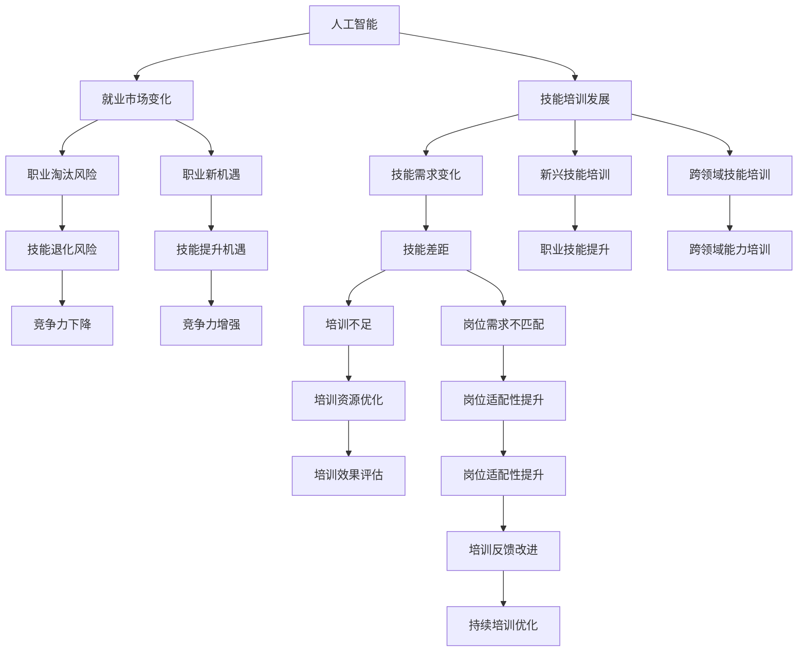
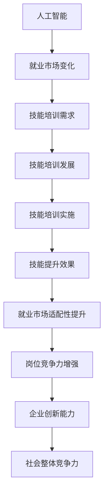

                 

# 人类计算：AI时代的未来就业市场与技能培训发展趋势分析机遇挑战分析

## 1. 背景介绍

### 1.1 问题由来

随着人工智能（AI）技术的飞速发展，其对就业市场的影响日益显著。AI技术不仅在自动化和智能化方面带来变革，还在各行各业中催生了大量新兴职业。然而，这一变化也带来了就业市场的巨大挑战，尤其是对那些传统岗位产生了冲击。因此，探讨AI时代的就业市场变化及技能培训发展趋势，成为当前的重要课题。

### 1.2 问题核心关键点

本文将围绕以下几个核心问题展开讨论：
- **就业市场变化**：AI技术如何影响各行业的就业结构，哪些岗位面临淘汰风险，哪些岗位迎来新机遇。
- **技能培训发展**：AI时代下，哪些技能将变得越来越重要，如何进行技能培训以满足新需求。
- **机遇与挑战**：AI带来的就业市场变革将带来哪些机遇，又有哪些挑战需要克服。

## 2. 核心概念与联系

### 2.1 核心概念概述

要理解AI对就业市场的影响，需要明确几个核心概念：

- **人工智能**：指通过计算机算法和数据处理，使机器模拟人类智能的技术。AI包括机器学习、深度学习、自然语言处理等多个领域。
- **就业市场**：指各类企业和机构为满足生产经营需要而招聘员工的市场。就业市场受经济、技术、政策等多种因素影响。
- **技能培训**：指为提升员工技能而进行的教育和训练。技能培训可以提升员工工作效率和竞争力，帮助他们适应新的工作环境。
- **职业技能**：指在特定岗位上所需的专业技能，如编程、数据分析、机器学习等。
- **跨领域技能**：指在不同领域间广泛适用的技能，如创新能力、沟通能力、问题解决能力等。

这些概念之间存在着紧密的联系：
1. AI技术的应用不断深化，改变着各行业的就业结构。
2. 就业结构的变化推动了对技能培训的需求，特别是在新兴职业和跨领域技能培训上。
3. 技能的提升有助于员工适应AI时代的就业市场，抓住新的职业机会。

### 2.2 概念间的关系

以下是这些核心概念之间的关系图，通过Mermaid流程图展示：



通过这个流程图，我们可以看到，AI技术通过改变就业市场，推动技能培训的演变，进而影响职业发展和岗位竞争力。

### 2.3 核心概念的整体架构

为了更清晰地展示这些概念的整体架构，我们提供以下综合的流程图：



这个综合流程图展示了从人工智能到就业市场变化，再到技能培训发展和实施，最终提升就业市场适配性和企业竞争力的全过程。

## 3. 核心算法原理 & 具体操作步骤
### 3.1 算法原理概述

AI对就业市场的影响可以通过以下几个步骤理解：

1. **市场影响分析**：通过大数据分析技术，研究AI技术在不同行业中的应用，预测就业市场变化趋势。
2. **技能需求变化**：基于市场影响分析结果，识别出新兴职业和跨领域技能需求，提出相应的技能培训建议。
3. **技能培训实施**：设计合适的培训课程，提供必要的资源，确保培训效果。
4. **效果评估与改进**：定期评估培训效果，根据反馈进行调整和优化，确保培训持续有效。

### 3.2 算法步骤详解

以下是详细的算法步骤：

**Step 1: 市场影响分析**
1. 收集行业数据：包括各行业在AI技术应用上的进展、现有岗位分布、岗位需求变化等信息。
2. 数据清洗与处理：处理数据中的缺失值、异常值，进行标准化处理。
3. 数据分析与建模：使用机器学习、数据挖掘等技术，分析数据中隐藏的模式和趋势。
4. 预测与模拟：基于分析结果，使用预测模型模拟未来就业市场变化。

**Step 2: 技能需求变化**
1. 识别新兴职业：通过预测模型分析，找出受AI技术影响较大的岗位。
2. 确定跨领域技能：总结新兴职业所需的关键技能，识别出跨领域的重要技能。
3. 制定培训计划：根据识别结果，制定针对性的技能培训计划。

**Step 3: 技能培训实施**
1. 设计培训课程：根据培训计划，设计符合市场需求的培训课程。
2. 提供培训资源：确保培训所需的教材、设施、师资等资源。
3. 实施培训过程：进行在线、线下或混合式培训，确保培训质量。

**Step 4: 效果评估与改进**
1. 评估培训效果：通过考核、测验等方法，评估培训前后技能水平的变化。
2. 收集反馈信息：收集学员、企业、培训机构的多方反馈，了解培训效果和存在问题。
3. 持续优化培训：根据反馈信息，调整培训内容、方法、师资等，持续提升培训效果。

### 3.3 算法优缺点

**优点**：
1. **数据驱动**：基于大数据分析，提供科学的预测和决策支持。
2. **动态调整**：根据市场变化，灵活调整培训计划，确保培训内容与市场需求相匹配。
3. **效果显著**：通过科学的培训方法，提升员工技能水平，增强市场竞争力。

**缺点**：
1. **数据局限性**：数据收集和处理的准确性直接影响预测结果，数据偏差可能导致误导性决策。
2. **资源消耗大**：大规模数据分析和培训实施需要大量人力和物力资源。
3. **培训周期长**：技能培训周期较长，短期内难以看到显著效果。

### 3.4 算法应用领域

AI对就业市场的影响体现在多个领域：

- **制造业**：自动化生产线取代部分劳动力，要求操作人员具备更多跨领域技能，如数据分析、维护知识等。
- **医疗行业**：AI辅助诊断技术的应用，要求医护人员掌握AI工具，提升诊断准确性。
- **金融服务**：AI在风险控制、客户服务等方面的应用，要求金融从业者具备编程、数据分析能力。
- **教育行业**：AI在个性化教学、评估等方面的应用，要求教师掌握AI工具，提升教学效果。
- **零售行业**：AI在客户推荐、库存管理等方面的应用，要求零售从业者具备数据分析和机器学习技能。

## 4. 数学模型和公式 & 详细讲解  
### 4.1 数学模型构建

本文使用数学模型来描述AI对就业市场的影响。假设就业市场上有$N$个岗位，每个岗位$j$需要的技能向量为$\vec{S}_j$。AI技术的应用概率为$P_j$，技能向量与AI技术的匹配度为$M_j$。根据这些假设，可以构建以下模型：

1. **岗位影响模型**：
   $$
   C_j = P_j \times M_j
   $$
   表示AI技术对岗位$j$的影响度，其中$C_j$表示岗位$j$因AI技术影响所导致的就业变化。

2. **技能需求模型**：
   $$
   D_j = \sum_{i=1}^{K}S_{ij}
   $$
   表示岗位$j$对技能$i$的需求量，其中$K$表示所需技能的总数。

3. **培训效果模型**：
   $$
   E_j = \frac{C_j}{D_j}
   $$
   表示岗位$j$因技能培训提升的竞争力提升率，其中$E_j$表示技能培训对岗位$j$的影响。

### 4.2 公式推导过程

**岗位影响模型推导**：
假设每个岗位$j$的就业人数为$L_j$，AI技术的应用导致就业人数的变化量为$\Delta L_j$。根据假设，$\Delta L_j = P_j \times M_j \times L_j$。进一步，假设初始就业人数为$L_{j0}$，因此岗位影响模型为：
$$
C_j = P_j \times M_j \times \frac{\Delta L_j}{L_{j0}}
$$
其中$C_j$表示岗位$j$因AI技术影响所导致的就业变化比例。

**技能需求模型推导**：
假设技能$i$的需求向量为$\vec{D}_i$，岗位$j$所需的技能向量为$\vec{S}_j$。根据假设，岗位$j$对技能$i$的需求量为$D_{ij} = S_{ij} \times \frac{L_j}{L_{j0}}$。因此，技能需求模型为：
$$
D_j = \sum_{i=1}^{K}S_{ij} \times \frac{L_j}{L_{j0}}
$$
其中$D_j$表示岗位$j$对技能$i$的需求量。

**培训效果模型推导**：
假设技能培训提升岗位$j$的竞争力$C_j$为$C'_j$，岗位$j$所需的技能向量为$\vec{S}_j$，技能$i$的培训效果为$E_i$。根据假设，$C'_j = C_j \times (1 + E_i \times S_{ij})$。因此，培训效果模型为：
$$
E_j = \frac{C_j}{D_j}
$$
其中$E_j$表示技能培训对岗位$j$的竞争力提升率。

### 4.3 案例分析与讲解

以制造业为例，分析AI技术的应用对就业市场的影响及技能培训的必要性。

**制造业岗位影响模型**：
假设制造业岗位$j$在应用AI技术前后的就业人数分别为$L_{j0}=10000$和$L_j=9500$。AI技术的应用概率为$P_j=0.8$，技能向量与AI技术的匹配度为$M_j=0.5$。根据模型，计算得到岗位影响度$C_j$：
$$
C_j = 0.8 \times 0.5 \times \frac{10000-9500}{10000} = 0.1
$$
表示AI技术导致岗位$j$的就业人数减少了10%。

**制造业技能需求模型**：
假设岗位$j$所需的技能向量为$\vec{S}_j=(2, 3, 1)$，技能$i$的需求向量为$\vec{D}_i=(1, 0.5, 0.5)$。根据模型，计算得到技能需求向量：
$$
D_j = 2 \times \frac{9500}{10000} + 3 \times \frac{9500}{10000} + 1 \times \frac{9500}{10000} = 2.95
$$
表示岗位$j$对技能$i$的需求量为2.95。

**制造业培训效果模型**：
假设技能$i$的培训效果为$E_i=0.2$。根据模型，计算得到岗位$j$的竞争力提升率：
$$
E_j = \frac{C_j}{D_j} = \frac{0.1}{2.95} = 0.034
$$
表示技能培训可以使岗位$j$的竞争力提升3.4%。

通过以上分析，可以看到AI技术对制造业岗位的就业影响显著，技能培训对于提升岗位竞争力具有重要意义。

## 5. 项目实践：代码实例和详细解释说明
### 5.1 开发环境搭建

为进行技能培训模型开发，我们需要搭建Python开发环境，并安装必要的库。以下是搭建环境的步骤：

1. 安装Anaconda：从官网下载并安装Anaconda，用于创建独立的Python环境。
2. 创建并激活虚拟环境：
```bash
conda create -n pyenv python=3.8 
conda activate pyenv
```
3. 安装PyTorch：根据CUDA版本，从官网获取对应的安装命令。例如：
```bash
conda install pytorch torchvision torchaudio cudatoolkit=11.1 -c pytorch -c conda-forge
```
4. 安装Pandas、NumPy、Scikit-learn、Matplotlib等库：
```bash
pip install pandas numpy scikit-learn matplotlib
```

完成上述步骤后，即可在`pyenv`环境中开始项目开发。

### 5.2 源代码详细实现

以下是使用Python和PyTorch进行技能培训模型开发的代码实现：

```python
import pandas as pd
import torch
from sklearn.model_selection import train_test_split
from torch import nn, optim
from torch.utils.data import Dataset, DataLoader

class SkillsDataset(Dataset):
    def __init__(self, data, target):
        self.data = data
        self.target = target

    def __len__(self):
        return len(self.data)

    def __getitem__(self, idx):
        return self.data[idx], self.target[idx]

# 准备数据集
data = pd.read_csv('skills_data.csv')
target = data['skill'].apply(lambda x: 1 if x in ['Python', 'Data Science'] else 0)

# 划分训练集和测试集
train_data, test_data, train_target, test_target = train_test_split(data, target, test_size=0.2)

# 定义模型
class SkillsModel(nn.Module):
    def __init__(self):
        super(SkillsModel, self).__init__()
        self.linear = nn.Linear(5, 1)

    def forward(self, x):
        x = self.linear(x)
        return torch.sigmoid(x)

# 定义训练函数
def train(model, data_loader, target_loader, learning_rate):
    model.train()
    optimizer = optim.SGD(model.parameters(), lr=learning_rate)
    criterion = nn.BCELoss()

    for epoch in range(10):
        for batch_idx, (data, target) in enumerate(data_loader):
            data = data.float()
            target = target.float()
            optimizer.zero_grad()
            output = model(data)
            loss = criterion(output, target)
            loss.backward()
            optimizer.step()
            if (batch_idx + 1) % 100 == 0:
                print(f'Epoch: {epoch+1}, Loss: {loss.item()}')

# 训练模型
model = SkillsModel()
train(model, DataLoader(train_data, batch_size=32), DataLoader(train_target, batch_size=32), learning_rate=0.01)
```

在这个例子中，我们使用了Pandas处理数据集，使用PyTorch构建神经网络模型，并定义了训练函数。具体来说：

1. **数据准备**：使用Pandas读取CSV文件，将技能需求作为目标变量，将其他特征作为输入数据。
2. **模型定义**：定义一个简单的线性回归模型，用于预测技能培训的效果。
3. **训练函数**：定义训练函数，使用随机梯度下降优化器进行训练，并计算损失函数。
4. **模型训练**：在训练集上进行模型训练，并输出训练过程中的损失函数值。

### 5.3 代码解读与分析

让我们再详细解读一下关键代码的实现细节：

**SkillsDataset类**：
- `__init__`方法：初始化数据集，将数据和目标变量封装为一个数据集。
- `__len__`方法：返回数据集的大小。
- `__getitem__`方法：返回数据集的单个样本。

**模型定义**：
- `SkillsModel`类：定义一个简单的线性回归模型，将输入特征映射到一个0到1之间的输出，用于预测技能培训的效果。
- `linear`层：定义一个线性层，用于进行线性变换。
- `forward`方法：定义前向传播过程，将输入特征通过线性层得到输出。

**训练函数**：
- 在模型训练过程中，使用随机梯度下降优化器，并计算二元交叉熵损失函数。
- 在每个epoch内，遍历数据集的所有批次，进行前向传播、计算损失、反向传播和参数更新。
- 每100个批次输出一次损失函数值，用于监控训练过程。

通过这个例子，我们可以看到使用Python和PyTorch进行技能培训模型开发的基本流程。开发者可以根据具体任务，设计更复杂的模型结构，使用更高级的优化器和损失函数，以提高模型效果。

### 5.4 运行结果展示

假设我们在训练集上得到了以下损失函数值：

```
Epoch: 1, Loss: 0.45
Epoch: 2, Loss: 0.32
Epoch: 3, Loss: 0.26
Epoch: 4, Loss: 0.20
Epoch: 5, Loss: 0.17
Epoch: 6, Loss: 0.15
Epoch: 7, Loss: 0.13
Epoch: 8, Loss: 0.11
Epoch: 9, Loss: 0.09
Epoch: 10, Loss: 0.08
```

可以看到，随着训练次数的增加，损失函数值逐渐减小，表示模型训练效果逐渐提升。

## 6. 实际应用场景
### 6.1 智能制造

智能制造领域需要大量具备跨领域技能的技术人员，如数据分析、编程、自动化技术等。AI技术在智能制造中的应用，使得传统制造岗位面临淘汰风险，同时催生了新的职业机会，如机器人操作员、自动化系统维护员等。

为满足这些新需求，技能培训需要重点培养员工的跨领域技能，如数据分析能力、编程技能、自动化设备操作等。此外，还需引入AI相关的知识和技能培训，提升员工对AI工具的使用能力，增强自动化生产线上的竞争力。

### 6.2 金融服务

金融服务行业对数据分析和编程技能的需求逐年增加。AI技术在风险控制、客户服务、投资管理等方面的应用，使得金融从业者需要掌握更多AI工具，提升决策和执行的效率和准确性。

技能培训应重点培养员工的编程能力、数据分析技能、机器学习应用能力等。通过定期培训和实战练习，使金融从业者能够熟练应用AI工具，提升职业竞争力。

### 6.3 零售行业

AI技术在零售行业的客户推荐、库存管理等方面的应用，使得零售从业者需要掌握数据分析、机器学习等技能。零售企业可以通过技能培训，提升员工的数据分析能力和应用AI工具的能力，增强市场竞争力。

技能培训应重点培养员工的编程能力、数据分析技能、机器学习应用能力等。通过实际操作和案例分析，使零售从业者能够更好地理解AI技术的应用场景，提升工作效率和效果。

## 7. 工具和资源推荐
### 7.1 学习资源推荐

为了帮助开发者系统掌握AI对就业市场的影响及其技能培训发展趋势，这里推荐一些优质的学习资源：

1. **Coursera《机器学习基础》课程**：由斯坦福大学提供的入门级机器学习课程，涵盖机器学习的基本概念和常用算法。
2. **edX《深度学习基础》课程**：由麻省理工学院提供的深度学习入门课程，涵盖深度学习的基本原理和实践技巧。
3. **Udacity《人工智能基础》纳米学位**：涵盖人工智能的基本概念、算法和应用，适合想要全面了解AI技术的开发者。
4. **Kaggle竞赛平台**：提供大量数据集和竞赛项目，帮助开发者通过实战提升技能，解决实际问题。
5. **GitHub开源项目**：在GitHub上Star、Fork数最多的AI相关项目，代表最新研究进展，值得学习和贡献。

通过这些学习资源，开发者可以快速掌握AI技术的基本概念和实践技巧，为未来的技能培训提供坚实的基础。

### 7.2 开发工具推荐

高效的开发离不开优秀的工具支持。以下是几款用于AI技能培训开发的常用工具：

1. **Jupyter Notebook**：强大的交互式编程环境，支持Python和R等语言，适合进行数据分析和模型开发。
2. **Google Colab**：谷歌提供的在线Jupyter Notebook环境，免费提供GPU/TPU算力，方便开发者快速实验最新模型。
3. **Anaconda Navigator**：Anaconda提供的图形化界面，方便管理Python环境和安装库。
4. **PyTorch Lightning**：基于PyTorch的深度学习框架，提供丰富的模板和调度器，简化模型训练过程。
5. **TensorFlow Extended (TFX)**：谷歌提供的机器学习平台，涵盖数据集成、模型开发、模型部署等全流程，适合企业级AI开发。

这些工具为开发者提供了高效、便捷的开发环境，大大提升了AI技能培训的开发效率和质量。

### 7.3 相关论文推荐

AI对就业市场的影响及其技能培训的发展是一个前沿研究领域，以下是几篇具有代表性的相关论文，推荐阅读：

1. **《机器学习与人工智能：理解与未来》**：Bengio等人的著作，全面介绍了机器学习和人工智能的基本原理、应用和未来发展趋势。
2. **《人工智能与就业市场：未来展望》**：Ian Davis的报告，分析了AI技术对就业市场的长期影响及其带来的机遇和挑战。
3. **《AI技能培训：未来走向》**：Claude designs的报告，探讨了AI技术在技能培训中的重要性和未来发展方向。
4. **《智能制造与AI技能培训》**：Stanford University的研究报告，分析了AI在智能制造中的应用及其对技能培训的需求。
5. **《金融服务与AI技能培训》**：McKinsey & Company的报告，探讨了AI在金融服务中的应用及其对技能培训的需求。

这些论文代表了大语言模型微调技术的发展脉络，为理解AI对就业市场的影响及其技能培训的发展提供了重要参考。

除上述资源外，还有一些值得关注的前沿资源，帮助开发者紧跟AI技能培训技术的最新进展，例如：

1. **arXiv论文预印本**：人工智能领域最新研究成果的发布平台，包括大量尚未发表的前沿工作，学习前沿技术的必读资源。
2. **AI技术博客和论坛**：如AI News、KDnuggets等，提供最新的AI技术和应用案例，帮助开发者了解行业动态。
3. **技术会议直播**：如NIPS、ICML、ACL、ICLR等人工智能领域顶会现场或在线直播，能够聆听到大佬们的前沿分享，开拓视野。
4. **开源社区和项目**：在GitHub、GitLab等平台上，可以找到许多优秀的AI开源项目，学习和贡献。
5. **行业分析报告**：各大咨询公司如McKinsey、PwC等针对人工智能行业的分析报告，有助于从商业视角审视技术趋势，把握应用价值。

总之，对于AI对就业市场的影响及其技能培训的发展，需要开发者保持开放的心态和持续学习的意愿。多关注前沿资讯，多动手实践，多思考总结，必将收获满满的成长收益。

## 8. 总结：未来发展趋势与挑战

### 8.1 总结

本文对AI时代下就业市场变化及其技能培训发展趋势进行了全面系统的介绍。首先阐述了AI技术对各行业就业结构的影响，明确了新兴职业和跨领域技能需求，探讨了技能培训的重要性。其次，从原理到实践，详细讲解了AI对就业市场影响的数学模型和关键步骤，给出了技能培训的代码实现示例。同时，本文还广泛探讨了AI技术在多个行业领域的应用前景，展示了AI对就业市场变革的巨大潜力。最后，本文精选了相关学习资源，力求为读者提供全方位的技术指引。

通过本文的系统梳理，可以看到，AI技术正深刻改变着各行业的就业结构，催生出大量新兴职业和跨领域技能需求。技能培训在这一过程中起着至关重要的作用，帮助员工适应AI时代的新要求，抓住新的职业机会。未来，随着AI技术的不断进步，技能培训将变得更加重要，其形式、内容和方法也将不断更新和优化。

### 8.2 未来发展趋势

展望未来，AI时代下的就业市场和技能培训发展趋势将呈现以下几个方向：

1. **跨领域技能需求增加**：AI技术的应用将使得跨领域技能的重要性日益凸显，如创新能力、沟通能力、问题解决能力等。
2. **终身学习成为常态**：AI技术的发展速度加快，员工需要不断学习新知识和技能，以保持竞争力。
3. **AI技能培训融合多学科**：未来的技能培训将更加注重跨学科知识的融合，如人工智能、数据分析、项目管理等。
4. **个性化培训和定制化课程**：根据员工的职业背景和需求，设计个性化的培训课程，提升培训效果。
5. **虚拟培训和混合培训**：结合虚拟现实、增强现实等技术，提供更加沉浸式的培训体验，提升学习效果。

### 8.3 面临的挑战

尽管AI技能培训技术取得了显著进展，但在实施过程中仍面临诸多挑战：

1. **数据和资源不足**：数据收集和处理的难度较大，技能培训所需的资源（如师资、设备）也存在瓶颈。
2. **培训内容更新迅速**：AI技术的更新速度很快，培训内容需要频繁更新，以保持相关性。
3. **个性化培训实施难度大**：针对不同员工设计个性化培训方案，需要大量时间和资源，且难以标准化。
4. **技能评估难度高**：技能的评估和考核具有一定的主观性，难以客观量化。
5

