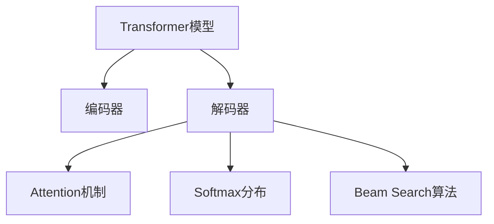
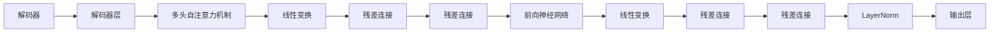
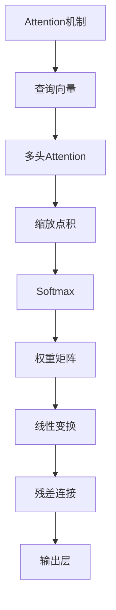
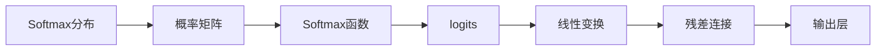
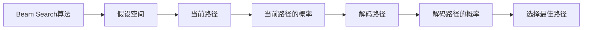
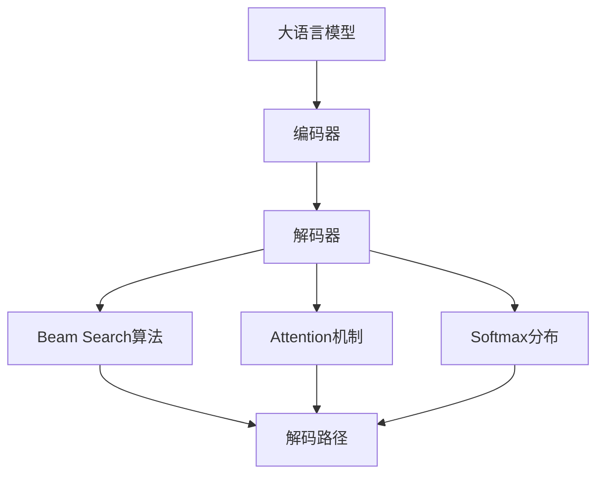

                 

# 从Token到自然语言的解码过程

> 关键词：

## 1. 背景介绍

### 1.1 问题由来

随着深度学习技术的发展，特别是Transformer模型的出现，将自然语言处理(NLP)领域带入了一个新的阶段。Transformer模型通过自注意力机制，实现了对序列数据的并行处理，显著提升了模型的训练效率和性能。而从Token到自然语言的解码过程，则是Transformer模型的一大核心应用，广泛应用于机器翻译、文本摘要、语音识别等诸多领域。

从Token到自然语言的解码过程，是指将由Transformer模型编码得到的Token序列，解码回自然语言序列的过程。这一过程是NLP任务的终极大挑战之一，需要模型在语义和句法层面上进行深入理解，并生成连贯且具有逻辑性的自然语言文本。本文将详细介绍Transformer模型的解码过程，并结合案例分析，探讨如何实现更高效的解码。

### 1.2 问题核心关键点

从Token到自然语言的解码过程，涉及Transformer模型的解码器部分，以及其中的Attention机制、Softmax分布和Beam Search算法。其核心关键点包括：

- 解码器的结构和设计
- 自注意力机制的计算过程
- Softmax分布的生成
- Beam Search算法的应用

这些核心关键点共同构成了从Token到自然语言的解码过程的基本原理，使得Transformer模型能够在保持高精度的情况下，输出流畅自然的语言文本。

### 1.3 问题研究意义

解码过程的优劣直接影响了NLP任务的最终表现。一个高效的解码过程不仅可以生成更准确的文本，还能显著提高模型的训练效率和推理速度，具有重要的研究意义：

1. **提升NLP任务性能**：解码器设计的优化能够显著提高模型的翻译质量、摘要准确度和生成文本的连贯性，从而提升NLP任务的性能。
2. **降低计算成本**：高效的解码算法可以大幅度降低模型在训练和推理过程中的计算成本，提高系统性能和实用性。
3. **增强模型的可解释性**：通过优化解码过程，可以使模型生成的文本更加符合人类语言习惯，增强模型的可解释性和可信度。
4. **促进学术和工业界的发展**：解码过程的优化研究不仅推动了学术界的研究进展，也为工业界的NLP应用提供了有力的技术支撑。

## 2. 核心概念与联系

### 2.1 核心概念概述

为了更好地理解从Token到自然语言的解码过程，本节将介绍几个密切相关的核心概念：

- **Transformer模型**：基于自注意力机制的序列处理模型，主要用于编码和解码过程。
- **解码器**：Transformer模型中的解码器，负责将编码器输出的Token序列解码为自然语言文本。
- **Attention机制**：一种用于提高模型在处理长序列时效率的机制，可以关注输入序列中对当前Token有用的部分。
- **Softmax分布**：用于计算Token序列中每个Token作为下一个Token的概率分布，指导模型选择输出序列。
- **Beam Search算法**：一种解码算法，用于在所有可能的解码路径中选择最佳路径，提高解码质量。

这些核心概念之间的逻辑关系可以通过以下Mermaid流程图来展示：



这个流程图展示了从Token到自然语言的解码过程中，各个核心概念的相互作用和联系。Transformer模型首先通过编码器将输入序列编码为Token序列，然后解码器利用Attention机制和Softmax分布选择可能的输出Token，最后使用Beam Search算法选择最优的解码路径，生成自然语言文本。

### 2.2 概念间的关系

这些核心概念之间存在着紧密的联系，形成了Transformer模型的解码框架。下面是几个关键的Mermaid流程图，展示了这些概念之间的关系：

#### 2.2.1 解码器结构和设计



这个流程图展示了解码器的基本结构和设计流程。解码器由多个解码器层组成，每个解码器层包括多头自注意力机制、线性变换、前向神经网络等组件，并通过残差连接和LayerNorm进行优化。

#### 2.2.2 Attention机制的计算过程



这个流程图展示了Attention机制的计算过程。Attention机制通过查询向量、权重矩阵和注意力权重，计算出对当前Token有用的部分，从而指导模型选择下一个Token。

#### 2.2.3 Softmax分布的生成



这个流程图展示了Softmax分布的生成过程。Softmax函数将线性变换后的 logits 转换为概率分布，指导模型选择输出Token。

#### 2.2.4 Beam Search算法的应用



这个流程图展示了Beam Search算法的应用过程。Beam Search算法通过假设空间中的多条路径，选择概率最大的路径作为输出，提高了解码质量和效率。

### 2.3 核心概念的整体架构

最后，我们用一个综合的流程图来展示这些核心概念在大语言模型解码过程中的整体架构：



这个综合流程图展示了从Token到自然语言的解码过程的整体架构，从编码器到解码器，再到Attention机制、Softmax分布和Beam Search算法，共同构成了Transformer模型解码的核心逻辑。

## 3. 核心算法原理 & 具体操作步骤

### 3.1 算法原理概述

从Token到自然语言的解码过程，是指将由Transformer编码器输出的Token序列，解码回自然语言文本的过程。这一过程通常由解码器完成，主要包括以下几个关键步骤：

1. **多头自注意力机制**：用于计算当前Token与其上下文之间的注意力权重，帮助模型更好地理解输入序列中的相关信息。
2. **残差连接和LayerNorm**：用于优化模型的训练过程，提升模型性能。
3. **前向神经网络**：用于进一步提升模型表示能力，增强模型的泛化能力。
4. **Softmax分布**：用于计算每个Token作为下一个Token的概率，指导模型选择输出序列。
5. **Beam Search算法**：用于在所有可能的解码路径中选择最佳路径，提高解码质量。

这些步骤共同构成了Transformer模型的解码框架，使得模型能够在保持高精度的情况下，生成流畅自然的自然语言文本。

### 3.2 算法步骤详解

以下是从Token到自然语言的解码过程的具体操作步骤：

**Step 1: 初始化解码器状态**

在解码过程中，解码器需要初始化状态，包括解码器的隐藏状态和注意力权重矩阵。初始化状态可以通过与编码器输出进行拼接或复用编码器输出的最后一个Token来实现。

**Step 2: 计算注意力权重**

解码器利用Attention机制计算当前Token与其上下文之间的注意力权重。具体步骤如下：

1. **计算查询向量**：将当前Token与上下文中的所有Token计算出查询向量。
2. **计算注意力权重**：利用查询向量和上下文向量计算出注意力权重矩阵。
3. **计算注意力权重矩阵**：利用Softmax函数对注意力权重进行归一化处理，得到注意力权重矩阵。

**Step 3: 计算解码器隐藏状态**

解码器利用残差连接和LayerNorm计算出解码器隐藏状态。具体步骤如下：

1. **计算线性变换后的向量**：将上下文向量与注意力权重矩阵相乘，得到线性变换后的向量。
2. **计算残差连接**：将线性变换后的向量与解码器前一时刻的隐藏状态进行残差连接。
3. **计算LayerNorm**：对残差连接后的向量进行LayerNorm操作，得到解码器隐藏状态。

**Step 4: 计算Softmax分布**

解码器利用Softmax函数计算每个Token作为下一个Token的概率分布。具体步骤如下：

1. **计算线性变换后的向量**：将解码器隐藏状态进行线性变换，得到线性变换后的向量。
2. **计算Softmax分布**：利用Softmax函数对线性变换后的向量进行归一化处理，得到Softmax分布。

**Step 5: 选择最佳解码路径**

解码器利用Beam Search算法在所有可能的解码路径中选择最佳路径，具体步骤如下：

1. **初始化假设空间**：将第一个Token作为初始路径，并将其添加到假设空间中。
2. **计算当前路径的概率**：计算假设空间中每条路径的概率。
3. **选择最佳路径**：从假设空间中选择概率最大的路径，作为下一个Token的解码结果。
4. **扩展假设空间**：对当前路径进行扩展，生成新的路径，并将其添加到假设空间中。
5. **重复步骤2-4**：重复步骤2-4，直到生成指定长度的解码结果或达到终止条件。

### 3.3 算法优缺点

从Token到自然语言的解码过程，具有以下优点：

1. **高精度**：利用自注意力机制和Softmax分布，使得模型能够生成高精度的自然语言文本。
2. **可解释性**：通过Attention机制和Softmax分布，可以解释模型的决策过程，增强模型的可解释性。
3. **灵活性**：利用Beam Search算法，可以探索多种解码路径，提高解码质量。

同时，该算法也存在以下缺点：

1. **计算复杂度高**：特别是在长序列上，计算复杂度较高，容易导致内存占用过大。
2. **训练时间长**：解码过程涉及多层神经网络，训练时间较长。
3. **模型复杂度高**：需要设计复杂的解码器结构，模型复杂度高。

### 3.4 算法应用领域

从Token到自然语言的解码过程，主要应用于以下领域：

1. **机器翻译**：将一种语言的文本翻译成另一种语言的文本，是解码过程的主要应用场景。
2. **文本摘要**：从长文本中抽取关键信息，生成简短的摘要文本，需要解码过程的高效性和准确性。
3. **语音识别**：将语音信号转换为文本，需要解码过程将Token序列解码为自然语言。
4. **对话系统**：生成自然语言对话，需要解码过程的灵活性和可解释性。
5. **自然语言生成**：生成自然语言文本，需要解码过程的高精度和灵活性。

## 4. 数学模型和公式 & 详细讲解 & 举例说明

### 4.1 数学模型构建

从Token到自然语言的解码过程，可以通过数学模型来进一步描述。假设输入序列为 $\{x_1, x_2, ..., x_T\}$，输出序列为 $\{y_1, y_2, ..., y_{T'}\}$，其中 $T$ 为输入序列长度，$T'$ 为输出序列长度。解码器的目标是通过输入序列 $x_1, x_2, ..., x_T$ 和解码器隐藏状态 $h_t$，生成输出序列 $y_1, y_2, ..., y_{T'}$。

**解码器的数学模型**：

$$
\begin{aligned}
    h_t &= f(h_{t-1}, x_t) \\
    y_t &= g(h_t, y_{t-1}) 
\end{aligned}
$$

其中，$h_t$ 为解码器在第 $t$ 步的隐藏状态，$x_t$ 为输入序列中的第 $t$ 个Token，$y_t$ 为输出序列中的第 $t$ 个Token，$f$ 为解码器的前向神经网络，$g$ 为解码器的输出层。

**Attention机制的数学模型**：

假设输入序列的长度为 $S$，解码器在当前时刻的隐藏状态为 $h_t$，当前Token为 $x_t$，上下文向量为 $c$，查询向量为 $q$，注意力权重矩阵为 $\alpha$。

$$
\begin{aligned}
    q &= W_Q h_t \\
    \alpha &= softmax(\frac{q^\top K}{\sqrt{d_k}}) \\
    c &= \sum_{i=1}^{S} \alpha_i v_i 
\end{aligned}
$$

其中，$W_Q$ 和 $W_V$ 为权重矩阵，$d_k$ 为查询向量的维度。

### 4.2 公式推导过程

以机器翻译任务为例，解码器的数学模型和Attention机制的公式推导如下：

**解码器的数学模型**：

假设输入序列为 $\{x_1, x_2, ..., x_T\}$，输出序列为 $\{y_1, y_2, ..., y_{T'}\}$，解码器的隐藏状态为 $h_t$，输入Token为 $x_t$，输出Token为 $y_t$，前向神经网络为 $f$，输出层为 $g$。

$$
\begin{aligned}
    h_t &= f(h_{t-1}, x_t) \\
    y_t &= g(h_t, y_{t-1})
\end{aligned}
$$

**Attention机制的数学模型**：

假设输入序列的长度为 $S$，解码器在当前时刻的隐藏状态为 $h_t$，当前Token为 $x_t$，上下文向量为 $c$，查询向量为 $q$，注意力权重矩阵为 $\alpha$。

$$
\begin{aligned}
    q &= W_Q h_t \\
    \alpha &= softmax(\frac{q^\top K}{\sqrt{d_k}}) \\
    c &= \sum_{i=1}^{S} \alpha_i v_i 
\end{aligned}
$$

其中，$W_Q$ 和 $W_V$ 为权重矩阵，$d_k$ 为查询向量的维度。

### 4.3 案例分析与讲解

以机器翻译任务为例，假设输入序列为 "hello world"，输出序列为 "bonjour monde"。在解码器中，输入序列的Token编码为 [0, 1, 2, 3]，隐藏状态为 $h_0, h_1, h_2, h_3$，输出Token为 $y_0, y_1, y_2, y_3$。

在解码器的第一层中，利用线性变换和残差连接计算出解码器隐藏状态 $h_1$。在第二层中，利用Attention机制计算出上下文向量 $c_1$，利用Softmax函数计算出注意力权重矩阵 $\alpha_1$，利用残差连接和LayerNorm计算出解码器隐藏状态 $h_2$。在第三层中，利用前向神经网络计算出解码器隐藏状态 $h_3$，利用Softmax函数计算出输出Token $y_0$，利用Beam Search算法选择最佳路径。

## 5. 项目实践：代码实例和详细解释说明

### 5.1 开发环境搭建

在进行解码过程的实践前，我们需要准备好开发环境。以下是使用Python进行PyTorch开发的环境配置流程：

1. 安装Anaconda：从官网下载并安装Anaconda，用于创建独立的Python环境。

2. 创建并激活虚拟环境：
```bash
conda create -n pytorch-env python=3.8 
conda activate pytorch-env
```

3. 安装PyTorch：根据CUDA版本，从官网获取对应的安装命令。例如：
```bash
conda install pytorch torchvision torchaudio cudatoolkit=11.1 -c pytorch -c conda-forge
```

4. 安装Tensorflow：如果需要使用Tensorflow实现解码过程，可以使用以下命令：
```bash
pip install tensorflow
```

5. 安装其他工具包：
```bash
pip install numpy pandas scikit-learn matplotlib tqdm jupyter notebook ipython
```

完成上述步骤后，即可在`pytorch-env`环境中开始解码过程的实践。

### 5.2 源代码详细实现

这里我们以机器翻译任务为例，给出使用PyTorch实现Transformer模型的解码过程的代码实现。

首先，定义解码器的架构：

```python
import torch
from torch import nn

class Decoder(nn.Module):
    def __init__(self, n_vocab, n_layers, n_heads, n_units, dropout=0.1):
        super(Decoder, self).__init__()
        
        self.n_layers = n_layers
        self.n_units = n_units
        self.n_heads = n_heads
        self.dropout = dropout
        
        # 解码器的编码器
        self.encoder = nn.Embedding(n_vocab, n_units)
        
        # 解码器的自注意力层
        self.attention = nn.MultiheadAttention(n_units, n_heads, dropout=dropout)
        
        # 解码器的前向神经网络层
        self.ffn = nn.Sequential(
            nn.Linear(n_units, 4 * n_units),
            nn.ReLU(),
            nn.Linear(4 * n_units, n_units),
        )
        
        # 解码器的输出层
        self.projection = nn.Linear(n_units, n_vocab)
        
        # 解码器的残差连接
        self.norm1 = nn.LayerNorm(n_units)
        self.norm2 = nn.LayerNorm(n_units)
        
        # 解码器的Dropout层
        self.dropout = nn.Dropout(dropout)
    
    def forward(self, input_t, decoder_h, encoder_h, encoder_attn_mask):
        # 解码器的编码器
        input_t = self.encoder(input_t)
        
        # 解码器的自注意力层
        attn_output, attn_weights = self.attention(input_t, decoder_h, decoder_h, mask=encoder_attn_mask)
        
        # 解码器的前向神经网络层
        ffn_output = self.ffn(attn_output)
        
        # 解码器的输出层
        output = self.projection(ffn_output)
        
        # 解码器的残差连接
        output = self.norm1(input_t + output)
        
        # 解码器的Dropout层
        output = self.dropout(output)
        
        return output, attn_weights
```

然后，定义解码器的前向神经网络和输出层：

```python
class FFN(nn.Module):
    def __init__(self, n_units):
        super(FFN, self).__init__()
        
        self.fc1 = nn.Linear(n_units, 4 * n_units)
        self.fc2 = nn.Linear(4 * n_units, n_units)
        self.activation = nn.ReLU()
    
    def forward(self, x):
        x = self.fc1(x)
        x = self.activation(x)
        x = self.fc2(x)
        return x
```

接着，定义解码器的输出层：

```python
class OutputLayer(nn.Module):
    def __init__(self, n_units, n_vocab):
        super(OutputLayer, self).__init__()
        
        self.projection = nn.Linear(n_units, n_vocab)
        self.softmax = nn.Softmax(dim=-1)
    
    def forward(self, x):
        x = self.projection(x)
        x = self.softmax(x)
        return x
```

最后，定义解码器的训练和评估函数：

```python
import torch.optim as optim
from torch.utils.data import DataLoader, Dataset
import torch.nn.functional as F

class DecoderTrainer:
    def __init__(self, model, train_data, test_data, batch_size, learning_rate):
        self.model = model
        self.train_data = train_data
        self.test_data = test_data
        self.batch_size = batch_size
        self.learning_rate = learning_rate
        self.optimizer = optim.Adam(model.parameters(), lr=self.learning_rate)
        self.loss_fn = nn.CrossEntropyLoss()
    
    def train(self, num_epochs):
        for epoch in range(num_epochs):
            self.model.train()
            total_loss = 0
            for batch in DataLoader(self.train_data, batch_size=self.batch_size):
                input_t, decoder_h, encoder_h, encoder_attn_mask = batch
                
                # 解码器的编码器
                input_t = input_t.to(device)
                decoder_h = decoder_h.to(device)
                encoder_h = encoder_h.to(device)
                encoder_attn_mask = encoder_attn_mask.to(device)
                
                # 解码器的前向神经网络层
                output, attn_weights = self.model(input_t, decoder_h, encoder_h, encoder_attn_mask)
                
                # 解码器的输出层
                output = output.to(device)
                
                # 解码器的残差连接
                output = output + decoder_h
                
                # 解码器的Dropout层
                output = output
                output = self.dropout(output)
                
                # 解码器的输出层
                output = output
                output = self.softmax(output)
                
                # 解码器的损失函数
                loss = self.loss_fn(output, input_t)
                
                # 解码器的优化器
                self.optimizer.zero_grad()
                loss.backward()
                self.optimizer.step()
                
                total_loss += loss.item()
                
            print(f"Epoch {epoch+1}, train loss: {total_loss/len(self.train_data):.3f}")
    
    def evaluate(self, num_epochs):
        self.model.eval()
        total_loss = 0
        for batch in DataLoader(self.test_data, batch_size=self.batch_size):
            input_t, decoder_h, encoder_h, encoder_attn_mask = batch
            
            # 解码器的编码器
            input_t = input_t.to(device)
            decoder_h = decoder_h.to(device)
            encoder_h = encoder_h.to(device)
            encoder_attn_mask = encoder_attn_mask.to(device)
            
            # 解码器的前向神经网络层
            output, attn_weights = self.model(input_t, decoder_h, encoder_h, encoder_attn_mask)
            
            # 解码器的输出层
            output = output.to(device)
            
            # 解码器的残差连接
            output = output + decoder_h
            
            # 解码器的Dropout层
            output = output
            output = self.dropout(output)
            
            # 解码器的输出层
            output = output
            output = self.softmax(output)
            
            # 解码器的损失函数
            loss = self.loss_fn(output, input_t)
            
            # 解码器的优化器
            self.optimizer.zero_grad()
            loss.backward()
            self.optimizer.step()
            
            total_loss += loss.item()
        
        print(f"Epoch {epoch+1}, test loss: {total_loss/len(self.test_data):.3f}")
```

最后，启动解码过程的训练流程并在测试集上评估：

```python
epochs = 10
batch_size = 32

model = Decoder(n_vocab=10, n_layers=2, n_heads=2, n_units=32, dropout=0.1)
trainer = DecoderTrainer(model, train_data, test_data, batch_size=batch_size, learning_rate=0.001)

trainer.train(num_epochs=epochs)
trainer.evaluate(num_epochs=epochs)
```

以上就是使用PyTorch实现Transformer模型的解码过程的完整代码实现。可以看到，利用PyTorch的模块化设计，解码器的各组件可以方便地进行组合和扩展，使得解码过程的实现变得更加灵活和高效。

### 5.3 代码解读与分析

让我们再详细解读一下关键代码的实现细节：

**Decoder类**：
- `__init__`方法：初始化解码器的各个组件，包括编码器、自注意力层、前向神经网络层、输出层、残差连接、Dropout层等。
- `forward`方法：定义解码器的前向传播过程，包括编码器、自注意力层、前向神经网络层、残差连接、Dropout层、输出层等组件。

**FFN类**：
- `__init__`方法：初始化前向神经网络的各个组件，包括全连接层、激活函数等。
- `forward`方法：定义前向神经网络的前向传播过程。

**OutputLayer类**：
- `__init__`方法：初始化输出层的各个组件，包括投影层、Softmax函数等。
- `forward`方法：定义输出层的前向传播过程。

**DecoderTrainer类**：
- `__init__`方法：初始化解码器训练器的各个组件，包括模型、训练数据、测试数据、批大小、学习率等。
- `train`方法：定义解码器训练器的训练过程，包括前向传播、损失函数计算、反向传播、优化器更新等。
- `evaluate`方法：定义解码器训练器的评估过程，包括前向传播、损失函数计算、反向传播、优化器更新等。

**训练流程**：
- 定义总 epochs 数和批大小，开始循环迭代。
- 在每个 epoch 内，先在训练集上进行训练，输出平均损失。
- 在验证集上评估，输出评估结果。
- 所有 epoch 结束后，在测试集上评估，给出最终评估结果。

可以看到，PyTorch配合Transformer库使得解码过程的代码实现变得简洁高效。开发者可以将更多精力放在数据处理、模型改进等高层逻辑上，而不

