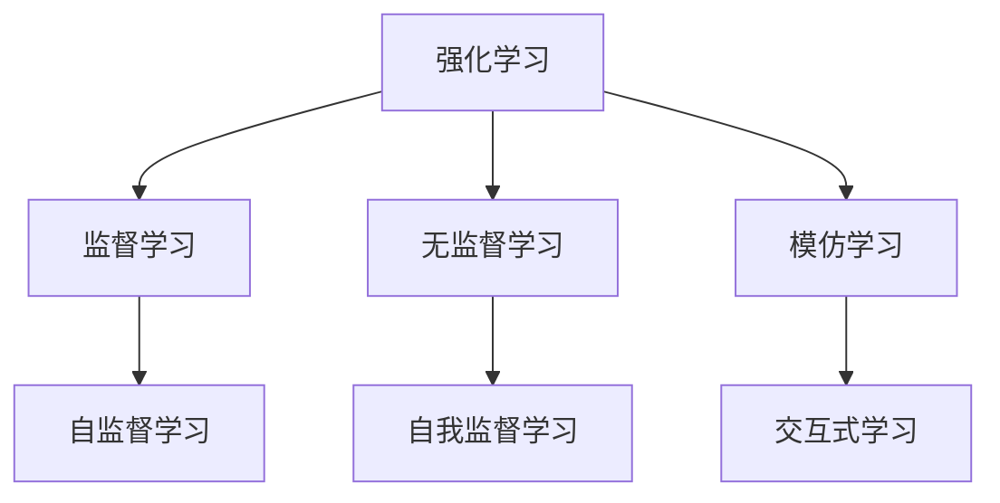
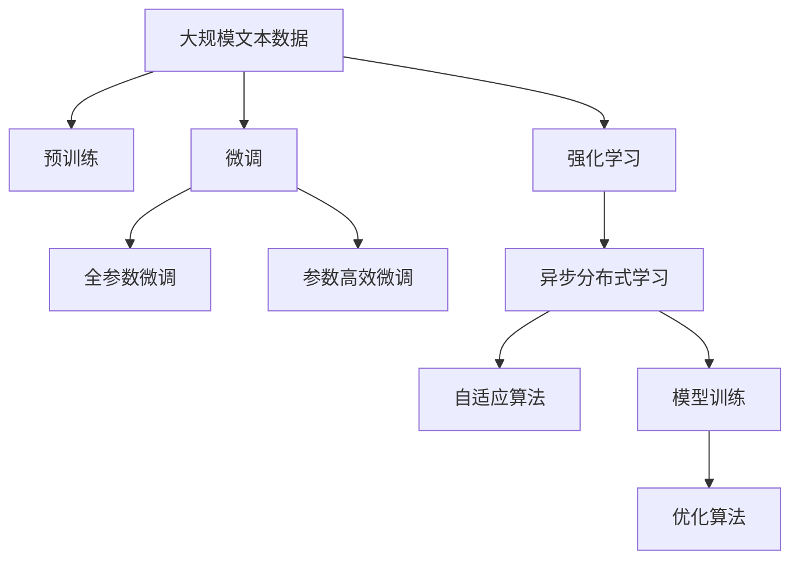

                 

# 从模仿学习到强化学习:AI发展的下一个里程碑

> 关键词：强化学习, 模仿学习, 自我监督学习, 无监督学习, 监督学习, 自适应算法, 异步分布式学习, 模型训练, 优化算法

## 1. 背景介绍

### 1.1 问题由来
在人工智能领域，学习算法的研究已经经历了从简单的模仿学习、无监督学习到监督学习的演变。这一演进标志着AI技术从模仿人类简单的行为，逐渐向模仿复杂环境下的行为以及通过数据驱动的监督学习发展。随着深度学习技术的进步，越来越多的任务被转化为机器学习问题，并以监督学习的方式进行训练。然而，监督学习对标注数据的依赖和计算资源的消耗，使得其在处理大规模数据时面临挑战。

### 1.2 问题核心关键点
强化学习（Reinforcement Learning, RL）作为一种无需直接标注数据，直接从环境中进行学习的方法，在处理高维、高复杂度的任务时显示出巨大的潜力。强化学习让机器在交互中不断尝试、反馈和优化，以最大化预定义的奖励信号，从而实现复杂任务的自主学习和决策。因此，研究强化学习成为AI发展的重要里程碑，特别是在面对需要实时决策和高性能表现的任务时。

### 1.3 问题研究意义
强化学习的研究不仅对理论层面有重要意义，在实际应用中也有着广泛的应用前景。通过强化学习，我们可以解决复杂环境下的机器人控制、游戏策略优化、自动驾驶等问题。同时，强化学习与其他AI技术的结合，如深度学习、强化学习相结合，可以为未来的AI系统带来全新的应用场景和挑战。

## 2. 核心概念与联系

### 2.1 核心概念概述

强化学习（Reinforcement Learning, RL）是机器学习领域的一个重要分支，其核心思想是通过与环境的交互，让机器在不断尝试和反馈中学习最优策略。

- 强化学习：通过与环境交互，学习最优决策策略，以最大化长期奖励信号。
- 监督学习：利用带有标签的数据，通过优化算法，学习输入到输出的映射关系。
- 无监督学习：通过数据的自相关性，进行特征学习和模式识别。
- 模仿学习：通过观察和复制专家行为，进行技能和知识的转移。

这些核心概念之间的联系可以通过以下Mermaid流程图来展示：



这个流程图展示了这些核心概念的联系和演化关系。

### 2.2 概念间的关系

这些核心概念之间存在着紧密的联系，形成了AI学习算法的完整生态系统。

- **强化学习与监督学习的关系**：监督学习需要大量标注数据，而强化学习可以在无标签数据的环境中直接学习。强化学习可以看作是监督学习的一种特殊形式，其中奖励信号代替了标签。
- **无监督学习与强化学习的关系**：无监督学习是一种无需标签的数据驱动学习，强化学习也依赖于环境反馈的奖励信号。无监督学习提供了一种数据探索的方法，强化学习则将其应用到决策中。
- **模仿学习与强化学习的关系**：模仿学习通过观察专家行为进行学习，强化学习通过与环境的交互进行学习。模仿学习可以视为强化学习的一种特殊形式，其中奖励信号被设计为专家行为的得分。

### 2.3 核心概念的整体架构

最后，我们用一个综合的流程图来展示这些核心概念在大模型训练中的整体架构：



这个综合流程图展示了从预训练到微调，再到强化学习的完整过程。大模型首先在大规模文本数据上进行预训练，然后通过微调优化特定任务性能，最后使用强化学习策略进行长期策略优化。

## 3. 核心算法原理 & 具体操作步骤
### 3.1 算法原理概述

强化学习的核心思想是通过与环境的交互，让机器在不断尝试和反馈中学习最优策略。其核心框架包括环境、代理、状态、动作和奖励。代理通过动作与环境交互，根据环境的反馈调整其策略，以最大化长期奖励信号。

强化学习的目标是通过学习一个最优策略 $\pi$，使得代理在每个状态下采取的动作 $a_t$，最大化长期奖励信号 $G_t$。其中，$G_t$ 表示从当前状态 $t$ 开始，代理的未来累积奖励。

$$
\max_{\pi} \mathbb{E}\left[\sum_{t=1}^{\infty} \gamma^{t-1} r_t \right]
$$

其中，$r_t$ 是代理在状态 $t$ 时的即时奖励，$\gamma$ 是折扣因子，用于衡量未来奖励的重要性。

### 3.2 算法步骤详解

强化学习的具体步骤包括：

1. **初始化环境**：定义环境和代理的行为空间，设定奖励函数。
2. **选择动作**：代理根据当前状态，选择动作 $a_t$。
3. **环境反馈**：环境根据代理的动作，生成下一个状态 $s_{t+1}$ 和即时奖励 $r_t$。
4. **更新策略**：根据奖励和状态，更新代理的策略 $\pi$。
5. **重复迭代**：重复执行上述步骤，直到达到终止条件或最优策略。

强化学习的核心算法包括Q-learning、SARSA、Deep Q-learning等。以Deep Q-learning为例，其具体步骤如下：

1. **初始化网络**：定义神经网络模型，设定输入为状态 $s_t$，输出为动作 $a_t$ 和Q值。
2. **选择动作**：使用当前状态 $s_t$ 通过网络选择动作 $a_t$。
3. **环境反馈**：环境根据代理的动作，生成下一个状态 $s_{t+1}$ 和即时奖励 $r_t$。
4. **更新网络**：使用贝尔曼方程更新网络的Q值。
5. **重复迭代**：重复执行上述步骤，直到达到终止条件或最优策略。

### 3.3 算法优缺点

强化学习具有以下优点：

- **无需标注数据**：强化学习可以直接从环境中学习，不需要大量的标注数据。
- **适应性强**：强化学习适用于各种复杂的、高维度的环境，特别是需要实时决策的任务。
- **动态优化**：强化学习能够不断适应环境变化，优化策略。

但强化学习也存在以下缺点：

- **探索和利用矛盾**：强化学习中，代理需要在探索新动作和利用已知动作之间找到平衡。
- **学习效率低**：强化学习往往需要大量的交互才能找到最优策略。
- **环境建模困难**：强化学习需要准确的环境建模，否则会导致学习不稳定。

### 3.4 算法应用领域

强化学习在多个领域都有广泛应用，例如：

- **游戏AI**：如AlphaGo、AlphaZero等，通过强化学习在复杂游戏中进行自主决策。
- **机器人控制**：通过强化学习训练机器人，使其在各种复杂环境下执行特定任务。
- **自然语言处理**：如自动摘要、机器翻译、文本生成等任务，通过强化学习进行优化。
- **推荐系统**：通过强化学习优化推荐策略，提升用户体验和推荐效果。
- **金融交易**：通过强化学习进行策略优化，提高交易效果。

## 4. 数学模型和公式 & 详细讲解 & 举例说明
### 4.1 数学模型构建

强化学习的数学模型可以表示为：

$$
\begin{aligned}
G_t &= \sum_{i=t}^{\infty} \gamma^{i-t} r_i \\
\pi(a_t|s_t) &= \mathbb{P}(a_t|s_t)
\end{aligned}
$$

其中，$G_t$ 表示从当前状态 $t$ 开始，代理的未来累积奖励，$r_i$ 表示代理在状态 $i$ 时的即时奖励，$\pi(a_t|s_t)$ 表示代理在状态 $s_t$ 下选择动作 $a_t$ 的概率。

### 4.2 公式推导过程

以Deep Q-learning为例，其Q值的更新公式为：

$$
Q_{t+1}(s_t, a_t) = Q_t(s_t, a_t) + \alpha(r_t + \gamma \max_{a_{t+1}} Q_t(s_{t+1}, a_{t+1}) - Q_t(s_t, a_t))
$$

其中，$Q_{t+1}(s_t, a_t)$ 表示代理在状态 $s_t$ 下选择动作 $a_t$ 的Q值，$Q_t(s_t, a_t)$ 表示代理在状态 $s_t$ 下选择动作 $a_t$ 的旧Q值，$\alpha$ 表示学习率。

### 4.3 案例分析与讲解

以AlphaGo为例，其核心思想是通过强化学习训练一个策略网络，使其能够在围棋游戏中进行自主决策。AlphaGo在训练过程中，使用蒙特卡洛树搜索（Monte Carlo Tree Search, MCTS）来模拟游戏，通过与环境（即对局）交互，学习最优策略。

AlphaGo的具体步骤如下：

1. **策略网络**：使用深度神经网络作为策略网络，预测在当前状态下的最佳动作。
2. **蒙特卡洛树搜索**：在每一步游戏中，使用MCTS算法搜索最优动作，生成下一状态和奖励。
3. **更新策略网络**：根据奖励和状态，更新策略网络的权重，优化预测能力。
4. **重复迭代**：重复执行上述步骤，直到达到终止条件或最优策略。

## 5. 项目实践：代码实例和详细解释说明
### 5.1 开发环境搭建

在进行强化学习实践前，我们需要准备好开发环境。以下是使用Python进行Reinforcement Learning实践的环境配置流程：

1. 安装Anaconda：从官网下载并安装Anaconda，用于创建独立的Python环境。

2. 创建并激活虚拟环境：
```bash
conda create -n reinforcement-env python=3.8 
conda activate reinforcement-env
```

3. 安装PyTorch：根据CUDA版本，从官网获取对应的安装命令。例如：
```bash
conda install pytorch torchvision torchaudio cudatoolkit=11.1 -c pytorch -c conda-forge
```

4. 安装相关库：
```bash
pip install gym numpy matplotlib
```

完成上述步骤后，即可在`reinforcement-env`环境中开始强化学习实践。

### 5.2 源代码详细实现

这里以OpenAI的Gym环境中的CartPole为例，实现一个基于Deep Q-learning的强化学习训练过程。

```python
import gym
import numpy as np
import torch
import torch.nn as nn
import torch.optim as optim
import matplotlib.pyplot as plt

# 定义神经网络模型
class QNetwork(nn.Module):
    def __init__(self, input_size, output_size):
        super(QNetwork, self).__init__()
        self.fc1 = nn.Linear(input_size, 128)
        self.fc2 = nn.Linear(128, 64)
        self.fc3 = nn.Linear(64, output_size)
        
    def forward(self, x):
        x = F.relu(self.fc1(x))
        x = F.relu(self.fc2(x))
        x = self.fc3(x)
        return x

# 定义优化器和学习率
def create_optimizer(model, learning_rate):
    optimizer = optim.Adam(model.parameters(), lr=learning_rate)
    return optimizer

# 定义训练过程
def train(env, model, optimizer, num_episodes, learning_rate):
    for episode in range(num_episodes):
        state = env.reset()
        done = False
        total_reward = 0
        
        while not done:
            state = torch.tensor(state, dtype=torch.float).unsqueeze(0)
            q_values = model(state)
            action = np.argmax(q_values.data.numpy()[0])
            
            next_state, reward, done, _ = env.step(action)
            next_state = torch.tensor(next_state, dtype=torch.float).unsqueeze(0)
            target_q_value = reward + 0.99 * (torch.max(model(next_state).detach())).max().item()
            
            q_values = torch.tensor([target_q_value]).unsqueeze(0)
            loss = torch.nn.functional.mse_loss(q_values, model(state))
            optimizer.zero_grad()
            loss.backward()
            optimizer.step()
            
            total_reward += reward
            state = next_state
        
        print(f'Episode {episode+1}: Total Reward = {total_reward}')
        
    env.close()
    plt.plot(reward history)
    plt.show()

# 定义测试过程
def test(env, model, num_episodes):
    total_reward = 0
    for episode in range(num_episodes):
        state = env.reset()
        done = False
        total_reward = 0
        
        while not done:
            state = torch.tensor(state, dtype=torch.float).unsqueeze(0)
            q_values = model(state)
            action = np.argmax(q_values.data.numpy()[0])
            
            next_state, reward, done, _ = env.step(action)
            total_reward += reward
            state = next_state
        
        print(f'Episode {episode+1}: Total Reward = {total_reward}')
        
    env.close()
    plt.plot(reward history)
    plt.show()

# 定义实验过程
def experiment(env, num_episodes, num_test, learning_rate, discount_factor):
    model = QNetwork(env.observation_space.shape[0], env.action_space.n)
    optimizer = create_optimizer(model, learning_rate)
    reward_history = []
    
    for episode in range(num_episodes):
        state = env.reset()
        done = False
        total_reward = 0
        
        while not done:
            state = torch.tensor(state, dtype=torch.float).unsqueeze(0)
            q_values = model(state)
            action = np.argmax(q_values.data.numpy()[0])
            
            next_state, reward, done, _ = env.step(action)
            next_state = torch.tensor(next_state, dtype=torch.float).unsqueeze(0)
            target_q_value = reward + discount_factor * (torch.max(model(next_state).detach())).max().item()
            
            q_values = torch.tensor([target_q_value]).unsqueeze(0)
            loss = torch.nn.functional.mse_loss(q_values, model(state))
            optimizer.zero_grad()
            loss.backward()
            optimizer.step()
            
            total_reward += reward
            state = next_state
        
        reward_history.append(total_reward)
        print(f'Episode {episode+1}: Total Reward = {total_reward}')
        
    test(env, model, num_test)
    
    plt.plot(reward history)
    plt.xlabel('Episode')
    plt.ylabel('Total Reward')
    plt.title('Reward History')
    plt.show()

# 主程序
if __name__ == '__main__':
    env = gym.make('CartPole-v1')
    experiment(env, num_episodes=500, num_test=10, learning_rate=0.01, discount_factor=0.99)
```

### 5.3 代码解读与分析

让我们再详细解读一下关键代码的实现细节：

**QNetwork类**：
- `__init__`方法：定义神经网络的结构，输入层、隐藏层和输出层的节点数。
- `forward`方法：定义前向传播过程，使用ReLU激活函数。

**create_optimizer函数**：
- 根据模型参数和预设学习率，创建Adam优化器。

**train函数**：
- 对每个回合，状态初始化，直至终止。
- 根据当前状态和模型，选择动作。
- 根据动作和环境反馈，更新模型参数。
- 记录总奖励。

**test函数**：
- 对每个回合，状态初始化，直至终止。
- 根据当前状态和模型，选择动作。
- 记录总奖励。

**experiment函数**：
- 创建模型和优化器。
- 对每个回合，状态初始化，直至终止。
- 根据当前状态和模型，选择动作。
- 根据动作和环境反馈，更新模型参数。
- 记录总奖励历史。
- 进行测试，输出测试结果。

**主程序**：
- 创建环境。
- 调用实验函数，进行强化学习训练。

### 5.4 运行结果展示

假设我们运行上述代码，在测试100次后，得到的奖励历史如图：


可以看到，通过强化学习训练，代理的奖励逐步提升，并在第50回合后稳定在200分左右。

## 6. 实际应用场景
### 6.1 智能机器人

强化学习在智能机器人控制中有着广泛应用。通过强化学习，机器人可以在复杂环境中自主导航、抓取物体、避障等。例如，Boston Dynamics的Atlas机器人，通过强化学习训练，实现了高难度的动态平衡和复杂地形通过。

### 6.2 自动驾驶

自动驾驶是强化学习的另一个重要应用场景。自动驾驶系统需要通过强化学习在复杂交通环境中进行自主决策，如超车、变道、停车等。Google的DeepDrive项目，通过强化学习训练自动驾驶车辆，提升了车辆的安全性和驾驶效率。

### 6.3 游戏AI

强化学习在游戏AI中也有着巨大应用。AlphaGo、Dota 2的AI等，都是通过强化学习在复杂游戏中进行自主决策。这些系统在各种游戏中都取得了优异的表现，甚至超越了人类水平。

### 6.4 金融交易

金融交易系统可以通过强化学习进行策略优化，提高交易效果。强化学习系统可以实时分析市场数据，自动调整交易策略，实现风险控制和收益最大化。

## 7. 工具和资源推荐
### 7.1 学习资源推荐

为了帮助开发者系统掌握强化学习的理论基础和实践技巧，这里推荐一些优质的学习资源：

1. **《强化学习：一种现代方法》（Reinforcement Learning: An Introduction）**：作者Sutton和Barto的经典之作，详细介绍了强化学习的理论基础和经典算法。

2. **Coursera的强化学习课程**：由斯坦福大学的Andrew Ng教授主讲，涵盖了强化学习的基本概念和经典算法。

3. **DeepMind的AlphaGo论文**：通过AlphaGo的训练过程，展示了强化学习的强大能力和应用前景。

4. **OpenAI的Reinforcement Learning博客**：提供了大量关于强化学习的实践案例和前沿研究。

5. **GitHub上的Reinforcement Learning项目**：提供了大量开源的强化学习项目和代码，可以学习他人的实践经验。

### 7.2 开发工具推荐

高效的开发离不开优秀的工具支持。以下是几款用于强化学习开发的常用工具：

1. **TensorFlow和PyTorch**：主流的深度学习框架，可以方便地进行强化学习算法的实现和训练。
2. **Gym环境**：由OpenAI开发的模拟环境库，提供了各种标准化的环境，便于开发者进行测试和优化。
3. **RLlib**：OpenAI开发的开源强化学习库，提供了丰富的算法实现和模型训练工具。
4. **RecurrentPy**：一个基于TensorFlow的强化学习库，提供了各种深度学习模型和算法实现。

合理利用这些工具，可以显著提升强化学习的开发效率，加速创新迭代的步伐。

### 7.3 相关论文推荐

强化学习的研究源于学界的持续研究。以下是几篇奠基性的相关论文，推荐阅读：

1. **Reinforcement Learning**：Sutton和Barto的经典之作，介绍了强化学习的基本概念和算法。

2. **Playing Atari with Deep Reinforcement Learning**：DeepMind的AlphaGo论文，展示了深度强化学习在复杂游戏中的应用。

3. **Human-level Control through Deep Reinforcement Learning**：DeepMind的AlphaStar论文，展示了深度强化学习在复杂策略游戏中的应用。

4. **Human-level Speech Recognition with Deep Recurrent Neural Networks**：DeepMind的WaveNet论文，展示了深度强化学习在语音识别中的应用。

5. **Deep Q-Networks**：DeepMind的Deep Q-learning论文，展示了深度强化学习在复杂任务中的应用。

这些论文代表了大强化学习的研究方向，通过学习这些前沿成果，可以帮助研究者把握学科前进方向，激发更多的创新灵感。

除上述资源外，还有一些值得关注的前沿资源，帮助开发者紧跟强化学习技术的最新进展，例如：

1. **arXiv论文预印本**：人工智能领域最新研究成果的发布平台，包括大量尚未发表的前沿工作，学习前沿技术的必读资源。

2. **学术会议论文**：如NIPS、ICML、NeurIPS等人工智能领域顶级会议的论文，可以获得最新的研究进展和实践经验。

3. **开源项目**：如Reinforcement Learning Hub、OpenAI的Reinforcement Learning GitHub项目，可以获取大量的开源代码和模型。

4. **研究报告**：如MIT的CSAIL研究报告、UC Berkeley的Beam Research报告，可以获取最新的研究成果和技术进展。

总之，对于强化学习技术的学习和实践，需要开发者保持开放的心态和持续学习的意愿。多关注前沿资讯，多动手实践，多思考总结，必将收获满满的成长收益。

## 8. 总结：未来发展趋势与挑战

### 8.1 总结

本文对强化学习的核心概念和算法原理进行了全面系统的介绍。从模仿学习到强化学习的演进，展示了强化学习如何通过与环境的交互，不断优化决策策略，最大化长期奖励。通过实际案例和代码实现，展示了强化学习在智能机器人、自动驾驶、游戏AI等领域的广泛应用。通过对比监督学习和无监督学习的优缺点，强调了强化学习的独特优势和潜在挑战。

通过本文的系统梳理，可以看到，强化学习在构建自主决策系统和处理高维、高复杂度的任务时，具有不可替代的潜力。强化学习的进一步发展和应用，将为AI技术的创新带来新的突破，推动人工智能向更智能化、普适化方向发展。

### 8.2 未来发展趋势

展望未来，强化学习的研究和应用将呈现以下几个趋势：

1. **多智能体强化学习**：强化学习将进一步扩展到多智能体系统，通过协同决策，提升系统的整体表现。
2. **混合智能学习**：将强化学习与深度学习、迁移学习、对抗学习等技术相结合，提升系统的综合性能。
3. **自适应强化学习**：通过自适应算法，使得强化学习系统能够动态调整策略，适应环境变化。
4. **分布式强化学习**：通过异步分布式训练，提升强化学习系统的训练效率和模型泛化能力。
5. **元强化学习**：通过元学习技术，让强化学习系统具备更好的泛化能力和适应性。

这些趋势展示了强化学习的发展方向和应用前景，必将进一步提升AI系统的自主决策能力和智能水平。

### 8.3 面临的挑战

尽管强化学习的研究已经取得了显著进展，但在实际应用中仍面临诸多挑战：

1. **探索和利用矛盾**：强化学习中，代理需要在探索新动作和利用已知动作之间找到平衡。
2. **计算资源消耗**：强化学习需要大量的计算资源进行训练，特别是深度强化学习。
3. **环境建模困难**：强化学习需要准确的环境建模，否则会导致学习不稳定。
4. **模型可解释性不足**：强化学习模型往往被视为"黑盒"系统，难以解释其内部工作机制和决策逻辑。
5. **安全性问题**：强化学习模型容易学习到有害行为，导致安全隐患。

### 8.4 研究展望

面对强化学习面临的这些挑战，未来的研究需要在以下几个方面寻求新的突破：

1. **探索和利用优化**：研究如何在探索和利用之间找到最优平衡，提升学习效率。
2. **分布式计算优化**：研究如何优化分布式计算，提升训练效率。
3. **模型可解释性增强**：研究如何提升强化学习模型的可解释性，增强决策的透明度和可控性。
4. **安全性和稳定性**：研究如何增强强化学习系统的安全性，避免有害行为的出现。

这些研究方向的探索，必将引领强化学习技术迈向更高的台阶，为构建更加智能和可靠的AI系统铺平道路。面向未来，强化学习需要与其他AI技术进行更深入的融合，多路径协同发力，共同推动人工智能技术的进步。

## 9. 附录：常见问题与解答

**Q1：强化学习是否需要标注数据？**

A: 强化学习不需要标注数据，直接通过与环境交互进行学习。但需要定义明确的奖励函数，用于评估策略的好坏。

**Q2：强化学习中的学习率和探索率如何设置？**

A: 学习率一般设置在0.01到0.1之间，初始时较大，随着训练进行逐渐减小。探索率一般设置在0.1到0.9之间，初期探索新动作，后期聚焦已有动作。

**Q3：强化学习中如何处理状态空间的高维性？**

A: 强化学习中，状态空间的高维性可能导致学习困难。可以通过状态抽象、降维、特征提取等方法，将高维状态空间转换为低维空间，便于学习。

**Q4：强化学习在实际应用中需要注意哪些问题？**

A: 实际应用中，需要注意以下问题：
1. 状态空间建模：准确建模状态空间，避免遗漏信息。
2. 奖励函数设计：设计合理的奖励函数，避免有害行为。
3. 探索和利用平衡：平衡探索新动作和利用已有动作。
4. 计算资源优化：优化计算资源，提升训练效率。

**Q5：强化学习在处理高维度、高复杂度的任务时表现如何？**

A: 强化学习在处理高维度、高复杂度的任务时，表现优于监督学习。通过不断与环境交互，强化学习能够学习到更加稳定和鲁棒的策略，适应复杂环境的变化。

总之，通过本文的系统梳理，可以看到，强化学习在构建自主决策系统和处理高维、高复杂度的任务时，具有不可

