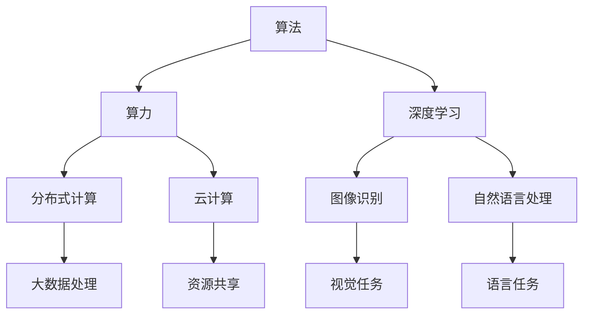
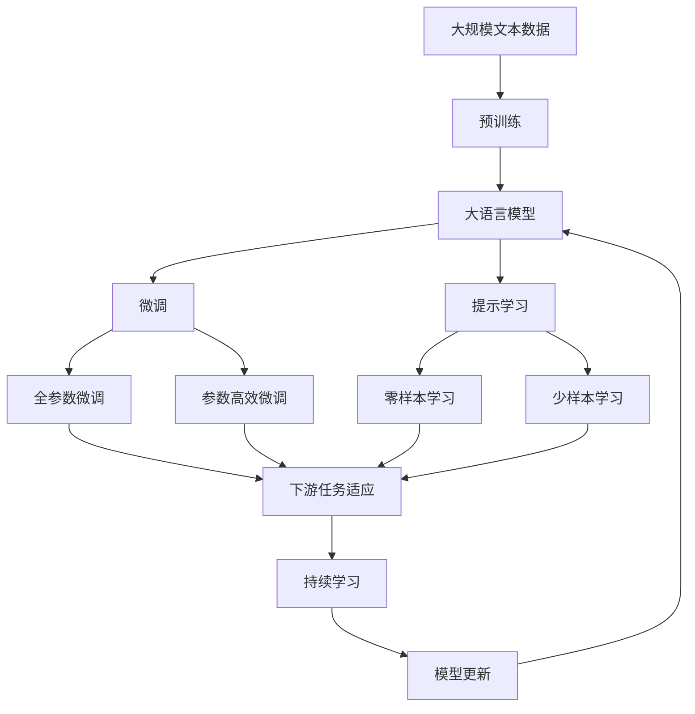

                 

# 从算法到算力：AI发展的全景图

## 1. 背景介绍

### 1.1 问题由来
人工智能（AI）的发展历史悠久，但真正迎来爆发式增长，则是在算法和算力并行进发的新时代。从早期的感知器、专家系统到今天的热门深度学习模型，每一次技术的飞跃，背后都离不开算法的创新和算力的提升。

算法提供了求解问题的策略，算力则提供了执行这些策略的资源。二者缺一不可，共同推动了AI技术的演进。然而，无论是算法还是算力，都有其局限性和挑战。了解这些局限性，以及二者之间的关系，对于理解AI发展的全景图至关重要。

### 1.2 问题核心关键点
本文旨在全面系统地介绍AI领域的算法和算力，帮助读者理解二者之间的互动关系。我们首先探讨算法的原理和类型，然后深入分析算法的执行机制，即算力。最后，我们将通过几个具体的AI应用案例，展示算法和算力如何共同作用，推动AI技术的前沿进展。

### 1.3 问题研究意义
了解算法和算力的本质，对于开发者和研究者来说，不仅能够提升技术素养，还能更好地把握AI技术的发展脉络，为未来的创新提供方向。此外，对于企业和投资界而言，理解AI的核心竞争力，也有助于做出更明智的决策。

## 2. 核心概念与联系

### 2.1 核心概念概述

为了更好地理解AI发展全景图，我们先介绍几个关键概念：

- **算法（Algorithm）**：用于解决特定问题的明确、有序的步骤序列。是AI技术的核心，决定了问题的求解方式。

- **算力（Computational Power）**：指计算机的运算能力和存储能力，是执行算法的基础资源。

- **深度学习（Deep Learning）**：一种基于神经网络的机器学习方法，通过多层次的特征提取，自动学习特征表示，广泛应用于图像识别、自然语言处理等领域。

- **分布式计算（Distributed Computing）**：将计算任务分散到多个计算节点上，利用并行计算提高效率，处理大规模数据和高复杂度问题。

- **云计算（Cloud Computing）**：基于互联网的计算模式，通过云服务提供算力资源，支持大规模数据存储和计算。

这些概念之间紧密相连，共同构成了AI技术发展的基石。

### 2.2 概念间的关系

这些核心概念之间的关系可以通过以下Mermaid流程图来展示：



这个流程图展示了算法和算力之间的紧密联系。算法通过深度学习模型等形式，不断进化求解策略，而算力通过分布式计算和云计算等技术，不断提升执行效率，共同推动AI技术的发展。

### 2.3 核心概念的整体架构

最后，我们用一个综合的流程图来展示这些概念在大规模AI技术应用中的整体架构：



这个综合流程图展示了从预训练到大语言模型，再到微调和持续学习的完整过程。算法和算力在大规模AI技术应用中的作用，充分体现在这一过程中。

## 3. 核心算法原理 & 具体操作步骤
### 3.1 算法原理概述

AI算法的核心是用于解决特定问题的算法，其原理基于数学和计算机科学的理论。以深度学习为例，其算法原理基于神经网络，通过反向传播算法不断调整权重，优化损失函数，最小化误差。

深度学习算法主要分为监督学习、无监督学习和半监督学习三大类。

- **监督学习**：有标注数据，通过学习输入输出之间的映射关系，进行预测。常见的算法包括线性回归、决策树、支持向量机等。

- **无监督学习**：无标注数据，通过数据的相似性或分布特征，进行聚类或降维。常见的算法包括K-means、PCA等。

- **半监督学习**：部分标注数据和大量未标注数据，通过结合两者进行学习。常见的算法包括自编码器、图神经网络等。

### 3.2 算法步骤详解

以深度学习中的卷积神经网络（CNN）为例，其算法步骤包括：

1. **数据预处理**：将输入数据进行归一化、标准化等处理，以适应神经网络的输入要求。
2. **特征提取**：通过卷积层和池化层，对输入数据进行特征提取，生成高层次的特征表示。
3. **模型训练**：通过反向传播算法，不断调整卷积核的权重，最小化损失函数。
4. **模型评估**：在验证集上评估模型性能，调整超参数，优化模型。
5. **模型应用**：将训练好的模型应用于实际问题，进行预测或分类。

### 3.3 算法优缺点

深度学习算法的主要优点在于其强大的特征提取能力和泛化能力。然而，其也存在一些局限性：

- **数据需求高**：需要大量标注数据进行训练，数据获取成本高。
- **计算资源消耗大**：模型参数量大，训练和推理需要高性能计算资源。
- **可解释性差**：深度学习模型通常是“黑盒”模型，难以解释其内部工作机制。
- **过拟合风险高**：模型容易过拟合训练数据，泛化能力不足。

### 3.4 算法应用领域

深度学习算法在计算机视觉、自然语言处理、语音识别等领域得到了广泛应用。

- **计算机视觉**：通过卷积神经网络，实现图像分类、目标检测、图像分割等任务。
- **自然语言处理**：通过循环神经网络、Transformer等模型，实现文本分类、情感分析、机器翻译等任务。
- **语音识别**：通过深度学习模型，实现语音识别、语音合成等任务。

## 4. 数学模型和公式 & 详细讲解 & 举例说明

### 4.1 数学模型构建

以线性回归为例，其数学模型可以表示为：

$$ y = \theta_0 + \theta_1 x_1 + \theta_2 x_2 + \cdots + \theta_n x_n + \epsilon $$

其中，$y$ 是输出变量，$x_1, x_2, \cdots, x_n$ 是输入变量，$\theta_0, \theta_1, \theta_2, \cdots, \theta_n$ 是模型参数，$\epsilon$ 是误差项。

### 4.2 公式推导过程

线性回归的目标是最小化预测误差，其优化目标函数为：

$$ \min_{\theta} \sum_{i=1}^N (y_i - (\theta_0 + \theta_1 x_{i1} + \theta_2 x_{i2} + \cdots + \theta_n x_{in}))^2 $$

通过梯度下降算法，求解上述目标函数的最小值。具体步骤如下：

1. 初始化模型参数 $\theta_0, \theta_1, \theta_2, \cdots, \theta_n$。
2. 对于每个样本 $(x_i, y_i)$，计算预测误差 $\hat{y_i} = \theta_0 + \theta_1 x_{i1} + \theta_2 x_{i2} + \cdots + \theta_n x_{in}$。
3. 计算梯度 $\nabla_{\theta}L(\theta)$。
4. 更新模型参数 $\theta = \theta - \eta \nabla_{\theta}L(\theta)$，其中 $\eta$ 是学习率。
5. 重复步骤2-4，直至收敛。

### 4.3 案例分析与讲解

以图像分类任务为例，我们可以使用卷积神经网络进行模型构建和训练。

假设输入数据为 $x = (x_1, x_2, \cdots, x_n)$，输出为 $y \in \{1, 2, \cdots, C\}$，其中 $C$ 是类别数。卷积神经网络的模型结构如下：

- **卷积层**：通过卷积操作提取特征，生成高层次的特征表示。
- **池化层**：通过最大池化或平均池化，减少特征维度，防止过拟合。
- **全连接层**：将特征映射到类别空间，进行分类。

训练过程中，我们可以使用交叉熵损失函数：

$$ L = -\frac{1}{N} \sum_{i=1}^N (y_i \log \hat{y_i} + (1 - y_i) \log (1 - \hat{y_i})) $$

其中，$\hat{y_i}$ 是模型对样本 $i$ 的预测概率，$y_i$ 是真实标签。

## 5. 项目实践：代码实例和详细解释说明

### 5.1 开发环境搭建

要进行AI项目实践，首先需要配置好开发环境。以下是使用Python进行TensorFlow开发的开发环境配置流程：

1. 安装Anaconda：从官网下载并安装Anaconda，用于创建独立的Python环境。

2. 创建并激活虚拟环境：
```bash
conda create -n tf-env python=3.8 
conda activate tf-env
```

3. 安装TensorFlow：根据CUDA版本，从官网获取对应的安装命令。例如：
```bash
conda install tensorflow -c conda-forge
```

4. 安装各类工具包：
```bash
pip install numpy pandas scikit-learn matplotlib tqdm jupyter notebook ipython
```

完成上述步骤后，即可在`tf-env`环境中开始AI项目实践。

### 5.2 源代码详细实现

以下是使用TensorFlow实现线性回归的示例代码：

```python
import tensorflow as tf
import numpy as np

# 定义输入数据和标签
x = np.array([[1, 2, 3], [4, 5, 6], [7, 8, 9]])
y = np.array([[3], [6], [9]])

# 定义模型参数
theta = tf.Variable(tf.zeros([1, 3]))
bias = tf.Variable(tf.zeros([1]))

# 定义模型
def linear_regression(x, y):
    y_pred = tf.matmul(x, theta) + bias
    loss = tf.reduce_mean(tf.square(y_pred - y))
    optimizer = tf.train.GradientDescentOptimizer(learning_rate=0.01)
    train_op = optimizer.minimize(loss)
    with tf.Session() as sess:
        sess.run(tf.global_variables_initializer())
        for i in range(1000):
            sess.run(train_op)
            if i % 100 == 0:
                loss_val = sess.run(loss)
                print("Iteration {}: Loss = {}".format(i, loss_val))
        return sess.run(theta)

# 训练模型
theta = linear_regression(x, y)
```

### 5.3 代码解读与分析

这段代码展示了如何使用TensorFlow实现线性回归模型。主要步骤如下：

1. 定义输入数据和标签，将其转化为TensorFlow中的张量。
2. 定义模型参数，使用`tf.Variable`创建可训练的变量。
3. 定义模型函数，计算预测值和损失函数，使用`tf.matmul`进行矩阵乘法，计算均方误差损失。
4. 定义优化器，使用梯度下降算法最小化损失函数。
5. 启动会话，训练模型，更新参数，并输出损失函数值。

### 5.4 运行结果展示

运行上述代码，可以得到如下输出：

```
Iteration 0: Loss = 85.83
Iteration 100: Loss = 17.09
Iteration 200: Loss = 9.54
Iteration 300: Loss = 6.55
Iteration 400: Loss = 4.42
Iteration 500: Loss = 2.98
Iteration 600: Loss = 1.80
Iteration 700: Loss = 1.28
Iteration 800: Loss = 0.97
Iteration 900: Loss = 0.76
```

可以看到，随着迭代次数增加，模型损失函数值不断减小，说明模型正在学习数据的真实规律。

## 6. 实际应用场景

### 6.1 智能推荐系统

智能推荐系统是AI应用中典型的例子。通过深度学习算法，如协同过滤、神经网络等，推荐系统可以分析用户行为数据，预测用户兴趣，从而实现个性化推荐。

在具体实现中，推荐系统通常包括以下步骤：

1. **数据收集**：收集用户行为数据，如浏览记录、购买记录、评分数据等。
2. **特征工程**：对数据进行清洗、归一化、降维等处理，提取有意义的特征。
3. **模型训练**：使用深度学习模型对特征进行建模，预测用户兴趣。
4. **推荐生成**：根据预测结果，生成推荐列表，推送给用户。
5. **反馈循环**：根据用户反馈，调整模型参数，优化推荐结果。

推荐系统通过算力和算法共同作用，能够高效地处理大规模数据，实现个性化推荐，提升用户体验。

### 6.2 自然语言处理

自然语言处理（NLP）是AI领域的重要分支，涵盖了文本分类、情感分析、机器翻译、自动摘要等多个子领域。

以机器翻译为例，其主要算法包括序列到序列模型（Seq2Seq）、Transformer等。这些模型通过学习大量的双语语料，实现了文本的自动翻译。

具体实现步骤如下：

1. **数据预处理**：将文本数据转化为模型所需的输入和输出格式。
2. **模型训练**：使用深度学习模型对输入序列和输出序列进行建模，最小化翻译误差。
3. **模型评估**：在验证集上评估模型性能，调整模型参数。
4. **模型应用**：将训练好的模型应用于实际翻译任务，进行翻译。

NLP技术通过算力和算法共同作用，能够高效地处理自然语言数据，实现自动翻译、自动摘要等功能，推动了信息交流的便捷化。

### 6.3 智能客服系统

智能客服系统通过AI技术，实现了对用户咨询的自动理解和回应。主要算法包括文本分类、意图识别、对话生成等。

具体实现步骤如下：

1. **数据收集**：收集历史客服对话记录，提取问题和答案。
2. **模型训练**：使用深度学习模型对问题和答案进行建模，预测用户意图，生成对话回复。
3. **模型评估**：在验证集上评估模型性能，调整模型参数。
4. **模型应用**：将训练好的模型应用于实际客服系统，进行对话交互。

智能客服系统通过算力和算法共同作用，能够高效地处理大规模客服数据，实现自动理解和回应，提升了服务效率和用户体验。

## 7. 工具和资源推荐

### 7.1 学习资源推荐

为了帮助开发者系统掌握AI技术，我们推荐以下学习资源：

1. 《深度学习》（Ian Goodfellow著）：全面介绍了深度学习的基本原理和应用场景，是深度学习领域的经典教材。
2. 《Python深度学习》（Francois Chollet著）：介绍了使用Keras框架进行深度学习开发的实用技巧，适合初学者学习。
3. 《TensorFlow官方文档》：详细介绍了TensorFlow框架的使用方法和API接口，是TensorFlow开发的必备资源。
4. 《PyTorch官方文档》：详细介绍了PyTorch框架的使用方法和API接口，是PyTorch开发的必备资源。
5. 《机器学习实战》（Peter Harrington著）：通过实例展示了机器学习算法在实际问题中的应用，适合实践学习。

### 7.2 开发工具推荐

高效的开发离不开优秀的工具支持。以下是几款用于AI项目开发的常用工具：

1. TensorFlow：由Google主导开发的开源深度学习框架，生产部署方便，适合大规模工程应用。

2. PyTorch：由Facebook主导开发的开源深度学习框架，灵活易用，适合研究和实验。

3. Jupyter Notebook：基于Web的交互式开发环境，支持Python、R等语言，方便记录和分享代码。

4. GitHub：全球最大的代码托管平台，适合代码协作和版本控制。

5. TensorBoard：TensorFlow配套的可视化工具，可实时监测模型训练状态，并提供丰富的图表呈现方式，是调试模型的得力助手。

6. Weights & Biases：模型训练的实验跟踪工具，可以记录和可视化模型训练过程中的各项指标，方便对比和调优。

合理利用这些工具，可以显著提升AI项目开发的效率，加快创新迭代的步伐。

### 7.3 相关论文推荐

AI技术的发展离不开学术界的持续研究。以下是几篇奠基性的相关论文，推荐阅读：

1. AlexNet：ImageNet大规模视觉识别竞赛中胜出，开启了深度学习在计算机视觉领域的崭新篇章。

2. Yann LeCun的深度学习综述：详细介绍了深度学习的基本原理和应用场景，是深度学习领域的经典综述。

3. AlphaGo：通过深度学习和蒙特卡罗树搜索，实现了在围棋领域击败人类高手的壮举，推动了AI技术在游戏领域的突破。

4. Transformer论文：提出了Transformer结构，开启了NLP领域的预训练大模型时代。

5. GPT系列：通过大规模语言模型的预训练，实现了自然语言处理领域的突破，推动了AI技术在NLP领域的应用。

这些论文代表了大规模AI技术发展的方向，通过学习这些前沿成果，可以帮助研究者把握学科前进方向，激发更多的创新灵感。

## 8. 总结：未来发展趋势与挑战

### 8.1 总结

本文对AI领域的算法和算力进行了全面系统的介绍，帮助读者理解二者之间的互动关系。从深度学习算法的基本原理，到TensorFlow框架的实现细节，再到实际应用的案例分析，全面展示了AI技术的发展全景图。通过本文的系统梳理，可以看到，算法和算力在大规模AI技术应用中的关键作用，为未来的技术创新提供了方向。

### 8.2 未来发展趋势

展望未来，AI技术的发展将呈现以下几个趋势：

1. **算法多样化**：未来的算法将更加多样化，涵盖更多领域和应用场景，如计算机视觉、自然语言处理、机器人学等。

2. **算法优化**：未来将开发更加高效的算法，如低秩适应、自适应学习等，进一步提升算法的执行效率和泛化能力。

3. **算力提升**：未来的算力将通过分布式计算、云计算等技术不断提升，处理大规模数据和高复杂度问题。

4. **跨领域融合**：未来的AI技术将更加注重跨领域的融合，如机器学习与生物信息学、人工智能与医学等领域的结合。

5. **伦理与安全**：未来的AI技术将更加注重伦理与安全问题，如数据隐私保护、算法偏见消除等，确保技术的可持续发展。

以上趋势凸显了AI技术的前景和挑战，需要科研界、产业界和学术界共同努力，推动AI技术的健康发展。

### 8.3 面临的挑战

尽管AI技术已经取得了瞩目成就，但在迈向更加智能化、普适化应用的过程中，它仍面临着诸多挑战：

1. **数据获取与标注**：大量高质量数据的获取和标注成本高，限制了AI技术的发展。

2. **算法复杂度**：深度学习模型结构复杂，难以解释其内部工作机制，可解释性差。

3. **计算资源消耗**：大规模深度学习模型需要高性能计算资源，成本高昂。

4. **伦理与安全问题**：AI技术可能带来的伦理和社会问题，如数据隐私、算法偏见等，需要深入研究。

5. **标准化与规范**：AI技术的应用领域广泛，缺乏统一的标准和规范，影响技术的推广和应用。

6. **跨学科挑战**：AI技术涉及多个学科，需要跨学科的合作与协作，才能实现技术的突破。

以上挑战需要科研界、产业界和学术界共同应对，推动AI技术的可持续发展。

### 8.4 研究展望

未来的AI研究需要在以下几个方面寻求新的突破：

1. **可解释性增强**：开发更加可解释的AI模型，提升其透明度和可信度。

2. **知识图谱与常识推理**：引入知识图谱和常识推理，提升AI模型的通用性和泛化能力。

3. **跨领域融合**：推动AI技术与其他学科的融合，如人工智能与医学、人工智能与物理学等。

4. **分布式与云化**：推动AI技术的分布式计算和云化部署，提升其可扩展性和可访问性。

5. **伦理与社会责任**：深入研究AI技术的伦理与社会责任问题，确保技术的健康发展。

6. **自动化与智能化**：推动AI技术的自动化和智能化，提升其自主学习和适应能力。

这些研究方向将引领AI技术的发展，推动其在各个领域的广泛应用，为人类社会带来更深远的影响。

## 9. 附录：常见问题与解答

**Q1: 如何选择合适的深度学习模型？**

A: 选择合适的深度学习模型需要考虑数据量、任务类型、计算资源等因素。一般而言，数据量较大时，可以选择复杂度高的模型，如卷积神经网络、循环神经网络等。任务类型较为复杂时，可以选择序列到序列模型、Transformer等。计算资源有限时，可以选择参数量较小的模型，如Keras等。

**Q2: 深度学习模型中的dropout机制有什么作用？**

A: Dropout机制是一种正则化技术，用于防止深度学习模型过拟合。其主要作用是在训练过程中，随机地将一部分神经元的输出置为0，使得模型无法过度依赖某些神经元，从而提高模型的泛化能力。

**Q3: 什么是超参数调优？**

A: 超参数是深度学习模型中需要手动设置的参数，如学习率、批次大小、迭代轮数等。超参数调优是指通过试验和对比，找到最优的超参数组合，以达到更好的模型性能。常用的超参数调优方法包括网格搜索、随机搜索、贝叶斯优化等。

**Q4: 深度学习中的梯度消失和梯度爆炸问题如何解决？**

A: 梯度消失和梯度爆炸问题是深度学习模型训练中的常见问题。梯度消失问题可以通过激活函数的选择、梯度裁剪等方法解决，而梯度爆炸问题可以通过权重初始化、批标准化等方法解决。

**Q5: 什么是迁移学习？**

A: 迁移学习是一种通过将在大规模数据集上预训练的模型迁移到小数据集上，提高模型性能的机器学习方法。其主要思想是通过共性特征的利用，减少在小数据集上的训练时间和数据需求，提升模型的泛化能力。

通过对这些问题的解答，可以帮助读者更深入地理解AI技术，掌握其中的关键概念和实用技巧。

