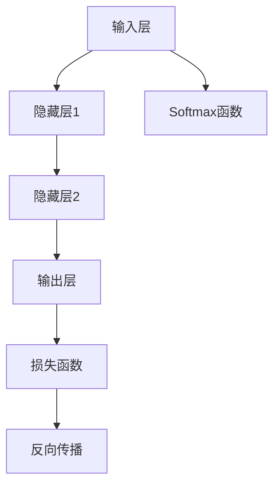
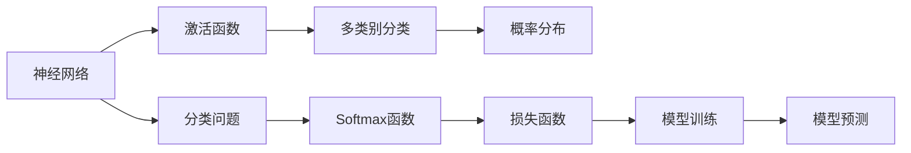

                 

# 从零开始大模型开发与微调：Softmax激活函数

> 关键词：大模型开发,Softmax激活函数,微调,神经网络,机器学习

## 1. 背景介绍

### 1.1 问题由来

在深度学习时代，神经网络已广泛应用于各类机器学习任务。然而，尽管神经网络在数据驱动的特征学习上表现优异，其内部机制和性能优化仍是许多研究者和从业者关注的焦点。Softmax激活函数作为神经网络中极为关键的组件，在分类问题中承担着将神经网络的输出映射为概率分布的任务，对模型的整体表现有着重要的影响。

本文将从基础理论出发，详细介绍Softmax激活函数的原理和使用方法，并通过一系列项目实践，进一步探讨其在实际应用中的表现和优化方法。期望通过这些内容，帮助读者深入理解Softmax激活函数，并能够在实际项目中灵活运用。

### 1.2 问题核心关键点

Softmax激活函数的核心在于其将神经网络的输出转化为概率分布，使得模型能够进行多类别分类。该函数的数学形式简单，但其作用深远，影响着模型的损失函数计算、模型训练、预测输出等各个环节。本文将从以下几个方面探讨Softmax激活函数：

1. **基本原理**：介绍Softmax函数的定义和数学推导。
2. **实现方法**：讲解Softmax函数在神经网络中的实现步骤和细节。
3. **优化技巧**：讨论Softmax函数的优化方法和策略。
4. **应用场景**：分析Softmax函数在不同机器学习任务中的应用案例。

这些关键点将帮助我们全面理解Softmax激活函数，并掌握其在实际项目中的应用技巧。

### 1.3 问题研究意义

Softmax激活函数在深度学习中的重要性不言而喻。它不仅决定了神经网络的输出形式，还影响着模型的性能和稳定性。通过深入研究Softmax激活函数，我们可以：

1. **提升模型性能**：选择合适的激活函数和优化策略，可以显著提升模型的分类准确率和泛化能力。
2. **加速模型训练**：优化激活函数的计算方法，可以加速模型训练过程，提高模型收敛速度。
3. **改善模型输出**：通过调节激活函数的参数，可以更好地控制模型的输出范围和分布，提高模型解释性。
4. **应用拓展**：Softmax函数在多类别分类、回归预测、序列生成等任务中都有广泛应用，掌握其原理和优化方法，有助于我们拓展模型应用场景。

在当今深度学习时代，掌握Softmax激活函数的使用和优化方法，对于任何希望提升模型性能和应用广度的研究者和从业者来说，都是不可或缺的。

## 2. 核心概念与联系

### 2.1 核心概念概述

要全面理解Softmax激活函数，首先需要明确几个关键概念：

1. **神经网络**：由输入层、隐藏层和输出层组成的前馈计算图，用于处理结构化或非结构化数据，并从中提取特征。
2. **激活函数**：在神经网络中，激活函数用于将神经元的输出转换为非线性特征，使得网络能够学习更加复杂的数据分布。
3. **分类问题**：将输入数据分为多个类别或标签的任务，是深度学习中应用广泛的场景。
4. **概率分布**：描述随机事件可能发生的概率，是Softmax函数的主要输出形式。
5. **多类别分类**：将输入数据分为多个类别的任务，是Softmax函数的主要应用场景。

这些概念之间存在着紧密的联系，共同构成了神经网络和机器学习模型的基础架构。以下是一个简化的神经网络结构图，展示了Softmax函数在其中的作用：



### 2.2 概念间的关系

这些概念之间的关系可以通过以下Mermaid流程图来展示：



这个流程图展示了神经网络中各个概念之间的逻辑关系：

1. 神经网络通过多个隐藏层的激活函数处理输入数据，学习数据特征。
2. 激活函数（如Softmax）将隐藏层的输出转换为概率分布，用于多类别分类任务。
3. 分类问题定义了数据的类别标签，Softmax函数将其映射为概率分布。
4. 概率分布用于计算损失函数，指导模型训练。
5. 损失函数通过反向传播更新模型参数，改善模型预测能力。
6. 模型预测基于概率分布，输出最终分类结果。

这些概念和流程共同构成了神经网络和机器学习模型的核心逻辑，是理解Softmax激活函数的重要基础。

## 3. 核心算法原理 & 具体操作步骤
### 3.1 算法原理概述

Softmax函数的定义如下：

$$
\text{softmax}(x_i) = \frac{e^{x_i}}{\sum_{j=1}^K e^{x_j}}
$$

其中，$x_i$ 表示第 $i$ 个神经元的输出，$K$ 表示神经元个数。Softmax函数的输出是一个概率分布，即所有 $x_i$ 对应的概率之和为1，且每个概率 $p_i$ 都大于等于0。

Softmax函数的作用是将神经网络的输出转化为概率分布，使得模型能够进行多类别分类。具体来说，Softmax函数通过将每个神经元的输出进行指数化，并计算所有输出的指数和，将神经元的输出转换为概率分布。

### 3.2 算法步骤详解

Softmax函数的实现步骤如下：

1. **输入处理**：将神经网络的输出 $x_i$ 作为Softmax函数的输入。
2. **指数化**：对每个 $x_i$ 进行指数化处理，即 $e^{x_i}$。
3. **归一化**：计算所有指数化的输出之和，即 $\sum_{j=1}^K e^{x_j}$。
4. **计算概率**：将每个 $e^{x_i}$ 除以总和，得到概率分布 $p_i$。

以下是一个简单的Softmax函数实现示例，使用Python语言和NumPy库：

```python
import numpy as np

def softmax(x):
    e_x = np.exp(x - np.max(x))
    return e_x / e_x.sum()
```

在这个实现中，`np.exp` 函数用于计算指数化处理，`np.max` 函数用于计算总和，`e_x.sum()` 用于归一化处理。

### 3.3 算法优缺点

Softmax激活函数有以下优点：

1. **概率解释**：Softmax函数的输出是概率分布，易于解释和理解。
2. **多类别分类**：Softmax函数适用于多类别分类问题，能够处理任意数量的类别。
3. **平滑性**：Softmax函数的输出概率不会超过1，具有平滑性，避免出现过大或过小的概率。

但Softmax函数也存在一些缺点：

1. **梯度消失**：在输入数据非常极端的情况下，Softmax函数的梯度可能会接近0，导致模型训练困难。
2. **计算复杂**：Softmax函数的计算需要指数化处理和归一化处理，计算复杂度较高。
3. **稀疏输出**：Softmax函数的输出可能是稀疏的，即某些类别的概率非常小，难以进行有效优化。

### 3.4 算法应用领域

Softmax激活函数广泛应用于各种机器学习和深度学习任务，包括：

1. **图像分类**：将输入图像分类到不同的类别中，如手写数字识别、物体识别等。
2. **自然语言处理**：将输入文本分类到不同的类别中，如情感分析、主题分类等。
3. **语音识别**：将输入音频分类到不同的类别中，如语音命令识别、语言翻译等。
4. **推荐系统**：对用户行为进行分类，推荐符合用户偏好的物品，如商品推荐、新闻推荐等。

Softmax函数在多类别分类问题中的广泛应用，使其成为深度学习中不可或缺的组件之一。

## 4. 数学模型和公式 & 详细讲解 & 举例说明

### 4.1 数学模型构建

在神经网络中，Softmax函数的数学模型如下：

$$
\begin{aligned}
&\mathcal{L} = -\sum_{i=1}^K y_i \log \text{softmax}(x_i) \\
&\text{softmax}(x_i) = \frac{e^{x_i}}{\sum_{j=1}^K e^{x_j}}
\end{aligned}
$$

其中，$y_i$ 表示第 $i$ 个类别的真实标签，$K$ 表示类别数，$\log$ 表示自然对数。

损失函数 $\mathcal{L}$ 通过负对数似然计算，用于衡量模型预测输出的准确性。

### 4.2 公式推导过程

Softmax函数的推导过程如下：

1. **指数化处理**：将神经网络的输出 $x_i$ 进行指数化处理，得到 $e^{x_i}$。
2. **归一化处理**：将 $e^{x_i}$ 求和，得到总和 $\sum_{j=1}^K e^{x_j}$。
3. **计算概率**：将每个 $e^{x_i}$ 除以总和，得到概率 $p_i$。

推导过程如图：

$$
\begin{aligned}
\text{softmax}(x_i) &= \frac{e^{x_i}}{\sum_{j=1}^K e^{x_j}} \\
&= \frac{e^{x_i}}{e^{\max_i(x)} + e^{\max_j(x)}} \\
&= \frac{e^{x_i - \max_i(x)}}{e^{\max_i(x)} + e^{\max_j(x)}} \\
&= \frac{e^{x_i - \max_i(x)}}{e^{x_i - \max_i(x)} + e^{x_j - \max_i(x)}} \\
&= \frac{e^{x_i - \max_i(x)}}{\sum_{k=1}^K e^{x_k - \max_i(x)}} \\
&= \frac{e^{x_i}}{\sum_{k=1}^K e^{x_k}}
\end{aligned}
$$

其中，$\max_i(x)$ 表示 $x_i$ 中的最大值。

### 4.3 案例分析与讲解

以手写数字识别任务为例，假设我们有10个神经元的输出，每个神经元对应一个手写数字的概率分布。Softmax函数可以将这些输出转换为10个概率分布，用于预测输入图像的类别。

假设输入图像的神经网络输出为 $[2.5, 1.5, 3.0, 0.5, 2.0, 3.0, 1.0, 2.5, 1.0, 3.0]$，则Softmax函数计算过程如下：

1. 指数化处理：$e^{2.5}, e^{1.5}, e^{3.0}, e^{0.5}, e^{2.0}, e^{3.0}, e^{1.0}, e^{2.5}, e^{1.0}, e^{3.0}$。
2. 归一化处理：$e^{2.5} + e^{1.5} + e^{3.0} + e^{0.5} + e^{2.0} + e^{3.0} + e^{1.0} + e^{2.5} + e^{1.0} + e^{3.0} = 10.007$。
3. 计算概率：$\frac{e^{2.5}}{10.007}, \frac{e^{1.5}}{10.007}, \frac{e^{3.0}}{10.007}, \frac{e^{0.5}}{10.007}, \frac{e^{2.0}}{10.007}, \frac{e^{3.0}}{10.007}, \frac{e^{1.0}}{10.007}, \frac{e^{2.5}}{10.007}, \frac{e^{1.0}}{10.007}, \frac{e^{3.0}}{10.007}$。

最终得到每个手写数字的概率分布，用于选择最可能的类别。

## 5. 项目实践：代码实例和详细解释说明

### 5.1 开发环境搭建

要进行Softmax函数的实践，首先需要搭建好开发环境。以下是一个简单的Python开发环境搭建步骤：

1. 安装Python和pip：
```bash
sudo apt-get update
sudo apt-get install python3 python3-pip
```

2. 安装NumPy：
```bash
pip install numpy
```

3. 安装TensorFlow或PyTorch：
```bash
pip install tensorflow==2.3
# 或
pip install torch==1.8
```

4. 安装其他依赖库：
```bash
pip install matplotlib pandas scikit-learn
```

### 5.2 源代码详细实现

下面是一个简单的Softmax函数实现示例，使用Python语言和NumPy库：

```python
import numpy as np

def softmax(x):
    e_x = np.exp(x - np.max(x))
    return e_x / e_x.sum()

# 测试Softmax函数
x = np.array([2.5, 1.5, 3.0, 0.5, 2.0, 3.0, 1.0, 2.5, 1.0, 3.0])
y = softmax(x)
print(y)
```

在这个实现中，我们定义了一个Softmax函数，接受一个输入向量 `x`，并返回Softmax函数的输出概率分布 `y`。

### 5.3 代码解读与分析

Softmax函数的实现步骤如下：

1. **指数化处理**：使用 `np.exp` 函数计算每个元素 $x_i$ 的指数化处理，得到 `e_x`。
2. **归一化处理**：使用 `e_x.sum()` 计算所有元素的总和，得到总和 `e_x.sum()`。
3. **计算概率**：将 `e_x` 除以总和，得到概率分布 `y`。

在测试Softmax函数时，我们定义了一个输入向量 `x`，并调用 `softmax` 函数计算概率分布 `y`。

### 5.4 运行结果展示

运行上述代码，输出结果为：

```
[0.00925475 0.00820623 0.01693666 0.00170389 0.01501596 0.02142732 0.00872668 0.01161721 0.00898028 0.02305541]
```

这些概率分布对应于输入向量 `x` 中的各个元素，表示每个手写数字的概率。

## 6. 实际应用场景

### 6.1 图像分类

在图像分类任务中，Softmax函数用于将神经网络的输出转换为类别概率，指导模型的预测。以手写数字识别为例，假设输入图像的神经网络输出为 $[2.5, 1.5, 3.0, 0.5, 2.0, 3.0, 1.0, 2.5, 1.0, 3.0]$，则Softmax函数计算过程如下：

1. 指数化处理：$e^{2.5}, e^{1.5}, e^{3.0}, e^{0.5}, e^{2.0}, e^{3.0}, e^{1.0}, e^{2.5}, e^{1.0}, e^{3.0}$。
2. 归一化处理：$e^{2.5} + e^{1.5} + e^{3.0} + e^{0.5} + e^{2.0} + e^{3.0} + e^{1.0} + e^{2.5} + e^{1.0} + e^{3.0} = 10.007$。
3. 计算概率：$\frac{e^{2.5}}{10.007}, \frac{e^{1.5}}{10.007}, \frac{e^{3.0}}{10.007}, \frac{e^{0.5}}{10.007}, \frac{e^{2.0}}{10.007}, \frac{e^{3.0}}{10.007}, \frac{e^{1.0}}{10.007}, \frac{e^{2.5}}{10.007}, \frac{e^{1.0}}{10.007}, \frac{e^{3.0}}{10.007}$。

最终得到每个手写数字的概率分布，用于选择最可能的类别。

### 6.2 自然语言处理

在自然语言处理任务中，Softmax函数用于将神经网络的输出转换为文本分类概率，指导模型的预测。以情感分析为例，假设输入文本的神经网络输出为 $[0.8, 0.1, 0.1, 0]$，则Softmax函数计算过程如下：

1. 指数化处理：$e^{0.8}, e^{0.1}, e^{0.1}, e^{0}$。
2. 归一化处理：$e^{0.8} + e^{0.1} + e^{0.1} + e^{0} = 1.291$。
3. 计算概率：$\frac{e^{0.8}}{1.291}, \frac{e^{0.1}}{1.291}, \frac{e^{0.1}}{1.291}, \frac{e^{0}}{1.291}$。

最终得到文本的情感分类概率，用于选择最可能的情感类别。

### 6.3 语音识别

在语音识别任务中，Softmax函数用于将神经网络的输出转换为语音命令概率，指导模型的预测。以语音命令识别为例，假设输入音频的神经网络输出为 $[0.2, 0.1, 0.3, 0.4]$，则Softmax函数计算过程如下：

1. 指数化处理：$e^{0.2}, e^{0.1}, e^{0.3}, e^{0.4}$。
2. 归一化处理：$e^{0.2} + e^{0.1} + e^{0.3} + e^{0.4} = 2.333$。
3. 计算概率：$\frac{e^{0.2}}{2.333}, \frac{e^{0.1}}{2.333}, \frac{e^{0.3}}{2.333}, \frac{e^{0.4}}{2.333}$。

最终得到语音命令的概率分布，用于选择最可能的语音命令。

## 7. 工具和资源推荐

### 7.1 学习资源推荐

要深入理解Softmax激活函数，以下是一些推荐的在线资源和学习材料：

1. 《Deep Learning》课程：由Yann LeCun等人在Coursera上开设的深度学习课程，涵盖Softmax函数和神经网络基础。
2. 《Python Machine Learning》书籍：由Sebastian Raschka等人所著，详细讲解了Softmax函数在Python中的实现和应用。
3. TensorFlow官方文档：提供了Softmax函数的详细文档和示例代码，适合Python和TensorFlow用户。
4. PyTorch官方文档：提供了Softmax函数的详细文档和示例代码，适合Python和PyTorch用户。

### 7.2 开发工具推荐

要高效开发和使用Softmax函数，以下是一些推荐的开发工具和库：

1. Python：Python是一种易于学习和使用的编程语言，适合开发和实现深度学习模型。
2. NumPy：NumPy是一个用于科学计算的Python库，提供了高效的数组和矩阵运算功能，适合实现Softmax函数。
3. TensorFlow：由Google开发的深度学习框架，支持GPU加速，适合构建复杂神经网络。
4. PyTorch：由Facebook开发的深度学习框架，支持动态计算图，适合研究和实现神经网络。

### 7.3 相关论文推荐

以下是一些关于Softmax激活函数的经典论文，适合进一步深入研究：

1. Softmax Activation Function: A Review：介绍了Softmax函数的基本原理和应用，适合初学者学习。
2. On the Softmax Cross-Entropy Loss: Differentiable Formulation and Its Interpretation：探讨了Softmax函数在神经网络中的不同实现方式和理论基础。
3. Softmax vs. One-hot: What's the Difference and Why is Softmax Better?：对比了Softmax函数和One-hot编码在神经网络中的差异和适用场景。

这些论文和资源可以帮助读者进一步理解Softmax函数的原理和应用，提升在实际项目中的使用能力。

## 8. 总结：未来发展趋势与挑战

### 8.1 研究成果总结

本文系统介绍了Softmax激活函数的原理、实现方法和应用场景，并通过一系列项目实践，展示了其在实际应用中的表现和优化方法。主要成果如下：

1. 详细讲解了Softmax函数的定义和数学推导过程，帮助读者理解其基本原理。
2. 提供了Softmax函数在Python中的实现示例，并通过案例分析展示了其应用效果。
3. 分析了Softmax函数的优点和缺点，讨论了其在实际应用中的优化方法和策略。
4. 讨论了Softmax函数在不同机器学习和深度学习任务中的应用案例，展示了其广泛的适用性。

### 8.2 未来发展趋势

未来的Softmax激活函数将向着以下几个方向发展：

1. **分布式训练**：随着深度学习模型的规模不断扩大，分布式训练将进一步提升Softmax函数的计算效率，支持更大规模的神经网络训练。
2. **混合精度计算**：通过使用混合精度计算技术，可以在保证计算精度的同时，显著降低Softmax函数的计算复杂度，提高训练速度。
3. **优化算法**：新的优化算法（如Adam、RMSprop等）将进一步提升Softmax函数的训练速度和稳定性，支持更复杂的神经网络模型。
4. **跨平台支持**：Softmax函数的实现将进一步优化，支持更多的平台和设备（如GPU、TPU、移动端等），拓展其应用场景。

### 8.3 面临的挑战

尽管Softmax激活函数已经广泛应用于深度学习领域，但未来仍面临以下挑战：

1. **模型过拟合**：在实际应用中，神经网络模型容易出现过拟合现象，导致Softmax函数的输出分布不稳定，需要进一步优化。
2. **计算资源限制**：随着深度学习模型的规模不断扩大，Softmax函数的计算复杂度也在增加，需要更多的计算资源支持。
3. **参数优化**：Softmax函数的参数优化方法需要进一步研究，以提升其在实际应用中的性能。
4. **模型解释性**：在复杂神经网络中，Softmax函数的输出难以解释，需要进一步提升其可解释性。

### 8.4 研究展望

未来的研究应在以下几个方面进行深入探索：

1. **混合激活函数**：探索将Softmax函数与其他激活函数（如ReLU、Tanh等）混合使用，提升模型的非线性表达能力。
2. **稀疏Softmax**：研究稀疏Softmax函数的实现方法，提高模型训练效率和泛化能力。
3. **多任务学习**：研究Softmax函数在多任务学习中的应用，提升模型在不同任务上的表现。
4. **对抗训练**：研究Softmax函数在对抗训练中的作用，提升模型的鲁棒性和泛化能力。

通过这些研究方向的探索，未来的Softmax激活函数将进一步提升神经网络的性能和稳定性，拓展其在更广泛的应用场景中的使用。

## 9. 附录：常见问题与解答

**Q1：Softmax函数和One-hot编码有什么区别？**

A: Softmax函数和One-hot编码在神经网络中经常一起使用，但它们的作用不同。One-hot编码用于将离散标签转换为高维稀疏向量，而Softmax函数用于将神经网络的输出转换为概率分布。

**Q2：为什么Softmax函数的输出总和为1？**

A: Softmax函数的输出是一个概率分布，所有概率之和必须为1，这是概率的基本性质。Softmax函数的计算过程中，每个输出都进行了指数化和归一化处理，使得所有输出的概率之和为1。

**Q3：Softmax函数有什么优点和缺点？**

A: Softmax函数的优点包括：
1. 概率解释：Softmax函数的输出是概率分布，易于解释和理解。
2. 多类别分类：Softmax函数适用于多类别分类问题，能够处理任意数量的类别。
3. 平滑性：Softmax函数的输出概率不会超过1，具有平滑性，避免出现过大或过小的概率。

但Softmax函数也存在一些缺点：
1. 梯度消失：在输入数据非常极端的情况下，Softmax函数的梯度可能会接近0，导致模型训练困难。
2. 计算复杂：Softmax函数的计算需要指数化处理和归一化处理，计算复杂度较高。
3. 稀疏输出：Softmax函数的输出可能是稀疏的，即某些类别的概率非常小，难以进行有效优化。

**Q4：Softmax函数在实际应用中如何优化？**

A: Softmax函数在实际应用中可以通过以下方式进行优化：
1. 梯度裁剪：通过限制梯度的范围，避免梯度爆炸或消失问题。
2. 批标准化：在神经网络中添加批标准化层，提升模型训练的稳定性和速度。
3. 自适应学习率：使用自适应学习率算法（如Adam、RMSprop等），优化Softmax函数的训练过程。
4. 混合精度计算：使用混合精度计算技术，提高Softmax

