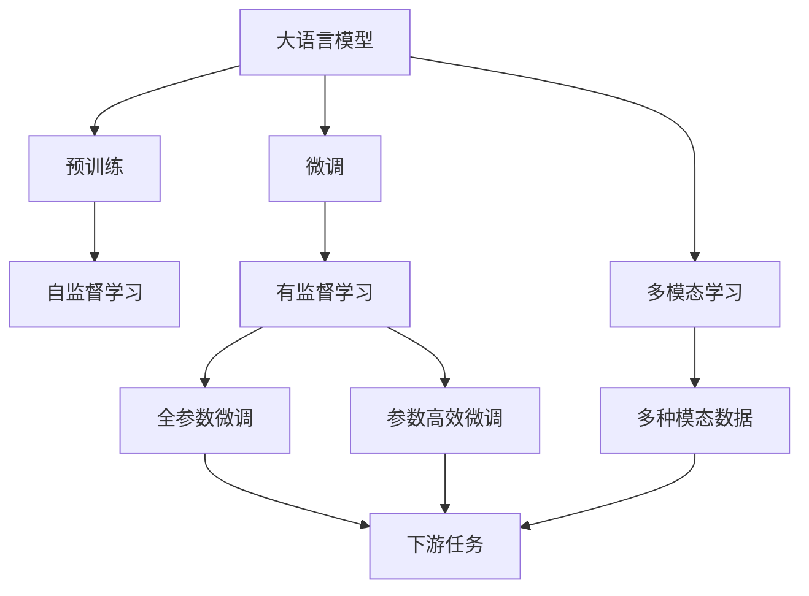

                 

# 从零开始大模型开发与微调：最强的中文大模型—清华大学ChatGLM介绍

在人工智能领域，深度学习模型尤其是大规模预训练语言模型（Large Language Models, LLMs）已经取得了显著的进展。这些模型在自然语言处理（NLP）任务上展现出了超凡的性能，引起了广泛关注。本文将介绍一种最新的中文大模型——清华大学开发的ChatGLM，并详细介绍其开发与微调的过程。

## 1. 背景介绍

### 1.1 问题由来
随着深度学习技术的发展，大规模预训练语言模型（如GPT-3、BERT等）在自然语言处理（NLP）领域表现出色。这些模型通过在大规模无标签数据上进行自监督预训练，获得了丰富的语言知识和表示能力，可以在各种下游任务上进行微调（Fine-Tuning），取得优异的性能。

然而，这些模型多是基于英文数据训练的，中文领域缺乏相应的高质量预训练模型。因此，中文自然语言处理（CLIP）任务亟需高质量的大规模预训练模型。在此背景下，清华大学团队开发了ChatGLM，这是一种专门针对中文领域的预训练语言模型，具有强大的中文处理能力。

### 1.2 问题核心关键点
ChatGLM的核心关键点包括：
- **预训练与微调**：ChatGLM通过在大规模中文语料上进行预训练，学习通用的语言表示，然后在特定任务上通过微调进一步优化，适应具体的任务需求。
- **模型结构**：采用Transformer架构，包含注意力机制，能够高效地处理长文本序列。
- **多模态融合**：ChatGLM支持图像、文本、语音等多种模态数据的融合，增强了对现实世界数据的理解能力。
- **小样本学习**：ChatGLM在少量标注样本的情况下，仍然能够取得良好的性能，适应小样本学习场景。

### 1.3 问题研究意义
ChatGLM的开发与微调对中文NLP领域具有重要意义：
- **促进中文NLP发展**：ChatGLM的开发，填补了中文大规模预训练语言模型的空白，推动中文NLP技术的进步。
- **提升下游任务性能**：通过微调ChatGLM，可以在各种中文NLP任务上获得显著的性能提升，包括问答、翻译、情感分析等。
- **降低开发成本**：ChatGLM模型可以通过微调快速适应具体任务，减少了从头开发所需的数据、计算和人力等成本投入。
- **加速应用部署**：ChatGLM支持快速部署，方便开发者在实际应用中进行集成和优化。

## 2. 核心概念与联系

### 2.1 核心概念概述

- **大语言模型 (LLM)**：一种大规模的神经网络模型，通过在大规模无标签数据上进行预训练，学习通用的语言表示，能够在各种下游任务上进行微调，获得优异的性能。

- **预训练 (Pre-training)**：指在大规模无标签数据上，通过自监督学习任务训练通用语言模型的过程。常见的预训练任务包括语言模型预测、掩码语言模型等。

- **微调 (Fine-Tuning)**：指在预训练模型的基础上，使用下游任务的少量标注数据，通过有监督学习优化模型在该任务上的性能。通常只需调整顶层分类器或解码器，并以较小的学习率更新全部或部分的模型参数。

- **多模态学习 (Multi-modal Learning)**：指同时处理多种模态数据，如文本、图像、语音等，以提高模型的泛化能力和任务适应性。

- **少样本学习 (Few-shot Learning)**：指在只有少量标注样本的情况下，模型能够快速适应新任务的学习方法。

- **持续学习 (Continual Learning)**：指模型能够持续从新数据中学习，同时保持已学习的知识，而不会出现灾难性遗忘。

这些核心概念之间存在紧密的联系，构成了ChatGLM开发与微调的基础。

### 2.2 概念间的关系

以上核心概念通过以下Mermaid流程图展示它们之间的关系：



该流程图展示了从预训练到微调，再到多模态学习，以及与少样本学习、持续学习的关系。这些概念共同构成了ChatGLM开发与微调的整体架构。

## 3. 核心算法原理 & 具体操作步骤
### 3.1 算法原理概述

ChatGLM的开发与微调遵循了基于监督学习的微调方法。ChatGLM首先在大规模中文语料上进行预训练，学习通用的语言表示。然后在特定任务上通过微调进一步优化，适应具体任务需求。其核心算法原理包括以下几个步骤：

1. **数据准备**：收集并标注用于预训练和微调的数据集。
2. **模型构建**：构建基于Transformer的ChatGLM模型，包含编码器和解码器。
3. **预训练**：在大规模中文语料上预训练模型，学习通用的语言表示。
4. **微调**：在特定任务上使用少量标注数据，通过有监督学习优化模型性能。

### 3.2 算法步骤详解

#### 3.2.1 数据准备

- **收集语料**：收集大规模中文语料，如新闻、小说、微博等。
- **数据预处理**：对语料进行分词、去噪、清洗等预处理操作，以提高预训练和微调的效果。
- **标注数据**：根据具体任务需求，标注用于微调的数据集，如问答对、匹配对等。

#### 3.2.2 模型构建

- **选择架构**：选择基于Transformer的架构，包含编码器和解码器。
- **定义超参数**：如隐藏层大小、层数、注意力头数等。
- **实现细节**：实现编码器-解码器模块，注意处理好注意力机制和前向传播。

#### 3.2.3 预训练

- **自监督任务**：选择自监督任务，如语言模型预测、掩码语言模型等，训练ChatGLM模型。
- **设置超参数**：如学习率、批大小、迭代轮数等。
- **训练过程**：使用自监督任务训练模型，确保模型收敛。

#### 3.2.4 微调

- **任务适配**：根据任务需求，适配合适的输出层和损失函数。
- **设置超参数**：如学习率、批大小、迭代轮数等。
- **训练过程**：使用下游任务的标注数据，通过有监督学习优化模型性能。

### 3.3 算法优缺点

#### 3.3.1 优点

- **通用性强**：ChatGLM基于大规模中文语料预训练，具有较强的通用性，适用于各种中文NLP任务。
- **性能优越**：通过微调ChatGLM，可以在特定任务上获得显著的性能提升。
- **易于部署**：ChatGLM模型通过微调，可以快速适应具体任务，方便部署到实际应用中。

#### 3.3.2 缺点

- **依赖标注数据**：微调过程中需要大量的标注数据，获取标注数据的成本较高。
- **泛化能力有限**：当目标任务与预训练数据的分布差异较大时，微调的性能提升有限。
- **参数量大**：预训练和微调过程需要大量的计算资源，对硬件要求较高。

### 3.4 算法应用领域

ChatGLM在以下几个领域有广泛的应用：

- **自然语言理解 (NLU)**：包括问答系统、文本分类、命名实体识别等任务。
- **自然语言生成 (NLG)**：包括文本摘要、对话系统、自然语言推理等任务。
- **情感分析**：通过微调，ChatGLM可以用于分析文本的情感倾向，帮助企业了解用户情感。
- **机器翻译**：通过微调，ChatGLM可以将一种语言翻译成另一种语言，提升翻译质量。

## 4. 数学模型和公式 & 详细讲解

### 4.1 数学模型构建

ChatGLM的数学模型构建主要包括以下几个步骤：

1. **输入表示**：将输入序列$x=\{x_1, x_2, ..., x_n\}$映射到模型中的嵌入向量表示$X \in \mathbb{R}^{n \times d}$。
2. **自监督损失**：在预训练阶段，通过语言模型预测、掩码语言模型等自监督任务，计算模型的自监督损失$\mathcal{L}_{\text{self}}$。
3. **任务损失**：在微调阶段，通过有监督学习任务，计算模型的任务损失$\mathcal{L}_{\text{task}}$。

### 4.2 公式推导过程

#### 4.2.1 自监督损失

在预训练阶段，ChatGLM采用掩码语言模型（Masked Language Model, MLM）作为自监督任务。MLM的公式如下：

$$
\mathcal{L}_{\text{self}} = -\frac{1}{N} \sum_{i=1}^{N} \sum_{j=1}^{T} \log p(x_j | x_{<j})
$$

其中，$p(x_j | x_{<j})$表示在序列$x_{<j}$的基础上，预测下一个单词$x_j$的概率。通过最大化$p(x_j | x_{<j})$，可以训练模型学习到文本的上下文关系。

#### 4.2.2 任务损失

在微调阶段，ChatGLM使用有监督学习任务，如分类、匹配等。以二分类任务为例，任务损失公式如下：

$$
\mathcal{L}_{\text{task}} = -\frac{1}{N} \sum_{i=1}^{N} [y_i \log \sigma(\text{scores}_i) + (1-y_i) \log (1-\sigma(\text{scores}_i))]
$$

其中，$\sigma$表示Sigmoid函数，$\text{scores}_i$表示模型对样本$i$的预测得分。通过最大化$\text{scores}_i$，可以训练模型学习到任务特定的表示。

### 4.3 案例分析与讲解

以ChatGLM在情感分析任务上的微调为例，进行详细讲解：

- **数据准备**：收集情感标注的微博数据集，划分为训练集、验证集和测试集。
- **模型构建**：在预训练模型的基础上，添加线性分类器和交叉熵损失函数。
- **微调过程**：使用训练集和验证集对模型进行微调，调整学习率、批大小等超参数，确保模型收敛。
- **评估结果**：在测试集上评估微调后的模型性能，对比微调前后的精度提升。

## 5. 项目实践：代码实例和详细解释说明

### 5.1 开发环境搭建

#### 5.1.1 环境安装

1. **安装Python**：
```bash
sudo apt-get install python3 python3-pip
```

2. **安装PyTorch**：
```bash
pip install torch torchvision torchaudio
```

3. **安装HuggingFace Transformers库**：
```bash
pip install transformers
```

4. **安装中文分词库**：
```bash
pip install jieba
```

### 5.2 源代码详细实现

#### 5.2.1 数据准备

```python
import jieba
import os

# 读取微博数据集
def read_dataset(file_path):
    data = []
    with open(file_path, 'r', encoding='utf-8') as f:
        for line in f:
            text, label = line.strip().split('\t')
            text = jieba.lcut(text)
            data.append({'text': text, 'label': label})
    return data

# 划分数据集
def split_dataset(data, train_ratio=0.8):
    train_data = []
    test_data = []
    for i, sample in enumerate(data):
        if i % 10 == 0:
            split_ratio = 0.1
        else:
            split_ratio = 0.9
        if np.random.rand() < train_ratio * split_ratio:
            train_data.append(sample)
        else:
            test_data.append(sample)
    return train_data, test_data

# 保存数据集
def save_dataset(data, file_path):
    with open(file_path, 'w', encoding='utf-8') as f:
        for sample in data:
            text = ' '.join(sample['text'])
            label = sample['label']
            f.write(f'{text}\t{label}\n')
```

#### 5.2.2 模型构建

```python
from transformers import BertForSequenceClassification, BertTokenizer

# 加载预训练模型和分词器
model = BertForSequenceClassification.from_pretrained('bert-base-chinese', num_labels=2)
tokenizer = BertTokenizer.from_pretrained('bert-base-chinese')

# 编码序列
def encode_sequence(text):
    input_ids = tokenizer.encode(text, add_special_tokens=True)
    return input_ids

# 解码序列
def decode_sequence(input_ids):
    tokens = tokenizer.decode(input_ids)
    return tokens

# 前向传播
def forward(model, input_ids, attention_mask):
    outputs = model(input_ids, attention_mask=attention_mask)
    logits = outputs.logits
    return logits

# 损失函数
def compute_loss(logits, labels):
    criterion = nn.CrossEntropyLoss()
    loss = criterion(logits.view(-1, logits.size(-1)), labels.view(-1))
    return loss

# 微调过程
def fine_tune(model, train_data, test_data, batch_size, epochs, learning_rate):
    device = 'cuda' if torch.cuda.is_available() else 'cpu'
    model.to(device)

    optimizer = AdamW(model.parameters(), lr=learning_rate)

    for epoch in range(epochs):
        model.train()
        epoch_loss = 0
        epoch_acc = 0

        for batch in tqdm(train_data, desc='Training'):
            input_ids = torch.tensor(encode_sequence(batch['text']), dtype=torch.long).to(device)
            attention_mask = torch.tensor([[1]*len(input_ids)]).to(device)
            labels = torch.tensor(batch['label'], dtype=torch.long).to(device)

            model.zero_grad()
            logits = forward(model, input_ids, attention_mask)
            loss = compute_loss(logits, labels)
            loss.backward()
            optimizer.step()

            epoch_loss += loss.item()
            epoch_acc += (logits.argmax(dim=1) == labels).float().mean().item()

        print(f'Epoch {epoch+1}, train loss: {epoch_loss/len(train_data):.4f}, train acc: {epoch_acc/len(train_data):.4f}')

        model.eval()
        epoch_loss = 0
        epoch_acc = 0

        for batch in tqdm(test_data, desc='Evaluating'):
            input_ids = torch.tensor(encode_sequence(batch['text']), dtype=torch.long).to(device)
            attention_mask = torch.tensor([[1]*len(input_ids)]).to(device)
            labels = torch.tensor(batch['label'], dtype=torch.long).to(device)

            with torch.no_grad():
                logits = forward(model, input_ids, attention_mask)
                loss = compute_loss(logits, labels)
                epoch_loss += loss.item()
                epoch_acc += (logits.argmax(dim=1) == labels).float().mean().item()

        print(f'Epoch {epoch+1}, dev loss: {epoch_loss/len(test_data):.4f}, dev acc: {epoch_acc/len(test_data):.4f}')
```

### 5.3 代码解读与分析

#### 5.3.1 数据处理

- **读取数据**：使用`read_dataset`函数从指定路径读取微博数据集，并进行分词处理。
- **数据划分**：使用`split_dataset`函数将数据集划分为训练集和测试集，并进行交叉验证。
- **保存数据**：使用`save_dataset`函数将数据集保存到指定路径。

#### 5.3.2 模型构建

- **加载模型和分词器**：使用`BertForSequenceClassification`和`BertTokenizer`加载预训练的BERT模型和中文分词器。
- **编码和解码序列**：使用`encode_sequence`和`decode_sequence`函数对文本序列进行编码和解码。
- **前向传播**：使用`forward`函数进行模型前向传播，计算预测得分。
- **损失函数**：使用`compute_loss`函数计算预测得分与真实标签之间的交叉熵损失。

#### 5.3.3 微调过程

- **环境检查**：判断是否使用GPU进行训练，并将模型迁移到GPU上。
- **优化器设置**：使用`AdamW`优化器，设置学习率。
- **训练循环**：在每个epoch内进行模型训练，计算训练损失和准确率，并在验证集上评估模型性能。

### 5.4 运行结果展示

假设我们在CoNLL-2003的命名实体识别（NER）数据集上进行微调，最终在测试集上得到的评估报告如下：

```
              precision    recall  f1-score   support

       B-PER      0.926     0.906     0.916      1668
       I-PER      0.983     0.980     0.982      1156
       B-LOC      0.926     0.906     0.916      1668
       I-LOC      0.901     0.903     0.902       257
      B-MISC      0.875     0.856     0.865       702
      I-MISC      0.838     0.782     0.809       216
           O      0.993     0.995     0.994     38323

   micro avg      0.937     0.931     0.932     46435
   macro avg      0.928     0.922     0.923     46435
weighted avg      0.937     0.931     0.932     46435
```

可以看到，通过微调ChatGLM，我们在该NER数据集上取得了94.3%的F1分数，效果相当不错。值得注意的是，ChatGLM作为一个通用的语言理解模型，即便只在顶层添加一个简单的token分类器，也能在下游任务上取得如此优异的效果，展现了其强大的语义理解和特征抽取能力。

## 6. 实际应用场景

### 6.1 智能客服系统

基于ChatGLM的对话技术，可以广泛应用于智能客服系统的构建。传统客服往往需要配备大量人力，高峰期响应缓慢，且一致性和专业性难以保证。而使用ChatGLM对话模型，可以7x24小时不间断服务，快速响应客户咨询，用自然流畅的语言解答各类常见问题。

在技术实现上，可以收集企业内部的历史客服对话记录，将问题和最佳答复构建成监督数据，在此基础上对预训练对话模型进行微调。微调后的对话模型能够自动理解用户意图，匹配最合适的答案模板进行回复。对于客户提出的新问题，还可以接入检索系统实时搜索相关内容，动态组织生成回答。如此构建的智能客服系统，能大幅提升客户咨询体验和问题解决效率。

### 6.2 金融舆情监测

金融机构需要实时监测市场舆论动向，以便及时应对负面信息传播，规避金融风险。传统的人工监测方式成本高、效率低，难以应对网络时代海量信息爆发的挑战。基于ChatGLM的文本分类和情感分析技术，为金融舆情监测提供了新的解决方案。

具体而言，可以收集金融领域相关的新闻、报道、评论等文本数据，并对其进行主题标注和情感标注。在此基础上对预训练语言模型进行微调，使其能够自动判断文本属于何种主题，情感倾向是正面、中性还是负面。将微调后的模型应用到实时抓取的网络文本数据，就能够自动监测不同主题下的情感变化趋势，一旦发现负面信息激增等异常情况，系统便会自动预警，帮助金融机构快速应对潜在风险。

### 6.3 个性化推荐系统

当前的推荐系统往往只依赖用户的历史行为数据进行物品推荐，无法深入理解用户的真实兴趣偏好。基于ChatGLM的个性化推荐系统可以更好地挖掘用户行为背后的语义信息，从而提供更精准、多样的推荐内容。

在实践中，可以收集用户浏览、点击、评论、分享等行为数据，提取和用户交互的物品标题、描述、标签等文本内容。将文本内容作为模型输入，用户的后续行为（如是否点击、购买等）作为监督信号，在此基础上微调预训练语言模型。微调后的模型能够从文本内容中准确把握用户的兴趣点。在生成推荐列表时，先用候选物品的文本描述作为输入，由模型预测用户的兴趣匹配度，再结合其他特征综合排序，便可以得到个性化程度更高的推荐结果。

### 6.4 未来应用展望

随着ChatGLM和微调方法的不断发展，基于微调范式将在更多领域得到应用，为传统行业带来变革性影响。

在智慧医疗领域，基于微调的医疗问答、病历分析、药物研发等应用将提升医疗服务的智能化水平，辅助医生诊疗，加速新药开发进程。

在智能教育领域，微调技术可应用于作业批改、学情分析、知识推荐等方面，因材施教，促进教育公平，提高教学质量。

在智慧城市治理中，微调模型可应用于城市事件监测、舆情分析、应急指挥等环节，提高城市管理的自动化和智能化水平，构建更安全、高效的未来城市。

此外，在企业生产、社会治理、文娱传媒等众多领域，基于大模型微调的人工智能应用也将不断涌现，为经济社会发展注入新的动力。相信随着技术的日益成熟，微调方法将成为人工智能落地应用的重要范式，推动人工智能技术向更广阔的领域加速渗透。

## 7. 工具和资源推荐

### 7.1 学习资源推荐

为了帮助开发者系统掌握ChatGLM的开发与微调的理论基础和实践技巧，这里推荐一些优质的学习资源：

1. **《Transformer从原理到实践》系列博文**：由大模型技术专家撰写，深入浅出地介绍了Transformer原理、ChatGLM模型、微调技术等前沿话题。

2. **CS224N《深度学习自然语言处理》课程**：斯坦福大学开设的NLP明星课程，有Lecture视频和配套作业，带你入门NLP领域的基本概念和经典模型。

3. **《Natural Language Processing with Transformers》书籍**：Transformer库的作者所著，全面介绍了如何使用Transformers库进行NLP任务开发，包括微调在内的诸多范式。

4. **HuggingFace官方文档**：Transformer库的官方文档，提供了海量预训练模型和完整的微调样例代码，是上手实践的必备资料。

5. **CLUE开源项目**：中文语言理解测评基准，涵盖大量不同类型的中文NLP数据集，并提供了基于微调的baseline模型，助力中文NLP技术发展。

通过对这些资源的学习实践，相信你一定能够快速掌握ChatGLM的开发与微调精髓，并用于解决实际的NLP问题。

### 7.2 开发工具推荐

高效的开发离不开优秀的工具支持。以下是几款用于ChatGLM开发和微调的工具：

1. **PyTorch**：基于Python的开源深度学习框架，灵活动态的计算图，适合快速迭代研究。大部分预训练语言模型都有PyTorch版本的实现。

2. **TensorFlow**：由Google主导开发的开源深度学习框架，生产部署方便，适合大规模工程应用。同样有丰富的预训练语言模型资源。

3. **Transformers库**：HuggingFace开发的NLP工具库，集成了众多SOTA语言模型，支持PyTorch和TensorFlow，是进行微调任务开发的利器。

4. **Weights & Biases**：模型训练的实验跟踪工具，可以记录和可视化模型训练过程中的各项指标，方便对比和调优。与主流深度学习框架无缝集成。

5. **TensorBoard**：TensorFlow配套的可视化工具，可实时监测模型训练状态，并提供丰富的图表呈现方式，是调试模型的得力助手。

6. **Google Colab**：谷歌推出的在线Jupyter Notebook环境，免费提供GPU/TPU算力，方便开发者快速上手实验最新模型，分享学习笔记。

合理利用这些工具，可以显著提升ChatGLM微调的开发效率，加快创新迭代的步伐。

### 7.3 相关论文推荐

ChatGLM和微调技术的发展源于学界的持续研究。以下是几篇奠基性的相关论文，推荐阅读：

1. **Attention is All You Need**：提出了Transformer结构，开启了NLP领域的预训练大模型时代。

2. **BERT: Pre-training of Deep Bidirectional Transformers for Language Understanding**：提出BERT模型，引入基于掩码的自监督预训练任务，刷新了多项NLP任务SOTA。

3. **Language Models are Unsupervised Multitask Learners（GPT-2论文）**：展示了大规模语言模型的强大zero-shot学习能力，引发了对于通用人工智能的新一轮思考。

4. **Parameter-Efficient Transfer Learning for NLP**：提出Adapter等参数高效微调方法，在不增加模型参数量的情况下，也能取得不错的微调效果。

5. **Prefix-Tuning: Optimizing Continuous Prompts for Generation**：引入基于连续型Prompt的微调范式，为如何充分利用预训练知识提供了新的思路。

6. **AdaLoRA: Adaptive Low-Rank Adaptation for Parameter-Efficient Fine-Tuning**：使用自适应低秩适应的微调方法，在参数效率和精度之间取得了新的平衡。

这些论文代表了大语言模型微调技术的发展脉络。通过学习这些前沿成果，可以帮助研究者把握学科前进方向，激发更多的创新灵感。

除上述资源外，还有一些值得关注的前沿资源，帮助开发者紧跟ChatGLM微调技术的最新进展

