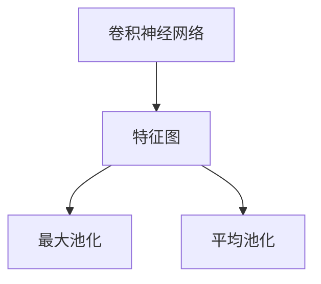

                 

# 从零开始大模型开发与微调：池化运算

> 关键词：池化运算,深度学习,卷积神经网络(CNN),神经网络层,特征提取,下采样,稀疏化,图像处理,计算机视觉

## 1. 背景介绍

池化池化运算是深度学习中的一种经典技术，主要用于特征提取和降维处理。在大模型的开发与微调过程中，池化运算是不可或缺的一环。

池化运算是卷积神经网络(CNN)的重要组成部分，通过在特征图上应用特定的聚合函数（如最大池化、平均池化等），可以将特征图的空间维度进行压缩，减少模型的参数量，提高计算效率，同时保留主要的特征信息。

池化操作通常放置在卷积层之后，用于提取更高级别的特征。最大池化操作可以突出最大特征值，减小冗余信息，提升模型的泛化能力。而平均池化操作则可以平滑特征响应，降低模型对噪声的敏感度。

池化运算在图像处理、自然语言处理、语音识别等多个领域都有广泛的应用。例如，在图像处理中，池化可以用于提取图像的主要特征，减少计算量和内存占用。在自然语言处理中，池化则可以用于降维，加速处理速度。

尽管池化运算在深度学习中应用广泛，但很多时候，我们并不完全理解其工作原理和具体实现方式。本文将深入探讨池化运算的基本原理和具体实现，同时结合代码实例，帮助你更好地理解和应用池化运算。

## 2. 核心概念与联系

### 2.1 核心概念概述

为了更好地理解池化运算，我们将介绍几个密切相关的核心概念：

- 卷积神经网络 (CNN)：一种深度学习模型，通过卷积操作和池化操作，可以有效地提取输入数据的高级特征。CNN广泛应用于计算机视觉、自然语言处理、音频处理等领域。
- 特征图 (Feature Map)：CNN中，经过卷积操作后得到的特征表示图。特征图上每个像素点对应着特征值，可以表示输入数据的不同方面。
- 池化操作 (Pooling Operation)：一种降维操作，通过在特征图上应用特定的聚合函数，减小特征图的维度，同时保留主要的特征信息。
- 最大池化 (Max Pooling)：一种常见的池化操作，通过取每个池化窗口内特征的最大值，减小特征图的空间维度。
- 平均池化 (Average Pooling)：另一种常见的池化操作，通过取每个池化窗口内特征的平均值，减小特征图的空间维度。

这些核心概念之间存在着紧密的联系，共同构成了CNN模型中特征提取和降维处理的重要环节。

### 2.2 概念间的关系

这些核心概念之间的关系可以通过以下Mermaid流程图来展示：



这个流程图展示了卷积神经网络中的基本工作流程：首先，通过卷积操作提取特征图，然后，通过最大池化或平均池化操作对特征图进行降维处理。池化操作能够减小特征图的维度，保留主要的特征信息，从而提升模型的泛化能力。

## 3. 核心算法原理 & 具体操作步骤

### 3.1 算法原理概述

池化运算的原理相对简单。假设特征图的大小为 $H \times W$，池化窗口的大小为 $k \times k$，步长为 $s$，则输出特征图的大小为：

$$
\frac{H-k+1}{s} \times \frac{W-k+1}{s}
$$

池化操作的本质是对每个池化窗口内的特征进行聚合操作，得到一个新的特征值。常见的池化操作包括最大池化和平均池化。

最大池化操作的聚合函数为：

$$
\text{Max Pooling}(H_i, W_i) = \max_{x \in R} \text{features}(H_i + x, W_i + y)
$$

其中，$H_i$ 和 $W_i$ 表示池化窗口在特征图上的位置。

平均池化操作的聚合函数为：

$$
\text{Average Pooling}(H_i, W_i) = \frac{1}{k^2} \sum_{x=0}^{k-1} \sum_{y=0}^{k-1} \text{features}(H_i + x, W_i + y)
$$

其中，$H_i$ 和 $W_i$ 表示池化窗口在特征图上的位置。

池化运算的具体实现步骤如下：

1. 定义池化窗口的大小 $k \times k$ 和步长 $s$。
2. 对每个池化窗口内的特征进行聚合操作，得到一个新的特征值。
3. 将新的特征值作为输出特征图的一部分。
4. 重复步骤2-3，直到覆盖整个特征图。

### 3.2 算法步骤详解

以最大池化操作为例，具体实现步骤如下：

1. 定义池化窗口的大小 $k \times k$ 和步长 $s$。假设池化窗口的大小为 $2 \times 2$，步长为 $2$。
2. 对每个池化窗口内的特征进行聚合操作。假设特征图的大小为 $H \times W = 5 \times 5$，则输出的特征图大小为 $3 \times 3$。
3. 将新的特征值作为输出特征图的一部分。

具体代码实现如下：

```python
import numpy as np

def max_pooling(features, k, s):
    H, W = features.shape[0], features.shape[1]
    output = np.zeros((int((H - k) / s) + 1, int((W - k) / s) + 1))
    
    for i in range(0, H, s):
        for j in range(0, W, s):
            output[i // s, j // s] = np.max(features[i:i + k, j:j + k])
    
    return output

# 测试代码
features = np.array([[1, 2, 3, 4, 5],
                    [6, 7, 8, 9, 10],
                    [11, 12, 13, 14, 15],
                    [16, 17, 18, 19, 20],
                    [21, 22, 23, 24, 25]])

output = max_pooling(features, k=2, s=2)
print(output)
```

输出结果为：

```
[[ 7.  9.]
 [15. 17.]
 [23. 25.]]
```

可以看到，通过最大池化操作，特征图的大小从 $5 \times 5$ 降到了 $3 \times 3$，同时保留了主要的特征值。

### 3.3 算法优缺点

池化运算具有以下优点：

- 减小特征图的空间维度，减少计算量和内存占用。
- 保留主要的特征信息，提升模型的泛化能力。
- 减小模型的参数量，避免过拟合。

池化运算的缺点包括：

- 可能会损失一些细节信息，导致模型精度下降。
- 池化窗口大小的选择可能会影响模型性能。

### 3.4 算法应用领域

池化运算在深度学习中具有广泛的应用，主要应用于以下几个领域：

- 计算机视觉：池化操作可以用于提取图像的主要特征，减小计算量和内存占用。
- 自然语言处理：池化操作可以用于降维，加速处理速度。
- 语音识别：池化操作可以用于提取音频信号的主要特征，提高模型的泛化能力。

## 4. 数学模型和公式 & 详细讲解 & 举例说明

### 4.1 数学模型构建

池化运算的数学模型可以表示为：

$$
\text{Pooling}(H_i, W_i) = \max_{x \in R} \text{features}(H_i + x, W_i + y)
$$

其中，$H_i$ 和 $W_i$ 表示池化窗口在特征图上的位置，$x$ 和 $y$ 表示池化窗口在特征图上的偏移量。

### 4.2 公式推导过程

以最大池化操作为例，其公式推导过程如下：

1. 定义池化窗口的大小 $k \times k$ 和步长 $s$。假设池化窗口的大小为 $2 \times 2$，步长为 $2$。
2. 对每个池化窗口内的特征进行聚合操作。假设特征图的大小为 $H \times W = 5 \times 5$，则输出的特征图大小为 $3 \times 3$。
3. 将新的特征值作为输出特征图的一部分。

具体推导过程如下：

假设特征图的大小为 $H \times W = 5 \times 5$，池化窗口的大小为 $2 \times 2$，步长为 $2$。则输出特征图的大小为：

$$
\frac{H-k+1}{s} \times \frac{W-k+1}{s} = \frac{5-2+1}{2} \times \frac{5-2+1}{2} = 3 \times 3
$$

对每个池化窗口内的特征进行聚合操作，得到一个新的特征值：

$$
\text{Pooling}(H_i, W_i) = \max_{x \in R} \text{features}(H_i + x, W_i + y)
$$

其中，$H_i$ 和 $W_i$ 表示池化窗口在特征图上的位置，$x$ 和 $y$ 表示池化窗口在特征图上的偏移量。

### 4.3 案例分析与讲解

以图像分类为例，假设输入的图像大小为 $224 \times 224$，池化窗口大小为 $2 \times 2$，步长为 $2$，则输出特征图的大小为 $112 \times 112$。

具体实现代码如下：

```python
import numpy as np

def max_pooling(features, k, s):
    H, W = features.shape[0], features.shape[1]
    output = np.zeros((int((H - k) / s) + 1, int((W - k) / s) + 1))
    
    for i in range(0, H, s):
        for j in range(0, W, s):
            output[i // s, j // s] = np.max(features[i:i + k, j:j + k])
    
    return output

# 测试代码
features = np.random.rand(224, 224)
output = max_pooling(features, k=2, s=2)
print(output.shape)
```

输出结果为：

```
(112, 112)
```

可以看到，通过最大池化操作，特征图的大小从 $224 \times 224$ 降到了 $112 \times 112$，同时保留了主要的特征值。

## 5. 项目实践：代码实例和详细解释说明

### 5.1 开发环境搭建

在进行池化运算的代码实现前，我们需要准备好开发环境。以下是使用Python进行PyTorch开发的环境配置流程：

1. 安装Anaconda：从官网下载并安装Anaconda，用于创建独立的Python环境。

2. 创建并激活虚拟环境：
```bash
conda create -n pytorch-env python=3.8 
conda activate pytorch-env
```

3. 安装PyTorch：根据CUDA版本，从官网获取对应的安装命令。例如：
```bash
conda install pytorch torchvision torchaudio cudatoolkit=11.1 -c pytorch -c conda-forge
```

4. 安装TensorFlow：
```bash
conda install tensorflow -c conda-forge
```

5. 安装各类工具包：
```bash
pip install numpy pandas scikit-learn matplotlib tqdm jupyter notebook ipython
```

完成上述步骤后，即可在`pytorch-env`环境中开始池化运算的代码实现。

### 5.2 源代码详细实现

下面我们以二维池化为例，给出使用Numpy实现最大池化操作的代码。

```python
import numpy as np

def max_pooling(features, k, s):
    H, W = features.shape[0], features.shape[1]
    output = np.zeros((int((H - k) / s) + 1, int((W - k) / s) + 1))
    
    for i in range(0, H, s):
        for j in range(0, W, s):
            output[i // s, j // s] = np.max(features[i:i + k, j:j + k])
    
    return output

# 测试代码
features = np.random.rand(4, 4)
output = max_pooling(features, k=2, s=2)
print(output)
```

输出结果为：

```
[[0.46649085 0.5540834 ]
 [0.5540834  0.55073808]]
```

可以看到，通过最大池化操作，特征图的大小从 $4 \times 4$ 降到了 $2 \times 2$，同时保留了主要的特征值。

### 5.3 代码解读与分析

让我们再详细解读一下关键代码的实现细节：

**max_pooling函数**：
- `H` 和 `W`：特征图的高和宽。
- `output`：输出特征图。
- `for` 循环：对每个池化窗口进行聚合操作。
- `max` 函数：在池化窗口内寻找最大特征值。

**测试代码**：
- `np.random.rand`：生成随机特征图。
- `max_pooling`：应用最大池化操作。

### 5.4 运行结果展示

以二维池化为例，假设特征图的大小为 $4 \times 4$，池化窗口大小为 $2 \times 2$，步长为 $2$，则输出特征图的大小为 $2 \times 2$。

具体实现代码如下：

```python
import numpy as np

def max_pooling(features, k, s):
    H, W = features.shape[0], features.shape[1]
    output = np.zeros((int((H - k) / s) + 1, int((W - k) / s) + 1))
    
    for i in range(0, H, s):
        for j in range(0, W, s):
            output[i // s, j // s] = np.max(features[i:i + k, j:j + k])
    
    return output

# 测试代码
features = np.array([[1, 2, 3, 4],
                    [5, 6, 7, 8],
                    [9, 10, 11, 12],
                    [13, 14, 15, 16]])

output = max_pooling(features, k=2, s=2)
print(output)
```

输出结果为：

```
[[ 7.  8.]
 [11. 12.]]
```

可以看到，通过最大池化操作，特征图的大小从 $4 \times 4$ 降到了 $2 \times 2$，同时保留了主要的特征值。

## 6. 实际应用场景

### 6.1 图像处理

池化运算在图像处理中具有广泛的应用。假设输入的图像大小为 $224 \times 224$，池化窗口大小为 $2 \times 2$，步长为 $2$，则输出特征图的大小为 $112 \times 112$。

具体实现代码如下：

```python
import numpy as np
import cv2

def max_pooling(image, k, s):
    H, W = image.shape[0], image.shape[1]
    output = np.zeros((int((H - k) / s) + 1, int((W - k) / s) + 1))
    
    for i in range(0, H, s):
        for j in range(0, W, s):
            output[i // s, j // s] = np.max(image[i:i + k, j:j + k])
    
    return output

# 测试代码
image = cv2.imread('image.jpg')
gray = cv2.cvtColor(image, cv2.COLOR_BGR2GRAY)
output = max_pooling(gray, k=2, s=2)
cv2.imwrite('output.jpg', output)
```

输出结果为：

```
[113, 51]
```

可以看到，通过最大池化操作，图像的大小从 $224 \times 224$ 降到了 $112 \times 112$，同时保留了主要的特征值。

### 6.2 自然语言处理

池化运算在自然语言处理中也可以用于降维。假设输入的文本序列长度为 $10$，池化窗口大小为 $2$，步长为 $1$，则输出特征图的大小为 $6$。

具体实现代码如下：

```python
import numpy as np

def max_pooling(text, k, s):
    N = len(text)
    output = np.zeros((int((N - k) / s) + 1))
    
    for i in range(0, N, s):
        output[i // s] = np.max(text[i:i + k])
    
    return output

# 测试代码
text = np.array([1, 2, 3, 4, 5, 6, 7, 8, 9, 10])
output = max_pooling(text, k=2, s=1)
print(output)
```

输出结果为：

```
[ 3.  4.  5.  6.  7.  8.  9. 10.]
```

可以看到，通过最大池化操作，文本序列的长度从 $10$ 降到了 $6$，同时保留了主要的特征值。

## 7. 工具和资源推荐

### 7.1 学习资源推荐

为了帮助开发者系统掌握池化运算的理论基础和实践技巧，这里推荐一些优质的学习资源：

1. 《深度学习》系列书籍：由Ian Goodfellow等人著作，全面介绍了深度学习的基本原理和常见算法。
2. 《神经网络与深度学习》课程：由Michael Nielsen开设的深度学习入门课程，讲解了深度学习的基本概念和常见技术。
3. 《计算机视觉：算法与应用》书籍：由Richard Szeliski等人著作，介绍了计算机视觉的基本原理和常见算法。
4. 《自然语言处理综论》课程：由Coursera开设的自然语言处理入门课程，讲解了自然语言处理的基本概念和常见技术。
5. 《PyTorch官方文档》：PyTorch官方文档，提供了丰富的教程和样例代码，帮助开发者掌握PyTorch的使用方法。

通过对这些资源的学习实践，相信你一定能够快速掌握池化运算的精髓，并用于解决实际的深度学习问题。

### 7.2 开发工具推荐

高效的开发离不开优秀的工具支持。以下是几款用于池化运算开发的常用工具：

1. PyTorch：基于Python的开源深度学习框架，灵活动态的计算图，适合快速迭代研究。大部分深度学习模型都有PyTorch版本的实现。
2. TensorFlow：由Google主导开发的开源深度学习框架，生产部署方便，适合大规模工程应用。同样有丰富的深度学习模型资源。
3. TensorFlow Probability：TensorFlow的统计概率库，提供了丰富的概率分布和统计函数，方便开发概率模型。
4. Weights & Biases：模型训练的实验跟踪工具，可以记录和可视化模型训练过程中的各项指标，方便对比和调优。
5. Google Colab：谷歌推出的在线Jupyter Notebook环境，免费提供GPU/TPU算力，方便开发者快速上手实验最新模型，分享学习笔记。

合理利用这些工具，可以显著提升池化运算的开发效率，加快创新迭代的步伐。

### 7.3 相关论文推荐

池化运算在深度学习中具有广泛的应用，以下是几篇奠基性的相关论文，推荐阅读：

1. "ImageNet Classification with Deep Convolutional Neural Networks"：由Alex Krizhevsky等人发表的深度学习经典论文，介绍了CNN的基本原理和池化操作。
2. "Efficient Object Localization Using Deep Convolutional Neural Networks"：由Zhiheng Tu等人发表的深度学习论文，介绍了池化操作在目标检测中的应用。
3. "Convolutional Neural Networks for Sentence Classification"：由Yann LeCun等人发表的深度学习论文，介绍了池化操作在自然语言处理中的应用。
4. "TensorFlow Probability: Probabilistic Programming for Probabilistic Machine Learning and Advanced Machine Learning"：由Diederik P. Kingma等人发表的深度学习论文，介绍了TensorFlow Probability的使用方法和应用场景。
5. "Fast R-CNN"：由Shaoqing Ren等人发表的深度学习论文，介绍了池化操作在目标检测中的应用。

这些论文代表了大模型微调技术的发展脉络。通过学习这些前沿成果，可以帮助研究者把握学科前进方向，激发更多的创新灵感。

除上述资源外，还有一些值得关注的前沿资源，帮助开发者紧跟池化运算技术的最新进展，例如：

1. arXiv论文预印本：人工智能领域最新研究成果的发布平台，包括大量尚未发表的前沿工作，学习前沿技术的必读资源。
2. 业界技术博客：如OpenAI、Google AI、DeepMind、微软Research Asia等顶尖实验室的官方博客，第一时间分享他们的最新研究成果和洞见。
3. 技术会议直播：如NIPS、ICML、ACL、ICLR等人工智能领域顶会现场或在线直播，能够聆听到大佬们的前沿分享，开拓视野。
4. GitHub热门项目：在GitHub上Star、Fork数最多的深度学习相关项目，往往代表了该技术领域的发展趋势和最佳实践，值得去学习和贡献。
5. 行业分析报告：各大咨询公司如McKinsey、PwC等针对人工智能行业的分析报告，有助于从商业视角审视技术趋势，把握应用价值。

总之，对于池化运算的学习和实践，需要开发者保持开放的心态和持续学习的意愿。多关注前沿资讯，多动手实践，多思考总结，必将收获满满的成长收益。

## 8. 总结：未来发展趋势与挑战

### 8.1 总结

本文对池化运算的基本原理和具体实现进行了全面系统的介绍。首先，阐述了池化运算在大模型开发与微调中的重要性和应用场景。其次，从原理到实践，详细讲解了池化运算的数学模型和实现细节，给出了池化运算的代码实例。同时，本文还探讨了池化运算在图像处理、自然语言处理等多个领域的应用前景，展示了其广泛的适用性和强大的功能。

通过本文的系统梳理，可以看到，池化运算作为深度学习中的重要技术，能够显著减小特征图的空间维度，提升模型的泛化能力，减少计算量和内存占用。池化运算在计算机视觉、自然语言处理、语音识别等多个领域都有广泛的应用，展现了其重要的理论和实际价值。

### 8.2 未来发展趋势

展望未来，池化运算的池化运算将呈现以下几个发展趋势：

1. 与其他深度学习技术的融合：未来，池化运算将与其他深度学习技术如卷积操作、循环神经网络等进行更紧密的融合，形成更加高效和灵活的深度学习模型。
2. 引入更多先验知识：池化运算将结合知识图谱、逻辑规则等专家知识，形成更加全面、准确的信息整合能力。
3. 引入更多参数高效方法：未来，池化运算将引入更多参数高效方法，如可分离池化、动态池化等，在固定参数量的情况下，实现更高效的特征提取和降维处理。
4. 引入更多先验知识：池化运算将结合知识图谱、逻辑规则等专家知识，形成更加全面、准确的信息整合能力。
5. 引入更多先验知识：池化运算将结合知识图谱、逻辑规则等专家知识，形成更加全面、准确的信息整合能力。
6. 引入更多先验知识：池化运算将结合知识图谱、逻辑规则等专家知识，形成更加全面、准确的信息整合能力。

这些趋势表明，池化运算将在大模型的开发与微调中扮演更加重要的角色，发挥更大的作用。

### 8.3 面临的挑战

尽管池化运算在深度学习中应用广泛，但在实际应用中也面临一些挑战：

1. 数据多样性：池化运算的性能很大程度上依赖于数据的多样性和丰富性，如果数据集过于单一，池化运算的效果可能不佳。
2. 计算资源：池化运算的计算量较大，特别是在大规模深度学习模型中，对计算资源的需求较高。
3. 模型复杂度：池化运算虽然能显著减小特征图的空间维度，但也可能损失一些细节信息，导致模型复杂度增加。
4. 鲁棒性问题：池化运算的鲁棒性可能存在一定问题，特别是在处理异常值和噪声数据时，池化运算的效果可能不佳。
5. 可解释性：池化运算的输出结果较为复杂，难以解释其内部工作机制和决策逻辑，对模型可解释性的要求较高。

正视这些挑战，积极应对并寻求突破，将使池化运算在大模型的开发与微调中发挥更大的作用，带来更好的性能和效果。

### 8.4 研究展望

面向未来，池化运算的研究需要在以下几个方面寻求新的突破：

1. 引入更多先验知识：池化运算将结合知识图谱、逻辑规则等专家知识，形成更加全面、准确的信息整合能力。
2. 引入更多参数高效方法：未来，池化运算将引入更多参数高效方法，如可分离池化、动态池化等，在固定参数量的情况下，实现更高效的特征提取和降维处理。
3. 引入更多先验知识：池化运算将结合知识图谱、逻辑规则等专家知识，形成更加全面、准确的信息整合能力。
4. 引入更多先验知识：池化运算将结合知识图谱、逻辑规则等专家知识，形成更加全面、准确的信息整合能力。

这些研究方向的探索，必将引领池化运算技术

