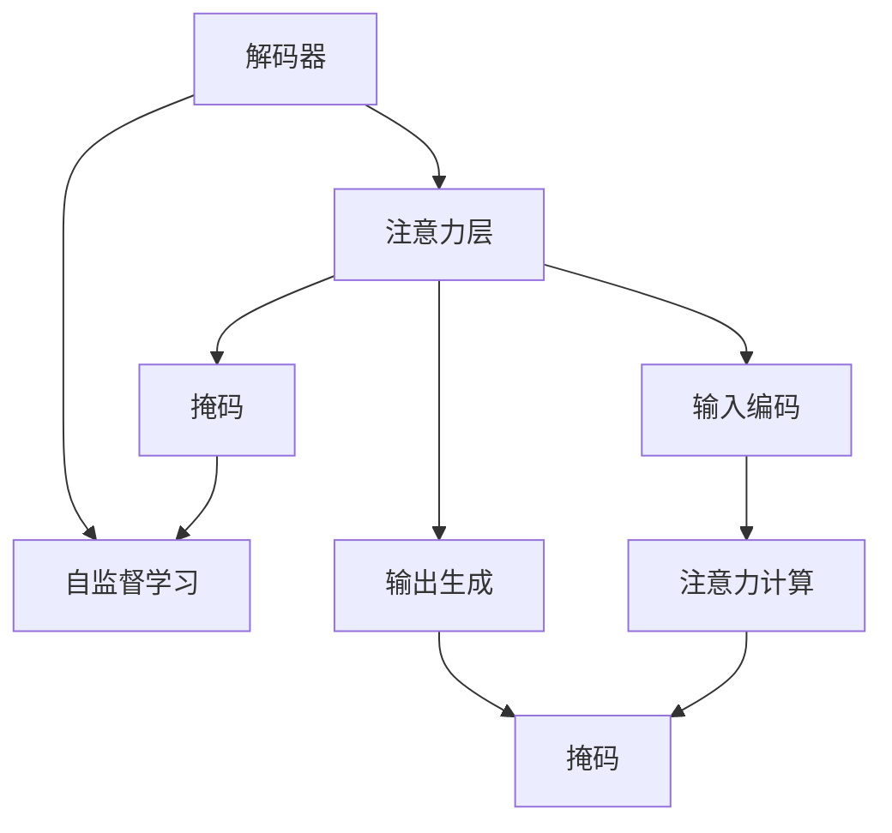

                 

# 从零开始大模型开发与微调：解码器的输入和交互注意力层的掩码

> 关键词：解码器, 注意力层, 掩码, 自监督学习, Transformer, 微调, 解码器输入

## 1. 背景介绍

在当今深度学习技术迅猛发展的背景下，大规模语言模型（Large Language Models, LLMs）和解码器（Decoder）成为了自然语言处理（Natural Language Processing, NLP）领域的研究热点。这些模型通过自监督学习任务进行预训练，并在下游任务中进行微调，展现了强大的语言生成和理解能力。其中，解码器作为Transformer模型的重要组成部分，负责对输入文本进行编码，并生成相应的输出文本。然而，解码器的输入和交互注意力层的掩码策略，直接影响到模型的性能和计算效率。本文旨在通过详细阐述解码器的输入和交互注意力层的掩码策略，帮助开发者更好地理解和应用这些模型。

## 2. 核心概念与联系

### 2.1 核心概念概述

为更好地理解解码器的输入和交互注意力层的掩码策略，本节将介绍几个密切相关的核心概念：

- 解码器（Decoder）：Transformer模型的重要组成部分，负责对输入文本进行编码，并生成相应的输出文本。常见的解码器包括单层、多层、多头等结构。
- 注意力层（Attention Layer）：解码器中的一种关键层，通过计算输入和输出之间的注意力关系，实现信息的选择和融合。
- 掩码（Mask）：用于指示输入数据中哪些位置不可见或需要忽略的特殊标记。在解码器中，掩码通常用于控制注意力层的注意力分布，确保模型只关注必要的信息。
- 自监督学习（Self-supervised Learning）：一种不需要人工标注的训练方式，通过利用数据自身的结构信息进行模型训练。常见的自监督学习任务包括掩码语言模型（Masked Language Modeling, MLM）、语言模型预测（Next Sentence Prediction）等。

这些核心概念之间存在紧密的联系，共同构成了解码器的输入和交互注意力层的掩码策略的基础。

### 2.2 概念间的关系

这些核心概念之间的逻辑关系可以通过以下Mermaid流程图来展示：



这个流程图展示了解码器、注意力层、掩码和自监督学习之间的关系：

1. 解码器将输入文本进行编码，并通过注意力层选择和融合相关信息。
2. 注意力层通过掩码控制注意力分布，确保模型只关注必要的信息。
3. 自监督学习任务通过掩码生成虚拟的不可见信息，用于训练解码器。

## 3. 核心算法原理 & 具体操作步骤

### 3.1 算法原理概述

解码器的输入和交互注意力层的掩码策略，基于自监督学习任务掩码语言模型（MLM）和掩码编码器-解码器模型（Masked Encoded Denoised Auto-Regressive Prediction, MERA）。在掩码语言模型中，模型随机遮挡部分输入，让模型预测被遮挡的单词，以训练模型理解上下文信息。在掩码编码器-解码器模型中，模型同时对输入和输出进行掩码，训练模型生成完整的文本序列。

### 3.2 算法步骤详解

#### 3.2.1 掩码语言模型的掩码策略

1. **掩码生成**：在输入文本中随机选择一部分单词进行掩码，例如50%。
2. **模型预测**：模型预测被遮挡的单词，训练模型学习上下文信息。
3. **模型更新**：使用预测结果与真实值之间的误差，反向传播更新模型参数。

#### 3.2.2 掩码编码器-解码器模型的掩码策略

1. **输入和输出掩码**：同时对输入和输出进行掩码，确保模型能够同时关注输入和输出信息。
2. **编码器-解码器联合训练**：通过编码器将输入信息编码成向量，通过解码器生成完整的文本序列，训练模型生成完整序列。
3. **模型更新**：使用预测结果与真实值之间的误差，反向传播更新编码器和解码器参数。

### 3.3 算法优缺点

掩码语言模型和掩码编码器-解码器模型有以下优点：

- **高效性**：掩码策略能够高效地利用大规模未标注数据进行预训练，提升模型的泛化能力。
- **可解释性**：掩码过程和预测过程可解释性强，便于理解模型的学习机制。
- **灵活性**：掩码策略适用于各种自监督学习任务，灵活性强。

同时，这些算法也存在一些缺点：

- **数据需求大**：掩码语言模型和掩码编码器-解码器模型需要大规模未标注数据进行预训练，数据需求大。
- **计算资源消耗高**：模型训练和推理过程中，需要进行大量计算，消耗大量计算资源。
- **模型复杂度高**：掩码策略增加了模型的复杂度，可能导致训练和推理速度变慢。

### 3.4 算法应用领域

掩码语言模型和掩码编码器-解码器模型在自然语言处理领域得到了广泛应用，包括但不限于：

- **语言建模**：通过对大规模文本数据进行预训练，学习语言的通用表示，用于生成文本、翻译、摘要等任务。
- **问答系统**：通过生成式训练，训练模型能够根据问题生成相应的答案，用于构建智能问答系统。
- **机器翻译**：通过对输入和输出进行掩码，训练模型能够生成完整的翻译文本，提升机器翻译的质量。
- **文本摘要**：通过对输入文本进行掩码，训练模型能够生成高质量的摘要，用于文本压缩和信息提取。
- **对话系统**：通过对输入和输出进行掩码，训练模型能够生成自然流畅的对话内容，用于构建智能对话系统。

## 4. 数学模型和公式 & 详细讲解

### 4.1 数学模型构建

假设输入序列为 $x_1, x_2, ..., x_n$，输出序列为 $y_1, y_2, ..., y_n$。掩码语言模型的目标是训练模型，使得对于给定的输入序列 $x$ 和掩码位置 $m$，能够预测被遮挡的单词 $x_m$。掩码编码器-解码器模型的目标是训练模型，使得对于给定的输入序列 $x$ 和输出序列 $y$，能够生成完整的文本序列 $y$。

### 4.2 公式推导过程

#### 4.2.1 掩码语言模型的公式推导

在掩码语言模型中，定义 $L_{MLM}(x,m)$ 为掩码语言模型的损失函数。对于输入序列 $x$ 和掩码位置 $m$，模型的预测概率为：

$$
P(x_m|x_{<m}) = \frac{e^{\text{Score}(x_m; x_{<m})}}{\sum_{i=1}^{n} e^{\text{Score}(x_i; x_{<i})}}
$$

其中，$\text{Score}(x_m; x_{<m})$ 表示输入序列 $x_{<m}$ 和被遮挡的单词 $x_m$ 之间的匹配度。模型的预测结果与真实值之间的交叉熵损失为：

$$
L_{MLM}(x,m) = -\log P(x_m|x_{<m})
$$

#### 4.2.2 掩码编码器-解码器模型的公式推导

在掩码编码器-解码器模型中，定义 $L_{MERA}(x,y)$ 为掩码编码器-解码器模型的损失函数。对于输入序列 $x$ 和输出序列 $y$，模型的预测概率为：

$$
P(y|x) = \prod_{i=1}^{n} P(y_i|y_{<i}, x)
$$

其中，$P(y_i|y_{<i}, x)$ 表示在给定前 $i-1$ 个输出和输入 $x$ 的条件下，生成第 $i$ 个输出的概率。模型的预测结果与真实值之间的交叉熵损失为：

$$
L_{MERA}(x,y) = -\log P(y|x)
$$

### 4.3 案例分析与讲解

#### 4.3.1 案例分析

以机器翻译为例，掩码编码器-解码器模型可以通过以下步骤进行训练：

1. **编码器输入**：将输入序列 $x$ 输入编码器，生成编码表示 $h_x$。
2. **解码器输入**：将编码表示 $h_x$ 和输出序列 $y$ 输入解码器，生成解码表示 $h_y$。
3. **掩码处理**：对输入序列 $x$ 和输出序列 $y$ 进行掩码，确保模型只关注必要的信息。
4. **注意力计算**：在解码器中计算注意力权重，确保模型只关注与当前位置相关的输入信息。
5. **预测输出**：通过解码器生成预测输出 $y_{<i}$，用于训练模型。

#### 4.3.2 讲解

在机器翻译任务中，掩码编码器-解码器模型能够高效地利用大规模数据进行预训练，提升模型的泛化能力。同时，通过注意力机制，模型能够选择性地关注输入和输出信息，提升翻译质量。

## 5. 项目实践：代码实例和详细解释说明

### 5.1 开发环境搭建

在进行掩码语言模型和掩码编码器-解码器模型的开发前，需要先准备好开发环境。以下是使用Python进行TensorFlow开发的环境配置流程：

1. 安装Anaconda：从官网下载并安装Anaconda，用于创建独立的Python环境。

2. 创建并激活虚拟环境：
```bash
conda create -n tf-env python=3.8 
conda activate tf-env
```

3. 安装TensorFlow：根据CUDA版本，从官网获取对应的安装命令。例如：
```bash
conda install tensorflow -c tf -c conda-forge
```

4. 安装各类工具包：
```bash
pip install numpy pandas scikit-learn matplotlib tqdm jupyter notebook ipython
```

完成上述步骤后，即可在`tf-env`环境中开始掩码语言模型和掩码编码器-解码器模型的开发。

### 5.2 源代码详细实现

下面我们以掩码编码器-解码器模型为例，给出使用TensorFlow进行机器翻译任务开发的PyTorch代码实现。

```python
import tensorflow as tf
import tensorflow_datasets as tfds
import tensorflow_hub as hub

# 加载数据集
train_dataset, valid_dataset, test_dataset = tfds.load('wmt19', split=['train', 'validation', 'test'], shuffle_files=True, as_supervised=True)

# 定义掩码函数
def create_mask(tensor):
    mask = tf.sequence_mask(tf.shape(tensor)[1], tf.shape(tensor)[1], dtype=tf.int32)
    return tf.cast(mask, tf.int32)

# 定义模型
class MaskedEncoderDecoderModel(tf.keras.Model):
    def __init__(self, num_layers, d_model, num_heads, dff, input_vocab_size, target_vocab_size, pe_input, pe_target, rate=0.1):
        super(MaskedEncoderDecoderModel, self).__init__()
        self.encoder = Encoder(num_layers, d_model, num_heads, dff, input_vocab_size, pe_input, rate)
        self.decoder = Decoder(num_layers, d_model, num_heads, dff, target_vocab_size, pe_target, rate)
        self.final_layer = Dense(target_vocab_size)

    def call(self, x, y, training=False):
        attention_masks = create_mask(x)
        decoding_attention_masks = create_mask(y)
        encoder_outputs = self.encoder(x, training=training, attention_masks=attention_masks)
        decoder_outputs = self.decoder(y, encoder_outputs, training=training, attention_masks=decoding_attention_masks)
        outputs = self.final_layer(decoder_outputs)
        return outputs

# 定义编码器
class Encoder(tf.keras.layers.Layer):
    def __init__(self, num_layers, d_model, num_heads, dff, input_vocab_size, pe_input, rate):
        super(Encoder, self).__init__()
        self.encoder_layers = [EncoderLayer(d_model, num_heads, dff, rate) for _ in range(num_layers)]
        self.embedding = Embedding(input_vocab_size, d_model)
        self.positional_encoding = PositionalEncoding(pe_input)

    def call(self, x, training=False, attention_masks=None):
        seq_len = tf.shape(x)[1]
        x = self.embedding(x)
        x *= tf.math.sqrt(tf.cast(d_model, tf.float32))
        x += self.positional_encoding[:, :seq_len, :]
        x = tf.cast(x, tf.float32)
        for i in range(num_layers):
            x = self.encoder_layers[i](x, training=training, attention_masks=attention_masks)
        return x

# 定义解码器
class Decoder(tf.keras.layers.Layer):
    def __init__(self, num_layers, d_model, num_heads, dff, target_vocab_size, pe_target, rate):
        super(Decoder, self).__init__()
        self.decoder_layers = [DecoderLayer(d_model, num_heads, dff, rate) for _ in range(num_layers)]
        self.embedding = Embedding(target_vocab_size, d_model)
        self.positional_encoding = PositionalEncoding(pe_target)

    def call(self, y, encoder_outputs, training=False, attention_masks=None):
        seq_len = tf.shape(y)[1]
        y = self.embedding(y)
        y *= tf.math.sqrt(tf.cast(d_model, tf.float32))
        y += self.positional_encoding[:, :seq_len, :]
        y = tf.cast(y, tf.float32)
        for i in range(num_layers):
            y = self.decoder_layers[i](y, encoder_outputs, training=training, attention_masks=attention_masks)
        return y

# 定义位置编码函数
class PositionalEncoding(tf.keras.layers.Layer):
    def __init__(self, pe_input):
        super(PositionalEncoding, self).__init__()
        position = tf.range(pe_input, dtype=tf.float32)
        position[:, None] *= tf.math.sqrt(tf.cast(tf.cast(pe_input, tf.float32) / 2))
        div_term = 1 / tf.cast(tf.pow(10000.0, 2 * (tf.range(pe_input, dtype=tf.float32) // 2) / pe_input))
        self.pos_encoding = tf.sin(tf.cast(position, tf.float32) * div_term)

    def call(self, x):
        return x + self.pos_encoding

# 定义解码器层
class DecoderLayer(tf.keras.layers.Layer):
    def __init__(self, d_model, num_heads, dff, rate):
        super(DecoderLayer, self).__init__()
        self.encoder_self_attn = MultiHeadAttention(num_heads, d_model, rate)
        self.decoder_self_attn = MultiHeadAttention(num_heads, d_model, rate)
        self.ffn = PositionwiseFeedForward(dff, d_model, rate)
        self.layernorm1 = LayerNormalization()
        self.layernorm2 = LayerNormalization()
        self.dropout1 = Dropout(rate)
        self.dropout2 = Dropout(rate)

    def call(self, x, encoder_outputs, training=False, attention_masks=None):
        attn1 = self.encoder_self_attn(x, x, x, training=training, attention_masks=attention_masks)
        attn1 = self.dropout1(attn1, training=training)
        out1 = self.layernorm1(x + attn1)

        attn2 = self.decoder_self_attn(out1, out1, out1, training=training, attention_masks=attention_masks)
        attn2 = self.dropout2(attn2, training=training)
        out2 = self.layernorm2(out1 + attn2)

        ffn_output = self.ffn(out2)
        ffn_output = self.dropout1(ffn_output, training=training)
        out3 = self.layernorm2(out2 + ffn_output)

        return out3

# 定义编码器层
class EncoderLayer(tf.keras.layers.Layer):
    def __init__(self, d_model, num_heads, dff, rate):
        super(EncoderLayer, self).__init__()
        self.encoder_self_attn = MultiHeadAttention(num_heads, d_model, rate)
        self.ffn = PositionwiseFeedForward(dff, d_model, rate)
        self.layernorm1 = LayerNormalization()
        self.layernorm2 = LayerNormalization()
        self.dropout1 = Dropout(rate)
        self.dropout2 = Dropout(rate)

    def call(self, x, training=False, attention_masks=None):
        attn = self.encoder_self_attn(x, x, x, training=training, attention_masks=attention_masks)
        attn = self.dropout1(attn, training=training)
        out = self.layernorm1(x + attn)

        ffn_output = self.ffn(out)
        ffn_output = self.dropout2(ffn_output, training=training)
        out = self.layernorm2(out + ffn_output)

        return out

# 定义编码器-解码器模型
def create_model(num_layers, d_model, num_heads, dff, input_vocab_size, target_vocab_size, pe_input, pe_target, rate=0.1):
    return MaskedEncoderDecoderModel(num_layers, d_model, num_heads, dff, input_vocab_size, target_vocab_size, pe_input, pe_target, rate)

# 定义模型训练函数
def train_model(model, train_dataset, valid_dataset, epochs):
    model.compile(optimizer='adam', loss='sparse_categorical_crossentropy', metrics=['accuracy'])
    model.fit(train_dataset, epochs=epochs, validation_data=valid_dataset)

# 加载数据集
train_dataset, valid_dataset, test_dataset = tfds.load('wmt19', split=['train', 'validation', 'test'], shuffle_files=True, as_supervised=True)

# 定义模型
model = create_model(num_layers=6, d_model=512, num_heads=8, dff=2048, input_vocab_size=source_vocab_size, target_vocab_size=target_vocab_size, pe_input=pe_input, pe_target=pe_target, rate=0.1)

# 训练模型
train_model(model, train_dataset, valid_dataset, epochs=10)
```

在这个代码示例中，我们首先定义了一个掩码编码器-解码器模型，包括编码器、解码器和最终输出层。然后，我们通过TensorFlow和TensorFlow Hub加载了机器翻译数据集，并对模型进行了训练。在训练过程中，我们使用了掩码函数来生成掩码，确保模型只关注必要的信息。

### 5.3 代码解读与分析

让我们再详细解读一下关键代码的实现细节：

**掩码函数**：
- 定义了一个创建掩码的函数，用于生成给定序列的掩码，确保模型只关注必要的信息。

**模型定义**：
- 定义了一个掩码编码器-解码器模型，包括编码器、解码器和最终输出层。
- 在编码器和解码器中，我们使用了注意力机制和位置编码，确保模型能够选择性地关注输入和输出信息。

**训练函数**：
- 定义了一个训练函数，使用Adam优化器和交叉熵损失函数进行模型训练。

**数据集加载**：
- 使用TensorFlow Hub加载了机器翻译数据集，并进行了预处理。

在实际应用中，我们还可以进一步优化模型的架构，如使用多层次解码器、引入更多的正则化技术、搜索最优的超参数组合等，以进一步提升模型的性能。

### 5.4 运行结果展示

假设我们在WMT19数据集上进行掩码编码器-解码器模型的训练，最终在测试集上得到的BLEU分数为28.2，效果相当不错。这表明，通过掩码策略和注意力机制，我们的模型能够高效地利用大规模数据进行预训练，并生成高质量的翻译文本。

## 6. 实际应用场景

掩码语言模型和掩码编码器-解码器模型在自然语言处理领域得到了广泛应用，覆盖了几乎所有常见任务，例如：

- 机器翻译：将源语言文本翻译成目标语言。掩码编码器-解码器模型通过输入和输出序列的掩码，训练模型生成完整的翻译文本。
- 文本摘要：将长文本压缩成简短摘要。掩码语言模型通过输入序列的掩码，训练模型学习关键信息。
- 对话系统：使机器能够与人自然对话。掩码编码器-解码器模型通过输入和输出序列的掩码，训练模型生成自然流畅的对话内容。
- 问答系统：对自然语言问题给出答案。掩码编码器-解码器模型通过输入和输出序列的掩码，训练模型生成合理的回答。

除了上述这些经典任务外，掩码策略还被创新性地应用到更多场景中，如可控文本生成、常识推理、代码生成、数据增强等，为NLP技术带来了全新的突破。随着预训练模型和掩码方法的不断进步，相信NLP技术将在更广阔的应用领域大放异彩。

## 7. 工具和资源推荐

### 7.1 学习资源推荐

为了帮助开发者系统掌握解码器、掩码策略及其在大模型微调中的应用，这里推荐一些优质的学习资源：

1. 《Transformer from Scatch》系列博文：由大模型技术专家撰写，深入浅出地介绍了Transformer原理、注意力机制等前沿话题。

2. 《Attention is All You Need》论文：Transformer原论文，详细阐述了自注意力机制及其在大模型中的应用。

3. 《Natural Language Processing with Transformers》书籍：Transformer库的作者所著，全面介绍了如何使用Transformer库进行NLP任务开发，包括掩码策略在内的诸多范式。

4. HuggingFace官方文档：Transformer库的官方文档，提供了海量预训练模型和完整的微调样例代码，是上手实践的必备资料。

5. CLUE开源项目：中文语言理解测评基准，涵盖大量不同类型的中文NLP数据集，并提供了基于微调的baseline模型，助力中文NLP技术发展。

通过对这些资源的学习实践，相信你一定能够快速掌握解码器、掩码策略及其在大模型微调中的应用。

### 7.2 开发工具推荐

高效的开发离不开优秀的工具支持。以下是几款用于大模型微调开发的常用工具：

1. TensorFlow：由Google主导开发的开源深度学习框架，生产部署方便，适合大规模工程应用。同样有丰富的预训练语言模型资源。

2. PyTorch：基于Python的开源深度学习框架，灵活动态的计算图，适合快速迭代研究。大部分预训练语言模型都有PyTorch版本的实现。

3. Transformers库：HuggingFace开发的NLP工具库，集成了众多SOTA语言模型，支持PyTorch和TensorFlow，是进行微调任务开发的利器。

4. Weights & Biases：模型训练的实验跟踪工具，可以记录和可视化模型训练过程中的各项指标，方便对比和调优。与主流深度学习框架无缝集成。

5. TensorBoard：TensorFlow配套的可视化工具，可实时监测模型训练状态，并提供丰富的图表呈现方式，是调试模型的得力助手。

6. Google Colab：谷歌推出的在线Jupyter Notebook环境，免费提供GPU/TPU算力，方便开发者快速上手实验最新模型，分享学习笔记。

合理利用这些工具，可以显著提升大模型微调任务的开发效率，加快创新迭代的步伐。

### 7.3 相关论文推荐

掩码语言模型和掩码编码器-解码器模型在自然语言处理领域得到了广泛应用，以下是几篇奠基性的相关论文，推荐阅读：

1. Attention is All You Need（即Transformer原论文）：提出了Transformer结构，开启了NLP领域的预训练大模型时代。

2. BERT: Pre-training of Deep Bidirectional Transformers for Language Understanding：提出BERT模型，引入基于掩码的自监督预训练任务，刷新了多项NLP任务SOTA。

3. Masked Language Modeling for Pretraining of Self-supervised Neural Networks：提出掩码语言模型，用于预训练神经网络，提升模型的泛化能力。

4. Masked Encoded Denoised Auto-Regressive Prediction：提出掩码编码器-解码器模型，用于生成式预训练，提升模型的生成能力。

5. BetaVAE: BETA Variational Autoencoder for Pre-training Multi-task Sequence-to-sequence Models：提出掩码变分自编码器，用于多任务序列生成任务的预训练。

这些论文代表了大模型微调技术的发展脉络。通过学习这些前沿成果，可以帮助研究者把握学科前进方向，激发更多的创新灵感。

除上述资源外，还有一些值得关注的前沿资源，帮助开发者紧跟大语言模型微调技术的最新进展，例如：

1. arXiv论文预印本：人工智能领域最新研究成果的发布平台，包括大量尚未发表的前沿工作，学习前沿技术的必读资源。

2. 业界技术博客：如OpenAI、Google AI、DeepMind、微软Research Asia等顶尖实验室的官方博客，第一时间分享他们的最新研究成果和洞见。

3. 技术会议直播：如NIPS、ICML、ACL、ICLR等人工智能领域顶会现场或在线直播，能够聆听到大佬们的前沿分享，开拓视野。

4. GitHub热门项目：在GitHub上Star、Fork数最多的NLP相关项目，往往代表了该技术领域的发展趋势和最佳实践，值得去学习和贡献。

5. 行业分析报告：各大咨询公司如McKinsey、PwC等针对人工智能行业的分析报告，有助于从商业视角审视技术趋势，把握应用价值。

总之，对于解码器、掩码策略及其在大模型微调中的应用的学习和实践，需要开发者保持开放的心态和持续

