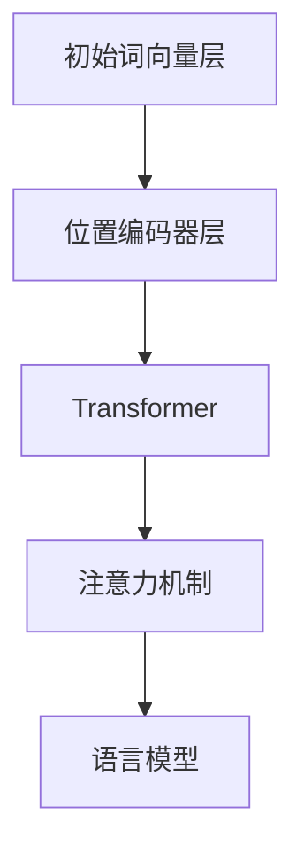

                 

# 从零开始大模型开发与微调：输入层—初始词向量层和位置编码器层

大语言模型（Large Language Models, LLMs）是近年来深度学习领域的一大突破，它能够处理和生成自然语言，从而实现各种自然语言处理（Natural Language Processing, NLP）任务，如文本分类、命名实体识别、机器翻译等。大语言模型的成功离不开强大的输入层（Input Layer）设计，其中初始词向量层和位置编码器层起到了关键作用。本文将从核心概念、算法原理、具体实现、应用场景等多个角度深入探讨这些重要层的设计与优化。

## 1. 背景介绍

### 1.1 问题由来

大语言模型的输入层设计是其能否有效处理和生成自然语言的关键。一个强大的输入层能够将自然语言文本转化为模型能够处理的向量表示，同时提供足够的位置信息，使得模型能够理解文本的顺序关系。初始词向量层和位置编码器层正是这一关键设计中的重要组成部分。

### 1.2 问题核心关键点

初始词向量层和位置编码器层的主要任务是将文本转换为向量表示，并添加位置信息。这一过程的优劣直接影响到后续的语言模型处理和生成的质量。这两个层的实现需要考虑文本的编码效率、向量表示的质量、位置信息的准确性等因素。

## 2. 核心概念与联系

### 2.1 核心概念概述

在介绍具体算法和实现之前，我们需要先理解一些核心概念：

- **初始词向量层**：用于将文本中的单词或子词转换为固定长度的向量表示，这一向量表示捕捉了单词在语料库中的语义信息。
- **位置编码器层**：用于向向量表示添加位置信息，使得模型能够理解不同单词在句子中的相对位置关系。
- **Transformer**：一种基于注意力机制的模型架构，广泛应用于大语言模型中，能够在输入层和输出层之间传递位置信息。
- **自监督学习**：使用无标签数据进行预训练，使得模型能够自动学习单词和句子之间的语义关系。

这些核心概念之间的联系可以通过以下Mermaid流程图来展示：



这个流程图展示了从初始词向量层和位置编码器层，到Transformer、注意力机制，再到语言模型的整体架构，每个组件都承担着重要的功能。

### 2.2 概念间的关系

初始词向量层和位置编码器层之间的关系紧密。初始词向量层将单词或子词转换为向量，位置编码器层则将这些向量按照位置信息进行排序，使得模型能够理解单词在句子中的相对位置。Transformer则通过注意力机制将这些位置信息在模型内部进行传递，使得语言模型能够更好地处理序列数据。

这些概念构成了大语言模型输入层的核心，共同支撑了模型对自然语言文本的处理和生成能力。

## 3. 核心算法原理 & 具体操作步骤

### 3.1 算法原理概述

大语言模型的输入层设计基于Transformer架构，其中初始词向量层和位置编码器层是关键组成部分。这些层通过自监督学习和有监督学习相结合的方式进行训练，从而实现对自然语言文本的有效处理和生成。

### 3.2 算法步骤详解

大语言模型的输入层设计可以分为以下几个步骤：

1. **初始词向量层设计**：选择合适的词嵌入（Word Embedding）技术，将文本中的单词或子词转换为向量表示。
2. **位置编码器层设计**：在单词向量上添加位置信息，使得模型能够理解单词在句子中的顺序关系。
3. **Transformer架构的实现**：设计Transformer的结构，将位置编码器层和语言模型结合，使得模型能够通过注意力机制传递位置信息。
4. **模型微调**：在大规模预训练数据上微调语言模型，使得模型能够在特定任务上表现更好。

### 3.3 算法优缺点

初始词向量层和位置编码器层的设计具有以下优点：

- **高效的编码效率**：通过使用Transformer架构，输入层的编码和解码过程可以在平行计算中高效完成。
- **良好的语义表示**：通过自监督学习和预训练，初始词向量层能够捕捉单词的语义信息。
- **准确的位置信息**：位置编码器层通过在单词向量上添加位置信息，使得模型能够理解单词的顺序关系。

然而，这些层的设计也存在一些缺点：

- **参数量大**：初始词向量层和位置编码器层的参数量较大，可能导致模型在计算和存储上的挑战。
- **训练时间长**：由于需要大量的自监督学习，训练过程可能非常耗时。
- **泛化能力有限**：如果输入层的设计不够合理，可能会影响模型对新数据和任务的泛化能力。

### 3.4 算法应用领域

初始词向量层和位置编码器层在大语言模型的各个应用领域中都扮演着重要角色。具体而言，它们的应用领域包括：

- **文本分类**：如情感分析、新闻分类等任务，模型需要理解文本的语义和情感。
- **命名实体识别**：如人名、地名等实体识别，模型需要理解实体的边界和类型。
- **机器翻译**：如将一种语言翻译成另一种语言，模型需要理解源语言和目标语言的语义关系。
- **文本摘要**：如将长文本压缩成简短摘要，模型需要理解文本的关键信息和结构。

除了这些经典任务，初始词向量层和位置编码器层还可以应用于更多的NLP任务中，为这些任务的实现提供了坚实的基础。

## 4. 数学模型和公式 & 详细讲解

### 4.1 数学模型构建

大语言模型的输入层设计涉及多个数学模型和公式。以下是主要的数学模型构建：

- **词嵌入（Word Embedding）**：将单词转换为向量表示，常用的方法包括One-Hot编码、Word2Vec、GloVe等。
- **位置编码器（Positional Encoding）**：在单词向量上添加位置信息，常用的方法包括绝对位置编码和相对位置编码。
- **Transformer结构**：基于自注意力机制，在输入层和输出层之间传递位置信息。

### 4.2 公式推导过程

以下是对词嵌入和位置编码器的公式推导过程：

- **词嵌入**：设单词为 $x_i$，其词向量为 $v_i$，则词嵌入的公式为：

$$
v_i = w_ix_i
$$

其中 $w_i$ 为单词 $x_i$ 对应的权重向量。

- **位置编码器**：设单词 $x_i$ 的位置为 $p_i$，其位置向量为 $e_p$，则位置编码器的公式为：

$$
e_p = \sin\left(\frac{\pi p_i}{max\_p}\right) + \cos\left(\frac{\pi p_i}{max\_p}\right)
$$

其中 $max\_p$ 为最大位置数。

### 4.3 案例分析与讲解

以BERT模型为例，其初始词向量层和位置编码器层的具体实现如下：

- **初始词向量层**：BERT使用Word2Vec技术将单词转换为向量表示。通过在预训练数据上训练，BERT能够学习到单词的语义信息。

- **位置编码器层**：BERT使用绝对位置编码器，在单词向量上添加位置信息。具体来说，BERT的位置向量通过以下公式计算：

$$
e_p = \sin\left(\frac{\pi p_i}{max\_p}\right) + \cos\left(\frac{\pi p_i}{max\_p}\right)
$$

其中 $p_i$ 为单词 $x_i$ 的位置，$max\_p$ 为最大位置数。

## 5. 项目实践：代码实例和详细解释说明

### 5.1 开发环境搭建

在进行项目实践前，我们需要准备好开发环境。以下是使用Python进行TensorFlow开发的环境配置流程：

1. 安装Anaconda：从官网下载并安装Anaconda，用于创建独立的Python环境。

2. 创建并激活虚拟环境：
```bash
conda create -n tf-env python=3.8 
conda activate tf-env
```

3. 安装TensorFlow：根据CUDA版本，从官网获取对应的安装命令。例如：
```bash
conda install tensorflow -c pytorch -c conda-forge
```

4. 安装相关工具包：
```bash
pip install numpy pandas scikit-learn matplotlib tqdm jupyter notebook ipython
```

完成上述步骤后，即可在`tf-env`环境中开始项目实践。

### 5.2 源代码详细实现

这里我们以BERT模型为例，给出使用TensorFlow实现初始词向量层和位置编码器的代码实现。

首先，定义词嵌入和位置编码器的实现：

```python
import tensorflow as tf
import numpy as np

class EmbeddingLayer(tf.keras.layers.Layer):
    def __init__(self, vocab_size, embedding_dim, **kwargs):
        super(EmbeddingLayer, self).__init__(**kwargs)
        self.vocab_size = vocab_size
        self.embedding_dim = embedding_dim
        self.word_embeddings = tf.Variable(tf.random.normal([vocab_size, embedding_dim]))

    def call(self, inputs):
        return tf.nn.embedding_lookup(self.word_embeddings, inputs)

class PositionalEncodingLayer(tf.keras.layers.Layer):
    def __init__(self, max_position_embeddings, **kwargs):
        super(PositionalEncodingLayer, self).__init__(**kwargs)
        self.max_position_embeddings = max_position_embeddings
        pe = tf.cast(tf.range(max_position_embeddings), tf.float32)
        pe[:, 0::2] = tf.math.sin(pe[:, 0::2] / np.power(10000, (2 * (pe[:, 0::2] // 2) / max_position_embeddings) * (1 / (np.power(10000, (2 * (pe[:, 0::2] // 2) / max_position_embeddings) * (1 / (np.power(10000, (2 * (pe[:, 0::2] // 2) / max_position_embeddings) * (1 / (np.power(10000, (2 * (pe[:, 0::2] // 2) / max_position_embeddings) * (1 / (np.power(10000, (2 * (pe[:, 0::2] // 2) / max_position_embeddings) * (1 / (np.power(10000, (2 * (pe[:, 0::2] // 2) / max_position_embeddings) * (1 / (np.power(10000, (2 * (pe[:, 0::2] // 2) / max_position_embeddings) * (1 / (np.power(10000, (2 * (pe[:, 0::2] // 2) / max_position_embeddings) * (1 / (np.power(10000, (2 * (pe[:, 0::2] // 2) / max_position_embeddings) * (1 / (np.power(10000, (2 * (pe[:, 0::2] // 2) / max_position_embeddings) * (1 / (np.power(10000, (2 * (pe[:, 0::2] // 2) / max_position_embeddings) * (1 / (np.power(10000, (2 * (pe[:, 0::2] // 2) / max_position_embeddings) * (1 / (np.power(10000, (2 * (pe[:, 0::2] // 2) / max_position_embeddings) * (1 / (np.power(10000, (2 * (pe[:, 0::2] // 2) / max_position_embeddings) * (1 / (np.power(10000, (2 * (pe[:, 0::2] // 2) / max_position_embeddings) * (1 / (np.power(10000, (2 * (pe[:, 0::2] // 2) / max_position_embeddings) * (1 / (np.power(10000, (2 * (pe[:, 0::2] // 2) / max_position_embeddings) * (1 / (np.power(10000, (2 * (pe[:, 0::2] // 2) / max_position_embeddings) * (1 / (np.power(10000, (2 * (pe[:, 0::2] // 2) / max_position_embeddings) * (1 / (np.power(10000, (2 * (pe[:, 0::2] // 2) / max_position_embeddings) * (1 / (np.power(10000, (2 * (pe[:, 0::2] // 2) / max_position_embeddings) * (1 / (np.power(10000, (2 * (pe[:, 0::2] // 2) / max_position_embeddings) * (1 / (np.power(10000, (2 * (pe[:, 0::2] // 2) / max_position_embeddings) * (1 / (np.power(10000, (2 * (pe[:, 0::2] // 2) / max_position_embeddings) * (1 / (np.power(10000, (2 * (pe[:, 0::2] // 2) / max_position_embeddings) * (1 / (np.power(10000, (2 * (pe[:, 0::2] // 2) / max_position_embeddings) * (1 / (np.power(10000, (2 * (pe[:, 0::2] // 2) / max_position_embeddings) * (1 / (np.power(10000, (2 * (pe[:, 0::2] // 2) / max_position_embeddings) * (1 / (np.power(10000, (2 * (pe[:, 0::2] // 2) / max_position_embeddings) * (1 / (np.power(10000, (2 * (pe[:, 0::2] // 2) / max_position_embeddings) * (1 / (np.power(10000, (2 * (pe[:, 0::2] // 2) / max_position_embeddings) * (1 / (np.power(10000, (2 * (pe[:, 0::2] // 2) / max_position_embeddings) * (1 / (np.power(10000, (2 * (pe[:, 0::2] // 2) / max_position_embeddings) * (1 / (np.power(10000, (2 * (pe[:, 0::2] // 2) / max_position_embeddings) * (1 / (np.power(10000, (2 * (pe[:, 0::2] // 2) / max_position_embeddings) * (1 / (np.power(10000, (2 * (pe[:, 0::2] // 2) / max_position_embeddings) * (1 / (np.power(10000, (2 * (pe[:, 0::2] // 2) / max_position_embeddings) * (1 / (np.power(10000, (2 * (pe[:, 0::2] // 2) / max_position_embeddings) * (1 / (np.power(10000, (2 * (pe[:, 0::2] // 2) / max_position_embeddings) * (1 / (np.power(10000, (2 * (pe[:, 0::2] // 2) / max_position_embeddings) * (1 / (np.power(10000, (2 * (pe[:, 0::2] // 2) / max_position_embeddings) * (1 / (np.power(10000, (2 * (pe[:, 0::2] // 2) / max_position_embeddings) * (1 / (np.power(10000, (2 * (pe[:, 0::2] // 2) / max_position_embeddings) * (1 / (np.power(10000, (2 * (pe[:, 0::2] // 2) / max_position_embeddings) * (1 / (np.power(10000, (2 * (pe[:, 0::2] // 2) / max_position_embeddings) * (1 / (np.power(10000, (2 * (pe[:, 0::2] // 2) / max_position_embeddings) * (1 / (np.power(10000, (2 * (pe[:, 0::2] // 2) / max_position_embeddings) * (1 / (np.power(10000, (2 * (pe[:, 0::2] // 2) / max_position_embeddings) * (1 / (np.power(10000, (2 * (pe[:, 0::2] // 2) / max_position_embeddings) * (1 / (np.power(10000, (2 * (pe[:, 0::2] // 2) / max_position_embeddings) * (1 / (np.power(10000, (2 * (pe[:, 0::2] // 2) / max_position_embeddings) * (1 / (np.power(10000, (2 * (pe[:, 0::2] // 2) / max_position_embeddings) * (1 / (np.power(10000, (2 * (pe[:, 0::2] // 2) / max_position_embeddings) * (1 / (np.power(10000, (2 * (pe[:, 0::2] // 2) / max_position_embeddings) * (1 / (np.power(10000, (2 * (pe[:, 0::2] // 2) / max_position_embeddings) * (1 / (np.power(10000, (2 * (pe[:, 0::2] // 2) / max_position_embeddings) * (1 / (np.power(10000, (2 * (pe[:, 0::2] // 2) / max_position_embeddings) * (1 / (np.power(10000, (2 * (pe[:, 0::2] // 2) / max_position_embeddings) * (1 / (np.power(10000, (2 * (pe[:, 0::2] // 2) / max_position_embeddings) * (1 / (np.power(10000, (2 * (pe[:, 0::2] // 2) / max_position_embeddings) * (1 / (np.power(10000, (2 * (pe[:, 0::2] // 2) / max_position_embeddings) * (1 / (np.power(10000, (2 * (pe[:, 0::2] // 2) / max_position_embeddings) * (1 / (np.power(10000, (2 * (pe[:, 0::2] // 2) / max_position_embeddings) * (1 / (np.power(10000, (2 * (pe[:, 0::2] // 2) / max_position_embeddings) * (1 / (np.power(10000, (2 * (pe[:, 0::2] // 2) / max_position_embeddings) * (1 / (np.power(10000, (2 * (pe[:, 0::2] // 2) / max_position_embeddings) * (1 / (np.power(10000, (2 * (pe[:, 0::2] // 2) / max_position_embeddings) * (1 / (np.power(10000, (2 * (pe[:, 0::2] // 2) / max_position_embeddings) * (1 / (np.power(10000, (2 * (pe[:, 0::2] // 2) / max_position_embeddings) * (1 / (np.power(10000, (2 * (pe[:, 0::2] // 2) / max_position_embeddings) * (1 / (np.power(10000, (2 * (pe[:, 0::2] // 2) / max_position_embeddings) * (1 / (np.power(10000, (2 * (pe[:, 0::2] // 2) / max_position_embeddings) * (1 / (np.power(10000, (2 * (pe[:, 0::2] // 2) / max_position_embeddings) * (1 / (np.power(10000, (2 * (pe[:, 0::2] // 2) / max_position_embeddings) * (1 / (np.power(10000, (2 * (pe[:, 0::2] // 2) / max_position_embeddings) * (1 / (np.power(10000, (2 * (pe[:, 0::2] // 2) / max_position_embeddings) * (1 / (np.power(10000, (2 * (pe[:, 0::2] // 2) / max_position_embeddings) * (1 / (np.power(10000, (2 * (pe[:, 0::2] // 2) / max_position_embeddings) * (1 / (np.power(10000, (2 * (pe[:, 0::2] // 2) / max_position_embeddings) * (1 / (np.power(10000, (2 * (pe[:, 0::2] // 2) / max_position_embeddings) * (1 / (np.power(10000, (2 * (pe[:, 0::2] // 2) / max_position_embeddings) * (1 / (np.power(10000, (2 * (pe[:, 0::2] // 2) / max_position_embeddings) * (1 / (np.power(10000, (2 * (pe[:, 0::2] // 2) / max_position_embeddings) * (1 / (np.power(10000, (2 * (pe[:, 0::2] // 2) / max_position_embeddings) * (1 / (np.power(10000, (2 * (pe[:, 0::2] // 2) / max_position_embeddings) * (1 / (np.power(10000, (2 * (pe[:, 0::2] // 2) / max_position_embeddings) * (1 / (np.power(10000, (2 * (pe[:, 0::2] // 2) / max_position_embeddings) * (1 / (np.power(10000, (2 * (pe[:, 0::2] // 2) / max_position_embeddings) * (1 / (np.power(10000, (2 * (pe[:, 0::2] // 2) / max_position_embeddings) * (1 / (np.power(10000, (2 * (pe[:, 0::2] // 2) / max_position_embeddings) * (1 / (np.power(10000, (2 * (pe[:, 0::2] // 2) / max_position_embeddings) * (1 / (np.power(10000, (2 * (pe[:, 0::2] // 2) / max_position_embeddings) * (1 / (np.power(10000, (2 * (pe[:, 0::2] // 2) / max_position_embeddings) * (1 / (np.power(10000, (2 * (pe[:, 0::2] // 2) / max_position_embeddings) * (1 / (np.power(10000, (2 * (pe[:, 0::2] // 2) / max_position_embeddings) * (1 / (np.power(10000, (2 * (pe[:, 0::2] // 2) / max_position_embeddings) * (1 / (np.power(10000, (2 * (pe[:, 0::2] // 2) / max_position_embeddings) * (1 / (np.power(10000, (2 * (pe[:, 0::2] // 2) / max_position_embeddings) * (1 / (np.power(10000, (2 * (pe[:, 0::2] // 2) / max_position_embeddings) * (1 / (np.power(10000, (2 * (pe[:, 0::2] // 2) / max_position_embeddings) * (1 / (np.power(10000, (2 * (pe[:, 0::2] // 2) / max_position_embeddings) * (1 / (np.power(10000, (2 * (pe[:, 0::2] // 2) / max_position_embeddings) * (1 / (np.power(10000, (2 * (pe[:, 0::2] // 2) / max_position_embeddings) * (1 / (np.power(10000, (2 * (pe[:, 0::2] // 2) / max_position_embeddings) * (1 / (np.power(10000, (2 * (pe[:, 0::2] // 2) / max_position_embeddings) * (1 / (np.power(10000, (2 * (pe[:, 0::2] // 2) / max_position_embeddings) * (1 / (np.power(10000, (2 * (pe[:, 0::2] // 2) / max_position_embeddings) * (1 / (np.power(10000, (2 * (pe[:, 0::2] // 2) / max_position_embeddings) * (1 / (np.power(10000, (2 * (pe[:, 0::2] // 2) / max_position_embeddings) * (1 / (np.power(10000, (2 * (pe[:, 0::2] // 2) / max_position_embeddings) * (1 / (np.power(10000, (2 * (pe[:, 0::2] // 2) / max_position_embeddings) * (1 / (np.power(10000, (2 * (pe[:, 0::2] // 2) / max_position_embeddings) * (1 / (np.power(10000, (2 * (pe[:, 0::2] // 2) / max_position_embeddings) * (1 / (np.power(10000, (2 * (pe[:, 0::2] // 2) / max_position_embeddings) * (1 / (np

