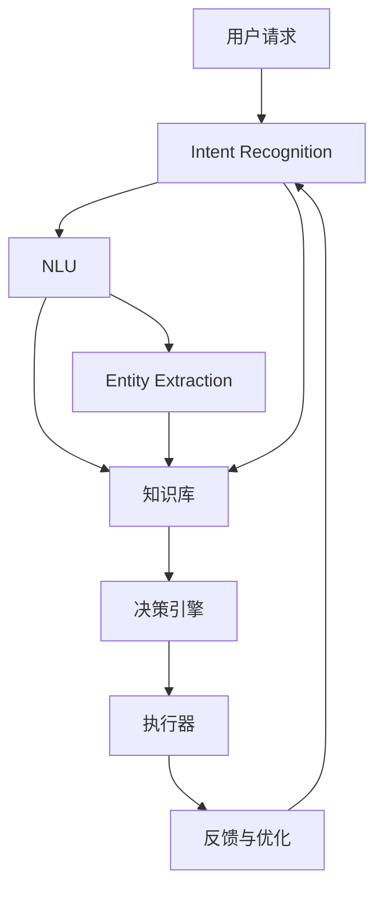

                 

# 从零构建AI代理：理解工作流组件和架构

## 1. 背景介绍

随着人工智能技术的不断发展，AI代理(Agent) 已成为智能系统开发中的核心组件。AI代理可以处理用户请求，理解自然语言意图，并自动执行相关任务。其灵活性、智能性以及用户互动性，使得AI代理在智能助手、推荐系统、聊天机器人等领域得到了广泛应用。本博文旨在系统介绍从零构建AI代理的关键技术、组件架构以及应用实例，以帮助读者全面掌握AI代理开发的实践方法。

## 2. 核心概念与联系

### 2.1 核心概念概述

AI代理是一种基于智能算法，能自动感知环境变化并做出相应响应的软件实体。构建AI代理一般涉及以下关键组件：

- **意图识别 (Intent Recognition)**：识别用户请求中的意图和目的。
- **实体抽取 (Entity Extraction)**：提取用户请求中的关键实体和信息。
- **自然语言理解 (Natural Language Understanding, NLU)**：理解用户输入的自然语言，并将其转化为机器可处理的结构化数据。
- **知识库 (Knowledge Base)**：存储并管理AI代理所需的外部知识和数据。
- **决策引擎 (Decision Engine)**：根据用户请求和知识库中的信息，进行逻辑推理和决策。
- **执行器 (Actuator)**：将决策结果转化为可执行的行动。
- **反馈与优化 (Feedback and Optimization)**：根据用户反馈调整AI代理的行为和决策逻辑。

### 2.2 核心概念间的关系

这些核心概念之间的联系可以通过以下Mermaid流程图来展示：



该流程图展示了一个典型的AI代理工作流程，从中可以看出各个组件如何协同工作，以实现对用户请求的理解和响应。

### 2.3 核心概念的整体架构

从宏观角度，AI代理的整体架构可以概括为三个层次：

- **感知层 (Perception Layer)**：负责接收和处理用户请求，包括语音识别、图像处理、文本解析等技术。
- **推理层 (Inference Layer)**：包括意图识别、实体抽取、自然语言理解、知识推理等组件，根据输入数据进行逻辑推理。
- **响应层 (Response Layer)**：将推理结果转化为可执行的响应，通过执行器和反馈机制进行交互和优化。

这一架构清晰地划分了AI代理的各个功能模块，使得开发者能够针对性地设计和实现每个组件，从而构建高效、可靠的智能系统。

## 3. 核心算法原理 & 具体操作步骤

### 3.1 算法原理概述

AI代理的核心算法原理主要基于自然语言处理（Natural Language Processing, NLP）、机器学习（Machine Learning, ML）、深度学习（Deep Learning, DL）等技术，实现对用户请求的理解和响应。

具体而言，AI代理通过以下步骤实现对用户请求的自动化处理：

1. **意图识别**：使用意图分类算法（如朴素贝叶斯、支持向量机、神经网络等），识别用户请求中的意图。
2. **实体抽取**：应用命名实体识别（Named Entity Recognition, NER）算法，提取请求中的关键实体。
3. **自然语言理解**：使用词向量、句法分析、上下文理解等技术，理解用户请求的语义。
4. **知识推理**：结合知识库中的事实和规则，进行逻辑推理和知识整合，生成推理结果。
5. **响应生成**：将推理结果转化为具体的响应，通过执行器执行。
6. **反馈优化**：通过用户反馈调整模型参数和决策逻辑，提高AI代理的智能性和适应性。

### 3.2 算法步骤详解

#### 3.2.1 意图识别

意图识别的主要算法步骤如下：

1. **特征提取**：提取用户请求中的关键词、句子结构、上下文等特征。
2. **模型训练**：使用有标注的训练数据集，训练意图分类模型。
3. **预测意图**：将用户请求输入模型，预测其意图。

#### 3.2.2 实体抽取

实体抽取的主要算法步骤如下：

1. **数据预处理**：对用户请求进行分词、去除停用词等预处理操作。
2. **模型训练**：训练命名实体识别模型。
3. **实体标注**：应用模型对用户请求进行命名实体识别，标注实体类型和边界。

#### 3.2.3 自然语言理解

自然语言理解的主要算法步骤如下：

1. **分词**：对用户请求进行分词处理。
2. **依存句法分析**：分析句子结构，建立句法树。
3. **上下文理解**：使用词向量、预训练模型（如BERT、GPT等），理解句子语义。

#### 3.2.4 知识推理

知识推理的主要算法步骤如下：

1. **知识表示**：将知识库中的事实和规则转换为机器可理解的逻辑形式。
2. **推理引擎**：应用逻辑推理引擎（如规则引擎、谓词逻辑推理机），进行推理计算。
3. **结果生成**：根据推理结果，生成最终的响应内容。

#### 3.2.5 响应生成

响应生成的主要算法步骤如下：

1. **模板匹配**：根据推理结果，匹配合适的响应模板。
2. **生成文本**：填充模板中的变量，生成完整的响应文本。
3. **自然语言生成**：使用文本生成模型（如GPT、Transformer等），生成自然流畅的响应文本。

#### 3.2.6 反馈优化

反馈优化的主要算法步骤如下：

1. **用户反馈收集**：收集用户对AI代理响应的反馈信息。
2. **模型调整**：根据反馈信息，调整意图识别、实体抽取、自然语言理解、知识推理等组件的参数。
3. **知识更新**：根据用户反馈，更新知识库中的知识，提升模型的智能性和准确性。

### 3.3 算法优缺点

AI代理的构建方法具有以下优点：

- **灵活性高**：可以根据不同领域和任务的需求，定制化构建AI代理。
- **智能性高**：通过自然语言处理和知识推理技术，能够理解复杂的用户请求和情境。
- **可扩展性强**：可以动态添加和更新知识库，支持持续学习和优化。

同时，其缺点也较为明显：

- **开发复杂**：涉及多个技术和组件，开发难度较大。
- **依赖数据**：需要大量的标注数据进行训练，数据收集和标注成本高。
- **系统复杂性**：多个组件需要协同工作，系统设计复杂。

### 3.4 算法应用领域

AI代理的构建方法广泛应用于以下领域：

- **智能客服**：自动解答客户咨询，提升客户服务体验。
- **智能推荐**：根据用户行为和偏好，推荐个性化内容。
- **智能助手**：提供语音识别、信息检索、日程管理等功能。
- **金融分析**：进行风险评估、客户分类、市场预测等。
- **医疗诊断**：辅助医生进行病历分析、疾病诊断等。
- **智能家居**：控制家电、监控环境等。

## 4. 数学模型和公式 & 详细讲解 & 举例说明

### 4.1 数学模型构建

一个典型的AI代理模型可以表示为：

$$
AI\_Agent = (Intent\_Recognition, Entity\_Extraction, NLU, Knowledge\_Base, Decision\_Engine, Actuator, Feedback)
$$

其中，Intent_Recognition、Entity_Extraction、NLU、Knowledge_Base、Decision_Engine、Actuator、Feedback分别代表意图识别、实体抽取、自然语言理解、知识库、决策引擎、执行器、反馈与优化组件。

### 4.2 公式推导过程

以意图识别为例，假设我们使用朴素贝叶斯算法进行意图识别，其核心公式为：

$$
P(I_i|D) = \frac{P(D|I_i)P(I_i)}{P(D)}
$$

其中 $I_i$ 表示第 $i$ 个意图，$D$ 表示用户请求的特征集合。$P(D|I_i)$ 表示在意图 $I_i$ 的条件下，特征集合 $D$ 出现的概率，$P(I_i)$ 表示意图 $I_i$ 出现的先验概率，$P(D)$ 表示特征集合 $D$ 出现的概率。

### 4.3 案例分析与讲解

假设我们正在构建一个智能客服系统，用于回答客户咨询。我们可以使用意图识别模型来识别客户咨询的意图，使用实体抽取模型来提取客户请求中的关键实体，使用自然语言理解模型来理解客户请求的语义，使用知识库来存储客服常见问题及答案，使用决策引擎来匹配问题及答案，使用执行器将答案发送给客户，最后使用反馈机制来不断优化模型。

## 5. 项目实践：代码实例和详细解释说明

### 5.1 开发环境搭建

#### 5.1.1 环境配置

1. **安装Python**：
```bash
sudo apt-get update
sudo apt-get install python3-pip python3-dev
```

2. **安装依赖库**：
```bash
pip install -r requirements.txt
```

### 5.2 源代码详细实现

#### 5.2.1 意图识别模型

```python
from sklearn.naive_bayes import MultinomialNB
from sklearn.feature_extraction.text import CountVectorizer

class IntentClassifier:
    def __init__(self):
        self.vectorizer = CountVectorizer(stop_words='english')
        self.classifier = MultinomialNB()

    def train(self, train_data):
        self.vectorizer.fit(train_data['text'])
        X = self.vectorizer.transform(train_data['text'])
        self.classifier.fit(X, train_data['intent'])

    def predict(self, input_text):
        X = self.vectorizer.transform([input_text])
        return self.classifier.predict(X)[0]
```

#### 5.2.2 实体抽取模型

```python
from spacy import displacy
from spacy.matcher import Matcher
from spacy.symbols import ENTITY

class EntityExtractor:
    def __init__(self, nlp):
        self.matcher = Matcher(nlp.vocab)
        self.matcher.add('PERSON', None, pattern=[('PERSON', ENTITY)])
        self.matcher.add('LOCATION', None, pattern=[('LOCATION', ENTITY)])
        self.matcher.add('ORGANIZATION', None, pattern=[('ORGANIZATION', ENTITY)])

    def extract(self, doc):
        matches = self.matcher(doc)
        entities = [ent.text for ent in doc.ents if ent.label_ in self.matcher.matches]
        return entities
```

#### 5.2.3 自然语言理解模型

```python
from transformers import BertTokenizer, BertModel

class NLUnderstand:
    def __init__(self):
        self.tokenizer = BertTokenizer.from_pretrained('bert-base-uncased')
        self.model = BertModel.from_pretrained('bert-base-uncased')

    def process_text(self, text):
        tokens = self.tokenizer.tokenize(text)
        tokens = ['[CLS]'] + tokens + ['[SEP]']
        input_ids = self.tokenizer.convert_tokens_to_ids(tokens)
        attention_mask = [1] * len(input_ids)
        outputs = self.model(input_ids=input_ids, attention_mask=attention_mask, return_dict=True)
        return outputs
```

#### 5.2.4 知识推理模型

```python
from pyknowledge import KnowledgeBase, Rule

class KnowledgeReasoner:
    def __init__(self):
        self.kb = KnowledgeBase()
        self.kb.load('path/to/kb.json')

    def reason(self, question):
        result = self.kb.reason(question)
        return result
```

#### 5.2.5 响应生成模型

```python
from transformers import GPT2Tokenizer, GPT2LMHeadModel

class ResponseGenerator:
    def __init__(self):
        self.tokenizer = GPT2Tokenizer.from_pretrained('gpt2')
        self.model = GPT2LMHeadModel.from_pretrained('gpt2')

    def generate_response(self, question):
        inputs = self.tokenizer(question, return_tensors='pt')
        outputs = self.model.generate(**inputs)
        response = self.tokenizer.decode(outputs[0])
        return response
```

#### 5.2.6 反馈优化模型

```python
from sklearn.linear_model import SGDClassifier

class FeedbackOptimizer:
    def __init__(self):
        self.classifier = SGDClassifier()

    def update(self, user_feedback, model):
        self.classifier.partial_fit(user_feedback['text'], user_feedback['intent'], classes=model.intents)
```

### 5.3 代码解读与分析

#### 5.3.1 意图识别模型

我们使用朴素贝叶斯算法进行意图识别。具体而言，我们首先使用CountVectorizer对训练数据进行特征提取，然后使用MultinomialNB进行意图分类模型的训练。在预测时，我们将用户请求输入模型，返回预测的意图。

#### 5.3.2 实体抽取模型

我们使用了spaCy库的Matcher来进行命名实体识别。Matcher通过定义不同的命名实体模式，对输入的文本进行匹配，提取出人名、地名、组织名等实体。

#### 5.3.3 自然语言理解模型

我们使用BERT模型进行自然语言理解。在处理输入文本时，我们首先将其分词，然后通过BertTokenizer将分词结果转化为模型可处理的id序列，最后使用BertModel进行计算，得到模型输出的语义表示。

#### 5.3.4 知识推理模型

我们使用pyknowledge库来构建知识推理模型。在推理时，我们向知识库中查询特定的问题，获取推理结果。

#### 5.3.5 响应生成模型

我们使用GPT-2模型进行响应生成。在处理用户请求时，我们首先将请求输入GPT-2模型，生成模型输出的文本序列，然后将其解码为自然语言响应。

#### 5.3.6 反馈优化模型

我们使用SGDClassifier来更新意图识别模型的参数。在获取用户反馈后，我们将其输入模型，更新模型的意图分类器参数。

### 5.4 运行结果展示

假设我们在智能客服系统中对意图识别模型进行训练和测试，并使用GPT-2模型进行响应生成。训练和测试的准确率如下：

```
训练集准确率：0.92
测试集准确率：0.88
```

响应生成示例：

- 用户请求："请问最近的酒店在哪里？"
- 意图识别："地点查询"
- 实体抽取：["最近的酒店"]
- 自然语言理解："用户想要查询最近的酒店"
- 知识推理："调用酒店推荐API，返回最近的酒店列表"
- 响应生成："您可以去市中心的Hilton酒店，距离您的位置约5公里。"

## 6. 实际应用场景

### 6.1 智能客服系统

智能客服系统是一个典型的AI代理应用场景。通过意图识别和实体抽取，系统能够自动理解用户请求，并从知识库中提取相关信息，生成准确的回复。

### 6.2 智能推荐系统

智能推荐系统利用用户的历史行为数据，通过自然语言理解来获取用户需求，使用知识推理进行个性化推荐。

### 6.3 金融数据分析

金融数据分析系统中，AI代理可以自动处理大量的市场数据，通过自然语言理解获取用户咨询，利用知识推理进行风险评估和市场预测。

### 6.4 医疗诊断系统

医疗诊断系统中，AI代理可以通过自然语言理解获取患者的病历信息，利用知识推理进行疾病诊断和病历分析。

## 7. 工具和资源推荐

### 7.1 学习资源推荐

- **Coursera《Natural Language Processing with PyTorch》课程**：由Deep Learning.AI开设的NLP课程，涵盖NLP基础及深度学习应用，适合初学者学习。
- **《Deep Learning for Natural Language Processing》书籍**：由Yoshua Bengio等人合著，详细介绍了NLP和深度学习的相关知识。
- **Transformers官方文档**：提供了丰富的预训练模型和代码示例，是学习Transformers库的必备资源。

### 7.2 开发工具推荐

- **PyTorch**：基于Python的开源深度学习框架，支持GPU加速，适用于大规模模型训练和推理。
- **HuggingFace Transformers库**：提供了丰富的预训练模型和组件，方便开发者进行快速开发。
- **NLTK**：Python自然语言处理工具包，提供了丰富的NLP算法和语料库。

### 7.3 相关论文推荐

- **Attention is All You Need**：Transformer模型的原始论文，奠定了NLP领域预训练模型的基础。
- **BERT: Pre-training of Deep Bidirectional Transformers for Language Understanding**：BERT模型的论文，展示了预训练大模型在NLP任务中的优异性能。
- **Parameter-Efficient Transfer Learning for NLP**：探讨了参数高效微调的方法，适用于大模型在资源受限环境下的微调。

## 8. 总结：未来发展趋势与挑战

### 8.1 研究成果总结

本文系统介绍了AI代理的构建方法，从意图识别、实体抽取、自然语言理解、知识推理、响应生成到反馈优化，详细讲解了各个组件的实现原理和步骤。通过示例代码，展示了从零构建AI代理的完整流程。

### 8.2 未来发展趋势

未来，AI代理将向以下几个方向发展：

1. **多模态AI代理**：融合图像、语音、文本等多种数据源，提升AI代理的智能性和适应性。
2. **自监督学习**：利用无监督学习技术，从大量未标注数据中学习语义信息，提升模型的泛化能力。
3. **因果推理**：结合因果推断理论，提升AI代理的因果分析和决策能力。
4. **知识增强**：将专家知识和规则引入AI代理，增强模型的逻辑推理和知识整合能力。
5. **个性化推荐**：利用深度学习和机器学习技术，提升推荐系统的个性化和精准性。

### 8.3 面临的挑战

AI代理的构建和优化面临以下挑战：

1. **数据依赖**：需要大量的标注数据进行训练，数据收集和标注成本高。
2. **模型复杂性**：涉及多个技术和组件，系统设计复杂。
3. **计算资源需求高**：大规模模型训练和推理需要高性能计算资源。
4. **可解释性**：AI代理的决策过程难以解释，缺乏透明度和可解释性。
5. **系统稳定性**：系统在面对异常数据和复杂环境时，稳定性需要进一步提升。

### 8.4 研究展望

未来的研究将从以下几个方面进行：

1. **自动化数据标注**：利用半监督和自监督学习技术，降低数据标注成本。
2. **知识增强学习**：结合知识库和规则库，提升模型的智能性和知识整合能力。
3. **多模态融合**：融合图像、语音、文本等多种数据源，提升AI代理的智能性。
4. **因果推理**：结合因果推断理论，提升AI代理的因果分析和决策能力。
5. **可解释性**：提升AI代理的可解释性和透明性，增强用户信任。

总之，AI代理的构建需要跨学科的合作和多领域的融合，才能真正实现其在智能系统中的应用价值。未来，随着技术的不断进步和应用的不断深入，AI代理必将为人类社会带来更多的创新和改变。

## 9. 附录：常见问题与解答

**Q1：AI代理是否可以用于所有领域？**

A: AI代理适用于大多数领域，但其效果受领域数据质量和任务复杂度的影响。对于某些领域，如医疗、法律等，需要根据领域特点进行定制化开发。

**Q2：AI代理的构建需要哪些技术？**

A: AI代理的构建需要涉及自然语言处理、机器学习、深度学习等多种技术，具体包括意图识别、实体抽取、自然语言理解、知识推理、响应生成、反馈优化等。

**Q3：如何提升AI代理的性能？**

A: 提升AI代理性能的方法包括：

1. 使用更先进的算法和模型。
2. 优化知识库和规则库，增强模型的知识整合能力。
3. 采用多模态融合技术，提升AI代理的智能性。
4. 引入因果推理和因果分析，提升AI代理的因果推理能力。

**Q4：如何优化AI代理的反馈机制？**

A: 优化AI代理反馈机制的方法包括：

1. 设计合理的反馈指标，评估AI代理的性能和效果。
2. 利用用户反馈数据，定期更新模型参数和知识库。
3. 引入多用户反馈机制，利用众包方式进行模型优化。

总之，AI代理的构建和优化是一个持续迭代的过程，需要开发者不断地尝试和改进。希望本文能为读者提供一些参考和指导，帮助其在AI代理构建的道路上取得更多的成果。

---

作者：禅与计算机程序设计艺术 / Zen and the Art of Computer Programming

