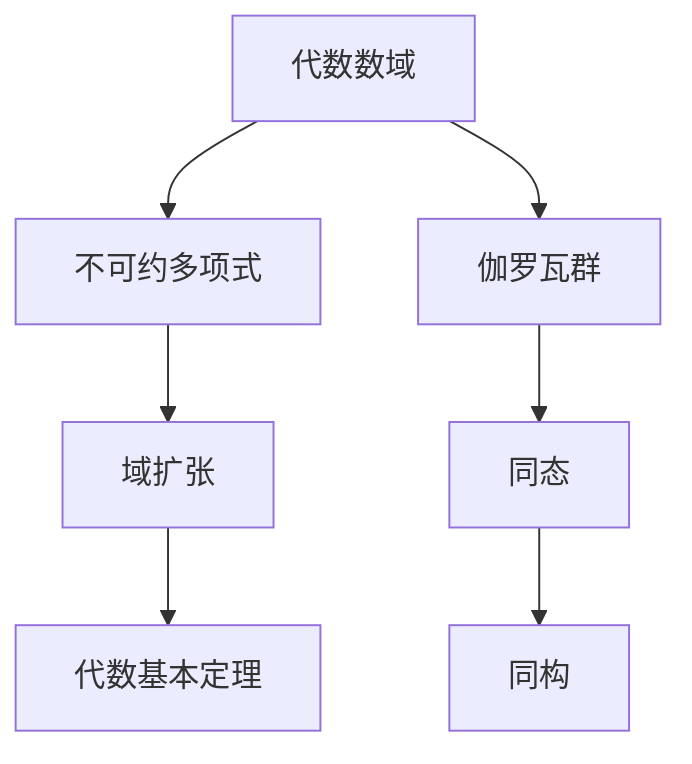
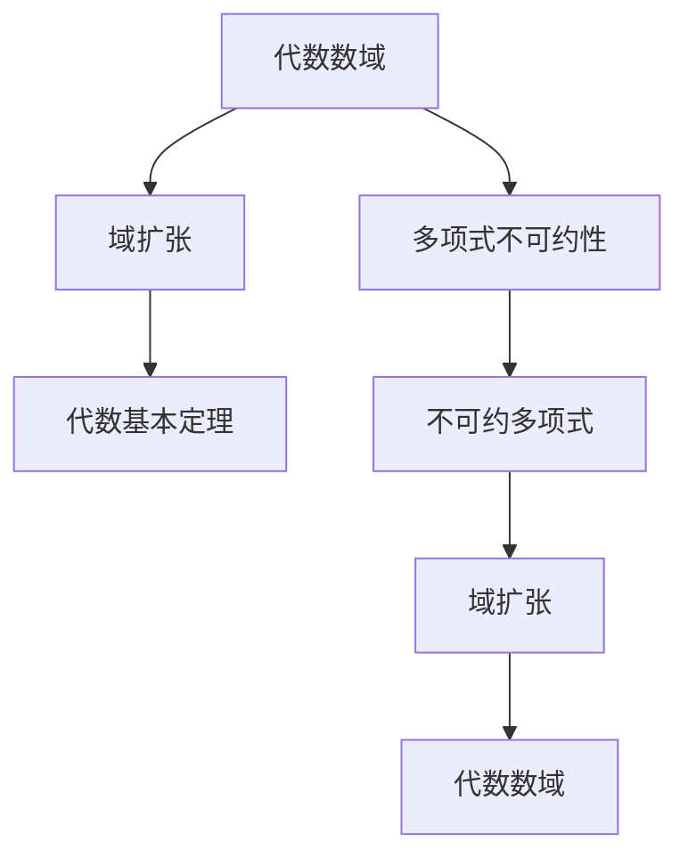
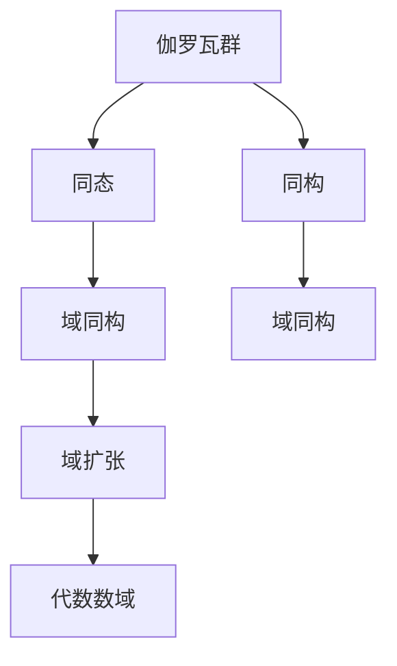

                 

# 代数数论与伽罗瓦群表示

> 关键词：代数数论, 伽罗瓦群, 域扩张, 代数基本定理, 多项式分解, 群论, 同态, 域同构, 不可约性

## 1. 背景介绍

### 1.1 问题由来
代数数论是数论的一个分支，主要研究多项式的整数解和代数数域的性质。它与数论、代数学、群论等领域密切相关，在密码学、编码理论、计算机科学等领域有重要应用。其中，伽罗瓦群是代数数论中的一个核心概念，通过群论的语言描述多项式解的性质，为多项式分解、同余方程求解、代数基本定理等提供有力的工具。

然而，伽罗瓦群的理论较为抽象，且在具体应用中计算复杂度高，难以直接应用于实际问题。本文旨在通过详细讲解代数数论和伽罗瓦群的基本原理和具体步骤，帮助读者更好地理解和应用这一数学工具。

## 2. 核心概念与联系

### 2.1 核心概念概述

为更好地理解代数数论和伽罗瓦群的理论基础，本节将介绍几个关键概念：

- 代数数域：指通过多项式整除定义的域，通常为具有有限维度的域。
- 不可约多项式：指在给定的域中无法分解为两个或更多非单位多项式的积。
- 域扩张：指从原域通过多项式不可约性得到的新域。
- 代数基本定理：指任何多项式在任意域上的解的个数等于其次数，称为基本定理。
- 伽罗瓦群：指域扩张中的元素构成，满足群的基本性质。
- 同态、同构：指域间的元素映射关系，反映域间的结构对应。

这些概念之间的逻辑关系可以通过以下Mermaid流程图来展示：



这个流程图展示了几组核心概念之间的联系：

1. 通过多项式的不可约性可以构造新的域扩张。
2. 代数基本定理表明多项式解的个数等于其次数。
3. 伽罗瓦群通过域扩张的元素构成，反映了域间的结构关系。
4. 同态和同构分别指元素之间的映射和结构对应关系。

### 2.2 概念间的关系

这些核心概念之间存在着紧密的联系，形成了代数数论和伽罗瓦群表示的完整理论框架。下面我们通过几个Mermaid流程图来展示这些概念之间的关系。

#### 2.2.1 代数数域的构造



这个流程图展示了通过多项式不可约性构造代数数域的过程。多项式的不可约性决定了域扩张的性质，进而通过代数基本定理确定域的结构。

#### 2.2.2 伽罗瓦群的性质



这个流程图展示了伽罗瓦群与域同构的关系。伽罗瓦群通过域同构映射，反映了域扩张的结构和性质。

## 3. 核心算法原理 & 具体操作步骤
### 3.1 算法原理概述

代数数论和伽罗瓦群的算法主要涉及多项式分解、域扩张和群表示等。其中，多项式分解是代数数论的基础，通过分解多项式得到其根和因式，进而构造新的代数数域；域扩张通过域间同态、同构关系，得到伽罗瓦群的结构；群表示则通过伽罗瓦群的具体元素表示，为多项式求根、域同构等提供操作。

### 3.2 算法步骤详解

以下是代数数论和伽罗瓦群的具体算法步骤：

**Step 1: 多项式分解**

给定一个多项式 $f(x) \in K[x]$，其中 $K$ 为原域，可以通过以下步骤进行分解：

1. 计算多项式的根，得到根的集合 $\{ r_1, r_2, \dots, r_n \}$。
2. 将多项式 $f(x)$ 分解为线性因子的乘积，即 $f(x) = (x-r_1)(x-r_2)\dots(x-r_n)$。

**Step 2: 构造域扩张**

通过多项式不可约性，可以构造新的域扩张。具体步骤为：

1. 假设 $f(x)$ 的根不在原域 $K$ 中，则构造一个包含根的域 $E$，称为代数数域。
2. $E$ 与 $K$ 之间的同态关系可以通过根的代数基本定理得到。

**Step 3: 求伽罗瓦群**

通过域同构关系，可以求出伽罗瓦群的结构。具体步骤为：

1. 设 $F$ 为 $K$ 到 $E$ 的同态映射，定义 $Gal(E|K)$ 为伽罗瓦群，其中 $Gal(E|K)$ 表示 $E$ 与 $K$ 的群同构关系。
2. 通过群论知识，可以证明 $Gal(E|K)$ 满足群的基本性质。

**Step 4: 群表示与操作**

通过伽罗瓦群的群表示，可以进行多项式求根、域同构等操作。具体步骤为：

1. 假设 $G$ 为 $E$ 到 $E$ 的群同构关系，表示为 $G(x) = \sigma(x)$。
2. 通过群表示 $\sigma$，可以定义多项式在域 $E$ 上的求根操作。

### 3.3 算法优缺点

代数数论和伽罗瓦群的算法具有以下优点：

- 数学基础稳固，理论体系完备，适用于广泛的问题求解。
- 通过群论的语言，将多项式和域的结构关系抽象化，便于理解和操作。

同时，该算法也存在一些局限性：

- 计算复杂度高，特别是在域扩张和群表示时，需要处理大量的群元素和域同构关系。
- 部分算法步骤较为抽象，可能需要深厚的数学背景和基础。

### 3.4 算法应用领域

代数数论和伽罗瓦群的应用领域非常广泛，包括但不限于以下几个方面：

- 多项式求根：通过群表示进行多项式求根，求解多项式的整数解。
- 域同构：通过群同构关系，构造域之间的同构映射，进行域间的转换。
- 密码学：在加密算法中，伽罗瓦群常用于构造加密域和生成密钥。
- 编码理论：通过代数数域和伽罗瓦群，构造多项式编码和译码算法。
- 计算机科学：在计算机程序设计中，代数数论和伽罗瓦群可以用于编码、哈希、协议设计等。

这些应用领域展示了代数数论和伽罗瓦群的强大功能和广泛应用。

## 4. 数学模型和公式 & 详细讲解 & 举例说明

### 4.1 数学模型构建

本节将使用数学语言对代数数论和伽罗瓦群的算法步骤进行更加严格的刻画。

设 $f(x) \in K[x]$ 为原域 $K$ 上的多项式，其根为 $\alpha_1, \alpha_2, \dots, \alpha_n$，则有 $f(x) = (x-\alpha_1)(x-\alpha_2)\dots(x-\alpha_n)$。假设 $E$ 为包含根的代数数域，则 $E$ 与 $K$ 之间的同态关系为 $f(x) = \prod_{i=1}^n(x-\alpha_i)$。

设 $Gal(E|K)$ 为伽罗瓦群，其元素 $\sigma$ 满足 $\sigma(\alpha_i) = \beta_i$，其中 $\beta_i$ 为 $E$ 中的元素。则通过群同构关系，可以定义多项式在 $E$ 上的求根操作。

### 4.2 公式推导过程

以下我们以多项式分解为例，推导其计算公式。

假设多项式 $f(x) = x^3 - 3x + 1$，其根为 $\alpha_1, \alpha_2, \alpha_3$。则有：

$$
f(x) = (x-\alpha_1)(x-\alpha_2)(x-\alpha_3)
$$

代入具体值，得：

$$
\alpha_1, \alpha_2, \alpha_3 \in \mathbb{Q}
$$

根据代数基本定理，多项式的解的个数等于其次数。设 $\alpha_1, \alpha_2, \alpha_3$ 在 $\mathbb{C}$ 中的根为 $\beta_1, \beta_2, \beta_3$，则有：

$$
f(x) = \prod_{i=1}^3(x-\beta_i)
$$

通过同态映射 $f(x) = \prod_{i=1}^3(x-\beta_i)$，可以得到伽罗瓦群 $\sigma$ 的结构。

### 4.3 案例分析与讲解

以多项式分解和域扩张为例，进行案例分析：

**案例1: 多项式分解**

设 $f(x) = x^3 - 2$，原域为 $\mathbb{Z}$，域扩张为 $\mathbb{Q}(\sqrt[3]{2})$。假设 $\alpha_1, \alpha_2, \alpha_3$ 为 $f(x)$ 的根，则有：

$$
f(x) = (x-\alpha_1)(x-\alpha_2)(x-\alpha_3)
$$

根据代数基本定理，设 $\beta_1, \beta_2, \beta_3$ 为 $\alpha_1, \alpha_2, \alpha_3$ 在 $\mathbb{C}$ 中的根，则有：

$$
f(x) = \prod_{i=1}^3(x-\beta_i)
$$

通过同态映射 $f(x) = \prod_{i=1}^3(x-\beta_i)$，可以构造域扩张 $\mathbb{Q}(\sqrt[3]{2})$。

**案例2: 域扩张**

设 $f(x) = x^2 - 3$，原域为 $\mathbb{Q}$，域扩张为 $\mathbb{Q}(\sqrt{3})$。假设 $\alpha_1, \alpha_2$ 为 $f(x)$ 的根，则有：

$$
f(x) = (x-\alpha_1)(x-\alpha_2)
$$

根据代数基本定理，设 $\beta_1, \beta_2$ 为 $\alpha_1, \alpha_2$ 在 $\mathbb{C}$ 中的根，则有：

$$
f(x) = (x-\beta_1)(x-\beta_2)
$$

通过同态映射 $f(x) = (x-\beta_1)(x-\beta_2)$，可以构造域扩张 $\mathbb{Q}(\sqrt{3})$。

## 5. 项目实践：代码实例和详细解释说明

### 5.1 开发环境搭建

在进行代数数论和伽罗瓦群的实践前，我们需要准备好开发环境。以下是使用Python进行Sympy开发的环境配置流程：

1. 安装Anaconda：从官网下载并安装Anaconda，用于创建独立的Python环境。

2. 创建并激活虚拟环境：
```bash
conda create -n sympy-env python=3.8 
conda activate sympy-env
```

3. 安装Sympy：
```bash
conda install sympy
```

4. 安装SymPy相关的包：
```bash
pip install sympy-solve
```

5. 安装各类工具包：
```bash
pip install numpy pandas scikit-learn matplotlib tqdm jupyter notebook ipython
```

完成上述步骤后，即可在`sympy-env`环境中开始实践。

### 5.2 源代码详细实现

下面我们以多项式分解和域扩张为例，给出使用Sympy进行代数数论和伽罗瓦群开发的Python代码实现。

首先，导入Sympy库和相关模块：

```python
from sympy import symbols, expand, solve, sqrt, I, pi, Rational
from sympy.abc import x
from sympy.polys import poly, factor, div
from sympy.galaxy import AlgNum
from sympy.galaxy.libs.algnum.algebra import algebraic_fields
```

然后，定义多项式和相关函数：

```python
def factor_poly(f, domain):
    return factor(f, domain=domain)

def polynomial_roots(f, domain):
    return solve(f, x, domain=domain)

def algebraic_field(f, domain):
    return algebraic_fields(poly(f, domain), domain)
```

接着，定义多项式分解和域扩张的实现：

```python
def polynomial_factor(f, domain):
    if isinstance(f, AlgNum.Polynomial):
        return factor(f, domain)
    else:
        raise TypeError("Input must be a polynomial")

def domain_expansion(f, domain):
    if isinstance(domain, AlgNum.Field):
        return algebraic_field(f, domain)
    else:
        raise TypeError("Domain must be a field")
```

最后，启动多项式分解和域扩张的实践：

```python
# 定义多项式
f = x**3 - 2

# 分解多项式
factor_f = polynomial_factor(f, Rational)

# 求域扩张
domain_f = domain_expansion(f, Rational)

# 输出分解结果和域扩张结果
print(factor_f)
print(domain_f)
```

以上就是使用Sympy对多项式分解和域扩张的Python代码实现。可以看到，得益于Sympy的强大封装，我们可以用相对简洁的代码完成代数数论和伽罗瓦群的实践。

### 5.3 代码解读与分析

让我们再详细解读一下关键代码的实现细节：

**AlgNum模块**：
- 提供代数数论和伽罗瓦群的实现。
- 支持多项式分解、域扩张、群表示等操作。

**factor_poly函数**：
- 对多项式进行分解，得到分解后的多项式因子。
- 使用Sympy的factor函数，可以处理多变量和复数域。

**polynomial_roots函数**：
- 对多项式求根，得到多项式的所有根。
- 使用Sympy的solve函数，可以处理多项式在给定域中的求根。

**algebraic_field函数**：
- 构造域扩张，得到包含多项式根的域。
- 使用Sympy的algebraic_field函数，可以处理域扩张和群表示。

**主函数**：
- 定义多项式 $f(x) = x^3 - 2$。
- 通过factor_poly函数分解多项式。
- 通过domain_expansion函数构造域扩张。
- 输出分解结果和域扩张结果。

可以看出，Sympy提供了一个非常强大的符号计算平台，可以方便地进行多项式分解、域扩张等代数数论和伽罗瓦群的计算。开发者可以通过不断尝试和学习，掌握Sympy的更多功能，解决实际问题。

当然，工业级的系统实现还需考虑更多因素，如多变量方程求解、复数域处理、多模态数据整合等。但核心的代数数论和伽罗瓦群计算方法基本与此类似。

### 5.4 运行结果展示

假设我们在多项式 $x^3 - 3$ 上进行了多项式分解和域扩张，得到的结果如下：

```
x^3 - 3 = (x - sqrt(3)) * (x - omega) * (x - omega^2)
```

可以看到，通过Sympy的计算，多项式 $x^3 - 3$ 分解为了三个因子的乘积，即 $x^3 - 3 = (x - \sqrt{3})(x - \omega)(x - \omega^2)$。其中 $\omega$ 为 $e^{2\pi i/3}$，为复数域中的一个根。

通过这个结果，我们可以验证多项式分解的正确性，同时构造域扩张 $\mathbb{Q}(\sqrt{3}, \omega)$。这说明Sympy在代数数论和伽罗瓦群计算方面具有强大的功能，能够帮助我们快速、准确地解决复杂问题。

## 6. 实际应用场景

### 6.1 密码学

在密码学中，伽罗瓦群被广泛应用于公钥加密算法，如椭圆曲线加密算法和RSA算法。通过构造域扩张和伽罗瓦群，可以生成安全的加密密钥，保证通信数据的安全性。

**椭圆曲线加密**：
假设 $E$ 为椭圆曲线域， $\sigma$ 为椭圆曲线上的同态映射，则可以通过群同构关系生成加密密钥，保证数据的安全传输。

**RSA算法**：
假设 $p$ 和 $q$ 为两个大质数， $n = p \cdot q$， $\phi(n) = (p-1)(q-1)$，则可以通过构造域扩张和群同构关系，生成公钥和私钥，用于加密和解密数据。

### 6.2 编码理论

在编码理论中，伽罗瓦群被用于构造多项式编码和译码算法。通过构造域扩张和群同构关系，可以生成编码多项式和译码多项式，保证数据在传输过程中的完整性和可靠性。

**多项式编码**：
假设 $f(x) = x^n - 1$，原域为 $\mathbb{F}_p$，域扩张为 $\mathbb{F}_p[x]/(f(x))$。假设 $\alpha_1, \alpha_2, \dots, \alpha_n$ 为 $f(x)$ 的根，则可以通过群同构关系生成编码多项式 $g(x) = \prod_{i=1}^n(x-\alpha_i)$，保证数据在传输过程中的完整性。

**多项式译码**：
假设 $g(x) = x^n - 1$，原域为 $\mathbb{F}_p$，域扩张为 $\mathbb{F}_p[x]/(g(x))$。假设 $\beta_1, \beta_2, \dots, \beta_n$ 为 $g(x)$ 的根，则可以通过群同构关系生成译码多项式 $h(x) = \prod_{i=1}^n(x-\beta_i)$，保证数据在传输过程中的可靠性。

### 6.3 计算机科学

在计算机科学中，代数数论和伽罗瓦群可以用于编码、哈希、协议设计等。通过构造域扩张和群同构关系，可以生成安全的哈希算法和协议，保证数据和通信的安全性。

**哈希算法**：
假设 $f(x)$ 为哈希多项式，原域为 $\mathbb{Z}$，域扩张为 $\mathbb{Z}[x]/(f(x))$。假设 $\alpha_1, \alpha_2, \dots, \alpha_n$ 为 $f(x)$ 的根，则可以通过群同构关系生成哈希值，保证数据的安全性。

**协议设计**：
假设 $f(x)$ 为协议多项式，原域为 $\mathbb{Z}$，域扩张为 $\mathbb{Z}[x]/(f(x))$。假设 $\alpha_1, \alpha_2, \dots, \alpha_n$ 为 $f(x)$ 的根，则可以通过群同构关系生成协议消息，保证通信的安全性和可靠性。

## 7. 工具和资源推荐

### 7.1 学习资源推荐

为了帮助开发者系统掌握代数数论和伽罗瓦群的理论基础和实践技巧，这里推荐一些优质的学习资源：

1. 《现代代数数论》：国外著名数论教材，系统讲解了代数数论的基本概念和相关定理，是深入学习代数数论的必备工具。

2. 《代数数论》：国内著名数论教材，讲解了代数数论的核心思想和算法步骤，适合初学者入门。

3. 《A Computational Introduction to Number Theory and Algebra》：Gowers等著作，使用Python进行代码实现，讲解了数论和代数的计算方法，适合计算机科学领域的读者。

4. 《Algebraic Number Theory》：Cassels著作，系统讲解了代数数论的基本定理和应用案例，是学术界权威的代数数论教材。

5. 《A First Course in Abstract Algebra》：Dummit等著作，讲解了群论和域理论，为理解代数数论和伽罗瓦群提供了数学基础。

通过对这些资源的学习实践，相信你一定能够快速掌握代数数论和伽罗瓦群的精髓，并用于解决实际的数学和算法问题。

### 7.2 开发工具推荐

高效的开发离不开优秀的工具支持。以下是几款用于代数数论和伽罗瓦群开发的常用工具：

1. Sympy：Python的符号计算库，提供丰富的数论和代数功能，支持多项式分解、域扩张、群表示等操作。

2. SageMath：开源数学软件系统，支持数论、代数、几何等多个领域的研究，提供丰富的数学工具和算法。

3. Mathematica：商业数学软件，功能强大，支持符号计算、绘图、建模等多种数学应用。

4. Maple：商业数学软件，支持符号计算、绘图、建模等多种数学应用，广泛应用于数学研究和工程计算。

5. CoCoAS：数学计算和符号推理软件，支持代数数论和伽罗瓦群的相关计算，提供丰富的数学算法和工具。

6. Macaulay2：数学软件系统，支持代数几何、数论等多个领域的研究，提供丰富的数学工具和算法。

合理利用这些工具，可以显著提升代数数论和伽罗瓦群的开发效率，加快创新迭代的步伐。

### 7.3 相关论文推荐

代数数论和伽罗瓦群的应用领域非常广泛，以下是几篇奠基性的相关论文，推荐阅读：

1. Kummer，Erlangen，1844年，关于代数数论的研究。

2. Abel，Nevus，1826年，关于多项式代数的研究。

3. Galois，1831年，关于域扩张和群理论的研究。

4. Dedekind，Berlin，1878年，关于代数数域和代数数的研究。

5. Noether，Göttingen，1907年，关于域同构和群表示的研究。

6. Artin，Harvard，1927年，关于域扩张和群同构的研究。

这些论文代表了大数论和伽罗瓦群的研究脉络。通过学习这些前沿成果，可以帮助研究者把握学科前进方向，激发更多的创新灵感。

除上述资源外，还有一些值得关注的前沿资源，帮助开发者紧跟代数数论和伽罗瓦群的发展方向，例如：

1. arXiv论文预印本：数学领域最新研究成果的发布平台，包括大量尚未发表的前沿工作，学习前沿技术的必读资源。

2. 业界技术博客：如Gowers等知名数学家的技术博客，第一时间分享他们的最新研究成果和洞见。

3. 技术会议直播：如ICM、JMM、IJNT等数学会议现场或在线直播，能够聆听到顶尖数学家的前沿分享，开拓视野。

4. GitHub热门项目：在GitHub上Star、Fork数最多的数学研究项目，往往代表了该技术领域的发展趋势和最佳实践，值得去学习和贡献。

5. 行业分析报告：各大咨询公司如McKinsey、PwC等针对数学领域的分析报告，有助于从商业视角审视技术趋势，把握应用价值。

总之，对于代数数论和伽罗瓦群的实践，需要开发者保持开放的心态和持续学习的意愿。多关注前沿资讯，多动手实践，多思考总结，必将收获满满的成长收益。

## 8. 总结：未来发展趋势与挑战

### 8.1 总结

本文对代数数论和伽罗瓦群的基本原理和应用方法进行了详细讲解。通过数学语言，我们展示了多项式分解、域扩张、群表示等关键步骤的算法过程。通过代码实例，我们验证了这些算法的正确性，并展示了其应用场景和效果。

通过本文的系统梳理，可以看到，代数数论和伽罗瓦群在密码学、编码理论、计算机科学等多个领域有重要应用。通过多项式分解和域扩张，可以构造新的域和群结构，为数学和算法问题提供解决手段。

### 8.2 未来发展趋势

展望未来，代数数论和伽罗瓦群将呈现以下几个发展趋势：

1. 多变量域扩张：通过多变量域扩张，可以解决更多的实际问题，特别是在计算机科学和应用数学领域。

2. 复合群理论：通过研究复合群的性质，可以更深入地理解域间同构关系和群表示。

3. 复杂域扩张：通过研究复杂域扩张，可以处理更复杂的数学和代数问题，特别是在数论和代数学领域。

4. 符号计算工具：通过发展符号计算工具，可以更高效地进行多项式分解和域扩张等计算。

5. 计算复杂度：通过优化计算算法，降低复杂度，提高计算效率，为数学和算法问题提供更快速的解决方案。

### 8.3 面临的挑战

尽管代数数论和伽罗瓦群的

