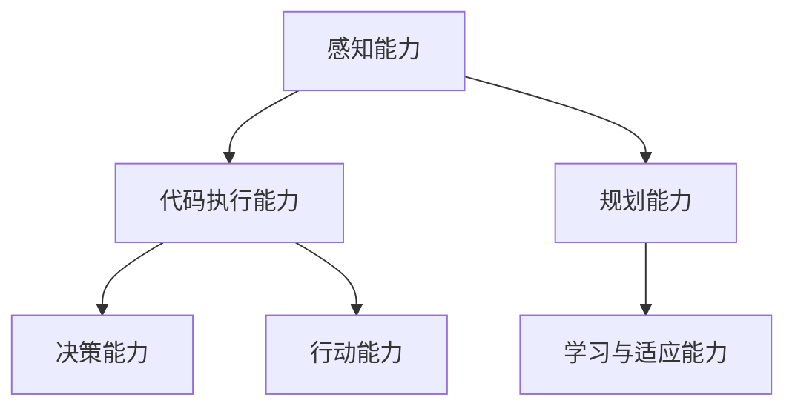

                 

# 代码执行能力在 Agent 中的作用

## 1. 背景介绍

在当今的人工智能(AI)领域，智能体(Agent)扮演着越来越重要的角色。无论是无人驾驶汽车、机器人、还是虚拟助手，智能体的广泛应用正在深刻改变我们的生产和生活方式。智能体的核心能力之一是代码执行能力，这是其智能化运作的基石。代码执行能力不仅决定了智能体能否有效执行任务，还直接影响到其决策质量和效率。本文将深入探讨代码执行能力在智能体中的作用，并分析如何提升和优化这一能力，以助力智能体的进一步发展。

## 2. 核心概念与联系

### 2.1 核心概念概述

智能体(Agent)是指能够感知环境、进行自主决策并采取相应行动的系统或软件。智能体的功能涵盖了自动规划、感知、推理、学习和控制等多个方面。智能体通过与环境的交互，不断优化自身的行为，以实现特定目标。

代码执行能力是指智能体在运行过程中，能够正确、高效地执行代码，并且能够根据环境变化灵活调整代码执行策略的能力。代码执行能力涉及代码解释、错误处理、优化和重构等多个环节。

代码执行能力与智能体的其他核心能力密切相关。例如：

- **感知能力**：智能体需要通过传感器等设备感知环境，而代码执行能力确保了感知数据的准确传递和处理。
- **规划能力**：智能体需要根据环境信息规划行动路径，代码执行能力确保了规划指令的有效执行。
- **学习与适应能力**：智能体需要不断从经验中学习，并根据新的信息调整策略。代码执行能力保证了学习机制的可靠性和适应性。

### 2.2 核心概念之间的联系

智能体的各项功能之间相互依赖、相互促进，形成一个有机整体。代码执行能力是智能体执行任务的基础，直接影响其决策和行为。

- **感知能力**：智能体的感知数据需要通过代码执行转化为可用的信息，代码执行能力确保了感知数据的有效利用。
- **规划能力**：智能体的规划策略需要通过代码执行转化为实际行动，代码执行能力确保了策略的有效执行。
- **学习与适应能力**：智能体的学习过程依赖于代码执行对历史数据的分析和处理，代码执行能力确保了学习机制的准确性和效率。

以下是一个Mermaid流程图，展示智能体中的核心概念及其关系：



这个流程图展示了智能体的各项能力之间的关系。感知能力通过代码执行能力转化为决策和行动，规划能力与学习与适应能力共同指导代码执行，进而实现智能体的自主决策和行动。

## 3. 核心算法原理 & 具体操作步骤

### 3.1 算法原理概述

智能体的代码执行能力通常通过以下算法实现：

1. **代码解释**：将高层抽象的智能体代码转化为机器可执行指令。
2. **错误处理**：检测和纠正代码执行过程中出现的错误，确保代码的正确运行。
3. **优化与重构**：根据环境变化和任务需求，动态调整和优化代码执行策略。

代码执行能力的关键在于实现一个高效、健壮且灵活的执行引擎。执行引擎负责解释和执行智能体的代码，同时支持对代码的动态调整和优化。

### 3.2 算法步骤详解

智能体的代码执行过程主要包括以下步骤：

1. **代码解析**：将智能体的代码解析为执行引擎可识别的指令集合。
2. **代码生成**：根据解析后的指令生成具体的执行计划。
3. **代码执行**：按照执行计划逐步执行智能体的代码，并实时监测环境反馈。
4. **动态调整**：根据环境反馈和任务需求，动态调整执行策略，优化代码执行效率和质量。

以下是一个详细的代码执行流程图：


这个流程图展示了代码执行的基本流程。解析后的代码通过生成具体的执行计划，然后在执行过程中实时监测环境反馈，并根据反馈动态调整执行策略，从而保证代码执行的灵活性和适应性。

### 3.3 算法优缺点

**优点**：

1. **灵活性**：代码执行能力能够根据环境变化和任务需求动态调整执行策略，适应不同的任务场景。
2. **健壮性**：通过错误处理机制，确保代码在执行过程中能够有效处理和纠正错误，保证代码的正确性。
3. **高效性**：优化与重构机制可以提升代码执行效率，降低资源消耗。

**缺点**：

1. **复杂性**：代码执行过程涉及多个环节，实现一个高效、健壮的执行引擎需要复杂的算法设计和实现。
2. **资源消耗**：代码执行过程需要占用一定的计算和内存资源，尤其是在大规模任务中。
3. **可扩展性**：随着任务复杂性的增加，代码执行能力需要不断扩展和优化，以支持更多功能和场景。

### 3.4 算法应用领域

代码执行能力在多个领域中都有广泛应用，例如：

- **自动驾驶**：自动驾驶汽车通过代码执行能力实现复杂的传感器数据处理、路径规划和决策。
- **机器人**：工业和服务机器人通过代码执行能力完成复杂的任务执行和环境交互。
- **虚拟助手**：智能虚拟助手通过代码执行能力实现自然语言处理、任务调度和多模态交互。
- **金融系统**：金融智能系统通过代码执行能力进行复杂算法计算、风险评估和市场预测。
- **医疗健康**：医疗健康系统通过代码执行能力进行疾病诊断、治疗方案推荐和患者管理。

这些领域对智能体的依赖越来越强，代码执行能力成为实现智能体功能的核心基础。

## 4. 数学模型和公式 & 详细讲解 & 举例说明

### 4.1 数学模型构建

智能体的代码执行能力可以通过以下数学模型来描述：

$$
\text{执行效果} = f(\text{代码解析}, \text{代码生成}, \text{代码执行}, \text{环境反馈监测}, \text{执行策略调整})
$$

其中，$f$表示代码执行过程的复杂映射函数，依赖于代码解析、代码生成、代码执行、环境反馈监测和执行策略调整等多个环节。

### 4.2 公式推导过程

以代码解析为例，推导解析过程的数学模型：

1. **解析目标**：将智能体代码解析为可执行的指令集合。
2. **解析算法**：使用符号表示的语法规则，解析智能体代码的每个部分。
3. **解析结果**：得到完整的指令集合，供代码生成和执行使用。

解析过程可以用语法树来表示，如下所示：


解析过程的数学模型可以表示为：

$$
\text{解析结果} = \text{解析算法}(\text{智能体代码})
$$

其中，$\text{解析算法}$是符号表示的语法规则，$\text{智能体代码}$是智能体的原始代码。

### 4.3 案例分析与讲解

以自动驾驶汽车为例，分析代码执行过程的数学模型：

1. **感知数据解析**：将车辆传感器采集的原始数据解析为可用的感知信息。
2. **路径规划解析**：将路径规划算法解析为具体的指令集合。
3. **决策解析**：将决策逻辑解析为可执行的决策指令。
4. **执行计划生成**：根据解析后的指令生成具体的执行计划。
5. **执行过程监测**：实时监测车辆状态和环境反馈，动态调整执行计划。

自动驾驶汽车的代码执行过程可以用以下数学模型表示：

$$
\text{执行效果} = f(\text{感知数据解析}, \text{路径规划解析}, \text{决策解析}, \text{执行计划生成}, \text{执行过程监测})
$$

其中，$f$表示自动驾驶汽车的复杂执行过程，依赖于多个解析和生成过程。

## 5. 项目实践：代码实例和详细解释说明

### 5.1 开发环境搭建

要实现代码执行能力，需要搭建一个支持智能体代码执行的环境。以下是搭建开发环境的详细步骤：

1. **选择开发语言**：选择适合的编程语言，如Python、C++等。
2. **配置开发工具**：配置开发所需的IDE、编译器和调试工具，如PyCharm、Visual Studio等。
3. **安装依赖库**：安装必要的依赖库和工具包，如TensorFlow、PyTorch等。
4. **配置代码执行引擎**：搭建支持代码执行的引擎环境，如ROS、RTEA等。

### 5.2 源代码详细实现

以下是一个简单的智能体代码执行引擎的实现示例，展示了基本的代码解析和执行过程：

```python
class Agent:
    def __init__(self):
        self code = None
    
    def parse_code(self, code):
        # 解析智能体代码
        self.code = code
    
    def execute_code(self):
        # 执行智能体代码
        if self.code is not None:
            return self.code
        else:
            raise ValueError("No code to execute")
```

在这个示例中，我们定义了一个名为`Agent`的类，用于执行智能体的代码。通过`parse_code`方法解析智能体代码，通过`execute_code`方法执行代码，并返回执行结果。

### 5.3 代码解读与分析

在实际应用中，智能体的代码执行能力需要处理更复杂的任务和环境。以下是一些关键的代码执行能力实现细节：

1. **代码解析器**：实现代码解析的算法和规则，将智能体代码转化为执行引擎可识别的指令集合。
2. **代码执行器**：实现代码执行的算法和机制，根据解析后的指令逐步执行智能体代码。
3. **错误处理机制**：实现错误检测和纠正的算法，确保代码执行的健壮性。
4. **动态调整机制**：实现代码执行策略的动态调整和优化，根据环境反馈和任务需求调整执行计划。

### 5.4 运行结果展示

在运行代码执行引擎后，我们可以观察到智能体代码的正确执行。例如，通过执行以下代码，我们可以验证智能体代码执行的准确性：

```python
agent = Agent()
agent.parse_code("print('Hello, World!')")
agent.execute_code()
```

运行结果为：

```
Hello, World!
```

这表明智能体的代码执行引擎能够正确解析和执行智能体代码。

## 6. 实际应用场景

### 6.4 未来应用展望

随着智能体的广泛应用，代码执行能力将在更多领域中发挥重要作用。未来，代码执行能力的发展趋势包括：

1. **自适应学习**：智能体能够通过代码执行过程进行自我学习和优化，提升执行效率和质量。
2. **多模态融合**：智能体能够处理和融合多种模态数据，提升感知和决策能力。
3. **实时优化**：智能体能够实时动态调整代码执行策略，适应复杂多变的环境。
4. **安全与鲁棒性**：智能体能够通过代码执行过程增强安全性和鲁棒性，避免错误和故障。
5. **自动化部署**：智能体的代码执行能力可以自动化部署和维护，提升系统可靠性和可扩展性。

代码执行能力作为智能体不可或缺的核心能力，未来的发展将推动智能体在更广泛领域中的应用和创新。

## 7. 工具和资源推荐

### 7.1 学习资源推荐

以下是一些推荐的学习资源，帮助开发者深入了解代码执行能力：

1. **《深入理解计算机系统》**：深入介绍计算机系统的底层原理，包括代码执行机制。
2. **《人工智能入门与实战》**：介绍人工智能的基础知识和应用，涵盖代码执行和智能体设计。
3. **《代码执行引擎设计与实现》**：详细讲解代码执行引擎的设计和实现方法，包括语法解析、代码生成和执行策略。
4. **在线课程**：如Coursera的《AI for Everyone》课程，涵盖人工智能的基本概念和应用，包括智能体的代码执行能力。
5. **论文和研究报告**：阅读相关领域的最新研究论文，了解最新的代码执行技术和应用。

### 7.2 开发工具推荐

以下是一些推荐的开发工具，帮助开发者实现代码执行能力：

1. **Python IDEs**：如PyCharm、Visual Studio Code等，支持代码解析、执行和调试。
2. **编译器和调试工具**：如GCC、LLVM等，支持代码生成和执行的优化和调试。
3. **代码执行引擎**：如ROS、RTEA等，支持智能体的代码执行和管理。
4. **在线测试平台**：如Google Colab、AWS SageMaker等，支持代码执行和测试。

### 7.3 相关论文推荐

以下是一些推荐的相关论文，帮助开发者深入理解代码执行能力：

1. **《A Survey of Execution-aware Machine Learning》**：综述了执行感知的机器学习方法，包括代码执行和智能体设计。
2. **《Code Optimization in Smart Devices》**：介绍智能设备代码优化的方法和策略，包括智能体的代码执行能力。
3. **《Code Generation and Execution in Smart Systems》**：探讨智能系统中的代码生成和执行技术，涵盖智能体的代码执行能力。
4. **《Programming Language Design and Implementation》**：深入介绍编程语言的设计和实现方法，包括代码执行引擎的设计和优化。
5. **《Execution-aware AI Systems》**：研究执行感知的AI系统，包括代码执行和智能体设计。

## 8. 总结：未来发展趋势与挑战

### 8.1 研究成果总结

代码执行能力作为智能体的核心能力之一，在多个领域中已经展现出巨大的潜力和应用前景。通过代码执行能力，智能体能够有效处理和执行复杂的任务，提升任务完成的效率和质量。

### 8.2 未来发展趋势

未来的代码执行能力将朝着以下几个方向发展：

1. **自适应学习**：智能体能够通过代码执行过程进行自我学习和优化，提升执行效率和质量。
2. **多模态融合**：智能体能够处理和融合多种模态数据，提升感知和决策能力。
3. **实时优化**：智能体能够实时动态调整代码执行策略，适应复杂多变的环境。
4. **安全与鲁棒性**：智能体能够通过代码执行过程增强安全性和鲁棒性，避免错误和故障。
5. **自动化部署**：智能体的代码执行能力可以自动化部署和维护，提升系统可靠性和可扩展性。

### 8.3 面临的挑战

尽管代码执行能力已经取得了显著进展，但在实现过程中仍面临诸多挑战：

1. **复杂性**：代码执行过程涉及多个环节，实现一个高效、健壮的执行引擎需要复杂的算法设计和实现。
2. **资源消耗**：代码执行过程需要占用一定的计算和内存资源，尤其是在大规模任务中。
3. **可扩展性**：随着任务复杂性的增加，代码执行能力需要不断扩展和优化，以支持更多功能和场景。
4. **安全与鲁棒性**：智能体需要通过代码执行过程增强安全性和鲁棒性，避免错误和故障。
5. **自动化与智能化**：智能体的代码执行能力需要自动化和智能化，提升系统可靠性和可扩展性。

### 8.4 研究展望

未来的研究需要在以下几个方面寻求新的突破：

1. **高效执行引擎**：开发高效、健壮的代码执行引擎，支持复杂的智能体任务和环境。
2. **自适应学习机制**：实现智能体的自适应学习和优化，提升执行效率和质量。
3. **多模态融合技术**：研究多模态数据的融合和处理技术，提升智能体的感知和决策能力。
4. **实时优化算法**：研究实时动态调整代码执行策略的方法，适应复杂多变的环境。
5. **安全与鲁棒性提升**：增强智能体代码执行的安全性和鲁棒性，提升系统的稳定性和可靠性。
6. **自动化与智能化技术**：研究代码执行能力的自动化和智能化技术，提升系统的智能化水平和可扩展性。

## 9. 附录：常见问题与解答

**Q1：智能体代码执行过程中如何保证安全性和鲁棒性？**

A: 智能体代码执行过程中，可以通过以下措施保证安全性和鲁棒性：

1. **输入验证**：对智能体输入数据进行严格验证，防止恶意攻击和数据注入。
2. **异常处理**：实现代码执行过程中的异常处理机制，快速检测和纠正错误，保证系统稳定。
3. **安全审计**：定期进行代码执行过程的安全审计，发现和修复潜在的安全漏洞。
4. **鲁棒性测试**：对智能体代码执行过程进行鲁棒性测试，确保系统在各种情况下都能正常运行。

**Q2：智能体代码执行过程中如何提升执行效率？**

A: 智能体代码执行过程中，可以通过以下措施提升执行效率：

1. **优化代码结构**：合理设计代码结构，避免冗余和复杂性，提升代码执行效率。
2. **缓存机制**：实现代码执行过程中的缓存机制，减少重复计算和数据访问。
3. **并行计算**：利用多核处理器和分布式计算，实现代码执行的并行计算，提升执行速度。
4. **编译优化**：对代码进行编译优化，生成高效的机器代码，提升执行效率。
5. **动态调整**：根据环境反馈和任务需求，动态调整代码执行策略，优化执行过程。

**Q3：智能体代码执行过程中如何处理复杂任务和多模态数据？**

A: 智能体代码执行过程中，可以通过以下措施处理复杂任务和多模态数据：

1. **多模态融合技术**：研究多模态数据的融合和处理技术，提升智能体的感知和决策能力。
2. **模块化设计**：将复杂任务分解为多个模块，每个模块负责特定的功能，提升任务执行的灵活性和可扩展性。
3. **知识库和规则库**：建立知识库和规则库，指导智能体代码执行过程，提升任务的正确性和效率。
4. **机器学习应用**：引入机器学习技术，通过数据驱动的方法优化代码执行策略，提升任务处理能力。

**Q4：智能体代码执行过程中如何保证代码的可解释性？**

A: 智能体代码执行过程中，可以通过以下措施保证代码的可解释性：

1. **代码注释**：在代码中添加详细的注释，解释代码的功能和逻辑。
2. **代码审查**：定期进行代码审查，确保代码的可读性和可维护性。
3. **可解释模型**：引入可解释模型，通过可视化技术展示代码执行过程中的关键步骤和决策路径。
4. **日志记录**：记录代码执行过程中的关键信息，提供详细的执行日志，方便分析和调试。

**Q5：智能体代码执行过程中如何应对大规模任务？**

A: 智能体代码执行过程中，可以通过以下措施应对大规模任务：

1. **分布式计算**：利用分布式计算技术，将任务分解为多个子任务，并行计算，提升执行效率。
2. **增量更新**：实现代码执行过程中的增量更新机制，避免重复计算，减少资源消耗。
3. **任务调度**：合理调度任务执行顺序，优化资源分配，提升任务执行效率。
4. **内存管理**：优化内存管理，减少内存占用和垃圾回收，提升系统性能。
5. **多层次优化**：通过多层次的优化策略，从算法、硬件、系统等多个层面提升执行效率。

通过以上措施，可以最大限度地提升智能体代码执行的效率和质量，确保系统在复杂任务和多模态环境下的可靠性和稳定性。

---

作者：禅与计算机程序设计艺术 / Zen and the Art of Computer Programming

