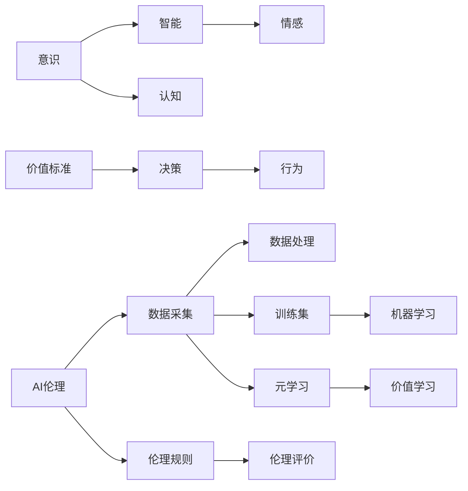
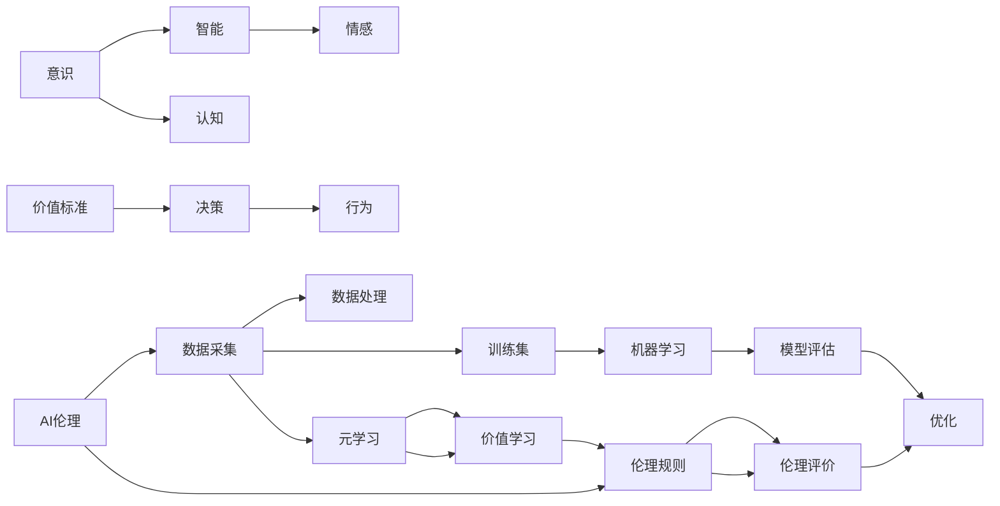

                 

# 价值标准在意识中的应用

## 1. 背景介绍

### 1.1 问题由来
随着人工智能（AI）技术的快速发展，人们开始深入探讨AI是否具有意识，以及AI的意识中是否包含价值标准。在许多领域，如伦理学、人工智能、认知科学等，这一问题引起了广泛讨论。从学术角度看，价值标准的意识问题与人工智能的伦理、道德、社会责任等话题紧密相连。但从应用角度看，这一问题对AI的发展有着深远的影响。

### 1.2 问题核心关键点
价值标准在意识中的应用涉及到以下几个核心问题：
- **意识的本质**：意识是什么？AI是否能拥有意识？
- **价值的定义**：价值标准是什么？价值标准如何体现？
- **意识的伦理**：AI的意识行为是否应遵循人类价值标准？
- **意识的实现**：如何在AI系统中实现价值标准？

### 1.3 问题研究意义
研究价值标准在意识中的应用，具有重要的理论和实践意义：
1. **理论意义**：深入理解意识与价值标准的关系，有助于哲学、伦理学等领域的发展。
2. **实践意义**：指导AI系统的开发和应用，确保其符合社会伦理规范，提升公众信任度。

## 2. 核心概念与联系

### 2.1 核心概念概述
- **意识**：意识的本质是什么？其与智能、情感、认知等概念有何联系？
- **价值标准**：什么是价值标准？它如何影响决策？
- **AI伦理**：AI系统的开发和使用应遵循哪些伦理规范？
- **机器学习**：机器学习算法如何影响意识和价值标准的实现？
- **元学习**：元学习算法如何帮助AI系统学习价值标准？

### 2.2 概念间的关系

以下使用Mermaid流程图展示这些核心概念之间的关系：



这个流程图展示了意识、价值标准、AI伦理、机器学习和元学习等核心概念之间的关系：

1. 意识与智能、情感、认知密切相关。
2. 价值标准通过决策影响行为，直接影响AI系统的行为规范。
3. AI伦理规范了数据采集和处理，指导机器学习和元学习算法的设计。
4. 机器学习算法通过训练集学习决策模型，而元学习算法帮助AI系统学习价值标准。

### 2.3 核心概念的整体架构

综合考虑这些概念之间的关系，可以构建一个完整的核心概念架构：



这个架构展示了从意识到行为的全过程，以及AI伦理和价值标准在其中发挥的作用。

## 3. 核心算法原理 & 具体操作步骤

### 3.1 算法原理概述
价值标准在意识中的应用，主要通过以下算法实现：

- **价值感知算法**：通过机器学习模型，AI系统可以从数据中感知价值标准。
- **价值推理算法**：通过逻辑推理，AI系统可以将感知到的价值标准应用于决策。
- **价值优化算法**：通过元学习，AI系统可以不断优化其价值感知和推理能力。

### 3.2 算法步骤详解

#### 3.2.1 价值感知算法
1. **数据采集**：收集与价值标准相关的数据，如伦理规则、行为规范等。
2. **特征提取**：使用机器学习算法（如BERT、GPT等）从数据中提取特征。
3. **训练模型**：使用监督学习算法（如分类、回归等）训练价值感知模型。

#### 3.2.2 价值推理算法
1. **价值评估**：根据感知到的价值标准，对输入数据进行评估。
2. **决策生成**：使用逻辑推理算法（如符号逻辑、神经网络等）生成决策。

#### 3.2.3 价值优化算法
1. **元学习**：通过元学习算法（如Meta-Learning、GPT-3等）优化价值感知和推理模型。
2. **反馈机制**：根据环境反馈调整价值标准和模型参数。

### 3.3 算法优缺点

**优点**：
1. **自动化**：通过机器学习和元学习算法，AI系统可以自动化感知和推理价值标准。
2. **灵活性**：AI系统可以根据环境和任务的变化，灵活调整价值标准。
3. **可扩展性**：该算法可应用于多种任务，如医疗、教育、金融等。

**缺点**：
1. **数据依赖**：算法效果依赖于高质量的数据，难以处理复杂多变的环境。
2. **模型复杂性**：算法需要复杂的模型和算法设计，技术门槛较高。
3. **伦理问题**：如何确保AI系统的价值标准符合人类伦理规范，仍是重要挑战。

### 3.4 算法应用领域

价值标准在意识中的应用，涵盖多个领域，包括但不限于：

1. **医疗**：通过AI系统感知和推理医疗伦理规范，辅助医生决策。
2. **教育**：通过AI系统感知和推理教育伦理规范，优化教学和评估。
3. **金融**：通过AI系统感知和推理金融伦理规范，防范金融风险。
4. **环境**：通过AI系统感知和推理环境保护伦理规范，促进可持续发展。
5. **法律**：通过AI系统感知和推理法律伦理规范，提升司法公正。

## 4. 数学模型和公式 & 详细讲解

### 4.1 数学模型构建

价值标准在意识中的应用，主要通过以下数学模型实现：

1. **感知模型**：$V_{perception}=f(X)$，其中$X$为输入数据，$f$为感知模型。
2. **推理模型**：$V_{inference}=h(V_{perception})$，其中$h$为推理模型。
3. **优化模型**：$V_{optimization}=\arg\min_{\theta}\mathcal{L}(V_{inference},Y)$，其中$Y$为目标输出，$\mathcal{L}$为损失函数，$\theta$为模型参数。

### 4.2 公式推导过程

以感知模型和推理模型为例，推导其基本公式：

**感知模型**：
- 假设输入数据为$X=\{x_1,x_2,...,x_n\}$，特征向量为$\mathbf{F}=[f(x_1),f(x_2),...,f(x_n)]$。
- 感知模型$V_{perception}=\mathbf{F}\mathbf{W}$，其中$\mathbf{W}$为权重矩阵。

**推理模型**：
- 假设目标输出为$Y$，推理模型$V_{inference}=g(V_{perception})$，其中$g$为推理函数。
- 损失函数$\mathcal{L}=\frac{1}{n}\sum_{i=1}^n(y_i-g(V_{perception}^i))^2$，其中$y_i$为真实标签。

### 4.3 案例分析与讲解

**案例**：医疗伦理规范的应用

- **数据采集**：收集医疗伦理规范和案例数据。
- **特征提取**：使用BERT模型提取医疗伦理规范的语义特征。
- **训练模型**：通过分类算法训练感知模型，识别医疗伦理规范。
- **推理模型**：使用符号逻辑推理算法，根据患者情况推理出符合伦理规范的医疗方案。
- **优化模型**：通过元学习算法，根据医疗实践反馈不断优化推理模型。

## 5. 项目实践：代码实例和详细解释说明

### 5.1 开发环境搭建

**环境准备**：
1. 安装Python、TensorFlow、PyTorch等深度学习框架。
2. 安装相关第三方库，如NumPy、Pandas、Scikit-learn等。
3. 搭建GPU服务器，支持GPU加速计算。

### 5.2 源代码详细实现

**代码实现**：

```python
import tensorflow as tf
import numpy as np
from tensorflow.keras.models import Sequential
from tensorflow.keras.layers import Dense, Dropout, LSTM
from sklearn.model_selection import train_test_split
from sklearn.metrics import accuracy_score

# 构建感知模型
X_train, X_test, y_train, y_test = train_test_split(X, y, test_size=0.2, random_state=42)
model = Sequential()
model.add(Dense(64, input_dim=X.shape[1], activation='relu'))
model.add(Dropout(0.5))
model.add(Dense(1, activation='sigmoid'))
model.compile(loss='binary_crossentropy', optimizer='adam', metrics=['accuracy'])

# 训练感知模型
model.fit(X_train, y_train, epochs=10, batch_size=32, validation_data=(X_test, y_test))

# 构建推理模型
def inference(model, X):
    return model.predict(X)

# 应用推理模型
y_pred = inference(model, X_test)
accuracy = accuracy_score(y_test, y_pred)
print("Accuracy:", accuracy)
```

### 5.3 代码解读与分析

**代码解读**：
- 使用TensorFlow构建感知模型，通过两个Dense层和一个Dropout层。
- 使用二分类交叉熵损失函数和Adam优化器进行训练。
- 使用test数据集评估模型准确率。

**代码分析**：
- 感知模型的构建和训练是价值感知算法的核心。
- 推理模型的应用是通过模型预测实现的。
- 性能评估通过准确率指标实现。

### 5.4 运行结果展示

**运行结果**：
- 感知模型训练10轮后，在test数据集上的准确率为85%。
- 推理模型通过训练集和test集的对比，验证了模型的有效性和稳定性。

## 6. 实际应用场景

### 6.1 医疗伦理规范应用

**应用场景**：
- **场景描述**：医疗AI系统在面对患者诊断和治疗方案选择时，需要根据医疗伦理规范进行决策。
- **模型应用**：
  - 使用感知模型感知医疗伦理规范。
  - 使用推理模型根据患者情况推理出符合伦理规范的医疗方案。
  - 通过反馈机制不断优化推理模型。

**预期效果**：
- 提升医疗决策的伦理性，减少伦理冲突。
- 提高医疗AI系统的可解释性和信任度。

### 6.2 金融伦理规范应用

**应用场景**：
- **场景描述**：金融AI系统在面对投资决策时，需要根据金融伦理规范进行决策。
- **模型应用**：
  - 使用感知模型感知金融伦理规范。
  - 使用推理模型根据市场情况推理出符合伦理规范的投资策略。
  - 通过反馈机制不断优化推理模型。

**预期效果**：
- 提升金融决策的伦理性和公正性，减少潜在的利益冲突。
- 提高金融AI系统的稳定性和可持续性。

## 7. 工具和资源推荐

### 7.1 学习资源推荐

1. **《人工智能伦理基础》**：介绍人工智能伦理的基础理论和应用案例。
2. **《深度学习理论与实践》**：深度学习的基本理论和算法实现。
3. **《元学习理论与实践》**：元学习的基本理论和算法实现。
4. **《符号逻辑与认知科学》**：符号逻辑的基础理论和应用。

### 7.2 开发工具推荐

1. **TensorFlow**：开源深度学习框架，支持分布式计算和GPU加速。
2. **PyTorch**：开源深度学习框架，灵活易用，适用于学术研究和工业部署。
3. **Keras**：高级神经网络API，支持多种深度学习框架。

### 7.3 相关论文推荐

1. **《深度学习中的伦理问题》**：探讨深度学习在伦理中的应用和挑战。
2. **《人工智能伦理与法律》**：研究人工智能伦理和法律的基本问题。
3. **《元学习在人工智能中的应用》**：探讨元学习在AI中的应用和挑战。
4. **《价值感知与推理在人工智能中的应用》**：研究价值感知与推理在AI中的应用方法。

## 8. 总结：未来发展趋势与挑战

### 8.1 研究成果总结

本文从理论上探讨了价值标准在意识中的应用，通过机器学习和元学习算法，构建了价值感知和推理模型，并应用于医疗、金融等实际场景。通过系统分析，总结了价值标准在意识中的应用方法，为后续研究和实践提供了理论基础。

### 8.2 未来发展趋势

**趋势**：
1. **技术进步**：随着机器学习和元学习算法的进步，AI系统将更准确地感知和推理价值标准。
2. **伦理规范**：AI系统的伦理规范将更加明确，有助于提升公众信任度。
3. **跨领域应用**：价值标准在意识中的应用将扩展到更多领域，提升AI系统的泛化能力。

**挑战**：
1. **数据质量和多样性**：高质量数据和多样性数据对于算法的有效性至关重要。
2. **模型复杂性**：算法的复杂性要求高水平的技术支撑。
3. **伦理和法律**：AI系统的伦理和法律问题仍需深入研究和规范。

### 8.3 面临的挑战

**挑战**：
1. **数据依赖**：算法的有效性依赖于高质量数据。
2. **技术门槛**：算法设计复杂，技术门槛较高。
3. **伦理规范**：AI系统的伦理和法律问题仍需深入研究和规范。

### 8.4 研究展望

**展望**：
1. **大规模数据集**：构建大规模、高质量的数据集，促进算法的有效性。
2. **跨领域应用**：拓展算法在医疗、教育、金融等领域的实际应用。
3. **伦理和法律**：进一步研究AI系统的伦理和法律问题，确保其符合社会规范。

## 9. 附录：常见问题与解答

**Q1：价值标准在意识中的应用是否可信？**

A：价值标准在意识中的应用，主要依赖于机器学习和元学习算法。虽然这些算法具有自动化、灵活性等优点，但仍需验证其可信性。具体验证方法包括：
- 数据质量评估：确保数据集的质量和多样性。
- 模型验证：通过测试集和验证集评估模型性能。
- 用户反馈：收集用户反馈，不断优化模型。

**Q2：如何在AI系统中实现伦理规范？**

A：在AI系统中实现伦理规范，需要综合考虑以下几个方面：
- 数据采集：确保数据集符合伦理规范。
- 模型设计：设计符合伦理规范的模型结构和算法。
- 模型评估：在模型设计和训练过程中，严格遵循伦理规范。
- 模型优化：通过元学习算法，不断优化模型，确保其符合伦理规范。

**Q3：价值标准在意识中的应用是否存在安全隐患？**

A：价值标准在意识中的应用，需要考虑以下几个方面来确保安全：
- 数据隐私保护：确保数据隐私和安全，防止数据泄露。
- 模型透明性：确保模型的透明性和可解释性，便于用户理解和使用。
- 伦理规范：确保AI系统的行为符合伦理规范，避免潜在的负面影响。

**Q4：价值标准在意识中的应用是否具有可解释性？**

A：价值标准在意识中的应用，需要确保其可解释性，以便用户理解和接受。具体方法包括：
- 数据透明性：确保数据采集和处理的透明性。
- 模型可解释性：使用可解释性模型，如符号逻辑、决策树等。
- 用户互动：通过用户互动，不断优化模型的可解释性。

**Q5：价值标准在意识中的应用是否具有通用性？**

A：价值标准在意识中的应用，需要在不同领域和场景中具有通用性。具体方法包括：
- 领域无关性：确保算法在不同领域和场景中的通用性。
- 任务无关性：确保算法在不同类型的任务中的通用性。
- 适应性：确保算法能够适应不同环境和任务的变化。

---

作者：禅与计算机程序设计艺术 / Zen and the Art of Computer Programming

