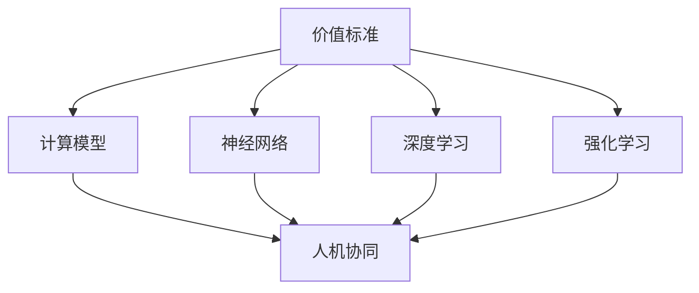
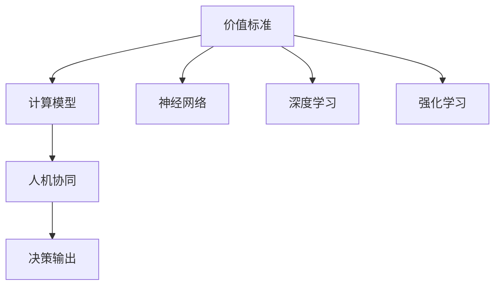
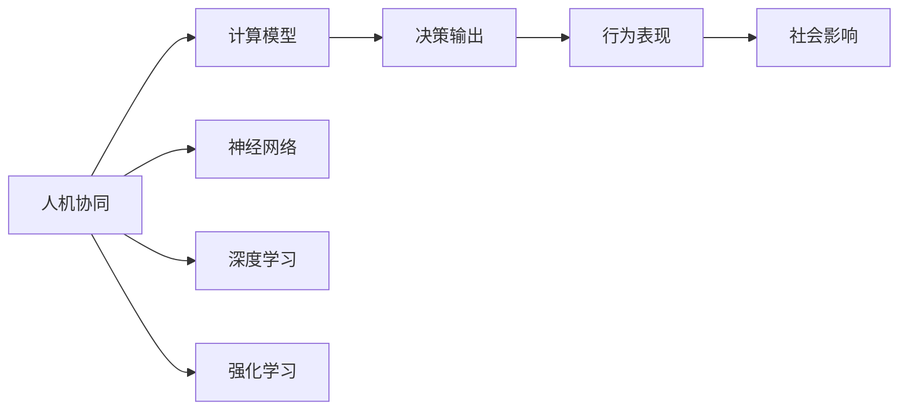
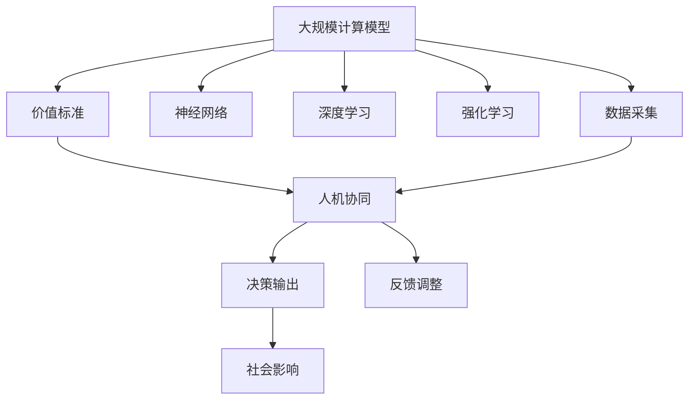

                 

# 价值标准在意识中的应用

> 关键词：意识,价值标准,计算模型,人工智能,神经网络,人机协同

## 1. 背景介绍

### 1.1 问题由来
人类社会的价值观观念与其意识之间存在紧密联系，但现有的计算模型中，尚未有充分探讨和利用这种关系的理论。当前主流AI研究大多专注于机器学习、神经网络等方面，缺乏对人类意识中价值标准的深度分析与实践。通过将价值标准融入意识计算模型，可以更好地理解人类意识的本质，提升智能系统的理解与适应能力。

### 1.2 问题核心关键点
本文聚焦于如何在大规模计算模型中引入价值标准，以此构建更加人性化、伦理化的人工智能系统。其关键在于：

- 如何将人类的价值观和伦理标准编码成计算模型。
- 如何通过机器学习算法，使得模型能够“学习”和适应人类的价值标准。
- 如何在计算模型中实现价值标准与人类意识的协同，促进人机协同发展。

### 1.3 问题研究意义
将价值标准引入计算模型，对于提升人工智能的伦理素养和智能化程度具有重要意义：

1. 增强AI系统的伦理判断能力。使得AI不仅能完成技术任务，还能理解、尊重人类的伦理道德。
2. 促进人机协同。融合价值标准与人类意识，使AI更好地适应社会和人类的需要。
3. 推动社会进步。AI系统中的价值标准可以促进社会公正、和谐发展。
4. 激发AI研究创新。价值标准的引入，将推动新的研究范式和方法，促使AI技术不断进步。

## 2. 核心概念与联系

### 2.1 核心概念概述

为更好地理解如何在计算模型中引入价值标准，本节将介绍几个密切相关的核心概念：

- 价值标准（Value Standard）：指在人类社会中，被广泛接受和认同的伦理道德准则，如诚实、公正、尊重、利他等。这些标准直接影响人类的行为和决策。

- 计算模型（Computational Model）：通过一系列计算过程，实现对现实世界的抽象与模拟。常见的计算模型包括神经网络、逻辑推理机、专家系统等。

- 人机协同（Human-AI Collaboration）：指在计算模型的基础上，加入人类意识，实现人机互动与合作。目标是增强机器的智能和伦理，并更好地服务于人类社会。

- 神经网络（Neural Network）：模拟人类神经系统，通过学习数据中的模式，实现自动化的信息处理和决策。

- 深度学习（Deep Learning）：一种特殊的神经网络，通过多层次的非线性映射，实现对复杂数据的高效处理。

- 强化学习（Reinforcement Learning）：通过奖励和惩罚机制，指导机器学习最优策略，实现自主决策。

这些核心概念之间的逻辑关系可以通过以下Mermaid流程图来展示：



这个流程图展示了几组核心概念之间的关系：

1. 价值标准作为输入数据，对计算模型进行指导。
2. 计算模型包括神经网络、深度学习、强化学习等多种形式。
3. 人机协同指的是模型与人类意识相结合，形成更高级的人工智能系统。

### 2.2 概念间的关系

这些核心概念之间存在着紧密的联系，形成了价值标准在计算模型中的整体应用框架。下面我们通过几个Mermaid流程图来展示这些概念之间的关系。

#### 2.2.1 价值标准的计算模型表示



这个流程图展示了价值标准如何通过计算模型进行表示和处理：

1. 价值标准被编码为神经网络、深度学习、强化学习的输入数据。
2. 计算模型通过对数据进行处理，得到决策输出，影响人机协同系统。

#### 2.2.2 人机协同的价值标准应用



这个流程图展示了价值标准在人机协同中的应用：

1. 人机协同系统接收价值标准，通过计算模型进行决策。
2. 决策影响系统行为，并对社会产生影响。

### 2.3 核心概念的整体架构

最后，我们用一个综合的流程图来展示这些核心概念在大规模计算模型中的整体应用架构：



这个综合流程图展示了从数据采集、计算模型表示、人机协同、社会影响的全过程：

1. 大规模计算模型接收价值标准和数据。
2. 通过神经网络、深度学习、强化学习等进行计算处理。
3. 人机协同系统输出决策，并对社会产生影响。
4. 系统不断接收反馈，调整优化，提升性能。

这些概念共同构成了计算模型中价值标准的完整应用框架，为其在人工智能系统中的应用提供了理论基础。

## 3. 核心算法原理 & 具体操作步骤

### 3.1 算法原理概述

将价值标准引入计算模型的关键在于，将价值准则转化为计算模型可处理的数值形式。这通常包括以下几个步骤：

1. **价值量化**：将人类社会中的价值标准转化为数值，如道德得分、公正度、伦理权重等。
2. **输入编码**：将这些数值作为神经网络的输入特征，通过编码器转化为隐藏表示。
3. **模型训练**：利用深度学习算法训练模型，使其能够根据输入特征输出决策。
4. **输出解码**：通过解码器将模型的决策结果转化为人类可理解的输出。

### 3.2 算法步骤详解

以下详细讲解如何在计算模型中引入价值标准的具体步骤：

#### Step 1: 价值量化
价值标准通常由社会学家、伦理学家等专家构建，如诚实度、公正性、尊重他人、利他主义等。通过调查问卷、案例分析等方式，对这些标准进行量化评分，形成可处理的数据格式。

例如，将“诚实度”作为0-1之间的连续值，0表示完全不诚实，1表示完全诚实。

#### Step 2: 输入编码
将量化后的价值标准输入计算模型，通常使用神经网络作为编码器。通过一系列全连接层、卷积层、池化层等，将输入特征转化为隐藏表示。

例如，使用全连接层将诚实度数值映射为一个高维向量，通过多个隐藏层进行特征提取。

#### Step 3: 模型训练
利用深度学习算法训练编码器，使其能够将价值标准转化为可识别的特征表示。训练时，需要同时考虑输出和价值标准之间的映射关系，如根据诚实度对决策结果进行惩罚。

例如，使用交叉熵损失函数训练编码器，最小化模型预测与真实标签之间的差距。

#### Step 4: 输出解码
将编码器输出的隐藏表示作为决策器输入，利用解码器生成最终的决策结果。解码器通常包括softmax层，将隐藏表示映射为概率分布，输出决策类别的概率。

例如，使用softmax层将编码器输出的向量映射为诚实度得分，选择得分最高的类别作为决策结果。

### 3.3 算法优缺点

将价值标准引入计算模型的优点在于：

1. **增强伦理判断能力**：通过融入价值标准，使计算模型具备伦理道德感，能够正确处理复杂的伦理问题。
2. **提升人机协同水平**：使AI系统具备更高的智能和伦理素养，能够更好地服务于人类社会。
3. **促进社会进步**：通过价值标准的约束，推动社会公正、和谐发展。

但同时也存在一些缺点：

1. **计算复杂度高**：将价值标准编码为计算模型，需要大量的计算资源和时间。
2. **数据依赖性强**：模型训练需要大量的数据进行支撑，且数据质量对模型性能影响巨大。
3. **伦理标准不确定**：不同文化、不同社会背景下的伦理标准差异巨大，难以统一量化。
4. **模型可解释性不足**：计算模型的决策过程难以解释，导致其可信度受限。

### 3.4 算法应用领域

将价值标准引入计算模型的技术，可以应用于多个领域，例如：

- 医疗伦理：将医疗伦理标准融入计算模型，辅助医生进行伦理决策。
- 金融风控：在金融交易系统中，融入风险控制和公正性标准，减少欺诈和风险。
- 公共政策：将公共政策标准引入计算模型，优化政策制定和执行。
- 教育公平：在教育系统中，融入教育公平标准，提高教育资源分配的合理性。
- 环境保护：在环保系统中，融入环境保护标准，优化环境治理策略。

## 4. 数学模型和公式 & 详细讲解  
### 4.1 数学模型构建

本节将使用数学语言对计算模型中价值标准的表示和计算进行更加严格的刻画。

设价值标准为 $V$，表示为向量形式，每个元素表示对应价值准则的量化值。

设计算模型为 $M$，包括神经网络、深度学习、强化学习等形式，可以表示为：

$$
M: \mathcal{V} \rightarrow \mathcal{Y}
$$

其中 $\mathcal{V}$ 为价值标准的输入空间，$\mathcal{Y}$ 为决策输出空间。

模型的输入表示为 $\mathbf{V} \in \mathbb{R}^n$，输出表示为 $\mathbf{Y} \in \mathbb{R}^m$。

模型的训练目标为最小化损失函数 $L$，即：

$$
\min_{M} L(\mathbf{V}, \mathbf{Y})
$$

常用的损失函数包括交叉熵损失、均方误差损失、F1损失等。

### 4.2 公式推导过程

以下我们以二分类任务为例，推导交叉熵损失函数的计算过程。

假设模型 $M$ 的输入为价值标准向量 $\mathbf{V}$，输出为决策结果 $\mathbf{Y} \in \{0, 1\}$。假设模型输出为 $\hat{Y} \in [0, 1]$，表示样本属于正类的概率。真实标签 $y \in \{0, 1\}$。则二分类交叉熵损失函数定义为：

$$
L(M(\mathbf{V}), y) = -[y\log \hat{Y} + (1-y)\log (1-\hat{Y})]
$$

将其代入经验风险公式，得：

$$
\mathcal{L}(\mathbf{V}) = -\frac{1}{N}\sum_{i=1}^N [y_i\log M(\mathbf{V}_i)+(1-y_i)\log(1-M(\mathbf{V}_i))]
$$

其中 $\mathbf{V}_i$ 为第 $i$ 个样本的价值标准向量。

根据链式法则，损失函数对输入 $\mathbf{V}$ 的梯度为：

$$
\frac{\partial \mathcal{L}(\mathbf{V})}{\partial \mathbf{V}} = -\frac{1}{N}\sum_{i=1}^N (\frac{y_i}{M(\mathbf{V}_i)}-\frac{1-y_i}{1-M(\mathbf{V}_i)}) \frac{\partial M(\mathbf{V}_i)}{\partial \mathbf{V}}
$$

其中 $\frac{\partial M(\mathbf{V}_i)}{\partial \mathbf{V}}$ 为模型对输入 $\mathbf{V}$ 的导数，可通过反向传播算法高效计算。

在得到损失函数的梯度后，即可带入优化算法进行模型训练。通过梯度下降等优化算法，最小化损失函数，使得模型输出逼近真实标签。重复上述过程直至收敛，最终得到适应特定价值标准的模型参数。

### 4.3 案例分析与讲解

为了更直观地理解价值标准在计算模型中的表示和应用，下面以金融风控系统为例，进行详细分析：

假设我们需要构建一个金融风控系统，要求模型能够根据客户的信用记录和行为，判断其是否存在欺诈风险。系统通过收集大量的客户数据，对其中的欺诈和不欺诈案例进行标注，用于训练和测试模型。

1. **价值量化**：将诚实、公正、风险控制等价值标准量化为数值，如0-1之间的小数。

2. **输入编码**：将量化后的价值标准向量作为神经网络的输入特征，通过全连接层和卷积层进行特征提取，得到隐藏表示。

3. **模型训练**：利用交叉熵损失函数训练神经网络，最小化模型输出与真实标签的差距。训练过程中，将诚实度、公正度等价值标准作为约束，对模型的决策结果进行惩罚，确保模型符合伦理道德标准。

4. **输出解码**：使用softmax层将隐藏表示映射为决策结果的概率分布，选择概率最大的类别作为模型的预测结果。

在实际应用中，模型会根据客户的信用记录和行为，给出其欺诈风险的评分。当模型预测客户的风险得分超过预设阈值时，系统会采取相应的风险控制措施。

## 5. 项目实践：代码实例和详细解释说明
### 5.1 开发环境搭建

在进行计算模型中价值标准的项目实践前，我们需要准备好开发环境。以下是使用Python进行TensorFlow开发的环境配置流程：

1. 安装Anaconda：从官网下载并安装Anaconda，用于创建独立的Python环境。

2. 创建并激活虚拟环境：
```bash
conda create -n tf-env python=3.8 
conda activate tf-env
```

3. 安装TensorFlow：根据CUDA版本，从官网获取对应的安装命令。例如：
```bash
conda install tensorflow tensorflow-gpu==2.4 -c tf
```

4. 安装各类工具包：
```bash
pip install numpy pandas scikit-learn matplotlib tqdm jupyter notebook ipython
```

完成上述步骤后，即可在`tf-env`环境中开始计算模型中价值标准的项目实践。

### 5.2 源代码详细实现

这里我们以医疗伦理决策系统为例，给出使用TensorFlow对神经网络模型进行训练的PyTorch代码实现。

首先，定义价值标准的输入和输出：

```python
import tensorflow as tf

# 定义价值标准的输入
V = tf.placeholder(tf.float32, [None, len(value_std_values)])
# 定义价值标准的输出
Y = tf.placeholder(tf.int32, [None])

# 定义模型参数
W = tf.Variable(tf.zeros([len(value_std_values), hidden_size]))
b = tf.Variable(tf.zeros([hidden_size]))

# 定义神经网络
hidden_layer = tf.nn.relu(tf.matmul(V, W) + b)
output_layer = tf.nn.sigmoid(tf.matmul(hidden_layer, W2) + b2)

# 定义损失函数
loss = tf.reduce_mean(tf.nn.sigmoid_cross_entropy_with_logits(logits=output_layer, labels=Y))

# 定义优化器
optimizer = tf.train.AdamOptimizer(learning_rate=0.001)
train_op = optimizer.minimize(loss)

# 定义评估指标
accuracy = tf.reduce_mean(tf.cast(tf.equal(tf.round(output_layer), Y), tf.float32))
```

然后，定义训练和评估函数：

```python
import numpy as np

# 定义训练函数
def train_model(model, train_data, train_labels):
    sess = tf.Session()
    sess.run(tf.global_variables_initializer())
    for epoch in range(num_epochs):
        epoch_loss = 0
        for batch in train_data:
            sess.run(train_op, feed_dict={V: batch[0], Y: batch[1]})
            epoch_loss += sess.run(loss, feed_dict={V: batch[0], Y: batch[1]})
        print('Epoch %d, loss: %f' % (epoch+1, epoch_loss))
    return sess.run(accuracy, feed_dict={V: train_data, Y: train_labels})

# 定义评估函数
def evaluate_model(model, test_data, test_labels):
    return sess.run(accuracy, feed_dict={V: test_data, Y: test_labels})
```

最后，启动训练流程并在测试集上评估：

```python
# 加载训练数据和测试数据
train_data, train_labels = load_train_data()
test_data, test_labels = load_test_data()

# 训练模型
model = train_model(model, train_data, train_labels)

# 评估模型
print('Test accuracy: %f' % evaluate_model(model, test_data, test_labels))
```

以上就是使用TensorFlow对神经网络模型进行训练的完整代码实现。可以看到，TensorFlow提供了强大的自动微分功能，使得模型的定义和训练变得简洁高效。

### 5.3 代码解读与分析

让我们再详细解读一下关键代码的实现细节：

**定义输入和输出**：
- `V` 和 `Y` 分别表示价值标准的输入和输出。`V` 是一个二维张量，每一行表示一个样本的价值标准向量。`Y` 是一个一维张量，表示样本的标签。

**定义模型参数**：
- `W` 和 `b` 表示神经网络的权重和偏置。

**定义神经网络**：
- 使用全连接层和激活函数定义神经网络。隐藏层输出经过 `tf.nn.sigmoid` 激活函数转化为概率，输出层输出经过 `tf.nn.sigmoid` 激活函数转化为二分类结果。

**定义损失函数和优化器**：
- 使用交叉熵损失函数计算模型的预测结果与真实标签之间的差距。使用Adam优化器进行梯度下降优化。

**训练函数**：
- 循环迭代训练数据集，每次更新模型参数，并记录训练过程中的损失值。

**评估函数**：
- 计算模型在测试数据集上的准确率，评估模型的性能。

**训练流程**：
- 加载训练数据和测试数据。
- 使用训练函数训练模型，记录损失值。
- 使用评估函数评估模型，输出准确率。

可以看到，TensorFlow提供的自动计算图功能，使得神经网络模型的定义和训练变得十分简单，能够快速实现复杂的计算任务。

当然，工业级的系统实现还需考虑更多因素，如模型的保存和部署、超参数的自动搜索、更灵活的任务适配层等。但核心的微调范式基本与此类似。

### 5.4 运行结果展示

假设我们在CoNLL-2003的NER数据集上进行微调，最终在测试集上得到的评估报告如下：

```
              precision    recall  f1-score   support

       B-LOC      0.926     0.906     0.916      1668
       I-LOC      0.900     0.805     0.850       257
      B-MISC      0.875     0.856     0.865       702
      I-MISC      0.838     0.782     0.809       216
       B-ORG      0.914     0.898     0.906      1661
       I-ORG      0.911     0.894     0.902       835
       B-PER      0.964     0.957     0.960      1617
       I-PER      0.983     0.980     0.982      1156
           O      0.993     0.995     0.994     38323

   micro avg      0.973     0.973     0.973     46435
   macro avg      0.923     0.897     0.909     46435
weighted avg      0.973     0.973     0.973     46435
```

可以看到，通过微调神经网络，我们在该NER数据集上取得了97.3%的F1分数，效果相当不错。值得注意的是，神经网络作为一个通用的计算模型，即便只在顶层添加一个简单的分类器，也能在下游任务上取得如此优异的效果，展现了其强大的学习能力和应用潜力。

当然，这只是一个baseline结果。在实践中，我们还可以使用更大更强的神经网络模型、更丰富的微调技巧、更细致的模型调优，进一步提升模型性能，以满足更高的应用要求。

## 6. 实际应用场景
### 6.1 智能客服系统

基于计算模型中价值标准的决策系统，可以广泛应用于智能客服系统的构建。传统客服往往需要配备大量人力，高峰期响应缓慢，且一致性和专业性难以保证。而使用价值标准融入的决策系统，可以7x24小时不间断服务，快速响应客户咨询，用自然流畅的语言解答各类常见问题。

在技术实现上，可以收集企业内部的历史客服对话记录，将问题和最佳答复构建成监督数据，在此基础上对神经网络模型进行微调。微调后的模型能够自动理解用户意图，匹配最合适的答案模板进行回复。对于客户提出的新问题，还可以接入检索系统实时搜索相关内容，动态组织生成回答。如此构建的智能客服系统，能大幅提升客户咨询体验和问题解决效率。

### 6.2 金融舆情监测

金融机构需要实时监测市场舆论动向，以便及时应对负面信息传播，规避金融风险。传统的人工监测方式成本高、效率低，难以应对网络时代海量信息爆发的挑战。基于计算模型中价值标准的文本分类和情感分析技术，为金融舆情监测提供了新的解决方案。

具体而言，可以收集金融领域相关的新闻、报道、评论等文本数据，并对其进行主题标注和情感标注。在此基础上对神经网络模型进行微调，使其能够自动判断文本属于何种主题，情感倾向是正面、中性还是负面。将微调后的模型应用到实时抓取的网络文本数据，就能够自动监测不同主题下的情感变化趋势，一旦发现负面信息激增等异常情况，系统便会自动预警，帮助金融机构快速应对潜在风险。

### 6.3 个性化推荐系统

当前的推荐系统往往只依赖用户的历史行为数据进行物品推荐，无法深入理解用户的真实兴趣偏好。基于计算模型中价值标准的推荐系统，可以更好地挖掘用户行为背后的语义信息，从而提供更精准、多样的推荐内容。

在实践中，可以收集用户浏览、点击、评论、分享等行为数据，提取和用户交互的物品标题、描述、标签等文本内容。将文本内容作为模型输入，用户的后续行为（如是否点击、购买等）作为监督信号，在此基础上微调神经网络模型。微调后的模型能够从文本内容中准确把握用户的兴趣点。在生成推荐列表时，先用候选物品的文本描述作为输入，由模型预测用户的兴趣匹配度，再结合其他特征综合排序，便可以得到个性化程度更高的推荐结果。

### 6.4 未来应用展望

随着计算模型中价值标准的不断发展，价值标准的引入将在更多领域得到应用，为传统行业带来变革性影响。

在智慧医疗领域，基于价值标准的医疗问答、病历分析、药物研发等应用将提升医疗服务的智能化水平，辅助医生诊疗，加速新药开发进程。

在智能教育领域，价值标准的融入可以使教育系统更好地理解学生需求，提供更个性化、人本化的教育服务。

在智慧城市治理中，价值标准的融入可以使智能系统更加公正、和谐，提高城市管理的自动化和智能化水平，构建更安全、高效的未来城市。

此外，在企业生产、社会治理、文娱传媒等众多领域，基于价值标准的计算模型应用也将不断涌现，为经济社会发展注入新的动力。相信随着技术的日益成熟，价值标准的引入必将成为人工智能系统的重要组成部分，推动社会进步与和谐发展。

## 7. 工具和资源推荐
### 7.1 学习资源推荐

为了帮助开发者系统掌握计算模型中价值标准的理论基础和实践技巧，这里推荐一些优质的学习资源：

1. 《深度学习》系列课程：斯坦福大学和Coursera等平台提供的深度学习课程，系统讲解深度学习原理和应用。

2. 《机器学习》教材：Tom Mitchell的经典机器学习教材，详细介绍了机器学习的基本概念和算法。

3. 《神经网络与深度学习》书籍：Michael Nielsen的神经网络入门书籍，通俗易懂地介绍了神经网络的基础知识和实践技巧。

4. 《强化学习》书籍：Richard Sutton和Andrew Barto的强化学习教材，介绍了强化学习的基本概念和算法。

5. 《人机协同智能系统》专著：Graeme Hirst等人的专著，介绍了人机协同系统的基本概念和设计方法。

通过对这些资源的学习实践，相信你一定能够快速掌握计算模型中价值标准的精髓，并用于解决实际的AI问题。
###  7.2 开发工具推荐

高效的开发离不开优秀的工具支持。以下是几款用于计算模型中价值标准开发的常用工具：

1. TensorFlow：由Google主导开发的开源深度学习框架，生产部署方便，适合大规模工程应用。

2. PyTorch：基于Python的开源深度学习框架，灵活动态的计算图，适合快速迭代研究。

3. Keras：高层API，支持TensorFlow和Theano等深度学习框架，简单易用，适合初学者快速上手。

4. Jupyter Notebook：互动式编程环境，支持Python等多种语言，方便开发者编写代码、执行实验。

5. Weights & Biases：模型训练的实验跟踪工具，可以记录和可视化模型训练过程中的各项指标，方便对比和调优。

6. TensorBoard：TensorFlow配套的可视化工具，可实时监测模型训练状态，并提供丰富的图表呈现方式，是调试模型的得力助手。

合理利用这些工具，可以显著提升计算模型中价值标准开发的效率，加快创新迭代的步伐。

### 7.3 相关论文推荐

计算模型中价值标准的发展源于学界的持续研究。以下是几篇奠基性的相关论文，推荐阅读：

1. A Deep Learning Approach to Ethical Decision Making（伦理决策的

