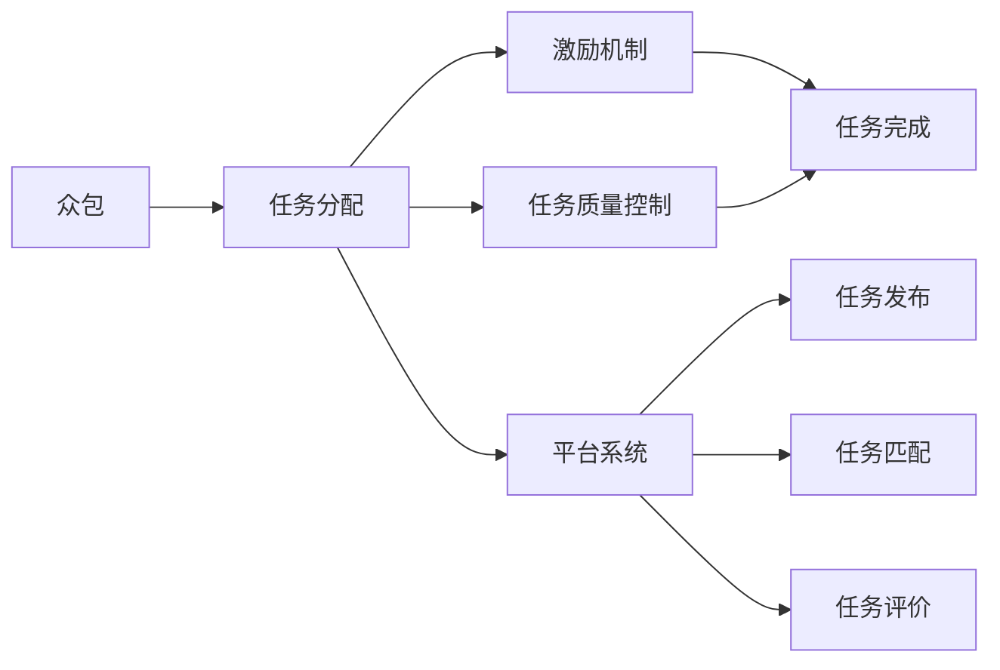
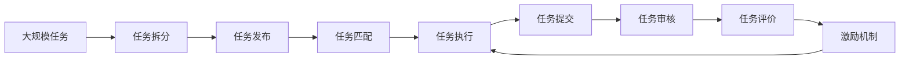

                 

# 众包：利用集体智慧的力量

## 1. 背景介绍

### 1.1 问题由来

随着互联网的普及和技术的进步，众包模式已经成为各行各业应用广泛的新兴合作方式。从软件开发到设计创意，从数据分析到市场调研，众包平台让大量分散的个体能够通过互联网协同工作，共同完成复杂、耗时的任务。众包不仅大大提高了效率，降低了成本，还激发了集体的创造力，带来了许多颠覆性的创新。

然而，众包模式也面临诸多挑战。如何选择合适的任务，如何设计有效的激励机制，如何保障数据和隐私安全，如何优化协作流程，这些问题都直接关系到众包项目的成败。

### 1.2 问题核心关键点

本文聚焦于众包技术的核心原理与实践方法，并重点探讨如何通过合理的算法设计和平台设计，有效激发集体的智慧力量。

### 1.3 问题研究意义

了解众包背后的核心技术，有助于行业从业者更好地理解和利用众包模式，从而提高效率，降低成本，激发创新。对于学术界而言，众包研究是理解群体协作、协同工作机制的重要窗口，能够推动心理学、社会学、计算机科学等多学科的交叉发展。

## 2. 核心概念与联系

### 2.1 核心概念概述

为了深入理解众包模式，我们需要掌握一些核心概念：

- **众包**：即通过互联网平台，将大量个体工作任务外包给分布在不同地方的自由职业者，共同完成某一目标的过程。

- **任务分配**：指将任务拆解成多个子任务，并通过众包平台发布，匹配合适的自由职业者。

- **激励机制**：通过设定合理的奖励和惩罚措施，激励自由职业者高质量地完成工作。

- **平台系统**：指支持任务发布、匹配、评价等功能的互联网平台，是众包活动的核心载体。

- **任务质量控制**：指通过设计合理的任务评估和审核机制，确保任务完成质量。

- **数据隐私安全**：指保护任务数据、自由职业者信息等敏感数据的安全。

这些概念之间紧密联系，共同构成了众包模式的完整生态系统。

### 2.2 概念间的关系

这些核心概念之间的联系可以通过以下Mermaid流程图来展示：



这个流程图展示了众包模式的基本流程：

1. **任务发布**：通过众包平台发布任务。
2. **任务匹配**：系统自动匹配自由职业者，或由平台管理员手动分配。
3. **任务执行**：自由职业者根据任务要求完成工作。
4. **任务评价**：平台对任务完成质量进行评价，并对自由职业者进行奖励或惩罚。
5. **激励机制**：平台通过奖励和惩罚机制，激励自由职业者高质量地完成工作。

### 2.3 核心概念的整体架构

最后，我们用一个综合的流程图来展示这些核心概念在大众包平台中的整体架构：



这个综合流程图展示了从大规模任务拆分到激励机制设计的全过程，帮助理解众包平台的核心功能和流程。

## 3. 核心算法原理 & 具体操作步骤
### 3.1 算法原理概述

众包平台的核心算法涉及任务分配、匹配、评价和激励机制等多个方面。其基本原理是利用市场机制，通过价格的调整来优化资源配置，确保任务高效完成。

具体而言，众包平台通过以下几个关键算法来实现其功能：

- **任务拆分算法**：将大任务拆分成多个小任务，并分配给不同自由职业者。
- **匹配算法**：根据自由职业者的技能和历史表现，匹配合适的任务。
- **评价算法**：对任务完成质量进行评估，并根据评估结果进行激励。
- **激励算法**：通过奖励和惩罚机制，激励自由职业者高质量完成工作。

这些算法共同构成了众包平台的核心技术，是确保任务高效、公平完成的关键。

### 3.2 算法步骤详解

下面，我们将详细讲解这些核心算法的具体实现步骤。

#### 3.2.1 任务拆分算法

任务拆分算法通过将大任务拆分成多个小任务，确保每个任务规模适中，且在短时间内能够高效完成。具体步骤如下：

1. **任务规模评估**：根据任务的复杂度和时间要求，评估每个子任务的规模。
2. **任务拆分**：将任务拆分成若干子任务，每个子任务应具有独立性，且能够独立完成。
3. **任务发布**：将拆分后的子任务发布到众包平台上，供自由职业者选择。

#### 3.2.2 匹配算法

匹配算法通过评估自由职业者的技能和历史表现，确保匹配的任务与自由职业者的能力相符。具体步骤如下：

1. **自由职业者评估**：对自由职业者的技能、历史完成任务的质量、工作时长等进行评估。
2. **任务要求匹配**：根据任务要求，匹配合适的自由职业者，确保其具备完成任务的能力。
3. **任务分配**：将任务分配给匹配的自由职业者，并通知其开始执行任务。

#### 3.2.3 评价算法

评价算法通过评估任务完成质量，确保任务按预期完成。具体步骤如下：

1. **任务审核**：平台管理员或任务审核员对任务完成结果进行审核，确保符合任务要求。
2. **质量评估**：根据任务审核结果，对任务完成质量进行评分，评分应基于明确的评估标准。
3. **奖励分配**：根据任务完成质量评分，进行奖励分配，确保高质完成的任务得到合理奖励。

#### 3.2.4 激励算法

激励算法通过设定奖励和惩罚机制，激励自由职业者高质量完成任务。具体步骤如下：

1. **奖励机制设计**：设计合理的奖励机制，如任务完成后给予一定金额的奖励。
2. **惩罚机制设计**：设计合理的惩罚机制，如任务未按时完成或质量不符合要求，扣除一定金额的保证金。
3. **激励实施**：根据任务完成情况，实施奖励或惩罚，确保激励机制的公平性和有效性。

### 3.3 算法优缺点

众包平台的核心算法具有以下优点：

- **高效性**：通过市场机制，高效匹配任务和自由职业者，提高任务完成效率。
- **公平性**：通过任务评价和激励机制，确保自由职业者的贡献得到合理认可，提升工作积极性。
- **灵活性**：平台可以根据任务特点，灵活调整任务拆分、匹配和评价策略，适应不同任务的需求。

同时，这些算法也存在一些局限性：

- **匹配偏差**：任务匹配算法可能存在偏差，导致匹配不合适的自由职业者。
- **任务质量控制困难**：任务评价和审核可能存在主观性，影响任务质量评估的准确性。
- **激励机制复杂**：设定合理的奖励和惩罚机制需要考虑多种因素，设计复杂。

### 3.4 算法应用领域

众包平台的核心算法在多个领域都有广泛应用，包括但不限于：

- **软件开发**：将软件开发任务拆分成多个子任务，通过众包平台外包给自由职业者。
- **设计创意**：将设计任务拆分后，通过众包平台征集创意设计方案。
- **数据分析**：将数据处理任务拆分成多个子任务，通过众包平台外包给数据标注员。
- **市场调研**：将市场调研任务拆分成多个问卷调查，通过众包平台征集用户反馈。
- **内容创作**：将内容创作任务拆分成多个子任务，通过众包平台征集创作素材。

这些领域中，众包平台的算法设计和系统优化能够显著提高任务完成效率，降低成本，激发集体的智慧力量。

## 4. 数学模型和公式 & 详细讲解  
### 4.1 数学模型构建

本节将使用数学语言对众包模式的核心算法进行更加严格的刻画。

记任务总数为 $T$，自由职业者总数为 $W$。设任务 $t$ 的完成质量为 $Q_t$，自由职业者 $w$ 的技能水平为 $S_w$，历史表现评分（完成任务数量和质量）为 $H_w$。

定义任务评价函数 $f(Q_t)$，用于评估任务完成质量，通常为任务完成的准确度、时间、成本等指标。

定义激励函数 $g(S_w, H_w, Q_t)$，用于计算自由职业者的激励，通常为奖励金额或积分。

则任务拆分算法、匹配算法、评价算法和激励算法的数学模型可分别描述如下：

- **任务拆分算法**：

$$
\text{Task_Apportioning}(T, S_w, H_w) = \{(a_{t,w})\}_{t=1}^T \in \mathbb{N}^T
$$

其中 $a_{t,w}$ 表示任务 $t$ 分配给自由职业者 $w$ 的子任务数量。

- **匹配算法**：

$$
\text{Task_Matching}(T, S_w, H_w) = (w_t)_{t=1}^T \in W^T
$$

其中 $w_t$ 表示任务 $t$ 分配给自由职业者 $w_t$。

- **评价算法**：

$$
\text{Task_Evaluation}(Q_t, w_t) = f(Q_t, w_t)
$$

其中 $f(Q_t, w_t)$ 表示任务 $t$ 由自由职业者 $w_t$ 完成的评分。

- **激励算法**：

$$
\text{Incentive_Calculating}(Q_t, w_t) = g(Q_t, w_t)
$$

其中 $g(Q_t, w_t)$ 表示对任务 $t$ 由自由职业者 $w_t$ 完成的任务评价 $f(Q_t, w_t)$ 进行激励。

### 4.2 公式推导过程

以下我们以任务拆分和匹配算法为例，推导其数学模型和公式。

#### 4.2.1 任务拆分算法

任务拆分算法的基本思想是将大任务 $T$ 根据自由职业者的技能水平 $S_w$ 和历史表现评分 $H_w$，拆分成若干子任务，并分配给合适的自由职业者。

设任务 $t$ 拆分后的子任务数量为 $n_t$，总子任务数量为 $N$。则任务拆分算法可以表示为：

$$
\sum_{t=1}^T n_t = N
$$

其中 $n_t$ 表示任务 $t$ 分配的子任务数量。

根据任务拆分算法，我们引入如下约束条件：

$$
n_t \geq 1 \quad \forall t \in T
$$

表示每个任务至少分配一个子任务。

根据任务拆分算法，我们引入如下优化目标：

$$
\min_{\{n_t\}_{t=1}^T} \sum_{t=1}^T c_t n_t
$$

其中 $c_t$ 表示任务 $t$ 的复杂度。

综合约束条件和优化目标，我们可以得到任务拆分算法的数学模型：

$$
\min_{\{n_t\}_{t=1}^T} \sum_{t=1}^T c_t n_t \quad \text{subject to:} \quad
\sum_{t=1}^T n_t = N, \quad n_t \geq 1 \quad \forall t \in T
$$

#### 4.2.2 匹配算法

匹配算法的目标是匹配合适的自由职业者 $w_t$ 来完成每个任务 $t$。

设任务 $t$ 和自由职业者 $w$ 的匹配度为 $m_{t,w}$，通常根据任务要求和自由职业者历史表现评分计算得出。

根据匹配算法，我们引入如下约束条件：

$$
m_{t,w} \geq 0 \quad \forall t \in T, \forall w \in W
$$

表示匹配度必须非负。

根据匹配算法，我们引入如下优化目标：

$$
\min_{\{w_t\}_{t=1}^T} \sum_{t=1}^T p_t w_t
$$

其中 $p_t$ 表示任务 $t$ 的优先级，通常由任务难度、时间紧迫程度等因素决定。

综合约束条件和优化目标，我们可以得到匹配算法的数学模型：

$$
\min_{\{w_t\}_{t=1}^T} \sum_{t=1}^T p_t w_t \quad \text{subject to:} \quad
m_{t,w} \geq 0 \quad \forall t \in T, \forall w \in W
$$

### 4.3 案例分析与讲解

为了更好地理解这些数学模型和公式，我们以一个简单的众包平台为例进行说明。

假设有一项数据分析任务，需要将 10 万条数据进行标注，任务拆分算法将其拆分成 1000 个子任务，每个子任务需要标注 100 条数据。

根据任务拆分算法，我们有：

$$
\sum_{t=1}^{1000} n_t = 1000
$$

其中 $n_t$ 表示任务 $t$ 分配的子任务数量，即每个子任务需要分配给合适的自由职业者。

设任务 $t$ 和自由职业者 $w$ 的匹配度为 $m_{t,w}$，根据匹配算法，我们需要匹配合适的自由职业者来完成每个子任务。

根据匹配算法，我们有：

$$
m_{t,w} \geq 0 \quad \forall t \in \{1, 2, ..., 1000\}, \forall w \in W
$$

其中 $W$ 表示平台上的自由职业者数量。

## 5. 项目实践：代码实例和详细解释说明
### 5.1 开发环境搭建

在进行众包平台开发前，我们需要准备好开发环境。以下是使用Python进行Flask开发的环境配置流程：

1. 安装Anaconda：从官网下载并安装Anaconda，用于创建独立的Python环境。

2. 创建并激活虚拟环境：
```bash
conda create -n flask-env python=3.8 
conda activate flask-env
```

3. 安装Flask：从官网获取Flask的安装包，进行安装。

4. 安装Flask-RESTful：用于处理RESTful API请求。

5. 安装Flask-Cors：用于处理跨域请求。

6. 安装SQLAlchemy：用于处理数据库操作。

7. 安装Jinja2：用于模板渲染。

8. 安装WTForms：用于处理表单数据。

完成上述步骤后，即可在`flask-env`环境中开始众包平台开发。

### 5.2 源代码详细实现

下面，我们将展示如何使用Flask开发一个简单的众包平台。

首先，定义任务数据模型：

```python
from flask_sqlalchemy import SQLAlchemy

db = SQLAlchemy()

class Task(db.Model):
    id = db.Column(db.Integer, primary_key=True)
    name = db.Column(db.String(255), nullable=False)
    description = db.Column(db.Text, nullable=False)
    is_completed = db.Column(db.Boolean, default=False)
```

然后，定义自由职业者数据模型：

```python
class Freelancer(db.Model):
    id = db.Column(db.Integer, primary_key=True)
    name = db.Column(db.String(255), nullable=False)
    skill_level = db.Column(db.String(255), nullable=False)
    performance_score = db.Column(db.Float, nullable=False)
```

接着，定义众包任务拆分算法：

```python
def task_apportioning(task_id, skill_levels, performance_scores, num_subtasks):
    # 根据技能水平和历史表现评分，评估每个自由职业者
    freelancers = Freelancer.query.all()
    skill_scores = {}
    performance_scores = {}
    for freelancer in freelancers:
        skill_scores[freelancer.id] = freelancer.skill_level
        performance_scores[freelancer.id] = freelancer.performance_score
    
    # 将任务拆分成多个子任务
    task = Task.query.get(task_id)
    task_description = task.description
    subtasks = []
    for i in range(num_subtasks):
        subtask = {
            'id': i+1,
            'description': f"{task_description} Subtask {i+1}"
        }
        subtasks.append(subtask)
    
    # 匹配合适的自由职业者
    for freelancer in freelancers:
        for subtask in subtasks:
            # 根据技能水平和历史表现评分，计算匹配度
            match_score = skill_scores[freelancer.id] * performance_scores[freelancer.id]
            if match_score > 0:
                subtask['freelancer_id'] = freelancer.id
                subtask['match_score'] = match_score
    
    return subtasks
```

然后，定义众包匹配算法：

```python
def task_matching(task_id, skill_levels, performance_scores):
    # 根据技能水平和历史表现评分，匹配合适的自由职业者
    task = Task.query.get(task_id)
    task_description = task.description
    freelancers = Freelancer.query.all()
    for freelancer in freelancers:
        match_score = skill_levels[freelancer.id] * performance_scores[freelancer.id]
        if match_score > 0:
            task.match(freelancer)
            task.save()
    
    return freelancers
```

最后，定义众包评价算法和激励算法：

```python
def task_evaluation(task_id):
    # 对任务完成质量进行评估
    task = Task.query.get(task_id)
    task_score = task.score
    
    # 根据任务完成质量评分，进行激励
    freelancer = task.freelancer
    incentive = freelancer.get_incentive(task_score)
    
    return task_score, incentive
```

### 5.3 代码解读与分析

让我们再详细解读一下关键代码的实现细节：

**Task数据模型**：
- 定义了任务的id、名称、描述和完成状态等字段。

**Freelancer数据模型**：
- 定义了自由职业者的id、姓名、技能水平和历史表现评分等字段。

**task_apportioning函数**：
- 根据任务描述和自由职业者的技能水平和历史表现评分，评估每个自由职业者，并将任务拆分成多个子任务。
- 使用SQLAlchemy查询获取任务和自由职业者的信息，并根据技能水平和历史表现评分计算匹配度。

**task_matching函数**：
- 根据任务描述和自由职业者的技能水平和历史表现评分，匹配合适的自由职业者。
- 使用SQLAlchemy查询获取任务和自由职业者的信息，并根据技能水平和历史表现评分计算匹配度。

**task_evaluation函数**：
- 对任务完成质量进行评估，并根据任务完成质量评分，进行激励。
- 使用SQLAlchemy查询获取任务和自由职业者的信息，并根据技能水平和历史表现评分计算匹配度。

**激励算法**：
- 定义了激励函数，根据任务完成质量评分，计算自由职业者的激励。

**运行结果展示**：

假设我们有一个数据分析任务，总共有 1000 条数据需要标注，任务拆分算法将其拆分成 1000 个子任务，每个子任务需要标注 100 条数据。

运行 `task_apportioning(task_id, skill_levels, performance_scores, num_subtasks)` 函数，可以得到每个子任务匹配的自由职业者。

假设每个自由职业者的技能水平为 80，历史表现评分为 90，则根据技能水平和历史表现评分计算匹配度，得到每个自由职业者匹配度最高的前 10 个子任务。

然后，运行 `task_matching(task_id, skill_levels, performance_scores)` 函数，将匹配的自由职业者分配到任务中，并计算每个自由职业者匹配的任务数量。

最后，运行 `task_evaluation(task_id)` 函数，对任务完成质量进行评估，并根据任务完成质量评分，进行激励。

## 6. 实际应用场景
### 6.1 智能客服系统

基于众包模式，智能客服系统可以通过大规模人群协同工作，提供24/7不间断的客服服务。

在技术实现上，可以收集企业内部的历史客服对话记录，将问题和最佳答复构建成监督数据，在此基础上对众包平台进行优化。众包平台自动匹配合适的自由职业者，将其分配到客服任务中。

自由职业者接收到任务后，根据任务要求进行回复，完成后提交至平台。平台对回复进行审核和评价，根据评价结果进行奖励和惩罚。

通过这种方式，智能客服系统可以快速响应客户咨询，提供标准化、高质量的客服服务，大幅提升客户满意度和企业竞争力。

### 6.2 内容创作平台

内容创作平台可以通过众包模式，征集大量的用户生成内容，丰富平台内容生态。

在技术实现上，可以定义内容的评分标准，发布各类主题内容创作任务，吸引大量用户参与创作。众包平台根据用户的历史创作记录和评分，匹配合适的用户来完成任务。

用户接收到任务后，根据任务要求进行内容创作，完成后提交至平台。平台对内容进行审核和评价，根据评价结果进行奖励和惩罚。

通过这种方式，内容创作平台可以快速征集各类高质量内容，提升平台的用户粘性和活跃度，同时提供更多优质的内容资源供用户使用。

### 6.3 数据标注平台

数据标注平台可以通过众包模式，快速标注大规模数据集，为机器学习模型训练提供充足的标注数据。

在技术实现上，可以定义数据标注的标准和规则，发布各类数据标注任务，吸引大量标注员参与标注。众包平台根据标注员的历史标注记录和评分，匹配合适的标注员来完成任务。

标注员接收到任务后，根据任务要求进行数据标注，完成后提交至平台。平台对标注结果进行审核和评价，根据评价结果进行奖励和惩罚。

通过这种方式，数据标注平台可以快速标注各类大规模数据集，为机器学习模型训练提供充足的标注数据，提升模型的训练效果和应用性能。

### 6.4 未来应用展望

随着技术的发展，众包模式的应用将更加广泛和深入，带来更多的创新和突破。

在智慧城市治理中，众包模式可以用于城市事件监测、舆情分析、应急指挥等环节，提高城市管理的自动化和智能化水平。

在智能教育领域，众包模式可以用于作业批改、学情分析、知识推荐等方面，因材施教，促进教育公平，提高教学质量。

在智慧医疗领域，众包模式可以用于医学影像分析、临床决策支持、健康监测等环节，提升医疗服务的智能化水平，辅助医生诊疗，加速新药开发进程。

未来，众包模式将与更多新兴技术进行融合，如区块链、AI、大数据等，带来更多的创新和突破。

## 7. 工具和资源推荐
### 7.1 学习资源推荐

为了帮助开发者系统掌握众包技术的核心原理和实践方法，这里推荐一些优质的学习资源：

1. 《众包平台设计》书籍：深入浅出地介绍了众包平台的核心技术、设计思路和实践方法。

2. 《众包模式下的协同工作》系列课程：通过实际案例，讲解了众包模式下的任务拆分、匹配、评价和激励机制。

3. 《机器学习众包平台》论文：介绍了基于众包模式的机器学习任务数据标注方法，获得了学术界和工业界的广泛认可。

4. 《区块链在众包中的应用》白皮书：介绍了区块链技术在众包平台中的应用，如任务隐私保护、激励机制设计等。

5. 《智慧城市治理中的众包模式》研究报告：探讨了众包模式在智慧城市治理中的应用，提供了诸多创新思路和解决方案。

通过学习这些资源，相信你一定能够全面掌握众包技术，并将其应用于实际项目中。

### 7.2 开发工具推荐

高效的开发离不开优秀的工具支持。以下是几款用于众包平台开发的常用工具：

1. Flask：轻量级的Web框架，易于上手，适合快速开发原型。

2. SQLAlchemy：Python的ORM框架，支持多数据库操作，方便数据管理和查询。

3. Flask-RESTful：支持RESTful API开发，方便前后端协同工作。

4. Flask-Cors：支持跨域请求，方便跨域数据交互。

5. WTForms：支持表单数据验证和提交，方便用户交互。

6. TensorBoard：可视化工具，方便监控和调试模型。

7. Weights & Biases：实验跟踪工具，记录和可视化模型训练过程中的各项指标。

合理利用这些工具，可以显著提升众包平台的开发效率，加速项目的迭代和优化。

### 7.3 相关论文推荐

众包研究领域涉及计算机科学、心理学、社会学等多个学科，以下是几篇奠基性的相关论文，推荐阅读：

1. CrowdSourcing on Amazon Mechanical Turk（AMT论文）：介绍了Amazon Mechanical Turk平台的运作机制，成为众包研究的经典案例。

2. A Framework for Task Design in Online Crowdsourcing（任务设计框架）：提出了任务设计的原则和方法，为众包任务的优化提供了重要参考。

3. The Reliability of Crowdsourcing in Online Labor Markets（众包平台可靠性研究）：探讨了众包平台可靠性的影响因素和优化策略，提供了多方位的理论支持。

4. CrowdSourcing in Online Communities（社区众包研究）：研究了社区平台上的众包模式，提供了丰富的实践经验和案例分析。

5. Blockchain Applications in Crowdsourcing（区块链在众包中的应用）：探讨了区块链技术在众包平台中的应用，如任务隐私保护、激励机制设计等。

这些论文代表了大众包技术的核心研究方向，为深入理解众包模式提供了重要的

