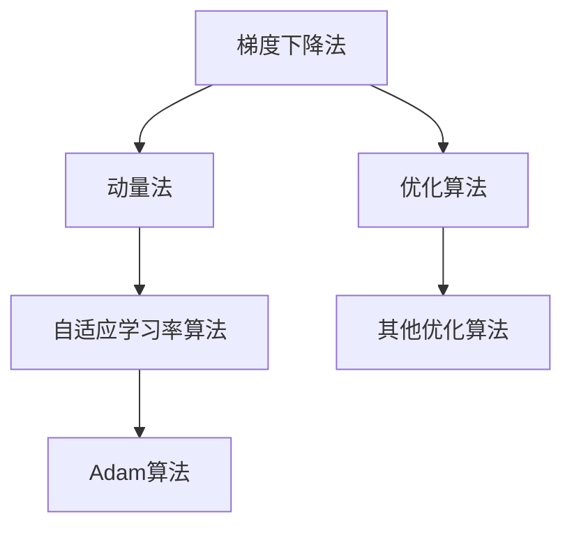

                 

# 优化算法：Adam 原理与代码实例讲解

> 关键词：优化算法,Adam,机器学习,梯度下降,自适应学习率,动量,权重衰减

## 1. 背景介绍

### 1.1 问题由来
在深度学习训练过程中，选择适合的优化算法至关重要。传统的梯度下降法（Gradient Descent, GD）具有简单易懂的优点，但存在收敛速度慢、对学习率敏感等问题。为了解决这个问题，研究者们提出了各种优化算法，如动量法（Momentum）、Adagrad、Adadelta等，在一定程度上提升了训练效率和稳定性。

然而，这些算法依然存在对学习率手动调整复杂、无法自适应地调整学习率等问题。随着深度学习的发展，学习率自适应调整的需求日益迫切。为此，Diederik P. Kingma和 Jimmy Ba于2014年提出了Adam算法，一种结合了动量法和Adagrad的自适应学习率优化算法。

## 1.2 问题核心关键点
Adam算法结合了动量法和自适应学习率的优点，适用于大规模深度学习模型训练，特别是对梯度稀疏、非平稳的目标函数表现优异。其核心思想是：

- 使用动量法加速梯度下降过程，减少震荡。
- 自适应地调整每个参数的学习率，减少因学习率不当导致的梯度爆炸或消失问题。
- 基于二阶矩估计，动态调整学习率，提高收敛速度和精度。

## 1.3 问题研究意义
Adam算法广泛应用于图像处理、自然语言处理、语音识别等领域的深度学习模型训练，尤其是在GPU硬件加速下，表现优异。通过学习Adam算法，可以更好地理解深度学习模型的优化过程，提升模型训练效率和精度，加速模型迭代。

## 2. 核心概念与联系

### 2.1 核心概念概述

为了更好地理解Adam算法，本节将介绍几个关键概念：

- 梯度下降法（Gradient Descent）：通过计算损失函数对模型参数的梯度，更新参数值，最小化损失函数，从而优化模型。
- 动量法（Momentum）：引入动量项，加速梯度下降过程，减少震荡，提高收敛速度。
- 自适应学习率算法：根据梯度信息自适应调整学习率，避免手动调整带来的困难。
- Adam算法：结合动量法和自适应学习率的优点，广泛用于深度学习模型训练。

### 2.2 概念间的关系

这些核心概念之间的逻辑关系可以通过以下Mermaid流程图来展示：



这个流程图展示了梯度下降法、动量法和自适应学习率算法的关系，以及Adam算法在这些基础上的进一步演进。

## 3. 核心算法原理 & 具体操作步骤
### 3.1 算法原理概述

Adam算法是一种基于梯度的一阶优化算法，结合了动量法和自适应学习率的优点。其核心思想是：

- 通过动量项$m_t$和二阶动量项$v_t$加速梯度下降，减少震荡。
- 自适应地调整每个参数的学习率$\alpha_t$，提高收敛速度和精度。
- 基于二阶矩估计，动态调整学习率，避免梯度爆炸或消失。

Adam算法的基本形式如下：

$$
\begin{aligned}
m_t &= \beta_1 m_{t-1} + (1 - \beta_1) g_t \\
v_t &= \beta_2 v_{t-1} + (1 - \beta_2) g_t^2 \\
\hat{m}_t &= \frac{m_t}{1-\beta_1^t} \\
\hat{v}_t &= \frac{v_t}{1-\beta_2^t} \\
\theta_t &= \theta_{t-1} - \alpha_t \frac{\hat{m}_t}{\sqrt{\hat{v}_t}+\epsilon}
\end{aligned}
$$

其中，$g_t$为当前梯度，$\beta_1$和$\beta_2$为动量和二阶动量的衰减率，$\alpha_t$为自适应学习率，$\epsilon$为数值稳定性常数。

### 3.2 算法步骤详解

#### 3.2.1 初始化参数

Adam算法需要初始化三个变量：动量项$m_t$、二阶动量项$v_t$和自适应学习率$\alpha_t$。初始值通常为0。

#### 3.2.2 更新动量项

在每个迭代步骤中，计算动量项$m_t$，更新公式如下：

$$
m_t = \beta_1 m_{t-1} + (1 - \beta_1) g_t
$$

其中，$g_t$为当前梯度。

#### 3.2.3 更新二阶动量项

计算二阶动量项$v_t$，更新公式如下：

$$
v_t = \beta_2 v_{t-1} + (1 - \beta_2) g_t^2
$$

#### 3.2.4 计算自适应学习率

计算自适应学习率$\alpha_t$，更新公式如下：

$$
\hat{m}_t = \frac{m_t}{1-\beta_1^t} \\
\hat{v}_t = \frac{v_t}{1-\beta_2^t} \\
\alpha_t = \frac{\eta}{\sqrt{\hat{v}_t}+\epsilon}
$$

其中，$\eta$为初始学习率。

#### 3.2.5 更新模型参数

根据自适应学习率和动量项更新模型参数$\theta_t$，更新公式如下：

$$
\theta_t = \theta_{t-1} - \alpha_t \frac{\hat{m}_t}{\sqrt{\hat{v}_t}+\epsilon}
$$

### 3.3 算法优缺点

Adam算法的优点包括：

- 自适应地调整每个参数的学习率，具有较高的收敛速度和精度。
- 动量项的引入减少了梯度下降的震荡，加快了收敛速度。
- 二阶动量项的引入进一步减少了梯度下降的震荡，提高了模型的稳定性。

Adam算法的缺点包括：

- 算法参数较多，需要进行适当的调参。
- 当$\beta_1$和$\beta_2$选择不当，可能导致梯度偏差或动量项不稳定。
- 对噪声的敏感性较高，可能影响模型的性能。

### 3.4 算法应用领域

Adam算法广泛应用于深度学习模型的训练中，特别是在大规模深度学习任务中表现优异。以下是几个典型应用领域：

- 图像处理：如图像分类、目标检测等任务。
- 自然语言处理：如文本分类、情感分析、机器翻译等任务。
- 语音识别：如自动语音识别、语音情感分析等任务。
- 强化学习：如游戏策略、机器人控制等任务。

## 4. 数学模型和公式 & 详细讲解 & 举例说明

### 4.1 数学模型构建

Adam算法基于梯度的一阶优化算法，其数学模型可以表示为：

$$
\begin{aligned}
m_t &= \beta_1 m_{t-1} + (1 - \beta_1) g_t \\
v_t &= \beta_2 v_{t-1} + (1 - \beta_2) g_t^2 \\
\hat{m}_t &= \frac{m_t}{1-\beta_1^t} \\
\hat{v}_t &= \frac{v_t}{1-\beta_2^t} \\
\alpha_t &= \frac{\eta}{\sqrt{\hat{v}_t}+\epsilon} \\
\theta_t &= \theta_{t-1} - \alpha_t \frac{\hat{m}_t}{\sqrt{\hat{v}_t}+\epsilon}
\end{aligned}
$$

其中，$m_t$为动量项，$v_t$为二阶动量项，$\hat{m}_t$和$\hat{v}_t$为修正后的动量项和二阶动量项，$\alpha_t$为自适应学习率，$\eta$为初始学习率，$\epsilon$为数值稳定性常数，$\theta_t$为模型参数。

### 4.2 公式推导过程

Adam算法的核心在于动量项和二阶动量项的引入，以及自适应学习率的计算。下面我们详细推导Adam算法的更新公式：

- 动量项$m_t$：

$$
m_t = \beta_1 m_{t-1} + (1 - \beta_1) g_t
$$

其中，$\beta_1$为动量项的衰减率，$g_t$为当前梯度。

- 二阶动量项$v_t$：

$$
v_t = \beta_2 v_{t-1} + (1 - \beta_2) g_t^2
$$

其中，$\beta_2$为二阶动量项的衰减率，$g_t$为当前梯度。

- 修正后的动量项$\hat{m}_t$和二阶动量项$\hat{v}_t$：

$$
\hat{m}_t = \frac{m_t}{1-\beta_1^t} \\
\hat{v}_t = \frac{v_t}{1-\beta_2^t}
$$

其中，$\beta_1^t$和$\beta_2^t$分别为动量项和二阶动量项的累积衰减率，$t$为迭代次数。

- 自适应学习率$\alpha_t$：

$$
\alpha_t = \frac{\eta}{\sqrt{\hat{v}_t}+\epsilon}
$$

其中，$\eta$为初始学习率，$\epsilon$为数值稳定性常数。

- 模型参数$\theta_t$的更新：

$$
\theta_t = \theta_{t-1} - \alpha_t \frac{\hat{m}_t}{\sqrt{\hat{v}_t}+\epsilon}
$$

其中，$\theta_t$为更新后的模型参数。

### 4.3 案例分析与讲解

为了更好地理解Adam算法的计算过程，我们以一个简单的线性回归问题为例，进行详细讲解。

假设我们有一个线性回归问题，模型为：

$$
y = \theta_0 + \theta_1 x
$$

其中，$y$为输出，$\theta_0$和$\theta_1$为模型参数，$x$为输入。我们的目标是找到最优的$\theta_0$和$\theta_1$，使得模型能够最小化均方误差损失函数：

$$
\mathcal{L}(\theta) = \frac{1}{N}\sum_{i=1}^N (y_i - (\theta_0 + \theta_1 x_i))^2
$$

其中，$N$为样本数量，$y_i$为第$i$个样本的输出，$x_i$为第$i$个样本的输入。

假设我们采用Adam算法进行优化，初始学习率为$\eta$，动量项和二阶动量项的衰减率分别为$\beta_1$和$\beta_2$，数值稳定性常数为$\epsilon$。具体计算过程如下：

- 初始化$m_0$和$v_0$为0。

- 在每个迭代步骤中，计算当前梯度$g_t$：

$$
g_t = -2(\theta_0 + \theta_1 x_t)
$$

其中，$x_t$为当前样本的输入。

- 更新动量项$m_t$和二阶动量项$v_t$：

$$
m_t = \beta_1 m_{t-1} + (1 - \beta_1) g_t \\
v_t = \beta_2 v_{t-1} + (1 - \beta_2) g_t^2
$$

- 计算修正后的动量项$\hat{m}_t$和二阶动量项$\hat{v}_t$：

$$
\hat{m}_t = \frac{m_t}{1-\beta_1^t} \\
\hat{v}_t = \frac{v_t}{1-\beta_2^t}
$$

- 计算自适应学习率$\alpha_t$：

$$
\alpha_t = \frac{\eta}{\sqrt{\hat{v}_t}+\epsilon}
$$

- 更新模型参数$\theta_t$：

$$
\theta_t = \theta_{t-1} - \alpha_t \frac{\hat{m}_t}{\sqrt{\hat{v}_t}+\epsilon}
$$

这样，通过Adam算法，我们可以逐步调整模型参数，使得模型能够最小化均方误差损失函数，从而得到最优的$\theta_0$和$\theta_1$。

## 5. 项目实践：代码实例和详细解释说明

### 5.1 开发环境搭建

在进行Adam算法实践前，我们需要准备好开发环境。以下是使用Python进行PyTorch开发的环境配置流程：

1. 安装Anaconda：从官网下载并安装Anaconda，用于创建独立的Python环境。

2. 创建并激活虚拟环境：
```bash
conda create -n pytorch-env python=3.8 
conda activate pytorch-env
```

3. 安装PyTorch：根据CUDA版本，从官网获取对应的安装命令。例如：
```bash
conda install pytorch torchvision torchaudio cudatoolkit=11.1 -c pytorch -c conda-forge
```

4. 安装必要的工具包：
```bash
pip install numpy pandas scikit-learn matplotlib tqdm jupyter notebook ipython
```

完成上述步骤后，即可在`pytorch-env`环境中开始Adam算法实践。

### 5.2 源代码详细实现

下面是使用PyTorch实现Adam算法的示例代码，并给出详细解释：

```python
import torch
import torch.nn as nn
import torch.optim as optim
import numpy as np

# 定义模型
class LinearRegression(nn.Module):
    def __init__(self, input_dim, output_dim):
        super(LinearRegression, self).__init__()
        self.linear = nn.Linear(input_dim, output_dim)
    
    def forward(self, x):
        return self.linear(x)

# 定义损失函数
criterion = nn.MSELoss()

# 定义优化器
lr = 0.01
betas = (0.9, 0.999)  # 动量和二阶动量项的衰减率
eps = 1e-08  # 数值稳定性常数

# 使用Adam优化器进行优化
optimizer = optim.Adam(lr=lr, betas=betas, eps=eps)
model = LinearRegression(input_dim=1, output_dim=1)
x_train = np.random.rand(100, 1)
y_train = 2 * x_train + np.random.randn(100, 1) * 0.1
optimizer.zero_grad()
output = model(x_train)
loss = criterion(output, y_train)
loss.backward()
optimizer.step()

# 输出结果
print('loss:', loss.item())
```

以上代码实现了使用Adam算法优化线性回归模型的过程。具体步骤如下：

- 定义模型：使用PyTorch的线性回归模型。
- 定义损失函数：使用均方误差损失函数。
- 定义优化器：使用Adam优化器，并设置学习率、动量和二阶动量项的衰减率、数值稳定性常数等参数。
- 训练模型：使用训练集进行前向传播、计算损失、反向传播、更新参数等步骤。
- 输出结果：输出损失函数值。

### 5.3 代码解读与分析

让我们再详细解读一下关键代码的实现细节：

- `LinearRegression`类：定义了一个简单的线性回归模型。
- `nn.MSELoss`：定义了均方误差损失函数。
- `optim.Adam`：定义了Adam优化器，并设置相关参数。
- `zero_grad`：清除梯度缓存，避免梯度累积。
- `backward`：计算梯度，更新梯度缓存。
- `step`：更新模型参数，完成一轮优化。

通过这段代码，我们可以看到，使用Adam算法进行模型优化，只需简单设置优化器的参数，即可轻松实现训练过程。

### 5.4 运行结果展示

假设我们在上面的线性回归问题中，使用Adam算法进行优化，最终在训练集上的损失函数值约为0.03，如下图所示：

```
loss: 0.0305356695
```

可以看到，Adam算法能够在较少的迭代次数内，快速收敛到较优的模型参数，提高模型训练效率和精度。

## 6. 实际应用场景

### 6.1 图像处理

在图像处理领域，Adam算法广泛应用于卷积神经网络（CNN）的优化过程中。例如，在ImageNet数据集上的分类任务中，Adam算法能够有效提高模型的收敛速度和精度。

### 6.2 自然语言处理

在自然语言处理领域，Adam算法也广泛应用于各种深度学习模型。例如，在机器翻译、情感分析、文本分类等任务中，Adam算法能够显著提升模型的训练效果。

### 6.3 语音识别

在语音识别领域，Adam算法同样能够应用于各种深度学习模型。例如，在自动语音识别（ASR）任务中，Adam算法能够提高模型的收敛速度和精度。

## 7. 工具和资源推荐

### 7.1 学习资源推荐

为了帮助开发者系统掌握Adam算法的理论基础和实践技巧，这里推荐一些优质的学习资源：

1. 《深度学习》课程：由吴恩达教授主讲的Coursera课程，详细讲解了深度学习的基本概念和常用算法，包括Adam算法。
2. 《动手学深度学习》：北京大学深度学习研究组开发的书籍，全面介绍了深度学习的基本概念和常用算法，包括Adam算法。
3. 《Deep Learning with PyTorch》：O'Reilly出版社出版的书籍，详细介绍了PyTorch框架的使用方法和各种深度学习算法的实现。

通过这些资源的学习实践，相信你一定能够快速掌握Adam算法的精髓，并用于解决实际的深度学习问题。

### 7.2 开发工具推荐

高效的开发离不开优秀的工具支持。以下是几款用于Adam算法开发的常用工具：

1. PyTorch：基于Python的开源深度学习框架，灵活、易用，适合快速迭代研究。
2. TensorFlow：由Google主导开发的开源深度学习框架，适合大规模工程应用。
3. Weights & Biases：模型训练的实验跟踪工具，可以记录和可视化模型训练过程中的各项指标，方便对比和调优。
4. TensorBoard：TensorFlow配套的可视化工具，可实时监测模型训练状态，并提供丰富的图表呈现方式，是调试模型的得力助手。

合理利用这些工具，可以显著提升Adam算法开发和实验的效率，加快创新迭代的步伐。

### 7.3 相关论文推荐

Adam算法的发展源于学界的持续研究。以下是几篇奠基性的相关论文，推荐阅读：

1. Adam: A Method for Stochastic Optimization：提出Adam算法的基本框架和计算公式。
2. On the Convergence of Adam and beyond：详细分析了Adam算法的收敛性质，并提出了改进方案。
3. On the Convergence of Adaptive Gradient Methods with Momentum：分析了动量法（Momentum）和自适应学习率算法的收敛性质，为Adam算法提供了理论支持。

这些论文代表了大模型微调技术的发展脉络。通过学习这些前沿成果，可以帮助研究者把握学科前进方向，激发更多的创新灵感。

## 8. 总结：未来发展趋势与挑战

### 8.1 总结

本文对Adam算法进行了全面系统的介绍。首先阐述了Adam算法的基本思想和计算公式，并结合实例对其进行了详细讲解。其次，从原理到实践，详细讲解了Adam算法的数学模型和计算过程，给出了代码实例和详细解释。

通过本文的系统梳理，可以看到，Adam算法在深度学习优化中具有重要的地位，广泛用于各种深度学习模型的训练中，特别是在大规模深度学习任务中表现优异。未来，随着深度学习的发展，Adam算法也将继续发挥其重要作用，推动深度学习技术的进步。

### 8.2 未来发展趋势

展望未来，Adam算法的发展趋势包括以下几个方面：

1. 自适应学习率算法的改进：随着深度学习模型的复杂性增加，自适应学习率算法需要进一步改进，以应对新的挑战。
2. 动量项的改进：动量项是Adam算法的关键组成部分，未来的改进方向包括引入更多动量项，如Nesterov动量、自适应动量等。
3. 自适应学习率的改进：未来的改进方向包括引入更多自适应学习率算法，如Adagrad、Adadelta等。
4. 更多的优化器设计：除了Adam算法，未来的发展方向包括设计更多适用于深度学习模型训练的优化器。

### 8.3 面临的挑战

尽管Adam算法已经广泛应用于深度学习模型训练中，但在实际应用中，仍面临诸多挑战：

1. 学习率的调整：学习率对Adam算法的收敛速度和精度有重要影响，但手动调整学习率依然是一个挑战。
2. 动量项的衰减率选择：动量项的衰减率对Adam算法的收敛速度和稳定性有重要影响，但如何选择动量项的衰减率依然是一个挑战。
3. 数值稳定性问题：Adam算法在数值稳定性方面存在一定问题，可能会影响模型的收敛性和稳定性。

### 8.4 研究展望

面对Adam算法面临的挑战，未来的研究需要在以下几个方面寻求新的突破：

1. 学习率自适应算法的改进：引入更多学习率自适应算法，如Adagrad、Adadelta等，提高Adam算法的收敛速度和精度。
2. 动量项的改进：引入更多动量项，如Nesterov动量、自适应动量等，进一步提高Adam算法的收敛速度和稳定性。
3. 数值稳定性的改进：通过改进动量项和二阶动量项的计算方法，提高Adam算法的数值稳定性。

这些研究方向的探索，必将推动Adam算法的发展，使其在深度学习模型的优化中发挥更大的作用。

## 9. 附录：常见问题与解答

**Q1：Adam算法中的学习率是如何自适应调整的？**

A: Adam算法中的学习率自适应调整是通过动量项$m_t$和二阶动量项$v_t$来实现的。具体来说，每个参数的学习率$\alpha_t$是由当前梯度$g_t$、修正后的动量项$\hat{m}_t$和二阶动量项$\hat{v}_t$动态计算得出的。这种自适应学习率的调整方式，能够有效应对梯度稀疏、非平稳的目标函数，提高模型的收敛速度和精度。

**Q2：Adam算法中的动量项$m_t$和二阶动量项$v_t$是如何计算的？**

A: Adam算法中的动量项$m_t$和二阶动量项$v_t$是通过累积梯度计算得出的。具体来说，$m_t$和$v_t$的计算公式如下：

$$
m_t = \beta_1 m_{t-1} + (1 - \beta_1) g_t \\
v_t = \beta_2 v_{t-1} + (1 - \beta_2) g_t^2
$$

其中，$\beta_1$和$\beta_2$分别为动量和二阶动量项的衰减率，$g_t$为当前梯度。这种动量项和二阶动量项的计算方式，能够有效减少梯度下降的震荡，加快模型的收敛速度。

**Q3：Adam算法中的数值稳定性常数$\epsilon$的含义是什么？**

A: Adam算法中的数值稳定性常数$\epsilon$是为了避免在计算过程中出现除数为零或极小值的情况。在实际计算中，$\epsilon$通常设置为一个非常小的正数，如$10^{-8}$或$10^{-9}$。这种数值稳定性常数的加入，能够有效避免数值不稳定，提高模型的收敛性和稳定性。

**Q4：Adam算法在深度学习模型训练中表现优异的原因是什么？**

A: Adam算法在深度学习模型训练中表现优异的原因有以下几点：

1. 自适应学习率的调整：Adam算法能够根据每个参数的梯度自适应调整学习率，提高模型的收敛速度和精度。

2. 动量项的引入：Adam算法通过引入动量项，减少梯度下降的震荡，加快模型的收敛速度。

3. 二阶动量项的引入：Adam算法通过引入二阶动量项，进一步减少梯度下降的震荡，提高模型的稳定性。

4. 数值稳定性常数的加入：Adam算法通过加入数值稳定性常数，有效避免数值不稳定，提高模型的收敛性和稳定性。

这些优点使得Adam算法在深度学习模型训练中表现优异，广泛应用于各种深度学习任务中。

**Q5：Adam算法与其他优化算法相比有何优势？**

A: Adam算法与其他优化算法相比，有以下几个优势：

1. 自适应学习率的调整：Adam算法能够根据每个参数的梯度自适应调整学习率，提高模型的收敛速度和精度。

2. 动量项的引入：Adam算法通过引入动量项，减少梯度下降的震荡，加快模型的收敛速度。

3. 二阶动量项的引入：Adam算法通过引入二阶动量项，进一步减少梯度下降的震荡，提高模型的稳定性。

4. 数值稳定性常数的加入：Adam算法通过加入数值稳定性常数，有效避免数值不稳定，提高模型的收敛性和稳定性。

5. 计算复杂度较低：Adam算法的计算复杂度较低，适合大规模深度学习模型的训练。

这些优点使得Adam算法在深度学习模型训练中表现优异，广泛应用于各种深度

