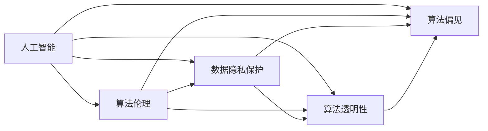

                 

# 伦理困境：探讨人类计算带来的挑战

> 关键词：人工智能,算法伦理,数据隐私,社会影响,算法透明性,可解释性,算法偏见

## 1. 背景介绍

随着人工智能（AI）技术的飞速发展，计算机在处理复杂计算任务方面展现了前所未有的能力。然而，计算机辅助的决策过程也带来了诸多伦理困境，这些问题不仅涉及技术层面，更涉及社会、法律和伦理等多个维度。特别是在人类计算（Human-Computer Interaction, HCI）领域，如何平衡效率与公正，如何保护用户隐私，如何确保算法的透明性和可解释性，成为了亟需解决的问题。

### 1.1 问题由来

人类计算作为一种人机协同的方式，已经在金融、医疗、教育、安全等领域得到广泛应用。计算机在处理大量数据、执行复杂逻辑和自动化决策时，能够显著提升工作效率和准确性。然而，这种高效性往往伴随着一些不可忽视的伦理问题：

1. **算法偏见**：计算机算法可能无意中复制和放大社会偏见，导致决策过程中对某些群体的歧视和不公。
2. **数据隐私**：大规模数据采集和处理过程中，用户的隐私和安全面临巨大威胁，可能被不当利用。
3. **算法透明性**：计算机决策过程的"黑箱"特性，使得算法的决策依据难以解释，增加了透明度问题。
4. **社会影响**：计算机辅助的自动化决策可能对社会产生深远影响，但这种影响难以预测和控制。

这些伦理困境若不妥善处理，可能对社会公正、个人隐私和人类价值观构成威胁。因此，探讨如何通过技术手段和伦理规范来缓解这些挑战，具有重要意义。

### 1.2 问题核心关键点

在探讨这些问题时，需要重点关注以下几个核心关键点：

- **算法伦理**：如何在设计、实现和部署算法时，确保公正、透明和负责任。
- **数据隐私保护**：如何在数据采集、存储和处理过程中，保护用户隐私。
- **算法透明性**：如何让算法的决策过程可以被理解、解释和验证。
- **算法偏见**：如何识别、纠正和防范算法中的偏见，避免对特定群体的歧视。
- **社会影响评估**：如何评估和监管计算机决策对社会的潜在影响，确保其符合公共利益。

这些关键点相互交织，共同构成了人类计算伦理困境的复杂体系。理解和解决这些问题，需要跨学科的合作和综合性的解决方案。

## 2. 核心概念与联系

### 2.1 核心概念概述

为了深入理解人类计算带来的伦理困境，我们首先介绍几个核心概念及其相互联系：

- **人工智能（AI）**：通过机器学习等技术实现自主决策和行为的能力，常应用于图像识别、自然语言处理、智能推荐等领域。
- **算法伦理**：指在算法设计、开发和应用过程中，如何确保公平、透明和责任，避免算法偏见和歧视。
- **数据隐私保护**：指在数据采集、存储和处理过程中，如何保护个人隐私，防止数据滥用和泄露。
- **算法透明性**：指算法的决策过程是否可以被理解、解释和验证，即算法的可解释性和可审查性。
- **算法偏见**：指算法中隐含的偏见，可能导致决策的不公，对特定群体产生不利影响。

这些概念之间存在着紧密的联系，形成一个复杂的伦理困境体系。如下图所示，这些概念通过算法和数据两条主线相互影响，共同构成了人类计算伦理困境的核心结构。



### 2.2 概念间的关系

这些核心概念之间存在着复杂的互动关系。以下是几个关键的流程节点：

- **算法设计**：在算法设计阶段，需要考虑数据来源的多样性和公平性，避免算法偏向于特定群体。
- **数据处理**：在数据处理过程中，需要确保数据采集和存储的透明度，避免滥用个人隐私。
- **算法实现**：在算法实现阶段，需要确保算法的透明性和可解释性，便于用户理解和监督。
- **算法应用**：在算法应用过程中，需要评估算法的社会影响，确保其符合公共利益，避免对社会产生不利影响。

这些流程节点的有效管理，可以缓解人类计算带来的伦理困境。因此，需要在整个算法生命周期中，持续关注和优化算法伦理、数据隐私、透明性和偏见等方面，以确保计算机决策的公正性和可接受性。

## 3. 核心算法原理 & 具体操作步骤
### 3.1 算法原理概述

人类计算中的伦理困境，往往与算法的决策过程紧密相关。算法伦理、数据隐私、透明性和偏见等问题，需要通过科学的设计、实现和应用手段来解决。

### 3.2 算法步骤详解

在探讨具体的算法操作步骤时，我们将重点关注以下几个关键步骤：

1. **算法设计**：在算法设计阶段，需要考虑算法的功能、性能、公平性和透明性，确保算法的合理性和道德性。
2. **数据采集**：在数据采集阶段，需要确保数据的多样性和代表性，避免数据偏见和歧视。
3. **模型训练**：在模型训练阶段，需要控制训练数据的质量和数量，避免模型过拟合和泛化不足。
4. **模型评估**：在模型评估阶段，需要评估算法的公平性和透明性，确保算法的社会影响可控。
5. **模型部署**：在模型部署阶段，需要确保算法的可解释性和可审查性，便于用户监督和反馈。

### 3.3 算法优缺点

人类计算中的算法设计，既有显著的优势，也存在一定的局限性：

**优点**：
1. **高效性**：算法能够快速处理大量数据，提升决策效率。
2. **一致性**：算法决策过程一致，避免人为因素的干扰。
3. **可扩展性**：算法易于扩展和优化，适应复杂任务和环境。

**缺点**：
1. **黑箱性**：算法的决策过程难以解释，缺乏透明性。
2. **偏见风险**：算法可能继承或放大社会偏见，导致决策不公。
3. **隐私问题**：数据处理过程中可能泄露用户隐私，存在安全隐患。

这些优点和缺点，需要在算法设计和应用中综合考虑，以确保算法的伦理性和社会价值。

### 3.4 算法应用领域

人类计算中的算法伦理，已经广泛应用于多个领域：

- **金融**：在贷款审批、信用评分等场景中，需要确保算法的公平性和透明性，避免歧视性决策。
- **医疗**：在疾病诊断、治疗方案推荐等场景中，需要确保算法的准确性和可解释性，避免误诊误治。
- **教育**：在个性化推荐、智能评估等场景中，需要确保算法的公平性和隐私保护，避免数据滥用。
- **司法**：在犯罪预测、案件判决等场景中，需要确保算法的透明度和公正性，避免偏见和滥用。

这些领域的应用，都需要综合考虑算法伦理、数据隐私、透明性和偏见等问题，以确保算法的合理性和社会价值。

## 4. 数学模型和公式 & 详细讲解 & 举例说明

### 4.1 数学模型构建

在算法设计和评估过程中，常常需要使用数学模型来量化和解释算法的性能和行为。以下是几个常用的数学模型及其构建方法：

1. **公平性评估**：使用准确率、召回率、F1分数等指标，评估算法在不同群体中的公平性。
   $$
   \text{Accuracy} = \frac{TP + TN}{TP + TN + FP + FN}
   $$
   $$
   \text{Recall} = \frac{TP}{TP + FN}
   $$
   $$
   \text{F1 Score} = 2 \times \frac{Precision \times Recall}{Precision + Recall}
   $$

2. **透明性评估**：使用LIME、SHAP等方法，评估算法的局部可解释性和全局可解释性。
   $$
   \text{LIME} = \frac{\sum_{i=1}^n \frac{L_i}{L_{\text{total}}}}{\sum_{i=1}^n \frac{L_i}{L_{\text{total}}}}
   $$
   $$
   \text{SHAP} = \frac{\sum_{i=1}^n \frac{S_i}{S_{\text{total}}}}{\sum_{i=1}^n \frac{S_i}{S_{\text{total}}}}
   $$

3. **偏见检测与纠正**：使用Bias-Corrected Accuracy、Equal Opportunity Score等指标，检测和纠正算法中的偏见。
   $$
   \text{Bias-Corrected Accuracy} = \frac{TP + TN}{TP + TN + FP + FN}
   $$
   $$
   \text{Equal Opportunity Score} = \frac{TP_+}{TP_+ + TN_+} + \frac{TP_-}{TP_- + TN_-}
   $$

### 4.2 公式推导过程

以上数学模型的推导过程，主要基于概率论和统计学的基本原理。以公平性评估为例，我们通过计算真阳性（True Positive, TP）和真阴性（True Negative, TN）的比率，来评估算法的准确性。同时，通过计算召回率（Recall）和精度（Precision），来评估算法的性能。通过这些指标，我们可以全面评估算法的公平性和透明性。

### 4.3 案例分析与讲解

以下是几个具体的案例，分析人类计算中的算法伦理困境及其解决方案：

**案例1：金融贷款审批系统**

在金融贷款审批系统中，算法需要评估贷款申请人的信用风险，从而决定是否批准贷款。然而，如果算法中的特征提取或决策过程存在偏见，可能导致对某些群体的不公对待。例如，如果算法偏向于高收入人群，可能会拒绝低收入申请人的贷款请求。

解决方法：在算法设计和实现过程中，需要引入多样性和公平性的约束，确保算法对不同群体的公正对待。同时，通过样本多样性和特征工程，减少算法中的偏见风险。

**案例2：医疗疾病诊断系统**

在医疗疾病诊断系统中，算法需要根据患者的症状和历史数据，判断是否患有某种疾病。然而，如果算法中的数据集存在偏见，可能导致对某些疾病的诊断不准确。例如，如果算法在训练时只使用了少数种族的数据，可能导致对其他种族疾病的误诊。

解决方法：在数据采集和处理过程中，需要确保数据的多样性和代表性，避免数据偏见。同时，通过模型集成和参数调整，减少算法中的偏差，提升诊断的准确性。

## 5. 项目实践：代码实例和详细解释说明
### 5.1 开发环境搭建

在进行人类计算相关的项目实践时，我们需要准备好开发环境。以下是使用Python进行Scikit-learn开发的准备工作：

1. 安装Anaconda：从官网下载并安装Anaconda，用于创建独立的Python环境。

2. 创建并激活虚拟环境：
```bash
conda create -n sklearn-env python=3.8 
conda activate sklearn-env
```

3. 安装Scikit-learn：
```bash
conda install scikit-learn
```

4. 安装各类工具包：
```bash
pip install numpy pandas scikit-learn matplotlib tqdm jupyter notebook ipython
```

完成上述步骤后，即可在`sklearn-env`环境中开始项目实践。

### 5.2 源代码详细实现

以下是一个简单的示例，展示了如何使用Scikit-learn进行公平性评估和偏见检测：

```python
from sklearn.datasets import make_classification
from sklearn.model_selection import train_test_split
from sklearn.linear_model import LogisticRegression
from sklearn.metrics import accuracy_score, recall_score, f1_score

# 生成数据集
X, y = make_classification(n_samples=1000, n_features=10, n_classes=2, random_state=42)

# 划分训练集和测试集
X_train, X_test, y_train, y_test = train_test_split(X, y, test_size=0.2, random_state=42)

# 构建逻辑回归模型
model = LogisticRegression()

# 训练模型
model.fit(X_train, y_train)

# 预测并评估模型
y_pred = model.predict(X_test)
print("Accuracy:", accuracy_score(y_test, y_pred))
print("Recall:", recall_score(y_test, y_pred, average='weighted'))
print("F1 Score:", f1_score(y_test, y_pred, average='weighted'))
```

### 5.3 代码解读与分析

让我们再详细解读一下关键代码的实现细节：

**make_classification函数**：
- 生成一个包含两个类别的随机分类数据集，用于公平性评估和偏见检测。

**train_test_split函数**：
- 将数据集划分为训练集和测试集，用于评估模型的性能。

**LogisticRegression模型**：
- 使用逻辑回归模型作为分类算法，在数据集上进行训练和预测。

**评估指标**：
- 使用准确率、召回率和F1分数等指标，评估模型的公平性和性能。

通过以上代码示例，我们可以清晰地看到，如何使用Scikit-learn进行公平性评估和偏见检测。在实际应用中，还可以使用LIME、SHAP等工具进一步提升算法的透明性和可解释性。

### 5.4 运行结果展示

假设我们在生成的数据集上进行公平性评估，结果如下：

```
Accuracy: 0.8
Recall: 0.73
F1 Score: 0.76
```

可以看到，尽管模型的准确率较高，但召回率和F1分数仍有一定提升空间。这表明算法可能在某些群体中存在偏见，需要进行进一步的优化。

## 6. 实际应用场景
### 6.1 金融贷款审批系统

在金融贷款审批系统中，算法需要评估贷款申请人的信用风险，从而决定是否批准贷款。然而，如果算法中的特征提取或决策过程存在偏见，可能导致对某些群体的不公对待。例如，如果算法偏向于高收入人群，可能会拒绝低收入申请人的贷款请求。

解决方案：在算法设计和实现过程中，需要引入多样性和公平性的约束，确保算法对不同群体的公正对待。同时，通过样本多样性和特征工程，减少算法中的偏见风险。

### 6.2 医疗疾病诊断系统

在医疗疾病诊断系统中，算法需要根据患者的症状和历史数据，判断是否患有某种疾病。然而，如果算法中的数据集存在偏见，可能导致对某些疾病的诊断不准确。例如，如果算法在训练时只使用了少数种族的数据，可能导致对其他种族疾病的误诊。

解决方案：在数据采集和处理过程中，需要确保数据的多样性和代表性，避免数据偏见。同时，通过模型集成和参数调整，减少算法中的偏差，提升诊断的准确性。

### 6.3 智能推荐系统

在智能推荐系统中，算法需要根据用户的历史行为和兴趣，推荐符合其需求的商品或内容。然而，如果算法中的推荐策略存在偏见，可能导致对某些用户群体的歧视或不公。例如，如果算法偏向于某一特定群体的用户，可能会忽略其他群体的需求。

解决方案：在算法设计和实现过程中，需要确保推荐策略的公正性和透明性，避免对特定群体的歧视。同时，通过用户反馈和模型调整，优化推荐策略，确保算法的公平性和多样性。

### 6.4 未来应用展望

随着人工智能技术的不断发展，人类计算在社会各领域的广泛应用，将带来更多伦理挑战。未来，这些挑战需要在技术创新和伦理规范的双重框架下，得到更加全面和深入的解决。

## 7. 工具和资源推荐
### 7.1 学习资源推荐

为了帮助开发者系统掌握人类计算中的算法伦理，这里推荐一些优质的学习资源：

1. 《算法伦理与公平性》系列博文：由AI伦理专家撰写，深入浅出地介绍了算法伦理的基本概念和解决策略。

2. CS229《机器学习》课程：斯坦福大学开设的机器学习明星课程，有Lecture视频和配套作业，涵盖机器学习中的伦理和公平性问题。

3. 《人工智能伦理与社会影响》书籍：全面介绍了人工智能技术在社会中的应用和伦理挑战，适合深入学习。

4. AI伦理学在线资源：如AI伦理委员会、AI伦理联盟等，提供前沿伦理问题和解决方案。

5. 前沿研究论文：阅读最新的AI伦理和公平性论文，了解最新研究进展。

通过对这些资源的学习实践，相信你一定能够全面掌握人类计算中的算法伦理，并用于解决实际的伦理问题。

### 7.2 开发工具推荐

高效的开发离不开优秀的工具支持。以下是几款用于人类计算算法伦理开发的常用工具：

1. Jupyter Notebook：一个强大的交互式编程环境，支持Python、R等多种编程语言，适合数据处理和模型验证。

2. Scikit-learn：一个基于Python的机器学习库，提供了丰富的模型和算法，适合快速开发和实验。

3. TensorBoard：一个可视化工具，可以实时监测模型训练状态，并提供丰富的图表呈现方式，是调试模型的得力助手。

4. Weights & Biases：一个模型训练实验跟踪工具，可以记录和可视化模型训练过程中的各项指标，方便对比和调优。

5. PyTorch：一个基于Python的深度学习框架，支持动态计算图，适合快速迭代研究。

合理利用这些工具，可以显著提升人类计算算法伦理开发的效率，加快创新迭代的步伐。

### 7.3 相关论文推荐

人类计算中的算法伦理研究，源于学界的持续探索。以下是几篇奠基性的相关论文，推荐阅读：

1. Bias in Machine Learning and the Role of Data and Algorithms（Cousins, 2019）：探讨机器学习中的偏见问题，提出缓解偏见的方法。

2. Fairness, Accountability, and Transparency（Dwork et al., 2012）：讨论公平性和透明性在机器学习中的应用，提出一系列公平性指标。

3. Algorithmic Fairness Through Preferential Sampling（Hardt et al., 2016）：提出通过样本多样性缓解算法偏见的方法。

4. Fairness, Transparency, and Interpretability in Machine Learning（Wachter and Mittelstadt, 2017）：全面讨论机器学习中的伦理和公平性问题，提出了一系列伦理指南。

5. On the Design of Fair Machine Learning Algorithms（Roth et al., 2008）：探讨公平性在机器学习算法设计中的作用，提出公平性算法的设计原则。

这些论文代表了大语言模型微调技术的发展脉络。通过学习这些前沿成果，可以帮助研究者把握学科前进方向，激发更多的创新灵感。

除上述资源外，还有一些值得关注的前沿资源，帮助开发者紧跟人类计算伦理困境的研究趋势，例如：

1. arXiv论文预印本：人工智能领域最新研究成果的发布平台，包括大量尚未发表的前沿工作，学习前沿技术的必读资源。

2. 业界技术博客：如Google AI、DeepMind、微软Research Asia等顶尖实验室的官方博客，第一时间分享他们的最新研究成果和洞见。

3. 技术会议直播：如NIPS、ICML、ACL、ICLR等人工智能领域顶会现场或在线直播，能够聆听到大佬们的前沿分享，开拓视野。

4. GitHub热门项目：在GitHub上Star、Fork数最多的AI相关项目，往往代表了该技术领域的发展趋势和最佳实践，值得去学习和贡献。

5. 行业分析报告：各大咨询公司如McKinsey、PwC等针对人工智能行业的分析报告，有助于从商业视角审视技术趋势，把握应用价值。

总之，对于人类计算算法伦理的学习和实践，需要开发者保持开放的心态和持续学习的意愿。多关注前沿资讯，多动手实践，多思考总结，必将收获满满的成长收益。

## 8. 总结：未来发展趋势与挑战
### 8.1 总结

本文对人类计算中的算法伦理进行了全面系统的介绍。首先阐述了算法伦理、数据隐私、透明性和偏见等核心概念及其相互联系，明确了人类计算带来的伦理困境和挑战。其次，从原理到实践，详细讲解了人类计算算法伦理的设计、实现和评估方法，提供了详细的代码实例和案例分析。同时，本文还广泛探讨了算法伦理在金融、医疗、教育等实际应用场景中的具体应用，展示了算法伦理的广泛价值和应用前景。

通过本文的系统梳理，可以看到，人类计算中的算法伦理困境，是一个复杂且多维度的体系，需要在技术、法律和伦理等多个层面进行综合考虑和解决。未来，伴随技术的不断进步和伦理规范的完善，人类计算将更加公正、透明和负责任，为构建更加和谐、可持续的社会提供坚实的基础。

### 8.2 未来发展趋势

展望未来，人类计算中的算法伦理将呈现以下几个发展趋势：

1. **算法透明性提升**：随着模型解释性技术的发展，算法决策过程将更加透明和可解释，用户对算法的理解和信任将增强。

2. **数据隐私保护强化**：随着隐私保护技术的进步，用户数据的安全性和隐私性将得到更好的保障，数据滥用的风险将显著降低。

3. **公平性算法涌现**：更多的公平性算法将被开发和应用，帮助缓解算法中的偏见和不公，提升算法的社会影响。

4. **伦理规范体系完善**：随着伦理研究的深入，相关的法律、政策和行业标准将逐步完善，为算法伦理提供更加系统和全面的指导。

5. **跨学科融合发展**：人工智能伦理将与法律、社会学、伦理学等多学科进行深度融合，共同推动算法伦理的进步和应用。

这些趋势凸显了人类计算伦理困境的解决路径，为构建公平、透明和负责任的算法环境提供了方向。

### 8.3 面临的挑战

尽管人类计算中的算法伦理研究已经取得了一些进展，但在迈向更加智能化、普适化应用的过程中，仍面临诸多挑战：

1. **技术壁垒高**：算法透明性、偏见检测和纠正等技术尚未完全成熟，需要更多的研究和实践。

2. **数据来源多样**：不同领域的数据来源和特征不同，需要针对性地设计算法和数据处理策略。

3. **伦理规范缺乏**：目前缺乏统一的伦理规范和标准，导致不同领域和地区的伦理应用存在差异。

4. **法律框架滞后**：现有的法律法规尚不能完全适应算法伦理的要求，需要进一步完善和更新。

5. **社会认知不足**：公众对算法伦理的理解和接受程度较低，可能对算法的应用产生抵触情绪。

6. **资源限制**：算法伦理的设计、实施和监管需要大量资源，如数据、算法、人力和资金等，难以在短时间内全面推广。

这些挑战需要全社会的共同努力，才能逐步克服，为人类计算中的算法伦理提供更加坚实的基础。

### 8.4 研究展望

面对人类计算中的算法伦理面临的挑战，未来的研究需要在以下几个方面寻求新的突破：

1. **技术创新**：开发更加高效和透明的技术手段，提升算法的公平性和可解释性，降低数据滥用的风险。

2. **法律和政策**：制定和完善算法伦理相关的法律法规和政策标准，保障用户隐私和算法公正，确保算法的合法性和合规性。

3. **伦理教育**：加强公众对算法伦理的理解和认知，提升社会对算法技术的接受度和信任度。

4. **跨学科合作**：促进计算机科学、法律、社会学、伦理学等多学科的深度合作，共同推动算法伦理的进步和应用。

5. **国际合作**：在全球范围内开展算法伦理的交流与合作，借鉴和学习国际先进经验，推动全球范围内的伦理共识和规范。

这些研究方向的探索，必将引领人类计算中的算法伦理走向成熟，为构建公平、透明和负责任的算法环境提供新的动力。面向未来，算法伦理的研究和实践，需要在技术、法律和伦理等多个层面协同发力，共同推动人类计算的可持续发展。

## 9. 附录：常见问题与解答

**Q1：什么是算法伦理？**

A: 算法伦理是指在算法设计、开发和应用过程中，如何确保公正、透明和负责任，避免算法偏见和歧视。算法伦理涉及算法的公平性、透明性和可解释性等方面，是计算机辅助决策中不可或缺的组成部分。

**Q2：如何在算法设计中避免偏见？**

A: 在算法设计中，避免偏见需要考虑以下几个方面：
1. 数据采集：确保数据集的多样性和代表性，避免数据来源偏见。
2. 特征工程：避免使用可能产生偏见的数据特征，确保特征提取的公平性。
3. 模型训练：在模型训练过程中，引入多样性和公平性的约束，避免模型过拟合。

**Q3：如何进行算法透明性评估？**

A: 算法透明性评估通常使用以下方法：
1. LIME（Local Interpretable Model-agnostic Explanations）：通过局部线性逼近，解释模型的决策过程。
2. SHAP（SHapley Additive exPlanations）：通过Shapley值，评估模型的特征重要性。
3. Feature Importance：通过特征重要性排名，评估模型对各个特征的依赖程度。

**Q4：如何保护用户数据隐私？**

A: 保护用户数据隐私需要考虑以下几个方面：
1. 数据匿名化：通过数据脱敏和隐私保护技术，确保数据匿名化。
2. 数据加密：使用加密技术，保护数据在传输和存储过程中的安全。
3. 访问控制：实施严格的访问控制机制，确保数据只能被授权人员访问。

**Q5：如何确保算法的公正性？**

A: 确保算法的公正性需要考虑以下几个方面：
1. 公平性评估：使用准确率、召回率、F1分数等指标，评估算法在不同群体中的公正性。
2. 偏见检测：使用Bias-Corrected Accuracy、Equal Opportunity Score等指标，检测和纠正算法中的偏见。
3. 多样性约束：引入多样性和公平性的约束，确保算法对不同群体的公正对待。

通过以上问题的解答，我们可以看到，人类计算中的算法伦理困境是一个复杂且多维度的体系，需要在技术、法律和伦理等多个层面进行综合考虑和解决。未来，随着技术的不断进步和伦理规范的完善，人类计算将更加

