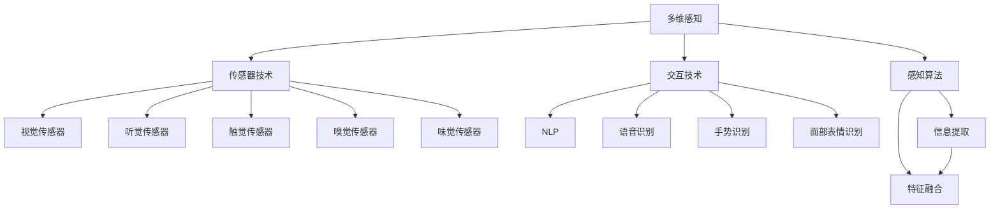
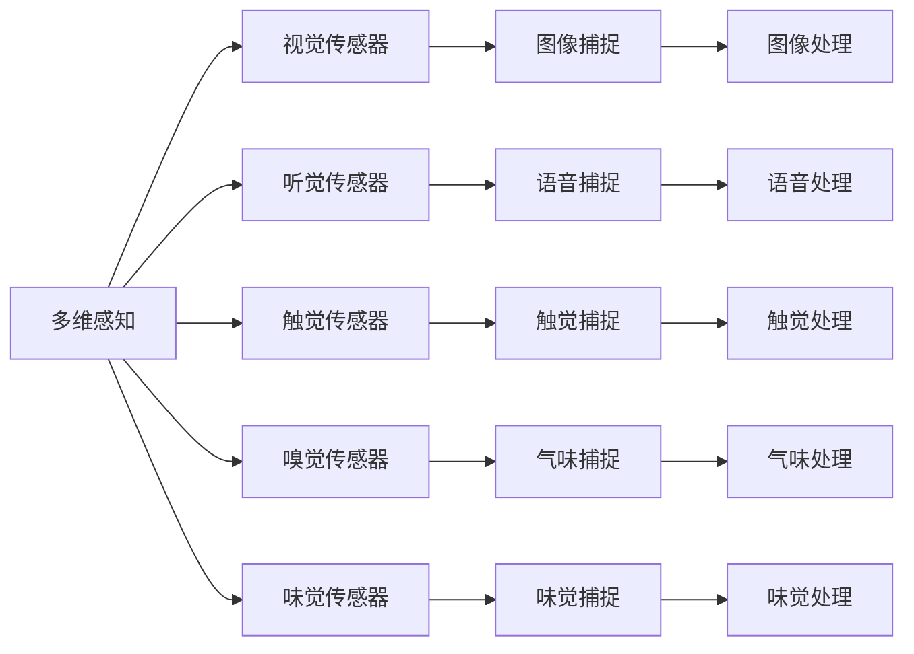
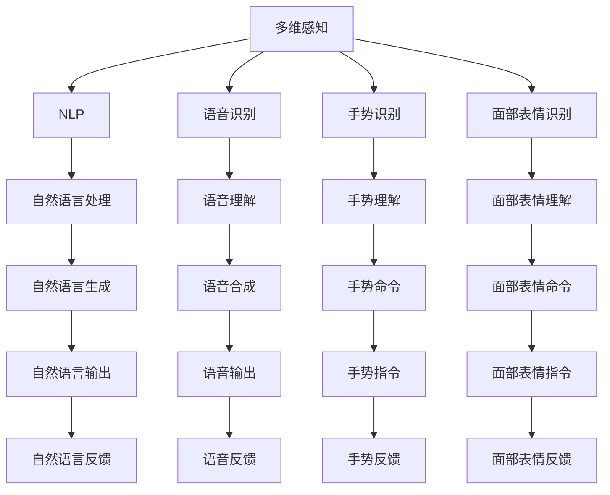

                 

## 1. 背景介绍

### 1.1 问题由来
随着人工智能技术的飞速发展，AI系统在处理信息、理解语义、执行任务等方面的能力已经达到了前所未有的水平。然而，尽管AI在技术上已经取得了显著的突破，但其在理解和创造体验方面仍然存在诸多局限。

人工智能在处理大量数据和执行复杂任务时表现出色，但当涉及到多维感知和多感官交互时，系统往往难以达到人类的直觉和直觉。这种多维感知能力对于设计符合人类直觉和期望的用户体验至关重要。例如，虚拟现实(VR)、增强现实(AR)、混合现实(MR)等新兴领域，对多维感知的需求尤为强烈。

### 1.2 问题核心关键点
多维感知是体验设计中的核心能力之一。多维感知包括视觉、听觉、触觉、嗅觉、味觉等多种感官的综合感知，旨在构建出符合人类直觉的全面、真实、立体的体验。这一能力对于设计出自然、互动、生动的用户体验至关重要。

多维感知不仅仅局限于简单的视觉展示，更包括对环境信息的综合理解和应用。例如，在虚拟现实中，用户不仅要看到虚拟场景，还要能够触摸到虚拟物体、听到虚拟环境中的声音、感受虚拟环境的温度变化等，才能真正融入虚拟世界。这种多维感知能力不仅涉及技术层面的创新，更需要对人类感知和行为模式的深入理解。

### 1.3 问题研究意义
研究多维感知对于构建具备高度互动性和沉浸感的AI体验具有重要意义：

1. **提升用户体验**：多维感知能力能够提升用户与系统的互动性，使AI体验更加自然、生动、真实。这对于提升用户满意度、增加用户黏性、增强用户留存率具有重要价值。
2. **拓宽应用场景**：具备多维感知能力的AI系统可以应用于更多领域，如虚拟现实、增强现实、混合现实、智能家居、教育娱乐等，为这些领域带来全新的可能性。
3. **促进技术创新**：多维感知能力推动了传感器技术、交互技术、感知算法等领域的创新，进一步提升了AI系统的感知能力和应用范围。
4. **增强社会效益**：具备多维感知能力的AI系统可以用于辅助特殊群体（如盲人、聋哑人等）进行信息获取，提升其生活质量，具有重要的社会价值。
5. **推动产业升级**：多维感知能力的应用可以加速数字化转型进程，提升各行业自动化、智能化水平，促进经济社会可持续发展。

## 2. 核心概念与联系

### 2.1 核心概念概述
为了更好地理解多维感知能力的构建，我们首先需要明确几个核心概念：

- **多维感知**：指对视觉、听觉、触觉、嗅觉、味觉等多感官的综合感知，旨在构建全面、真实、立体的体验。
- **传感器技术**：包括视觉传感器、听觉传感器、触觉传感器、嗅觉传感器、味觉传感器等多种类型，用于捕捉和处理不同感官的信息。
- **交互技术**：包括自然语言处理(NLP)、语音识别与合成、手势识别、面部表情识别等多种技术，用于实现用户与AI系统之间的互动。
- **感知算法**：用于对传感器捕捉到的多维数据进行分析和处理，提取有用的信息，并将其转换为系统的指令。
- **用户体验设计**：旨在通过多维感知能力，设计出自然、互动、生动的用户体验，满足用户需求。

这些概念之间的逻辑关系可以通过以下Mermaid流程图来展示：



这个流程图展示了大语言模型在构建多维感知能力时所需的关键技术和组件。其中，传感器技术负责捕捉多维信息，交互技术实现用户与系统的互动，感知算法进行信息处理和融合，最终输出符合用户期望的体验。

### 2.2 概念间的关系

这些核心概念之间存在着紧密的联系，形成了多维感知能力构建的完整生态系统。下面我们通过几个Mermaid流程图来展示这些概念之间的关系。

#### 2.2.1 多维感知与传感器技术的关系



这个流程图展示了多维感知与传感器技术之间的关系。传感器技术通过对不同的物理信息进行捕捉和处理，为多维感知提供数据支持。

#### 2.2.2 多维感知与交互技术的关系



这个流程图展示了多维感知与交互技术之间的关系。交互技术通过自然语言处理、语音识别、手势识别、面部表情识别等技术，实现用户与系统的互动。

#### 2.2.3 多维感知与感知算法的关系

```mermaid
graph LR
    A[多维感知] --> B[信息提取]
    B --> C[特征融合]
    C --> D[数据处理]
    D --> E[模式识别]
    E --> F[情境推理]
    A --> G[视觉感知]
    A --> H[听觉感知]
    A --> I[触觉感知]
    A --> J[嗅觉感知]
    A --> K[味觉感知]
    G --> L[图像特征提取]
    H --> M[语音特征提取]
    I --> N[触觉特征提取]
    J --> O[气味特征提取]
    K --> P[味觉特征提取]
    L --> Q[图像处理]
    M --> R[语音处理]
    N --> S[触觉处理]
    O --> T[气味处理]
    P --> U[味觉处理]
    Q --> V[情境理解]
    R --> W[情境应用]
    S --> X[情境推理]
    T --> Y[情境反馈]
    U --> Z[情境反馈]
    V --> AB[情境输出]
    W --> AC[情境输出]
    X --> AD[情境输出]
    Y --> AE[情境输出]
    Z --> AF[情境输出]
    AB --> AG[情境信息]
    AC --> AH[情境信息]
    AD --> AI[情境信息]
    AE --> AJ[情境信息]
    AF --> AK[情境信息]
    AG --> BH[信息传递]
    AH --> BI[信息传递]
    AI --> BJ[信息传递]
    AJ --> BK[信息传递]
    AK --> BL[信息传递]
    BH --> CM[信息处理]
    BI --> CN[信息处理]
    BJ --> CO[信息处理]
    BK --> CP[信息处理]
    BL --> CQ[信息处理]
    CM --> CR[信息融合]
    CN --> CS[信息融合]
    CO --> CT[信息融合]
    CP --> CU[信息融合]
    CQ --> CV[信息融合]
    CR --> CW[信息输出]
    CS --> CX[信息输出]
    CT --> CY[信息输出]
    CU --> CZ[信息输出]
    CV --> DA[信息输出]
    CW --> DB[信息输出]
    CX --> DC[信息输出]
    CY --> DD[信息输出]
    CZ --> DE[信息输出]
    DA --> DF[信息输出]
    DB --> DG[信息输出]
    DC --> DH[信息输出]
    DD --> DI[信息输出]
    DE --> DJ[信息输出]
    DF --> DK[信息输出]
    DG --> DL[信息输出]
    DH --> DM[信息输出]
    DI --> DN[信息输出]
    DJ --> DO[信息输出]
    DK --> DP[信息输出]
    DL --> DQ[信息输出]
    DM --> DR[信息输出]
    DN --> DS[信息输出]
    DO --> DT[信息输出]
    DP --> DU[信息输出]
    DQ --> DV[信息输出]
    DS --> DW[信息输出]
    DT --> DX[信息输出]
    DU --> DY[信息输出]
    DV --> DZ[信息输出]
    DW --> EH[信息输出]
    DX --> EI[信息输出]
    DY --> EJ[信息输出]
    DZ --> EA[信息输出]
    EH --> EB[信息处理]
    EI --> EC[信息处理]
    EJ --> ED[信息处理]
    EA --> EF[信息处理]
    EB --> EG[信息处理]
    EC --> EH[信息传递]
    ED --> EI[信息传递]
    EF --> EJ[信息传递]
    EG --> EK[信息传递]
    EI --> EL[信息传递]
    EJ --> EM[信息传递]
    EK --> EN[信息处理]
    EL --> EN[信息处理]
    EM --> EN[信息处理]
    EN --> EN[信息融合]
    EO --> EP[信息融合]
    EQ --> ER[信息融合]
    EP --> EH[信息输出]
    ER --> EI[信息输出]
    EH --> EJ[信息输出]
    EI --> EK[信息输出]
    EJ --> EL[信息输出]
    EK --> EM[信息输出]
    EL --> EH[信息输出]
    EM --> EI[信息输出]
    EN --> EO[信息输出]
    EO --> EP[信息输出]
    EQ --> ER[信息输出]
    ER --> EH[信息输出]
    EH --> EI[信息输出]
    EI --> EJ[信息输出]
    EJ --> EK[信息输出]
    EK --> EL[信息输出]
    EL --> EH[信息输出]
    EM --> EI[信息输出]
    EN --> EO[信息输出]
    EO --> EP[信息输出]
    EQ --> ER[信息输出]
    ER --> EH[信息输出]
    EH --> EI[信息输出]
    EI --> EJ[信息输出]
    EJ --> EK[信息输出]
    EK --> EL[信息输出]
    EL --> EH[信息输出]
    EM --> EI[信息输出]
    EN --> EO[信息输出]
    EO --> EP[信息输出]
    EQ --> ER[信息输出]
    ER --> EH[信息输出]
    EH --> EI[信息输出]
    EI --> EJ[信息输出]
    EJ --> EK[信息输出]
    EK --> EL[信息输出]
    EL --> EH[信息输出]
    EM --> EI[信息输出]
    EN --> EO[信息输出]
    EO --> EP[信息输出]
    EQ --> ER[信息输出]
    ER --> EH[信息输出]
    EH --> EI[信息输出]
    EI --> EJ[信息输出]
    EJ --> EK[信息输出]
    EK --> EL[信息输出]
    EL --> EH[信息输出]
    EM --> EI[信息输出]
    EN --> EO[信息输出]
    EO --> EP[信息输出]
    EQ --> ER[信息输出]
    ER --> EH[信息输出]
    EH --> EI[信息输出]
    EI --> EJ[信息输出]
    EJ --> EK[信息输出]
    EK --> EL[信息输出]
    EL --> EH[信息输出]
    EM --> EI[信息输出]
    EN --> EO[信息输出]
    EO --> EP[信息输出]
    EQ --> ER[信息输出]
    ER --> EH[信息输出]
    EH --> EI[信息输出]
    EI --> EJ[信息输出]
    EJ --> EK[信息输出]
    EK --> EL[信息输出]
    EL --> EH[信息输出]
    EM --> EI[信息输出]
    EN --> EO[信息输出]
    EO --> EP[信息输出]
    EQ --> ER[信息输出]
    ER --> EH[信息输出]
    EH --> EI[信息输出]
    EI --> EJ[信息输出]
    EJ --> EK[信息输出]
    EK --> EL[信息输出]
    EL --> EH[信息输出]
    EM --> EI[信息输出]
    EN --> EO[信息输出]
    EO --> EP[信息输出]
    EQ --> ER[信息输出]
    ER --> EH[信息输出]
    EH --> EI[信息输出]
    EI --> EJ[信息输出]
    EJ --> EK[信息输出]
    EK --> EL[信息输出]
    EL --> EH[信息输出]
    EM --> EI[信息输出]
    EN --> EO[信息输出]
    EO --> EP[信息输出]
    EQ --> ER[信息输出]
    ER --> EH[信息输出]
    EH --> EI[信息输出]
    EI --> EJ[信息输出]
    EJ --> EK[信息输出]
    EK --> EL[信息输出]
    EL --> EH[信息输出]
    EM --> EI[信息输出]
    EN --> EO[信息输出]
    EO --> EP[信息输出]
    EQ --> ER[信息输出]
    ER --> EH[信息输出]
    EH --> EI[信息输出]
    EI --> EJ[信息输出]
    EJ --> EK[信息输出]
    EK --> EL[信息输出]
    EL --> EH[信息输出]
    EM --> EI[信息输出]
    EN --> EO[信息输出]
    EO --> EP[信息输出]
    EQ --> ER[信息输出]
    ER --> EH[信息输出]
    EH --> EI[信息输出]
    EI --> EJ[信息输出]
    EJ --> EK[信息输出]
    EK --> EL[信息输出]
    EL --> EH[信息输出]
    EM --> EI[信息输出]
    EN --> EO[信息输出]
    EO --> EP[信息输出]
    EQ --> ER[信息输出]
    ER --> EH[信息输出]
    EH --> EI[信息输出]
    EI --> EJ[信息输出]
    EJ --> EK[信息输出]
    EK --> EL[信息输出]
    EL --> EH[信息输出]
    EM --> EI[信息输出]
    EN --> EO[信息输出]
    EO --> EP[信息输出]
    EQ --> ER[信息输出]
    ER --> EH[信息输出]
    EH --> EI[信息输出]
    EI --> EJ[信息输出]
    EJ --> EK[信息输出]
    EK --> EL[信息输出]
    EL --> EH[信息输出]
    EM --> EI[信息输出]
    EN --> EO[信息输出]
    EO --> EP[信息输出]
    EQ --> ER[信息输出]
    ER --> EH[信息输出]
    EH --> EI[信息输出]
    EI --> EJ[信息输出]
    EJ --> EK[信息输出]
    EK --> EL[信息输出]
    EL --> EH[信息输出]
    EM --> EI[信息输出]
    EN --> EO[信息输出]
    EO --> EP[信息输出]
    EQ --> ER[信息输出]
    ER --> EH[信息输出]
    EH --> EI[信息输出]
    EI --> EJ[信息输出]
    EJ --> EK[信息输出]
    EK --> EL[信息输出]
    EL --> EH[信息输出]
    EM --> EI[信息输出]
    EN --> EO[信息输出]
    EO --> EP[信息输出]
    EQ --> ER[信息输出]
    ER --> EH[信息输出]
    EH --> EI[信息输出]
    EI --> EJ[信息输出]
    EJ --> EK[信息输出]
    EK --> EL[信息输出]
    EL --> EH[信息输出]
    EM --> EI[信息输出]
    EN --> EO[信息输出]
    EO --> EP[信息输出]
    EQ --> ER[信息输出]
    ER --> EH[信息输出]
    EH --> EI[信息输出]
    EI --> EJ[信息输出]
    EJ --> EK[信息输出]
    EK --> EL[信息输出]
    EL --> EH[信息输出]
    EM --> EI[信息输出]
    EN --> EO[信息输出]
    EO --> EP[信息输出]
    EQ --> ER[信息输出]
    ER --> EH[信息输出]
    EH --> EI[信息输出]
    EI --> EJ[信息输出]
    EJ --> EK[信息输出]
    EK --> EL[信息输出]
    EL --> EH[信息输出]
    EM --> EI[信息输出]
    EN --> EO[信息输出]
    EO --> EP[信息输出]
    EQ --> ER[信息输出]
    ER --> EH[信息输出]
    EH --> EI[信息输出]
    EI --> EJ[信息输出]
    EJ --> EK[信息输出]
    EK --> EL[信息输出]
    EL --> EH[信息输出]
    EM --> EI[信息输出]
    EN --> EO[信息输出]
    EO --> EP[信息输出]
    EQ --> ER[信息输出]
    ER --> EH[信息输出]
    EH --> EI[信息输出]
    EI --> EJ[信息输出]
    EJ --> EK[信息输出]
    EK --> EL[信息输出]
    EL --> EH[信息输出]
    EM --> EI[信息输出]
    EN --> EO[信息输出]
    EO --> EP[信息输出]
    EQ --> ER[信息输出]
    ER --> EH[信息输出]
    EH --> EI[信息输出]
    EI --> EJ[信息输出]
    EJ --> EK[信息输出]
    EK --> EL[信息输出]
    EL --> EH[信息输出]
    EM --> EI[信息输出]
    EN --> EO[信息输出]
    EO --> EP[信息输出]
    EQ --> ER[信息输出]
    ER --> EH[信息输出]
    EH --> EI[信息输出]
    EI --> EJ[信息输出]
    EJ --> EK[信息输出]
    EK --> EL[信息输出]
    EL --> EH[信息输出]
    EM --> EI[信息输出]
    EN --> EO[信息输出]
    EO --> EP[信息输出]
    EQ --> ER[信息输出]
    ER --> EH[信息输出]
    EH --> EI[信息输出]
    EI --> EJ[信息输出]
    EJ --> EK[信息输出]
    EK --> EL[信息输出]
    EL --> EH[信息输出]
    EM --> EI[信息输出]
    EN --> EO[信息输出]
    EO --> EP[信息输出]
    EQ --> ER[信息输出]
    ER --> EH[信息输出]
    EH --> EI[信息输出]
    EI --> EJ[信息输出]
    EJ --> EK[信息输出]
    EK --> EL[信息输出]
    EL --> EH[信息输出]
    EM --> EI[信息输出]
    EN --> EO[信息输出]
    EO --> EP[信息输出]
    EQ --> ER[信息输出]
    ER --> EH[信息输出]
    EH --> EI[信息输出]
    EI --> EJ[信息输出]
    EJ --> EK[信息输出]
    EK --> EL[信息输出]
    EL --> EH[信息输出]
    EM --> EI[信息输出]
    EN --> EO[信息输出]
    EO --> EP[信息输出]
    EQ --> ER[信息输出]
    ER --> EH[信息输出]
    EH --> EI[信息输出]
    EI --> EJ[信息输出]
    EJ --> EK[信息输出]
    EK --> EL[信息输出]
    EL --> EH[信息输出]
    EM --> EI[信息输出]
    EN --> EO[信息输出]
    EO --> EP[信息输出]
    EQ --> ER[信息输出]
    ER --> EH[信息输出]
    EH --> EI[信息输出]
    EI --> EJ[信息输出]
    EJ --> EK[信息输出]
    EK --> EL[信息输出]
    EL --> EH[信息输出]
    EM --> EI[信息输出]
    EN --> EO[信息输出]
    EO --> EP[信息输出]
    EQ --> ER[信息输出]
    ER --> EH[信息输出]
    EH --> EI[信息输出]
    EI --> EJ[信息输出]
    EJ --> EK[信息输出]
    EK --> EL[信息输出]
    EL --> EH[信息输出]
    EM --> EI[信息输出]
    EN --> EO[信息输出]
    EO --> EP[信息输出]
    EQ --> ER[信息输出]
    ER --> EH[信息输出]
    EH --> EI[信息输出]
    EI --> EJ[信息输出]
    EJ --> EK[信息输出]
    EK --> EL[信息输出]
    EL --> EH[信息输出]
    EM --> EI[信息输出]
    EN --> EO[信息输出]
    EO --> EP[信息输出]
    EQ --> ER[信息输出]
    ER --> EH[信息输出]
    EH --> EI[信息输出]
    EI --> EJ[信息输出]
    EJ --> EK[信息输出]
    EK --> EL[信息输出]
    EL --> EH[信息输出]
    EM --> EI[信息输出]
    EN --> EO[信息输出]
    EO --> EP[信息输出]
    EQ --> ER[信息输出]
    ER --> EH[信息输出]
    EH --> EI[信息输出]
    EI --> EJ[信息输出]
    EJ --> EK[信息输出]
    EK --> EL[信息输出]
    EL --> EH[信息输出]
    EM --> EI[信息输出]
    EN --> EO[信息输出]
    EO --> EP[信息输出]
    EQ --> ER[信息输出]
    ER --> EH[信息输出]
    EH --> EI[信息输出]
    EI --> EJ[信息输出]
    EJ --> EK[信息输出]
    EK --> EL[信息输出]
    EL --> EH[信息输出]
    EM --> EI[信息输出]
    EN --> EO[信息输出]
    EO --> EP[信息输出]
    EQ --> ER[信息输出]
    ER --> EH[信息输出]
    EH --> EI[信息输出]
    EI --> EJ[信息输出]
    EJ --> EK[信息输出]
    EK --> EL[信息输出]
    EL --> EH[信息输出]
    EM --> EI[信息输出]
    EN --> EO[信息输出]
    EO --> EP[信息输出]
    EQ --> ER[信息输出]
    ER --> EH[信息输出]
    EH --> EI[信息输出]
    EI --> EJ[信息输出]
    EJ --> EK[信息输出]
    EK --> EL[信息输出]
    EL --> EH[信息输出]
    EM --> EI[信息输出]
    EN --> EO[信息输出]
    EO --> EP[信息输出]
    EQ --> ER[信息输出]
    ER --> EH[信息输出]
    EH --> EI[信息输出]
    EI --> EJ[信息输出]
    EJ --> EK[信息输出]
    EK --> EL[信息输出]
    EL --> EH[信息输出]
    EM --> EI[信息输出]
    EN --> EO[信息输出]
    EO --> EP[信息输出]
    EQ --> ER[信息输出]
    ER --> EH[信息输出]
    EH --> EI[信息输出]
    EI --> EJ[信息输出]
    EJ --> EK[信息输出]
    EK --> EL[信息输出]
    EL --> EH[信息输出]
    EM --> EI[信息输出]
    EN --> EO[信息输出]
    EO --> EP[信息输出]
    EQ --> ER[信息输出]
    ER --> EH[信息输出]
    EH --> EI[信息输出]
    EI --> EJ[信息输出]
    EJ --> EK[信息输出]
    EK --> EL[信息输出]
    EL --> EH[信息输出]
    EM --> EI[信息输出]
    EN --> EO[信息输出]
    EO --> EP[信息输出]
    EQ --> ER[信息输出]
    ER --> EH[信息输出]
    EH --> EI[信息输出]
    EI --> EJ[信息输出]
    EJ --> EK[信息输出]
    EK --> EL[信息输出]
    EL --> EH[信息输出]
    EM --> EI[信息输出]
    EN --> EO[信息输出]
    EO --> EP[信息输出]
    EQ --> ER[信息输出]
    ER --> EH[信息输出]
    EH --> EI[信息输出]
    EI --> EJ[信息输出]
    EJ --> EK[信息输出]
    EK --> EL[信息输出]
    EL --> EH[

