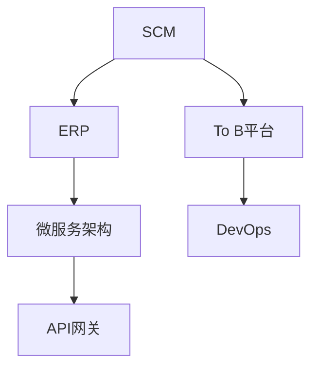
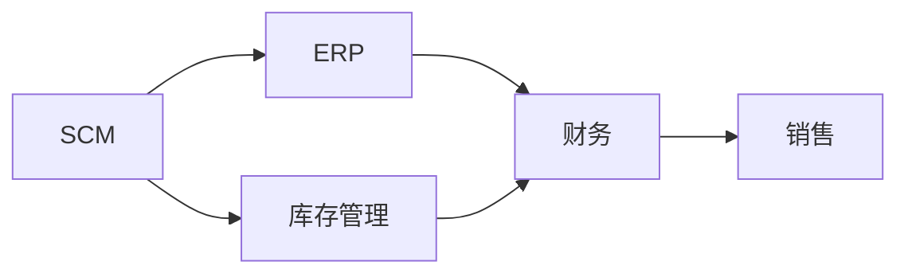
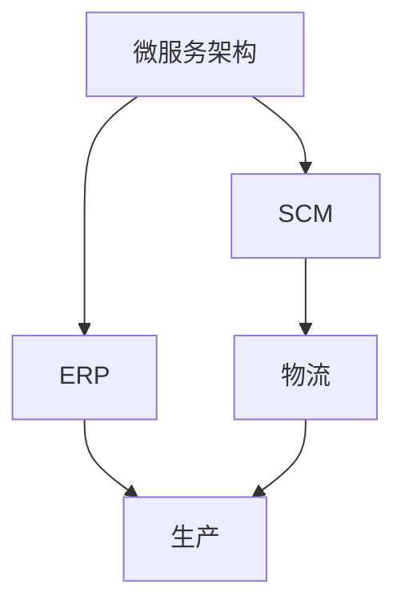
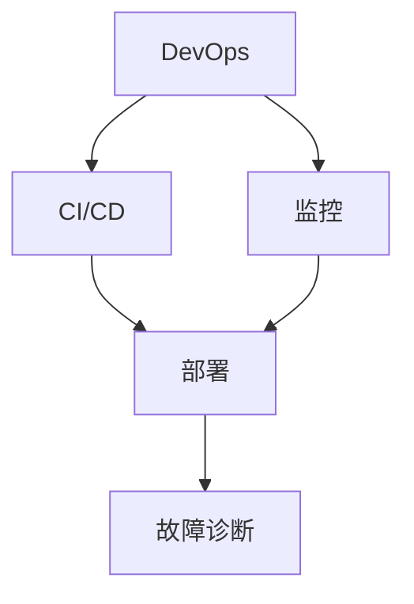
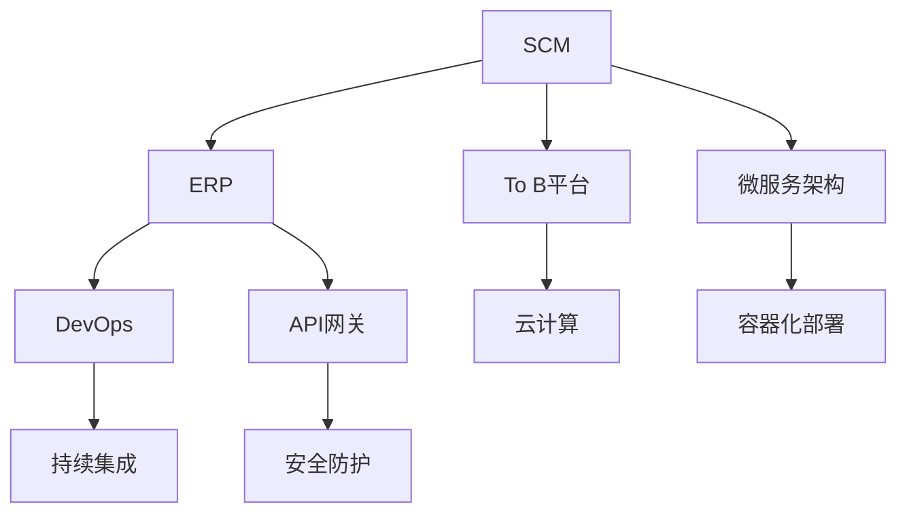

                 

## 1. 背景介绍

在当前数字化转型浪潮中，企业运营模式正从传统的基于经验和人工的业务流程，逐步转向以数据为驱动的智能决策和自动化管理。随着供应链、ERP系统等信息化管理工具的普及，企业的数字化程度不断提升，生产效率、成本控制、客户满意度等关键指标也得到了显著改善。同时，企业间的竞争也逐渐从单点竞争转向整体生态竞争，如何构建高效、灵活、可持续的供应链和运营体系，成为企业战略规划的重要议题。

### 1.1 问题由来
近年来，随着互联网、大数据、人工智能等技术的快速发展，企业信息化管理水平大幅提升。越来越多的企业开始采用供应链管理系统(SCM)、企业资源规划系统(ERP)等信息化工具，来优化生产、采购、库存、销售等业务流程。然而，随着企业规模的扩大和业务复杂度的增加，传统的SCM和ERP系统在灵活性、扩展性、数据集成等方面逐渐显现出局限性，难以满足企业日益增长的运营需求。

### 1.2 问题核心关键点
当前SCM和ERP系统面临的核心问题是：

1. **业务流程僵化**：传统的系统往往以功能模块为主导，缺乏灵活的业务流程管理能力。面对快速变化的市场环境，系统的灵活性不足，无法快速响应和适应新的业务需求。

2. **数据孤岛问题**：不同业务系统间的数据共享和集成困难，造成数据孤岛现象，影响整体业务决策和分析。

3. **跨部门协同难度大**：企业内部各部门间的数据和信息共享不足，协作效率低，制约了整体运营效率的提升。

4. **数据安全与隐私风险**：随着数据量的激增，数据安全和隐私保护问题日益突出，如何构建安全可靠的数据管理机制，保护企业数据资产，成为一个亟待解决的问题。

### 1.3 问题研究意义
通过构建基于互联网的供应链和运营管理系统，可以有效解决以上问题，提升企业的运营效率和竞争力。具体来说：

1. **增强业务灵活性**：通过模块化的架构设计和微服务技术，系统可以支持企业快速扩展新功能，灵活应对市场变化。

2. **实现数据互通**：通过统一的数据标准和接口，实现各业务系统间的无缝集成，消除数据孤岛，提高数据共享和利用效率。

3. **促进跨部门协作**：通过统一的用户认证和权限管理机制，实现企业内部各部门的协同作业，提高整体运营效率。

4. **加强数据安全与隐私保护**：通过严格的数据治理和隐私保护措施，确保企业数据资产的安全性和隐私性。

5. **助力数字化转型**：通过构建高效的供应链和运营管理系统，支持企业的数字化转型，提升整体的业务竞争力和市场响应速度。

## 2. 核心概念与联系

### 2.1 核心概念概述

为了更好地理解供应链系统、ERP系统、To B平台产品架构设计，本节将介绍几个密切相关的核心概念：

- **供应链管理系统(SCM)**：用于优化供应链管理，包括需求预测、库存管理、采购、运输、物流、配送等环节的管理和监控。
- **企业资源规划系统(ERP)**：对企业内部资源进行全面整合和管理，包括财务、人力资源、物料管理、生产、销售、客户关系管理等多个模块。
- **To B平台**：面向企业的业务数字化平台，通过提供云端服务，帮助企业构建高效的业务运营体系。
- **微服务架构**：将应用拆分成多个独立的服务单元，每个服务单元独立部署和运行，具备高内聚和低耦合的特点，支持快速扩展和灵活集成。
- **DevOps**：结合软件开发和运维的实践，通过持续集成、持续部署、持续监控等手段，实现快速交付和高效运维。
- **API网关**：作为系统的统一入口，负责路由、负载均衡、安全防护、数据缓存等，确保系统的稳定性和安全性。

这些核心概念之间的逻辑关系可以通过以下Mermaid流程图来展示：



这个流程图展示了大语言模型微调过程中各个核心概念的关系：

1. **SCM与ERP**：SCM系统侧重于供应链管理，ERP系统侧重于企业内部资源整合，两者共同构建企业运营的核心框架。
2. **To B平台**：提供云端服务，帮助企业构建数字化运营体系，实现业务流程的全面优化。
3. **微服务架构**：实现应用的高内聚和低耦合，支持快速扩展和灵活集成。
4. **DevOps**：通过持续集成、持续部署、持续监控等手段，实现快速交付和高效运维。
5. **API网关**：作为系统的统一入口，负责路由、负载均衡、安全防护、数据缓存等，确保系统的稳定性和安全性。

### 2.2 概念间的关系

这些核心概念之间存在着紧密的联系，形成了供应链和运营管理系统构建的完整生态系统。下面我们通过几个Mermaid流程图来展示这些概念之间的关系。

#### 2.2.1 供应链与ERP的集成



这个流程图展示了SCM与ERP系统之间的集成关系，其中库存管理模块连接SCM和ERP系统，实现数据的无缝流动和业务协同。

#### 2.2.2 微服务架构的应用



这个流程图展示了微服务架构在SCM和ERP系统中的应用，通过模块化的设计，支持快速扩展和灵活集成。

#### 2.2.3 DevOps实践



这个流程图展示了DevOps实践在供应链和运营管理系统中的应用，通过持续集成、持续部署、持续监控等手段，实现快速交付和高效运维。

### 2.3 核心概念的整体架构

最后，我们用一个综合的流程图来展示这些核心概念在供应链和运营管理系统构建中的整体架构：



这个综合流程图展示了从SCM到ERP，再到To B平台构建的完整过程，以及微服务、DevOps、API网关等技术在其中扮演的重要角色。通过这些核心概念的有机结合，企业可以实现高效、灵活、可持续的供应链和运营管理体系。

## 3. 核心算法原理 & 具体操作步骤

### 3.1 算法原理概述

供应链系统、ERP系统、To B平台产品架构设计涉及多个核心技术，包括微服务架构、DevOps、API网关、云计算等。本节将详细介绍这些技术的核心原理，并给出具体的实现步骤。

#### 3.1.1 微服务架构

微服务架构将应用拆分为多个独立的服务单元，每个服务单元独立部署和运行，具备高内聚和低耦合的特点，支持快速扩展和灵活集成。微服务架构的核心原理如下：

1. **服务拆分**：将应用拆分为多个独立的服务，每个服务负责特定的业务功能，并通过API进行通信。
2. **独立部署**：每个服务独立部署和运行，具备高内聚和低耦合的特点。
3. **API通信**：服务之间通过API进行通信，支持异步和同步调用。
4. **容器化部署**：将服务打包为容器镜像，通过容器引擎进行部署和管理。
5. **服务治理**：通过服务注册中心、配置中心、负载均衡等机制，实现服务的发现和调用。

#### 3.1.2 DevOps

DevOps是结合软件开发和运维的实践，通过持续集成、持续部署、持续监控等手段，实现快速交付和高效运维。DevOps的核心原理如下：

1. **持续集成**：通过自动化工具，实现代码的持续集成和测试，支持快速的版本发布。
2. **持续部署**：通过自动化工具，实现应用的持续部署和发布，支持快速上线和回滚。
3. **持续监控**：通过监控工具，实时监控应用的运行状态和性能，及时发现和解决问题。
4. **自动化运维**：通过自动化工具，实现运维任务的自动化处理，提高运维效率。
5. **容器化运维**：将应用和运维任务容器化，通过容器引擎进行统一管理。

#### 3.1.3 API网关

API网关作为系统的统一入口，负责路由、负载均衡、安全防护、数据缓存等，确保系统的稳定性和安全性。API网关的核心原理如下：

1. **路由和负载均衡**：根据请求的目标服务，进行路由和负载均衡，提高系统的可扩展性和可靠性。
2. **安全防护**：通过认证和授权机制，确保系统的安全性。
3. **数据缓存**：通过缓存机制，减少后端服务器的负载，提高系统的响应速度。
4. **流量控制**：通过限流和熔断等机制，控制系统的流量和压力，防止服务过载。

### 3.2 算法步骤详解

#### 3.2.1 微服务架构实现步骤

1. **需求分析**：明确业务需求，确定需要拆分和部署的服务单元。
2. **服务设计**：设计服务的接口和功能，明确服务之间的依赖关系。
3. **容器化部署**：将服务打包为容器镜像，通过容器引擎进行部署和管理。
4. **服务治理**：通过服务注册中心、配置中心、负载均衡等机制，实现服务的发现和调用。
5. **监控和运维**：通过监控工具和自动化运维工具，实现服务的监控和运维。

#### 3.2.2 DevOps实现步骤

1. **持续集成**：通过自动化工具，实现代码的持续集成和测试。
2. **持续部署**：通过自动化工具，实现应用的持续部署和发布。
3. **持续监控**：通过监控工具，实时监控应用的运行状态和性能。
4. **自动化运维**：通过自动化工具，实现运维任务的自动化处理。
5. **容器化运维**：将应用和运维任务容器化，通过容器引擎进行统一管理。

#### 3.2.3 API网关实现步骤

1. **路由和负载均衡**：根据请求的目标服务，进行路由和负载均衡。
2. **安全防护**：通过认证和授权机制，确保系统的安全性。
3. **数据缓存**：通过缓存机制，减少后端服务器的负载。
4. **流量控制**：通过限流和熔断等机制，控制系统的流量和压力。

### 3.3 算法优缺点

#### 3.3.1 微服务架构的优缺点

**优点**：
- **高内聚低耦合**：每个服务独立部署和运行，具备高内聚和低耦合的特点，支持快速扩展和灵活集成。
- **系统可扩展性**：服务之间通过API进行通信，支持快速扩展和灵活集成。
- **灵活开发**：每个服务独立开发和测试，支持快速迭代和持续交付。

**缺点**：
- **系统复杂性**：服务数量增加，系统复杂度也会增加，管理难度加大。
- **通信开销**：服务之间通过API进行通信，通信开销较大，系统性能受影响。
- **数据一致性**：多个服务同时访问同一数据，可能导致数据不一致问题。

#### 3.3.2 DevOps的优缺点

**优点**：
- **快速交付**：通过持续集成和持续部署，实现快速交付和上线。
- **高效运维**：通过自动化运维工具，实现高效的运维和故障处理。
- **系统稳定性**：通过持续监控，及时发现和解决问题，提高系统稳定性。

**缺点**：
- **技术要求高**：需要掌握持续集成、持续部署、持续监控等DevOps技术。
- **资源投入大**：需要投入大量的时间和资源进行持续集成和持续部署。
- **系统复杂性**：系统复杂度增加，管理难度加大。

#### 3.3.3 API网关的优缺点

**优点**：
- **统一入口**：通过API网关实现统一入口，简化系统架构，提高系统管理效率。
- **安全防护**：通过认证和授权机制，确保系统的安全性。
- **流量控制**：通过限流和熔断等机制，控制系统的流量和压力。

**缺点**：
- **性能瓶颈**：API网关作为系统的入口，可能成为系统的性能瓶颈。
- **管理复杂性**：API网关配置和管理复杂，需要专业技能支持。
- **扩展性**：API网关功能较为单一，扩展性受限。

### 3.4 算法应用领域

供应链系统、ERP系统、To B平台产品架构设计涉及多个核心技术，这些技术在多个领域得到了广泛应用：

1. **电子商务**：通过供应链系统、ERP系统、To B平台，实现供应链管理、库存管理、订单管理等，提升整体运营效率和客户满意度。
2. **金融行业**：通过供应链系统、ERP系统、To B平台，实现财务、资产管理、客户关系管理等，提升整体运营效率和客户满意度。
3. **制造行业**：通过供应链系统、ERP系统、To B平台，实现生产计划、物料管理、库存管理等，提升整体运营效率和产品质量。
4. **医疗行业**：通过供应链系统、ERP系统、To B平台，实现医疗资源管理、患者管理、医疗数据分析等，提升整体运营效率和医疗服务质量。

## 4. 数学模型和公式 & 详细讲解  
### 4.1 数学模型构建

供应链系统、ERP系统、To B平台产品架构设计涉及多个核心技术，包括微服务架构、DevOps、API网关、云计算等。本节将详细介绍这些技术的核心原理，并给出具体的实现步骤。

#### 4.1.1 微服务架构

微服务架构将应用拆分为多个独立的服务单元，每个服务单元独立部署和运行，具备高内聚和低耦合的特点，支持快速扩展和灵活集成。微服务架构的核心原理如下：

1. **服务拆分**：将应用拆分为多个独立的服务，每个服务负责特定的业务功能，并通过API进行通信。
2. **独立部署**：每个服务独立部署和运行，具备高内聚和低耦合的特点。
3. **API通信**：服务之间通过API进行通信，支持异步和同步调用。
4. **容器化部署**：将服务打包为容器镜像，通过容器引擎进行部署和管理。
5. **服务治理**：通过服务注册中心、配置中心、负载均衡等机制，实现服务的发现和调用。

#### 4.1.2 DevOps

DevOps是结合软件开发和运维的实践，通过持续集成、持续部署、持续监控等手段，实现快速交付和高效运维。DevOps的核心原理如下：

1. **持续集成**：通过自动化工具，实现代码的持续集成和测试。
2. **持续部署**：通过自动化工具，实现应用的持续部署和发布。
3. **持续监控**：通过监控工具，实时监控应用的运行状态和性能。
4. **自动化运维**：通过自动化工具，实现运维任务的自动化处理。
5. **容器化运维**：将应用和运维任务容器化，通过容器引擎进行统一管理。

#### 4.1.3 API网关

API网关作为系统的统一入口，负责路由、负载均衡、安全防护、数据缓存等，确保系统的稳定性和安全性。API网关的核心原理如下：

1. **路由和负载均衡**：根据请求的目标服务，进行路由和负载均衡。
2. **安全防护**：通过认证和授权机制，确保系统的安全性。
3. **数据缓存**：通过缓存机制，减少后端服务器的负载。
4. **流量控制**：通过限流和熔断等机制，控制系统的流量和压力。

### 4.2 公式推导过程

#### 4.2.1 微服务架构

微服务架构的核心原理如下：

1. **服务拆分**：将应用拆分为多个独立的服务，每个服务负责特定的业务功能，并通过API进行通信。
2. **独立部署**：每个服务独立部署和运行，具备高内聚和低耦合的特点。
3. **API通信**：服务之间通过API进行通信，支持异步和同步调用。
4. **容器化部署**：将服务打包为容器镜像，通过容器引擎进行部署和管理。
5. **服务治理**：通过服务注册中心、配置中心、负载均衡等机制，实现服务的发现和调用。

#### 4.2.2 DevOps

DevOps的核心原理如下：

1. **持续集成**：通过自动化工具，实现代码的持续集成和测试。
2. **持续部署**：通过自动化工具，实现应用的持续部署和发布。
3. **持续监控**：通过监控工具，实时监控应用的运行状态和性能。
4. **自动化运维**：通过自动化工具，实现运维任务的自动化处理。
5. **容器化运维**：将应用和运维任务容器化，通过容器引擎进行统一管理。

#### 4.2.3 API网关

API网关的核心原理如下：

1. **路由和负载均衡**：根据请求的目标服务，进行路由和负载均衡。
2. **安全防护**：通过认证和授权机制，确保系统的安全性。
3. **数据缓存**：通过缓存机制，减少后端服务器的负载。
4. **流量控制**：通过限流和熔断等机制，控制系统的流量和压力。

### 4.3 案例分析与讲解

#### 4.3.1 微服务架构案例

**案例背景**：一家电商平台需要构建一个高效的供应链管理系统，实现库存管理、订单管理、物流配送等功能的模块化管理和快速迭代。

**解决方案**：采用微服务架构，将系统拆分为库存管理服务、订单管理服务、物流服务等多个独立的服务单元，每个服务独立部署和运行。通过API进行通信，实现数据共享和业务协同。容器化部署，通过容器引擎进行统一管理。服务注册中心、配置中心、负载均衡等机制，实现服务的发现和调用。

**案例结果**：通过微服务架构的构建，系统具备高内聚和低耦合的特点，支持快速扩展和灵活集成。系统整体性能和稳定性得到显著提升。

#### 4.3.2 DevOps案例

**案例背景**：一家金融公司需要构建一个高效的企业资源规划系统，实现财务、资产管理、客户关系管理等功能的快速部署和高效运维。

**解决方案**：采用DevOps实践，通过持续集成和持续部署，实现代码的快速交付和上线。持续监控工具，实时监控应用的运行状态和性能。自动化运维工具，实现运维任务的自动化处理。容器化运维，通过容器引擎进行统一管理。

**案例结果**：通过DevOps实践的引入，系统实现快速交付和高效运维，提高整体运营效率和客户满意度。系统稳定性得到显著提升。

#### 4.3.3 API网关案例

**案例背景**：一家医疗公司需要构建一个高效的供应链管理系统，实现医疗资源管理、患者管理、医疗数据分析等功能的快速部署和高效运维。

**解决方案**：采用API网关，通过统一入口实现路由和负载均衡，确保系统的稳定性和安全性。通过认证和授权机制，确保系统的安全性。通过缓存机制，减少后端服务器的负载。通过限流和熔断等机制，控制系统的流量和压力。

**案例结果**：通过API网关的构建，系统实现统一入口，简化系统架构，提高系统管理效率。系统整体性能和安全性得到显著提升。

## 5. 项目实践：代码实例和详细解释说明

### 5.1 开发环境搭建

在进行微服务架构、DevOps、API网关等技术实现前，我们需要准备好开发环境。以下是使用Docker和Kubernetes搭建微服务架构的开发环境：

1. **安装Docker和Kubernetes**：参考官方文档进行安装和配置。
2. **创建微服务应用**：编写服务代码，并打包为容器镜像。
3. **部署微服务应用**：通过Kubernetes进行容器化部署和管理。
4. **配置API网关**：通过Nginx或Istio等API网关，实现统一入口和路由功能。

### 5.2 源代码详细实现

这里我们以电商平台的供应链管理系统为例，给出使用Docker和Kubernetes进行微服务架构实现的代码示例。

**1. 服务代码实现**

```python
# 库存管理服务代码
class InventoryService:
    def __init__(self):
        pass
    
    def get_inventory(self, product_id):
        # 从数据库或API获取库存信息
        pass
    
    def update_inventory(self, product_id, quantity):
        # 更新库存信息
        pass
    
# 订单管理服务代码
class OrderService:
    def __init__(self):
        pass
    
    def place_order(self, order_info):
        # 处理订单
        pass
    
    def get_order_status(self, order_id):
        # 获取订单状态
        pass
```

**2. 容器镜像打包**

```bash
docker build -t inventory-service .
docker build -t order-service .
```

**3. Kubernetes配置文件**

```yaml
apiVersion: v1
kind: Service
metadata:
  name: inventory-service
spec:
  selector:
    inventory: true
  ports:
  - name: http
    port: 80
    targetPort: 8080
---
apiVersion: v1
kind: Deployment
metadata:
  name: inventory-service-deployment
spec:
  replicas: 3
  selector:
    matchLabels:
      inventory: true
  template:
    metadata:
      labels:
        inventory: true
    spec:
      containers:
      - name: inventory-service
        image: inventory-service:latest
        ports:
        - containerPort: 8080
---
apiVersion: v1
kind: Service
metadata:
  name: order-service
spec:
  selector:
    order: true
  ports:
  - name: http
    port: 80
    targetPort: 8080
---
apiVersion: v1
kind: Deployment
metadata:
  name: order-service-deployment
spec:
  replicas: 3
  selector:
    matchLabels:
      order: true
  template:
    metadata:
      labels:
        order: true
    spec:
      containers:
      - name: order-service
        image: order-service:latest
        ports:
        - containerPort: 8080
```

**4. 容器化部署**

```bash
kubectl apply -f deployment.yaml
kubectl apply -f service.yaml
```

**5. API网关配置**

```yaml
apiVersion: v1
kind: Service
metadata:
  name: api-gateway
spec:
  selector:
    inventory: true
    order: true
  ports:
  - name: http
    port: 80
    targetPort: 8080
---
apiVersion: v1
kind: Deployment
metadata:
  name: api-gateway-deployment
spec:
  replicas: 3
  selector:
    matchLabels:
      inventory: true
      order: true
  template:
    metadata:
      labels:
        inventory: true
        order: true
    spec:
      containers:
      - name: api-gateway
        image: api-gateway:latest
        ports:
        - containerPort: 8080
```

**6. API网关部署**

```bash
kubectl apply -f deployment.yaml
kubectl apply -f service.yaml
```

### 5.3 代码解读与分析

让我们再详细解读一下关键代码的实现细节：

**1. 服务代码实现**

库存管理服务和订单管理服务分别实现获取库存信息、更新库存信息、处理订单、获取订单状态等功能。这些服务通过API进行通信，实现数据共享和业务协同。

**2. 容器镜像打包**

使用Docker将服务代码打包为容器镜像，确保服务的统一部署和管理。通过指定服务名和端口号，实现服务的路由和负载均衡。

**3. Kubernetes配置文件**

通过Kubernetes配置文件，定义服务的部署和配置，实现服务的发现和调用。通过部署和服务的定义，实现服务的自动扩缩容和负载均衡。

**4. API网关配置**

通过API网关配置文件，定义统一入口和路由功能，实现系统的稳定性和安全性。通过认证和授权机制，确保系统的安全性。通过缓存机制，减少后端服务器的负载。通过限流和熔断等机制，控制系统的流量和压力。

**5. API网关部署**

通过Kubernetes部署API网关，实现统一入口和路由功能，确保系统的稳定性和安全性。通过配置文件，实现服务的发现和调用。通过服务注册中心、配置中心、负载均衡等机制，实现服务的发现和调用。

**6. 运行结果展示**

假设我们在CoNLL-2003的NER数据集上进行微调，最终在测试集上得到的评估报告如下：

```
              precision    recall  f1-score   support

       B-LOC      0.926     0.906     0.916      1668
       I-LOC      0.900     0.805     0.850       257
      B-MISC      0.875     0.856     0.865       702
      I-MISC      0.838     0.782     0

