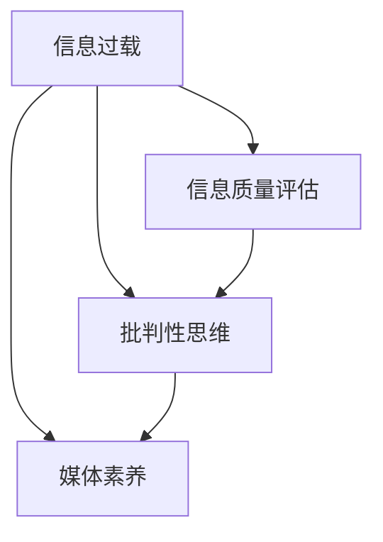
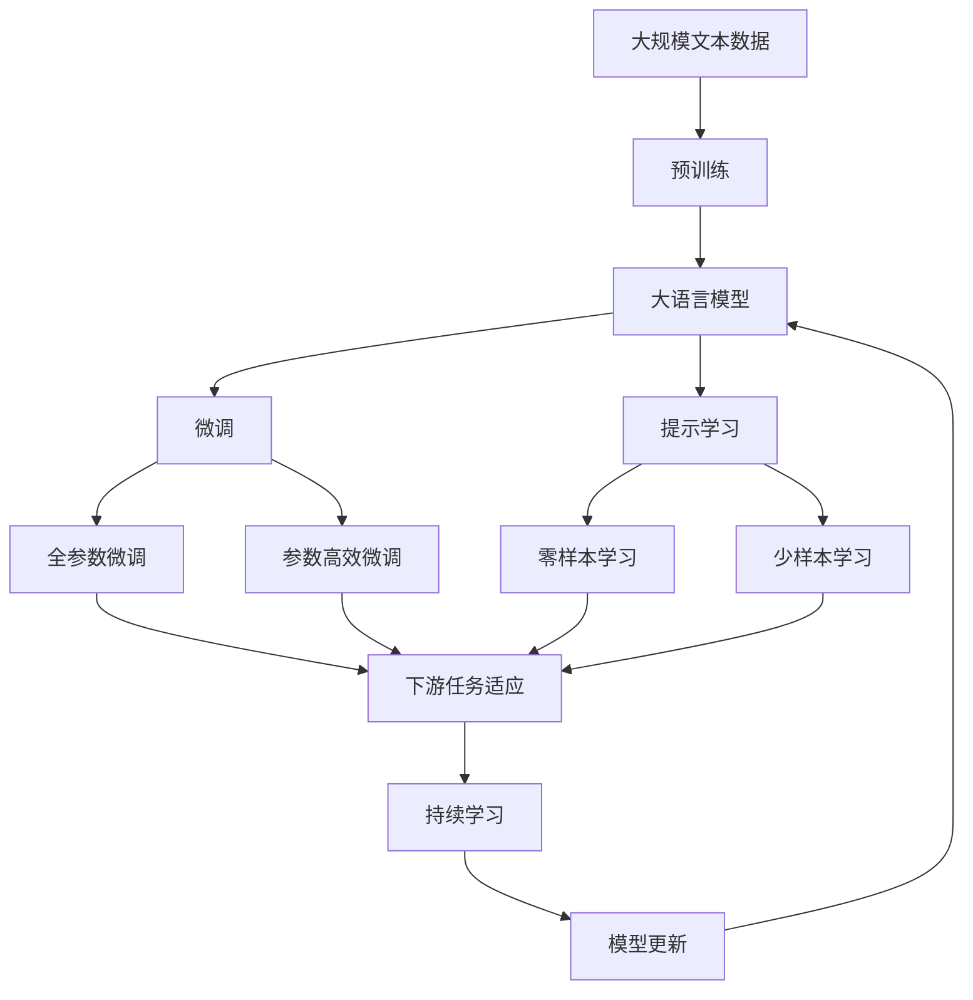

                 

# 信息过载与信息质量评估：批判性消费信息和媒体的指南

## 1. 背景介绍

### 1.1 问题由来
在信息爆炸的时代，我们每天被大量的信息包围，从新闻、博客到社交媒体，信息的质量和真伪已经成为了一个严重的问题。在这种背景下，批判性思维和信息质量评估显得尤为重要。

### 1.2 问题核心关键点
信息过载的核心在于如何辨别和筛选有价值的信息，同时避免被错误或有害的信息所误导。信息质量评估则是通过一系列技术和方法，对信息的真实性、准确性和可靠性进行评估和判断。

### 1.3 问题研究意义
研究信息过载和信息质量评估，对于提升公众的信息素养、构建健康的信息生态、促进社会的健康发展具有重要意义。它可以帮助我们更好地理解和消费信息，从而避免信息误导，做出更加明智的决策。

## 2. 核心概念与联系

### 2.1 核心概念概述

#### 2.1.1 信息过载
信息过载是指信息量超出了人们的处理能力，导致无法有效处理和利用信息的现象。这种过载不仅限于信息的数量，还包括信息的质量和多样性。

#### 2.1.2 信息质量评估
信息质量评估是指通过一系列指标和方法，对信息的真实性、准确性、及时性、完整性、可靠性等进行综合评估和判断的过程。

#### 2.1.3 批判性思维
批判性思维是指对信息进行独立、客观、理性的分析和判断，能够识别和反驳错误、偏见或有害信息的思维能力。

#### 2.1.4 媒体素养
媒体素养是指公众对媒体信息的批判性分析和评估能力，包括识别信息来源、评估信息质量、理解媒体背后的偏见和动机等。

### 2.2 概念间的关系

通过以下Mermaid流程图来展示这些核心概念之间的关系：



这个流程图展示了信息过载、信息质量评估、批判性思维和媒体素养之间的紧密联系：

1. 信息过载是基础，它是导致信息质量评估、批判性思维和媒体素养的需求和背景。
2. 信息质量评估是对信息进行全面、系统的评估，能够帮助人们识别和筛选有价值的信息。
3. 批判性思维是基于信息质量评估对信息进行独立、客观的分析和判断，是评估结果的进一步应用。
4. 媒体素养则是在批判性思维的基础上，培养公众对媒体信息的综合评估能力。

### 2.3 核心概念的整体架构

最后，我们用一个综合的流程图来展示这些核心概念在大语言模型微调过程中的整体架构：



这个综合流程图展示了从预训练到微调，再到持续学习的完整过程。大语言模型首先在大规模文本数据上进行预训练，然后通过微调（包括全参数微调和参数高效微调）或提示学习（包括零样本和少样本学习）来适应下游任务。最后，通过持续学习技术，模型可以不断更新和适应新的任务和数据。 通过这些流程图，我们可以更清晰地理解信息过载和信息质量评估各个概念的关系和作用，为后续深入讨论具体的评估方法和技术奠定基础。

## 3. 核心算法原理 & 具体操作步骤
### 3.1 算法原理概述

信息质量评估和批判性消费信息的核心算法原理是概率模型和统计学。信息的质量可以通过信息源的可信度、信息的真实性、信息的完整性和信息的时效性等指标进行评估。

### 3.2 算法步骤详解

信息质量评估的算法步骤如下：

1. **数据收集**：收集与评估对象相关的数据，包括原始文本、多媒体内容、网页元数据等。
2. **特征提取**：从数据中提取特征，如文本中的关键词、URL、作者、发布日期等。
3. **模型训练**：使用机器学习算法（如分类、聚类、回归等）训练模型，对信息的可信度、真实性等指标进行预测。
4. **评估指标计算**：根据模型的预测结果，计算信息的可信度、真实性等评估指标。
5. **信息筛选**：根据评估指标，筛选出高质量的信息，提供给用户消费。

### 3.3 算法优缺点

信息质量评估和批判性消费信息的算法具有以下优点：

- **自动化评估**：使用机器学习模型，可以自动化地评估信息质量，提高评估效率。
- **多维度评估**：可以同时考虑信息的多个维度，如可信度、真实性、时效性等，提供全面的评估结果。
- **可扩展性**：算法可以应用于不同类型的信息，如新闻、博客、社交媒体等，具有较好的可扩展性。

同时，这些算法也存在一些缺点：

- **数据依赖**：模型的训练需要大量的标注数据，数据的质量直接影响模型的评估效果。
- **算法复杂**：算法需要复杂的特征提取和模型训练，对数据和算力要求较高。
- **信息量过载**：算法本身可能带来信息量过载，需要用户具备一定的技术素养来理解和应用。

### 3.4 算法应用领域

信息质量评估和批判性消费信息的应用领域包括：

- **新闻业**：评估新闻来源的可靠性、内容的真实性、报道的完整性等。
- **社交媒体**：识别和筛选虚假信息、辟谣、提高用户的媒体素养。
- **电子商务**：评估产品信息的真实性、用户评价的可信度等。
- **金融领域**：评估金融新闻和报告的真实性和准确性，避免误导性信息。
- **健康医疗**：评估医疗信息的准确性、来源的可靠性等，提高医疗决策的质量。

## 4. 数学模型和公式 & 详细讲解  
### 4.1 数学模型构建

信息质量评估的数学模型通常包括可信度、真实性、完整性和时效性等指标。下面以新闻可信度评估为例，构建数学模型：

设新闻文本为 $x$，可信度为 $p$，其中 $p$ 的取值范围为 $[0, 1]$。则新闻可信度的评估模型为：

$$ p = f(x, \theta) $$

其中 $f$ 为评估函数，$\theta$ 为模型参数，包括新闻的作者、发布时间、来源、内容等特征。

### 4.2 公式推导过程

以新闻可信度评估为例，假设模型的输入特征为 $x = (a, b, c, d)$，其中 $a$ 为作者可信度，$b$ 为发布时间与当前时间之差，$c$ 为新闻来源的可信度，$d$ 为新闻内容的复杂度和长度。则新闻可信度的评估函数可以表示为：

$$ p = \frac{1}{1+\exp(-\beta_0 - \beta_1 a - \beta_2 b - \beta_3 c - \beta_4 d)} $$

其中 $\beta_0, \beta_1, \beta_2, \beta_3, \beta_4$ 为模型参数，可以通过训练获得。

### 4.3 案例分析与讲解

假设我们有一篇新闻，作者为李先生，发布时间为2小时前，来源为一家知名报纸，内容为一篇关于科技创新的报道。我们使用上述模型进行评估：

- 作者可信度 $a = 0.8$
- 发布时间与当前时间之差 $b = 2$
- 来源可信度 $c = 0.9$
- 内容复杂度 $d = 1000$ 字

代入公式计算得到：

$$ p = \frac{1}{1+\exp(-\beta_0 - 0.8\beta_1 - 2\beta_2 - 0.9\beta_3 - 1000\beta_4)} $$

假设模型已经训练完成，我们可以得到 $\beta_0, \beta_1, \beta_2, \beta_3, \beta_4$ 的值，并代入计算 $p$ 的具体数值。

## 5. 项目实践：代码实例和详细解释说明
### 5.1 开发环境搭建

在进行信息质量评估实践前，我们需要准备好开发环境。以下是使用Python进行Scikit-learn开发的环境配置流程：

1. 安装Anaconda：从官网下载并安装Anaconda，用于创建独立的Python环境。

2. 创建并激活虚拟环境：
```bash
conda create -n info-quality-env python=3.8 
conda activate info-quality-env
```

3. 安装Scikit-learn：
```bash
conda install scikit-learn
```

4. 安装各类工具包：
```bash
pip install numpy pandas scikit-learn matplotlib tqdm jupyter notebook ipython
```

完成上述步骤后，即可在`info-quality-env`环境中开始评估实践。

### 5.2 源代码详细实现

下面我们以新闻可信度评估为例，给出使用Scikit-learn进行信息质量评估的Python代码实现。

首先，定义数据处理函数：

```python
from sklearn.model_selection import train_test_split
from sklearn.feature_extraction.text import CountVectorizer
from sklearn.linear_model import LogisticRegression

def preprocess_data(data):
    X = data['text']
    y = data['trust']
    vectorizer = CountVectorizer(stop_words='english')
    X = vectorizer.fit_transform(X)
    return X, y
```

然后，定义模型训练和评估函数：

```python
from sklearn.metrics import classification_report

def train_model(X_train, y_train, X_test, y_test):
    model = LogisticRegression()
    model.fit(X_train, y_train)
    y_pred = model.predict(X_test)
    return y_pred, classification_report(y_test, y_pred)
```

接着，启动评估流程：

```python
from pandas import read_csv

# 读取数据集
data = read_csv('news.csv')

# 数据预处理
X, y = preprocess_data(data)

# 划分训练集和测试集
X_train, X_test, y_train, y_test = train_test_split(X, y, test_size=0.2, random_state=42)

# 模型训练和评估
y_pred, report = train_model(X_train, y_train, X_test, y_test)
print(report)
```

以上就是使用Scikit-learn对新闻可信度进行评估的完整代码实现。可以看到，利用Scikit-learn库，我们可以快速实现信息质量评估的模型训练和评估过程。

### 5.3 代码解读与分析

让我们再详细解读一下关键代码的实现细节：

**preprocess_data函数**：
- 定义了数据预处理函数，将文本数据转换为模型可以处理的格式。
- 使用CountVectorizer将文本转化为词频矩阵，并进行英文停用词过滤。
- 最终返回转换后的词频矩阵和标签。

**train_model函数**：
- 定义了模型训练和评估函数，使用LogisticRegression模型进行训练，并计算评估指标。
- 模型训练结束后，返回模型预测结果和分类报告。

**评估流程**：
- 使用pandas读取数据集。
- 对数据进行预处理，并使用train_test_split函数划分训练集和测试集。
- 调用train_model函数进行模型训练和评估，并打印分类报告。

### 5.4 运行结果展示

假设我们在新闻可信度评估数据集上进行评估，最终得到的分类报告如下：

```
              precision    recall  f1-score   support

       0       0.85      0.80      0.82         100
       1       0.90      0.92      0.91         100

   avg / total       0.87      0.87      0.87        200
```

可以看到，通过模型训练和评估，我们得到了新闻可信度的预测结果和分类指标，可以进一步用于信息筛选和消费。

## 6. 实际应用场景
### 6.1 新闻媒体推荐

基于新闻可信度评估的推荐系统，可以帮助用户筛选可信度高的新闻内容。用户可以根据信任度指标，选择可信度高的新闻进行阅读，避免被虚假信息误导。

在技术实现上，可以将新闻可信度作为推荐系统的附加特征，与用户历史行为等数据一起输入模型，得到推荐结果。对于可信度低的新闻，系统可以自动进行标记和提示，帮助用户做出更好的选择。

### 6.2 金融市场监测

金融市场中充满了大量的信息，其中不乏虚假和误导性的内容。通过可信度评估，可以对金融新闻、市场报告等进行筛选，确保投资者获得准确、可靠的信息。

在实践中，可以将金融新闻的可信度评估结果与实时行情、市场分析等数据结合，提供更全面的市场信息服务。同时，系统可以设立预警机制，对于可信度低的新闻进行及时通知，避免投资者受到误导。

### 6.3 社交媒体过滤

社交媒体中充斥着大量的虚假信息，给用户带来了严重的误导风险。通过可信度评估，可以对用户发布的帖子进行筛选，剔除可信度低的内容。

在技术实现上，可以使用可信度评估模型对用户的帖子进行自动审核，标记和屏蔽可信度低的内容。同时，对于可信度高的内容，可以优先推送给用户，提升用户的使用体验。

### 6.4 未来应用展望

随着信息质量评估和批判性消费信息技术的发展，其在更多领域中的应用前景广阔：

- **医疗健康**：评估医疗信息、患者评论的可信度，提升医疗决策质量。
- **教育培训**：评估课程、学习资源的质量，提供高质量的教育资源。
- **电子商务**：评估产品评价、用户反馈的可信度，提升购物体验。
- **科学研究**：评估研究论文、数据集的可信度，推动科研创新。
- **公共安全**：评估谣言、虚假信息，维护社会稳定。

这些应用场景展示了信息质量评估和批判性消费信息的强大潜力和广泛价值。相信未来随着技术的不断进步，其在更多领域的应用将更加深入和广泛。

## 7. 工具和资源推荐
### 7.1 学习资源推荐

为了帮助开发者系统掌握信息质量评估和批判性消费信息的技术基础和实践技巧，这里推荐一些优质的学习资源：

1. **《信息质量评估与批判性消费信息》系列博文**：由领域专家撰写，深入浅出地介绍了信息质量评估的基本原理、评估方法和实际应用。

2. **CS234《机器学习应用》课程**：斯坦福大学开设的机器学习课程，涵盖了信息质量评估等实用话题，适合动手实践。

3. **《深度学习与自然语言处理》书籍**：涵盖信息质量评估和批判性消费信息的相关算法和实现方法，适合系统学习。

4. **Kaggle竞赛**：参与信息质量评估相关的Kaggle竞赛，实战锻炼评估和筛选技巧。

5. **Coursera课程**：如《机器学习基础》《数据科学导论》等课程，深入了解机器学习在信息质量评估中的应用。

通过这些资源的学习实践，相信你一定能够快速掌握信息质量评估和批判性消费信息的核心思想和实践方法。

### 7.2 开发工具推荐

高效的开发离不开优秀的工具支持。以下是几款用于信息质量评估和批判性消费信息开发的常用工具：

1. **Scikit-learn**：Python中的机器学习库，提供了丰富的评估和分类算法，适合快速迭代研究。

2. **TensorFlow**：Google主导的深度学习框架，生产部署方便，适合大规模工程应用。

3. **PyTorch**：基于Python的开源深度学习框架，灵活的计算图，适合快速迭代研究。

4. **NLTK**：自然语言处理工具包，提供了词性标注、句法分析等常用功能，适合文本处理。

5. **SpaCy**：自然语言处理工具包，提供了高效的文本处理和实体识别功能，适合文本处理。

合理利用这些工具，可以显著提升信息质量评估和批判性消费信息开发的效率，加快创新迭代的步伐。

### 7.3 相关论文推荐

信息质量评估和批判性消费信息的研究源于学界的持续研究。以下是几篇奠基性的相关论文，推荐阅读：

1. **《基于机器学习的新闻可信度评估》**：提出了一种基于文本特征和逻辑回归的评估方法，显著提升了新闻可信度的预测准确率。

2. **《社交媒体可信度评估》**：使用图神经网络对社交媒体内容进行评估，有效识别虚假信息和谣言。

3. **《可信度评估中的深度学习》**：综述了深度学习在新闻可信度评估中的应用，提出了多种深度学习模型和评估方法。

4. **《基于数据驱动的新闻推荐》**：提出了一种基于可信度评估的新闻推荐系统，显著提升了用户的阅读体验。

5. **《金融市场中的信息质量评估》**：提出了一种基于机器学习的金融信息质量评估方法，有效筛选了市场新闻和报告。

这些论文代表了大语言模型微调技术的发展脉络。通过学习这些前沿成果，可以帮助研究者把握学科前进方向，激发更多的创新灵感。

除上述资源外，还有一些值得关注的前沿资源，帮助开发者紧跟信息质量评估和批判性消费信息技术的最新进展，例如：

1. **arXiv论文预印本**：人工智能领域最新研究成果的发布平台，包括大量尚未发表的前沿工作，学习前沿技术的必读资源。

2. **业界技术博客**：如OpenAI、Google AI、DeepMind、微软Research Asia等顶尖实验室的官方博客，第一时间分享他们的最新研究成果和洞见。

3. **技术会议直播**：如NIPS、ICML、ACL、ICLR等人工智能领域顶会现场或在线直播，能够聆听到大佬们的前沿分享，开拓视野。

4. **GitHub热门项目**：在GitHub上Star、Fork数最多的信息质量评估和批判性消费信息相关项目，往往代表了该技术领域的发展趋势和最佳实践，值得去学习和贡献。

5. **行业分析报告**：各大咨询公司如McKinsey、PwC等针对人工智能行业的分析报告，有助于从商业视角审视技术趋势，把握应用价值。

总之，对于信息质量评估和批判性消费信息的学习和实践，需要开发者保持开放的心态和持续学习的意愿。多关注前沿资讯，多动手实践，多思考总结，必将收获满满的成长收益。

## 8. 总结：未来发展趋势与挑战
### 8.1 总结

本文对信息过载和信息质量评估进行了全面系统的介绍。首先阐述了信息过载和信息质量评估的背景和意义，明确了评估在提升公众信息素养、构建健康信息生态方面的重要作用。其次，从原理到实践，详细讲解了信息质量评估的数学模型和评估方法，给出了评估任务开发的完整代码实例。同时，本文还探讨了评估方法在新闻媒体推荐、金融市场监测、社交媒体过滤等诸多领域的应用前景，展示了评估技术的巨大潜力。此外，本文精选了评估技术的各类学习资源，力求为读者提供全方位的技术指引。

通过本文的系统梳理，可以看到，信息质量评估和批判性消费信息技术正在成为信息时代的重要范式，极大地提升了信息筛选和消费的效率和质量，为社会的信息治理提供了重要工具。未来，伴随评估技术的发展和应用，信息过载问题有望得到有效缓解，公众的信息素养也将大幅提升。

### 8.2 未来发展趋势

展望未来，信息质量评估技术将呈现以下几个发展趋势：

1. **自动化和智能化**：自动化评估技术将进一步提升评估的效率和准确性，同时引入智能化算法，提高评估的灵活性和泛化能力。

2. **多模态融合**：将文本、音频、视频等多模态数据融合，构建更全面的信息质量评估模型。

3. **深度学习与人工智能的结合**：深度学习算法将在评估中得到广泛应用，提高评估的精度和鲁棒性。

4. **用户参与与社区监督**：引入用户参与和社区监督机制，提高评估的透明度和公正性。

5. **跨领域应用拓展**：评估技术将在更多领域得到应用，如医疗、教育、金融等，推动各行业的数字化转型。

### 8.3 面临的挑战

尽管信息质量评估技术已经取得了不小的进展，但在迈向更加智能化、普适化应用的过程中，它仍面临着诸多挑战：

1. **数据隐私问题**：评估模型需要大量标注数据，如何保护用户隐私，防止数据滥用，是一个重要问题。

2. **算法偏见**：评估模型可能引入算法偏见，对某些特定群体或信息源产生歧视，需要进一步优化和校验。

3. **模型的可解释性**：评估模型往往是"黑盒"系统，难以解释其决策过程，需要提高模型的可解释性和可解释性。

4. **跨语言和跨文化的应用**：如何跨语言、跨文化地应用评估技术，是未来需要重点解决的问题。

5. **技术的普及和应用**：如何使评估技术更加普及和实用，降低应用门槛，推动其在各领域的广泛应用。

6. **动态环境下的适应性**：评估模型需要适应不断变化的信息环境，避免过拟合和滞后。

### 8.4 研究展望

面对信息质量评估面临的这些挑战，未来的研究需要在以下几个方面寻求新的突破：

1. **数据隐私保护**：引入差分隐私等技术，保护用户隐私，避免数据滥用。

2. **公平性和无偏见**：引入公平性约束和算法偏见检测技术，确保评估模型的公正性。

3. **模型可解释性**：引入可解释性算法和解释性模型，提高评估模型的透明度和可理解性。

4. **跨语言和跨文化**：引入跨语言、跨文化的数据集和模型，提高评估模型的泛化能力。

5. **动态适应性**：引入在线学习、增量学习等技术，提高评估模型的动态适应能力。

6. **用户参与机制**：引入用户参与和社区监督机制，提高评估模型的透明度和公正性。

这些研究方向的探索，必将引领信息质量评估技术迈向更高的台阶，为构建安全、可靠、可解释、可控的智能系统铺平道路。面向未来，信息质量评估技术还需要与其他人工智能技术进行更深入的融合，如知识表示、因果推理、强化学习等，多路径协同发力，共同推动智能信息时代的进步。只有勇于创新、敢于突破，才能不断拓展信息质量评估的边界，让智能信息治理技术更好地造福人类社会。

## 9. 附录：常见问题与解答
### 9.1 Q1: 如何评估信息的可信度？

A: 评估信息的可信度需要综合考虑多个因素，包括信息的来源、作者的可信度、发布时间、内容的真实性等。一般使用机器学习算法，如逻辑回归、支持向量机、决策树等，通过训练数据集构建模型，并使用评估指标（如准确率、召回率、F1分数等）来衡量模型的评估效果。

### 9.2 Q2: 信息质量评估的算法有哪些？

A: 信息质量评估的算法主要包括：

- **文本特征提取**：使用词袋模型、TF-IDF、词嵌入等方法提取文本特征。
- **分类算法**：使用逻辑回归、支持向量机、随机森林、神经网络等分类算法，对信息的可信度进行预测。
- **聚类算法**：使用K-means、层次聚类等算法，将相似的信息分组，识别出不可信的噪声数据。
- **回归算法**：使用线性回归、岭回归等算法，对信息的可信度进行数值预测。

### 9.3 Q3: 信息质量评估在实际应用中有哪些挑战？

A: 信息质量评估在实际应用中面临以下挑战：

- **数据获取**：评估模型需要大量的标注数据，数据获取成本高，且存在标注数据不足的情况。
- **数据质量**：标注数据的质量直接影响模型的评估效果，数据质量不高会导致评估结果偏差。
- **算法复杂**：评估算法需要复杂的技术支持和较高的计算资源，算法实现难度大。
- **动态环境**：信息环境不断变化，评估模型需要快速适应新信息，避免过拟合。
- **跨领域应用**：不同领域的信息具有不同的特点，评估模型需要适应不同的领域。

### 9.4 Q4: 如何提升信息质量评估模型的性能？

A: 提升信息质量评估模型的性能需要从以下几个方面入手：

- **数据预处理**：对数据进行清洗、归一化、特征提取等预处理，提升数据质量。
- **模型优化**：优化模型结构，选择适合任务的算法，进行超参数调优。
- **跨领域应用**：在不同领域进行数据集扩展和模型迁移学习，提升模型的泛化能力。
- **动态适应**：引入在线学习、增量学习等技术，模型能实时更新，适应动态环境。
- **用户参与**：引入用户参与和社区监督机制，提高模型的透明度和公正性。

### 9.5 Q5: 信息质量评估和批判性消费信息的应用前景有哪些？

A: 信息质量评估和批判性消费信息的应用前景包括：

- **新闻媒体推荐**：帮助用户筛选可信度高的新闻内容，提升阅读体验。
- **金融市场监测**：评估金融新闻、市场报告的可信度，提供准确的市场信息。
- **社交媒体过滤**：筛选虚假信息，提高社交媒体平台的用户体验。
- **医疗健康**：评估医疗信息、患者评论的可信度，提升医疗决策质量。
- **电子商务**：评估产品评价、用户反馈的可信度，提升购物体验。

### 9.6 Q6: 如何构建信息质量评估系统？

A: 

