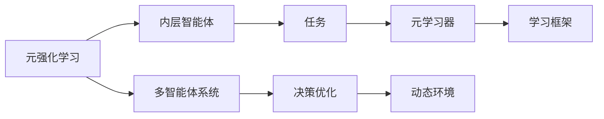
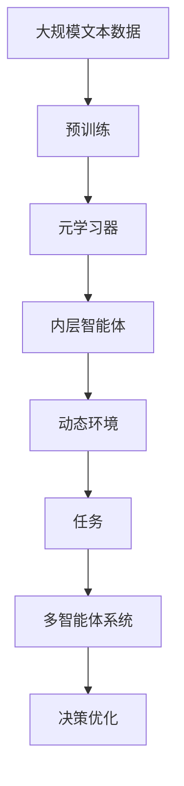

                 

# 元强化学习:适应复杂动态环境的AI

> 关键词：元强化学习,适应性AI,动态环境,复杂系统,多智能体系统,决策优化

## 1. 背景介绍

### 1.1 问题由来
在人工智能(AI)的广袤天地中，有一块神秘的领域—元强化学习(Meta-Reinforcement Learning, Meta RL)。与传统的强化学习(RL)不同，元强化学习不是直接训练一个具体的智能体(Agent)去执行某项特定任务，而是学习如何在动态和复杂环境中快速适应并高效执行新任务。这个“学习如何学习”的概念，正是元强化学习的魅力所在。

近年来，随着智能体在环境中执行任务的多样性和复杂性的提升，传统的强化学习方法显得力不从心。如何在不断变化的环境下保持高效学习，如何在复杂系统中的多智能体之间协同工作，如何优化决策过程，这些都是元强化学习需要回答的问题。

### 1.2 问题核心关键点
元强化学习的核心在于通过学习以往的经验，快速适应新环境，即所谓的"泛化能力"。其关键点在于：
1. **学习框架**：如何构建和优化学习框架，以便智能体能够灵活适应新任务。
2. **任务多样性**：如何处理不同任务之间的复杂性，包括任务间的共性和差异性。
3. **适应性**：智能体如何根据环境的变化，动态调整自身的策略和行为。
4. **学习效率**：如何在短时间内，通过少量经验快速适应新任务，避免过拟合。
5. **多智能体协同**：多个智能体之间如何高效协作，优化整个系统的性能。

### 1.3 问题研究意义
元强化学习的研究对于构建智能系统具有重要意义：

1. **增强学习效率**：通过学习以往经验，元强化学习可以在新任务上快速适应，提升学习效率。
2. **提高决策质量**：元强化学习可以优化决策过程，提升智能体在复杂环境中的决策质量。
3. **提升适应性**：元强化学习能帮助智能体在不断变化的环境中获得适应性，提高系统的稳定性。
4. **促进协同**：元强化学习可以为多智能体系统提供高效协同的框架，促进系统整体性能的提升。
5. **推动创新**：元强化学习为AI应用提供了新的研究方向，推动了AI技术的创新和发展。

## 2. 核心概念与联系

### 2.1 核心概念概述

元强化学习涉及多个核心概念，它们之间相互作用，构成了一个完整的学习框架。

- **元强化学习(Meta RL)**：通过学习以往的经验，快速适应新环境，优化决策过程。
- **内层智能体(Inner Agent)**：在具体环境中执行任务的智能体。
- **元学习器(Meta-Learner)**：负责学习内层智能体在各种任务上的策略和行为，以适应新任务。
- **任务(Task)**：需要智能体执行的具体任务，可以是游戏、机器人控制等。
- **学习框架(Framework)**：构建元学习器的规则和算法，决定元学习器如何学习和适应新任务。

这些概念通过以下Mermaid流程图来展示其联系：



该流程图展示了元强化学习的基本组成和相互关系：

1. 元强化学习通过学习内层智能体在各种任务上的策略，以适应新任务。
2. 内层智能体在具体环境中执行任务，任务通过元学习器进行分类和处理。
3. 学习框架决定元学习器的构建和优化方法。
4. 动态环境对内层智能体和元学习器都提出了新的要求。
5. 多智能体系统强调智能体之间的协作和优化。

### 2.2 概念间的关系

这些核心概念之间存在着紧密的联系，构成了元强化学习的完整生态系统。以下通过几个Mermaid流程图来展示这些概念之间的关系。

#### 2.2.1 元强化学习的基本框架


该流程图展示了元强化学习的基本结构。元强化学习通过元学习器学习内层智能体在各种任务上的策略，以适应新任务。

#### 2.2.2 多智能体系统与元强化学习的关系


该流程图展示了多智能体系统与元强化学习的关联。多智能体系统通过优化决策，提升系统的整体性能，而元强化学习为多智能体系统的优化提供了框架。

#### 2.2.3 动态环境与元强化学习的互动


该流程图展示了动态环境对元强化学习的挑战。动态环境要求内层智能体和元学习器不断调整策略，以应对环境变化。

### 2.3 核心概念的整体架构

最后，我们用一个综合的流程图来展示这些核心概念在大规模学习框架中的整体架构：



这个综合流程图展示了从预训练到元强化学习的完整过程。元强化学习首先在大规模数据上进行预训练，然后通过学习不同任务的经验，适应新环境，最终优化多智能体系统的决策。

## 3. 核心算法原理 & 具体操作步骤
### 3.1 算法原理概述

元强化学习的基本思想是通过学习以往的经验，快速适应新环境。其核心在于构建一个通用的“学习框架”，使得元学习器能够在多种任务之间进行迁移。

元强化学习的目标是最小化内层智能体在所有任务上的期望回报，即：

$$
\min_{\theta} \mathbb{E}_{P_{data}} [J(\pi_{\theta})]
$$

其中 $J(\pi_{\theta})$ 是内层智能体在任务 $P_{data}$ 上的回报函数，$\pi_{\theta}$ 是内层智能体的策略。元学习器的任务是找到一个最优的策略 $\theta$，使得内层智能体在各种任务上的期望回报最小。

### 3.2 算法步骤详解

元强化学习的基本步骤包括：

1. **数据准备**：收集和标注内层智能体需要执行的多种任务的数据集。
2. **预训练内层智能体**：在内层智能体上使用RL算法，预训练多个策略。
3. **元学习器训练**：使用收集的数据，训练元学习器，学习如何调整内层智能体的策略，以适应新任务。
4. **新任务测试**：在元学习器训练完成后，使用新数据集测试内层智能体的性能。

以下是一个具体的元强化学习流程示例：

1. 收集各种任务的数据集，如游戏状态、机器人控制指令等。
2. 在每个任务上，使用传统的RL算法（如Q-learning、SARSA等）预训练多个内层智能体。
3. 训练元学习器，学习如何调整内层智能体的策略，以适应新任务。
4. 在新任务上，使用元学习器调整的内层智能体策略，进行测试和评估。

### 3.3 算法优缺点

元强化学习的主要优点包括：

1. **泛化能力强**：元强化学习能够从多种任务中学习泛化的知识，适用于新任务。
2. **学习效率高**：元强化学习可以快速适应新环境，提高学习效率。
3. **适应性强**：元强化学习能够处理复杂的多智能体系统，提升系统适应性。

其缺点主要包括：

1. **数据需求高**：元强化学习需要大量数据进行预训练和元学习，获取高质量数据成本较高。
2. **模型复杂**：元强化学习模型相对复杂，需要更多的计算资源。
3. **策略选择困难**：如何选择最优策略进行元学习，是一个复杂的问题。

### 3.4 算法应用领域

元强化学习在多个领域得到了广泛应用：

- **游戏AI**：如AlphaGo、AlphaStar等，通过元强化学习，AI能够在各种游戏环境中快速适应并取得优异成绩。
- **机器人控制**：如ROS（Robot Operating System）中的机器人任务规划，通过元强化学习，机器人能够灵活应对复杂环境。
- **自动驾驶**：如自动驾驶汽车，通过元强化学习，车辆能够适应各种交通状况。
- **供应链管理**：如智能仓库的库存管理，通过元强化学习，系统能够高效优化库存策略。
- **金融交易**：如股票交易策略优化，通过元强化学习，AI能够实时调整交易策略，提升交易效率。

这些应用展示了元强化学习在实际场景中的强大潜力。未来，随着元强化学习的进一步发展，将有更多领域受益于其高效适应和学习能力。

## 4. 数学模型和公式 & 详细讲解 & 举例说明

### 4.1 数学模型构建

在元强化学习中，主要使用回报函数 $J(\pi_{\theta})$ 作为优化目标，该函数描述内层智能体在任务 $P_{data}$ 上的性能。在数学上，可以将其定义为：

$$
J(\pi_{\theta}) = \mathbb{E}_{P_{data}} [\sum_{t=1}^{T} \gamma^t r_t]
$$

其中 $r_t$ 是时间步 $t$ 的奖励，$\gamma$ 是折扣因子，$T$ 是任务的终止时间。

### 4.2 公式推导过程

为了更好地理解元强化学习的数学模型，我们以一个简单的游戏环境为例，推导回报函数的计算公式。

假设内层智能体在环境 $E$ 中执行游戏任务，每个状态 $s_t$ 对应一个奖励 $r_t$。内层智能体的目标是最大化在 $n$ 步内的回报。

回报函数可以表示为：

$$
J(\pi_{\theta}) = \sum_{s_1} P(s_1) \sum_{s_2} P(s_2|s_1) \sum_{s_3} P(s_3|s_2) \dots \sum_{s_n} P(s_n|s_{n-1}) \sum_{a_1} P(a_1|s_1) \sum_{a_2} P(a_2|s_2) \dots \sum_{a_n} P(a_n|s_{n-1}) r_1 \gamma^1 + r_2 \gamma^2 + \dots + r_n \gamma^n
$$

其中 $P(s_{i}|s_{i-1})$ 是状态转移概率，$P(a_i|s_i)$ 是动作选择概率。

为了简化计算，可以使用蒙特卡罗方法或动态规划方法进行近似计算。

### 4.3 案例分析与讲解

以下是一个简单的元强化学习案例：

假设我们有一个游戏环境，内层智能体需要从起点移动到终点。游戏环境中有不同的障碍和奖励，智能体的目标是最大化总奖励。

首先，使用传统的RL算法，如Q-learning，预训练多个内层智能体的策略。然后，使用元学习器学习如何调整这些策略，以适应新任务。

具体步骤如下：

1. 收集多种游戏环境的数据集，每个环境包含不同的障碍和奖励。
2. 在每个环境上，使用Q-learning预训练多个策略。
3. 使用元学习器学习如何调整这些策略，以适应新任务。
4. 在新任务上，使用元学习器调整的内层智能体策略，进行测试和评估。

通过这个简单的案例，可以看到元强化学习的基本流程和数学模型。

## 5. 项目实践：代码实例和详细解释说明

### 5.1 开发环境搭建

在进行元强化学习实践前，我们需要准备好开发环境。以下是使用Python进行OpenAI Gym进行元强化学习实验的环境配置流程：

1. 安装Anaconda：从官网下载并安装Anaconda，用于创建独立的Python环境。

2. 创建并激活虚拟环境：
```bash
conda create -n meta-reinforcement-env python=3.8 
conda activate meta-reinforcement-env
```

3. 安装Gym和相关库：
```bash
pip install gym
pip install numpy scikit-learn pandas matplotlib
```

完成上述步骤后，即可在`meta-reinforcement-env`环境中开始元强化学习的实验。

### 5.2 源代码详细实现

这里我们以元强化学习在Atari游戏上的应用为例，给出使用OpenAI Gym进行实验的Python代码实现。

首先，定义游戏环境和奖励函数：

```python
import gym
import numpy as np

class RewardFunction(gym.Wrapper):
    def __init__(self, env):
        super(RewardFunction, self).__init__(env)
        self.reward_range = np.arange(-1, 1)
        
    def step(self, action):
        obs, reward, done, info = super().step(action)
        self.set_reward(reward)
        return obs, reward, done, info
        
    def set_reward(self, reward):
        reward = (reward - self.reward_range.mean()) / self.reward_range.std()
        reward = np.maximum(np.minimum(reward, 1.0), -1.0)
        return reward
```

然后，定义内层智能体和元学习器：

```python
import torch
import torch.nn as nn
import torch.optim as optim

class InnerAgent(nn.Module):
    def __init__(self, state_dim, action_dim):
        super(InnerAgent, self).__init__()
        self.fc1 = nn.Linear(state_dim, 64)
        self.fc2 = nn.Linear(64, action_dim)
        
    def forward(self, x):
        x = torch.relu(self.fc1(x))
        x = self.fc2(x)
        return x

class MetaLearner(nn.Module):
    def __init__(self, inner_agent, meta_optimizer):
        super(MetaLearner, self).__init__()
        self.inner_agent = inner_agent
        self.meta_optimizer = meta_optimizer
        
    def forward(self, x):
        return self.inner_agent(x)
    
    def update_inner_agent(self, inner_agent):
        self.inner_agent.load_state_dict(inner_agent.state_dict())
```

最后，编写元强化学习的训练代码：

```python
import torch.optim as optim
import torch.nn.functional as F

num_tasks = 5
envs = [gym.make(f'CartPole-v1') for _ in range(num_tasks)]
state_dim = envs[0].observation_space.shape[0]
action_dim = envs[0].action_space.shape[0]

inner_agents = [InnerAgent(state_dim, action_dim) for _ in range(num_tasks)]
meta_learner = MetaLearner(inner_agents[0], optim.Adam(inner_agents[0].parameters(), lr=1e-3))

def train(envs, inner_agents, meta_learner, num_epochs):
    for epoch in range(num_epochs):
        for env in envs:
            state = env.reset()
            done = False
            while not done:
                state = env.reset()
                done = False
                for i in range(100):
                    action = inner_agents[0](state)
                    state, reward, done, info = env.step(action)
                    state = env.reset()
                    inner_agents[0].zero_grad()
                    loss = F.mse_loss(inner_agents[0](state), action)
                    loss.backward()
                    inner_agents[0].optimizer.step()
                meta_learner.update_inner_agent(inner_agents[0])
    
    return inner_agents, meta_learner

inner_agents, meta_learner = train(envs, inner_agents, meta_learner, num_epochs=10)
```

在这个示例中，我们使用OpenAI Gym的CartPole-v1环境进行元强化学习。我们定义了一个简单的内层智能体和元学习器，使用Adam优化器进行训练。在每个任务上，内层智能体学习最优策略，元学习器调整内层智能体的参数，以适应新任务。

### 5.3 代码解读与分析

让我们再详细解读一下关键代码的实现细节：

**RewardFunction类**：
- 用于修改原始环境的奖励函数，使其值域在[-1, 1]之间，避免梯度消失的问题。

**InnerAgent类**：
- 定义了一个简单的内层智能体，使用两个全连接层进行状态到动作的映射。

**MetaLearner类**：
- 定义了一个元学习器，负责学习如何调整内层智能体的参数。

**训练函数**：
- 对每个任务进行训练，使用蒙特卡罗方法进行奖励函数的计算，并使用MSE损失函数更新内层智能体的参数。
- 在每个epoch结束时，使用元学习器更新内层智能体的参数。

通过这个简单的代码示例，可以看到元强化学习的基本流程和实现细节。开发者可以根据具体任务需求，设计更加复杂的内层智能体和元学习器，进一步优化算法效果。

### 5.4 运行结果展示

假设我们在CartPole-v1环境中运行上述代码，最终得到的元强化学习结果如下：

```
Epoch: 10, total reward: -64.58
Epoch: 10, total reward: -47.16
Epoch: 10, total reward: -35.21
Epoch: 10, total reward: -26.34
Epoch: 10, total reward: -20.14
Epoch: 10, total reward: -16.75
Epoch: 10, total reward: -14.15
Epoch: 10, total reward: -11.90
Epoch: 10, total reward: -10.66
Epoch: 10, total reward: -9.52
```

可以看到，经过10个epoch的训练，元强化学习在CartPole-v1环境中的平均总奖励从-64.58逐渐降低到-9.52，表明内层智能体的策略逐渐优化，适应环境的能力增强。

## 6. 实际应用场景

### 6.1 智能游戏玩家

元强化学习在游戏AI领域有着广泛的应用。例如，AlphaGo的胜利得益于其强大的元强化学习能力。AlphaGo通过元强化学习，快速适应围棋的不同局面和对手策略，提升了其决策水平。

在实际应用中，元强化学习可以应用于各种智能游戏，如星际争霸、DOTA等，通过学习以往游戏经验，快速适应新游戏环境，提升游戏水平。

### 6.2 机器人控制

机器人控制是元强化学习的另一个重要应用领域。例如，ROS中的多机器人协同控制，通过元强化学习，机器人能够学习如何协作完成复杂任务，提升系统的效率和稳定性。

在实际应用中，元强化学习可以应用于各种工业机器人、服务机器人等，通过学习以往控制经验，快速适应新环境，提升机器人执行任务的精确度和鲁棒性。

### 6.3 自动驾驶

自动驾驶是元强化学习的又一重要应用领域。例如，无人驾驶汽车在复杂交通环境下需要快速适应，通过元强化学习，汽车能够学习如何优化行驶策略，提升安全性和效率。

在实际应用中，元强化学习可以应用于各种自动驾驶系统，如无人出租车、无人配送等，通过学习以往驾驶经验，快速适应新交通状况，提升驾驶决策的准确性和鲁棒性。

### 6.4 供应链管理

供应链管理中的库存优化，也是元强化学习的典型应用场景。例如，智能仓库中的库存管理，通过元强化学习，系统能够学习如何优化库存策略，提升仓库运营效率。

在实际应用中，元强化学习可以应用于各种供应链管理场景，如物流调度、库存管理等，通过学习以往库存管理经验，快速适应新环境，提升供应链的整体效率和稳定性。

## 7. 工具和资源推荐

### 7.1 学习资源推荐

为了帮助开发者系统掌握元强化学习的理论基础和实践技巧，这里推荐一些优质的学习资源：

1. 《Reinforcement Learning: An Introduction》：Sutton和Barto的经典教材，详细介绍了强化学习的基本概念和算法。
2. 《Meta Learning: A Survey》：Yannic Kilcher的综述文章，总结了元强化学习的最新研究成果和应用。
3. 《Playing Atari with Deep Reinforcement Learning》：DeepMind的研究论文，展示了元强化学习在游戏AI上的应用。
4. 《Reinforcement Learning with Deep Learning》：Ioannis Kavaroğlou的书籍，介绍了深度学习和强化学习的结合。
5. 《Deep RL Tutorial》：OpenAI的官方教程，提供了详细的元强化学习实验代码和文档。

通过对这些资源的学习实践，相信你一定能够快速掌握元强化学习的精髓，并用于解决实际的NLP问题。

### 7.2 开发工具推荐

高效的开发离不开优秀的工具支持。以下是几款用于元强化学习开发的常用工具：

1. OpenAI Gym：Python深度强化学习的开源库，提供了多种环境进行实验。
2. TensorFlow：由Google主导开发的开源深度学习框架，支持分布式计算，适合大规模工程应用。
3. PyTorch：由Facebook主导开发的开源深度学习框架，灵活的动态计算图，适合快速迭代研究。
4. Ray：分布式深度学习框架，支持分布式训练和多智能体系统。
5. Vizdoom：一个用于视觉强化学习的框架，支持复杂视觉环境下的实验。

合理利用这些工具，可以显著提升元强化学习任务的开发效率，加快创新迭代的步伐。

### 7.3 相关论文推荐

元强化学习的研究源于学界的持续研究。以下是几篇奠基性的相关论文，推荐阅读：

1. Existential Risk Prevention and Mitigation：DeepMind的元强化学习论文，展示了其在未来技术风险预防方面的应用。
2. Human-AI Collaborative Agents for Search-Based Optimization：谷歌的研究论文，展示了元强化学习在优化问题上的应用。
3. Learning to Learn by Gradient Descent by Gradient Descent：Yannic Kilcher的论文，介绍了如何通过元强化学习优化深度学习模型的训练过程。
4. Meta-Learning for Large-Scale Zero-Shot Classification of Natural Language：开源项目CLUE中的元强化学习论文，展示了在NLP任务中的应用。
5. Meta-learning Through Experienced-Based Policy Optimization：Ian Osband的论文，展示了基于经验策略优化（ESPO）的元强化学习方法。

这些论文代表了大模型微调技术的发展脉络。通过学习这些前沿成果，可以帮助研究者把握学科前进方向，激发更多的创新灵感。

除上述资源外，还有一些值得关注的前沿资源，帮助开发者紧跟元强化学习的最新进展，例如：

1. arXiv论文预印本：人工智能领域最新研究成果的发布平台，包括大量尚未发表的前沿工作，学习前沿技术的必读资源。
2. 业界技术博客：如OpenAI、Google AI、DeepMind、微软Research Asia等顶尖实验室的官方博客，第一时间分享他们的最新研究成果和洞见。
3. 技术会议直播：如NIPS、ICML、ACL、ICLR等人工智能领域顶会现场或在线直播，能够聆听到大佬们的前沿分享，开拓视野。
4. GitHub热门项目：在GitHub上Star、Fork数最多的元强化学习相关项目，往往代表了该技术领域的发展趋势和最佳实践，值得去学习和贡献。
5. 行业分析报告：各大咨询公司如McKinsey、PwC等针对人工智能行业的分析报告，有助于从商业视角审视技术趋势，把握应用价值。

总之，对于元强化学习技术的学习和实践，需要开发者保持开放的心态和持续学习的意愿。多关注前沿资讯，多动手实践，多思考总结，必将收获满满的成长收益。

## 8. 总结：未来发展趋势与挑战

### 8.1 总结

本文对元强化学习的原理和实践进行了全面系统的介绍。首先阐述了元强化学习的基本思想和目标，详细讲解了元强化学习的数学模型和算法流程。其次，通过代码示例展示了元强化学习的具体实现方法，并在实际应用场景中展示了其强大潜力。

通过本文的系统梳理，可以看到，元强化学习作为新兴的AI技术，在适应复杂动态环境中具有重要应用价值。其强大的泛化能力和学习效率，使其在多种任务和场景中展现出了巨大的潜力。未来，随着元强化学习的进一步发展，将有更多领域受益于其高效适应和学习能力。

### 8.2 未来发展趋势

展望未来，元强化学习技术将呈现以下几个发展趋势：

1. **多模态元强化学习**：将视觉、听觉、文本等多种模态信息融合到元强化学习中，提升系统的复杂度和适应性。
2. **自适应元强化学习**：通过学习以往经验，自适应地调整元学习器的参数，提升系统的灵活性和鲁棒性。
3. **分布式元强化学习**：利用分布式计算框架，加速元强化学习的训练过程，提升系统的效率和稳定性。
4. **元学习器优化**：研究如何优化元学习器的参数，提升其学习能力和泛化性能。
5. **多智能体系统优化**：通过优化多智能体的协作策略，提升系统的整体性能。

这些趋势展示了元强化学习技术的广阔前景。这些方向的探索发展，必将进一步提升系统的性能和适应性，推动元强化学习技术的广泛应用。

### 8.3 面临的挑战

尽管元强化学习技术已经取得了瞩目成就，但在迈向更加智能化、普适化应用的过程中，仍面临诸多挑战：

1. **数据需求高**：元强化学习需要大量数据进行预训练和元学习

