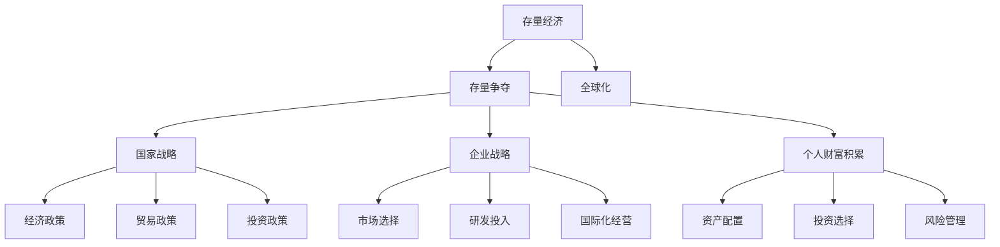
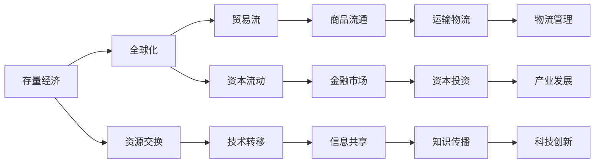
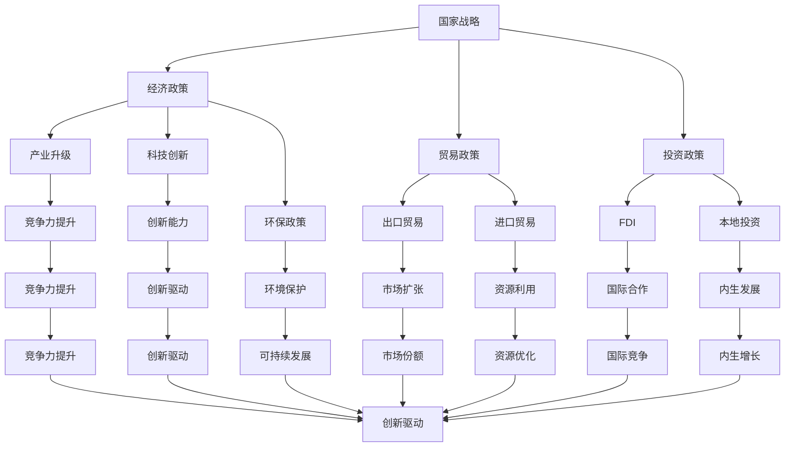

                 

# 全球经济存量争夺的现象分析

## 1. 背景介绍

### 1.1 全球经济存量的定义

全球经济存量（Global Economic Stock）是指全球经济体系中所有资源、资本、劳动力、技术、知识等的总和。这些资源和资本在全球范围内被经济主体（如国家、公司、个人等）所拥有和使用。全球经济存量的争夺，本质上是一场资源和资本的竞争，涉及到国家、企业、个人等多个层次的博弈。

### 1.2 经济存量争夺的重要性

在全球化经济背景下，国家之间的竞争不仅仅是GDP增长速度的竞争，更是对经济存量的争夺。经济存量的多少，直接决定了国家的经济实力、科技水平、军事力量等综合国力。因此，理解和分析全球经济存量争夺的现状、机制和影响，对于国家战略决策、企业投资选择、个人财富积累等方面都具有重要意义。

## 2. 核心概念与联系

### 2.1 核心概念概述

为更好地理解全球经济存量争夺的复杂性和多样性，本节将介绍几个密切相关的核心概念：

- **存量经济**：经济存量是经济发展的物质基础，它包括物质资本、人力资本、社会资本、自然资源、技术存量、金融资产等。
- **存量争夺**：是指不同经济主体在全球范围内对经济存量的争夺和分配。
- **全球化**：全球化是经济存量争夺的重要背景，通过贸易、投资、金融等途径，不同经济主体在全球范围内进行资源和资本的交换。
- **国家战略**：国家战略是国家层面对经济存量争夺的规划和指导，涉及经济政策、贸易政策、投资政策等方面。
- **企业战略**：企业战略是企业层面对经济存量争夺的规划和实施，涉及市场选择、研发投入、国际化经营等方面。
- **个人财富积累**：个人财富积累是个人层面对经济存量争夺的实现方式，涉及资产配置、投资选择、风险管理等方面。

这些核心概念之间的联系可以通过以下Mermaid流程图来展示：



这个流程图展示了几大核心概念之间的关系：

- 存量经济是经济存量争夺的基础。
- 全球化提供了经济存量争夺的背景。
- 国家战略、企业战略和个人财富积累是经济存量争夺的主要实施形式。
- 国家战略包括经济政策、贸易政策、投资政策等具体措施。
- 企业战略包括市场选择、研发投入、国际化经营等实施路径。
- 个人财富积累涉及资产配置、投资选择、风险管理等个人行为。

### 2.2 概念间的关系

这些核心概念之间存在着紧密的联系，形成了全球经济存量争夺的完整生态系统。下面我通过几个Mermaid流程图来展示这些概念之间的关系。

#### 2.2.1 存量经济与全球化



这个流程图展示了存量经济与全球化之间的联系：

- 存量经济通过全球化进行资源交换、贸易流动、资本流动等。
- 全球化促进了商品流通、技术转移、信息共享等。
- 资源交换、贸易流、资本流动等是全球化的具体形式。
- 商品流通、技术转移、信息共享等是全球化的具体内容。

#### 2.2.2 国家战略与企业战略



这个流程图展示了国家战略与企业战略之间的联系：

- 国家战略包括经济政策、贸易政策、投资政策等。
- 经济政策、贸易政策、投资政策等具体措施。
- 产业升级、科技创新、环保政策等具体目标。
- 出口贸易、进口贸易、FDI、本地投资等具体形式。
- 竞争力提升、创新能力、可持续发展等具体成果。
- 市场扩张、资源利用、国际合作等具体实施。
- 内生发展、内生增长等具体目标。

#### 2.2.3 个人财富积累与全球化

```mermaid
graph LR
    A[个人财富积累] --> B[资产配置]
    A --> C[投资选择]
    A --> D[风险管理]
    B --> E[股票市场]
    B --> F[债券市场]
    B --> G[房地产市场]
    C --> H[金融衍生品]
    C --> I[外汇市场]
    C --> J[创业投资]
    D --> K[保险]
    D --> L[对冲基金]
    E --> M[投资收益]
    F --> N[利息收入]
    G --> O[资产增值]
    H --> P[风险对冲]
    I --> Q[汇率收益]
    J --> R[股权回报]
    K --> S[安全保障]
    L --> T[资本增值]
    M --> U[资产收益]
    N --> V[固定收入]
    O --> W[资产增值]
    P --> X[风险规避]
    Q --> Y[汇率收益]
    R --> Z[股权回报]
    S --> [$[财务保障]
    T --> &[资本增值]
    U --> &[资产收益]
    V --> &[固定收入]
    W --> &[资产增值]
    X --> &[风险规避]
    Y --> &[汇率收益]
    Z --> &[股权回报]
    $ --> &[财务保障]
```

这个流程图展示了个人财富积累与全球化之间的联系：

- 个人财富积累涉及资产配置、投资选择、风险管理等具体行为。
- 资产配置、投资选择、风险管理等具体措施。
- 股票市场、债券市场、房地产市场等具体工具。
- 金融衍生品、外汇市场、创业投资等具体投资渠道。
- 保险、对冲基金等具体风险管理手段。
- 投资收益、利息收入、资产增值等具体成果。
- 风险对冲、汇率收益、股权回报等具体策略。
- 财务保障、资本增值、资产收益等具体目标。

### 2.3 核心概念的整体架构

最后，我们用一个综合的流程图来展示这些核心概念在全球经济存量争夺中的整体架构：

```mermaid
graph TB
    A[存量经济] --> B[存量争夺]
    B --> C[全球化]
    B --> D[国家战略]
    B --> E[企业战略]
    B --> F[个人财富积累]
    C --> G[资源交换]
    C --> H[贸易流]
    C --> I[资本流动]
    D --> J[经济政策]
    D --> K[贸易政策]
    D --> L[投资政策]
    E --> M[市场选择]
    E --> N[研发投入]
    E --> O[国际化经营]
    F --> P[资产配置]
    F --> Q[投资选择]
    F --> R[风险管理]
    G --> S[技术转移]
    H --> T[商品流通]
    I --> U[金融市场]
    J --> V[产业升级]
    J --> W[科技创新]
    J --> X[环保政策]
    K --> Y[出口贸易]
    K --> Z[进口贸易]
    L --> $[FDI]
    L --> &[本地投资]
    M --> &[竞争力提升]
    N --> &[创新能力]
    O --> &[国际化经营]
    P --> &[资产配置]
    Q --> &[投资选择]
    R --> &[风险管理]
    S --> &[技术转移]
    T --> &[商品流通]
    U --> &[金融市场]
    V --> &[产业升级]
    W --> &[科技创新]
    X --> &[环保政策]
    Y --> &[出口贸易]
    Z --> &[进口贸易]
    $ --> &[FDI]
    M --> &[竞争力提升]
    N --> &[创新能力]
    O --> &[国际化经营]
    P --> &[资产配置]
    Q --> &[投资选择]
    R --> &[风险管理]
    S --> &[技术转移]
    T --> &[商品流通]
    U --> &[金融市场]
    V --> &[产业升级]
    W --> &[科技创新]
    X --> &[环保政策]
    Y --> &[出口贸易]
    Z --> &[进口贸易]
    $ --> &[FDI]
    M --> &[竞争力提升]
    N --> &[创新能力]
    O --> &[国际化经营]
    P --> &[资产配置]
    Q --> &[投资选择]
    R --> &[风险管理]
    S --> &[技术转移]
    T --> &[商品流通]
    U --> &[金融市场]
    V --> &[产业升级]
    W --> &[科技创新]
    X --> &[环保政策]
    Y --> &[出口贸易]
    Z --> &[进口贸易]
    $ --> &[FDI]
    M --> &[竞争力提升]
    N --> &[创新能力]
    O --> &[国际化经营]
    P --> &[资产配置]
    Q --> &[投资选择]
    R --> &[风险管理]
    S --> &[技术转移]
    T --> &[商品流通]
    U --> &[金融市场]
    V --> &[产业升级]
    W --> &[科技创新]
    X --> &[环保政策]
    Y --> &[出口贸易]
    Z --> &[进口贸易]
    $ --> &[FDI]
    M --> &[竞争力提升]
    N --> &[创新能力]
    O --> &[国际化经营]
    P --> &[资产配置]
    Q --> &[投资选择]
    R --> &[风险管理]
    S --> &[技术转移]
    T --> &[商品流通]
    U --> &[金融市场]
    V --> &[产业升级]
    W --> &[科技创新]
    X --> &[环保政策]
    Y --> &[出口贸易]
    Z --> &[进口贸易]
    $ --> &[FDI]
    M --> &[竞争力提升]
    N --> &[创新能力]
    O --> &[国际化经营]
    P --> &[资产配置]
    Q --> &[投资选择]
    R --> &[风险管理]
    S --> &[技术转移]
    T --> &[商品流通]
    U --> &[金融市场]
    V --> &[产业升级]
    W --> &[科技创新]
    X --> &[环保政策]
    Y --> &[出口贸易]
    Z --> &[进口贸易]
    $ --> &[FDI]
    M --> &[竞争力提升]
    N --> &[创新能力]
    O --> &[国际化经营]
    P --> &[资产配置]
    Q --> &[投资选择]
    R --> &[风险管理]
    S --> &[技术转移]
    T --> &[商品流通]
    U --> &[金融市场]
    V --> &[产业升级]
    W --> &[科技创新]
    X --> &[环保政策]
    Y --> &[出口贸易]
    Z --> &[进口贸易]
    $ --> &[FDI]
    M --> &[竞争力提升]
    N --> &[创新能力]
    O --> &[国际化经营]
    P --> &[资产配置]
    Q --> &[投资选择]
    R --> &[风险管理]
    S --> &[技术转移]
    T --> &[商品流通]
    U --> &[金融市场]
    V --> &[产业升级]
    W --> &[科技创新]
    X --> &[环保政策]
    Y --> &[出口贸易]
    Z --> &[进口贸易]
    $ --> &[FDI]
    M --> &[竞争力提升]
    N --> &[创新能力]
    O --> &[国际化经营]
    P --> &[资产配置]
    Q --> &[投资选择]
    R --> &[风险管理]
    S --> &[技术转移]
    T --> &[商品流通]
    U --> &[金融市场]
    V --> &[产业升级]
    W --> &[科技创新]
    X --> &[环保政策]
    Y --> &[出口贸易]
    Z --> &[进口贸易]
    $ --> &[FDI]
    M --> &[竞争力提升]
    N --> &[创新能力]
    O --> &[国际化经营]
    P --> &[资产配置]
    Q --> &[投资选择]
    R --> &[风险管理]
    S --> &[技术转移]
    T --> &[商品流通]
    U --> &[金融市场]
    V --> &[产业升级]
    W --> &[科技创新]
    X --> &[环保政策]
    Y --> &[出口贸易]
    Z --> &[进口贸易]
    $ --> &[FDI]
    M --> &[竞争力提升]
    N --> &[创新能力]
    O --> &[国际化经营]
    P --> &[资产配置]
    Q --> &[投资选择]
    R --> &[风险管理]
    S --> &[技术转移]
    T --> &[商品流通]
    U --> &[金融市场]
    V --> &[产业升级]
    W --> &[科技创新]
    X --> &[环保政策]
    Y --> &[出口贸易]
    Z --> &[进口贸易]
    $ --> &[FDI]
    M --> &[竞争力提升]
    N --> &[创新能力]
    O --> &[国际化经营]
    P --> &[资产配置]
    Q --> &[投资选择]
    R --> &[风险管理]
    S --> &[技术转移]
    T --> &[商品流通]
    U --> &[金融市场]
    V --> &[产业升级]
    W --> &[科技创新]
    X --> &[环保政策]
    Y --> &[出口贸易]
    Z --> &[进口贸易]
    $ --> &[FDI]
    M --> &[竞争力提升]
    N --> &[创新能力]
    O --> &[国际化经营]
    P --> &[资产配置]
    Q --> &[投资选择]
    R --> &[风险管理]
    S --> &[技术转移]
    T --> &[商品流通]
    U --> &[金融市场]
    V --> &[产业升级]
    W --> &[科技创新]
    X --> &[环保政策]
    Y --> &[出口贸易]
    Z --> &[进口贸易]
    $ --> &[FDI]
    M --> &[竞争力提升]
    N --> &[创新能力]
    O --> &[国际化经营]
    P --> &[资产配置]
    Q --> &[投资选择]
    R --> &[风险管理]
    S --> &[技术转移]
    T --> &[商品流通]
    U --> &[金融市场]
    V --> &[产业升级]
    W --> &[科技创新]
    X --> &[环保政策]
    Y --> &[出口贸易]
    Z --> &[进口贸易]
    $ --> &[FDI]
    M --> &[竞争力提升]
    N --> &[创新能力]
    O --> &[国际化经营]
    P --> &[资产配置]
    Q --> &[投资选择]
    R --> &[风险管理]
    S --> &[技术转移]
    T --> &[商品流通]
    U --> &[金融市场]
    V --> &[产业升级]
    W --> &[科技创新]
    X --> &[环保政策]
    Y --> &[出口贸易]
    Z --> &[进口贸易]
    $ --> &[FDI]
    M --> &[竞争力提升]
    N --> &[创新能力]
    O --> &[国际化经营]
    P --> &[资产配置]
    Q --> &[投资选择]
    R --> &[风险管理]
    S --> &[技术转移]
    T --> &[商品流通]
    U --> &[金融市场]
    V --> &[产业升级]
    W --> &[科技创新]
    X --> &[环保政策]
    Y --> &[出口贸易]
    Z --> &[进口贸易]
    $ --> &[FDI]
    M --> &[竞争力提升]
    N --> &[创新能力]
    O --> &[国际化经营]
    P --> &[资产配置]
    Q --> &[投资选择]
    R --> &[风险管理]
    S --> &[技术转移]
    T --> &[商品流通]
    U --> &[金融市场]
    V --> &[产业升级]
    W --> &[科技创新]
    X --> &[环保政策]
    Y --> &[出口贸易]
    Z --> &[进口贸易]
    $ --> &[FDI]
    M --> &[竞争力提升]
    N --> &[创新能力]
    O --> &[国际化经营]
    P --> &[资产配置]
    Q --> &[投资选择]
    R --> &[风险管理]
    S --> &[技术转移]
    T --> &[商品流通]
    U --> &[金融市场]
    V --> &[产业升级]
    W --> &[科技创新]
    X --> &[环保政策]
    Y --> &[出口贸易]
    Z --> &[进口贸易]
    $ --> &[FDI]
    M --> &[竞争力提升]
    N --> &[创新能力]
    O --> &[国际化经营]
    P --> &[资产配置]
    Q --> &[投资选择]
    R --> &[风险管理]
    S --> &[技术转移]
    T --> &[商品流通]
    U --> &[金融市场]
    V --> &[产业升级]
    W --> &[科技创新]
    X --> &[环保政策]
    Y --> &[出口贸易]
    Z --> &[进口贸易]
    $ --> &[FDI]
    M --> &[竞争力提升]
    N --> &[创新能力]
    O --> &[国际化经营]
    P --> &[资产配置]
    Q --> &[投资选择]
    R --> &[风险管理]
    S --> &[技术转移]
    T --> &[商品流通]
    U --> &[金融市场]
    V --> &[产业升级]
    W --> &[科技创新]
    X --> &[环保政策]
    Y --> &[出口贸易]
    Z --> &[进口贸易]
    $ --> &[FDI]
    M --> &[竞争力提升]
    N --> &[创新能力]
    O --> &[国际化经营]
    P --> &[资产配置]
    Q --> &[投资选择]
    R --> &[风险管理]
    S --> &[技术转移]
    T --> &[商品流通]
    U --> &[金融市场]
    V --> &[产业升级]
    W --> &[科技创新]
    X --> &[环保政策]
    Y --> &[出口贸易]
    Z --> &[进口贸易]
    $ --> &[FDI]
    M --> &[竞争力提升]
    N --> &[创新能力]
    O --> &[国际化经营]
    P --> &[资产配置]
    Q --> &[投资选择]
    R --> &[风险管理]
    S --> &[技术转移]
    T --> &[商品流通]
    U --> &[金融市场]
    V --> &[产业升级]
    W --> &[科技创新]
    X --> &[环保政策]
    Y --> &[出口贸易]
    Z --> &[进口贸易]
    $ --> &[FDI]
    M --> &[竞争力提升]
    N --> &[创新能力]
    O --> &[国际化经营]
    P --> &[资产配置]
    Q --> &[投资选择]
    R --> &[风险管理]
    S --> &[技术转移]
    T --> &[商品流通]
    U --> &[金融市场]
    V --> &[产业升级]
    W --> &[科技创新]
    X --> &[环保政策]
    Y --> &[出口贸易]
    Z --> &[进口贸易]
    $ --> &[FDI]
    M --> &[竞争力提升]
    N --> &[创新能力]
    O --> &[国际化经营]
    P --> &[资产配置]
    Q --> &[投资选择]
    R --> &[风险管理]
    S --> &[技术转移]
    T --> &[商品流通]
    U --> &[金融市场]
    V --> &[产业升级]
    W --> &[科技创新]
    X --> &[环保政策]
    Y --> &[出口贸易]
    Z --> &[进口贸易]
    $ --> &[FDI]
    M --> &[竞争力提升]
    N --> &[创新能力]
    O --> &[国际化经营]
    P --> &[资产配置]
    Q --> &[投资选择]
    R --> &[风险管理]
    S --> &[技术转移]
    T --> &[商品流通]
    U --> &[金融市场]
    V --> &[产业升级]
    W --> &[科技创新]
    X --> &[环保政策]
    Y --> &[出口贸易]
    Z --> &[进口贸易]
    $ --> &[FDI]
    M --> &[竞争力提升]
    N --> &[创新能力]
    O --> &[国际化经营]
    P --> &[资产配置]
    Q --> &[投资选择]
    R --> &[风险管理]
    S --> &[技术转移]
    T --> &[商品流通]
    U --> &[金融市场]
    V --> &[产业升级]
    W --> &[科技创新]
    X --> &[环保政策]
    Y --> &[出口贸易]
    Z --> &[进口贸易]
    $ --> &[FDI]
    M --> &[竞争力提升]
    N --> &[创新能力]
    O --> &[国际化经营]
    P --> &[资产配置]
    Q --> &[投资选择]
    R --> &[风险管理]
    S --> &[技术转移]
    T --> &[商品流通]
    U --> &[金融市场]
    V --> &[产业升级]
    W --> &[科技创新]
    X --> &[环保政策]
    Y --> &[出口贸易]
    Z --> &[进口贸易]
    $ --> &[FDI]
    M --> &[竞争力提升]
    N --> &[创新能力]
    O --> &[国际化经营]
    P --> &[资产配置]
    Q --> &[投资选择]
    R --> &[风险管理]
    S --> &[技术转移]
    T --> &[商品流通]
    U --> &[金融市场]
    V --> &[产业升级]
    W --> &[科技创新]
    X --> &[环保政策]
    Y --> &[出口贸易]
    Z --> &[进口贸易]
    $ --> &[FDI]
    M --> &[竞争力提升]
    N --> &[创新能力]
    O --> &[国际化经营]
    P --> &[资产配置]
    Q --> &[投资选择]
    R --> &[风险管理]
    S --> &[技术转移]
    T --> &[商品流通]
    U --> &[金融市场]
    V --> &[产业升级]
    W --> &[科技创新]
    X --> &[环保政策]
    Y --> &[出口贸易]
    Z --> &[进口贸易]
    $ --> &[FDI]
    M --> &[竞争力提升]
    N --> &[创新能力]
    O --> &[国际化经营]
    P --> &[资产配置]
    Q --> &[投资选择]
    R --> &[风险管理]
    S --> &[技术转移]
    T --> &[商品流通]
    U --> &[金融市场]
    V --> &[产业升级]
    W --> &[科技创新]
    X --> &[环保政策]
    Y --> &[出口贸易]
    Z --> &[进口贸易]
    $ --> &[FDI]
    M --> &[竞争力提升]
    N --> &[创新能力]
    O --> &[国际化经营]
    P --> &[资产配置]
    Q --> &[投资选择]
    R --> &[风险管理]
    S --> &[技术转移]
    T --> &[商品流通]
    U --> &[金融市场]
    V --> &[产业升级]
    W --> &[科技创新]
    X --> &[环保政策]
    Y --> &[出口贸易]
    Z --> &[进口贸易]
    $ --> &[FDI]
    M --> &[竞争力提升]
    N --> &[创新能力]
    O --> &[国际化经营]
    P --> &[资产配置]
    Q --> &[投资选择]
    R --> &[风险管理]
    S --> &[技术转移]
    T --> &[商品流通]
    U --> &[金融市场]
    V --> &[产业升级]
    W --> &[科技创新]
    X --> &[环保政策]
    Y --> &[出口贸易]
    Z --> &[进口贸易]
    $ --> &[FDI]
    M --> &[竞争力提升]
    N --> &[创新能力]
    O --> &[国际化经营]
    P --> &[资产配置]
    Q --> &[投资选择]
    R --> &[风险管理]
    S --> &[技术转移]
    T --> &[商品流通]
    U --> &[金融市场]
    V --> &[产业升级]
    W --> &[科技创新]
    X --> &[环保政策]
    Y --> &[出口贸易]
    Z --> &[进口贸易]
    $ --> &[FDI]
    M --> &[竞争力提升]
    N --> &[创新能力]
    O --> &[国际化经营]
    P --> &[资产配置]
    Q --> &[投资选择]
    R --> &[风险管理]
    S --> &[技术转移]
    T --> &[商品流通]
    U --> &[金融市场]
    V --> &[产业升级]
    W --> &[科技创新]
    X --> &[环保政策]
    Y --> &[出口贸易]
    Z --> &[进口贸易]
    $ --> &[FDI]
    M --> &[竞争力提升]
    N --> &[创新能力]
    O --> &[国际化经营]
    P --> &[资产配置]
    Q --> &[投资选择]
    R --> &[风险管理]
    S --> &[技术转移]
    T --> &[商品流通]
    U --> &[金融市场]
    V --> &[产业升级]
    W --> &[科技创新]
    X --> &[环保政策]
    Y --> &[出口贸易]
    Z --> &[进口贸易]
    $ --> &[FDI]
    M --> &[竞争力提升]
    N --> &[创新能力]
    O --> &[国际化经营]
    P --> &[资产配置]
    Q --> &[投资选择]
    R --> &[风险管理]
    S --> &[技术转移]
    T --> &[商品流通]
    U --> &[金融市场]
    V --> &[产业升级]
    W --> &[科技创新]
    X --> &[环保政策]
    Y --> &[出口贸易]
    Z --> &[进口贸易]
    $ --> &[FDI]
    M --> &[竞争力提升]
    N --> &[创新能力]
    O --> &[国际化经营]
    P --> &[资产配置]
    Q --> &[投资选择]
    R --> &[风险管理]
    S --> &[技术转移]
    T --> &[商品流通]
    U --> &[金融市场]
    

