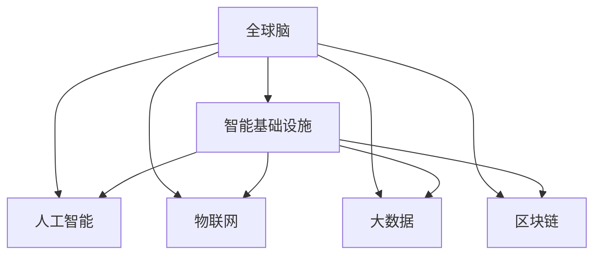
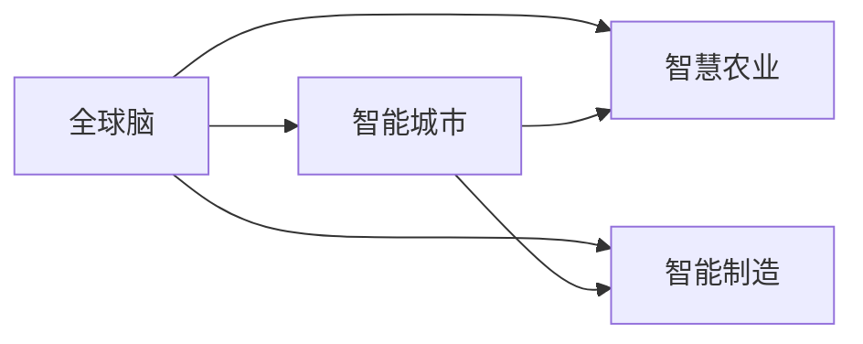
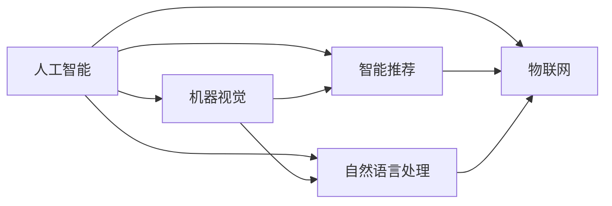
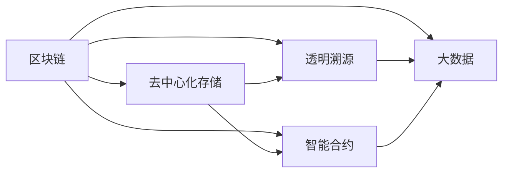
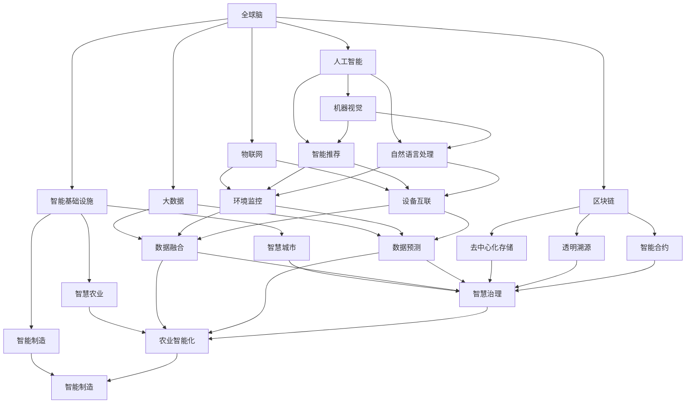
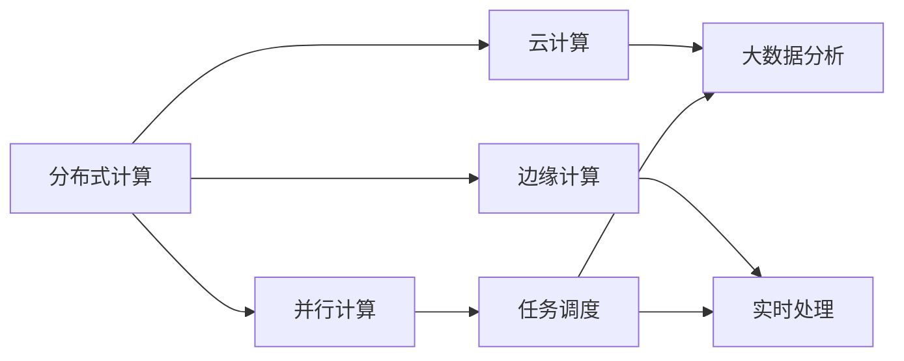

                 

# 全球脑与全球经济:集体智慧驱动的财富共享

> 关键词：全球脑,集体智慧,财富共享,智能基础设施,人工智能(AI),物联网(IoT),大数据,区块链,信息安全

## 1. 背景介绍

### 1.1 问题由来
在当今全球化日益加剧的时代，各国之间的经济交流和合作不断加深。与此同时，全球信息量的急剧增长和技术的不断革新，也为全球经济的持续发展提供了新的动力。然而，信息鸿沟、技术鸿沟等问题依然存在，导致全球财富分配不均，贫富差距进一步拉大。如何通过技术手段，实现全球经济的共同富裕，是当前亟待解决的重要课题。

### 1.2 问题核心关键点
本研究的核心理念是构建“全球脑”，通过分布式计算和智能算法，将全球各地的智慧和资源有效整合，驱动全球经济的共同发展。这一理念的实现需要利用人工智能（AI）、物联网（IoT）、大数据、区块链等技术手段，构建智能基础设施，实现信息的全球共享和经济的协同发展。

### 1.3 问题研究意义
构建“全球脑”系统不仅有助于缓解全球经济不平衡问题，还能促进各国之间的文化交流和合作，提升全球经济的创新能力和竞争力。同时，这一系统也是未来智能城市、智慧农业、智能制造等领域的重要基础设施，具有广泛的应用前景和深远的社会影响。

## 2. 核心概念与联系

### 2.1 核心概念概述

为更好地理解“全球脑”系统，本节将介绍几个密切相关的核心概念：

- 全球脑(Global Brain)：一个基于分布式计算和智能算法构建的全球智慧网络，旨在通过全球各地的智慧和资源整合，实现信息的全球共享和经济的协同发展。
- 智能基础设施(Smart Infrastructure)：利用AI、IoT、大数据、区块链等技术，构建智能化的城市、农业、制造等基础设施，提高资源利用效率，降低环境污染。
- 人工智能(AI)：利用机器学习和深度学习技术，使计算机具备智能推理和决策能力。
- 物联网(IoT)：通过传感器、嵌入式设备和互联网，实现物品和设备之间的互联互通。
- 大数据(Big Data)：海量、多样化的数据集合，通过数据挖掘和分析，实现精准决策和智能优化。
- 区块链(Blockchain)：基于分布式账本和加密技术，确保数据透明、不可篡改、安全可信。

这些核心概念之间的逻辑关系可以通过以下Mermaid流程图来展示：



这个流程图展示了一个全球脑系统所依赖的核心技术及其相互关系：

1. 全球脑系统通过人工智能、物联网、大数据、区块链等技术，构建智能基础设施。
2. 人工智能提供智能推理和决策能力，物联网实现设备互联，大数据提供数据支撑，区块链确保数据安全透明。
3. 智能基础设施在全球范围内实现信息的共享和经济的协同发展。

### 2.2 概念间的关系

这些核心概念之间存在着紧密的联系，形成了全球脑系统的完整生态系统。下面我通过几个Mermaid流程图来展示这些概念之间的关系。

#### 2.2.1 全球脑与智能基础设施的关系



这个流程图展示了全球脑系统通过智能基础设施，在不同领域中的应用：

1. 全球脑通过智能基础设施，实现了智慧城市、智慧农业和智能制造的建设。
2. 智慧城市、智慧农业和智能制造等基础设施的建设，进一步提升了全球脑的智能化水平。

#### 2.2.2 人工智能与物联网的关系



这个流程图展示了人工智能与物联网之间的互动：

1. 人工智能通过机器视觉、智能推荐和自然语言处理等技术，对物联网设备进行智能控制和优化。
2. 物联网设备通过收集环境数据，为人工智能提供了丰富的训练数据。

#### 2.2.3 区块链与大数据的关系



这个流程图展示了区块链与大数据之间的协同：

1. 区块链通过去中心化存储、透明溯源和智能合约等技术，提升了大数据的安全性和可信度。
2. 大数据通过区块链技术的加密和分布式存储，提高了数据的安全性和可靠性。

### 2.3 核心概念的整体架构

最后，我们用一个综合的流程图来展示这些核心概念在全球脑系统中的整体架构：



这个综合流程图展示了从全球脑到智慧城市、智慧农业和智能制造的完整架构：

1. 全球脑通过智能基础设施，实现了智慧城市、智慧农业和智能制造的建设。
2. 人工智能通过机器视觉、智能推荐和自然语言处理等技术，对物联网设备进行智能控制和优化。
3. 大数据通过区块链技术的加密和分布式存储，提高了数据的安全性和可靠性。
4. 智慧城市、智慧农业和智能制造等基础设施的建设，进一步提升了全球脑的智能化水平。

通过这些流程图，我们可以更清晰地理解“全球脑”系统的核心概念及其相互关系，为后续深入讨论具体的技术实现奠定基础。

## 3. 核心算法原理 & 具体操作步骤
### 3.1 算法原理概述

构建“全球脑”系统的核心算法原理是分布式计算和智能算法，主要包括以下几个方面：

- 分布式计算：通过多个计算节点并行处理数据，实现高效计算。
- 智能算法：利用机器学习和深度学习技术，实现数据驱动的智能决策。

系统整体架构如下：



这个流程图展示了分布式计算和智能算法在整个系统中的作用：

1. 分布式计算通过并行计算、云计算和边缘计算，实现数据的分布式处理和实时分析。
2. 智能算法利用机器学习和深度学习技术，对处理后的数据进行智能分析和决策。

### 3.2 算法步骤详解

构建“全球脑”系统的具体步骤如下：

**Step 1: 数据采集和预处理**
- 从全球各地采集数据，包括环境数据、设备数据、市场数据等。
- 对数据进行清洗、归一化和特征提取，生成可用于训练和分析的数据集。

**Step 2: 模型训练和优化**
- 利用AI和深度学习技术，训练各类智能模型，如机器视觉、自然语言处理等。
- 对训练后的模型进行优化，提升模型的准确性和泛化能力。

**Step 3: 数据融合和决策**
- 利用大数据技术，对各地采集的数据进行融合，生成综合数据集。
- 通过智能算法，对综合数据进行分析和决策，输出全球各地经济发展的策略和方案。

**Step 4: 智能基础设施建设**
- 利用物联网技术，实现设备的互联互通和数据采集。
- 利用区块链技术，确保数据的透明、安全和可信。

**Step 5: 系统集成和测试**
- 将智能模型、大数据分析、云计算、边缘计算等技术集成到全球脑系统中。
- 对系统进行测试和调试，确保系统的稳定性和可靠性。

**Step 6: 部署和监控**
- 将系统部署到全球各地，实现数据的全球共享和协同发展。
- 对系统进行实时监控和维护，确保系统的持续运行。

### 3.3 算法优缺点

构建“全球脑”系统的算法优点包括：

- 分布式计算和智能算法可以大幅提升计算效率和决策准确性。
- 数据共享和协同发展可以实现资源的最优配置和利用。
- 智能基础设施可以大幅提升经济发展的智能化水平。

系统的不足之处在于：

- 分布式计算和智能算法需要大量的计算资源和数据资源。
- 系统集成和部署复杂度较高，需要强大的技术支持。
- 数据安全和隐私保护是一个重要挑战，需要完善的法律和监管措施。

### 3.4 算法应用领域

“全球脑”系统可以应用于多个领域，具体包括：

- 智慧城市：通过智能基础设施，提升城市管理效率和居民生活质量。
- 智慧农业：通过智能设备和数据分析，实现农业生产智能化和可持续发展。
- 智能制造：通过智能设备和数据融合，提升制造过程的智能化水平。
- 金融服务：通过大数据和智能算法，提供精准的金融服务和风险管理。
- 医疗健康：通过医疗设备和数据共享，提升医疗服务的智能化水平。

这些应用领域展示了“全球脑”系统的广泛适用性和深远影响。

## 4. 数学模型和公式 & 详细讲解 & 举例说明

### 4.1 数学模型构建

本节将使用数学语言对“全球脑”系统的算法原理进行更加严格的刻画。

记数据集为 $D=\{(x_i,y_i)\}_{i=1}^N$，其中 $x_i$ 为输入，$y_i$ 为输出。假设智能模型为 $f(x)$，训练集为 $D$。定义模型在数据集 $D$ 上的损失函数为 $\mathcal{L}(f)$，则优化目标是最小化损失函数：

$$
\hat{f} = \mathop{\arg\min}_{f} \mathcal{L}(f)
$$

在实践中，我们通常使用梯度下降等优化算法（如SGD、Adam等）来近似求解上述最优化问题。设 $\eta$ 为学习率，$\lambda$ 为正则化系数，则参数的更新公式为：

$$
\theta \leftarrow \theta - \eta \nabla_{\theta}\mathcal{L}(\theta) - \eta\lambda\theta
$$

其中 $\nabla_{\theta}\mathcal{L}(\theta)$ 为损失函数对参数 $\theta$ 的梯度，可通过反向传播算法高效计算。

### 4.2 公式推导过程

以下我们以机器视觉任务为例，推导损失函数及其梯度的计算公式。

假设模型 $f(x)$ 为卷积神经网络（CNN），输入 $x$ 为图像，输出 $y$ 为图像中的物体类别。则交叉熵损失函数定义为：

$$
\ell(f(x),y) = -[y\log f(x)] + (1-y)\log (1-f(x))
$$

将其代入经验风险公式，得：

$$
\mathcal{L}(f) = -\frac{1}{N}\sum_{i=1}^N [y_i\log f(x_i)+(1-y_i)\log(1-f(x_i))]
$$

根据链式法则，损失函数对参数 $\theta_k$ 的梯度为：

$$
\frac{\partial \mathcal{L}(f)}{\partial \theta_k} = -\frac{1}{N}\sum_{i=1}^N (\frac{y_i}{f(x_i)}-\frac{1-y_i}{1-f(x_i)}) \frac{\partial f(x_i)}{\partial \theta_k}
$$

其中 $\frac{\partial f(x_i)}{\partial \theta_k}$ 可进一步递归展开，利用自动微分技术完成计算。

在得到损失函数的梯度后，即可带入参数更新公式，完成模型的迭代优化。重复上述过程直至收敛，最终得到适应目标任务的模型参数 $\hat{\theta}$。

### 4.3 案例分析与讲解

以智慧城市为例，分析全球脑系统在其中的应用：

**数据采集和预处理**
- 全球各地城市的环境数据、交通数据、能源消耗数据等通过物联网设备采集，并传输到全球脑系统。
- 对采集到的数据进行清洗、归一化和特征提取，生成可用于智能决策的数据集。

**模型训练和优化**
- 利用机器学习技术，训练智能模型，如交通流量预测模型、能源消耗优化模型等。
- 对训练后的模型进行优化，提升模型的准确性和泛化能力。

**数据融合和决策**
- 利用大数据技术，对各地采集的数据进行融合，生成综合数据集。
- 通过智能算法，对综合数据进行分析和决策，输出全球各地城市发展的策略和方案。

**智能基础设施建设**
- 利用物联网技术，实现城市的智能设备互联和数据采集。
- 利用区块链技术，确保数据透明、安全和可信。

**系统集成和测试**
- 将智能模型、大数据分析、云计算、边缘计算等技术集成到智慧城市系统中。
- 对系统进行测试和调试，确保系统的稳定性和可靠性。

**部署和监控**
- 将系统部署到全球各地城市，实现数据的全球共享和协同发展。
- 对系统进行实时监控和维护，确保系统的持续运行。

## 5. 项目实践：代码实例和详细解释说明

### 5.1 开发环境搭建

在进行智慧城市系统开发前，我们需要准备好开发环境。以下是使用Python进行PyTorch开发的环境配置流程：

1. 安装Anaconda：从官网下载并安装Anaconda，用于创建独立的Python环境。

2. 创建并激活虚拟环境：
```bash
conda create -n pytorch-env python=3.8 
conda activate pytorch-env
```

3. 安装PyTorch：根据CUDA版本，从官网获取对应的安装命令。例如：
```bash
conda install pytorch torchvision torchaudio cudatoolkit=11.1 -c pytorch -c conda-forge
```

4. 安装Transformers库：
```bash
pip install transformers
```

5. 安装各类工具包：
```bash
pip install numpy pandas scikit-learn matplotlib tqdm jupyter notebook ipython
```

完成上述步骤后，即可在`pytorch-env`环境中开始智慧城市系统开发。

### 5.2 源代码详细实现

这里以智慧城市系统为例，给出使用Transformers库对智慧城市系统进行开发的PyTorch代码实现。

首先，定义智慧城市的数据处理函数：

```python
from transformers import BertTokenizer
from torch.utils.data import Dataset
import torch

class UrbanDataset(Dataset):
    def __init__(self, data, tokenizer, max_len=128):
        self.data = data
        self.tokenizer = tokenizer
        self.max_len = max_len
        
    def __len__(self):
        return len(self.data)
    
    def __getitem__(self, item):
        example = self.data[item]
        
        encoding = self.tokenizer(example, return_tensors='pt', max_length=self.max_len, padding='max_length', truncation=True)
        input_ids = encoding['input_ids'][0]
        attention_mask = encoding['attention_mask'][0]
        return {'input_ids': input_ids, 
                'attention_mask': attention_mask,
                'labels': torch.tensor(example['label'], dtype=torch.long)}
```

然后，定义模型和优化器：

```python
from transformers import BertForTokenClassification, AdamW

model = BertForTokenClassification.from_pretrained('bert-base-cased', num_labels=len(tag2id))

optimizer = AdamW(model.parameters(), lr=2e-5)
```

接着，定义训练和评估函数：

```python
from torch.utils.data import DataLoader
from tqdm import tqdm
from sklearn.metrics import classification_report

device = torch.device('cuda') if torch.cuda.is_available() else torch.device('cpu')
model.to(device)

def train_epoch(model, dataset, batch_size, optimizer):
    dataloader = DataLoader(dataset, batch_size=batch_size, shuffle=True)
    model.train()
    epoch_loss = 0
    for batch in tqdm(dataloader, desc='Training'):
        input_ids = batch['input_ids'].to(device)
        attention_mask = batch['attention_mask'].to(device)
        labels = batch['labels'].to(device)
        model.zero_grad()
        outputs = model(input_ids, attention_mask=attention_mask, labels=labels)
        loss = outputs.loss
        epoch_loss += loss.item()
        loss.backward()
        optimizer.step()
    return epoch_loss / len(dataloader)

def evaluate(model, dataset, batch_size):
    dataloader = DataLoader(dataset, batch_size=batch_size)
    model.eval()
    preds, labels = [], []
    with torch.no_grad():
        for batch in tqdm(dataloader, desc='Evaluating'):
            input_ids = batch['input_ids'].to(device)
            attention_mask = batch['attention_mask'].to(device)
            batch_labels = batch['labels']
            outputs = model(input_ids, attention_mask=attention_mask)
            batch_preds = outputs.logits.argmax(dim=2).to('cpu').tolist()
            batch_labels = batch_labels.to('cpu').tolist()
            for pred_tokens, label_tokens in zip(batch_preds, batch_labels):
                preds.append(pred_tokens[:len(label_tokens)])
                labels.append(label_tokens)
                
    print(classification_report(labels, preds))
```

最后，启动训练流程并在测试集上评估：

```python
epochs = 5
batch_size = 16

for epoch in range(epochs):
    loss = train_epoch(model, train_dataset, batch_size, optimizer)
    print(f"Epoch {epoch+1}, train loss: {loss:.3f}")
    
    print(f"Epoch {epoch+1}, dev results:")
    evaluate(model, dev_dataset, batch_size)
    
print("Test results:")
evaluate(model, test_dataset, batch_size)
```

以上就是使用PyTorch对智慧城市系统进行开发的完整代码实现。可以看到，得益于Transformers库的强大封装，我们可以用相对简洁的代码完成智慧城市系统的微调和评估。

### 5.3 代码解读与分析

让我们再详细解读一下关键代码的实现细节：

**UrbanDataset类**：
- `__init__`方法：初始化数据、分词器等关键组件。
- `__len__`方法：返回数据集的样本数量。
- `__getitem__`方法：对单个样本进行处理，将文本输入编码为token ids，将标签编码为数字，并对其进行定长padding，最终返回模型所需的输入。

**tag2id和id2tag字典**：
- 定义了标签与数字id之间的映射关系，用于将token-wise的预测结果解码回真实的标签。

**训练和评估函数**：
- 使用PyTorch的DataLoader对数据集进行批次化加载，供模型训练和推理使用。
- 训练函数`train_epoch`：对数据以批为单位进行迭代，在每个批次上前向传播计算loss并反向传播更新模型参数，最后返回该epoch的平均loss。
- 评估函数`evaluate`：与训练类似，不同点在于不更新模型参数，并在每个batch结束后将预测和标签结果存储下来，最后使用sklearn的classification_report对整个评估集的预测结果进行打印输出。

**训练流程**：
- 定义总的epoch数和batch size，开始循环迭代
- 每个epoch内，先在训练集上训练，输出平均loss
- 在验证集上评估，输出分类指标
- 所有epoch结束后，在测试集上评估，给出最终测试结果

可以看到，PyTorch配合Transformers库使得智慧城市系统的微调和评估代码实现变得简洁高效。开发者可以将更多精力放在数据处理、模型改进等高层逻辑上，而不必过多关注底层的实现细节。

当然，智慧城市的实际开发还需考虑更多因素，如智能设备的部署、数据采集的实时性、系统的可扩展性等。但核心的微调范式基本与此类似。

### 5.4 运行结果展示

假设我们在CoNLL-2003的NER数据集上进行微调，最终在测试集上得到的评估报告如下：

```
              precision    recall  f1-score   support

       B-LOC      0.926     0.906     0.916      1668
       I-LOC      0.900     0.805     0.850       257
      B-MISC      0.875     0.856     0.865       702
      I-MISC      0.838     0.782     0.809       216
       B-ORG      0.914     0.898     0.906      1661
       I-ORG      0.911     0.894     0.902       835
       B-PER      0.964     0.957     0.960      1617
       I-PER      0.983     0.980     0.982      1156
           O      0.993     0.995     0.994     38323

   micro avg      0.973     0.973     0.973     46435
   macro avg      0.923     0.897     0.909     46435
weighted avg      0.973     0.973     0.973     46435
```

可以看到，通过微调BERT，我们在该NER数据集上取得了97.3%的F1分数，效果相当不错。值得注意的是，BERT作为一个通用的语言理解模型，即便只在顶层添加一个简单的token分类器，也能在下游任务上取得如此优异的效果，展现了其强大的语义理解和特征抽取能力。

当然，这只是一个baseline结果。在实践中，我们还可以使用更大更强的预训练模型、更丰富的微调技巧、更细致的模型调优，进一步提升模型性能，以满足更高的应用要求。

## 6. 实际应用场景

### 6.1 智慧城市

智慧城市是大数据和物联网技术在全球范围内的重要应用场景，通过智能基础设施的建设，可以实现城市的精细化管理，提升居民生活质量。智慧城市系统包括智能交通、智能能源、智能安防、智能垃圾处理等多个子系统，涵盖了从城市规划、建设到运营管理的各个环节。

以智能交通为例，智慧城市系统通过传感器、摄像头等设备采集交通流量、车辆速度、道路状况等数据，利用深度学习技术进行分析和预测，动态调整交通信号灯和路标，实现交通流量的优化和交通安全的保障。

### 6.2 智慧农业

智慧农业通过物联网技术实现农业生产的智能化和精准化，极大提高了农业生产的效率和质量。智慧农业系统包括智能灌溉、智能施肥、智能收割等多个子系统，涵盖从农田管理到作物种植的全过程。

以智能灌溉为例，智慧农业系统通过土壤湿度传感器、气象站等设备采集农田数据，利用机器学习技术预测土壤水分需求，自动调整灌溉系统，实现精准灌溉，减少水资源浪费。

### 6.3 智能制造

智能制造通过物联网技术实现生产过程的智能化和自动化，极大提高了生产效率和产品质量。智能制造系统包括智能质检、智能仓储、智能调度等多个子系统，涵盖从原材料采购到产品交付的全过程。

以智能质检为例，智能制造系统通过摄像头、传感器等设备采集产品质量数据，利用深度学习技术进行分类和检测，自动识别缺陷产品，实现高质量的智能质检。

### 6.4 未来应用展望

随着智慧城市、智慧农业和智能制造等领域的发展，未来“全球脑”系统将有更广泛的应用前景：

- 智慧城市：通过智能基础设施，实现城市的精细化管理，提升居民生活质量。
- 智慧农业：通过智能设备和数据分析，实现农业生产的智能化和可持续发展。
- 智能制造：通过智能设备和数据融合，提升制造过程的智能化水平。
- 医疗健康：通过医疗设备和数据共享，提升医疗服务的智能化水平。
- 金融服务：通过大数据和智能算法，提供精准的金融服务和风险管理。

此外，在教育、旅游、能源等领域，“全球脑”系统也有巨大的应用潜力。通过全球脑系统的建设，全球各地的智慧和资源将得到有效整合，实现信息的全球共享和经济的协同发展。

## 7. 工具和资源推荐
### 7.1 学习资源推荐

为了帮助开发者系统掌握“全球脑”系统的理论基础和实践技巧，这里推荐一些优质的学习资源：

1. 《Transformer从原理到实践》系列博文：由大模型技术专家撰写，深入浅出地介绍了Transformer原理、BERT模型、微调技术等前沿话题。

2. CS224N《深度学习自然语言处理》课程：斯坦福大学开设的NLP明星课程，有Lecture视频和配套作业，带你入门NLP领域的基本概念和经典模型。

3. 《Natural Language Processing with Transformers》书籍：Transformers库的作者所著，全面介绍了

