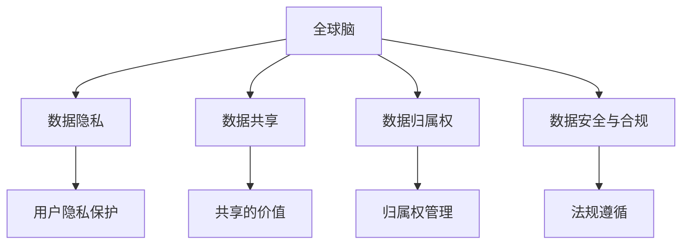
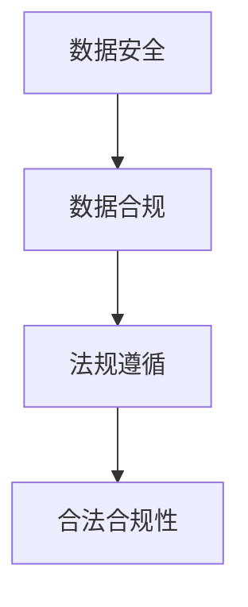
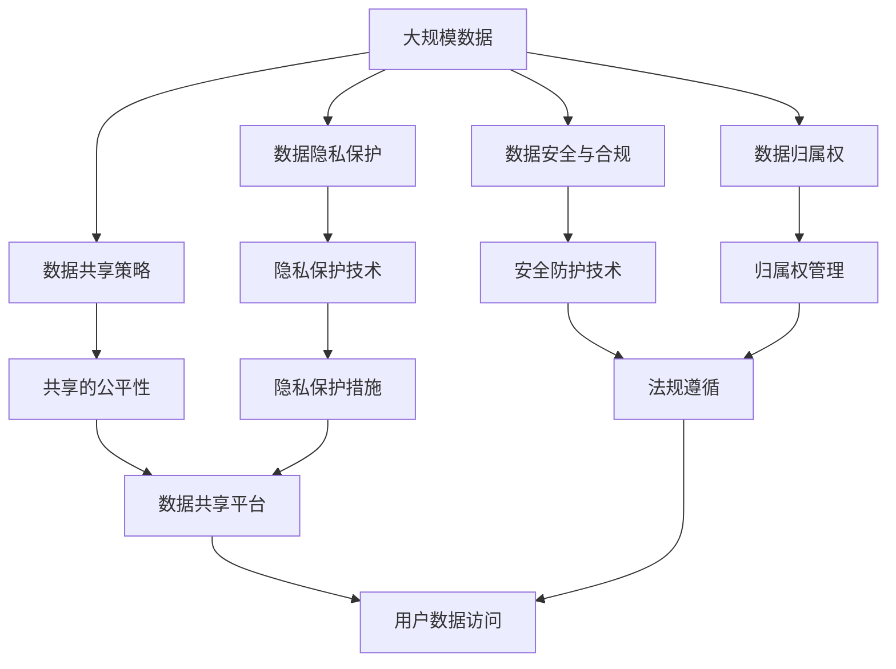

                 

# 全球脑的伦理困境：隐私与共享的平衡

## 1. 背景介绍

### 1.1 问题由来
在当前数字化、网络化的时代背景下，人类社会正经历着前所未有的变革。随着智能设备和互联网技术的普及，全球数据量呈指数级增长，数据流动变得前所未有的频繁。与此同时，数据的隐私和安全问题也随之凸显，引发了广泛的关注和讨论。

全球脑（Global Brain）指的是由全球范围内的信息网络、社交媒体、智能设备等构成的复杂系统。数据在这个系统中快速流动，为经济、科学、文化等领域的创新提供了前所未有的机遇。然而，随着数据的激增和应用场景的扩展，隐私与共享之间的平衡问题日益凸显，成为全球脑伦理困境的核心。

### 1.2 问题核心关键点
全球脑的伦理困境主要集中在以下几个方面：

1. **数据隐私保护**：如何在数据共享和使用的过程中，保护用户的隐私权。
2. **数据归属权**：数据由谁拥有，应如何管理和使用。
3. **数据安全与合规**：确保数据在传输和存储过程中不被非法访问和篡改，遵守相关法律法规。
4. **数据共享的价值**：如何在数据共享和获取之间找到最优平衡，最大化其社会和经济价值。

### 1.3 问题研究意义
探讨全球脑的伦理困境，对于推动数据科学、人工智能、网络安全等领域的可持续发展，具有重要意义：

1. **保障用户隐私**：确保用户数据的隐私权得到充分保护，是构建可信、安全的数字化社会的基础。
2. **促进数据共享**：合理平衡数据隐私与共享之间的关系，激发数据的最大价值，推动科技创新。
3. **规范数据管理**：制定和遵循数据管理的规范和标准，保障数据的安全和合规，促进数据健康发展。
4. **引导行业自律**：通过伦理规范和技术手段，引导行业内部自我约束，营造健康的数据生态。

## 2. 核心概念与联系

### 2.1 核心概念概述

为更好地理解全球脑的伦理困境，本节将介绍几个密切相关的核心概念：

- **全球脑（Global Brain）**：由全球范围内的信息网络、社交媒体、智能设备等构成的复杂系统。数据在其中快速流动，推动社会进步和创新。

- **数据隐私（Data Privacy）**：指个人信息在未经授权的情况下，不被泄露、篡改或滥用的权利。隐私保护是全球脑伦理困境的核心问题之一。

- **数据共享（Data Sharing）**：指将数据在特定的条件下，供他人或组织使用和分析的行为。数据共享是促进全球脑发展的关键手段。

- **数据归属权（Data Ownership）**：指数据的所有权和管理权归属问题。归属权决定数据的使用和管理方式。

- **数据安全与合规（Data Security and Compliance）**：指数据在传输和存储过程中，如何保障其不被非法访问和篡改，同时遵守相关法律法规。

这些核心概念之间的逻辑关系可以通过以下Mermaid流程图来展示：

这个流程图展示了大脑脑系统的核心概念及其之间的关系：

1. 全球脑通过信息网络、社交媒体、智能设备等，推动数据的快速流动。
2. 数据隐私保护、数据共享、数据归属权、数据安全与合规是大脑脑伦理困境的关键领域。
3. 用户隐私保护、共享的价值、归属权管理、法规遵循是数据伦理的主要方面。

### 2.2 概念间的关系

这些核心概念之间存在着紧密的联系，形成了全球脑伦理困境的完整生态系统。下面我通过几个Mermaid流程图来展示这些概念之间的关系。

#### 2.2.1 数据隐私与共享的关系

这个流程图展示了数据隐私与共享之间的动态关系：

1. 数据隐私是数据共享的前提条件，数据只有在保护好隐私的前提下才能被共享。
2. 数据共享能够带来社会和经济价值，但同时也存在隐私泄露的风险。
3. 需要在保护隐私和共享价值之间找到平衡，以最大化数据的社会效益。

#### 2.2.2 数据归属权与共享的关系

这个流程图展示了数据归属权与共享之间的法律关系：

1. 数据归属权决定数据的使用和管理方式，共享需要合法归属权的授权。
2. 共享的合法性需要依据归属权进行判断，确保共享不违反相关法律法规。
3. 归属权的合理性需要在不同利益相关方之间进行协调和平衡，确保公平性。

#### 2.2.3 数据安全与合规的关系

这个流程图展示了数据安全与合规之间的关系：

1. 数据安全保障数据在传输和存储过程中不被非法访问和篡改。
2. 数据合规需要遵循相关法律法规，确保数据使用的合法性。
3. 合规性是数据安全的基础，两者协同保障数据的合法和安全使用。

### 2.3 核心概念的整体架构

最后，我们用一个综合的流程图来展示这些核心概念在大脑脑系统中的整体架构：

这个综合流程图展示了从数据收集到使用的全过程，以及各环节的核心概念和关键技术：

1. 大规模数据通过数据隐私保护技术进行保护，确保数据不被滥用。
2. 数据共享策略需要考虑公平性和共享平台的建设。
3. 数据归属权决定数据的管理和权限，归属权管理需要在各方之间协调。
4. 数据安全与合规需要安全防护技术和法规遵循，确保数据合法使用。
5. 用户数据访问需要在隐私保护和归属权管理的基础上进行。

## 3. 核心算法原理 & 具体操作步骤

### 3.1 算法原理概述

全球脑的伦理困境主要涉及到数据隐私、数据共享、数据归属权和数据安全与合规等方面。本节将重点介绍如何在这些方面进行算法设计和技术实现。

#### 3.1.1 数据隐私保护算法

数据隐私保护算法旨在通过技术手段，在数据共享过程中，保护用户的隐私权。主要包括以下几种技术：

1. **差分隐私（Differential Privacy）**：在数据分析时，通过引入随机性，使得个体数据的泄露风险被极小化。
2. **同态加密（Homomorphic Encryption）**：在加密状态下进行数据处理，保护数据的原始内容不被泄露。
3. **隐私集（Privacy Sets）**：将数据集分成多个子集，每个子集包含部分用户数据，保障整体数据的隐私。

#### 3.1.2 数据共享算法

数据共享算法旨在通过技术手段，在保障数据隐私的前提下，促进数据的有效共享。主要包括以下几种技术：

1. **多方安全计算（Multi-party Computation）**：多个参与方在不泄露各自数据的前提下，进行联合计算。
2. **联邦学习（Federated Learning）**：多个客户端在本地训练模型，模型参数通过加密通道传输到中心服务器进行聚合。
3. **隐私保护协议（Privacy Preserving Protocols）**：通过特定的协议，保障数据共享过程中的隐私保护。

#### 3.1.3 数据归属权管理算法

数据归属权管理算法旨在通过技术手段，明确数据的归属权，保障数据的合法使用和管理。主要包括以下几种技术：

1. **区块链技术（Blockchain）**：通过区块链的不可篡改性，确保数据归属权的透明和可信。
2. **数字身份认证（Digital Identity Verification）**：通过数字身份认证，保障数据使用和管理的主体的合法性。
3. **数据使用授权（Data Access Authorization）**：通过授权机制，明确数据使用权限，保障数据的合法使用。

#### 3.1.4 数据安全与合规算法

数据安全与合规算法旨在通过技术手段，确保数据在传输和存储过程中的安全，遵守相关法律法规。主要包括以下几种技术：

1. **加密传输（Encrypted Communication）**：通过加密技术，保障数据在传输过程中的安全。
2. **访问控制（Access Control）**：通过访问控制技术，限制数据访问权限，保障数据的安全。
3. **合规检查（Compliance Check）**：通过合规检查机制，确保数据使用和管理符合相关法律法规。

### 3.2 算法步骤详解

下面将详细介绍这几种算法的详细步骤和技术实现：

#### 3.2.1 差分隐私算法

差分隐私算法的核心思想是在数据分析时引入随机性，使得个体数据的泄露风险被极小化。具体步骤如下：

1. **定义隐私预算**：确定允许的最大隐私损失程度，即差分隐私的预算值 $\epsilon$。
2. **数据扰动**：对原始数据进行扰动，引入随机噪声，使得数据难以被反向推断。
3. **数据发布**：将扰动后的数据发布到公开平台，供他人使用和分析。

数学上，差分隐私可以表示为：

$$
\begin{aligned}
&\text{隐私预算} \epsilon = \max_{x \in \mathcal{X}} \frac{1}{2} ||\text{D}(x) - \text{D}(x')||_{TV} \\
&\text{其中} \text{D}(x) = \frac{1}{\epsilon e^{\epsilon}} \sum_{x' \in \mathcal{X}} \exp(\frac{||x-x'||}{\epsilon})
\end{aligned}
$$

其中，$\text{D}(x)$ 表示数据分布，$\text{TV}$ 表示变分距离，$||\cdot||$ 表示距离度量。

#### 3.2.2 同态加密算法

同态加密算法的核心思想是在加密状态下进行数据处理，保护数据的原始内容不被泄露。具体步骤如下：

1. **数据加密**：将原始数据加密成密文，确保数据的原始内容不可被反向推断。
2. **加密计算**：在密文状态下进行计算，确保计算过程中的隐私保护。
3. **解密发布**：将计算结果解密成明文，供他人使用和分析。

数学上，同态加密可以表示为：

$$
\text{E}(x) \cdot \text{E}(y) = \text{E}(x+y)
$$

其中，$\text{E}(x)$ 表示数据加密函数，$\text{E}(x) \cdot \text{E}(y)$ 表示加密计算，$\text{E}(x+y)$ 表示解密后的结果。

#### 3.2.3 多方安全计算算法

多方安全计算算法的核心思想是多个参与方在不泄露各自数据的前提下，进行联合计算。具体步骤如下：

1. **输入加密**：每个参与方将自己的输入数据加密成密文，确保数据的隐私。
2. **多方计算**：在加密状态下，多个参与方联合计算，得到计算结果。
3. **输出解密**：将计算结果解密成明文，供多个参与方共同分析。

数学上，多方安全计算可以表示为：

$$
\text{E}(x_1, x_2, ..., x_n) = \text{E}(\text{MPC}(x_1, x_2, ..., x_n))
$$

其中，$\text{E}(x_1, x_2, ..., x_n)$ 表示多方安全计算，$\text{MPC}(x_1, x_2, ..., x_n)$ 表示多方计算过程，$\text{E}(\cdot)$ 表示输入加密。

#### 3.2.4 区块链技术

区块链技术的核心思想是通过分布式账本，确保数据归属权的透明和可信。具体步骤如下：

1. **数据上链**：将数据上链，确保数据的不可篡改性和透明性。
2. **分布式共识**：通过分布式共识算法，确保数据的合法性和可信性。
3. **数据查询**：通过智能合约，方便数据的查询和访问。

数学上，区块链技术可以表示为：

$$
\text{Blockchain} = (\text{Transaction}, \text{Block}, \text{Chain})
$$

其中，$\text{Transaction}$ 表示交易记录，$\text{Block}$ 表示区块，$\text{Chain}$ 表示链条。

#### 3.2.5 数字身份认证算法

数字身份认证算法的核心思想是通过数字身份认证，保障数据使用和管理的主体的合法性。具体步骤如下：

1. **身份注册**：用户进行身份注册，生成数字身份证书。
2. **身份验证**：用户在进行数据访问或使用前，进行身份验证，确保身份合法。
3. **身份授权**：用户在进行数据操作时，进行身份授权，确保操作合法。

数学上，数字身份认证可以表示为：

$$
\text{ID} = (\text{ID}_n, \text{Key}_n)
$$

其中，$\text{ID}_n$ 表示用户身份，$\text{Key}_n$ 表示用户密钥，确保身份验证的安全性和可靠性。

#### 3.2.6 加密传输算法

加密传输算法的核心思想是通过加密技术，保障数据在传输过程中的安全。具体步骤如下：

1. **数据加密**：将原始数据加密成密文，确保数据的隐私。
2. **加密传输**：在加密状态下进行数据传输，确保传输过程中的安全。
3. **解密接收**：将密文解密成明文，供接收方使用和分析。

数学上，加密传输可以表示为：

$$
\text{Enc}(x) = \text{C} \cdot x \cdot \text{D}
$$

其中，$\text{Enc}(x)$ 表示加密传输，$\text{C}$ 表示加密算法，$\text{D}$ 表示解密算法。

#### 3.2.7 访问控制算法

访问控制算法的核心思想是通过访问控制技术，限制数据访问权限，保障数据的安全。具体步骤如下：

1. **身份认证**：用户进行身份认证，确保身份合法。
2. **权限检查**：系统检查用户的权限，确保用户只能访问其有权限的数据。
3. **数据访问**：用户进行数据访问，确保数据的安全。

数学上，访问控制可以表示为：

$$
\text{Access}(x, \text{ID}) = \text{Permission}(x, \text{ID})
$$

其中，$\text{Access}(x, \text{ID})$ 表示访问控制，$\text{Permission}(x, \text{ID})$ 表示权限检查，确保数据的合法使用。

#### 3.2.8 合规检查算法

合规检查算法的核心思想是通过合规检查机制，确保数据使用和管理符合相关法律法规。具体步骤如下：

1. **数据采集**：收集数据使用和管理的信息，确保数据使用的合规性。
2. **合规检测**：通过合规检测机制，检查数据使用的合法性。
3. **违规处理**：对于违规行为，进行相应的处理，确保数据使用的合规性。

数学上，合规检查可以表示为：

$$
\text{Compliance}(x, \text{Policy}) = \text{Result}
$$

其中，$\text{Compliance}(x, \text{Policy})$ 表示合规检查，$\text{Policy}$ 表示合规政策，$\text{Result}$ 表示合规结果。

### 3.3 算法优缺点

全球脑伦理困境中的核心算法，既有其优势也有其局限性。

#### 3.3.1 差分隐私算法的优缺点

差分隐私算法的优点在于：

1. **隐私保护**：在数据分析时引入随机性，保护个体数据的隐私。
2. **可解释性**：差分隐私算法通过设定隐私预算，明确隐私保护的程度，具有较好的可解释性。

差分隐私算法的缺点在于：

1. **数据失真**：引入随机性导致数据的失真，可能影响数据分析的准确性。
2. **计算复杂**：差分隐私算法的计算复杂度较高，不适合大规模数据集。

#### 3.3.2 同态加密算法的优缺点

同态加密算法的优点在于：

1. **隐私保护**：在加密状态下进行计算，保护数据的原始内容。
2. **计算效率**：同态加密算法在加密状态下进行计算，计算效率较高。

同态加密算法的缺点在于：

1. **实现复杂**：同态加密算法的实现较为复杂，需要具备较高的技术水平。
2. **性能开销**：同态加密算法的性能开销较大，可能影响计算速度。

#### 3.3.3 多方安全计算算法的优缺点

多方安全计算算法的优点在于：

1. **隐私保护**：多个参与方在不泄露各自数据的前提下，进行联合计算，保护数据的隐私。
2. **可扩展性**：多方安全计算算法适用于多个参与方联合计算的场景，具有较好的可扩展性。

多方安全计算算法的缺点在于：

1. **通信开销**：多方安全计算算法的通信开销较大，可能影响计算速度。
2. **实现复杂**：多方安全计算算法的实现较为复杂，需要具备较高的技术水平。

#### 3.3.4 区块链技术的优缺点

区块链技术的优点在于：

1. **透明性**：区块链技术的分布式账本确保数据的透明性，方便数据的管理和查询。
2. **安全性**：区块链技术的不可篡改性保障数据的安全性，防止数据的篡改和滥用。

区块链技术的缺点在于：

1. **计算开销**：区块链技术的计算开销较大，可能影响系统的性能。
2. **隐私风险**：区块链技术的透明性可能带来隐私风险，数据被公开的风险较大。

#### 3.3.5 数字身份认证算法的优缺点

数字身份认证算法的优点在于：

1. **身份验证**：通过数字身份认证，确保用户身份的合法性。
2. **安全性**：数字身份认证算法通过加密技术，保障身份验证的安全性。

数字身份认证算法的缺点在于：

1. **实现复杂**：数字身份认证算法的实现较为复杂，需要具备较高的技术水平。
2. **用户便利性**：数字身份认证算法的用户便利性较低，用户需要进行身份注册和验证。

#### 3.3.6 加密传输算法的优缺点

加密传输算法的优点在于：

1. **隐私保护**：通过加密技术，保障数据在传输过程中的安全。
2. **可扩展性**：加密传输算法适用于大规模数据集，具有较好的可扩展性。

加密传输算法的缺点在于：

1. **计算开销**：加密传输算法的计算开销较大，可能影响计算速度。
2. **实现复杂**：加密传输算法的实现较为复杂，需要具备较高的技术水平。

#### 3.3.7 访问控制算法的优缺点

访问控制算法的优点在于：

1. **隐私保护**：通过访问控制技术，限制数据访问权限，保护数据的隐私。
2. **可扩展性**：访问控制算法适用于多种场景，具有较好的可扩展性。

访问控制算法的缺点在于：

1. **实现复杂**：访问控制算法的实现较为复杂，需要具备较高的技术水平。
2. **用户便利性**：访问控制算法的用户便利性较低，用户需要进行身份认证和权限检查。

#### 3.3.8 合规检查算法的优缺点

合规检查算法的优点在于：

1. **合规性**：通过合规检查机制，确保数据使用和管理符合相关法律法规。
2. **透明性**：合规检查算法通过记录数据使用和管理的信息，确保数据使用的合规性。

合规检查算法的缺点在于：

1. **计算开销**：合规检查算法的计算开销较大，可能影响系统的性能。
2. **用户便利性**：合规检查算法的用户便利性较低，用户需要进行数据采集和合规检测。

### 3.4 算法应用领域

全球脑伦理困境中的核心算法，已经在多个领域得到了广泛应用。

#### 3.4.1 数据隐私保护

数据隐私保护算法主要应用于数据共享和数据使用场景中，确保个体数据的隐私安全。

**应用场景**：

1. **医疗数据隐私保护**：在医疗数据共享和研究中，通过差分隐私和同态加密算法，保护患者隐私。
2. **金融数据隐私保护**：在金融数据共享和分析中，通过区块链技术和数字身份认证算法，保护用户隐私。
3. **社交媒体数据隐私保护**：在社交媒体数据共享和分析中，通过加密传输算法和访问控制算法，保护用户隐私。

#### 3.4.2 数据共享

数据共享算法主要应用于数据共享和联合计算场景中，确保数据共享的公平性和可扩展性。

**应用场景**：

1. **学术数据共享**：在学术研究中，通过多方安全计算算法，确保多个研究机构联合分析数据。
2. **企业数据共享**：在企业数据共享和联合计算中，通过联邦学习算法，确保数据共享的公平性和安全。
3. **公共数据共享**：在公共数据共享中，通过隐私保护协议，确保数据共享的公平性和可扩展性。

#### 3.4.3 数据归属权管理

数据归属权管理算法主要应用于数据管理和权限控制场景中，确保数据的合法使用和管理。

**应用场景**：

1. **知识产权管理**：在知识产权保护中，通过区块链技术，确保数据的归属权透明和可信。
2. **数据治理**：在数据治理中，通过数字身份认证算法，确保数据管理的主体的合法性。
3. **数据共享平台**：在数据共享平台中，通过数据使用授权机制，确保数据的合法使用。

#### 3.4.4 数据安全与合规

数据安全与合规算法主要应用于数据传输和存储场景中，确保数据的安全和合规。

**应用场景**：

1. **网络安全**：在网络传输中，通过加密传输算法和访问控制算法，确保数据的安全。
2. **数据存储**：在数据存储中，通过合规检查算法，确保数据使用的合规性。
3. **隐私保护协议**：在数据共享和联合计算中，通过隐私保护协议，确保数据的安全和合规。

## 4. 数学模型和公式 & 详细讲解 & 举例说明

### 4.1 数学模型构建

全球脑伦理困境中的核心算法，可以抽象为以下几个数学模型：

1. **差分隐私模型**：

$$
\begin{aligned}
&\text{隐私预算} \epsilon = \max_{x \in \mathcal{X}} \frac{1}{2} ||\text{D}(x) - \text{D}(x')||_{TV} \\
&\text{其中} \text{D}(x) = \frac{1}{\epsilon e^{\epsilon}} \sum_{x' \in \mathcal{X}} \exp(\frac{||x-x'||}{\epsilon})
\end{aligned}
$$

2. **同态加密模型**：

$$
\text{E}(x) \cdot \text{E}(y) = \text{E}(x+y)
$$

3. **多方安全计算模型**：

$$
\text{E}(x_1, x_2, ..., x_n) = \text{E}(\text{MPC}(x_1, x_2, ..., x_n))
$$

4. **区块链模型**：

$$
\text{Blockchain} = (\text{Transaction}, \text{Block}, \text{Chain})
$$

5. **数字身份认证模型**：

$$
\text{ID} = (\text{ID}_n, \text{Key}_n)
$$

6. **加密传输模型**：

$$
\text{Enc}(x) = \text{C} \cdot x \cdot \text{D}
$$

7. **访问控制模型**：

$$
\text{Access}(x, \text{ID}) = \text{Permission}(x, \text{ID})
$$

8. **合规检查模型**：

$$
\text{Compliance}(x, \text{Policy}) = \text{Result}
$$

### 4.2 公式推导过程

以下将详细介绍这些数学模型的推导过程：

#### 4.2.1 差分隐私模型推导

差分隐私模型通过引入随机性，确保个体数据的隐私。其推导过程如下：

1. **隐私预算定义**：

$$
\epsilon = \max_{x \in \mathcal{X}} \frac{1}{2} ||\text{D}(x) - \text{D}(x')||_{TV}
$$

其中，$\epsilon$ 为隐私预算，$\text{D}(x)$ 表示数据分布，$||\cdot||_{TV}$ 表示变分距离。

2. **数据扰动**：

$$
\text{D}_\epsilon(x) = \frac{1}{\epsilon e^{\epsilon}} \sum_{x' \in \mathcal{X}} \exp(\frac{||x-x'||}{

