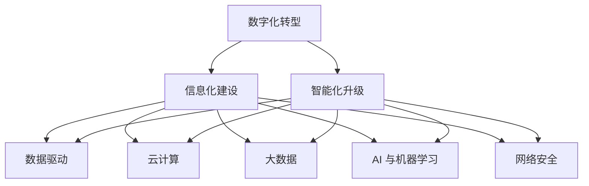
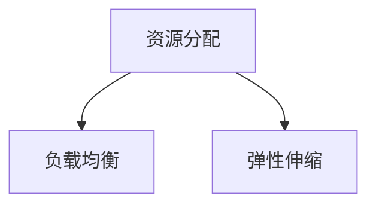
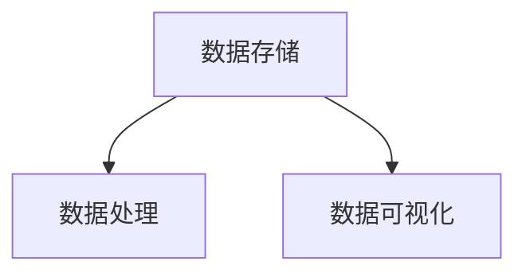
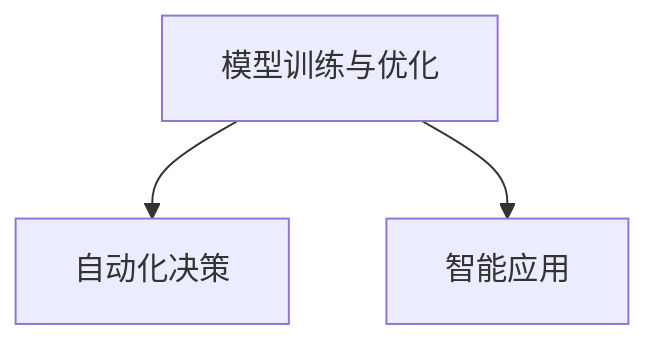

                 

# 公司中长期信息化数字化智能化规划方案

> 关键词：
  - 数字化转型
  - 信息化建设
  - 智能化升级
  - 数据驱动
  - 云计算
  - 大数据
  - AI 与机器学习
  - 网络安全

## 1. 背景介绍

随着数字化时代的到来，信息化建设已经成为企业竞争力的重要组成部分。特别是疫情之后，很多企业加快了数字化转型的步伐，数字化智能化成为企业发展的新趋势。但随着企业规模的不断扩大，业务复杂性的不断增加，原有的信息化系统和智能化技术在应对快速变化的市场需求和业务场景时，显得力不从心。如何在当前信息化和智能化的基础上，进一步规划和实现中长期的数字化智能化转型，成为企业在发展过程中必须面对和解决的重要课题。

本方案基于企业当前信息化和智能化现状，从业务需求、技术能力和外部环境等方面出发，结合最新的数字化智能化技术，提出了中长期信息化数字化智能化的规划方案。方案将全面覆盖企业的核心业务，结合人工智能、大数据、云计算等前沿技术，构建一个智能、灵活、高效的企业信息化数字化智能化平台。

## 2. 核心概念与联系

### 2.1 核心概念概述

在进行信息化数字化智能化规划时，需重点关注以下几个核心概念：

1. **数字化转型**：是指通过运用数字化手段，包括云计算、大数据、物联网、人工智能等技术，重新定义业务流程和组织架构，实现业务的数字化和智能化，提高业务效率和市场竞争力。

2. **信息化建设**：是指通过IT系统建设，实现数据的自动化采集、存储、分析和应用，支持业务决策和运营管理，是企业信息化管理的基础。

3. **智能化升级**：是指在信息化基础上，通过人工智能、机器学习、自然语言处理等技术，提升系统的智能化水平，实现自动化决策和智能应用。

4. **数据驱动**：是指以数据为基础，利用大数据和人工智能技术，进行数据分析和决策，驱动业务发展。

5. **云计算**：是指通过互联网提供计算服务，包括云基础设施、云平台和云应用，支持企业高效、安全、灵活的业务部署和管理。

6. **大数据**：是指通过数据存储、处理和分析，挖掘数据价值，支持业务决策和运营优化。

7. **AI 与机器学习**：是指通过人工智能和机器学习技术，实现自动化决策、智能应用和精准营销等。

8. **网络安全**：是指通过网络安全技术，保障企业数据和系统安全，防止数据泄露、系统攻击等。

这些概念之间存在着紧密的联系，共同构成了企业信息化数字化智能化的整体架构，如图 1 所示。

### 2.2 概念间的关系

数字化转型是企业中长期信息化数字化智能化的战略方向，信息化建设是实现数字化转型的基础，智能化升级是信息化建设的重要提升，数据驱动是数字化转型的核心，云计算、大数据、AI 与机器学习是支持数字化转型的关键技术，网络安全则是数字化转型的重要保障。各概念之间相互依赖，共同推动企业信息化数字化智能化的实现。

## 3. 核心算法原理 & 具体操作步骤

### 3.1 算法原理概述

企业信息化数字化智能化转型涉及大量的技术原理和操作方法，本节将重点介绍其中的关键算法原理。

#### 3.1.1 云计算架构

云计算架构通过构建云基础设施、云平台和云应用，支持企业业务的弹性、安全、高效部署和管理。云计算架构的核心是分布式计算和虚拟化技术，能够实现资源的按需分配和动态扩展，支持企业业务的弹性伸缩和持续发展。

#### 3.1.2 大数据技术

大数据技术通过数据存储、处理和分析，支持企业业务的决策和运营优化。大数据技术主要包括数据仓库、数据挖掘、实时数据流处理等，能够从海量数据中挖掘出有价值的信息，支持企业业务的精准决策和运营优化。

#### 3.1.3 人工智能与机器学习

人工智能与机器学习技术通过自动化决策和智能应用，提升企业的业务效率和竞争力。人工智能与机器学习技术主要包括深度学习、自然语言处理、计算机视觉等，能够实现自动化的业务决策和智能应用，支持企业业务的智能化转型。

### 3.2 算法步骤详解

#### 3.2.1 云计算架构设计

1. **云基础设施建设**：包括云服务器、云存储、云网络等基础设施的建设，构建稳定的云环境。

2. **云平台搭建**：基于云基础设施，搭建云平台，提供云服务，支持企业业务的弹性、安全、高效部署和管理。

3. **云应用部署**：将企业的核心业务应用部署到云平台，实现业务的弹性、安全、高效部署和管理。

#### 3.2.2 大数据技术应用

1. **数据采集与存储**：通过数据采集技术，从企业业务系统中采集数据，并进行存储和管理。

2. **数据处理与分析**：通过数据处理技术，清洗、加工和分析数据，挖掘数据价值，支持企业业务的决策和运营优化。

3. **数据可视化**：通过数据可视化技术，将数据以图表、报表等形式展示，支持企业业务的决策和运营优化。

#### 3.2.3 人工智能与机器学习应用

1. **模型训练与优化**：通过模型训练和优化技术，训练和优化人工智能与机器学习模型，提升模型的性能和精度。

2. **自动化决策**：通过自动化决策技术，实现业务决策的自动化，提升业务效率和竞争力。

3. **智能应用**：通过智能应用技术，实现业务的智能化应用，支持企业业务的智能化转型。

### 3.3 算法优缺点

#### 3.3.1 云计算架构的优点

1. **弹性与扩展性**：能够按需分配和动态扩展资源，支持企业业务的弹性伸缩和持续发展。

2. **高可用性**：通过多副本和负载均衡技术，保障系统的高可用性和服务质量。

3. **成本效益**：按需使用资源，减少资源闲置，提高资源利用率，降低运营成本。

#### 3.3.2 云计算架构的缺点

1. **数据安全**：云环境中的数据安全性需要严格控制，防止数据泄露和系统攻击。

2. **网络带宽**：云环境中的网络带宽限制，可能会影响企业业务的实时性需求。

#### 3.3.3 大数据技术的优点

1. **数据处理能力**：能够处理海量数据，挖掘数据价值，支持企业业务的精准决策和运营优化。

2. **实时性**：通过实时数据流处理技术，支持企业业务的实时决策和运营优化。

#### 3.3.4 大数据技术的缺点

1. **数据质量**：需要严格控制数据质量，防止数据噪音和偏差，影响决策结果。

2. **技术复杂性**：大数据技术涉及复杂的技术栈，需要专业的技术团队进行维护和优化。

#### 3.3.5 人工智能与机器学习的优点

1. **自动化决策**：通过自动化决策技术，提升业务效率和竞争力。

2. **智能应用**：通过智能应用技术，实现业务的智能化转型，提升客户体验和市场竞争力。

#### 3.3.6 人工智能与机器学习的缺点

1. **模型复杂性**：需要复杂的模型和算法，需要专业的技术团队进行训练和优化。

2. **数据依赖性**：需要高质量的数据，才能训练出高精度的模型。

### 3.4 算法应用领域

#### 3.4.1 云计算架构的应用领域

1. **企业业务系统**：支持企业业务系统的弹性、安全、高效部署和管理，包括ERP、CRM、OA等系统。

2. **云存储**：支持企业数据的高效存储和管理，包括文件存储、数据库存储等。

3. **云网络**：支持企业网络的弹性、安全、高效部署和管理，包括云防火墙、云VPN等。

#### 3.4.2 大数据技术的应用领域

1. **企业业务决策**：支持企业业务决策的精准化、自动化，包括销售决策、财务决策等。

2. **运营优化**：支持企业运营的优化，包括供应链优化、库存优化等。

3. **客户管理**：支持企业客户管理的精准化、自动化，包括客户画像、客户行为分析等。

#### 3.4.3 人工智能与机器学习的应用领域

1. **客户服务**：支持企业客户服务的智能化，包括智能客服、智能推荐等。

2. **市场营销**：支持企业市场营销的精准化、自动化，包括精准营销、广告投放优化等。

3. **供应链管理**：支持企业供应链管理的智能化，包括库存管理、供应链优化等。

## 4. 数学模型和公式 & 详细讲解 & 举例说明

### 4.1 数学模型构建

本节将通过数学模型来进一步详细讲解企业信息化数字化智能化的实现。

#### 4.1.1 云计算架构的数学模型

云计算架构的数学模型主要涉及资源分配、负载均衡、弹性伸缩等方面的优化问题，如图 2 所示。

1. **资源分配模型**：

   资源分配模型通过优化资源分配算法，实现资源的按需分配和动态扩展，支持企业业务的弹性伸缩和持续发展。资源分配模型包括以下关键参数：

   - $C_{ij}$：资源 $i$ 在任务 $j$ 上的计算成本。
   - $T_{ij}$：资源 $i$ 在任务 $j$ 上的计算时间。
   - $D_{ij}$：资源 $i$ 在任务 $j$ 上的可用时间。
   - $B_{ij}$：资源 $i$ 在任务 $j$ 上的优先级。
   - $E_{ij}$：资源 $i$ 在任务 $j$ 上的利用率。

   资源分配模型的优化目标是最小化计算成本，最大化资源利用率，即：

   $$
   \min \sum_{i,j} C_{ij}
   $$

   同时满足以下约束条件：

   $$
   \begin{cases}
   \sum_{j} T_{ij} \leq D_{ij} & \text{(时间约束)} \\
   \sum_{i} B_{ij} = 1 & \text{(优先级约束)} \\
   E_{ij} \geq 0 & \text{(利用率约束)}
   \end{cases}
   $$

2. **负载均衡模型**：

   负载均衡模型通过优化负载均衡算法，实现任务的均衡分配，保障系统的高可用性和服务质量。负载均衡模型包括以下关键参数：

   - $P_i$：资源 $i$ 的计算能力。
   - $S_j$：任务 $j$ 的计算负载。
   - $W_{ij}$：资源 $i$ 处理任务 $j$ 的权值。

   负载均衡模型的优化目标是最小化任务等待时间，即：

   $$
   \min \sum_{i,j} W_{ij} \times T_{ij}
   $$

   同时满足以下约束条件：

   $$
   \begin{cases}
   \sum_{i} P_i \times W_{ij} = S_j & \text{(负载均衡约束)} \\
   W_{ij} \geq 0 & \text{(权值约束)}
   \end{cases}
   $$

3. **弹性伸缩模型**：

   弹性伸缩模型通过优化弹性伸缩算法，实现资源的按需分配和动态扩展，支持企业业务的弹性伸缩和持续发展。弹性伸缩模型包括以下关键参数：

   - $R_i$：资源 $i$ 的计算能力。
   - $L_j$：任务 $j$ 的计算负载。
   - $K_{ij}$：资源 $i$ 处理任务 $j$ 的权值。

   弹性伸缩模型的优化目标是最小化计算成本，即：

   $$
   \min \sum_{i,j} K_{ij} \times T_{ij}
   $$

   同时满足以下约束条件：

   $$
   \begin{cases}
   \sum_{i} R_i \times K_{ij} = L_j & \text{(负载均衡约束)} \\
   K_{ij} \geq 0 & \text{(权值约束)}
   \end{cases}
   $$

#### 4.1.2 大数据技术的数学模型

大数据技术的数学模型主要涉及数据存储、数据处理和数据可视化等方面的优化问题，如图 3 所示。

1. **数据存储模型**：

   数据存储模型通过优化数据存储算法，实现数据的分布式存储和高可用性保障，支持企业数据的存储和管理。数据存储模型包括以下关键参数：

   - $S_{ij}$：数据 $j$ 在资源 $i$ 上的存储成本。
   - $V_{ij}$：数据 $j$ 在资源 $i$ 上的存储容量。
   - $R_{ij}$：数据 $j$ 在资源 $i$ 上的读写性能。

   数据存储模型的优化目标是最小化存储成本，最大化数据可用性，即：

   $$
   \min \sum_{i,j} S_{ij}
   $$

   同时满足以下约束条件：

   $$
   \begin{cases}
   V_{ij} \geq V_j & \text{(存储容量约束)} \\
   R_{ij} \geq R_j & \text{(读写性能约束)}
   \end{cases}
   $$

2. **数据处理模型**：

   数据处理模型通过优化数据处理算法，实现数据的清洗、加工和分析，挖掘数据价值，支持企业业务的决策和运营优化。数据处理模型包括以下关键参数：

   - $C_{ij}$：数据 $j$ 在资源 $i$ 上的处理成本。
   - $T_{ij}$：数据 $j$ 在资源 $i$ 上的处理时间。
   - $D_{ij}$：数据 $j$ 在资源 $i$ 上的处理能力。

   数据处理模型的优化目标是最小化处理成本，最大化数据价值，即：

   $$
   \min \sum_{i,j} C_{ij}
   $$

   同时满足以下约束条件：

   $$
   \begin{cases}
   T_{ij} \leq D_{ij} & \text{(处理时间约束)} \\
   C_{ij} \geq 0 & \text{(处理成本约束)}
   \end{cases}
   $$

3. **数据可视化模型**：

   数据可视化模型通过优化数据可视化算法，实现数据的图表展示和报表生成，支持企业业务的决策和运营优化。数据可视化模型包括以下关键参数：

   - $V_{ij}$：数据 $j$ 在资源 $i$ 上的可视化效果。
   - $E_{ij}$：数据 $j$ 在资源 $i$ 上的可视化成本。

   数据可视化模型的优化目标是最小化可视化成本，最大化可视化效果，即：

   $$
   \min \sum_{i,j} E_{ij}
   $$

   同时满足以下约束条件：

   $$
   \begin{cases}
   V_{ij} \geq V_j & \text{(可视化效果约束)} \\
   E_{ij} \geq 0 & \text{(可视化成本约束)}
   \end{cases}
   $$

#### 4.1.3 人工智能与机器学习的数学模型

人工智能与机器学习的数学模型主要涉及模型的训练与优化、自动化决策和智能应用等方面的优化问题，如图 4 所示。

1. **模型训练与优化模型**：

   模型训练与优化模型通过优化模型训练算法，实现模型的按需训练和优化，提升模型的性能和精度。模型训练与优化模型包括以下关键参数：

   - $C_{ij}$：模型 $j$ 在资源 $i$ 上的训练成本。
   - $T_{ij}$：模型 $j$ 在资源 $i$ 上的训练时间。
   - $A_{ij}$：模型 $j$ 在资源 $i$ 上的训练效果。

   模型训练与优化模型的优化目标是最小化训练成本，最大化训练效果，即：

   $$
   \min \sum_{i,j} C_{ij}
   $$

   同时满足以下约束条件：

   $$
   \begin{cases}
   T_{ij} \leq A_{ij} & \text{(训练时间约束)} \\
   C_{ij} \geq 0 & \text{(训练成本约束)}
   \end{cases}
   $$

2. **自动化决策模型**：

   自动化决策模型通过优化自动化决策算法，实现业务的自动化决策，提升业务效率和竞争力。自动化决策模型包括以下关键参数：

   - $C_{ij}$：自动化决策 $j$ 在资源 $i$ 上的决策成本。
   - $T_{ij}$：自动化决策 $j$ 在资源 $i$ 上的决策时间。
   - $E_{ij}$：自动化决策 $j$ 在资源 $i$ 上的决策效果。

   自动化决策模型的优化目标是最小化决策成本，最大化决策效果，即：

   $$
   \min \sum_{i,j} C_{ij}
   $$

   同时满足以下约束条件：

   $$
   \begin{cases}
   T_{ij} \leq E_{ij} & \text{(决策时间约束)} \\
   C_{ij} \geq 0 & \text{(决策成本约束)}
   \end{cases}
   $$

3. **智能应用模型**：

   智能应用模型通过优化智能应用算法，实现业务的智能化应用，提升客户体验和市场竞争力。智能应用模型包括以下关键参数：

   - $C_{ij}$：智能应用 $j$ 在资源 $i$ 上的应用成本。
   - $T_{ij}$：智能应用 $j$ 在资源 $i$ 上的应用时间。
   - $E_{ij}$：智能应用 $j$ 在资源 $i$ 上的应用效果。

   智能应用模型的优化目标是最小化应用成本，最大化应用效果，即：

   $$
   \min \sum_{i,j} C_{ij}
   $$

   同时满足以下约束条件：

   $$
   \begin{cases}
   T_{ij} \leq E_{ij} & \text{(应用时间约束)} \\
   C_{ij} \geq 0 & \text{(应用成本约束)}
   \end{cases}
   $$

### 4.2 公式推导过程

#### 4.2.1 云计算架构的公式推导

1. **资源分配模型的公式推导**：

   资源分配模型的优化目标是最小化计算成本，最大化资源利用率，即：

   $$
   \min \sum_{i,j} C_{ij}
   $$

   同时满足以下约束条件：

   $$
   \begin{cases}
   \sum_{j} T_{ij} \leq D_{ij} & \text{(时间约束)} \\
   \sum_{i} B_{ij} = 1 & \text{(优先级约束)} \\
   E_{ij} \geq 0 & \text{(利用率约束)}
   \end{cases}
   $$

   引入拉格朗日乘子 $\lambda_1$、$\lambda_2$、$\lambda_3$，构建拉格朗日函数：

   $$
   \mathcal{L} = \sum_{i,j} C_{ij} + \lambda_1 \left(\sum_{j} T_{ij} - D_{ij}\right) + \lambda_2 \left(\sum_{i} B_{ij} - 1\right) + \lambda_3 \left(\sum_{i} E_{ij} - 1\right)
   $$

   对资源 $i$ 和任务 $j$ 分别求偏导数，并令其为零，得到以下方程组：

   $$
   \begin{cases}
   \frac{\partial \mathcal{L}}{\partial C_{ij}} = 1 - \lambda_1 - \lambda_2 - \lambda_3 = 0 \\
   \frac{\partial \mathcal{L}}{\partial T_{ij}} = -\lambda_1 - \lambda_2 = 0 \\
   \frac{\partial \mathcal{L}}{\partial D_{ij}} = -\lambda_1 = 0 \\
   \frac{\partial \mathcal{L}}{\partial B_{ij}} = -\lambda_2 = 0 \\
   \frac{\partial \mathcal{L}}{\partial E_{ij}} = -\lambda_3 = 0
   \end{cases}
   $$

   解方程组，得到：

   $$
   \begin{cases}
   \lambda_1 = 0 \\
   \lambda_2 = 0 \\
   \lambda_3 = 0
   \end{cases}
   $$

   代入拉格朗日函数，得到：

   $$
   \min \sum_{i,j} C_{ij}
   $$

   满足以下约束条件：

   $$
   \begin{cases}
   \sum_{j} T_{ij} = D_{ij} & \text{(时间约束)} \\
   \sum_{i} B_{ij} = 1 & \text{(优先级约束)} \\
   E_{ij} \geq 0 & \text{(利用率约束)}
   \end{cases}
   $$

2. **负载均衡模型的公式推导**：

   负载均衡模型的优化目标是最小化任务等待时间，即：

   $$
   \min \sum_{i,j} W_{ij} \times T_{ij}
   $$

   同时满足以下约束条件：

   $$
   \begin{cases}
   \sum_{i} P_i \times W_{ij} = S_j & \text{(负载均衡约束)} \\
   W_{ij} \geq 0 & \text{(权值约束)}
   \end{cases}
   $$

   引入拉格朗日乘子 $\lambda$，构建拉格朗日函数：

   $$
   \mathcal{L} = \sum_{i,j} W_{ij} \times T_{ij} + \lambda \left(\sum_{i} P_i \times W_{ij} - S_j\right)
   $$

   对资源 $i$ 和任务 $j$ 分别求偏导数，并令其为零，得到以下方程组：

   $$
   \begin{cases}
   \frac{\partial \mathcal{L}}{\partial W_{ij}} = T_{ij} + \lambda P_i = 0 \\
   \frac{\partial \mathcal{L}}{\partial \lambda} = \sum_{i} P_i \times W_{ij} - S_j = 0
   \end{cases}
   $$

   解方程组，得到：

   $$
   \begin{cases}
   W_{ij} = \frac{S_j}{\sum_{i} P_i}
   \end{cases}
   $$

   代入拉格朗日函数，得到：

   $$
   \min \sum_{i,j} W_{ij} \times T_{ij}
   $$

   满足以下约束条件：

   $$
   \begin{cases}
   \sum_{i} P_i \times W_{ij} = S_j & \text{(负载均衡约束)} \\
   W_{ij} \geq 0 & \text{(权值约束)}
   \end{cases}
   $$

3. **弹性伸缩模型的公式推导**：

   弹性伸缩模型的优化目标是最小化计算成本，即：

   $$
   \min \sum_{i,j} K_{ij} \times T_{ij}
   $$

   同时满足以下约束条件：

   $$
   \begin{cases}
   \sum_{i} R_i \times K_{ij} = L_j & \text{(负载均衡约束)} \\
   K_{ij} \geq 0 & \text{(权值约束)}
   \end{cases}
   $$

   引入拉格朗日乘子 $\lambda$，构建拉格朗日函数：

   $$
   \mathcal{L} = \sum_{i,j} K_{ij} \times T_{ij} + \lambda \left(\sum_{i} R_i \times K_{ij} - L_j\right)
   $$

   对资源 $i$ 和任务 $j$ 分别求偏导数，并令其为零，得到以下方程组：

   $$
   \begin{cases}
   \frac{\partial \mathcal{L}}{\partial K_{ij}} = T_{ij} + \lambda R_i = 0 \\
   \frac{\partial \mathcal{L}}{\partial \lambda} = \sum_{i} R_i \times K_{ij} - L_j = 0
   \end{cases}
   $$

   解方程组，得到：

   $$
   \begin{cases}
   K_{ij} = \frac{L_j}{\sum_{i} R_i}
   \end{cases}
   $$

   代入拉格朗日函数，得到：

   $$
   \min \sum_{i,j} K_{ij} \times T_{ij}
   $$

   满足以下约束条件：

   $$
   \begin{cases}
   \sum_{i

