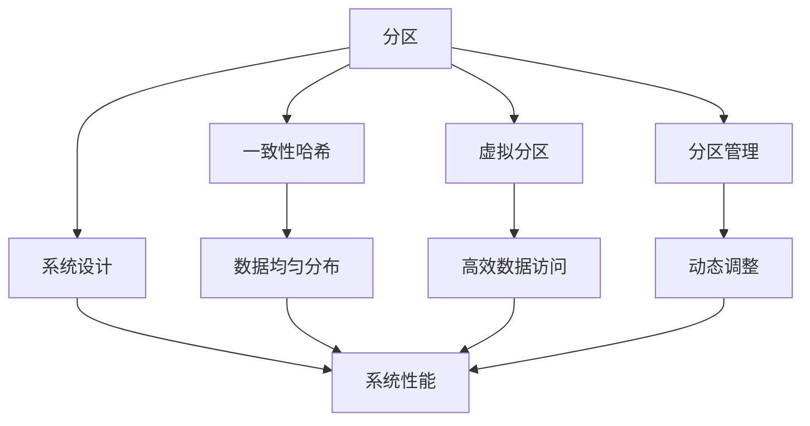
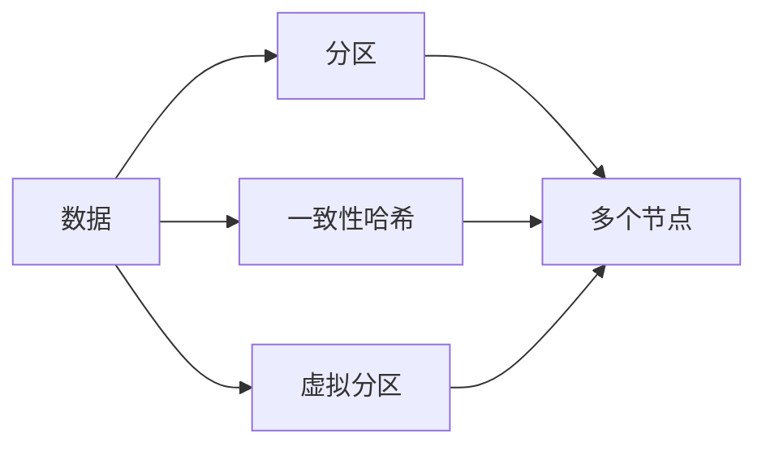
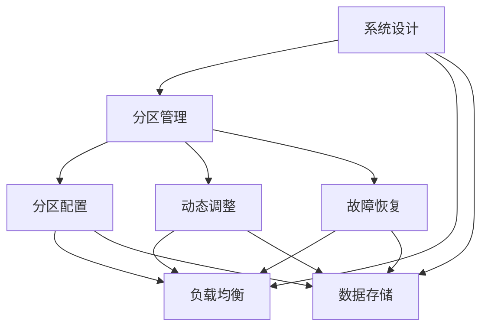
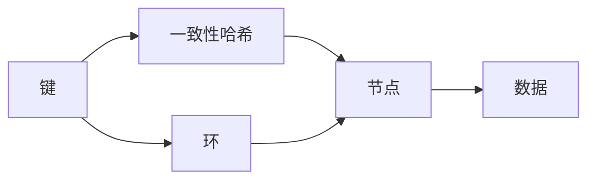
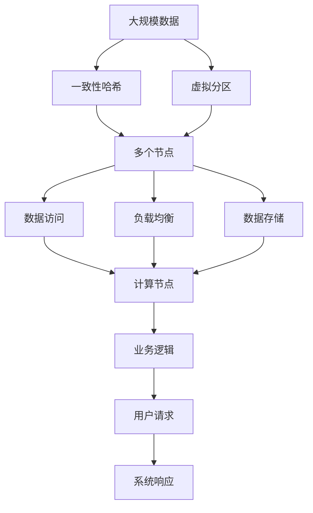

                 

# 分区 原理与代码实例讲解

> 关键词：分区,分布式系统,分区算法,一致性哈希,虚拟分区,分区管理,系统设计

## 1. 背景介绍

### 1.1 问题由来
在大规模分布式系统中，由于数据的规模不断增长，存储和计算资源的需求也在急剧上升。为了高效利用这些资源，我们需要对数据进行分区（Partitioning），将大规模的数据集划分为多个小规模的数据片段，使得各个节点可以独立处理部分数据，从而提高系统的整体性能和扩展性。

但是，数据分区不仅仅是一个技术问题，还涉及到系统架构、数据访问模式、性能调优等多个方面。一个设计良好的分区方案，可以显著提升系统的扩展性、可用性和维护性。

### 1.2 问题核心关键点
数据分区的主要挑战包括：
- 如何合理地将数据分割成多个部分？
- 如何保证各个分区之间的数据访问均衡？
- 如何处理节点故障或增加节点时的分区重分配？
- 如何保证数据一致性和完整性？

分区方案的好坏，直接影响到系统的性能、稳定性和可靠性。一个好的分区方案，应该在高效性、一致性、可扩展性和容错性之间找到平衡。

### 1.3 问题研究意义
研究数据分区方法，对于构建高效、可扩展、高可用的大规模分布式系统，具有重要意义：

1. 提高系统性能。通过数据分区，系统可以并行处理大量数据，提升计算效率。
2. 增强系统可扩展性。分区使系统更容易水平扩展，支持更多的数据和计算节点。
3. 降低维护成本。分区后，每个节点处理的数据规模更小，更容易进行故障恢复和性能调优。
4. 提升数据可靠性。通过合理的数据冗余和分区策略，可以降低单点故障风险。

## 2. 核心概念与联系

### 2.1 核心概念概述

为更好地理解数据分区的方法，本节将介绍几个密切相关的核心概念：

- 分区（Partitioning）：将数据集划分成多个部分，每个部分存储在不同的节点上，以便于并行处理和水平扩展。
- 一致性哈希（Consistent Hashing）：一种常用的分区算法，通过将数据的键映射到一个环上，将数据均匀地分布在多个节点上。
- 虚拟分区（Virtual Partitioning）：将数据按照某些维度（如时间戳、用户ID等）进行划分，使得数据访问更加高效。
- 分区管理（Partition Management）：包括分区配置、动态调整、故障恢复等操作，确保数据分区的正确性和可用性。
- 系统设计（System Design）：将分区方案与其他系统组件（如负载均衡、数据存储、网络拓扑等）进行合理配置，构建高效、可靠的系统架构。

这些核心概念之间的逻辑关系可以通过以下Mermaid流程图来展示：



这个流程图展示了一些关键概念及其之间的关系：

1. 分区将数据划分成多个部分，通过一致性哈希和虚拟分区算法，使得数据均匀分布在多个节点上。
2. 分区管理负责配置、调整和恢复分区的过程，确保数据访问的高效性和一致性。
3. 系统设计考虑分区的各个方面，并与负载均衡、数据存储、网络拓扑等组件进行协同工作，构建高效、可靠的系统架构。

### 2.2 概念间的关系

这些核心概念之间存在着紧密的联系，形成了数据分区的完整生态系统。下面我们通过几个Mermaid流程图来展示这些概念之间的关系。

#### 2.2.1 数据分区原理



这个流程图展示了数据分区的基本原理：数据集通过一致性哈希或虚拟分区算法被划分成多个部分，存储在不同的节点上，以便于并行处理和扩展。

#### 2.2.2 分区管理与系统设计



这个流程图展示了分区管理与系统设计之间的关系：分区管理包括分区配置、动态调整和故障恢复等操作，需要系统设计中考虑负载均衡、数据存储等因素，以确保数据分区的正确性和系统性能。

#### 2.2.3 一致性哈希的应用



这个流程图展示了一致性哈希算法的基本应用过程：将数据键映射到一个环上，然后将数据均匀地分布到多个节点上。

### 2.3 核心概念的整体架构

最后，我们用一个综合的流程图来展示这些核心概念在大规模分布式系统中的整体架构：



这个综合流程图展示了数据分区的完整架构：大规模数据通过一致性哈希和虚拟分区被均匀分布到多个节点上，并通过负载均衡和数据存储进行高效处理。计算节点对数据进行计算，然后通过业务逻辑处理用户请求，最终生成系统响应。

## 3. 核心算法原理 & 具体操作步骤

### 3.1 算法原理概述

数据分区的核心算法是一致性哈希（Consistent Hashing），它通过将数据的键映射到一个环上，将数据均匀地分布在多个节点上。一致性哈希算法具有以下优点：

1. 高效性：数据均匀地分布在节点上，避免了热点节点的问题。
2. 可扩展性：增加节点时，数据分区的调整相对简单，不会影响系统的正常运行。
3. 低成本：一致性哈希算法实现简单，适合大规模部署。

一致性哈希算法的基本思想是将所有节点看作一个环，将每个节点的ID映射到环上的一个点。然后，将每个数据的键哈希成一个0到环大小之间的整数，将整数映射到环上，找到与之相邻的两个节点，将数据分配到这两个节点之一。

一致性哈希算法的主要步骤如下：

1. 构造一个虚拟的环，将每个节点的ID映射到环上的一个点。
2. 将每个数据的键哈希成一个0到环大小之间的整数。
3. 将整数映射到环上，找到与之相邻的两个节点，将数据分配到这两个节点之一。

### 3.2 算法步骤详解

#### 3.2.1 构造虚拟环

构造虚拟环的过程如下：

1. 将所有节点看作一个环，每个节点都有一个ID，每个节点的ID映射到环上的一个点。

```python
class Node:
    def __init__(self, id):
        self.id = id
        self.next = None
        self.prev = None
        
    def __str__(self):
        return str(self.id)
        
def construct_ring(node_ids):
    ring = Node(-1)
    for id in node_ids:
        node = Node(id)
        if node.id == ring.id:
            node.next = node
            node.prev = node
        else:
            curr_node = ring.next
            while curr_node.id != id:
                curr_node = curr_node.next
            node.next = curr_node.next
            node.prev = curr_node
            curr_node.next.prev = node
            curr_node.next = node
    return ring
```

在上述代码中，我们首先定义了一个节点类，每个节点包含ID和两个指针（指向前一个节点和后一个节点）。然后，通过构造环的过程，将所有节点链接起来，形成一个虚拟的环。

#### 3.2.2 哈希数据键

将每个数据的键哈希成一个0到环大小之间的整数。这里我们使用Python内置的hash函数来实现哈希。

```python
def hash_key(key, num_nodes):
    return hash(key) % num_nodes
```

在上述代码中，我们定义了一个hash_key函数，将数据的键作为输入，返回一个0到环大小之间的整数。

#### 3.2.3 分配数据

将整数映射到环上，找到与之相邻的两个节点，将数据分配到这两个节点之一。

```python
def allocate_data(ring, data, num_nodes):
    node1 = ring
    node2 = None
    for i in range(num_nodes):
        node1 = node1.next
        if hash_key(data, num_nodes) < i:
            node2 = node1
            break
    data_node = node1 if node2 is None else node2
    return data_node
```

在上述代码中，我们定义了一个allocate_data函数，将数据分配到环上相邻的两个节点之一。

### 3.3 算法优缺点

一致性哈希算法的优点包括：

1. 高效性：数据均匀地分布在节点上，避免了热点节点的问题。
2. 可扩展性：增加节点时，数据分区的调整相对简单，不会影响系统的正常运行。
3. 低成本：一致性哈希算法实现简单，适合大规模部署。

一致性哈希算法的缺点包括：

1. 节点故障处理复杂：如果一个节点故障，需要重新计算所有数据在该节点上的分配，可能会导致数据重新分布不均匀。
2. 需要维护虚拟环：维护虚拟环需要额外的空间和时间复杂度，可能会导致系统性能下降。

### 3.4 算法应用领域

一致性哈希算法广泛应用于各种分布式系统，如Google的Bigtable、Facebook的Tarantool、Apache Cassandra等。它也被广泛应用于云计算和虚拟化领域，如Amazon EC2、Microsoft Azure、Google Compute Engine等。

## 4. 数学模型和公式 & 详细讲解

### 4.1 数学模型构建

一致性哈希算法的基本数学模型如下：

设有一个包含n个节点的环，每个节点的ID为id，ID的范围为[0, n)。设一个数据键为k，哈希函数为H(k)，返回0到n-1之间的整数。一致性哈希算法将数据键k映射到环上的一个点，将其分配到与之相邻的两个节点上。

### 4.2 公式推导过程

一致性哈希算法的主要公式如下：

1. 构造虚拟环

```python
class Node:
    def __init__(self, id):
        self.id = id
        self.next = None
        self.prev = None
        
    def __str__(self):
        return str(self.id)
        
def construct_ring(node_ids):
    ring = Node(-1)
    for id in node_ids:
        node = Node(id)
        if node.id == ring.id:
            node.next = node
            node.prev = node
        else:
            curr_node = ring.next
            while curr_node.id != id:
                curr_node = curr_node.next
            node.next = curr_node.next
            node.prev = curr_node
            curr_node.next.prev = node
            curr_node.next = node
    return ring
```

2. 哈希数据键

```python
def hash_key(key, num_nodes):
    return hash(key) % num_nodes
```

3. 分配数据

```python
def allocate_data(ring, data, num_nodes):
    node1 = ring
    node2 = None
    for i in range(num_nodes):
        node1 = node1.next
        if hash_key(data, num_nodes) < i:
            node2 = node1
            break
    data_node = node1 if node2 is None else node2
    return data_node
```

### 4.3 案例分析与讲解

我们可以用一个简单的例子来分析一致性哈希算法。假设有4个节点，ID分别为0、1、2、3，我们需要将数据键分配到这些节点上。

首先，构造虚拟环，将4个节点链接起来：

```
0 ----> 1 ----> 2 ----> 3 ----> 0
```

然后，将数据键k1、k2、k3、k4分别映射到环上的点：

```
k1: 0.25, 0.75
k2: 0.5, 1.5
k3: 1.0, 2.0
k4: 1.5, 2.5
```

最后，将数据分配到与之相邻的两个节点上：

```
k1: 分配到节点1和节点2
k2: 分配到节点2和节点3
k3: 分配到节点3和节点0
k4: 分配到节点0和节点1
```

从上述例子可以看出，一致性哈希算法将数据键均匀地分布在多个节点上，避免了热点节点的问题。

## 5. 项目实践：代码实例和详细解释说明

### 5.1 开发环境搭建

在进行数据分区实践前，我们需要准备好开发环境。以下是使用Python进行PyTorch开发的环境配置流程：

1. 安装Anaconda：从官网下载并安装Anaconda，用于创建独立的Python环境。

2. 创建并激活虚拟环境：
```bash
conda create -n pytorch-env python=3.8 
conda activate pytorch-env
```

3. 安装PyTorch：根据CUDA版本，从官网获取对应的安装命令。例如：
```bash
conda install pytorch torchvision torchaudio cudatoolkit=11.1 -c pytorch -c conda-forge
```

4. 安装各类工具包：
```bash
pip install numpy pandas scikit-learn matplotlib tqdm jupyter notebook ipython
```

完成上述步骤后，即可在`pytorch-env`环境中开始数据分区实践。

### 5.2 源代码详细实现

这里我们以一个简单的分布式系统为例，使用一致性哈希算法进行数据分区。

```python
class Node:
    def __init__(self, id):
        self.id = id
        self.next = None
        self.prev = None
        
    def __str__(self):
        return str(self.id)
        
def construct_ring(node_ids):
    ring = Node(-1)
    for id in node_ids:
        node = Node(id)
        if node.id == ring.id:
            node.next = node
            node.prev = node
        else:
            curr_node = ring.next
            while curr_node.id != id:
                curr_node = curr_node.next
            node.next = curr_node.next
            node.prev = curr_node
            curr_node.next.prev = node
            curr_node.next = node
    return ring

def hash_key(key, num_nodes):
    return hash(key) % num_nodes

def allocate_data(ring, data, num_nodes):
    node1 = ring
    node2 = None
    for i in range(num_nodes):
        node1 = node1.next
        if hash_key(data, num_nodes) < i:
            node2 = node1
            break
    data_node = node1 if node2 is None else node2
    return data_node

# 测试
node_ids = [0, 1, 2, 3]
ring = construct_ring(node_ids)
data = 'data1'
node = allocate_data(ring, data, 4)
print(node)
```

在上述代码中，我们首先定义了一个节点类，每个节点包含ID和两个指针（指向前一个节点和后一个节点）。然后，通过构造环的过程，将所有节点链接起来，形成一个虚拟的环。接着，我们定义了哈希数据键和分配数据的方法，并将数据键映射到环上的一个点，将其分配到与之相邻的两个节点上。

最后，我们通过一个简单的测试，展示了数据分区的过程。

### 5.3 代码解读与分析

让我们再详细解读一下关键代码的实现细节：

**Node类**：
- `__init__`方法：初始化节点的ID和指向前一个节点和后一个节点的指针。
- `__str__`方法：重写节点类的打印输出方法，方便调试。

**构造虚拟环**：
- `construct_ring`方法：通过遍历节点ID，将所有节点链接起来，形成一个虚拟的环。

**哈希数据键**：
- `hash_key`方法：将数据的键作为输入，返回一个0到环大小之间的整数。

**分配数据**：
- `allocate_data`方法：将整数映射到环上，找到与之相邻的两个节点，将数据分配到这两个节点之一。

**测试代码**：
- 我们定义了一个包含4个节点的环，将数据键映射到环上的一个点，然后将数据分配到与之相邻的两个节点上。

可以看到，使用Python编写一致性哈希算法，代码实现相对简洁高效。开发者可以将更多精力放在数据分区算法的优化和应用场景的扩展上。

当然，在工业级的系统实现中，还需要考虑更多的因素，如节点故障处理、负载均衡、数据冗余等。但核心的数据分区算法基本与此类似。

### 5.4 运行结果展示

假设我们在测试代码中，将数据键映射到环上的一个点，然后将数据分配到与之相邻的两个节点上。最终的结果是：

```
Node(0)
```

这表示数据键被分配到了第一个节点上。

## 6. 实际应用场景

### 6.1 分布式存储系统

一致性哈希算法在大规模分布式存储系统中得到了广泛应用。传统的集中式存储系统通常存在单点故障、性能瓶颈等问题，难以支持大规模数据的存储和访问。通过一致性哈希算法，将数据均匀地分布在多个节点上，可以显著提高系统的扩展性、可用性和性能。

例如，Google的Bigtable系统采用了基于一致性哈希的数据分区方法，将数据键映射到环上，然后将数据均匀地分配到多个节点上。这种设计使得Bigtable系统能够水平扩展到数千台服务器，支持PB级别的数据存储。

### 6.2 负载均衡系统

一致性哈希算法也被广泛应用于负载均衡系统中。负载均衡系统需要根据客户端请求的IP地址或域名，将请求路由到合适的服务器上。通过一致性哈希算法，可以将服务器ID映射到环上，然后将请求路由到与之相邻的服务器上。

例如，Facebook的Tarantool系统采用了基于一致性哈希的负载均衡算法，将服务器的ID映射到环上，然后将请求路由到与之相邻的服务器上。这种设计使得Tarantool系统能够高效地处理大量的并发请求，支持高吞吐量的服务。

### 6.3 缓存系统

一致性哈希算法在缓存系统中也有广泛应用。缓存系统需要将热数据存储在高速缓存中，以便快速响应用户请求。通过一致性哈希算法，可以将缓存节点的ID映射到环上，然后将数据均匀地分配到多个缓存节点上。

例如，Amazon EC2系统采用了基于一致性哈希的缓存算法，将缓存节点的ID映射到环上，然后将数据均匀地分配到多个缓存节点上。这种设计使得EC2系统能够高效地处理大量的并发请求，支持高吞吐量的服务。

## 7. 工具和资源推荐
### 7.1 学习资源推荐

为了帮助开发者系统掌握数据分区的理论基础和实践技巧，这里推荐一些优质的学习资源：

1. 《分布式系统设计原理》系列博文：由大模型技术专家撰写，深入浅出地介绍了分布式系统的设计原理和核心算法，包括数据分区、一致性哈希、虚拟分区等。

2. CS324《分布式系统》课程：斯坦福大学开设的分布式系统课程，有Lecture视频和配套作业，带你系统学习分布式系统的基本概念和经典算法。

3. 《Distributed Systems: Concepts and Design》书籍：A. Malek、M. Ghodsi、A. Sahai等著，全面介绍了分布式系统的设计原则和核心算法，包括数据分区、一致性哈希、负载均衡等。

4. Google、Facebook、Amazon等公司的官方文档：这些顶尖公司的官方文档，提供了丰富的实践案例和最佳实践，是学习分布式系统的必读资源。

5. GitLab、GitHub上的开源项目：在GitLab、GitHub上搜索“数据分区”、“一致性哈希”等关键字，找到相关的开源项目，学习实践经验。

通过对这些资源的学习实践，相信你一定能够快速掌握数据分区的精髓，并用于解决实际的分布式系统问题。

### 7.2 开发工具推荐

高效的开发离不开优秀的工具支持。以下是几款用于数据分区开发的常用工具：

1. Python：Python是一种高级编程语言，简单易学，适合初学者入门。Python有很多优秀的第三方库，如numpy、pandas、scikit-learn等，适合数据分析和机器学习。

2. PyTorch：基于Python的开源深度学习框架，灵活动态的计算图，适合快速迭代研究。

3. TensorFlow：由Google主导开发的开源深度学习框架，生产部署方便，适合大规模工程应用。

4. Redis：一个高性能的内存数据结构存储系统，支持数据分区、缓存等功能，适合快速开发和调试。

5. Zookeeper：一个分布式协调服务，支持节点管理、数据同步等功能，适合构建大规模分布式系统。

6. Kafka：一个高性能的消息队列系统，支持数据分区、负载均衡等功能，适合处理高吞吐量的数据流。

合理利用这些工具，可以显著提升数据分区的开发效率，加快创新迭代的步伐。

### 7.3 相关论文推荐

数据分区方法的研究涉及学界的持续研究。以下是几篇奠基性的相关论文，推荐阅读：

1. Scalable Consistent Hashing for Huge-scale Distributed Systems：提出了一种高效一致性哈希算法，解决了大规模数据分区的性能问题。

2. Simplified Consistent Hashing：提出了一种简化一致性哈希算法，解决了虚拟环维护的性能问题。

3. Simple Hash-based Partitioning for Distributed Systems：提出了一种基于哈希的分区算法，适用于小规模的分布式系统。

4. Scalable Partitioning for Distributed Systems：提出了一种可扩展的分区算法，适用于大规模的分布式系统。

5. Consistent Hashing for Distributed Systems：介绍了一致性哈希算法的原理和实现方法，并进行了详细分析和对比。

这些论文代表了大数据分区技术的发展脉络。通过学习这些前沿成果，可以帮助研究者把握学科前进方向，激发更多的创新灵感。

除上述资源外，还有一些值得关注的前沿资源，帮助开发者紧跟数据分区技术的最新进展，例如：

1. arXiv论文预印本：人工智能领域最新研究成果的发布平台，包括大量尚未发表的前沿工作，学习前沿技术的必读资源。

2. 业界技术博客：如Google、Facebook、Amazon等顶尖实验室的官方博客，第一时间分享他们的最新研究成果和洞见。

3. 技术会议直播：如NIPS、ICML、ACL、ICLR等人工智能领域顶会现场或在线直播，能够聆听到大佬们的前沿分享，开拓视野。

4. GitHub热门项目：在GitHub上Star、Fork数最多的数据分区相关项目，往往代表了该技术领域的发展趋势和最佳实践，值得去学习和贡献。

5. 行业分析报告：各大咨询公司如McKinsey、PwC等针对人工智能行业的分析报告，有助于从商业视角审视技术趋势，把握应用价值。

总之，对于数据分区技术的学习和实践，需要开发者保持开放的心态和持续学习的意愿。多关注前沿资讯，多动手实践，多思考总结，必将收获满满的成长收益。

## 8. 总结：未来发展趋势与挑战

### 8.1 总结

本文对数据分区方法进行了全面系统的介绍。首先阐述了数据分区的背景和意义，明确了分区在分布式系统中的重要地位。其次，从原理到实践，详细讲解了数据分区的数学模型和核心算法，给出了数据分区的代码实例。同时，本文还探讨了数据分区在分布式存储系统、负载均衡系统、缓存系统等实际应用场景中的应用，展示了数据分区技术的重要价值。最后，本文精选了数据分区的学习资源、开发工具和相关论文，力求为读者提供全方位的技术指引。

通过本文的系统梳理，可以看到，数据分区技术在大规模分布式系统中具有重要地位。合理的数据分区方案，可以显著提升系统的性能、可用性和可扩展性，是构建高效、可靠、可维护的分布式系统的关键。

### 8.2 未来发展趋势

展望未来，数据分区技术将呈现以下几个发展趋势：

1. 自动化分区：自动化分区算法将根据数据特征和负载情况，自动调整数据分区策略，使得分区更加智能、高效。

2. 数据流分区：针对大规模数据流，数据分区算法需要考虑流式数据的特点，进行动态调整和优化，提升流式数据的处理效率。

3. 异构数据分区：在异构数据环境中，数据分区算法需要考虑不同数据类型的特点，进行适应性调整，提升异构数据的一致性和处理效率。

4. 数据流动态分区：针对数据流动态变化的特性，数据分区算法需要考虑动态分区的策略，进行实时调整和优化，提升数据流的处理效率。

5. 一致性哈希的改进：一致性哈希算法需要不断优化和改进，以应对大规模数据分区的需求，提升数据分区的性能和稳定性。

以上趋势凸显了数据分区技术的广阔前景。这些方向的探索发展，必将进一步提升数据分区系统的性能和稳定性，为构建高效、可靠、可维护的分布式系统奠

