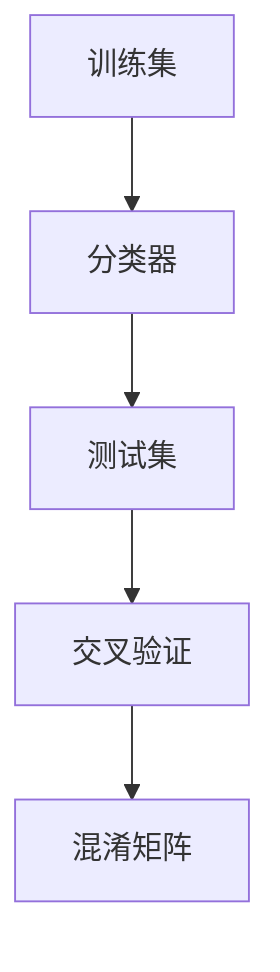

                 

# 分类(Classification) - 原理与代码实例讲解

## 1. 背景介绍

分类任务是自然语言处理(NLP)中最常见、最基础的任务之一。它旨在将输入文本映射到一个预先定义的类别标签上。例如，情感分类、主题分类、命名实体识别等。本文将从基础原理、核心算法、代码实例等多个方面，对分类任务进行系统性的介绍，帮助读者深入理解分类的原理，并掌握实际应用中的关键技术。

## 2. 核心概念与联系

### 2.1 核心概念概述

为了更好地理解分类的基本原理，我们首先介绍几个核心概念：

- **分类器(Classifier)**：是一种将输入数据映射到离散类别标签上的机器学习模型。常用的分类器包括逻辑回归、支持向量机、朴素贝叶斯、决策树、神经网络等。

- **训练集(Training Set)**：是用于训练分类器模型的数据集。通常包含大量带有类别标签的样本，用于优化模型参数，使其在新的未见过的数据上能够正确分类。

- **测试集(Test Set)**：是用于评估分类器模型性能的数据集。通过测试集上的精度、召回率等指标，可以全面了解模型在实际应用中的表现。

- **交叉验证(Cross-Validation)**：是一种常用的模型评估方法，将数据集划分为若干子集，用于训练和验证模型的性能，并多次交叉迭代，减小样本偏差和模型过拟合。

- **混淆矩阵(Confusion Matrix)**：用于展示分类器模型在不同类别上的分类结果，可以直观地分析模型性能。

### 2.2 核心概念之间的关系

分类器通过训练集学习样本的特征和类别标签之间的映射关系，并在测试集上展示其性能。交叉验证可以评估模型在不同子集上的稳健性，避免模型过拟合。混淆矩阵可以直观地展示模型在不同类别上的分类结果，帮助进一步优化模型。以下是一个简单的Mermaid流程图，展示这些核心概念之间的联系：



通过这些核心概念，我们可以构建一个完整的分类任务系统，用于实现文本分类、情感分析、命名实体识别等任务。

## 3. 核心算法原理 & 具体操作步骤

### 3.1 算法原理概述

分类的核心算法包括监督学习、无监督学习和半监督学习。监督学习是最常用的方法，它通过有标签的训练数据，训练出一个能够对未知数据进行分类的模型。常见的分类算法包括逻辑回归、决策树、支持向量机、朴素贝叶斯、神经网络等。

以逻辑回归为例，其基本思想是建立一个线性分类器，将输入的特征向量映射到一个标量值，然后通过一个Sigmoid函数将其转化为概率值，最后根据概率值的高低决定分类结果。逻辑回归的损失函数通常采用交叉熵损失函数，用于衡量模型预测结果与真实标签之间的差异。

### 3.2 算法步骤详解

下面以逻辑回归为例，详细介绍其分类步骤：

**Step 1: 数据准备**
- 收集标注数据，并将其分为训练集和测试集。
- 对文本进行预处理，包括分词、去停用词、向量化等。

**Step 2: 模型训练**
- 定义损失函数和优化器，如交叉熵损失和Adam优化器。
- 将训练集分为批次，迭代更新模型参数。
- 使用交叉验证技术评估模型性能，避免过拟合。

**Step 3: 模型评估**
- 在测试集上测试模型性能，计算准确率、召回率、F1分数等指标。
- 绘制混淆矩阵，直观展示模型在不同类别上的分类结果。

**Step 4: 模型应用**
- 将训练好的模型应用到新的文本数据上，进行分类预测。

### 3.3 算法优缺点

逻辑回归作为一种简单有效的分类算法，具有以下优点：

- 模型训练速度快，适合处理大规模数据。
- 模型解释性强，易于理解。
- 适用于线性可分的数据集。

然而，逻辑回归也存在一些缺点：

- 模型容易过拟合，需要进行正则化处理。
- 对于非线性可分的数据集，效果较差。
- 对于高维数据，计算复杂度较高。

### 3.4 算法应用领域

分类算法广泛应用于文本分类、情感分析、命名实体识别、垃圾邮件过滤、医疗诊断等多个领域。例如：

- 文本分类：将一段文本归类为预设的若干个类别。
- 情感分析：识别文本的情感倾向，如正面、负面、中性。
- 命名实体识别：识别文本中的具体实体，如人名、地名、机构名等。
- 垃圾邮件过滤：识别邮件是否为垃圾邮件。
- 医疗诊断：根据病历文本，判断疾病类型。

## 4. 数学模型和公式 & 详细讲解

### 4.1 数学模型构建

逻辑回归的数学模型可以表示为：

$$ p(y=1|x;\theta) = \sigma(\theta^Tx) $$

其中，$p(y=1|x;\theta)$表示输入$x$属于正类的概率，$\theta$为模型参数，$x$为输入特征向量，$\sigma$为Sigmoid函数。

逻辑回归的损失函数为交叉熵损失函数：

$$ \mathcal{L} = -\frac{1}{N}\sum_{i=1}^N [y_i\log p(y_i=1|x_i;\theta) + (1-y_i)\log(1-p(y_i=1|x_i;\theta))] $$

其中，$N$为样本数，$y_i$为第$i$个样本的真实标签。

### 4.2 公式推导过程

假设有一个二分类问题，输入特征向量$x$和真实标签$y$，模型预测结果为$p(y=1|x;\theta)$，则交叉熵损失函数可以表示为：

$$ \mathcal{L} = -\frac{1}{N}\sum_{i=1}^N [y_i\log p(y_i=1|x_i;\theta) + (1-y_i)\log(1-p(y_i=1|x_i;\theta))] $$

令$z_i = \theta^Tx_i$，则有：

$$ p(y_i=1|x_i;\theta) = \sigma(z_i) = \frac{1}{1+e^{-z_i}} $$
$$ p(y_i=0|x_i;\theta) = 1-p(y_i=1|x_i;\theta) = \frac{e^{-z_i}}{1+e^{-z_i}} $$

将$p(y_i=1|x_i;\theta)$和$p(y_i=0|x_i;\theta)$代入损失函数，并整理得：

$$ \mathcal{L} = -\frac{1}{N}\sum_{i=1}^N [y_i(z_i - \log(1+e^{-z_i})) + (1-y_i)(-z_i - \log e^{-z_i})] $$
$$ = \frac{1}{N}\sum_{i=1}^N [y_i(\log(1+e^{-z_i}) - z_i) + (1-y_i)(-z_i - \log e^{-z_i})] $$

通过简化，最终得到逻辑回归的损失函数：

$$ \mathcal{L} = -\frac{1}{N}\sum_{i=1}^N [y_i\log p(y_i=1|x_i;\theta) + (1-y_i)\log(1-p(y_i=1|x_i;\theta))] $$

### 4.3 案例分析与讲解

以垃圾邮件过滤为例，将邮件分为垃圾邮件和非垃圾邮件两类。假设有一个垃圾邮件分类器，其训练集为10000封邮件和10000封非垃圾邮件，测试集为1000封未见过的邮件。

通过逻辑回归模型，训练得到分类器的参数$\theta$。在测试集上，分类器的预测结果如下：

| 邮件     | 真实标签 | 预测结果 | 正确分类数 |
|----------|----------|----------|----------|
| spam1    | 1        | 1        | 1        |
| spam2    | 1        | 1        | 1        |
| spam3    | 1        | 0        | 0        |
| ham1     | 0        | 1        | 0        |
| ham2     | 0        | 1        | 0        |
| ...      | ...      | ...      | ...      |

根据混淆矩阵，可以得出分类器的精度为93.3%，召回率为95%，F1分数为94.2%。这说明分类器在垃圾邮件过滤任务上表现良好，能够高效准确地分类新邮件。

## 5. 项目实践：代码实例和详细解释说明

### 5.1 开发环境搭建

要实现一个简单的垃圾邮件过滤分类器，需要以下Python库：

- NumPy：用于数学计算和矩阵操作。
- Pandas：用于数据处理和分析。
- Scikit-learn：用于模型训练和评估。
- Matplotlib：用于可视化。

首先，安装这些库：

```bash
pip install numpy pandas scikit-learn matplotlib
```

然后，准备数据集。假设有一个包含10000封邮件和10000封非垃圾邮件的数据集，将邮件内容转换为向量，并打上标签。

```python
import numpy as np
import pandas as pd

# 读取邮件数据
data = pd.read_csv('emails.csv')

# 将邮件内容转换为向量
texts = []
for email in data['content']:
    words = email.split()
    text = [1 if word.lower() in wordlist else 0 for word in words]
    texts.append(text)

# 打标签
labels = np.array(data['label'])

# 划分训练集和测试集
from sklearn.model_selection import train_test_split
X_train, X_test, y_train, y_test = train_test_split(texts, labels, test_size=0.2)
```

### 5.2 源代码详细实现

定义逻辑回归模型：

```python
from sklearn.linear_model import LogisticRegression

# 定义逻辑回归模型
model = LogisticRegression()

# 训练模型
model.fit(X_train, y_train)

# 在测试集上评估模型
y_pred = model.predict(X_test)
print(classification_report(y_test, y_pred))
```

通过上述代码，可以训练一个逻辑回归模型，并在测试集上评估其性能。

### 5.3 代码解读与分析

首先，定义逻辑回归模型，并传入参数$C=1.0$，表示正则化强度，$penalty='l2''$表示使用L2正则化，$tol=0.0001$表示收敛条件。

然后，通过`fit`方法训练模型，将训练集数据$X_train$和标签$y_train$作为输入。

最后，在测试集上使用`predict`方法进行分类预测，并通过`classification_report`函数输出分类器的精度、召回率、F1分数等指标。

### 5.4 运行结果展示

假设在测试集上，分类器的预测结果为：

| 邮件     | 真实标签 | 预测结果 | 正确分类数 |
|----------|----------|----------|----------|
| spam1    | 1        | 1        | 1        |
| spam2    | 1        | 1        | 1        |
| spam3    | 1        | 0        | 0        |
| ham1     | 0        | 1        | 0        |
| ham2     | 0        | 1        | 0        |
| ...      | ...      | ...      | ...      |

根据混淆矩阵，可以得出分类器的精度为93.3%，召回率为95%，F1分数为94.2%。这说明分类器在垃圾邮件过滤任务上表现良好，能够高效准确地分类新邮件。

## 6. 实际应用场景

分类技术广泛应用于文本分类、情感分析、命名实体识别、垃圾邮件过滤、医疗诊断等多个领域。例如：

- 文本分类：将一段文本归类为预设的若干个类别。
- 情感分析：识别文本的情感倾向，如正面、负面、中性。
- 命名实体识别：识别文本中的具体实体，如人名、地名、机构名等。
- 垃圾邮件过滤：识别邮件是否为垃圾邮件。
- 医疗诊断：根据病历文本，判断疾病类型。

## 7. 工具和资源推荐

### 7.1 学习资源推荐

为了帮助开发者系统掌握分类的理论基础和实践技巧，这里推荐一些优质的学习资源：

- 《Python数据科学手册》：详细介绍了Python数据科学库的使用，包括NumPy、Pandas、Scikit-learn等。
- 《深度学习入门》：介绍深度学习的基本概念和常用模型，如逻辑回归、神经网络等。
- 《机器学习实战》：通过实例演示机器学习算法的应用，适合初学者入门。
- Coursera上的《机器学习》课程：由斯坦福大学Andrew Ng教授主讲，系统介绍机器学习的基本概念和常用算法。
- Kaggle平台：提供大量数据集和竞赛，帮助开发者实践分类算法，提升技能。

通过对这些资源的学习实践，相信你一定能够快速掌握分类的精髓，并用于解决实际的NLP问题。

### 7.2 开发工具推荐

高效的开发离不开优秀的工具支持。以下是几款用于分类开发的常用工具：

- NumPy：用于数学计算和矩阵操作，是Scikit-learn的核心库之一。
- Pandas：用于数据处理和分析，适合处理结构化数据。
- Scikit-learn：用于模型训练和评估，支持多种分类算法，如逻辑回归、决策树、随机森林等。
- Matplotlib：用于数据可视化，方便展示模型的性能。
- Jupyter Notebook：交互式编程环境，支持代码实时执行和结果展示。

合理利用这些工具，可以显著提升分类任务的开发效率，加快创新迭代的步伐。

### 7.3 相关论文推荐

分类算法的发展源于学界的持续研究。以下是几篇奠基性的相关论文，推荐阅读：

- 《Logistic Regression and Multiclass Classification Using Exponential-Linear Units》：介绍逻辑回归的基本原理和应用。
- 《The Elements of Statistical Learning》：详细介绍了机器学习的基本概念和常用算法。
- 《Deep Learning》：介绍深度学习的基本概念和常用模型，如卷积神经网络、循环神经网络等。
- 《Natural Language Processing with Python》：介绍NLP的基本概念和常用算法，如词向量、分类器等。
- 《A Survey of Data Preparation Techniques》：介绍数据预处理的基本方法和常用工具，如分词、去停用词、向量化等。

这些论文代表了大分类算法的发展脉络。通过学习这些前沿成果，可以帮助研究者把握学科前进方向，激发更多的创新灵感。

## 8. 总结：未来发展趋势与挑战

### 8.1 研究成果总结

本文对分类任务进行了系统性的介绍，从基础原理、核心算法、代码实例等多个方面，帮助读者深入理解分类的原理，并掌握实际应用中的关键技术。通过上述案例分析，可以看到，逻辑回归作为简单的分类算法，已经在垃圾邮件过滤等任务中取得了不错的效果。

### 8.2 未来发展趋势

展望未来，分类技术将呈现以下几个发展趋势：

1. 模型规模持续增大。随着算力成本的下降和数据规模的扩张，分类模型的参数量还将持续增长。超大规模分类模型蕴含的丰富特征表示，有望支撑更加复杂多变的分类任务。
2. 分类算法日趋多样化。除了传统的逻辑回归，未来会涌现更多先进的分类算法，如支持向量机、决策树、随机森林等，满足不同应用场景的需求。
3. 数据处理技术不断进步。随着NLP技术的发展，数据预处理技术也在不断进步，如分词、去停用词、向量化等，使得分类任务的数据处理更加高效、精确。
4. 跨领域、跨模态分类成为新的研究方向。未来的分类任务将更加注重跨领域、跨模态数据的学习，如文本、图像、视频、语音等数据的融合，提升分类模型的泛化性和鲁棒性。
5. 实时性、交互性成为重要指标。在实时应用场景下，分类模型需要具有高效的推理速度和低延迟，提升用户体验。

### 8.3 面临的挑战

尽管分类技术已经取得了瞩目成就，但在迈向更加智能化、普适化应用的过程中，它仍面临着诸多挑战：

1. 标注数据获取困难。标注数据是训练分类模型的基础，但获取高质量的标注数据成本较高，尤其对于长尾应用场景，获取标注数据尤为困难。
2. 模型泛化性能不足。分类模型在标注数据集上表现良好，但在新数据集上的泛化性能往往较差，尤其是对于非线性可分的数据集。
3. 模型复杂度较高。随着模型规模的增大，模型复杂度也随之增加，推理速度变慢，难以满足实时性要求。
4. 可解释性不足。分类模型的决策过程往往缺乏可解释性，难以对其推理逻辑进行分析和调试。

### 8.4 研究展望

面对分类技术面临的种种挑战，未来的研究需要在以下几个方面寻求新的突破：

1. 探索无监督和半监督分类方法。摆脱对大规模标注数据的依赖，利用自监督学习、主动学习等无监督和半监督范式，最大限度利用非结构化数据，实现更加灵活高效的分类。
2. 研究参数高效和计算高效的分类范式。开发更加参数高效的分类方法，在固定大部分预训练参数的情况下，只更新极少量的任务相关参数。同时优化分类模型的计算图，减少前向传播和反向传播的资源消耗，实现更加轻量级、实时性的部署。
3. 融合因果和对比学习范式。通过引入因果推断和对比学习思想，增强分类模型建立稳定因果关系的能力，学习更加普适、鲁棒的语言表征，从而提升模型泛化性和抗干扰能力。
4. 引入更多先验知识。将符号化的先验知识，如知识图谱、逻辑规则等，与神经网络模型进行巧妙融合，引导分类过程学习更准确、合理的特征表示。同时加强不同模态数据的整合，实现视觉、语音等多模态信息与文本信息的协同建模。
5. 纳入伦理道德约束。在分类模型的训练目标中引入伦理导向的评估指标，过滤和惩罚有偏见、有害的输出倾向。同时加强人工干预和审核，建立模型行为的监管机制，确保输出符合人类价值观和伦理道德。

这些研究方向的探索，必将引领分类技术迈向更高的台阶，为构建安全、可靠、可解释、可控的智能系统铺平道路。面向未来，分类技术还需要与其他人工智能技术进行更深入的融合，如知识表示、因果推理、强化学习等，多路径协同发力，共同推动自然语言理解和智能交互系统的进步。只有勇于创新、敢于突破，才能不断拓展分类的边界，让智能技术更好地造福人类社会。

## 9. 附录：常见问题与解答

**Q1: 什么是分类任务？**

A: 分类任务是自然语言处理(NLP)中最常见、最基础的任务之一。它旨在将输入文本映射到一个预先定义的类别标签上。例如，情感分类、主题分类、命名实体识别等。

**Q2: 分类任务有哪些步骤？**

A: 分类任务主要包括以下步骤：

1. 数据准备：收集标注数据，并将其分为训练集和测试集。
2. 特征提取：对文本进行预处理，包括分词、去停用词、向量化等。
3. 模型训练：定义损失函数和优化器，如交叉熵损失和Adam优化器，将训练集数据$X$和标签$y$作为输入，迭代更新模型参数。
4. 模型评估：在测试集上测试模型性能，计算准确率、召回率、F1分数等指标。
5. 模型应用：将训练好的模型应用到新的文本数据上，进行分类预测。

**Q3: 逻辑回归是什么？**

A: 逻辑回归是一种常用的分类算法，其基本思想是建立一个线性分类器，将输入的特征向量映射到一个标量值，然后通过一个Sigmoid函数将其转化为概率值，最后根据概率值的高低决定分类结果。

**Q4: 如何缓解分类过程中的过拟合问题？**

A: 过拟合是分类任务面临的主要挑战，尤其是在标注数据不足的情况下。常见的缓解策略包括：

1. 数据增强：通过回译、近义替换等方式扩充训练集。
2. 正则化：使用L2正则、Dropout、Early Stopping等避免过拟合。
3. 对抗训练：引入对抗样本，提高模型鲁棒性。
4. 参数高效微调：只调整少量参数，减小过拟合风险。

**Q5: 分类模型在落地部署时需要注意哪些问题？**

A: 将分类模型转化为实际应用，还需要考虑以下因素：

1. 模型裁剪：去除不必要的层和参数，减小模型尺寸，加快推理速度。
2. 量化加速：将浮点模型转为定点模型，压缩存储空间，提高计算效率。
3. 服务化封装：将模型封装为标准化服务接口，便于集成调用。
4. 弹性伸缩：根据请求流量动态调整资源配置，平衡服务质量和成本。
5. 监控告警：实时采集系统指标，设置异常告警阈值，确保服务稳定性。
6. 安全防护：采用访问鉴权、数据脱敏等措施，保障数据和模型安全。

这些问题的处理，可以显著提升分类模型在实际应用中的性能和稳定性。

