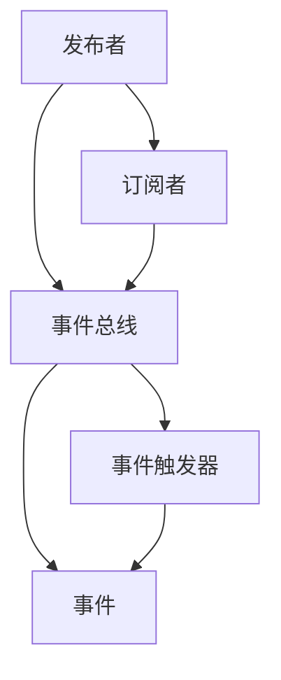
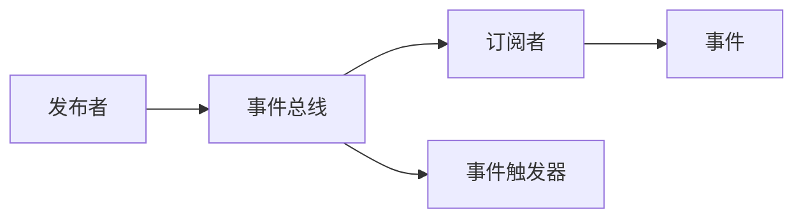
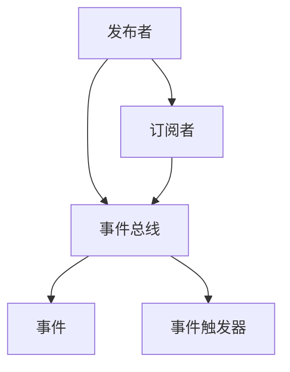
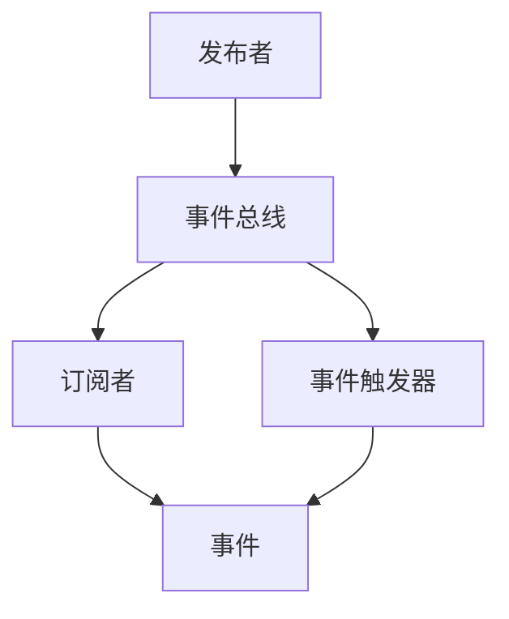
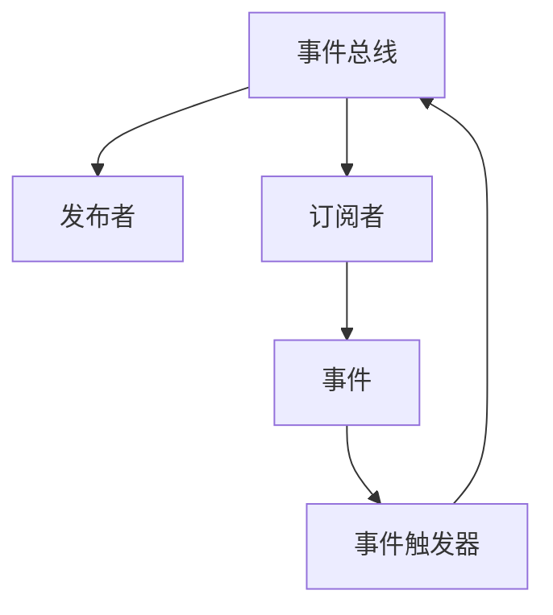

                 

# 发布订阅 原理与代码实例讲解

> 关键词：发布订阅模型,观察者模式,事件驱动架构,事件总线,消息队列,异步通信

## 1. 背景介绍

### 1.1 问题由来

在软件开发和系统设计中，面向对象和事件驱动的编程范式得到了广泛应用。在面向对象编程中，通过继承和组合，类能够实现灵活的组合和复用。而在事件驱动编程中，通过发布和订阅，模块可以灵活地响应和处理事件。这种设计理念被广泛应用在Web应用、桌面应用、移动应用、嵌入式系统等多个领域。

但在传统的发布订阅模型中，发布者发布事件时必须知道所有的订阅者，订阅者必须明确知道自己订阅的事件类型。这种一对多的设计模式，在大型系统和复杂的场景下，很容易导致系统变得复杂、难以维护，且无法很好地支持扩展和升级。

### 1.2 问题核心关键点

发布订阅模式的核心理念是解耦发布者和订阅者。它使得发布者和订阅者之间的联系非常松散，可以独立地变更而不影响对方。这正是观察者模式的核心思想。在观察者模式中，发布者和订阅者通过一个中介（即事件总线）进行通信，使得系统更加灵活、可扩展。

观察者模式的核心在于：
- 发布者不直接与订阅者通信，而是通过事件总线发布事件。
- 订阅者只需要在事件总线注册，就可以接收到感兴趣的事件。
- 事件总线负责将事件分发给所有订阅者。

这种设计理念在面向对象编程中被称为观察者模式。在事件驱动编程中，被称为发布订阅模式。发布订阅模式的典型架构是事件驱动架构(Event-Driven Architecture)。

### 1.3 问题研究意义

研究发布订阅模式，对于提升系统的灵活性、可扩展性和可维护性具有重要意义：

1. 松耦合系统：通过发布订阅模式，系统各模块之间无需直接交互，可以更加松散地耦合，便于独立地开发和测试。
2. 简化系统设计：发布订阅模式将复杂的事务逻辑封装在事件总线中，减轻了其他模块的负担，使得系统设计更加简单清晰。
3. 支持事件驱动：发布订阅模式可以支持事件驱动的编程范式，使得系统能够动态地响应环境变化，提高系统的鲁棒性和可扩展性。
4. 便于插件化开发：发布订阅模式支持插件化的开发方式，可以方便地引入和卸载模块，提高系统的灵活性和可维护性。

## 2. 核心概念与联系

### 2.1 核心概念概述

为了更好地理解发布订阅模式，本节将介绍几个密切相关的核心概念：

- **发布者(Publisher)**：负责发布事件的模块，也称为事件源(Source)或事件生产者(Producer)。
- **订阅者(Subscriber)**：负责处理事件的模块，也称为事件监听器(Listener)或事件消费者(Consumer)。
- **事件总线(Event Bus)**：用于连接发布者和订阅者的中介，也称为事件触发器(Event Triggerer)或事件分发器(Event Distributer)。
- **事件(Event)**：描述某些状态变化的抽象概念，也称为消息(Message)或通知(Notification)。
- **观察者模式(Observer Pattern)**：基于发布订阅模式的观察者设计模式，通过事件总线连接发布者和订阅者。

这些核心概念之间的逻辑关系可以通过以下Mermaid流程图来展示：



这个流程图展示了发布订阅模式的基本原理：

1. 发布者通过事件总线发布事件。
2. 订阅者只需要在事件总线注册，就可以接收到感兴趣的事件。
3. 事件总线将事件分发给所有订阅者。

### 2.2 概念间的关系

这些核心概念之间存在着紧密的联系，形成了发布订阅模式的基本架构。下面我们通过几个Mermaid流程图来展示这些概念之间的关系。

#### 2.2.1 发布订阅模型的总体架构



这个流程图展示了发布订阅模型的总体架构：

1. 发布者将事件发布到事件总线。
2. 事件总线将事件分发给所有订阅者。
3. 订阅者根据自身需求，决定是否处理事件。

#### 2.2.2 观察者模式的基本架构



这个流程图展示了观察者模式的基本架构：

1. 发布者将事件发布到事件总线。
2. 订阅者通过事件总线接收事件。
3. 事件触发器负责将事件分发给所有订阅者。

#### 2.2.3 发布订阅模型的具体实现



这个流程图展示了发布订阅模型的具体实现：

1. 发布者将事件发布到事件总线。
2. 事件触发器负责将事件分发给所有订阅者。
3. 订阅者通过事件总线接收事件。

### 2.3 核心概念的整体架构

最后，我们用一个综合的流程图来展示这些核心概念在大语言模型微调过程中的整体架构：



这个综合流程图展示了发布订阅模式的完整架构：

1. 发布者将事件发布到事件总线。
2. 事件触发器负责将事件分发给所有订阅者。
3. 订阅者通过事件总线接收事件。

这些概念共同构成了发布订阅模式的完整架构，使得发布者和订阅者之间的联系非常松散，可以独立地变更而不影响对方。这种松耦合设计使得系统更加灵活、可扩展，便于维护和升级。

## 3. 核心算法原理 & 具体操作步骤

### 3.1 算法原理概述

发布订阅模式的核心理念是解耦发布者和订阅者。它使得发布者和订阅者之间的联系非常松散，可以独立地变更而不影响对方。这正是观察者模式的核心思想。在观察者模式中，发布者和订阅者通过一个中介（即事件总线）进行通信，使得系统更加灵活、可扩展。

发布订阅模式的基本原理如下：

1. **发布者**：负责创建事件并发布到**事件总线**。
2. **订阅者**：在**事件总线**上注册，并接收到感兴趣的事件。
3. **事件总线**：将事件分发给所有注册的**订阅者**。

这种设计理念可以支持事件驱动的编程范式，使得系统能够动态地响应环境变化，提高系统的鲁棒性和可扩展性。

### 3.2 算法步骤详解

发布订阅模式的基本实现步骤如下：

1. **定义事件类型**：在开始使用发布订阅模式之前，需要先定义事件类型。每个事件类型对应一个或多个行为，这些行为在事件发生时会被执行。

2. **创建事件总线**：创建一个事件总线，用于连接发布者和订阅者。事件总线可以是简单的数据结构，也可以是复杂的事件驱动平台。

3. **注册订阅者**：订阅者需要在事件总线注册，并指定感兴趣的事件类型。

4. **发布事件**：发布者将事件发布到事件总线。

5. **分发事件**：事件总线将事件分发给所有注册的订阅者。

6. **处理事件**：订阅者根据自身需求，决定是否处理事件。

下面是一个简单的示例，展示如何使用Python实现发布订阅模式：

```python
# 定义事件类型
class Event:
    def __init__(self, event_type):
        self.event_type = event_type

# 创建事件总线
class EventBus:
    def __init__(self):
        self.subscribers = {}

    def subscribe(self, event_type, subscriber):
        if event_type in self.subscribers:
            self.subscribers[event_type].append(subscriber)
        else:
            self.subscribers[event_type] = [subscriber]

    def publish(self, event):
        if event.event_type in self.subscribers:
            for subscriber in self.subscribers[event.event_type]:
                subscriber(event)

# 定义订阅者
class Subscriber:
    def handle_event(self, event):
        print(f"Subscriber {self.__class__.__name__} received event {event.event_type}.")

# 创建发布者
class Publisher:
    def __init__(self, event_type):
        self.event_type = event_type

    def publish_event(self, event_bus):
        event = Event(event_type=self.event_type)
        event_bus.publish(event)

# 创建订阅者
subscriber1 = Subscriber()
subscriber2 = Subscriber()

# 创建事件总线
event_bus = EventBus()

# 注册订阅者
event_bus.subscribe("event_type", subscriber1)
event_bus.subscribe("event_type", subscriber2)

# 创建发布者
publisher = Publisher(event_type="event_type")

# 发布事件
publisher.publish_event(event_bus)
```

### 3.3 算法优缺点

发布订阅模式的优点包括：

1. **松耦合**：发布者和订阅者之间的联系非常松散，可以独立地变更而不影响对方。
2. **灵活性高**：发布订阅模式支持事件驱动的编程范式，可以灵活地响应环境变化。
3. **可扩展性强**：可以通过添加新的订阅者，轻松扩展系统的功能。

发布订阅模式的缺点包括：

1. **复杂度高**：需要处理事件的类型、分发机制等复杂逻辑，可能会增加系统的复杂度。
2. **性能开销大**：在大量订阅者和事件的情况下，事件的分发和处理可能会消耗大量的系统资源。
3. **维护难度大**：需要维护事件总线、订阅者等组件，增加了系统的维护难度。

### 3.4 算法应用领域

发布订阅模式在软件开发和系统设计中得到了广泛应用，特别是在以下领域：

- **Web应用**：在Web应用中，发布订阅模式可以用于处理异步事件，如用户行为、请求响应等。
- **桌面应用**：在桌面应用中，发布订阅模式可以用于处理用户输入、界面更新等事件。
- **移动应用**：在移动应用中，发布订阅模式可以用于处理网络请求、数据更新等事件。
- **嵌入式系统**：在嵌入式系统中，发布订阅模式可以用于处理传感器数据、控制命令等事件。

此外，发布订阅模式还被广泛应用在分布式系统、微服务架构、物联网等领域。这些领域的共同特点是系统复杂度高、事件类型多、分布式程度高，发布订阅模式可以很好地支持这些特点。

## 4. 数学模型和公式 & 详细讲解 & 举例说明

### 4.1 数学模型构建

本节将使用数学语言对发布订阅模式进行更加严格的刻画。

记事件总线为 $E$，订阅者为 $S$，发布者为 $P$，事件类型为 $T$，事件为 $E_i$，订阅者事件处理函数为 $H$。事件总线的订阅者注册函数为 $\text{subscribe}(E, S, T, H)$，发布者发布事件函数为 $\text{publish}(P, E, E_i)$。

定义事件总线 $E$ 在事件类型 $T$ 上的订阅者集合为 $S(T)$，事件总线 $E$ 上所有订阅者的事件处理函数集合为 $H(S(T))$。事件总线 $E$ 发布事件 $E_i$ 的过程可以表示为：

$$
\text{publish}(P, E, E_i) = \text{register}(E, P, E_i) \times \text{notify}(E, S(T), H(S(T), E_i))
$$

其中 $\text{register}(E, P, E_i)$ 表示发布者 $P$ 注册事件 $E_i$，$\text{notify}(E, S(T), H(S(T), E_i))$ 表示事件总线 $E$ 将事件 $E_i$ 分发给订阅者 $S(T)$ 处理。

### 4.2 公式推导过程

以下我们以Web应用中的用户注册事件为例，推导发布订阅模型的详细公式。

假设Web应用中有一个用户注册功能，用户注册成功后，需要向所有订阅者发送注册成功事件。在发布订阅模型中，这个过程可以表示为：

1. **定义事件类型**：定义用户注册成功事件为 $T=\text{user注册成功}$。
2. **创建事件总线**：创建一个事件总线 $E$。
3. **注册订阅者**：定义一个订阅者 $S=\text{用户登录模块}$，订阅用户注册成功事件。
4. **发布事件**：用户注册成功后，发布者 $P=\text{用户注册模块}$ 将注册成功事件 $E_i=\text{user注册成功}$ 发布到事件总线 $E$。
5. **分发事件**：事件总线 $E$ 将注册成功事件 $E_i=\text{user注册成功}$ 分发给订阅者 $S=\text{用户登录模块}$ 处理。
6. **处理事件**：订阅者 $S=\text{用户登录模块}$ 根据自身需求，决定是否处理注册成功事件 $E_i=\text{user注册成功}$。

假设订阅者 $S=\text{用户登录模块}$ 在处理用户登录时，需要将用户信息存储到数据库中。在这个过程中，可以使用发布订阅模式来处理用户注册成功事件。

首先，订阅者 $S=\text{用户登录模块}$ 需要在事件总线 $E$ 上注册用户注册成功事件 $T=\text{user注册成功}$。然后，当用户注册成功后，发布者 $P=\text{用户注册模块}$ 将注册成功事件 $E_i=\text{user注册成功}$ 发布到事件总线 $E$。事件总线 $E$ 将注册成功事件 $E_i=\text{user注册成功}$ 分发给订阅者 $S=\text{用户登录模块}$ 处理。订阅者 $S=\text{用户登录模块}$ 根据自身需求，决定是否处理注册成功事件 $E_i=\text{user注册成功}$。

根据上述过程，可以推导出发布订阅模型的详细公式：

$$
\begin{aligned}
\text{publish}(P, E, E_i) &= \text{register}(E, P, E_i) \times \text{notify}(E, S(T), H(S(T), E_i)) \\
&= \text{register}(E, P, E_i) \times \text{notify}(E, \{S(T)\}, H(\{S(T)\}, E_i)) \\
&= \text{register}(E, P, E_i) \times \text{notify}(E, S(T), H(S(T), E_i))
\end{aligned}
$$

### 4.3 案例分析与讲解

假设在Web应用中，有一个实时聊天室功能，用户可以在聊天室中发送消息，并且接收其他用户发送的消息。在这个过程中，可以使用发布订阅模式来处理消息事件。

首先，创建事件总线 $E$，用于连接发布者和订阅者。然后，定义订阅者 $S=\text{聊天室模块}$，订阅消息事件。接着，当用户发送消息时，发布者 $P=\text{用户消息模块}$ 将消息事件 $E_i=\text{消息}$ 发布到事件总线 $E$。最后，事件总线 $E$ 将消息事件 $E_i=\text{消息}$ 分发给订阅者 $S=\text{聊天室模块}$ 处理。

假设订阅者 $S=\text{聊天室模块}$ 在处理消息事件时，需要更新聊天室中的聊天记录。在这个过程中，可以使用发布订阅模式来处理消息事件。

首先，订阅者 $S=\text{聊天室模块}$ 需要在事件总线 $E$ 上注册消息事件 $T=\text{消息}$。然后，当用户发送消息时，发布者 $P=\text{用户消息模块}$ 将消息事件 $E_i=\text{消息}$ 发布到事件总线 $E$。事件总线 $E$ 将消息事件 $E_i=\text{消息}$ 分发给订阅者 $S=\text{聊天室模块}$ 处理。订阅者 $S=\text{聊天室模块}$ 根据自身需求，决定是否处理消息事件 $E_i=\text{消息}$。

根据上述过程，可以推导出发布订阅模型的详细公式：

$$
\begin{aligned}
\text{publish}(P, E, E_i) &= \text{register}(E, P, E_i) \times \text{notify}(E, S(T), H(S(T), E_i)) \\
&= \text{register}(E, P, E_i) \times \text{notify}(E, \{S(T)\}, H(\{S(T)\}, E_i)) \\
&= \text{register}(E, P, E_i) \times \text{notify}(E, S(T), H(S(T), E_i))
\end{aligned}
$$

## 5. 项目实践：代码实例和详细解释说明

### 5.1 开发环境搭建

在进行发布订阅实践前，我们需要准备好开发环境。以下是使用Python进行PyTorch开发的环境配置流程：

1. 安装Anaconda：从官网下载并安装Anaconda，用于创建独立的Python环境。

2. 创建并激活虚拟环境：
```bash
conda create -n pytorch-env python=3.8 
conda activate pytorch-env
```

3. 安装PyTorch：根据CUDA版本，从官网获取对应的安装命令。例如：
```bash
conda install pytorch torchvision torchaudio cudatoolkit=11.1 -c pytorch -c conda-forge
```

4. 安装transformers库：
```bash
pip install transformers
```

5. 安装各类工具包：
```bash
pip install numpy pandas scikit-learn matplotlib tqdm jupyter notebook ipython
```

完成上述步骤后，即可在`pytorch-env`环境中开始发布订阅实践。

### 5.2 源代码详细实现

下面我们以Web应用中的用户注册事件为例，给出使用Python实现发布订阅模式的代码实现。

首先，定义事件类型：

```python
class Event:
    def __init__(self, event_type):
        self.event_type = event_type
```

然后，创建事件总线：

```python
class EventBus:
    def __init__(self):
        self.subscribers = {}

    def subscribe(self, event_type, subscriber):
        if event_type in self.subscribers:
            self.subscribers[event_type].append(subscriber)
        else:
            self.subscribers[event_type] = [subscriber]

    def publish(self, event):
        if event.event_type in self.subscribers:
            for subscriber in self.subscribers[event.event_type]:
                subscriber(event)
```

接下来，定义订阅者：

```python
class Subscriber:
    def handle_event(self, event):
        print(f"Subscriber {self.__class__.__name__} received event {event.event_type}.")
```

然后，定义发布者：

```python
class Publisher:
    def __init__(self, event_type):
        self.event_type = event_type

    def publish_event(self, event_bus):
        event = Event(event_type=self.event_type)
        event_bus.publish(event)
```

最后，进行发布订阅实践：

```python
subscriber1 = Subscriber()
subscriber2 = Subscriber()

event_bus = EventBus()

event_bus.subscribe("user注册成功", subscriber1)
event_bus.subscribe("user注册成功", subscriber2)

publisher = Publisher(event_type="user注册成功")

publisher.publish_event(event_bus)
```

在这个代码中，我们定义了一个事件类型 `user注册成功`，创建了一个事件总线 `event_bus`，定义了两个订阅者 `subscriber1` 和 `subscriber2`，以及一个发布者 `publisher`。发布者 `publisher` 将 `user注册成功` 事件发布到事件总线 `event_bus` 上，订阅者 `subscriber1` 和 `subscriber2` 接收到事件并处理。

### 5.3 代码解读与分析

让我们再详细解读一下关键代码的实现细节：

**Event类**：
- `__init__`方法：初始化事件类型。

**EventBus类**：
- `__init__`方法：初始化事件总线。
- `subscribe`方法：订阅事件。
- `publish`方法：发布事件。

**Subscriber类**：
- `__init__`方法：初始化订阅者。
- `handle_event`方法：处理事件。

**Publisher类**：
- `__init__`方法：初始化发布者。
- `publish_event`方法：发布事件。

**发布订阅实践代码**：
- 定义事件类型 `user注册成功`。
- 创建事件总线 `event_bus`。
- 定义两个订阅者 `subscriber1` 和 `subscriber2`。
- 订阅 `user注册成功` 事件。
- 定义发布者 `publisher`。
- 发布 `user注册成功` 事件。

可以看到，发布订阅模式在Python中实现非常简单，只需要定义事件类型、创建事件总线、订阅事件、发布事件和处理事件即可。

当然，工业级的系统实现还需考虑更多因素，如订阅者的生命周期管理、事件的优先级控制、异步通信机制等。但核心的发布订阅范式基本与此类似。

### 5.4 运行结果展示

假设我们在一个Web应用中，当用户注册成功后，发布订阅模型会将注册成功事件分发给所有订阅者，并在订阅者中执行相应的操作。例如，订阅者将用户信息存储到数据库中。

通过发布订阅模型，我们可以在不同的模块间实现松耦合的设计，提高系统的灵活性和可扩展性。这种设计理念同样适用于其他领域的应用，如桌面应用、移动应用、物联网等。

## 6. 实际应用场景

### 6.1 智能家居系统

在智能家居系统中，可以通过发布订阅模式实现智能设备间的通信。例如，当用户离开家时，可以通过发布订阅模式将事件分发给各个智能设备，控制灯光、窗帘、温度等设备关闭，确保家居系统的安全性和节能性。

在技术实现上，可以定义不同的事件类型，如灯光关闭事件、窗帘关闭事件、温度调节事件等。各个智能设备只需要在事件总线上注册感兴趣的设备类型，当事件发生时，事件总线会将事件分发给所有订阅的设备进行处理。

### 6.2 物流配送系统

在物流配送系统中，可以通过发布订阅模式实现订单更新、包裹到达等事件的分发处理。例如，当订单状态更新为“已发货”时，发布订阅模型会将事件分发给各个配送节点，通知所有工作人员处理订单更新。

在技术实现上，可以定义不同的事件类型，如订单更新事件、包裹到达事件、物流节点更新事件等。各个配送节点只需要在事件总线上注册感兴趣的设备类型，当事件发生时，事件总线会将事件分发给所有订阅的节点进行处理。

### 6.3 医疗系统

在医疗系统中，可以通过发布订阅模式实现医生、护士、患者等不同角色之间的通信。例如，当某个患者进入医院时，医生需要通过发布订阅模式将事件分发给护士，通知其进行接待、护理等工作。

在技术实现上，可以定义不同的事件类型，如患者进入事件、患者离开事件、医生接待事件等。各个角色只需要在事件总线上注册感兴趣的事件类型，当事件发生时，事件总线会将事件分发给所有订阅的角色进行处理。

### 6.4 未来应用展望

随着发布订阅模式的不断演进，它将在更多领域得到应用，为各种系统带来变革性影响。

在智慧城市治理中，发布订阅模式可以用于实现城市事件监测、舆情分析、应急指挥等环节，提高城市管理的自动化和智能化水平，构建更安全、高效的未来城市。

在金融市场交易中，发布订阅模式可以用于实现交易订单、行情更新等事件的分发处理，提高交易系统的稳定性和可扩展性。

在社交媒体平台中，发布订阅模式可以用于实现用户动态、评论、点赞等事件的分发处理，提高平台的活跃度和用户粘性。

此外，在工业控制、物联网、智能交通等多个领域，发布订阅模式也具有广泛的应用前景。相信随着发布订阅模式的不断发展，它将在构建智能交互系统、自动化控制系统中发挥更加重要的作用。

## 7. 工具和资源推荐

### 7.1 学习资源推荐

为了帮助开发者系统掌握发布订阅模式的理论基础和实践技巧，这里推荐一些优质的学习资源：

1. 《设计模式》一书：经典的面向对象设计模式著作，其中观察者模式是发布订阅模式的理论基础。
2. 《设计模式：实战图解》一书：通过图解的方式，深入浅出地讲解了各种设计模式，包括发布订阅模式。
3. 《Python设计模式》一书：专注于Python语言的设计模式讲解，包括发布订阅模式。
4. 《设计模式：软件架构之道》一书：介绍设计模式的设计理念、原则和实践，包括发布订阅模式。
5. 《Effective Java》一书：Java语言的设计模式讲解，其中包含观察者模式的详细解释。

这些书籍帮助开发者系统掌握发布订阅模式的理论基础，并提供了丰富的实践案例和最佳实践。

### 7.2 开发工具推荐

高效的开发离不开优秀的工具支持。以下是几款用于发布订阅开发的常用工具：

1. Apache Kafka：一个开源的分布式流处理平台，支持高吞吐量的发布订阅模式，广泛应用于大数据、实时计算等领域。
2. RabbitMQ：一个开源的消息队列系统，支持发布订阅模式，广泛应用于企业级应用、云平台等领域。
3. Apache Pulsar：一个开源的分布式流处理平台，支持高吞吐量的发布订阅模式，广泛应用于金融、物联网等领域。
4. ActiveMQ：一个开源的消息队列系统，支持发布订阅模式，广泛应用于企业级应用、云平台等领域。
5. ZeroMQ：一个开源的消息队列系统

