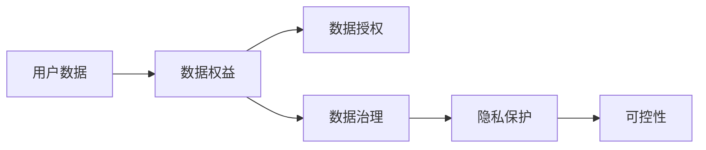

                 

# 可控性：AI赋予用户数据控制权

> 关键词：人工智能,可控性,隐私保护,数据权益,用户数据控制权

## 1. 背景介绍

随着人工智能技术的飞速发展，数据作为AI系统的"燃料"，其重要性愈发凸显。然而，数据泄露、滥用等问题频发，引发了广泛的社会关注和法律纠纷。如何在享受AI技术带来的便利的同时，保护用户数据权益，赋予用户对自身数据的控制权，成为人工智能领域亟需解决的关键问题。本文将探讨AI技术在赋予用户数据控制权方面的实现路径和核心概念。

## 2. 核心概念与联系

### 2.1 核心概念概述

为了更好地理解AI技术在赋予用户数据控制权方面的应用，本节将介绍几个关键概念：

- **可控性(Controllability)**：指用户对其数据（包括个人身份信息、行为轨迹、沟通记录等）拥有完全的控制权，能够决定数据的使用方式、传播范围和分享程度。

- **数据权益(Data Rights)**：涉及用户对其数据的权利，包括访问权、删除权、修改权、拒绝权等。

- **隐私保护(Privacy Protection)**：通过技术手段和管理措施，保护用户数据不被未经授权的第三方获取或滥用。

- **数据授权(Data Consent)**：用户对其数据的授权使用，是数据权益实现的重要途径。

- **数据治理(Data Governance)**：涉及数据的采集、存储、处理、使用和销毁等各个环节，确保数据处理的合规性和透明性。

这些概念通过某些技术手段和管理机制相互关联，共同构成了AI技术在赋予用户数据控制权方面的生态系统。

### 2.2 概念间的关系

这些概念之间的关系可以用以下Mermaid流程图表示：



该流程图展示了用户数据从产生到最终被使用的整个过程，以及各个环节中数据权益、授权、治理和隐私保护的实施。通过这些机制的协同工作，用户能够对其数据进行有效控制，确保数据使用符合其意愿和利益。

## 3. 核心算法原理 & 具体操作步骤
### 3.1 算法原理概述

AI技术在赋予用户数据控制权方面的核心算法原理，主要是基于分布式存储和区块链技术的去中心化数据控制模型。该模型通过构建去中心化的数据存储和交换网络，使用户能够自由地管理和控制其数据。

**核心思想**：用户数据被加密并分散存储在多个节点上，通过智能合约等机制，用户可以决定数据的访问权限、使用方式和共享范围。每个节点在接收用户请求时，通过共识算法验证数据的合法性，并根据智能合约的规定，决定是否响应请求。

### 3.2 算法步骤详解

以下是基于分布式存储和区块链技术的去中心化数据控制模型的具体操作步骤：

**Step 1: 数据加密与分布式存储**
- 用户数据通过先进的加密算法（如AES、RSA等）加密，确保数据传输和存储的安全性。
- 加密后的数据被分散存储在多个节点（如分布式文件系统或区块链节点）上，每个节点只持有部分数据。

**Step 2: 智能合约定义**
- 通过区块链技术，定义智能合约来管理用户数据的访问权限、使用方式和共享范围。
- 智能合约中包含用户数据的使用规则、授权条件、访问限制等内容，确保用户对其数据有完全的控制权。

**Step 3: 数据请求与响应**
- 用户通过特定的API接口或Web界面，向某个节点发出数据请求。
- 节点收到请求后，通过智能合约验证用户身份和请求的合法性。
- 如果验证通过，节点根据智能合约的规定，决定是否响应请求，并按要求返回数据。

**Step 4: 审计与监管**
- 区块链网络中的每个节点都可以作为审计员，对数据访问和使用过程进行记录和审计。
- 监管机构或第三方可以通过区块链透明的数据记录，对数据使用情况进行监督和评估。

### 3.3 算法优缺点

**优点**：
- **去中心化**：数据分散存储在多个节点上，单个节点的故障不会导致数据丢失。
- **用户控制**：用户对其数据的访问和使用拥有完全的控制权，能够自主决定数据的分享和删除。
- **透明度**：区块链技术保证了数据访问和使用过程的透明度，用户可以随时查询和验证数据的使用情况。
- **安全性**：先进的加密算法和区块链共识机制确保了数据传输和存储的安全性。

**缺点**：
- **复杂性**：需要构建复杂的智能合约和区块链网络，实现难度较大。
- **性能**：分布式存储和智能合约验证增加了系统的复杂度和延迟，影响数据访问速度。
- **成本**：区块链的共识机制和智能合约执行需要消耗大量计算资源，维护成本较高。

### 3.4 算法应用领域

基于分布式存储和区块链技术的去中心化数据控制模型，已经在多个领域得到应用，如医疗、金融、社交网络等。

**医疗领域**：医疗机构可以通过该模型，保护患者电子病历、手术记录等敏感数据的安全性和隐私性。患者可以对数据进行授权，允许医生或研究人员按照规定条件使用数据。

**金融领域**：金融机构可以通过该模型，保护客户的交易记录、财务信息等敏感数据的隐私。客户可以授权银行或第三方使用数据，但需满足特定的条件，如数据使用的目的和范围。

**社交网络**：社交平台可以通过该模型，保护用户的数据隐私。用户对其发布的内容和数据进行授权，允许平台按照规定条件使用数据，如分析用户行为，改进推荐算法。

## 4. 数学模型和公式 & 详细讲解  
### 4.1 数学模型构建

为方便后续的讲解，我们构建一个简单的数学模型，用于说明数据控制模型的基本原理。

设用户数据为$D$，其中每个数据点$x_i$由$n$个属性组成，即$x_i = [x_{i1}, x_{i2}, ..., x_{in}]$。数据控制模型的目标是通过智能合约$C$，让用户对其数据$D$有完全的控制权。

**Step 1: 数据加密与分布式存储**

首先，对每个数据点$x_i$进行加密，生成密文$c_i$。

$$c_i = E_k(x_i)$$

其中，$E_k$表示使用密钥$k$的加密算法，如AES、RSA等。

加密后的数据$c_i$被分散存储在多个节点$N_j$上，即$c_i = c_{i,j}$，每个节点仅持有部分数据。

**Step 2: 智能合约定义**

智能合约$C$定义了数据的使用规则、授权条件和访问限制。设智能合约中包含以下规则：

- 规则$R_1$：允许用户$u$访问数据$c_i$，当且仅当$u$是$c_i$的所有者。
- 规则$R_2$：允许用户$u$授权第三方$v$访问数据$c_i$，当且仅当$v$通过$u$的验证，并满足特定的条件（如时间、地点、目的等）。

**Step 3: 数据请求与响应**

用户$u$向节点$N_j$发出数据请求，请求访问密文$c_i$。节点$N_j$通过智能合约$C$验证用户$u$的身份和请求的合法性。如果验证通过，节点$N_j$根据规则$R_1$和$R_2$，决定是否响应请求，并按要求返回数据$c_i$。

### 4.2 公式推导过程

以下推导智能合约验证过程的公式。

1. 用户身份验证
   用户$u$通过特定的API接口或Web界面，向节点$N_j$发出数据请求。节点$N_j$通过智能合约$C$验证用户$u$的身份。

2. 数据使用授权
   如果用户$u$是$c_i$的所有者，节点$N_j$根据规则$R_1$，允许$u$访问$c_i$。
   如果用户$u$授权第三方$v$访问$c_i$，节点$N_j$通过规则$R_2$验证$v$的身份和请求条件，决定是否响应请求。

### 4.3 案例分析与讲解

**案例：社交平台的数据授权**

假设社交平台上的用户$u$发布了一条状态更新$x_i$，包含其地理位置、时间戳和文字内容。社交平台可以通过该模型，保护用户$u$的数据隐私。用户$u$可以对其数据进行授权，允许平台按照规定条件使用数据，如分析用户行为，改进推荐算法。

1. 数据加密与分布式存储
   社交平台对每个数据点$x_i$进行加密，生成密文$c_i$。加密后的数据$c_i$被分散存储在多个节点$N_j$上。

2. 智能合约定义
   智能合约$C$定义了数据的使用规则、授权条件和访问限制。规则$R_1$允许用户$u$访问其发布的状态更新$x_i$。规则$R_2$允许社交平台按照规定条件（如时间、地点、内容）访问$c_i$。

3. 数据请求与响应
   用户$u$通过特定的API接口，向节点$N_j$发出数据请求。节点$N_j$通过智能合约$C$验证用户$u$的身份和请求的合法性。如果验证通过，节点$N_j$根据规则$R_1$和$R_2$，决定是否响应请求，并按要求返回数据$c_i$。

4. 审计与监管
   社交平台可以审计数据访问和使用过程，确保数据使用的合规性和透明性。监管机构或第三方可以通过区块链透明的数据记录，对数据使用情况进行监督和评估。

## 5. 项目实践：代码实例和详细解释说明
### 5.1 开发环境搭建

在进行数据控制模型的实践前，我们需要准备好开发环境。以下是使用Python和Ethereum智能合约进行开发的环境配置流程：

1. 安装Python环境：使用Anaconda创建独立的Python环境。
2. 安装Solidity：使用npm安装Solidity编译器和以太坊测试网络。
3. 安装web3.py：使用pip安装web3.py库，用于与以太坊交互。
4. 搭建以太坊测试网络：使用geth启动本地测试网络，连接测试网络。

### 5.2 源代码详细实现

以下是使用Solidity编写一个简单的智能合约的代码实现：

```solidity
pragma solidity ^0.8.0;

contract DataControl {
    uint256 private numUsers;
    mapping(uint256 => uint256) private balances;

    event UserAuthorized(uint256 indexed user, bool isAuthorized);

    constructor() {
        numUsers = 0;
    }

    function addUser(uint256 user) public {
        balances[user] = 1000; // 每个用户初始化1000个数据许可
        numUsers += 1;
        emit UserAuthorized(user, true);
    }

    function allowAccess(uint256 user, uint256 target, uint256 permission) public {
        require(numUsers > 0, "User not added yet.");
        require(target < numUsers, "Target user does not exist.");
        require(permission <= 1, "Invalid permission value.");
        require(balances[user] >= permission, "Insufficient permission.");

        balances[user] -= permission;
        balances[target] += permission;
        emit UserAuthorized(user, true);
    }

    function checkAccess(uint256 user, uint256 target, uint256 permission) public view returns (bool) {
        require(numUsers > 0, "User not added yet.");
        require(target < numUsers, "Target user does not exist.");
        require(permission <= 1, "Invalid permission value.");
        require(balances[user] >= permission, "Insufficient permission.");
        return true;
    }
}
```

### 5.3 代码解读与分析

以下是关键代码的实现细节：

**addUser函数**：
- 添加新用户，并为每个用户初始化1000个数据许可。
- 使用`mapping`存储每个用户的许可数量，确保每个用户有唯一的许可。

**allowAccess函数**：
- 允许用户$u$授权第三方$v$访问数据，根据规则$R_2$验证$v$的身份和请求条件，决定是否响应请求。
- 通过`require`语句验证用户的许可余额是否足够，确保用户不会滥用许可。

**checkAccess函数**：
- 检查用户$u$是否授权第三方$v$访问数据，根据规则$R_2$验证$v$的身份和请求条件。

### 5.4 运行结果展示

假设我们在以太坊测试网络上运行该智能合约，通过以下步骤：

1. 添加新用户：
   ```python
   dataControlInstance.addUser(0x12345678)
   ```

2. 授权第三方访问数据：
   ```python
   dataControlInstance.allowAccess(0x12345678, 0x98765432, 1)
   ```

3. 检查访问权限：
   ```python
   dataControlInstance.checkAccess(0x12345678, 0x98765432, 1)
   ```

以上操作可以确保用户对其数据有完全的控制权，并且能够自主决定数据的访问和使用。

## 6. 实际应用场景
### 6.1 医疗领域

**案例：患者电子病历授权**

假设患者$u$在某医院就诊，其电子病历$c_i$包含敏感的医疗信息。医院可以通过该模型，保护患者的电子病历数据隐私。患者$u$可以对其数据进行授权，允许医生或研究人员按照规定条件使用数据。

1. 数据加密与分布式存储
   医院对每个数据点$c_i$进行加密，生成密文$c_i$。加密后的数据$c_i$被分散存储在多个节点$N_j$上。

2. 智能合约定义
   智能合约$C$定义了数据的使用规则、授权条件和访问限制。规则$R_1$允许患者$u$访问其电子病历$c_i$。规则$R_2$允许医生按照规定条件（如时间、地点、用途）访问$c_i$。

3. 数据请求与响应
   医生通过特定的API接口，向节点$N_j$发出数据请求。节点$N_j$通过智能合约$C$验证医生$v$的身份和请求的合法性。如果验证通过，节点$N_j$根据规则$R_1$和$R_2$，决定是否响应请求，并按要求返回数据$c_i$。

4. 审计与监管
   医院可以审计数据访问和使用过程，确保数据使用的合规性和透明性。监管机构或第三方可以通过区块链透明的数据记录，对数据使用情况进行监督和评估。

### 6.2 金融领域

**案例：客户交易记录授权**

假设银行$u$需要处理客户的交易记录$c_i$。银行可以通过该模型，保护客户的交易记录数据隐私。客户$u$可以对其数据进行授权，允许银行按照规定条件使用数据。

1. 数据加密与分布式存储
   银行对每个数据点$c_i$进行加密，生成密文$c_i$。加密后的数据$c_i$被分散存储在多个节点$N_j$上。

2. 智能合约定义
   智能合约$C$定义了数据的使用规则、授权条件和访问限制。规则$R_1$允许客户$u$访问其交易记录$c_i$。规则$R_2$允许银行按照规定条件（如时间、地点、用途）访问$c_i$。

3. 数据请求与响应
   银行通过特定的API接口，向节点$N_j$发出数据请求。节点$N_j$通过智能合约$C$验证银行$v$的身份和请求的合法性。如果验证通过，节点$N_j$根据规则$R_1$和$R_2$，决定是否响应请求，并按要求返回数据$c_i$。

4. 审计与监管
   银行可以审计数据访问和使用过程，确保数据使用的合规性和透明性。监管机构或第三方可以通过区块链透明的数据记录，对数据使用情况进行监督和评估。

### 6.3 社交网络

**案例：用户发布内容的授权**

假设社交平台$u$需要处理用户$v$发布的内容$c_i$。社交平台可以通过该模型，保护用户$v$的发布内容数据隐私。用户$v$可以对其数据进行授权，允许平台按照规定条件使用数据。

1. 数据加密与分布式存储
   社交平台对每个数据点$c_i$进行加密，生成密文$c_i$。加密后的数据$c_i$被分散存储在多个节点$N_j$上。

2. 智能合约定义
   智能合约$C$定义了数据的使用规则、授权条件和访问限制。规则$R_1$允许用户$v$访问其发布的内容$c_i$。规则$R_2$允许社交平台按照规定条件（如时间、地点、内容）访问$c_i$。

3. 数据请求与响应
   社交平台通过特定的API接口，向节点$N_j$发出数据请求。节点$N_j$通过智能合约$C$验证社交平台$v$的身份和请求的合法性。如果验证通过，节点$N_j$根据规则$R_1$和$R_2$，决定是否响应请求，并按要求返回数据$c_i$。

4. 审计与监管
   社交平台可以审计数据访问和使用过程，确保数据使用的合规性和透明性。监管机构或第三方可以通过区块链透明的数据记录，对数据使用情况进行监督和评估。

## 7. 工具和资源推荐
### 7.1 学习资源推荐

为了帮助开发者系统掌握数据控制模型的理论基础和实践技巧，这里推荐一些优质的学习资源：

1. 《区块链技术与智能合约》系列课程：由知名大学或研究机构提供的区块链与智能合约课程，系统讲解区块链的基本原理和智能合约的实现。
2. Solidity官方文档：Solidity官方提供的智能合约开发文档，详细介绍了Solidity语言的语法和智能合约的实现方式。
3. Ethereum官方文档：Ethereum官方提供的区块链开发文档，介绍了以太坊的架构、智能合约部署、测试和审计等。
4. ConsenSys学院：ConsenSys提供的区块链和智能合约在线课程，涵盖从入门到进阶的多个方向。

通过对这些资源的学习实践，相信你一定能够快速掌握数据控制模型的精髓，并用于解决实际的数据控制问题。

### 7.2 开发工具推荐

高效的开发离不开优秀的工具支持。以下是几款用于数据控制模型开发的常用工具：

1. Python环境：使用Anaconda创建独立的Python环境，方便开发和测试。
2. Solidity编译器：使用Solidity编译器将智能合约代码编译为以太坊可执行代码。
3. web3.py库：使用web3.py库与以太坊进行交互，执行智能合约和查询区块链状态。
4. geth：使用geth启动本地测试网络，方便智能合约的测试和调试。

合理利用这些工具，可以显著提升数据控制模型的开发效率，加快创新迭代的步伐。

### 7.3 相关论文推荐

数据控制模型的发展源于学界的持续研究。以下是几篇奠基性的相关论文，推荐阅读：

1. "On the Design and Analysis of Smart Contracts"（智能合约的设计和分析）：深入探讨了智能合约的实现和安全性问题，提出了多种智能合约的设计模式和安全性机制。
2. "Ethereum: A Secure Blockchain and Decentralized Application Platform"（以太坊：安全的区块链和去中心化应用平台）：详细介绍了以太坊的架构和技术实现，为智能合约的开发提供了参考。
3. "The Blockchain as a Service (BaaS) Model: An Overview of Current and Future Research"（区块链即服务(BaaS)模型：当前和未来研究综述）：综述了区块链即服务模型及其应用，介绍了多种基于区块链的应用场景和实现方式。

这些论文代表了大数据控制技术的发展脉络。通过学习这些前沿成果，可以帮助研究者把握学科前进方向，激发更多的创新灵感。

除上述资源外，还有一些值得关注的前沿资源，帮助开发者紧跟数据控制模型的最新进展，例如：

1. arXiv论文预印本：人工智能领域最新研究成果的发布平台，包括大量尚未发表的前沿工作，学习前沿技术的必读资源。
2. 业界技术博客：如Blockchain Today、Ethereum.org等顶尖实验室的官方博客，第一时间分享他们的最新研究成果和洞见。
3. 技术会议直播：如Blockchain Summit、Ethereum Conference等人工智能领域顶会现场或在线直播，能够聆听到大佬们的前沿分享，开拓视野。
4. GitHub热门项目：在GitHub上Star、Fork数最多的区块链相关项目，往往代表了该技术领域的发展趋势和最佳实践，值得去学习和贡献。
5. 行业分析报告：各大咨询公司如McKinsey、PwC等针对区块链和智能合约行业的分析报告，有助于从商业视角审视技术趋势，把握应用价值。

总之，对于数据控制模型的学习，需要开发者保持开放的心态和持续学习的意愿。多关注前沿资讯，多动手实践，多思考总结，必将收获满满的成长收益。

## 8. 总结：未来发展趋势与挑战
### 8.1 总结

本文对数据控制模型在赋予用户数据控制权方面的实现路径和核心概念进行了全面系统的介绍。首先阐述了数据控制模型的基本原理和关键步骤，详细讲解了分布式存储、智能合约、数据请求与响应等技术手段。其次，通过多个实际案例，展示了数据控制模型在不同领域的应用，包括医疗、金融、社交网络等。最后，推荐了一些优质的学习资源和开发工具，力求为读者提供全方位的技术指引。

通过本文的系统梳理，可以看到，基于分布式存储和区块链技术的去中心化数据控制模型，正在逐步改变用户对其数据的所有权和使用权，使得AI技术的发展更加透明和可控。未来的研究将继续围绕如何更好地实现用户数据控制权展开，确保AI技术的普惠性和安全性。

### 8.2 未来发展趋势

展望未来，数据控制模型将呈现以下几个发展趋势：

1. **技术成熟化**：随着区块链和智能合约技术的不断成熟，数据控制模型的实现将更加高效、稳定和可靠。
2. **应用多样化**：数据控制模型将拓展到更多领域，如工业互联网、物联网、智能家居等，满足不同行业的需求。
3. **隐私保护增强**：数据控制模型将更加注重隐私保护，通过零知识证明、多方安全计算等技术，确保用户数据的安全性和隐私性。
4. **用户参与度提高**：用户将更多地参与到数据控制和管理过程中，通过智能合约和区块链技术，实现对数据的自主管理。
5. **跨链互操作性**：不同区块链网络之间的互操作性将增强，用户可以自由地跨链管理和控制其数据。

这些趋势凸显了数据控制模型在赋能用户数据控制权方面的巨大潜力。随着技术的不断进步，用户将能够更好地享受AI技术带来的便利，同时保护自身的数据权益。

### 8.3 面临的挑战

尽管数据控制模型在赋予用户数据控制权方面取得了一定的进展，但在实现过程中，仍面临诸多挑战：

1. **技术复杂性**：分布式存储和智能合约技术实现难度较大，需要深入理解区块链原理和智能合约设计。
2. **安全性问题**：智能合约的安全性是数据控制模型面临的主要风险，如代码漏洞、共识机制攻击等。
3. **隐私保护不足**：数据控制模型在隐私保护方面仍有不足，需要进一步加强隐私保护技术的研究。
4. **用户接受度低**：部分用户对去中心化技术持观望态度，需要更多科普教育和实践验证。
5. **法律和监管障碍**：数据控制模型的应用涉及复杂的法律和监管问题，需要政府和行业标准的支持。

### 8.4 研究展望

面对数据控制模型面临的挑战，未来的研究需要在以下几个方面寻求新的突破：

1. **提升技术成熟度**：优化智能合约和区块链技术，降低其实现难度，提高系统的稳定性和可靠性。
2. **强化安全性**：研究和应用更多的安全性技术，如代码审计、安全测试、智能合约验证等，确保系统的安全性。
3. **增强隐私保护**：引入更多的隐私保护技术，如零知识证明、多方安全计算等，确保用户数据的隐私性。
4. **提升用户接受度**：加强数据控制模型的宣传和教育，提高用户的信任和接受度。
5. **制定标准和规范**：推动数据控制模型的标准化和规范化，建立统一的数据治理框架和监管机制。

这些研究方向的研究成果，必将推动数据控制模型向更加智能、高效和透明的方向发展，为构建人机协同的智能系统提供坚实的基础。

## 9. 附录：常见问题与解答

**Q1：数据控制模型是否适用于所有数据类型？**

A: 数据控制模型适用于大部分数据类型，包括文本、图像、音频、视频等。但是，对于实时性要求很高的数据，如传感器数据、交易数据等，需要考虑数据的存储和传输效率。

**Q2：数据控制模型是否支持多用户并发访问？**

A: 数据控制模型可以支持多用户并发访问，通过智能合约和区块链技术，确保每个用户对其数据有完全的控制权。每个用户的操作不会影响其他用户的数据访问和使用。

**Q3：数据控制模型的维护成本如何？**

A: 数据控制模型的维护成本相对较高，需要持续更新智能合约和区块链网络。但是，随着技术的发展和应用场景的增多，维护成本将逐渐降低。

**Q4：数据控制模型如何防止数据滥用？**

A: 数据控制模型通过智能合约和区块链技术，确保每个用户对其数据有完全的控制权。用户可以通过智能合约设定数据访问和使用规则，防止数据滥用。

**Q5：数据控制模型如何确保数据的合规性和透明性？**

A: 数据控制模型通过区块链透明的数据记录，确保数据的合规性和透明性。监管机构或第三方可以通过区块链记录，对数据使用情况进行监督和评估。

总之，数据控制模型通过分布式存储和智能合约技术，赋予用户对其数据的完全控制权，确保数据的隐私

